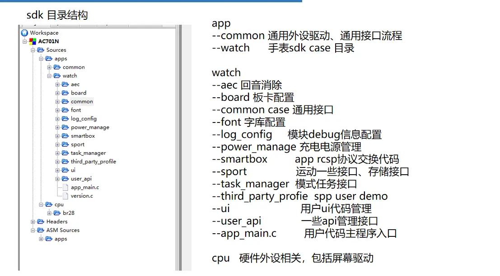
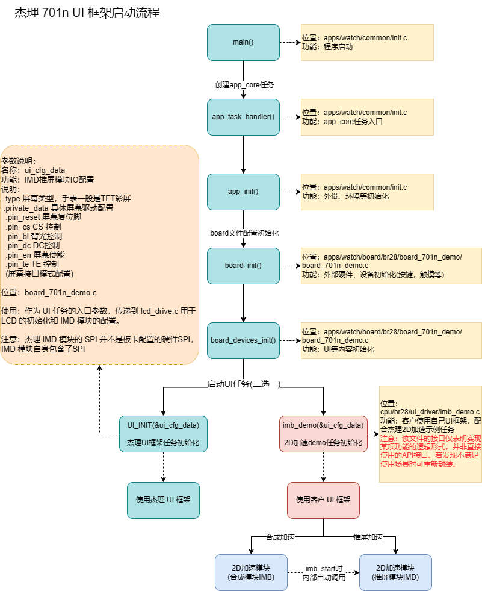
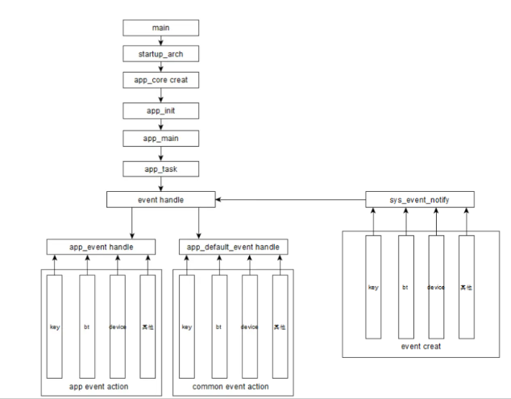
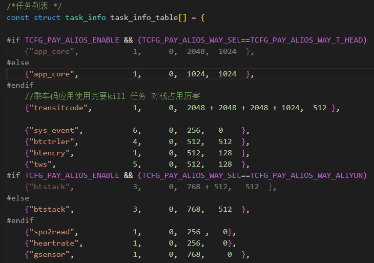
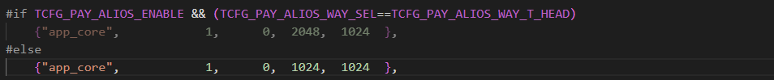
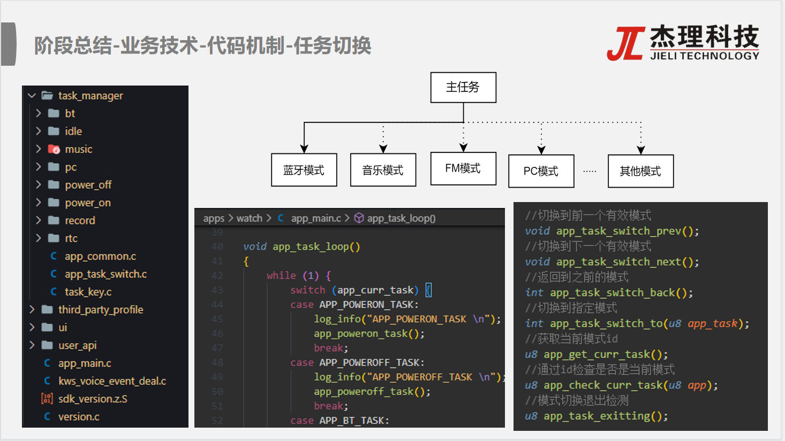
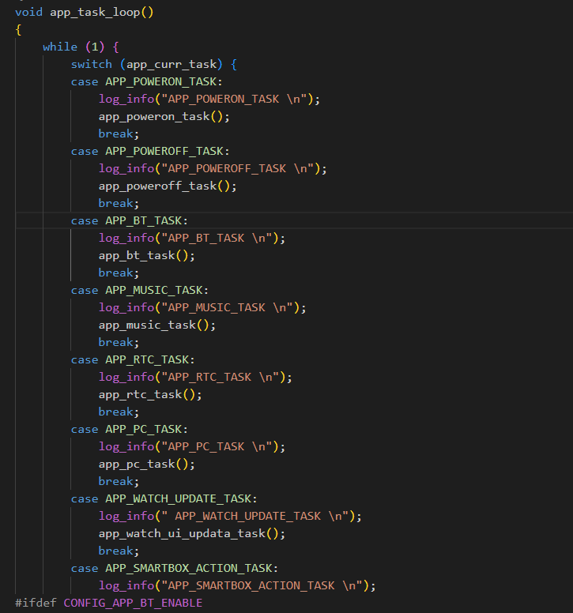
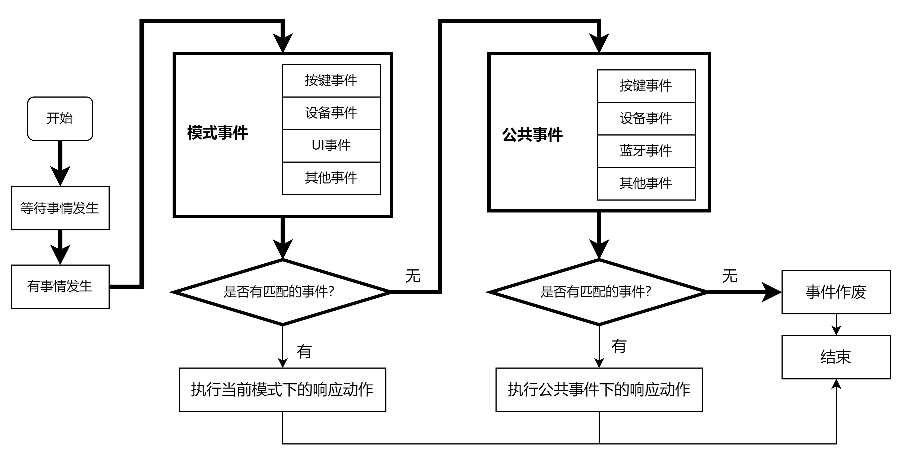
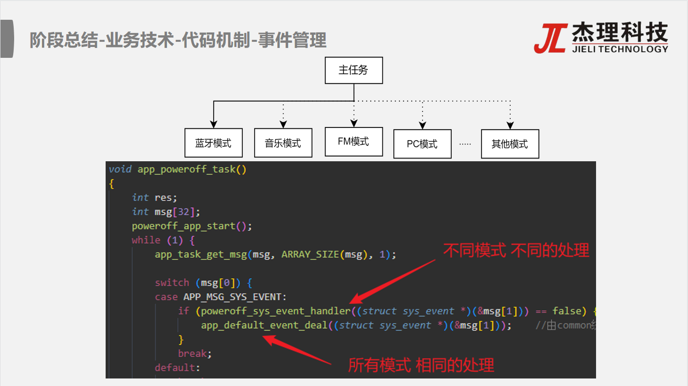

# 4.16

## JL7012

JL7012简介：QNF52 6*6封装 ，蓝牙V5.3双模单芯片，双核2*192MHz，内置2D图形加速；支持480*480@60Hz分辨率，支持蓝牙通话，支持手表本地音乐播放，支持连接蓝牙耳机播放音乐，支持录音，支持心率、血氧、血压、心电、血糖、睡眠等健康检测。

**产品特点：**

**1.高性能双核CPU+双模蓝牙V5.3**

**2.双核、主频2*192MHz；**

3.LE Audio，实现一对多连接；

4.刷屏流畅顺滑：480*480@60fps

5.高主频、2D图像加速、96MHz QSPI、bmp/JPEG/PNG硬件解码；

6.硬件2D图形加速：

7.可实现旋转、缩放、半透明等效果；

8.超低功耗、超长待机

9.整机双连接待机300uA；

10.本地音乐播放+连接TWS蓝牙耳机播放；

11.可直接播放手表内置的音乐或通过连接蓝牙耳机播放；

12.播放时可歌词同步；

13.安卓/IOS一键连接，操作便捷；

14.BLE和蓝牙音频同时连接，不需连接2次；

15.直接蓝牙耳机接听电话，一拖二无感切换：

16.手表同时连接手机和 蓝牙耳机时，来电时直接蓝牙耳机接听电话;

17.高清录音

18.蓝牙通话录音和周围环境录音；

19.高清蓝牙通话；

20.支持单/双唛 ENC通话降噪算法；

21.支持在线/离线语音换醒

22.可通过语音操控手表，释放双手；

23.超高性价比：性能好，价格优

从描述上看JL7012 更接近于一个 **SoC (System on a Chip)**，而不是传统的微控制器。

以下是一些原因：

- **双核高性能CPU**：传统的微控制器通常是单核或性能较低的处理器。JL7012 具备双核 192MHz 的 CPU，这表明它具有更强的处理能力，可以运行更复杂的操作系统和应用程序。
- **内置2D图形加速**：微控制器通常不具备硬件图形加速能力，而 JL7012 内置 2D 图形加速，这表明它主要面向需要图形处理的应用，例如智能手表。
- **支持高分辨率显示**：支持 480*480@60Hz 分辨率，这进一步证实了其在图形处理方面的能力。
- **集成多种功能**：集成了蓝牙、音频播放、录音、健康监测等多种功能，这表明它是一个高度集成的系统级芯片，而不是一个简单的控制芯片。

综上所述，JL7012 芯片集成了处理器、存储器、外设接口和各种功能模块，更像是一个片上系统（SoC），能够独立完成复杂的任务。

### 疑问

**他的SDK中带有任务关键词，创建任务，这意味着SDK中有自带的系统？**

在传统的微控制器开发中，开发者通常需要自己实现任务调度和管理，或者使用一些轻量级的实时操作系统（RTOS）。但如果SDK本身提供了任务创建的接口，这通常意味着SDK内部已经集成了一个操作系统或者一个简易的任务调度器。

从提供的SDK文档来看，它侧重于应用开发，例如蓝牙、音频、UI、健康监测等。为了更好地支持这些复杂的功能，SDK内部很可能需要一个系统来管理和调度各个任务，例如：

- 蓝牙协议栈的实现
- 音频数据的处理和播放
- UI的渲染和交互
- 健康数据的采集和分析

这些功能通常需要并发执行，SDK自带的系统可以更好地管理这些任务的调度和资源的分配。

## 701目录结构



## 板级配置

### 作用？

板级配置的主要作用是选择不同的板级，使SDK能够针对特定的硬件平台进行适配和优化。   

具体来说，板级配置有以下作用：

1. **选择不同的板级**。例如，`CONFIG_BOARD_701N_DEMO`、`CONFIG_BOARD_7012A_DEMO`等配置项，用于选择当前项目使用的具体硬件板型。
2. **适配硬件平台**。不同的板型可能具有不同的外设配置、引脚定义、内存布局等。通过板级配置，SDK可以针对特定的硬件平台进行适配和优化。 

###   使用

`apps\watch\board\br28\board_config.h`中通过注释来选择一个板级配置，每个可共用对应的ui驱动代码，但是必须能够下载进去。

apps\watch\board\br28中有各板级配置文件的实现。

- 以使用`CONFIG_BOARD_701N_DEMO`板级配置为例，打开`board_ac701n_demo_cfg.h`文件，该文件主要对芯片的外设功能及io进行配置。

### 具体配置了什么

这个板级配置文件主要配置了以下内容：

1. **模块使能配置**：
   - 各种功能模块的开关，如UART、IIC、SPI、USB、FLASH、SD卡、PSRAM、按键、触摸、音频、充电、LED等。
   - 通过`ENABLE_THIS_MOUDLE`和`DISABLE_THIS_MOUDLE`宏定义来控制各模块的启用或禁用。
2. **硬件接口配置**：
   - 配置了各种外设的硬件引脚，例如UART的TX/RX引脚、IIC的CLK/DAT引脚、SPI的CLK/DO/DI引脚等。
   - 定义了具体的GPIO端口，例如`IO_PORTA_04`、`IO_PORTG_03`等。
3. **通信协议配置**：
   - 配置了UART、IIC、SPI等通信协议的参数，例如波特率、时钟频率、工作模式（主/从）、数据宽度等。
4. **音频相关配置**：
   - 音频输入输出配置，包括ADC/DAC、MIC、扬声器、音量控制等。
   - 音效处理配置，例如EQ、DRC、混响、回声等。
5. **蓝牙相关配置**：
   - 蓝牙功能模块的使能，例如BLE、经典蓝牙、TWS、SPP、HFP等。
   - 蓝牙连接参数、设备数量、广播模式等。
6. **传感器配置**：
   - 配置了G-sensor、HR-sensor、BMP-sensor等传感器的使能及参数。
   - 定义了传感器使用的IIC/SPI接口及中断引脚。
7. **UI相关配置**：
   - 配置了LCD、触摸屏、LED等显示和交互模块的参数。
   - 定义了UI功能模块的使能，例如表盘、菜单、闹钟、计时器、音乐播放器等。
8. **电源管理配置**：
   - 配置了低功耗模式、充电参数、电源模式（LDO/DCDC）等。
   - 定义了系统时钟源及频率。
9. **文件系统配置**：
   - 配置了FATFS文件系统的使能及参数。
   - 定义了存储设备（如SD卡、FLASH）的使用方式。
10. **AI及智能功能配置**：
    - 配置了语音识别、在线调试、智能音箱等功能的使能。
    - 定义了与AI相关的接口及参数。
11. **编解码格式支持**：
    - 配置了音频编解码格式的支持，例如MP3、WAV、FLAC、SBC等。
12. **产测及调试配置**：
    - 配置了生产测试功能的使能及参数。
    - 定义了调试接口（如UART）的引脚及参数。
13. **其他功能配置**：
    - 配置了RTC、充电舱、支付功能、运动记录等特定功能模块的参数。
    - 定义了一些全局性的系统参数，例如自动关机时间、电量检测、复位引脚等。

总结来说，这个配置文件是一个高度模块化的板级配置文件，涵盖了硬件接口、外设驱动、功能模块、系统参数等多个方面的配置，主要用于定义开发板的功能特性和硬件资源分配。

### 好处

这个板级配置文件（`board_701n_demo_cfg.h`）确实将芯片的所有功能和硬件都进行了详细的配置。以下是它在二次开发中的优势和作用：

**配置全面性**

- **涵盖所有功能模块**：从UART、IIC、SPI等基础外设，到蓝牙、音频、RTC、传感器、LCD触摸屏等高级功能，几乎涵盖了所有可能用到的硬件和软件功能。
- **详细参数设置**：不仅定义了功能的使能状态（如`ENABLE_THIS_MOUDLE`或`DISABLE_THIS_MOUDLE`），还提供了具体的参数配置（如波特率、时钟频率、引脚选择等）。

```c
#define TCFG_UART0_ENABLE                   ENABLE_THIS_MOUDLE
#define TCFG_UART0_TX_PORT                 IO_PORTA_04
#define TCFG_UART0_BAUDRATE                1000000
```

上述代码不仅启用了UART0，还指定了TX引脚为`IO_PORTA_04`，波特率为`1Mbps`。

**极大方便二次开发**

- **直接调用接口**：通过这些配置，开发者可以直接使用已经实现的功能接口，而无需重新编写驱动代码。
- **快速修改功能**：只需修改对应的宏定义即可启用或禁用某个功能，或者调整其参数。

如果需要启用FM功能，只需将以下宏改为`ENABLE_THIS_MOUDLE`：

```c
#define TCFG_APP_FM_EN                     1
```

**功能裁剪**

- **裁剪不必要的功能**：通过禁用不需要的功能模块，可以减少资源占用（如RAM、Flash）、降低功耗，并优化系统性能。
- **按需配置**：开发者可以根据实际需求，只保留必要的功能，从而简化代码和硬件设计。

如果项目不需要CAT1（4G通话）功能，可以通过以下配置将其完全禁用：

```c
#define TCFG_CAT1_UNISOC_ENABLE            DISABLE
#define TCFG_CAT1_AICXTEK_ENABLE          DISABLE
```

**提高开发效率**

- **集中管理配置**：所有配置集中在单个头文件中，便于管理和维护。
- **减少错误风险**：通过统一的宏定义，避免了分散配置可能导致的不一致问题。

示例：

对于LCD屏驱的选择，可以通过以下配置快速切换不同的屏驱：

```c
#define TCFG_LCD_SPI_SH8601A_ENABLE        ENABLE_THIS_MOUDLE
#define TCFG_LCD_SPI_ST7789V_ENABLE       DISABLE_THIS_MOUDLE
```

**支持多种应用场景**

- **适配不同硬件**：通过条件编译（如`#if`、`#ifdef`等），支持不同硬件平台或应用场景的切换。
- **灵活扩展**：即使需要新增功能，也可以基于现有配置框架进行扩展。

针对测试样机的特殊配置：

```c
#define TCFG_CAT1_UNISOC_BOARD_TEST       	1	// 测试样机

#if TCFG_CAT1_UNISOC_BOARD_TEST
#undef TCFG_UART0_TX_PORT
#define TCFG_UART0_TX_PORT                 IO_PORT_DP
#endif
```

**文档化配置**

- **注释详尽**：每个配置项都有详细的注释，说明其用途、取值范围以及注意事项。
- **易于理解**：即使是新手开发者，也能通过阅读注释快速理解配置的意义。

```c
/*MIC LDO电流档位设置：
    0:0.625ua    1:1.25ua    2:1.875ua    3:2.5ua*/
#define TCFG_AUDIO_ADC_LD0_SEL             2
```

**低功耗优化**

- **低功耗模式配置**：提供了丰富的低功耗相关配置，帮助开发者根据具体需求优化功耗。
- **动态调整**：支持根据运行状态动态调整功能模块的开启/关闭。

```c
#define TCFG_LOWPOWER_LOWPOWER_SEL         DEEP_SLEEP_EN
#define TCFG_LOWPOWER_RAM_SIZE             0 // 低功耗掉电RAM大小
```

### **实际开发中的应用**

假设你需要开发一个智能手表，仅需要蓝牙音乐播放和心率监测功能，可以按照以下步骤裁剪配置：

```c
启用必要功能：
#define TCFG_APP_BT_EN                  1
#define TCFG_HR_SENSOR_ENABLE          1
    
禁用不必要功能：
#define TCFG_APP_FM_EN                 0
#define TCFG_APP_PC_EN                 0
#define TCFG_APP_RECORD_EN             0
    
调整参数：
    设置蓝牙音乐EQ：
    #define TCFG_BT_MUSIC_EQ_ENABLE       1
    配置心率传感器：
    #define TCFG_HR_SENOR_USER_IIC_TYPE   1 // 使用硬件IIC
```

### **总结**

这个配置文件的设计理念是“全功能覆盖 + 按需裁剪”，极大地方便了开发者进行二次开发。通过简单的宏定义修改，即可快速调整系统的功能和性能，满足不同应用场景的需求。同时，它也为后续的维护和升级提供了清晰的结构和文档化的参考。


## 软件流程

### UI框架启动流程



`apps\watch\common\init.c`

- `main()` 函数是程序的入口，完成了**系统时钟配置、看门狗关闭、操作系统初始化、硬件架构初始化等操作**。

  - main中创建了app_core任务

  - ```c
    task_create(app_task_handler, NULL, "app_core");
    ```

- `app_task_handler()` 是应用程序的核心任务入口，调用了 `app_init()` 和 `app_main()`，分别完成系统的初始化和主逻辑。

  - `app_init()`中有`board_init();`
  - 直接调用到`apps\watch\board\br28\board_701n_demo\board_701n_demo.c`进行所有硬件资源的初始化
  - `UI_INIT(&ui_cfg_data);`这是杰理的UI框架任务初始化
  - **UI框架可以二选一，但是文档中没有说明怎么选择**
    - 杰理UI与用户UI

### SDK启动流程

- 程序的入口函数`main( )`位于`init.c`文件，而main主函数中调用`setup_arch( )`进行了内存/时钟等初始化，并创建了模式任务处理，并在任务处理`app_task_handler( )`中分别分别进行了任务的初始化`app_init( )`和任务的调度处理`app_main( )`。
  - 感觉跟UI框架差不多啊
- `steup_arch( )`函数：该函数主要进行内存的初始化、看门狗初始化、时钟的初始化、初始io及系统时间的初始化等芯片的初始化功能(大致理解为程序的运行环境做准备)。
  - **那板级配置文件的初始化跟这个的区别在哪里？？？**
- `app_init( )`函数：该函数则是为任务(模式)进行准备，进行解码初始化、按键开机检测和CUP复位部分操作等。
- `app_main( )`函数：任务主函数`app_main`则在`app_mian.c`中进行处理，其中比较重要的是对开机初始模式进行设置，并循环根据`app_task_loop( )`获取并设置的最新的模式任务。



## 任务管理

### 任务列表

任务信息统一由`task_table.c`的`task_info_table`任务列表进行管理：



参数（从左到右）：

- 任务名 (名字长度不能超过`configMAX_TASK_NAME_LEN`字节)
- 任务优先级（0-7，越大优先级高，优先级数量由`configMAX_PRIORITIES`决定）
- 任务运行的位置（0：CPU0  1：CPU1）
  - 双核CPU
- 任务的堆栈大小, 单位(u32)
- 任务的queue大小，单位(byte)

**FreeRTOS创建任务时也需要指定任务栈大小，任务优先级。**

### 例子

利用`task_create`新建任务时：

```c
task_create(app_task_handler, NULL, "app_core");
```

底层会根据传入的任务名称参数，扫描`task_info_table`导入对应的任务参数信息



**所以创建一个任务的话，除了使用创建任务API之外，还需要到`task_info_table`中设置任务的相关参数。**

### 主任务的模式切换

当开始通过`app_main( )`函数设置首任务或进行任务模式切换时，便会执行`app_task_loop( )`判定并开始相应模式的任务，当发生任务模式更改时，会根据变量`app_curr_task`跳转执行。

`"app_core"`的模式切换





#### 疑问

- **这形式看起来不像各任务并发啊，像是基于状态机的轮询，通过快速切换任务达到并发效果？**

- **双核的话一次性可以执行两个任务啊？**

## 事件管理

**看来就是SDK自带调度系统了。**

基于消耗型消息队列的事件处理机制，消息处理又分为**模式消息处理**和**公共消息处理**，当有消息事件推出时，先在当前模式进行处理响应的消息后，若不进行处理(返回false)后才会丢到公共事件中去判定处理。

事件处理机制：



- 以`poweroff`模式为例，当推送按键消息`KEY_UI_POWEROFF`出来后，会先在`poweroff`模式事件入口函数`poweroff_sys_event_handler()`中执行并判定消息是否已经处理，若未处理(返回false)，则推送到公共事件处理函数`app_default_event_deal()`中的公共按键处理函数`app_common_key_msg_deal( )`进行处理。
- 比如在音乐模式下的话，消息事件肯定优先使用音乐模式的逻辑处理。



## 低功耗机制

低功耗检测节点状态是软件层面人为设置的条件。系统底层会一直检测低功耗节点链表，遍历检测所有注册的低功耗检测节点，如果**所有低功耗检测节点**都满足进入低功耗条件，则系统会进入低功耗模式。

若系统在低功耗模式中，检测到某节点被激活，则退出低功耗模式。

### 流程

#### 描述术语

- sniff --> 指蓝牙软件层次上，进入了sniff状态，只有软件进入sniff，硬件才能进入低功耗
  - **所有低功耗检查点满足条件时，才会进入低功耗**
- power_down --> CPU、晶振、外设停止，**ram保持**，能保持蓝牙正常连接，特指蓝牙低功耗
  - **什么原理？蓝牙连接不需要CPU执行软件的逻辑支持吗？**
- power_off --> 关机，整个芯片停止，**只有唤醒口和RTC模块有效**，蓝牙断连，唤醒从头跑
  - **RTC有独立的电源？备份电源？单独从电池中分一条支路？？？**
- sleep、low_power --> 等同于power_down

#### 低功耗层次

根据芯片设计和产品需求，可分为几个等级层次：

- 关机(CPU、RAM、外设均停止、IO高阻态)，功耗最低，唤醒需要重新开机。
- 低功耗1(CPU和外设均停止，RAM保留，IO高阻态)，主要是主控耗电，唤醒从sleep_exit_callback()开始。
- 低功耗2(CPU停止，外设pwm_led跟RAM保留，IO保持控制外围电路)，主要是板子耗电，唤醒从sleep_exit_callback()开始。
  - **对于低功耗2，CPU都停止了，PWM还能工作？**
  - 在低功耗2模式下，CPU的主要功能暂停，以减少功耗，但PWM LED 驱动等特定的外设电路仍然可以独立于CPU运行，以支持某些特定的功能，例如：
    - **低功耗状态下的指示灯显示**：即使CPU处于休眠状态，PWM仍然可以控制LED闪烁或保持特定状态，以向用户提供设备状态信息。
    - **简单的硬件动画**：某些简单的动画效果，可能通过预编程的PWM序列来实现，而不需要CPU的持续干预。
- 降频、低速、大间隔，主要是应用需求耗电。
- 全频、高速、大数据，功耗最高，性能最好。

#### 蓝牙电源工作方式

蓝牙电源有2种工作方式，LDO 和 DCDC。**对于常待机、平均功耗、瞬态功耗有要求的，必须选用DCDC方式。**

- LDO

```
#define TCFG_LOWPOWER_POWER_SEL				PWR_LDO15 //硬件成本最低，不需要贴电感，SW悬空即可。
```

- DCDC

```
#define TCFG_LOWPOWER_POWER_SEL				PWR_DCDC15 //只有部分芯片支持，需要看标准原理图。
```

