# 日志机制

**选择具体板级配置后，某一个具体demo下的配置：**

```c
//*********************************************************************************//
//                                 UART配置                                        //
//*********************************************************************************//
#ifdef CONFIG_DEBUG_ENABLE
#define TCFG_UART0_ENABLE					ENABLE_THIS_MOUDLE                     //串口打印模块使能
#else
#define TCFG_UART0_ENABLE					DISABLE_THIS_MOUDLE						//串口打印模块使能
#endif
#define TCFG_UART0_RX_PORT					NO_CONFIG_PORT                         //串口接收脚配置（用于打印可以选择NO_CONFIG_PORT）
#define TCFG_UART0_TX_PORT  				IO_PORTB_03                            //串口发送脚配置
#define TCFG_UART0_BAUDRATE  				1000000                                //串口波特率配置
```

**调试模式与串口使能**：串口的使能与调试模式 (`CONFIG_DEBUG_ENABLE`) 相关。只有在定义了调试模式并使能串口的情况下，才会开启日志输出。

**宏名相同但宏体不同**：`TCFG_UART0_ENABLE` 宏在调试模式开启和关闭时的宏名相同，但宏体不同，分别对应 `ENABLE_THIS_MODULE` 和 `DISABLE_THIS_MODULE`。这实际上是根据调试模式来决定是否使能串口。

**串口接收 (RX) 配置**：在提供的串口配置中，`TCFG_UART0_RX_PORT` 被配置为 `NO_CONFIG_PORT`，即串口接收功能被禁用。文档中提到，如果只用于打印日志，确实不需要RX，这样可以节省IO口资源。

- **如果 CONFIG_DEBUG_ENABLE 被定义**（例如通过 #define CONFIG_DEBUG_ENABLE 或编译器选项 -DCONFIG_DEBUG_ENABLE），那么预处理器会**进入 #ifdef 块内的代码**，将 TCFG_UART0_ENABLE 定义为 ENABLE_THIS_MOUDLE。

- **如果 CONFIG_DEBUG_ENABLE 未被定义**，则**预处理器会进入 #else 块**，将 TCFG_UART0_ENABLE 定义为 DISABLE_THIS_MOUDLE。

## 总开关

`apps\watch\include\app_config.h`中

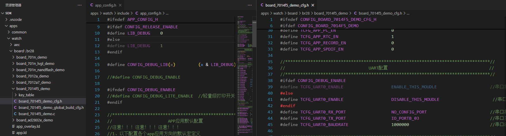

把宏定义注释掉的话，调试模式就关闭了。

### 疑问

**定义宏时可以只定义宏名不定义宏体？**

是的，定义宏时可以只定义宏名而不定义宏体。这种用法在C/C++中是合法的，并且非常常见。

主要用于条件编译，控制代码的编译路径，例如启用或禁用功能模块。

在您的代码中，CONFIG_DEBUG_ENABLE 就是一个只定义宏名的宏，它控制了 TCFG_UART0_ENABLE 的定义，从而决定串口打印模块是否启用。

## 库日志开关

```c
#ifdef CONFIG_RELEASE_ENABLE
#define LIB_DEBUG    0
#else
#define LIB_DEBUG    1
#endif

#define CONFIG_DEBUG_LIB(x)         (x & LIB_DEBUG)
```

**没有找到哪里定义了`CONFIG_RELEASE_ENABLE`，所以进入`#define LIB_DEBUG  1`  ？**

## 异常中断开关（断言）

`apps\watch\log_config\lib_system_config.c`中

```c
///异常中断，asser打印开启
#ifdef CONFIG_RELEASE_ENABLE
const int config_asser         = 0;
#else
const int config_asser         = 1;
#endif

const int config_system_info   = 0;
```

注意：打开异常中断后，当异常发生时，会打印异常中断信息，**且系统不会自动重启。**

因此**在生产时，务必关闭异常中断**，使设备发生异常时系统能自动重启，不至于变砖。

用户使用时，设备出现异常中断的话，就会变砖。开发人员还可以再调试再烧录。

关闭打印和关闭异常中断是两个开关，没关异常中断，只是关打印，系统异常死机一样不会自动重启。

**生产环境下把日志都关掉后，出现设备出现异常可以利用看门狗使设备复位重启。**

### 疑问

如果要开启库日志和异常中断开关的话，在哪里定义宏？`apps\watch\include\app_config.h`

## 日志等级配置

`include_lib\system\generic\log.h`通过更改`__LOG_LEVEL`设置对应的打印等级。

### **日志等级定义**

定义了多个日志等级宏：

```c
#define   __LOG_VERB      0
#define   __LOG_DEBUG     1
#define   __LOG_INFO      2
#define   __LOG_WARN      3
#define   __LOG_ERROR     4
#define   __LOG_CHAR      5
```

这些宏表示不同的日志等级，从低到高依次为：`__LOG_VERB`（最低）、`__LOG_DEBUG`、`__LOG_INFO`、`__LOG_WARN`、`__LOG_ERROR`、`__LOG_CHAR`（最高）。

### **默认日志等级**

默认的日志等级由以下代码定义：

```c
#ifndef __LOG_LEVEL
#define __LOG_LEVEL 0
#endif
```

如果未定义 `__LOG_LEVEL`，则默认值为 `0`（即 `__LOG_VERB` 等级）。

在发布模式下（`CONFIG_RELEASE_ENABLE` 宏被定义时），日志等级会被强制设置为 `0xff`，此时所有日志输出都会被禁用：

```c
#ifdef CONFIG_RELEASE_ENABLE
#undef __LOG_LEVEL
#define __LOG_LEVEL 0xff
#endif
```

### **日志输出控制**

根据当前日志等级 `__LOG_LEVEL` 和日志类型（如 `__LOG_VERB`、`__LOG_DEBUG` 等），通过条件编译决定是否输出日志。

```c
#if __LOG_LEVEL > __LOG_VERB
#define log_v(...) do {} while (0)
#elif defined __LOG_ENABLE
#define log_v(...) log_print(__LOG_VERB, NULL, __VA_ARGS__)
#else
#define log_v(...) printf(__VA_ARGS__)
#endif
```

- 如果 `__LOG_LEVEL` 大于当前日志等级（如 `__LOG_VERB`），则对应的日志宏（如 `log_v`）会被定义为空操作 `do {} while (0)`，从而禁用该等级的日志输出。
- 如果 `__LOG_LEVEL` 小于或等于当前日志等级，并且定义了 `__LOG_ENABLE`，则调用 `log_print` 函数输出日志。
- 如果未定义 `__LOG_ENABLE`，则直接使用 `printf` 输出日志。
- 类似的逻辑适用于其他日志等级宏（如 `log_d`、`log_i`、`log_w`、`log_e` 等）。

### **日志功能启用与禁用**

- 如果未定义 `__LOG_ENABLE`，则所有日志相关功能（如 `log_dump`、`log_putchar` 等）会被禁用，定义为空操作 `do {} while(0)`。
- 如果定义了`__LOG_ENABLE`，则提供完整的日志功能接口，例如：
  - `log_output_lock` 和 `log_output_unlock`：用于日志输出的锁机制。
  - `log_early_init`：初始化日志缓冲区。
  - `log_print`：核心日志输出函数。
  - `log_dump`：输出二进制数据的十六进制表示。
  - `log_flush`：刷新日志缓冲区。

### 疑问

**就是说整体项目会定义一个日志等级，如果某一个地方的日志等级大于项目日志等级的话，就不会打印，否则就会打印？**

`log.h`中定义了全部的日志等级。当某一个地方的日志等级设置后，打印日志时，会通过比较来确定当前日志处于什么等级的日志打印逻辑，从低到高依次比较，第一个小于的就是属于这个等级。大于这个等级的就会做空操作，比较逻辑继续往下走。

没有定义日志等级的话，默认是0等级，有日志打印的话，就会执行第一个日志等级打印逻辑。

```c
#define   __LOG_VERB      0
#define   __LOG_DEBUG     1
#define   __LOG_INFO      2
#define   __LOG_WARN      3
#define   __LOG_ERROR     4
#define   __LOG_CHAR      5

struct logbuf {
    u16 len;
    u16 buf_len;
    char buf[0];
};

#define __LOG_ENABLE

#ifndef __LOG_LEVEL
#define __LOG_LEVEL 0
#endif

#ifdef CONFIG_RELEASE_ENABLE
#undef __LOG_LEVEL
#define __LOG_LEVEL 0xff
#endif

#if __LOG_LEVEL > __LOG_VERB
#define log_v(...) do {} while (0)
#elif defined __LOG_ENABLE
#define log_v(...) log_print(__LOG_VERB, NULL, __VA_ARGS__)
#else
#define log_v(...) printf(__VA_ARGS__)
#endif


#if __LOG_LEVEL > __LOG_DEBUG
#define log_d(...)  do {} while (0)
#elif defined __LOG_ENABLE
#define log_d(...)  log_print(__LOG_DEBUG, NULL, __VA_ARGS__);
#else
#define log_d(...) printf(__VA_ARGS__)
#endif

#if __LOG_LEVEL > __LOG_INFO
#define log_i(...)  do {} while (0)
#elif defined __LOG_ENABLE
#define log_i(...) log_print(__LOG_INFO, NULL, __VA_ARGS__);
#else
#define log_i(...) printf(__VA_ARGS__)
#endif

#if __LOG_LEVEL > __LOG_WARN
#define log_w(...)  do {} while (0)
#elif defined __LOG_ENABLE
#define log_w(...) log_print(__LOG_WARN, NULL, __VA_ARGS__);
#else
#define log_w(...) printf(__VA_ARGS__)
#endif

#if __LOG_LEVEL > __LOG_ERROR
#define log_e(...)  do {} while (0)
#elif defined __LOG_ENABLE
#define log_e(...) log_print(__LOG_ERROR, NULL, __VA_ARGS__);
#else
#define log_e(...) printf(__VA_ARGS__)
#endif

#if __LOG_LEVEL > __LOG_CHAR
#define log_c(x)  do {} while (0)
#elif defined   __LOG_ENABLE
#define log_c(x)  putchar(x)
#else
#define log_c(x)
#endif
```

### 示例

在`cpu\br28\pwm_led.c`中一开始就定义了日志等级。

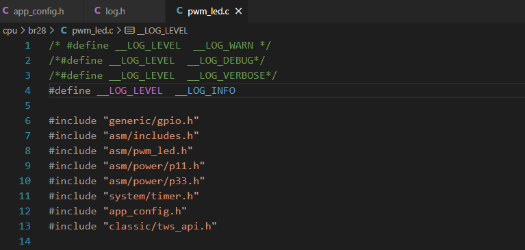

在 `pwm_led.c` 文件中，日志打印主要通过 `led_debug` 和 `led_err` 宏来实现。这些宏的定义和使用如下：

#### 宏定义

在文件的开头部分，定义了 `led_debug` 和 `led_err` 宏：

```c
#ifdef PWM_LED_DEBUG_ENABLE
#define led_debug(fmt, ...) 	g_printf("[PWM_LED] "fmt, ##__VA_ARGS__)
#define led_err(fmt, ...) 		r_printf("[PWM_LED_ERR] "fmt, ##__VA_ARGS__)
#else
#define led_debug(...)
#define led_err(...)
#endif
```

#### 宏启用

默认情况下，`PWM_LED_DEBUG_ENABLE` 宏是注释掉的：

```c
//#define PWM_LED_DEBUG_ENABLE
```

如果需要启用日志打印，可以取消注释 `PWM_LED_DEBUG_ENABLE` 宏。

#### 日志打印调用

在文件中，`led_debug` 和 `led_err` 宏被广泛使用来输出调试信息和错误信息。以下是一些示例：

示例 1: 使用 `led_debug`

```c
static void pwm_clock_set(u8 _clock)
{
    u8 clock = _clock;
    u8 clk_val = 0;

    switch (clock) {
    case PWM_LED_CLK_RC32K:
        //RC_32K
        clk_val = 0b011; //LRC_OSC_200K
        /* P3_LRC_CON0 |= BIT(0); //Enable this clock */

        //RC_16M
        /* clk_val = 0b010; */
        /* P11_CLK_CON0 |= BIT(1); //Enable this clock */

        //RC_250K
        /* clk_val = 0b001; */
        /* P3_ANA_CON0 |= BIT(7); //Enable this clock */
        break;
    case PWM_LED_CLK_BTOSC_24M:
        //SYS_CLK:
        clk_val = 0b101;
        break;

    default:
        break;
    }

    //MO Note: Make sure P11 part have been patch key
    P11_P2M_CLK_CON0 &= ~(0b111 << 5);
    P11_P2M_CLK_CON0 |= (clk_val << 5);
    __this->clock = clock;
    led_debug("clock = 0x%x, clk_val= %d, P11_P2M_CLK_CON0 = 0x%x", __this->clock, clk_val, ((P11_P2M_CLK_CON0 >> 5) & 0b111));
}
```

示例 2: 使用 `led_err`

```c
static void _pwm_led_one_flash_display(u8 led_index, u16 led0_bright, u16 led1_bright,
                                       u32 period, u32 start_light_time, u32 light_time)
{
    __pwm_led_flash_common_handle(led_index, led0_bright, led1_bright, period);
    //step5: 周期亮灭配置
    //pwm1 duty0, duty1, duty2
    u8 pwm1_duty0 = 0;
    u8 pwm1_duty1 = 0;
    if (start_light_time != -1) {
        if (start_light_time >= period) {
            led_err("start_light_time config err");
            _pwm_led_off_display(); //led off
            return;
        }
        //指定从哪个时间亮,
        pwm1_duty0 = (256 * start_light_time) / period;
        pwm1_duty0 = (pwm1_duty0) ? pwm1_duty0 : 2;
        if ((start_light_time + light_time) > period) {
            pwm1_duty1 = 0; //只开duty0
        } else {
            pwm1_duty1 = (256 * light_time) / period;
            pwm1_duty1 = (pwm1_duty1) ? pwm1_duty1 : 2;
            if ((pwm1_duty0 + pwm1_duty1) > 0xFF) {
                pwm1_duty1 = 0 ;
            } else {
                pwm1_duty1 += pwm1_duty0;
            }
        }
    } else {
        pwm1_duty0 = (256 * light_time) / period;
        pwm1_duty0 = (pwm1_duty0) ? pwm1_duty0 : 2;
        pwm1_duty0 = 256 - pwm1_duty0;
    }

    if ((led_index == 2) && (light_time == -1)) { //互闪, 占满整个周期
        pwm1_duty0 = 2;
        pwm1_duty1 = 0;
    }
    _led_pwm1_duty_set(0xFF, pwm1_duty0, pwm1_duty1, 0, 0);

    //step6: enable led module
    _led_pwm_module_enable(1, 0);
}
```

- **宏定义**：`led_debug` 和 `led_err` 宏在 `PWM_LED_DEBUG_ENABLE` 宏定义时，分别调用 `g_printf` 和 `r_printf` 进行日志输出。
- **宏启用**：默认情况下 `PWM_LED_DEBUG_ENABLE` 是注释掉的，需要手动启用。
- **日志调用**：在文件中多个函数和代码块中使用 `led_debug` 和 `led_err` 进行调试和错误信息输出。

## 常用日志接口

以下都属于库打印，需要打开库打印宏

内存打印：`mem_printf`

时钟打印：`clock_dump`

任务状态：`task_info`

不掉电ram实时打：`mem_stats`

掉电ram实时打印：`mem_vlt_stats`

系统堆栈打印开关：`const int config_system_info = 1;`

# SDK裁剪

SDK裁剪，缩小app.bin的大小。SDK把整体功能和配置都实现了，但是可能项目并不需要这么多东西，可以适当裁剪。

## 裁剪SDK功能

https://www.kdocs.cn/l/cg0r2g7GMS2Y

先把该文件下载到本地，重命名把后缀的.doc去掉，你用notepad++打开这个文件，可以看到着色对比，然后找到看上图的板级配置文件的部分，这个文件是去掉所有功能的，你参考这样配置宏，根据你的需求去裁剪SDK ， 编译不过的，你看一下对应代码在哪里，自己处理一下，如果报错太多就不裁这个，裁别的功能 。

```c
diff --git a/apps/watch/board/br28/board_701n_demo/board_701n_demo_cfg.h b/apps/watch/board/br28/board_701n_demo/board_701n_demo_cfg.h
index f670a23..254f758 100644
--- a/apps/watch/board/br28/board_701n_demo/board_701n_demo_cfg.h
+++ b/apps/watch/board/br28/board_701n_demo/board_701n_demo_cfg.h
```

**这是板级配置文件的裁剪前后的差异对比**

## 原理

这是通过 `git diff` 生成的补丁文件，用于展示代码修改前后的差异。

### **标记含义**

在 `git diff` 的输出中，有以下几种常见的标记：

- **`+`**：表示新增的行。
- **`-`**：表示删除的行。
- **空格**：表示未更改的行（上下文）。

### **如何区分原本就有和裁剪后的内容**

- **原本就有的内容**：在 `diff` 输出中，以 `-` 开头的行表示被删除的内容，这些内容是原始文件中存在的。
- **裁剪后的内容**：以 `+` 开头的行表示新增或修改后的内容，这些内容是在裁剪或修改后保留下来的。

示例 3: `board_701n_demo_cfg.h`

```c
@@ -100,18 +100,18 @@
 //*********************************************************************************//
 //                                 FLASH 配置                                      //
 //*********************************************************************************//
-#define TCFG_NOR_FS                  		ENABLE_THIS_MOUDLE
+#define TCFG_NOR_FS                  		0//ENABLE_THIS_MOUDLE
```

- **原本就有**：`#define TCFG_NOR_FS ENABLE_THIS_MOUDLE`
  原始文件中启用了该模块。
- **裁剪后**：`#define TCFG_NOR_FS 0//ENABLE_THIS_MOUDLE`
  修改后禁用了该模块。

### **其他 Git 标志**

除了 `+` 和 `-`，还有以下常见的标志：

- **`@@`**：表示代码块的范围，格式为 `@@ -<起始行号>,<行数> +<起始行号>,<行数> @@`。
- **`diff --git`**：表示两个文件之间的差异。
- **`index`**：显示文件的哈希值，用于唯一标识文件版本。
- **`new file mode`**：表示新增文件及其权限模式。
- **`deleted file mode`**：表示删除文件及其权限模式。

## 裁剪提示音

打开 SDK 对应的 `..\701n_watch_release_v2.X.X\code\cpu\br28\tools\AC701N_config_tool`，进入配置工具入口—>选择编译前配置工具—>提示音配置

在SDK中有可视化配置工具，这里可以直接配置。

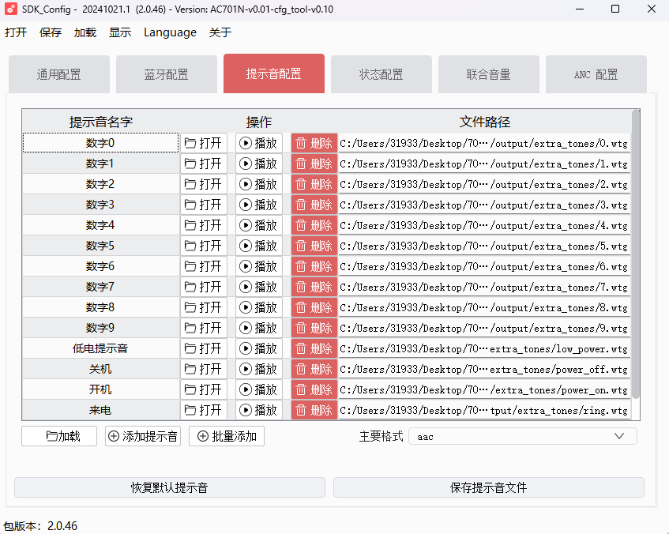

### 疑问

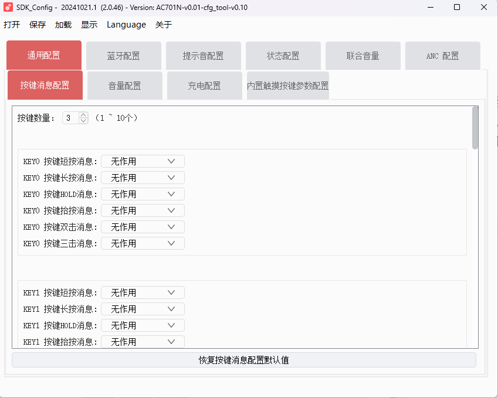

所有硬件配置都有的话，那开发做什么？在应用层面可以做出花来？那产品的难度就不在底层驱动上了。杰理芯片都针对应用场景把驱动和大概的功能全做了。。。那难度在什么地方？产品质量被什么决定？

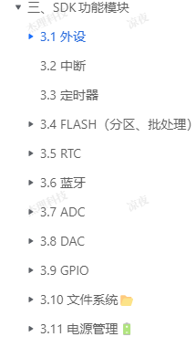

在这几个外设上做应用设计？

## 屏蔽打印

生产环境下关掉就行了。

# 杰理UI框架

参阅《UI布局工具使用说明》：

`..\701n_watch_release_v2.X.X\code\sdk\cpu\br28\tools\UI工程\doc`

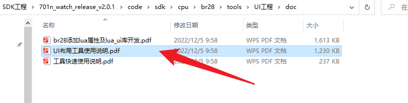

参阅《701N_UI编辑工具用户手册》和《UI工具快速使用说明》（表盘操作）：

`..\701n_watch_release_v2.X.X \doc\固件资料\UI`


SDK的UI工程在以下路径：

`..\701n_watch_release_v2.X.X\code\sdk\cpu\br28\tools\UI工程`

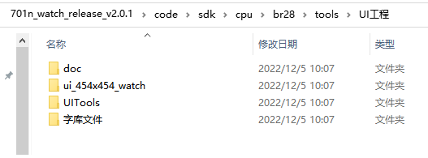

- doc：存放工具的相关说明文档
- UITools：存放相关的 UI 工具链
- 字库文件：主要是负责UI中多语言文字编码
- ui_454x454_watch：为 ui 工程主目录（新建 ui 工程需要参考该目录结构，也可以直接拷贝该文件夹，在该文件夹的基础上进行修改）

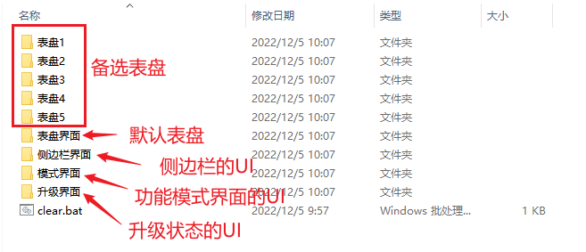

运行 UI 编辑工具，直接双击下图的”step1-打开 UI 绘图工具.bat”，通过脚本调用打开：

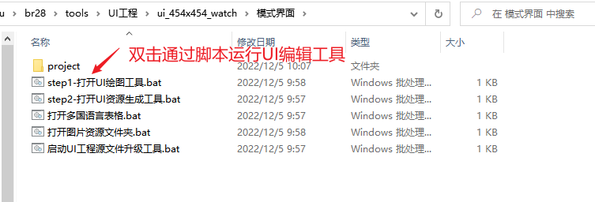

UI 编辑工具主界面如下图：

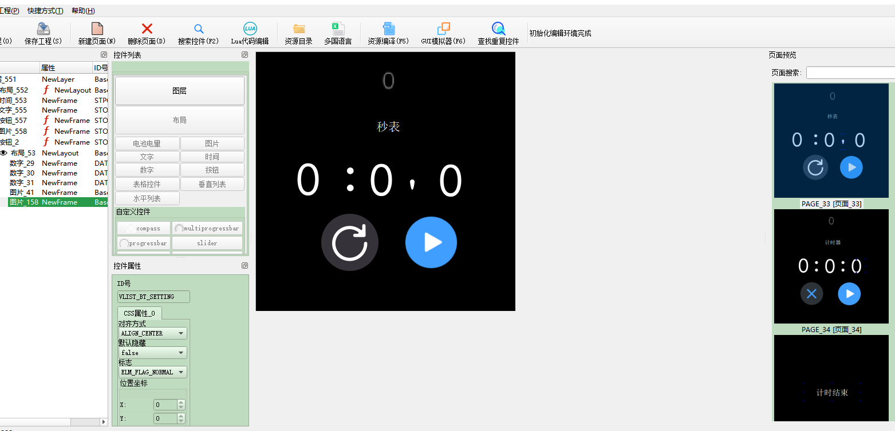

UI 编辑完成后，直接双击”资源编译”,生成相关的资源文件

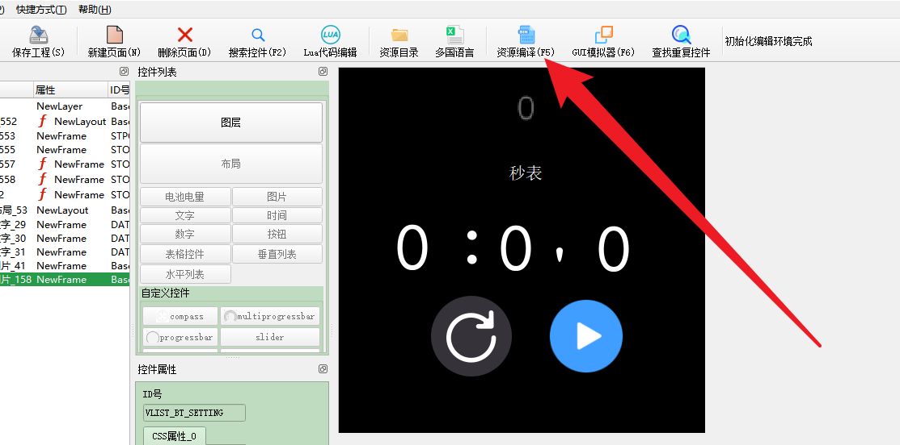

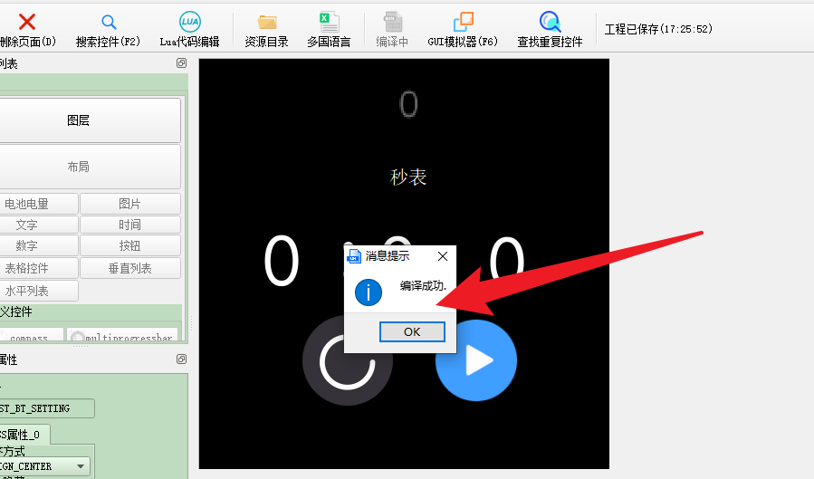

## UI 控件

### 控件的映射

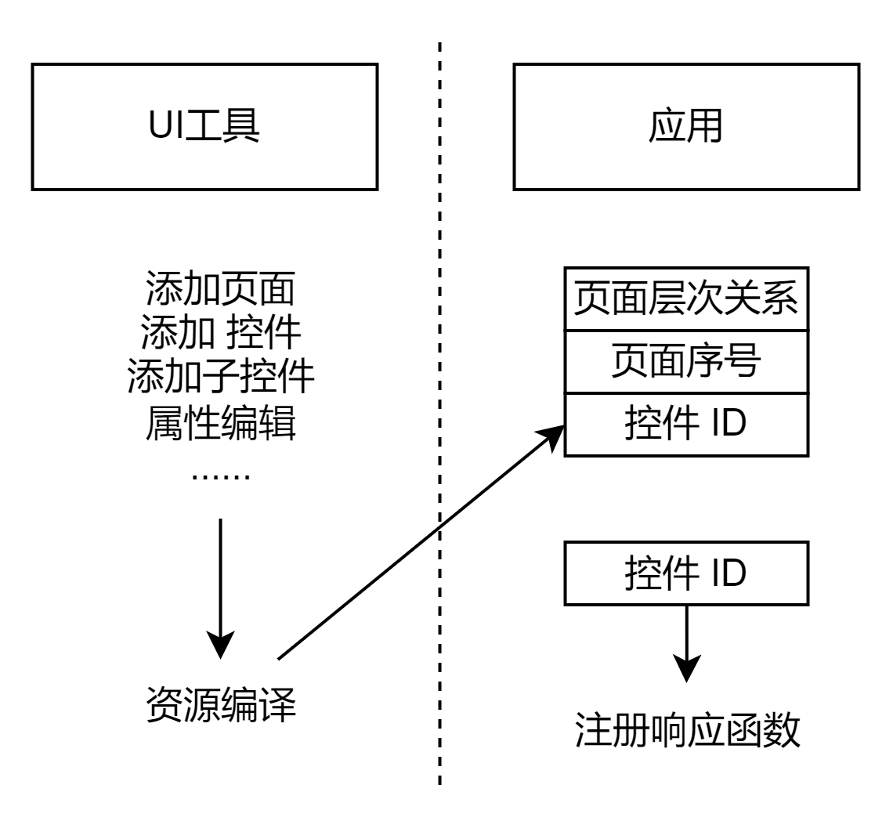

**UI工具的资源在应用中有对应的资源ID，可以使用这一些ID做功能。**

杰理 UI 基本流程：下图为UI编译工具链的工作流程，UI工程=Json文件+资源文件，Json文件上记录了UI参数信息（位置、尺寸等等）和资源索引地址，我们从UI编辑工具上改UI最后无非就是修改了Json文件内的内容而已，当然我们从脚本打开UI编辑工具时是自动读取读取Json文件参数来呈现。

- UI使用json文件组织

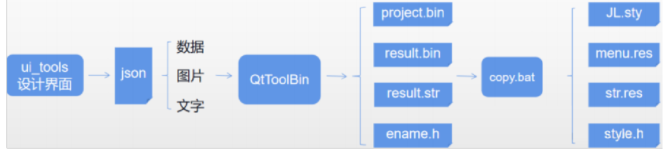


**资源编译后没有copy_file.bat这个文件？？？**

**板级配置文件选择错了。选对编译之后就有了**

#### 编译模式界面

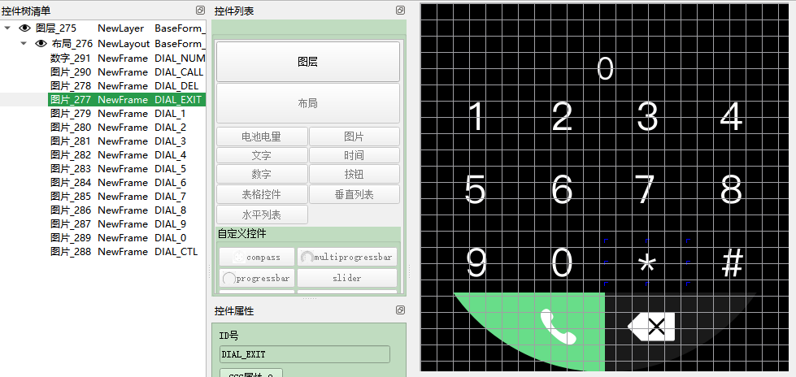

**对应的映射体现：**

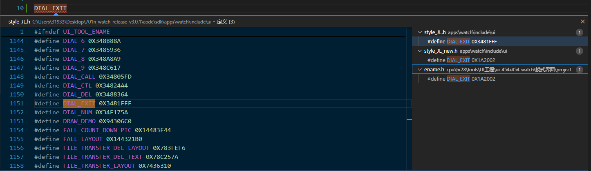

**跳转太慢了。。。**

**而且为什么控件ID不是唯一的？？？**

### 控件的响应

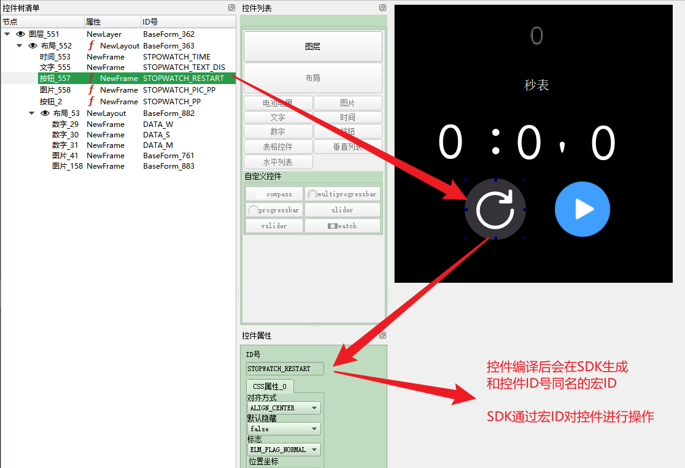

编译后，控件映射为SDK内的一个宏ID：

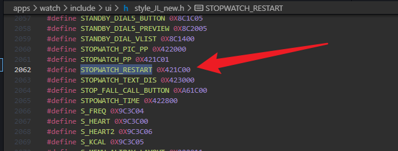

我们可以根据UI工具编译出的控件宏ID，给该控件注册一些响应逻辑，UI内核提供 3 种响应注册接口：


自己实现响应逻辑的接口，然后在代码里注册到UI内核，例如我在屏幕上触控某个UI控件，就会调用你给该控件注册的`.ontouch`接口。

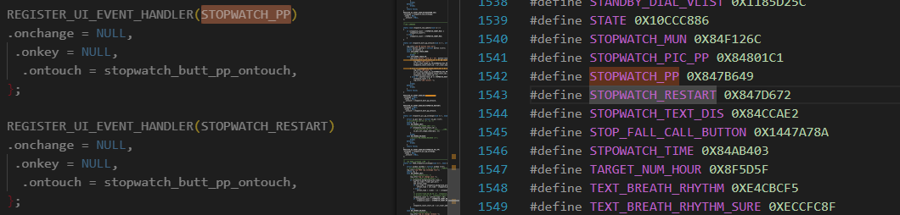

对应的UI控件ID对应着一个类型的处理函数：

```c
static int stopwatch_butt_pp_ontouch(void *ctrl, struct element_touch_event *e)
{
    log_info("LAQ PP button test ！");
    struct button *button = (struct button *)ctrl;
    switch (e->event) {
    case ELM_EVENT_TOUCH_DOWN:
        /* code */
        break;
    case ELM_EVENT_TOUCH_UP:
        log_info("button ->elm.id = %d", button->elm.id);
        if ((stopwatch_count_start_id == 0) && (button->elm.id == STOPWATCH_PP)) {
            log_info("LAQ start ");
            ui_pic_show_image_by_id(STOPWATCH_PIC_PP, 1);
            stopwatch_count_start_id = usr_timer_add(NULL, stopwatch_num_updata, 10, 1);

        } else if ((stopwatch_count_start_id != 0) && (button->elm.id == STOPWATCH_PP)) {
            log_info("LAQ puse ");
            ui_pic_show_image_by_id(STOPWATCH_PIC_PP, 0);
            usr_timer_del(stopwatch_count_start_id);
            stopwatch_count_start_id = 0;
        } else if ((button->elm.id == STOPWATCH_RESTART) && (stopwatch_count_start_id == 0)) {
            stopwatch_count = 0;
            log_info("LAQ restart ");
        }
        break;
    default:
        break;
    }
    return false;
}
```

该函数 `stopwatch_butt_pp_ontouch` 是一个按钮触摸事件的回调函数，用于处理秒表界面中按钮的交互逻辑。具体功能分解如下：

1. **日志记录**：函数开始时打印调试信息 `"LAQ PP button test ！"`。
2. **参数解析**：将传入的 `ctrl` 参数强制转换为 `struct button *` 类型，以便访问按钮的具体属性。
3. 事件类型判断：
   - 如果事件类型为 `ELM_EVENT_TOUCH_DOWN`（触摸按下），当前未定义具体操作。
     - 按下画面就开始变,人机交互体验不好。
   - 如果事件类型为`ELM_EVENT_TOUCH_UP`（触摸抬起），根据按钮 ID 和计时器状态执行以下逻辑：
     - **启动计时**：如果计时器未启动 (`stopwatch_count_start_id == 0`) 且按钮为暂停/播放按钮 (`button->elm.id == STOPWATCH_PP`)，则启动计时器并显示播放图片。
     - **暂停计时**：如果计时器已启动 (`stopwatch_count_start_id != 0`) 且按钮为暂停/播放按钮，则暂停计时器并隐藏播放图片。
     - **重启计时**：如果按钮为重启按钮 (`button->elm.id == STOPWATCH_RESTART`) 且计时器未启动，则重置计时器。
4. **默认分支**：对于其他事件类型或未匹配的情况，不做任何处理。

最终返回值为 `false`，表示事件未被完全处理。

#### 注意事项

在调用响应注册接口`REGISTER_UI_EVENT_HANDLER` 时，

必须在当前源文件定义`#define STYLE_NAME  JL`，否则控件响应会注册失败且编译不会报错，

因为`STYLE_NAME`是`REGISTER_UI_EVENT_HANDLER`的隐含参数。

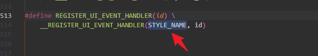

#### 疑问

**一个UI界面中的控件映射为软件中的宏时，ID怎么不唯一？怎么确定是哪一个ID?在触摸消息发生时，用什么依据来进行对应的UI逻辑？**

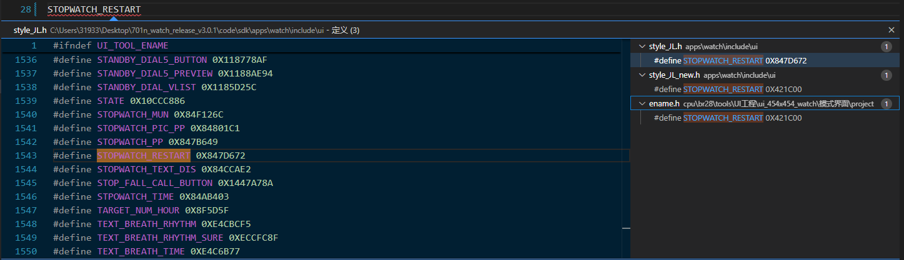


### 控件的属性

各类控件属性请参阅《UI控件结构体成员说明》。

每种控件都有自己的属性结构体（控件结构体 = 公共属性成员 + 私有属性成员）

比如文字控件的属性结构体定义在`ui_text.h`里面；

比如图片控件的属性结构体定义在`ui_pic.h`里面；

比如列表控件的属性结构体定义在`ui_grid.h`里面；

比如列表控件的属性结构体定义在`ui_grid.h`里面；

比如按键控件的属性结构体定义在`ui_button.h`里面；


**控件有对应的处理函数，但是也需要传递参数？**
**比如数字控件，1-9，应该是同一套处理逻辑。而不可能是每一个数字控件对应一个处理函数。重复性太高。还是通过控件属性传递好一些。**

## UI消息类型（不太懂）


### 显示消息

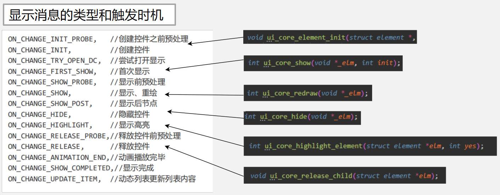

注意：不要在onchange里面调用ui_XXX_by_id()、ui_show()、ui_hide()，这些接口会带有重绘（刷新）操作，因为onchange本身就会刷新，onchange里面调用重绘的接口会一直触发刷新（可能会导致卡顿死机）

建议：

1、想在onchange里面更新控件数据，用不带_by_id()后缀的接口，一般控件都会带有配套的接口；

2、想在onchange里面设置隐藏显示控件的话，编辑控件css属性里的invisible属性（隐藏控件invisible = 1；显示控件invisible = 0；）

### 触摸消息

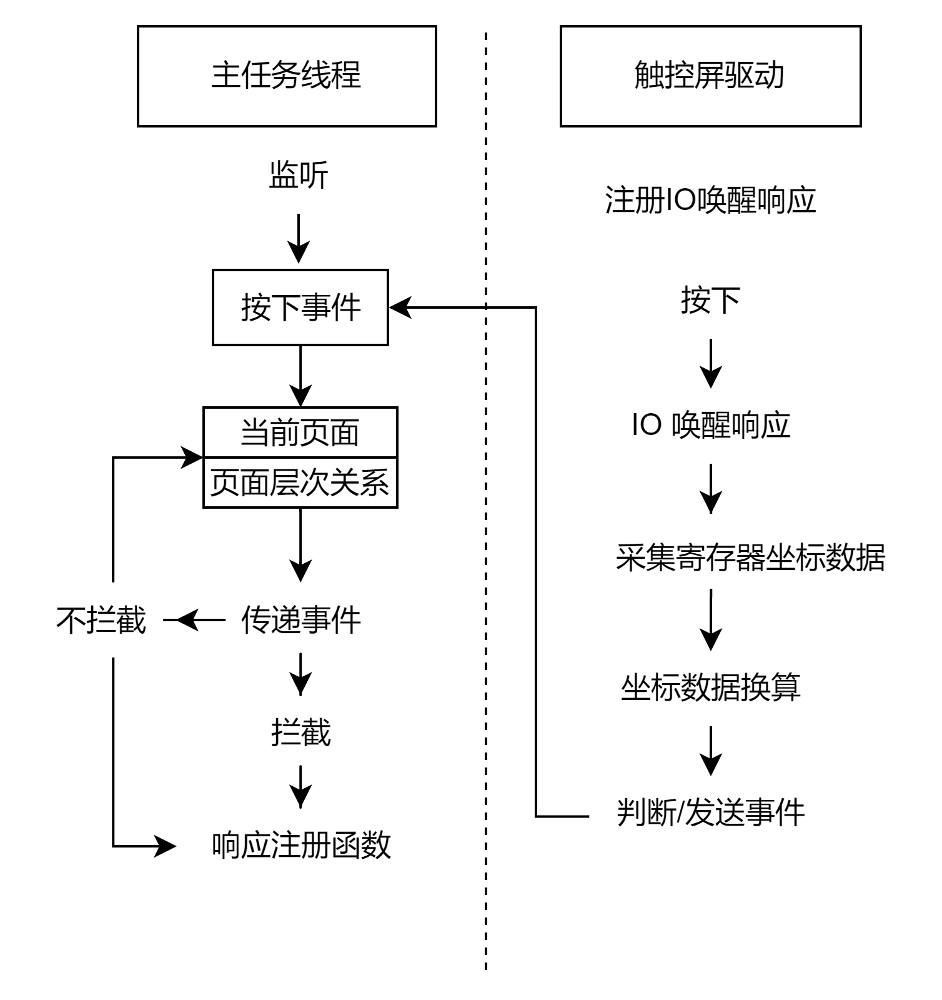

触控唤醒IO设置：

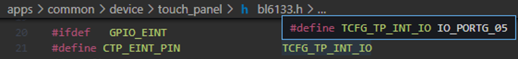

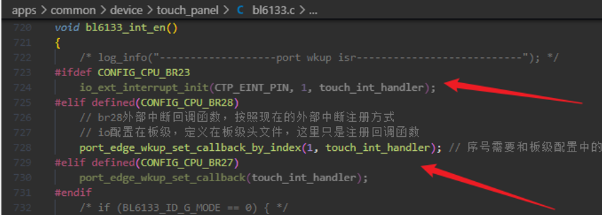

收发响应接口：

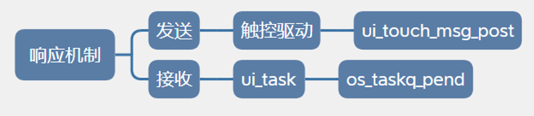

### 按键消息

控件默认不响应硬件按键，如果硬件按键想要操作UI，需要在硬件按键的公共事件处理里面接管，然后把按键消息转发到UI线程`.onkey`处理。

屏幕上哪里来的按键消息？触摸消息和显示消息。

通过旋转按钮操作UI界面呢？

①被控控件，需要在初始化阶段设置接管按键消息

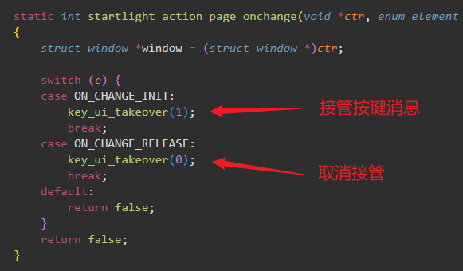

②硬件按键公共事件处理，会先检测有没有想接管的UI控件

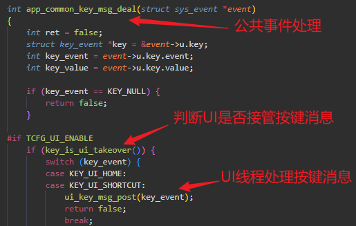

③完成以上步骤，`.onkey`响应接口才会接收到事件消息

## UI 消息传递机制（不太懂）

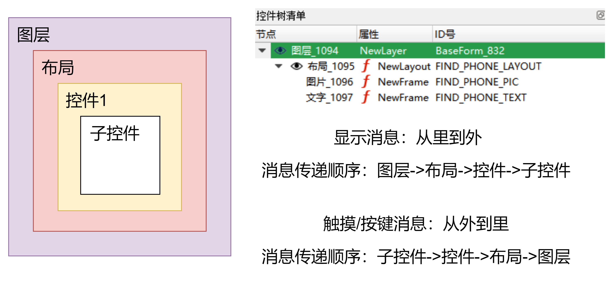

**???这箭头和文件表述对不上。。。**

**注意：显示消息的`ON_CHANGE_INIT`传递顺序有特殊调整：子控件》控件》布局》图层，其他显示消息不变。**

### 焦点控件

什么是焦点控件？焦点控件就是获取到焦点的控件，焦点可以灵活地在控件上转移，且有且只有一个焦点控件。控件成为焦点控件后，UI内核传递消息直接传达且只传达到焦点控件上，不会再传递到其他控件上。

**不用层层传递消息了，直达。**

设置焦点控件有两种方式：

- **在控件初始化阶段锁定焦点在本控件**

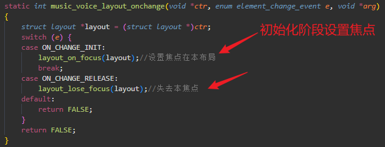

- 暂时接管，通过return true设置焦点，return false释放焦点

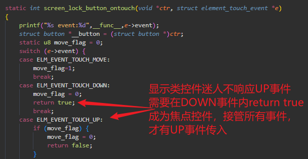

**注意：特殊调整**

- **显示类控件（文字、图片）：**默认不接收抬起事件，如要接收抬起事件，自行在down事件内`return true`；
- **按键控件：**会自动设置为焦点控件

