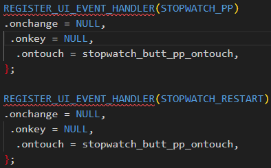

# 基于状态机的并发任务机制？

在`apps\watch\app_main.c`中：

```c
void app_task_loop()
{
    while (1) {
        switch (app_curr_task) {
        case APP_POWERON_TASK:
            log_info("APP_POWERON_TASK \n");
            app_poweron_task();
            break;
        case APP_POWEROFF_TASK:
            log_info("APP_POWEROFF_TASK \n");
            app_poweroff_task();
            break;
        case APP_BT_TASK:
            log_info("APP_BT_TASK \n");
            app_bt_task();
            break;
        case APP_MUSIC_TASK:
            log_info("APP_MUSIC_TASK \n");
            app_music_task();
            break;
        case APP_RTC_TASK:
            log_info("APP_RTC_TASK \n");
            app_rtc_task();
            break;
        case APP_PC_TASK:
            log_info("APP_PC_TASK \n");
            app_pc_task();
            break;
        case APP_WATCH_UPDATE_TASK:
            log_info(" APP_WATCH_UPDATE_TASK \n");
            app_watch_ui_updata_task();
            break;
        case APP_SMARTBOX_ACTION_TASK:
            log_info("APP_SMARTBOX_ACTION_TASK \n");
#ifdef CONFIG_APP_BT_ENABLE

//SMART_BOX_EN为0时不开启
#if (SMART_BOX_EN)
            app_smartbox_task();
#endif

#endif
            break;
        case APP_IDLE_TASK:
            log_info("APP_IDLE_TASK \n");
            app_idle_task();
            break;
#if TCFG_APP_RECORD_EN
        case APP_RECORD_TASK:
            log_info("APP_RECORD_TASK \n");
            app_record_task();
            break;
#endif
#if TCFG_APP_CAT1_EN
        case APP_CAT1_TASK:
            log_info("APP_CAT1_TASK \n");
            app_cat1_task();
            break;
#endif /* #if TCFG_APP_CAT1_EN */
        }
        app_task_clear_key_msg();//清理按键消息
        //检查整理VM
        vm_check_all(0);
    }
}
```

## APP_WATCH_UPDATE_TASK

`apps\watch\smartbox\external_flash\smartbox_extra_flash_opt.c`中

```c
void app_watch_ui_updata_task()
{
    int msg[32];

    rcsp_printf("\n\n\nwatch ui update task start\n\n\n\n");

    if (watch_get_update_status() == 2) {
        bt_direct_init();
        bt_ble_init();
    }

    smartbox_eflash_change_sys_clock(1);
    watch_ui_update_open();

    while (1) {
        app_task_get_msg(msg, ARRAY_SIZE(msg), 1);

        switch (msg[0]) {
        case APP_MSG_SYS_EVENT:
            if (watch_get_update_status() == 2) {
                // 可以相应ota升级的事件
                if (bt_update_event_handler((struct sys_event *)(msg + 1)) == false) {
                    app_default_event_deal((struct sys_event *)(&msg[1]));
                }
            } else {
                app_default_event_deal((struct sys_event *)(&msg[1]));
            }
            break;
        default:
            break;
        }

        if (app_task_exitting()) {
            rcsp_printf("\n\n\nwatch ui update task exit\n\n\n\n");
            smartbox_eflash_change_sys_clock(0);
            watch_ui_update_close();
            return;
        }
    }
}
```

循环捕获消息，并处理。

### 公共事件处理

```c
//公共事件处理， 各自模式没有处理的事件， 会统一在这里处理
void app_default_event_deal(struct sys_event *event)
{
    int ret;
    struct key_event *key;
    SYS_EVENT_HANDLER_SPECIFIC(event);
    switch (event->type) {
    case SYS_DEVICE_EVENT:
        /*默认公共设备事件处理*/
        /* printf(">>>>>>>>>>>>>%s %d \n", __FUNCTION__, __LINE__); */
        app_common_device_event_handler(event);
        break;
#if TCFG_APP_BT_EN
    case SYS_BT_EVENT:
        if (true != app_check_curr_task(APP_BT_TASK)) {
            /*默认公共BT事件处理*/
            bt_background_event_handler(event);
        }
        break;
#endif
    case SYS_KEY_EVENT:
    case SYS_UI_EVENT:
        key = &event->u.key;
        if (key->type == KEY_DRIVER_TYPE_VOICE) {
            /* 语音消息 */
            ret = jl_kws_voice_event_handle(event);
            break;
        }
        app_common_key_msg_deal(event);
        break;

    case SYS_NET_EVENT:
        extern int net_event_cb(struct sys_event * event);
        net_event_cb(event);
        break;
    default:
        printf("unknow event\n");
        break;
    }
}
```

### 总结

每一个TASK模式下,都有一个消息循环捕获机制。捕获到消息会优先被当前任务处理。没有被当前任务处理就会进入公共事件处理逻辑。

## UI控件触发的消息事件

**在`APP_IDLE_TASK`被处理还是`APP_SMARTBOX_ACTION_TASK`被处理？？？**

以PAGE_33为例，两个按钮的控件ID为`STOPWATCH_RESTART`以及`STOPWATCH_PP`



被注册为触摸消息类型，并绑定了同一个处理函数

### 触摸消息的处理函数

```c
static int stopwatch_butt_pp_ontouch(void *ctrl, struct element_touch_event *e)
{
    log_info("LAQ PP button test ！");
    struct button *button = (struct button *)ctrl;
    switch (e->event) {
    case ELM_EVENT_TOUCH_DOWN:
        /* code */
        break;
    case ELM_EVENT_TOUCH_UP:
        log_info("button ->elm.id = %d", button->elm.id);
        if ((stopwatch_count_start_id == 0) && (button->elm.id == STOPWATCH_PP)) {
            log_info("LAQ start ");
            ui_pic_show_image_by_id(STOPWATCH_PIC_PP, 1);
            stopwatch_count_start_id = usr_timer_add(NULL, stopwatch_num_updata, 10, 1);

        } else if ((stopwatch_count_start_id != 0) && (button->elm.id == STOPWATCH_PP)) {
            log_info("LAQ puse ");
            ui_pic_show_image_by_id(STOPWATCH_PIC_PP, 0);
            usr_timer_del(stopwatch_count_start_id);
            stopwatch_count_start_id = 0;
        } else if ((button->elm.id == STOPWATCH_RESTART) && (stopwatch_count_start_id == 0)) {
            stopwatch_count = 0;
            log_info("LAQ restart ");
        }
        break;
    default:
        break;
    }
    return false;
}
```

- 该函数处理按钮的触摸事件，主要关注`ELM_EVENT_TOUCH_UP`事件。
- 在`ELM_EVENT_TOUCH_UP`事件中：
  - 如果`stopwatch_count_start_id`为0且按钮ID为`STOPWATCH_PP`，则启动计时器并显示开始图标。
  - 如果计时器已启动且按钮ID为`STOPWATCH_PP`，则暂停计时器并显示暂停图标。
  - 如果按钮ID为`STOPWATCH_RESTART`且计时器未启动，则重置计数器。

#### 疑问

**没有找到在哪里调用的？内部机制？还是不能确定在那个主要任务中被处理的**

### 显示消息的处理函数

```c
static int stopwatch_pic_pp_onchange(void *ctr, enum element_change_event e, void *arg)
{
    struct ui_pic *pic = (struct ui_pic *)ctr;
    /* printf("pp evt:%d \n", e); */
    switch (e) {
    case ON_CHANGE_INIT:
        //printf("ON_CHANGE_INIT \n");
        if (stopwatch_count_start_id) {
            //y_printf("%s,%d \n", __func__, __LINE__);
            ui_pic_set_image_index(pic, 1);
        }
        break;
    case ON_CHANGE_RELEASE:
        //printf("ON_CHANGE_RELEASE \n");
        break;
    default:
        break;
    }
    return false;
}
REGISTER_UI_EVENT_HANDLER(STOPWATCH_PIC_PP)
.onchange = stopwatch_pic_pp_onchange,
 .onkey = NULL,
  .ontouch = NULL,
};
```

这段代码定义了一个处理函数 `stopwatch_pic_pp_onchange`，用于处理秒表控件中图片（`ui_pic`）的状态变化事件。它还通过 `REGISTER_UI_EVENT_HANDLER` 将该处理函数绑定到 `STOPWATCH_PIC_PP` 控件。

- **参数说明**：
  - `void *ctr`：指向当前控件的指针，这里是图片控件（`ui_pic`）。
  - `enum element_change_event e`：表示控件状态变化的事件类型。
  - `void *arg`：传递给事件处理函数的附加参数（此处未使用）。
- **功能逻辑**：
  - `ON_CHANGE_INIT` 事件：
    - 当控件初始化时，检查全局变量 `stopwatch_count_start_id` 是否为非零。
    - 如果 `stopwatch_count_start_id` 非零，调用 `ui_pic_set_image_index(pic, 1)`，将图片切换到索引为 1 的状态。这通常表示秒表正在运行时显示“暂停”图标。
  - `ON_CHANGE_RELEASE` 事件：
    - 当控件释放时，无特殊操作。
  - 其他事件：
    - 默认情况下不做任何处理。

## UI界面控件处理逻辑的组织

**这个是不是专门一个UI界面的控件消息触发处理的逻辑？因为秒表计时UI的两个控件消息处理逻辑都在这个？是不是可以理解为一个UI界面的控件处理逻辑就是一个c文件？**

这段代码主要实现了秒表（Stopwatch）UI界面中各个控件的消息处理逻辑。具体包括：

- **时间控件**：`STPOWATCH_TIME` 的 `onchange` 事件处理函数 `stopwatch_time_onchange`。
- **数字控件**：`BASEFORM_363` 的 `onchange` 事件处理函数 `stopwatch_num_onchange`。
- 按键控件：
  - `STOPWATCH_PP` 和 `STOPWATCH_RESTART` 的触摸事件处理函数 `stopwatch_butt_pp_ontouch`。
  - 图片控件 `STOPWATCH_PIC_PP` 的 `onchange` 事件处理函数 `stopwatch_pic_pp_onchange`。
- **页面控件**：`ID_WINDOW_STOPWATCH` 的 `onchange` 事件处理函数 `PAGE_stopwatch_onchange`。

这些控件的消息处理逻辑都集中在同一个文件 `ui_action_stopwatch.c` 中。


### **是否是专门针对一个UI界面的控件消息触发处理逻辑？**

是的，可以理解为这个文件专门处理秒表（Stopwatch）UI界面的控件消息触发逻辑。以下是支持这一结论的理由：

(1) **文件命名与功能对应**

文件名为 `ui_action_stopwatch.c`，明确表明其功能与秒表（Stopwatch）相关。这种命名方式在项目中通常是用来组织特定UI界面的逻辑。

(2) **控件绑定到特定UI界面**

通过 `REGISTER_UI_EVENT_HANDLER` 宏，所有控件的消息处理函数都被绑定到特定的控件ID（如 `STPOWATCH_TIME`、`STOPWATCH_PP` 等）。这些控件ID通常是由UI工具生成，且专属于秒表界面。

(3) **逻辑集中在一个文件**

所有与秒表界面相关的控件消息处理逻辑都集中在这个文件中，包括：

- 控件状态变化（`onchange`）。
- 按键触摸事件（`ontouch`）。
- 页面初始化和释放（`PAGE_stopwatch_onchange`）。

这种设计使得代码结构清晰，便于维护和扩展。

### **是否可以理解为一个UI界面的控件处理逻辑就是一个C文件？**

从代码结构来看，这种理解是合理的，但需要结合项目的整体设计风格来进一步确认。以下是支持这一观点的理由：

(1) **模块化设计**

每个UI界面的控件处理逻辑被封装在一个独立的C文件中，例如：

- `ui_action_stopwatch.c`：处理秒表界面。
- `ui_action_alarm.c`：处理闹钟界面。
- `ui_action_music.c`：处理音乐界面。

这种模块化设计有助于降低耦合性，提高代码的可读性和可维护性。

(2) **控件与界面的关联**

通过 `REGISTER_UI_EVENT_HANDLER` 宏，控件的消息处理函数被绑定到特定的控件ID，而这些控件ID通常是由UI工具生成并专属于某个界面。因此，一个C文件中的所有逻辑通常只服务于一个UI界面。

(3) **项目目录结构**

从项目目录结构可以看出，`apps\watch\ui\lcd\STYLE_WATCH_NEW` 目录下有许多类似的文件，例如：

```c
ui_action_alarm.c
ui_action_calendar.c
ui_action_music.c
ui_action_stopwatch.c
```

这些文件的命名和内容表明它们分别处理不同的UI界面。

## 自制UI与控件处理逻辑

**如此说的话，我想自己制作一个UI界面并设计对应控件的处理逻辑的话，就可以仿造这种结构和形式？**

### **理解项目结构和文件组织**

**项目目录结构**

从项目目录结构可以看出，UI界面相关的文件通常位于 `apps\watch\ui\lcd\STYLE_WATCH_NEW` 目录下。每个UI界面通常对应一个C文件，例如：

- `ui_action_stopwatch.c`：秒表界面。
- `ui_action_alarm.c`：闹钟界面。
- `ui_action_music.c`：音乐界面。

**文件命名规范**

文件名通常以 `ui_action_` 开头，后面跟随界面名称，例如 `ui_action_stopwatch.c`。这种命名方式有助于快速定位和管理文件。

### **创建新的UI界面文件**

**步骤**

1. **创建新文件**：
   - 在 `apps\watch\ui\lcd\STYLE_WATCH_NEW` 目录下创建一个新的C文件，例如 `ui_action_myinterface.c`。
2. **包含必要的头文件**：
   - 根据需要包含相关的头文件，例如 `app_config.h`、`ui/ui_style.h`、`ui/ui.h` 等。
3. **定义控件处理函数**：
   - 定义各个控件的消息处理函数，例如 `onchange`、`ontouch` 等。
4. **注册控件处理函数**：
   - 使用 `REGISTER_UI_EVENT_HANDLER` 宏将控件处理函数注册到相应的控件ID上。

## UI界面跳转的逻辑

**apps\watch\ui\lcd\STYLE_WATCH_NEW这个路径下都是UI界面的控件消息处理逻辑，你觉得哪一个可能涉及页面切换操作呢？我要学习一下UI界面切换的结构与形式**

在 `apps\watch\ui\lcd\STYLE_WATCH_NEW` 目录下，涉及页面切换操作的文件通常会包含与页面管理、页面切换相关的逻辑。根据提供的检索结果和文件内容，以下文件可能涉及页面切换操作：

1. **`ui_action_dial.c`**
2. **`ui_action_set.c`**
3. **`ui_page_touch.c`**

# 练习

练习一：主界面，按钮控件，触摸跳转到新页面，定时循环播放图片（普通：UI工程控制，进阶：定时器控制），右滑返回主界面

## **主界面实现**

- 推荐文件：`ui_action_watch.c`
  - **路径**：`apps\watch\ui\lcd\STYLE_WATCH_NEW\ui_action_watch.c`
  - 功能：
    - 该文件实现了表盘控件的事件处理逻辑，包括触摸事件、按键事件等。
    - 提供了 `ui_send_event` 的调用示例，可以用于触发页面跳转。

```c
ui_send_event(KEY_CHANGE_PAGE, BIT(31) | PAGE_37);
```

- 可以参考其事件处理机制，实现主界面的触摸跳转逻辑。

## **按钮控件**

- 推荐文件：`ui_action_bt_page_api.c`
  - **路径**：`apps\watch\ui\lcd\STYLE_WATCH_NEW\ui_bt_page_api.c`
  - 功能：
    - 该文件实现了蓝牙页面的相关控件逻辑，包括按钮控件的事件处理。
    - 提供了如何通过 `page_list_check` 和 `BT_PAGE` 结构体管理页面数据的示例。

```c
struct BT_PAGE {
    u8 used;
    u8 mac[6];
    u8 name[32];
};
```

- 可以参考其按钮控件的实现方式，适配到你的主界面中。

## **触摸跳转到新页面**

- 推荐文件：`ui_action_set.c`
  - **路径**：`apps\watch\ui\lcd\STYLE_WATCH_NEW\ui_action_set.c`
  - 功能：
    - 该文件实现了设置页面的逻辑，包括页面跳转和控件交互。
    - 提供了如何通过 `ui_grid_for_id` 获取控件句柄并触发事件的示例。

```c
REGISTER_UI_STYLE(STYLE_NAME)
#define PAGE_SET ID_WINDOW_SET
```

- 可以参考其页面跳转逻辑，实现从主界面跳转到新页面的功能。

## **定时循环播放图片（普通：UI工程控制）**

- 推荐文件：`lcd_ui_api.c`
  - **路径**：`apps\common\ui\lcd\lcd_ui_api.c`
  - 功能：
    - 该文件实现了 UI 框架的核心逻辑，包括页面初始化、控件刷新和定时器管理。
    - 提供了如何通过 `sys_timer_add` 注册定时器的示例。

```c
__ui_display.timer = sys_timer_add((void *)NULL, __ui_display.touch_event_call, __ui_display.touch_event_interval);
```

- 可以参考其定时器注册方式，实现图片的定时循环播放。

## **定时循环播放图片（进阶：定时器控制）**

- 推荐文件：`ui_action_breath_train.c`
  - **路径**：`apps\watch\ui\lcd\STYLE_WATCH_NEW\ui_action_breath_train.c`
  - 功能：
    - 该文件实现了呼吸训练功能，包含定时器控制的逻辑。
    - 提供了如何通过定时器更新控件状态的示例。
  - 适用场景：
    - 可以参考其定时器控制逻辑，实现更复杂的图片循环播放效果。

## **右滑返回主界面**

- 推荐文件：`ui_action_watch.c`

  - **路径**：`apps\watch\ui\lcd\STYLE_WATCH_NEW\ui_action_watch.c`
  - 功能：
    - 该文件实现了表盘控件的触摸事件处理逻辑，包括右滑返回的功能。
    - 提供了如何通过 `ELM_EVENT_TOUCH_R_MOVE` 处理右滑事件的示例。

- ```c
  case ELM_EVENT_TOUCH_R_MOVE:
      sel_item = ui_grid_cur_item(grid);
      if (sel_item == 0) { // 在第一项位置右滑默认处理（返回上一页面）
          return true;
      }
      break;
  ```

  - 可以直接参考其右滑返回逻辑，适配到你的新页面中。

# 实现一

**练习一：主界面，按钮控件，触摸跳转到新页面，定时循环播放图片（普通：UI工程控制，进阶：定时器控制），右滑返回主界面**

主界面中自己定义一个按钮控件，这个控件产生触摸消息事件后，跳转到新页面，新页面的功能为定时循环播放图片，右滑就返回主界面。

## **主界面及控件处理逻辑的核心文件**

**主界面逻辑**

- 推荐文件：`ui_action_watch.c`
  - **路径**：`apps\watch\ui\lcd\STYLE_WATCH_NEW\ui_action_watch.c`
  - 功能：
    - 该文件实现了表盘（主界面）的核心逻辑，包括触摸事件处理、页面跳转等。
    - 提供了 `ui_send_event` 的调用示例，用于触发页面切换。
    - 包含了对主界面上各种控件（如时间、秒针等）的更新逻辑。

这个文件是手表主页面的一部分，主要实现了以下功能：

1. 表盘样式的切换。
2. 背景图片的选择。
3. 时间的显示和更新。
4. 拨号功能的支持。
5. 多语言文本的显示。
6. 进度条、圆环和图标的绘制。

控件消息处理函数涵盖了触摸事件、初始化、显示更新等多个方面，确保了主界面的交互性和功能性。

## 表盘界面的控件ID与主界面的处理逻辑与映射关系

表盘界面的控件ID：

```c
#define BASEFORM 0X4002000
#define BASEFORM_1 0X4021000
#define BASEFORM_2 0X4001000
#define BASEFORM_3 0X4001C00
#define MESSAGE_LAYOUT 0X4020C00
#define NEWFRAME_2 0X4006400
#define NEWFRAME_3 0X4006800
#define NEWFRAME_4 0X4006C00
#define PAGE_0 0X4000800
#define PAGE_1 0X4020801
#define TIME 0X4002800
#define UI_ROTATE 0X0
#define UI_VERSION 0X34084401
#define WATCH 0X4006000
#define WATCH_LAYOUT 0X4000C00
```

这些宏定义了表盘界面中不同控件的唯一标识符（ID），例如 `BASEFORM`、`WATCH` 等。

### `ui_action_watch.c` 是否使用到了这些控件ID

**`ui_action_watch.c` 中的相关代码**

从 `ui_action_watch.c` 的代码片段中可以看到以下关键点：

- 文件中多次调用了 `watch_set_style(sel_item)` 函数来设置表盘样式。

- 使用了 `STYLE_DIAL_ID(x)` 宏来生成表盘相关的控件ID。例如：

- ```c
  #define STYLE_DIAL_ID(x) DIAL_##x
  ```

这表明文件中可能通过 `DIAL_PAGE_0`、`DIAL_WATCH` 等宏来引用控件ID。

### **对比控件ID**

通过对比 `#selectedCode` 中的控件ID 和 `ui_action_watch.c` 中使用的宏定义，可以发现以下关联：

- `DIAL_PAGE_0` 对应于 `PAGE_0`（值为 `0X4000800`）。
- `DIAL_WATCH` 对应于 `WATCH`（值为 `0X4006000`）。
- `DIAL_BASEFORM_2` 对应于 `BASEFORM_2`（值为 `0X4001000`）。

### **具体使用场景**

以下是 `ui_action_watch.c` 中使用到这些控件ID的具体场景：

##### **表盘样式切换**

在 `ui_action_watch.c` 中，`watch_set_style(sel_item)` 函数被多次调用，用于切换表盘样式。例如：

```c
ret = watch_set_style(sel_item);
if (ret != true) {
    printf("watch_set_style err %d\n", sel_item);
    break;
}
```

这里的 `sel_item` 可能对应于某个具体的表盘样式，而 `watch_set_style` 函数内部会使用到表盘相关的控件ID。

##### **控件初始化**

在 `WATCH_onchange` 函数中，通过 `STYLE_DIAL_ID(WATCH)` 来获取表盘控件的ID，并对其进行初始化：

```c
ui_watch_set_time_by_id(STYLE_DIAL_ID(WATCH), this->hour, this->min, this->sec);
```

这里的 `STYLE_DIAL_ID(WATCH)` 实际上就是 `DIAL_WATCH`（值为 `0X4006000`）。

##### **子控件遍历**

在 `ui_action_watch.c` 中，通过 `ui_get_child_by_id` 函数遍历表盘的子控件：

```c
id = STYLE_DIAL_ID(WATCH);
printf("root id = 0x%x\n", id);
ui_get_child_by_id(id);
```

这里的 `id` 就是表盘控件的ID，即 `DIAL_WATCH`。

#### 结论

`ui_action_watch.c` 文件确实使用到了表盘界面的控件ID，尤其是以下几个：

- `DIAL_PAGE_0`（对应 `PAGE_0`）
- `DIAL_WATCH`（对应 `WATCH`）
- `DIAL_BASEFORM_2`（对应 `BASEFORM_2`）

这些控件ID 被用于表盘样式的切换、时间更新以及子控件的初始化等操作。

## 实现

在主界面的UI处理函数中添加**新按钮控件的事件处理函数**，并注册：

```c
//新按钮控件的事件处理函数
static int dial_key_button_ontouch(void *ctr, struct element_touch_event *e)
{
    struct button *button = (struct button *)ctr;

    switch (e->event) {
    case ELM_EVENT_TOUCH_UP:
        // 跳转到指定页面
        UI_HIDE_CURR_WINDOW();
        UI_SHOW_WINDOW(PAGE_XX); // 替换 PAGE_XX 为你想要跳转的页面 ID
        break;
    case ELM_EVENT_TOUCH_HOLD:
        break;
    case ELM_EVENT_TOUCH_MOVE:
        break;
    case ELM_EVENT_TOUCH_DOWN:
        break;
    default:
        break;
    }

    return false;
}

//注册触摸事件处理函数
REGISTER_UI_EVENT_HANDLER(DIAL_KEY_BUTTON)
.onchange = NULL,
.onkey = NULL,
.ontouch = dial_key_button_ontouch,
};
```

在你的UI工程中，触摸事件处理函数是通过控件ID来区分的，因此只要控件不同，即使你添加了新的触摸事件处理函数，也不会与现有的处理函数发生冲突。每个控件可以注册自己的触摸事件处理函数，这些函数会在相应的触摸事件发生时被调用。

1. **控件ID唯一性**： 每个控件在UI文件中都有唯一的ID。例如，`WATCH_VLIST` 和 `DIAL_KEY_BUTTON` 是两个不同的控件ID。因此，它们的触摸事件处理函数不会相互干扰。
2. **事件分发**： 当触摸事件发生时，UI框架会根据事件的目标控件ID来查找并调用相应的处理函数。因此，只要控件ID不同，每个控件的触摸事件处理函数都会被正确调用。


# ui_action_set.c

分析手表页面显示的原理。

### **页面定义**

在 `ui_style.h` 文件中，定义了多个页面的标识符（如 `PAGE_114`, `PAGE_113` 等），这些标识符通过宏定义映射到具体的页面编号。

```c
#define ID_WINDOW_BT                    PAGE_7
#define ID_WINDOW_CLOCK                 PAGE_0
#define ID_WINDOW_ACTIVERECORD          PAGE_1
```

这些宏定义表示每个页面的功能和对应的编号。

在 `ui_action_set.c` 文件中，有一个数组 `ui_page_list`，它列出了需要显示的页面：

```c
const u32 ui_page_list[] = {
    PAGE_114,                              // 按钮跳转界面
    PAGE_113,                              // 图片循环播放界面
    /* 0 */ID_WINDOW_SLEEP,                // 睡眠
    /* 1 */ID_WINDOW_PRESSURE,            // 压力
    /* 2 */ID_WINDOW_HEART,               // 心率
    ...
};
```

这个数组决定了哪些页面会被加载和显示。

### **页面加载逻辑**

页面的加载和切换是通过事件处理机制实现的。以下是一些关键点：

#### (1) **页面切换事件**

在 `ui_action_set.c` 中，通过 `ui_send_event` 函数发送页面切换事件：

```c
ui_send_event(KEY_CHANGE_PAGE, BIT(31) | PAGE_16);
```

这里的 `KEY_CHANGE_PAGE` 是一个事件类型，`BIT(31) | PAGE_16` 表示目标页面编号为 `PAGE_16`。