# 疑问

**这个SDK中，打开杰理SDK工具可以配置？这跟直接修改板级配置文件有什么区别？ 可视化工具可以更快配置？而手动修改需要找地方不太直观？**

杰理SDK中，打开杰理SDK工具确实可以进行配置。这主要通过两种方式进行：

- 编译前配置工具： 在编译SDK代码之前，你可以使用这个工具对相关的配置项进行设置。配置完成后，会生成一个 cfg_tools.bin 文件，重新编译SDK代码后，这些配置就会生效 。  

- 编辑FW文件： 这个工具可以用来编辑现有的FW（固件）文件，修改其中的板级配置、蓝牙配置、状态配置和提示音配置等 。  

**这与直接修改板级配置文件（通常是 .c 和 .h 文件）的区别主要在于：**

- 可视化与直观性： 虽然文档没有明确称杰理SDK工具为“可视化工具”，但其作为“配置工具”提供了一种图形界面（根据描述，需要双击 .jlxproj 文件打开，并有不同的配置界面如编译前配置和编辑FW文件），使得配置过程更加直观，不需要手动查找和修改代码文件中的宏定义和参数.  

- 效率： 使用配置工具理论上可以更快地进行配置，因为它提供了一个集中的界面来修改各种参数，而无需在多个代码文件中导航和编辑. 手动修改配置文件则需要开发者熟悉代码结构，找到对应的宏定义或参数进行修改，这相对来说不够直观，效率可能较低。  

- 配置内容的关联性： 配置工具中可配置的选项取决于编译前配置生成的 cfg_tool.bin 文件，也就是说，你在编译前配置中选择了哪些功能，编辑FW文件时才能看到对应的配置选项. 而直接修改板级配置文件则需要手动去对应的文件里修改相关的宏定义和参数。  


**ufw后缀文件我知道是可以更新耳机程序的。FW文件是干嘛的？编译前配置和编辑FW文件的区别？**
**我看了一下配置界面，好像前者是总体上的配置。而后者是FW文件和ufw文件的配置或者修改？这是升级程序编译后的修改？**

- UFW 文件： 正如你所知，.ufw 文件是用于更新耳机程序的升级文件。

- FW 文件： FW 文件是固件文件，它通常包含了编译好的程序代码以及相关的配置信息。它是生成 UFW 文件的基础。杰理SDK工具中的“编辑FW文件”就是针对这种文件进行操作的 。  

- 编译前配置： 这个配置是在SDK代码编译之前进行的。通过杰理SDK工具的“编译前配置”选项，你可以**设置一些整体的、影响编译结果的参数**。这些配置会生成一个 cfg_tools.bin 文件，用于**指导代码的编译过程，决定了固件中包含的功能和基础设置** 。你可以理解为这是在“生产”固件之前的“原料”和“配方”的调整。  

- 编辑 FW 文件： 这个操作是在SDK代码已经编译生成了 FW 文件之后进行的 。通过杰理SDK工具的“编辑FW文件”，你可以打开一个现有的 FW 文件，对其内部的板级配置、蓝牙配置、状态配置和提示音配置等进行修改 。修改完成后，可以保存为新的 FW 文件或生成用于升级的 UFW 文件 。你可以理解为这是在“产品”生产出来后，对其进行局部的“调优”或“定制”，以便于后续的升级或个性化设置。  


**在开发中不是会选择板级配置文件吗？只能从多个板级配置文件中选择一个。那么杰理SDK配置工具影响的是多个配置文件？还是选择后的一个板级配置文件？但是他不是产生的是bin文件吗？**

- **选择板级配置文件：** 在开发过程中，确实会选择一个特定的板级配置文件（例如 `board_ac700n_demo_cfg.h` 和 `board_ac700n_demo.c`）。这个文件定义了硬件平台的基础特性和外设配置。

- **杰理SDK配置工具（编译前配置）：** 这个工具的“编译前配置”选项**不是直接修改你选择的那个板级配置文件的源代码 (.c 或 .h 文件)**。

- **生成 `cfg_tools.bin`：** 如图中所说 ，编译前配置工具会根据你在工具界面上的选择，生成一个 `cfg_tools.bin` 文件。
- **`cfg_tools.bin` 的作用：** 这个 `.bin` 文件包含了配置的参数信息，它在 SDK 的**编译过程中**被使用。编译系统会读取这个 `.bin` 文件中的配置，并根据这些配置来编译你的代码，包括你选择的板级配置文件所关联的代码。你可以理解为，这个 `.bin` 文件是给编译器和链接器提供额外指令和参数，告诉它们如何针对你选择的板级以及你的配置需求来构建最终的固件。
- **编辑 FW 文件：** 而“编辑 FW 文件”功能则是针对**已经编译生成**的固件文件 (`.fw` 文件) 进行的修改。这个 `.fw` 文件是编译过程的产物，已经包含了代码和基于编译前配置（以及板级配置文件）的基础设置。编辑 FW 文件是在这个已有的固件基础上，对其内部的一些可配置项（如蓝牙名称、提示音等）进行修改，然后生成用于升级的 `.ufw` 文件 。

所以，杰理SDK配置工具的编译前配置是影响**编译过程**，并生成一个 `.bin` 文件，这个 `.bin` 文件协同你选择的板级配置文件一起，决定了最终固件的功能和基础配置。它不是直接修改源码文件。而编辑 FW 文件则是在编译后，对生成的固件进行修改。


**板级配置文件和配置工具生成的bin文件不会冲突吗？板级配置文件相当于开发板的硬件上的初始化吗？相当于STM32的标准外设库中的启动文件和时钟配置文件？这是硬件上的定义与初始化。**
**而杰理SDK配置工具，配置的是功能上的东西。是基于板级配置文件实现的？比如蓝牙配置，通话参数配置，mic参数，提示音配置，音量配置？**

- **板级配置文件（Board Configuration Files）：** 这些文件（例如 `board_xxx.c` 和 `board_xxx_cfg.h`）主要负责定义和初始化硬件相关的配置。它们确定了哪些引脚用作特定的功能（如MIC输入、按键IO、AD采集等）、外设的基本工作模式、时钟设置等。这就像是给开发板搭建了一个硬件骨架和基础运行环境，非常类似于你在STM32中配置启动文件、时钟和基本外设参数，是对硬件层面的定义和初始化。文档中关于MIC配置 、IO按键配置 、AD按键配置 、充电相关配置 等内容，很多都是在板级配置文件中进行的。  

- 杰理SDK配置工具（编译前配置）和 cfg_tools.bin： 这个工具和它生成的 cfg_tools.bin 文件，则主要侧重于功能和软件模块的配置。它是在板级配置文件搭建的硬件基础上，进一步细化和定制上层软件功能的行为。例如：

  - 蓝牙配置： 启用或禁用特定的蓝牙功能、设置蓝牙名称等。

  - 通话参数配置： 调整通话相关的算法参数（如回音消除、降噪等）。

  - MIC参数： 虽然板级文件定义了MIC硬件，但工具可以配置MIC相关的处理参数，例如是否使用省电容模式 、增益等（这部分也与板级配置有关联）。  

  - 提示音配置： 选择和管理不同的提示音效。

  - 音量配置： 设置音量调节方式（如数字音量）和最大音量等级等 。  

  - 音效配置： 如虚拟低音 。 

`cfg_tools.bin` 文件和板级配置文件之间之所以不冲突，是因为它们作用的“层面”不同。板级配置文件是基础，定义了“能做什么”，而 `cfg_tools.bin` 则是在这个基础上配置“具体怎么做”以及“启用哪些功能模块”。编译过程会将板级配置文件（定义硬件基础）和 `cfg_tools.bin`（定义功能配置）的信息结合起来，生成最终的固件。板级配置文件提供了硬件的上下文和约束，而 `cfg_tools.bin` 则在这个框架内进行功能性的定制。 


# FN3的介绍

这是一个基于杰理(JL)芯片BR36系列的蓝牙耳机SDK项目,主要特点如下:

1. 项目架构:

   - 基于V138公版软件的定制版本

   - 使用Clang编译器进行开发

   - 主要针对AC700N/AC7003F/AC7006F等型号芯片

2. 主要功能:

   - 蓝牙音频(支持TWS双耳)

   - ANC主动降噪

   - USB音频

   - SD卡播放

   - 触摸按键

   - OTA升级

   - 电池管理和充电

3. 开发工具支持:

   - 提供配置工具(生成cfg_tool.bin)

   - 调音工具(生成eq_cfg_hw.bin)

   - ANC Designer工具(用于ANC调试)

   - SDK工具(用于编辑固件)

4. 系统特点:

   - 多任务系统架构

   - 支持单/双备份升级

   - 支持多种开发板配置(DEMO板、耳机板等)

   - 包含完整的驱动层和应用层代码

这是一个完整的蓝牙音频解决方案,适合开发各类蓝牙耳机产品。

## 快速入门

**这个SDK有UI框架吗？如果我想快速熟悉这个SDK的话，你建议我从哪里开始？**

这个SDK有UI框架。从代码来看,它支持多种UI显示方式。让我为你详细分析:

1. UI框架支持的显示类型 (`enum ui_devices_type`):

   - LED_7 (LED数码管显示)

   - LCD_SEG3X9 (LCD段码屏)

   - TFT_LCD (彩屏)

   - DOT_LCD (点阵屏)

2. UI样式类型 (` app_config.h`):

   - STYLE_JL_WTACH (1) - 彩屏demo

   - STYLE_JL_SOUNDBOX (2) - 点阵屏demo

   - STYLE_JL_CHARGE (3) - 点阵屏充电仓

   - STYLE_JL_LED7 (4) - LED数码管

   - STYLE_UI_SIMPLE (5) - 简单UI(无框架)

### 建议学习路线

1. 首先从

   ` apps/earphone/include/ui/ui_api.h`开始,这是UI的主要API接口文件,包含了:

   - UI初始化接口

   - 显示控制接口

   - 按键消息处理等基础功能

2. 然后根据你的具体显示需求选择对应的demo学习:

   - 如果使用彩屏,可以参考 `STYLE_JL_WTACH` 相关代码

   - 如果使用点阵屏,可以参考 `STYLE_JL_SOUNDBOX` 相关代码

   - 如果是简单显示,可以参考 `STYLE_UI_SIMPLE` 相关代码

3. 重点关注以下文件:

   - ` apps/earphone/ui/lcd_simple/my_demo.c`\- UI示例代码

   - ` include_lib/system/ui/ui/ui.h`\- UI核心功能定义

   - ` apps/common/ui/lcd_simple/ui.c`\- UI基础实现

4. UI框架主要特性:

   - 支持多种显示设备

   - 提供统一的API接口

   - 支持按键和触摸输入

   - 具有菜单系统

   - 支持多语言显示

## 板级配置文件介绍

**他的板级配置文件在哪里？都有以什么什么配置？怎么选择板级配置文件？**

从提供的代码来看，板级配置文件主要在 `apps\earphone\board\br36\`目录下。让我为你详细分析：

1. **主板级配置选择文件**：` apps\earphone\board\br36\board_config.h`中通过宏定义选择具体的板级配置：

```c
#define CONFIG_BOARD_AC700N_DEMO
// #define CONFIG_BOARD_AC7006F_EARPHONE
// #define CONFIG_BOARD_AC700N_SD_PC_DEMO
//#define CONFIG_BOARD_AC7003F_DEMO
// #define CONFIG_BOARD_AC700N_ANC
//#define CONFIG_BOARD_AC700N_DMS
// #define CONFIG_BOARD_AC700N_TEST
// #define CONFIG_BOARD_AC700N_HEARING_AID
//#define CONFIG_BOARD_AC700N_IIS_LINEIN
```

2. **具体的板级配置文件**：

每个板子都有两个主要配置文件：

- `xxx_global_build_cfg.h`: 用于生成 isd_config.ini 的配置
- `xxx_cfg.h`: 板级具体功能配置

3. **现有的板级配置包括**：

​	**a) AC700N_DEMO:**

- 基础演示板配置
- 支持内置触摸和ANC功能

​	**b) AC7006F_EARPHONE:**

- 耳机板配置
- 基础蓝牙功能

​	**c) AC700N_SD_PC_DEMO:**

- SD卡和PC功能演示板
- 支持SPP、HFP、A2DP等蓝牙配置文件

​	**d) AC700N_ANC:**

- 主打ANC降噪功能的板级配置

​	**e) AC700N_TEST:**

- 测试板配置
- 支持ANC+ENC双mic+DNS+AEC+BLE+TWS等功能

​	**f) AC700N_HEARING_AID:**

- 助听器模式板级配置

​	**g) AC700N_IIS_LINEIN:**

- linein ANC板级配置

4. 主要配置项包括：

```c
// 升级相关
CONFIG_DOUBLE_BANK_ENABLE    // 双备份选择
CONFIG_APP_OTA_ENABLE        // RCSP升级支持
CONFIG_UPDATE_JUMP_TO_MASK   // 升级方式配置

// 功能相关
CONFIG_LP_TOUCH_KEY_EN       // 内置触摸
CONFIG_ANC_ENABLE           // ANC降噪
CONFIG_FLASH_SIZE           // FLASH大小配置

// 蓝牙配置文件
USER_SUPPORT_PROFILE_SPP    // SPP支持
USER_SUPPORT_PROFILE_HFP    // HFP支持
USER_SUPPORT_PROFILE_A2DP   // A2DP支持
```

### 如何选择板级配置

1. 在`board_config.h`中只打开一个板级配置的宏定义
2. 根据实际硬件选择对应的板级配置
3. 如果需要自定义板级配置：
   - 复制一份现有的配置文件
   - 修改为新的板级名称
   - 在`board_config.h`中添加新的配置选项
   - 根据需求修改具体配置项

例如，如果你要使用AC700N_DEMO配置：

```c
#define CONFIG_BOARD_AC700N_DEMO    // 只保留这一个，注释掉其他的
```

建议：

1. 先根据你的硬件选择最接近的板级配置
2. 仔细阅读对应的 `xxx_cfg.h` 和 `xxx_global_build_cfg.h` 文件
3. 根据实际需求修改相关配置项
4. 如果现有配置都不满足，可以创建新的板级配置文件

## 配置工具使用

1. 打开 sdk 工程目录， 进入 cbp_out\cpu\br36\tools\AC700N_config_tool 目录：

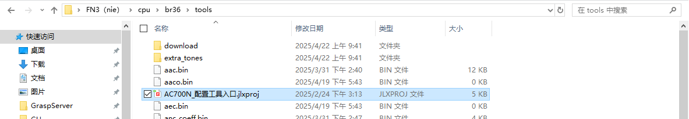

2. 双击【AC700N-配置工具入口.jlxproj】， 打开【杰理 SDK 工具】  

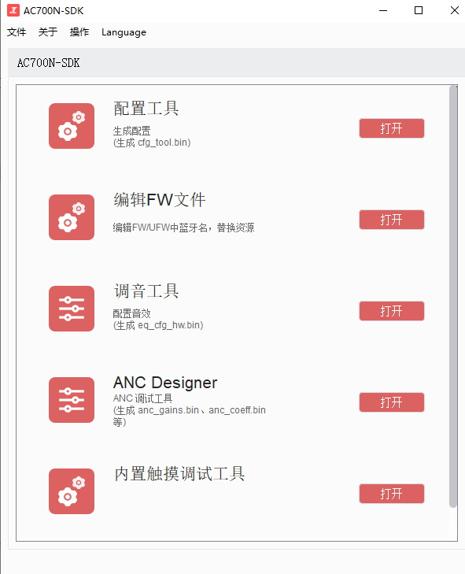

### 编辑 FW 文件

点击【编辑 FW 文件】， 可对一个 FW 文件的进行编辑， 修改 FW 文件的板级配置、 蓝牙配置， 状态配置和提示音配置， 界面如下： 

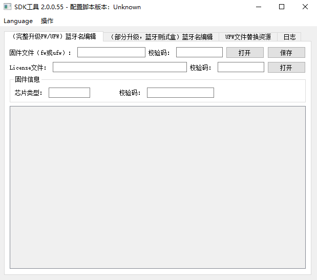

点击【恢复默认值】 可以恢复 sdk 发布时的原始配置， 配置完成后， 点击【保存】， 可选择保存路径保存修改过后的 fw 和 ufw 文件；  

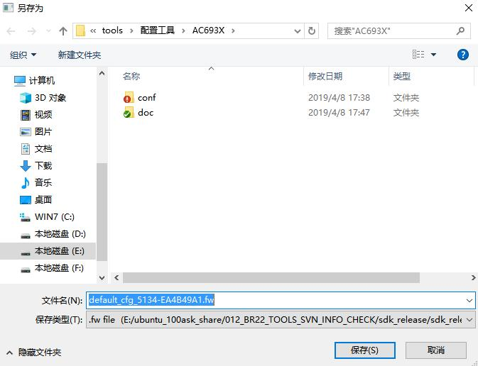

编辑 fw 文件有以下几点需要注意：

（1） **板级配置的可配选项取决 cfg_tool.bin 文件**， 也就是说**编译前配置选了什么， 编辑 fw 文件就有什么配置**， 比如说编译前配置是选了 3 个 key， 则编辑 fw 文件的时候也是只有 3 个 key 的选项。

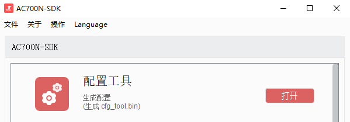

- **还是依赖于代码配置？**

（2） fw 版本号控制， 只有工具和 fw 的版本号对得上， 才能编辑对应的 fw 文件， 版本号在AC697N_config_tool\conf\entry 目录下的 user_cfg.lua 文件下修改， 如下图： 

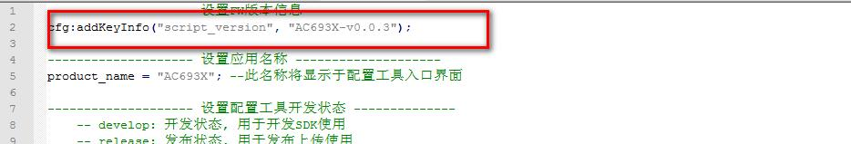

如果版本号提示不对， 请确认版本号。

（3） fw 文件制作： 当 fw 文件测试没有问题后， 想发布一个可编辑的 fw 文件时， 把生成的 fw 文件替换 AC697N_config_tool\conf\output\default 目录下 default_cfg.fw 文件即可

（4） 默认值的制作： 用编译前选项配置好后， 点击保存后会在 AC697N_config_tool\conf\output 生成一个 default_cfg.lua 文件， 把该文件覆盖 AC697N_config_tool\conf\output\default 目录下的default_cfg.lua 文件， 到时在编辑 fw 文件的时候点击恢复默认设置， 就会恢复之前设置的值。 

### 显示原理图

点击【显示原理图】， 可以打开一个 doc 的文件夹， 可以在该文件夹下存放原理图等相关文件；  

### 编译前配置

点击【编译前配置】， 可以在 sdk 代码编译前进行相关配置项配置， 打开界面如下：  

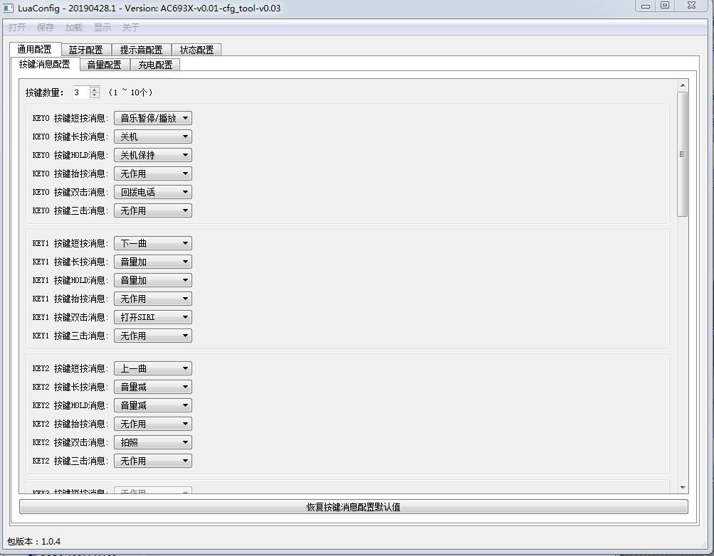

可以在**编译前配置**工具中**进行通用配置、 蓝牙配置、 提示音配置和状态配置**， 点击【恢复默认值】可以恢复 sdk 发布时的原始配置， 配置完成后， 点击【保存】 保存配置， 将会输出 cfg_tools.bin 到下载目录中， 重新编译 sdk 代码可应用该最新配置；  

### 打开下载目录

点击【打开下载目录】， 将会打开 tools 下载目录， cfg_tools.bin 将会输出到该目录下；  

### 检查依赖的软件包是否更新

点击【检查依赖的软件包是否更新】， 将会查检查相关配置工具的版本更新情况， 如有更新， 则下载相应更新即可；  

## 提示音配置

提示音设置在工具的“提示音配置” 选项里面， 点击后如下图所示：

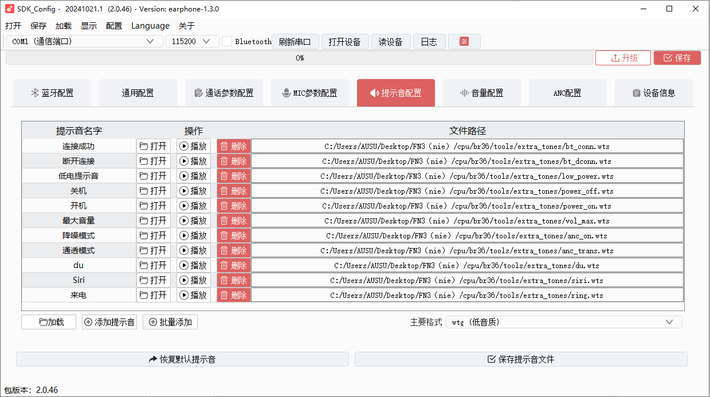

默认是加载 conf\output\extra_tones 下的提示音， 如果有一个新的 tone.cfg 文件， 点击加载按钮可以把该提示音文件加载进来。 如果想更换提示音， 直接把对应的提示音文件拉到对应选项即可。 提示音工具提供 3 种音质提示音格式， 每个提示音均可以单独指定成不同格式， 主要是看 flash 的空间。比如“蓝牙模式” 提示音想音质好点， 可以先选 sbc， 然后把对应提示音文件拉过去即可， 其他格式也是可以这样操作， 每个提示音生成是什么格式取决于拉提示音文件过去的时候选的是什么格式。  

**注意： 报号数字提示音格式一定要选同一种,原始音频数据 sbc 要用 32k 的采样率转， msbc 要用 16k的采样率转才能保证音质。**  

## UI 操作说明  

- 开机
  - 耳机在盒子外， 长按 2s 按键， 耳机开机。
  - 开盖

- 关机
  - 耳机在盒子外， 长按 2s 按键， 耳机开机。
  - 关盖
- 首次开机 TWS配对规则
  - TWS 配对失败 6S 超时， 耳机在和手机配对模式与 TWS 配对之间定时切换, 如果和手机连接成功， 则关掉 TWS 配对模式
  - TWS 配对成功, 主耳进入和手机配对模式
- 非 首 次 开 机（TWS 已 配对）
  - TWS 回连， 回连超时后：
    - 若已和手机有配对记录， 主耳直接回连手机， 回连超时， 在和手机配对状态与 TWS 配对之间定时切换
    - 若和手机无配对记录， 主耳在和手机配对状态与 TWS 配对之间定时切换；
- TWS 已连接，主耳和手机已连接。 主耳走远和对耳超距断开连接， 同时主耳和手机超距断开连接 
  - 主耳回连附耳及手机， 附耳只回连主耳机。
  - 在 3 分钟内若连上了手机， 没有连上对耳， 耳机不会关机； 若 3分钟内没有连上手机， 只连上了对耳， 耳机关机。
  - **怎么有三个角色？耳机，手机，主耳和对耳朵**
- 耳机有 1 个按键
  - 来电响铃中-->单击左耳按键或右耳按键， 接听来电
  - 来电响铃中-->长按左耳按键或右耳按键， 拒接来电
  - 通话中-->单击左耳按键或右耳按键,结束通话
  - 播放音乐中-->单击左耳按键或右耳按键,音乐播放/暂停
  - 开机状态-->长按左耳按键或右耳按键, 关机
  - 关机状态-->长按左耳按键或右耳按键, 开机
  - 长按左耳按键或右耳按键 8 秒, 复位
    - **任何状态下，都会重新开机？**
    - **开机关机的长按是多久？**
- 耳机有 2 个 LED:
  - 蓝色
  - 红色 

详细定义， 请参考以下 LED 灯效和提示音配置表：  

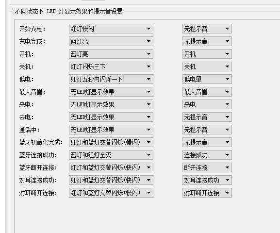

## MIC 配置

在每个 board.c 文件里都有配置 mic 参数的结构体， 如下图所示：

apps\earphone\board\br36\board_ac700n_demo.c

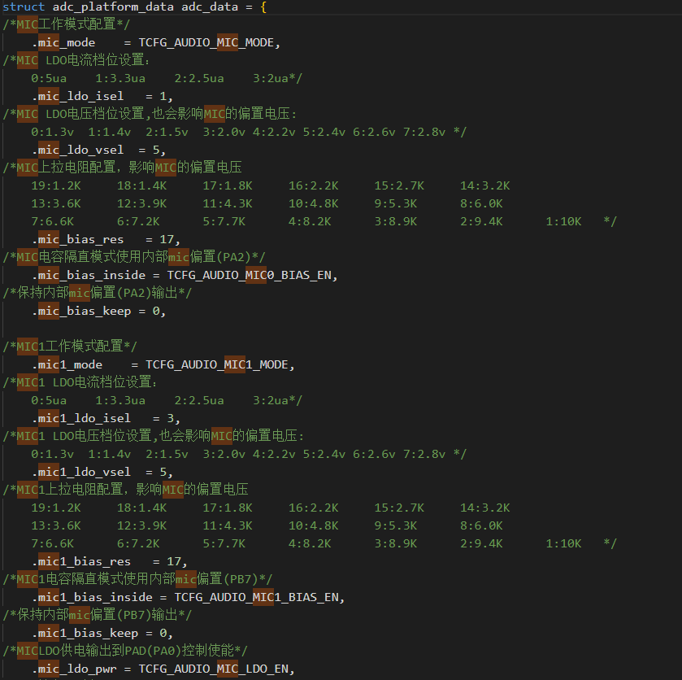

AC697N 系列有两个 mic_in， 默认使用 mic0_in  

**Mic 的偏置方式选择：**

- 省电容模式内部提供偏置， 配合内部偏置电阻， 将 mic 的偏置电压调整到 1.4 到 1.5 之间， 正常工作状态， mic 的电压会收敛稳定在 1.5v 左右。 
- 隔直电容模式（a） MIC_LDO 提供偏置： 配合内部偏置电阻 mic_bias_res， 调整 mic 的偏置电压（b） DACVDD 或者其他电源提供偏置 

主要关注以下变量：  

- mic_capless： 0： 选用不省电容模式 1： 选用省电容模式  
- mic_bias_res： mic_ldo 内部上拉偏置电阻， 使用内部偏置时有效， 选择范围为：  

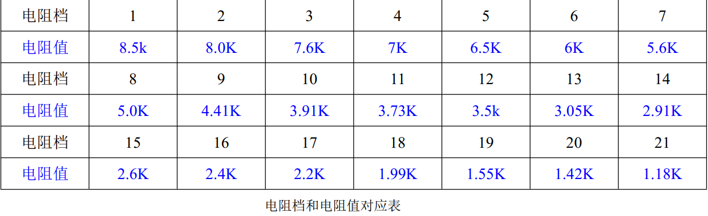

- mic_ldo_vsel： mic_ldo 的偏置电压， 与偏置电阻共同决定 mic 的偏置， 选择范围为：  

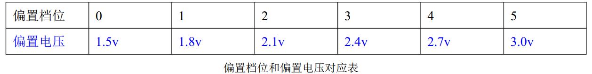

mic_bias_inside： mic 外部电容隔直， 芯片内部提供偏置电压， 当 mic_bias_inside=1， 可以正常使用 mic_bias_res 和 mic_ldo_vsel。

注意： 如果用的是硅 mic 的话要配置成不省电容模式， 并且要 io 口独立给硅 mic 供电。 如果供电的时候硅 mic 的偏置在 0.9v 以上， 则此款硅 mic 不适用于 dac 跑低压的方案。  

## 两个 IO 口推两个灯配置  

在每个 board.c 文件里都有配置 pwmled 参数的结构体， 如下图所示：  

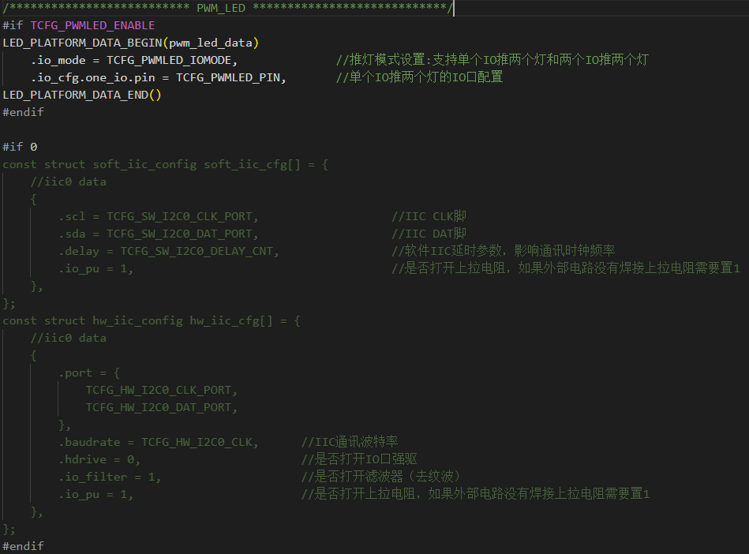

如果需要两个 IO 推灯应用， 需要增加 two_io 结构配置， 如上图红框内增加的配置； 不需要两个 IO推灯的应用， 不需要增加 two_io 结构配置， 板级配置不需要更改。 

**总共几个灯？一个耳机有两个灯？** 

## 是否使用配置文件的参数配置

- **配置文件？那里的配置文件？可视化配置工具生成的配置文件吗？**

- **可视化工具会修改所有的板级配置文件吗？**

- **不想从配置文件读取的的话，就直接去板级文件的实现中修改。**

默认 sdk 是从配置文件读取配置来设置灯状态和提示音， 如果不想从配置文件读取配置， 只需修改 ：

`apps\earphone\user_cfg.c`

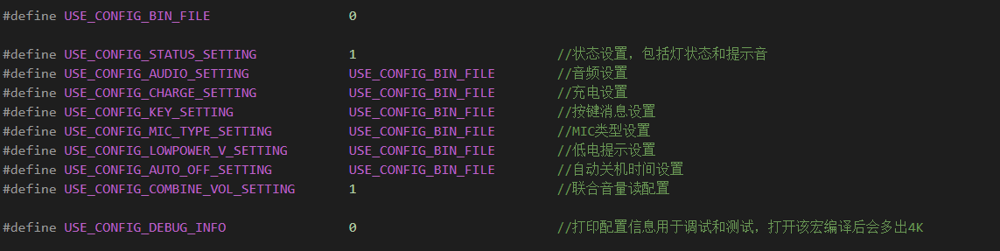

即可， 然后默认配置在每个 board.c 里面设置

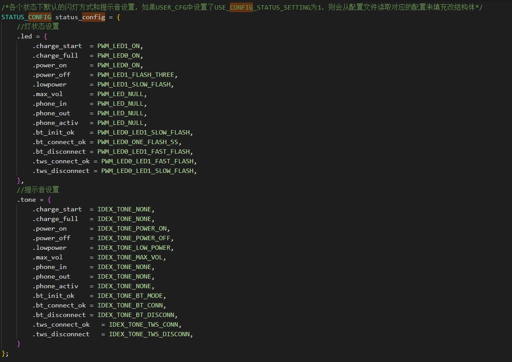

### **配置文件与板级配置文件的区别？**？？？？

注意： 如果想生成的 fw 文件能单独配置某些选项， 要把对应的宏打开， 如果想全部打开则设置#define USE_CONFIG_BIN_FILE   1  即可 

## 充电仓使用注意点  

目前市面上充电仓芯片主要分为三种：

1、 5v 输出常开

2、 充满 5v 关闭

3、 充满 5v 掉到 3v （如 Sy7628） 

第一种， 样机充满后进入 power off ， 禁能下拉电阻整体功耗大概是 5uA

第二种， 可以正常使用， 但是这种充满电就断了 5v ， 样机就不能做拔出开机快速连接

第三种， 充满后， 5v 变弱驱 3v ， 充满后进入 power off， 功耗和维持电压及下拉电阻设置相关  

## 长按复位设置

新发出的 V0.0.3 以上版本的设置在如下路径...\cpu\br30\tools 的 isd_config.ini 文件设置硬件复位原理都是 IO 口检测对应的电平及持续的时间进行判断， 从而复位芯片。 

- 长按按键后，IO口会出现高低电平持续时间，通过检测这个持续时间。

方式一般有以下两种 ：

- 按键长按复位， 默认配置为 RESET=PB01_08_0; 即 PB1 检测到低电平持续 8s， 就会复位  
  - **没看到有定义？？？**
- LDOIN 入仓复位， 默认配置为 RESET=LDOIN_02_1;即**耳机入仓**之后 LDOIN **引脚检测到高电平持续 2s,就会复位。**（正常运行的耳机入仓会将复位检测电平重新设置为低电平， 出仓之后才设置为 高电平， 所以不用担心正常样机入仓也会复位的情况， 死机的样机入仓不会重新设置检测电平所以会复位） 
  - **没明白这个意思？？？**
  - **什么情况下才需要入仓复位操作？？？**

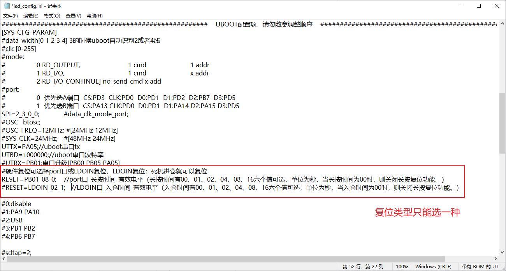

长按时间有 00、 04、 08、 16 可选， 其他值默认选 08  

- **FN3相同文件中却找不到。**

## 内置触摸按键配置

### 关于内置触摸按键感应原理

内置触摸按键检测模块是利用人体分布电容对触摸按键电容影响来进行按键检测的， 如下图:

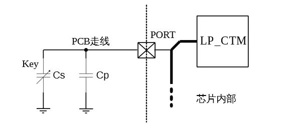

当人体触摸外部电容按键时， IO 口外部电容增加， 芯片内部的触摸感应模块可以检测到该电容变化， 从而检测到按键是否被按下。 在没有触摸的时候， PCB 板走线和其他寄生电容组成了触摸按键固有电容 Cp， 当按键被触摸时， 电容增加了 Cs， 当 Cs/Cp 越大时， 触摸按键检测越灵敏， PCB layout建议尽可能减少 Cp， 增加 Cs， 以增加触摸按键灵敏度。 

- **这不就相当于BS8116电容触摸按键吗？通过IRQ判断是否有按键按下。**

### 关于触摸按键硬件布板的建议

- 按键离芯片的距离。 **离芯片越近的按键， 其触摸效果越好**， 反之则越差。 因此用户在 PCB 布局的时候， 尽量将芯片放置在距离芯片最近的位置。  
- 按键至芯片的连线线宽。 按键至芯片走线越细， 触摸效果越好， 反之则越差。 因此尽量使按键至芯片之间连线更细。  
- 按键至芯片的连线和其它信号线（包括地线） 的距离。 距离越远， 则其它信号线对触摸按键的影响越小， 建议触摸按键至芯片的连线尽量远离其它信号线。  
- 触摸按键和面板的接触面积。 面积越大、 接触越紧密， 触摸效果越好， 反之越差  
- 触摸面板的材质和厚度。 面板越薄， 触摸效果越好， 反之越差。 用玻璃、 微晶板等材质做成的面板， 其触摸效果要比用塑料、 有机玻璃等材质做成的面板好。 而金属材质的面板无法检测触摸按键。 
- 上面所说的触摸效果/灵敏度， 本质是外部电容  

### 关于触摸按键软件配置介绍

#### 触摸按键配置结构体

在每个板级配置文件里面配置触摸模块相关配置：

- **板级配置头文件和源文件中**

`apps\earphone\board\br36\board_ac700n_demo.c`

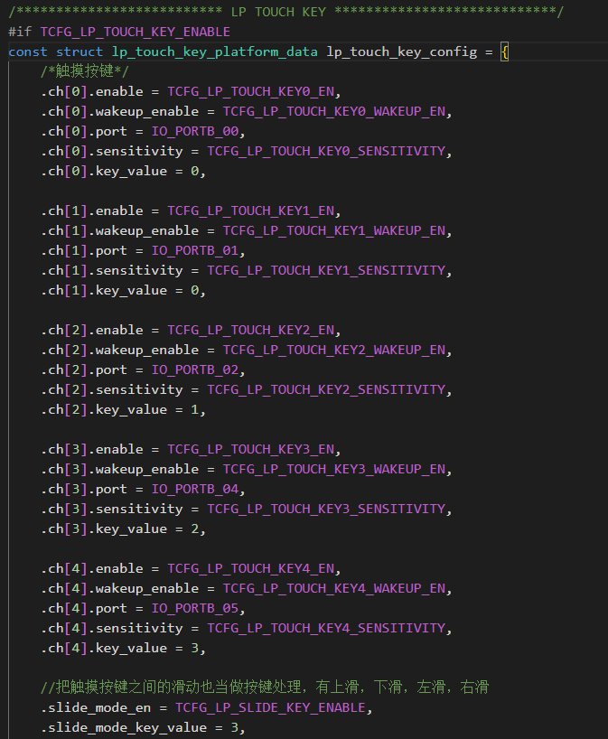

结构体配置说明：  

- enable
  - 触摸模块开关， enable = 1 和宏 TCFG_LP_TOUCH_KEY_ENABLE 同时打开使能该模块
  - **TCFG_LP_TOUCH_KEY_ENABLE板级头文件里面的宏定义，在源文件中使用，比1更加容易理解。**
- port
  - 触摸模块检测 IO 固定为 PB01， 不能更改；
- sensitivity
  - 触摸按键模块电容灵敏度级数配置， 该参数可以通过配置工具配置；
- key_value
  - 触摸按键键值， 该值会对应 key_table 按键消息表， 但按键被检测到按下时， 会响应对应消息
  - 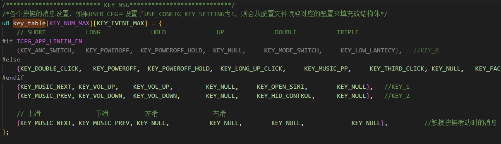
  - 触摸按键默认键值为 0， 可以检测单击， 长按， HOLD， 长按释放， 双击和三击按键操作类型， 用户可以修改不同按键操作类型对应的响应事件；

**apps\earphone\board\br36\board_ac700n_demo_cfg.h**

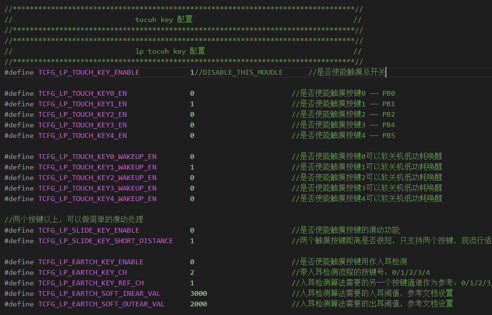

#### 疑问

**都带屏幕了，难道整块屏幕不能做触摸按键使用？那怎么确定触摸按键的位置呢？**

#### 关于灵敏度参数配置  

灵敏度参数， 即对应结构体 的 sensitivity 变量， 该参数表示的是触摸模块检测的电容变化量灵敏度， 范围为 0~9 级， 级数数值越大， 电容变化很小时也可以检测到， 级数数值越小， 电容变化很大时才可以检测到， 值得注意的是对于某一个固定的硬件（包含触摸片和触摸面板）， 触摸时电容变化量一般固定， 因此用户调试时可以从级数最小值 0 开始调试， 级数配置值逐渐增加， 直到得到满足需求的灵敏度级数。 

该参数配置方式有两个：  

- **apps\earphone\board\br36\board_ac700n_demo_cfg.h**

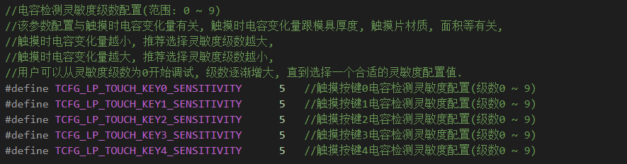

- 通过配置工具配置  

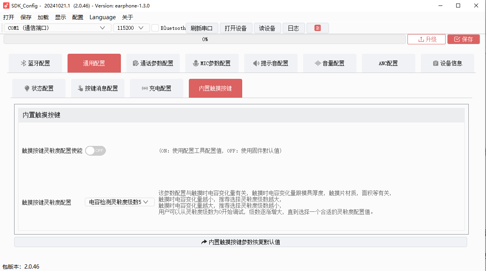

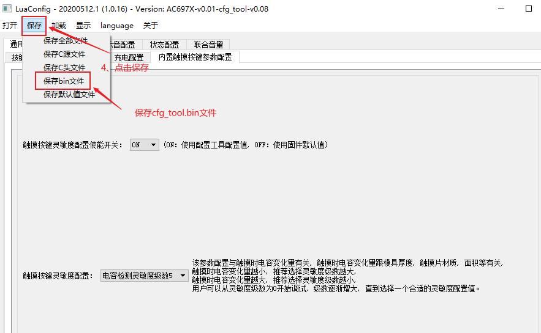

保存 cfg_tool.bin 文件后， 升级固件， 检测触摸按键灵敏度是否满足需求。  

- 这个我会，使用蓝牙测试盒，把ufw文件作为固件源更新即可。

#### 关于支持触摸按键多击的修改  

内置触摸按键默认支持最多连续 3 击的事件判断（实际操作超过三击按照三击事件处理）， 如果用户需要支持更多击得事件处理， 可以通过两种方式修改。  

1. **cpu\br36\lp_touch_key.c**

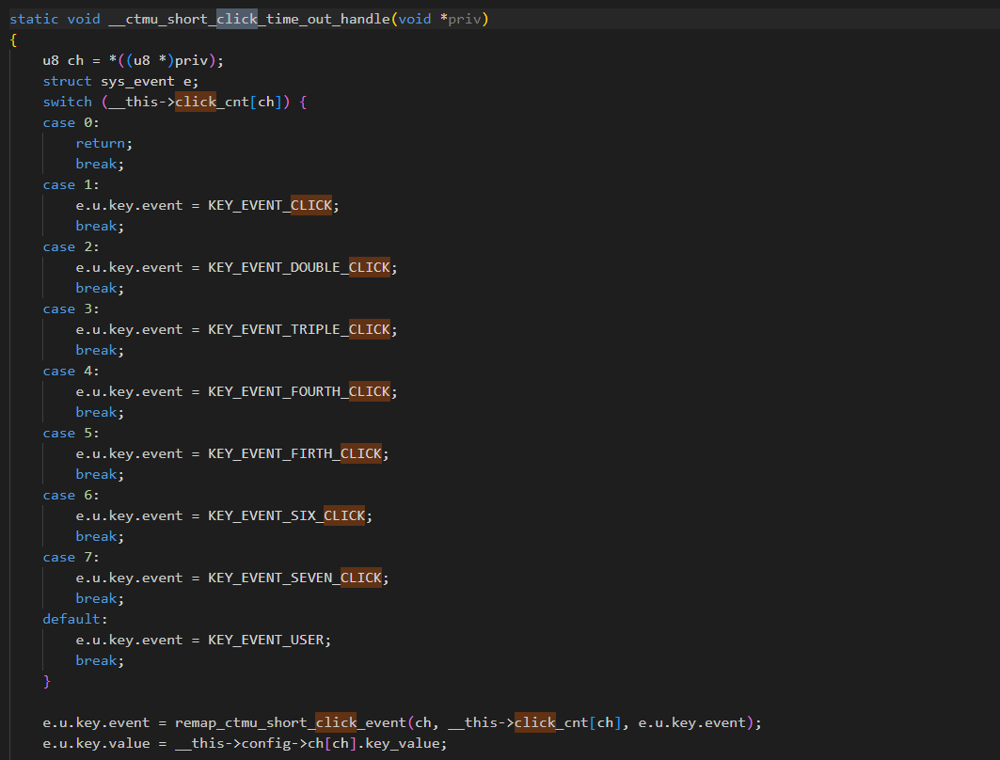

变 量 __this->click_cnt 就 是 内 置 触 摸 模 块 检 测 到 得 多 击 次 数 ， 用 户 可 增 加KEY_EVENT_FOURTH_CLICK， KEY_EVENT_FIRTH_CLICK（ 改定义在 event.h 文件） 或者更多击事件类型；

- **对应的点击次数会对应到不同的事件。**  
- **这里可以增加按键点击的事件类型，点击多少次对应的事件可以自定义。**

**方法2：**

在各自得板级配置文件里面给用户预留的按键事件处理函数， 该方法比较适合同一 SDK多个板级同时开发的情况， 例如在板级配置文件 board_ac8972a_demo.c 添加自定义函数：  

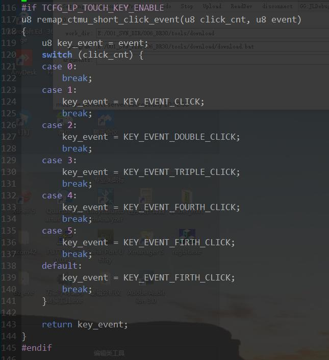

通过这两种方法中的一个可以实现**用户任意多击的事件发送**， 最后用户可以在对应板级文件， 例如board_ac8972a_demo.c 的按键事件表填写增肌对应多击的响应的事件即可：  

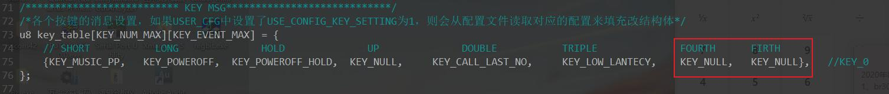

#### 关于按键事件操作的一些时间配置

`include_lib\driver\cpu\br36\asm\lp_touch_key_hw.h`

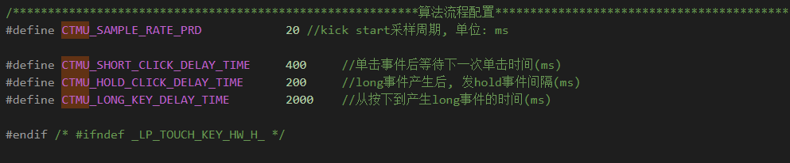

- CTMU_SHORT_CLICK_DELAY_TIME： 该配置是指在单击按键抬起后等待下一次单击的时间， **该配置用于任意多击统计**， 单位： ms； 
  - 400ms之内再点击的话，算多次点击
  - 超过400ms再点击的话，算单次点击
- CTMU_LONG_CLICK_DELAY_TIME： 该配置是指产生长按事件的触摸时间， 单位： ms；   
- CTMU_HOLD_CLICK_DELAY_TIME： 该配置是指持续触摸按键不放超过长按触摸时间`（CTMU_LONG_CLICK_DELAY_TIME）` 后每隔该配置时间会发送一个 HOLD 事件， 单位： ms；  

**include_lib\driver\cpu\br36\asm\lp_touch_key_api.h**

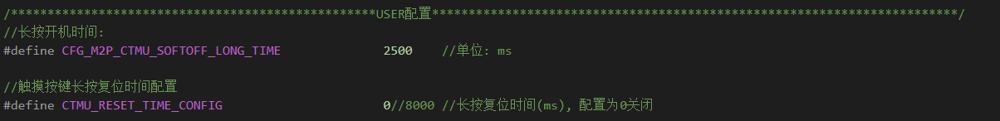

#### 关于触摸模块动态关闭接口

在某些情况下， 用户希望不产生触摸按键事件， 用户可调用接口动态打开和关闭触摸模块  

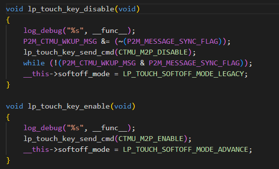

- 关闭触摸模块， 可调用 lp_touch_key_disable()接口；  
- 打开触摸模块， 可调用 lp_touch_key_enable()接口；  

## AC700N 输出 EVDD 电源说明  

### EVDD 电源介绍

AC700N 内置一个可供外部 DSP 供电的 EVDD 电源， 有如下特性：

- 驱动能力 5mA 1.0 ~ 1.2v, 挡位可调；  
- 固定从 PB3 IO 输出, 输出时需要将 IO 口设置为高阻状态；  
- 在低功耗模式会默认关闭， 如果需要在低功耗模式下保持， 需要注册低功耗回调函数， 进入LOW_POWER_MODE_LIGHT_SLEEP 模式; 
- 暂不支持 softoff 状态保持;  

AC700N 的 EVDD 电源是一个内置的电源，其主要作用是**为外部的 DSP (Digital Signal Processor) 芯片供电**。

简单来说，如果你在设计中使用了 AC700N 芯片，并且还需要连接一个外部的 DSP 芯片来处理某些任务，那么 AC700N 内部的这个 EVDD 电源就可以直接给这个外部 DSP 提供所需的电源（电压范围在 1.0V 到 1.2V 之间，电流最大 5mA），而不需要额外再增加一个独立的电源芯片来给 DSP 供电。这有助于简化硬件设计和降低成本。

### evdd 使用例程

如何在 AC700N 芯片上通过软件控制来使用（打开、关闭）这个内置的 EVDD 电源，以及如何在低功耗模式下保持其开启状态。

第一部分：包含头文件

```c
#include "asm/power/p33.h"
```

这行代码引入了与电源管理和控制相关的头文件，其中包含了控制 EVDD 电源的函数声明（比如 `evdd_output_2_pb3`）以及相关的电压挡位定义（比如 `EVD_VOL_SEL_110V`）。

第二部分：打开 EVDD 电源 (`evdd_output_open`)

```c
void evdd_output_open(){
    //把 PB3 设置为高阻状态:
    gpio_set_pull_up(IO_PORTB_03, 0); // 禁用上拉电阻
    gpio_set_pull_down(IO_PORTB_03, 0); // 禁用下拉电阻
    gpio_set_die(IO_PORTB_03, 0);     // 禁用数字输入
    gpio_set_dieh(IO_PORTB_03, 0);    // 禁用高压数字输入
    gpio_set_direction(IO_PORTB_03, 1); // 设置为输入方向 (与上面的禁用配合实现高阻)

    //输出 evdd 电源:
    evdd_output_2_pb3(1, EVD_VOL_SEL_110V);
}
```

- **GPIO 配置（关键步骤）**: 文档提到 EVDD 电源是固定从 PB3 这个 IO 口输出的。但 PB3 首先是一个通用的 IO 口，它可以被用作数字输入、输出等。为了让内部的 EVDD 电源能够通过 PB3 “流出来”，需要将 PB3 这个 IO 口配置成一个**高阻抗**的状态。你可以理解为把这个门口清理干净，不让 PB3 作为普通的数字引脚工作（不推高、不拉低、不作为输入接收信号），从而让内部的模拟电源能够顺畅地通过它输出。代码中的 `gpio_set_pull_up`, `gpio_set_pull_down`, `gpio_set_die`, `gpio_set_dieh`, `gpio_set_direction` 这些函数就是完成这个高阻态配置的。
- **调用输出函数**: `evdd_output_2_pb3(1, EVD_VOL_SEL_110V)` 是实际控制 EVDD 电源的函数。
  - 第一个参数 `1` 表示**使能**（打开）EVDD 电源输出。
  - 第二个参数 `EVD_VOL_SEL_110V` 表示选择输出电压为 1.10V。你可以根据需要选择其他电压挡位，比如 `EVD_VOL_SEL_100V`, `EVD_VOL_SEL_105V`, `EVD_VOL_SEL_115V`。

第三部分：关闭 EVDD 电源 (`evdd_output_close`)

```c
void evdd_output_close() {
    evdd_output_2_pb3(0, EVD_VOL_SEL_110V);
}
```

这个函数很简单，调用 `evdd_output_2_pb3` 函数，第一个参数设置为 `0`，表示**禁用**（关闭）EVDD 电源输出。第二个参数在此处影响不大，因为电源已经关闭。

第四部分：低功耗模式保持

```c
static u8 evdd_idle_query(void){
    return 1; // 表示 EVDD 模块在低功耗时需要保持（或者允许进入低功耗）
}
static enum LOW_POWER_LEVEL evdd_level_query(void) {
    return LOW_POWER_MODE_LIGHT_SLEEP; // 表示 EVDD 模块需要在 Light Sleep 模式下保持
}
REGISTER_LP_TARGET(evdd_lp_target) = {
    .name = "evdd", // 注册一个名为 "evdd" 的低功耗目标
    .level = evdd_level_query, // 关联查询低功耗模式级别的函数
    .is_idle = evdd_idle_query, // 关联查询模块是否可以进入低功耗（或需要保持）的函数
};
```

AC700N 可能有多种低功耗模式。默认情况下，为了省电，进入低功耗模式时 EVDD 电源会自动关闭。如果你的外部 DSP 在 AC700N 进入某些低功耗模式（比如 Light Sleep）时仍然需要供电，你就需要通过注册低功耗回调函数来告诉系统“请在进入 Light Sleep 模式时保持 EVDD 电源开启”。

- `evdd_idle_query`: 这个函数通常用来判断一个模块当前是否处于空闲状态，可以进入低功耗。在这里返回 `1` 可能意味着 EVDD 模块是可以被低功耗管理系统处理的，结合 `level_query` 表明它需要在指定的低功耗模式下保持。
- `evdd_level_query`: 这个函数返回 EVDD 模块需要保持工作的最低低功耗模式级别。`LOW_POWER_MODE_LIGHT_SLEEP` 表示它需要在 Light Sleep 模式下保持开启。
- `REGISTER_LP_TARGET`: 这是一个宏，用于将上面两个函数注册到系统的低功耗管理框架中。通过这种方式，当系统准备进入低功耗模式时，会检查所有注册的低功耗目标，并根据它们的 `level_query` 和 `is_idle` 的返回值来决定是否关闭该模块或者进入哪种低功耗模式。在这里，它确保系统知道在 Light Sleep 模式下不应该关闭 EVDD。

**总结例程的流程：**

1. 在需要使用 EVDD 电源时，调用 `evdd_output_open()`。
2. `evdd_output_open()` 会先执行关键的 GPIO 配置，将 PB3 设置为高阻态，为 EVDD 输出铺平道路。
3. 然后调用 `evdd_output_2_pb3(1, voltage)` 使能 EVDD 电源并设置电压。
4. 在不需要 EVDD 电源时，调用 `evdd_output_close()`，它会调用 `evdd_output_2_pb3(0, ...)` 关闭电源。
5. 如果你的应用场景需要在 AC700N 进入 Light Sleep 模式时，连接在 PB3 上的外部 DSP 依然需要工作，那么你需要在初始化时注册那组低功耗回调函数 (`evdd_idle_query`, `evdd_level_query`) 和低功耗目标 (`evdd_lp_target`)，这样系统在进入 Light Sleep 时就不会关闭 EVDD 了。

理解这个例程的关键在于：**GPIO 配置**是使用 EVDD 电源输出的前提，以及**低功耗回调**是处理电源在低功耗模式下行为的关键。

# app_main.c(入口)

SDK项目的主要入口函数

1. 初始化阶段：

```c
app_var.start_time = timer_get_ms();  // 记录启动时间
audio_enc_init();   // 初始化音频编码器
audio_dec_init();   // 初始化音频解码器
```

2. 更新检查：

```c
if (!UPDATE_SUPPORT_DEV_IS_NULL()) {
    update = update_result_deal();  // 检查是否需要固件更新
}
```

3. 变量初始化：

```c
app_var_init();  // 初始化应用变量
```

4. 根据不同状态进入不同工作模式：

   - 如果检测到充电状态：

   - ```c
     if (get_charge_online_flag()) {
         // 进入空闲模式
         init_intent(&it);
         it.name = "idle";
         it.action = ACTION_IDLE_MAIN;
         start_app(&it);
     }
     ```

   - 如果是正常开机：

   - ```c
     else {
         // 检查电压
         check_power_on_voltage();
         // 检查开机条件
         app_poweron_check(update);
         // 初始化UI
         ui_manage_init();
         
         // 根据配置进入不同模式：
         // 1. PC模式
         // 2. 助听器模式
         // 3. Line-in模式
         // 4. 耳机模式（默认）
     }
     ```

5. 特殊功能支持：

   - 支持无线麦克风

   - 支持USB CDC后台运行
   - 支持系统停止状态确认

这个入口函数主要负责：

1. 系统基础模块的初始化
2. 检查设备状态（充电、电压等）
3. 根据不同配置和状态启动相应的应用模式
4. 管理设备的工作状态切换

## UI初始化

`ui_manage_init()`： 从  `apps\earphone\ui_manage.c`中可以看到：

```c
int ui_manage_init(void)
{
    if (!sys_ui_var.ui_init_flag) {
        cbuf_init(&(sys_ui_var.ui_cbuf), &(sys_ui_var.ui_buf), UI_MANAGE_BUF);
        sys_ui_var.ui_init_flag = 1;
    }
    return 0;
}
```

这个函数主要初始化了：

- 一个循环缓冲区(cbuf)用于UI状态管理
- 缓冲区大小为 `UI_MANAGE_BUF`(8字节)
- 设置初始化标志位

`ui_update_status(STATUS_POWERON)`： 这个函数用于更新UI状态，传入参数是开机状态( STATUS_POWERON)

从代码中可以看到，SDK支持三种UI显示方式：

1. LED数码管显示 (`STYLE_JL_LED7`)
2. LCD简单显示 (`STYLE_UI_SIMPLE`)
3. LCD复杂显示 (`STYLE_JL_WTACH` 或 `STYLE_JL_SOUNDBOX`)

具体初始化过程会根据 `CONFIG_UI_STYLE` 的配置来决定：

- 如果是LED数码管显示：

```c
#define UI_INIT(a)             led7_ui_init(a)
#define UI_SHOW_WINDOW(a)      ui_set_main_menu(a)
```

- 如果是简单LCD显示：

```c
#define UI_INIT(a)            lcd_ui_init(a)
#define UI_SHOW_WINDOW(...)
```

- 如果是复杂LCD显示：

```c
#define UI_INIT(a)            lcd_ui_init(a)
#define UI_SHOW_WINDOW(a)     ui_show_main(a)
```

对于LCD显示，初始化过程会：

1. 创建UI任务
2. 初始化显示缓冲区
3. 加载资源文件
4. 设置刷新定时器

总的来说，这两个函数完成了：

1. UI管理系统的初始化（状态管理、缓冲区等）
2. UI显示设备的初始化（LED或LCD）
3. 设置初始显示状态为开机状态
4. 根据不同显示类型配置相应的显示参数

# 日志不断重启分析

电源按下，烧录器绿灯闪烁。日志一直在输出，感觉像是不断重启：

## 日志分析：设备为何不断重启？

你提供的日志显示设备（可能是一款蓝牙耳机）存在重复的初始化序列，这确实表明它可能在不断重启。我将通过分析日志内容，找出可能的重复模式和重启原因，

**日志中的重复模式：**

日志中出现了至少三次类似的初始化序列，每次都从以下内容开始：

```c
[00:00:00.100]get_chip_id:   151f
[00:00:00.101]get_vbat_trim: 8
[00:00:00.102]get_vbg_trim:  1
```

随后是复位源（Reset Source）信息、版本信息、文件系统挂载、硬件初始化等步骤。这种重复表明设备在完成一次初始化后，又重新开始了整个过程。以下是三次序列的起点和关键差异：

- **第一次**：时间戳从 [00:00:00.100] 开始，复位源为 VDDIO LVD（低电压检测）。
- **第二次**：时间戳同样从 [00:00:00.100] 开始，复位源为 VDDIO POR（上电复位）。
- **第三次**：时间戳再次从 [00:00:00.100] 开始，复位源为 VDDIO LVD。

时间戳始终从 [00:00:00.100] 开始，说明每次重启后日志都被重置，而不是连续记录。这支持了设备反复重启的假设。

## 复位原因分析

日志中的复位源（Reset Source）提供了重启原因的线索：

- **VDDIO LVD（低电压检测）**：出现在第一次和第三次，表示设备的 VDDIO（I/O电源电压）低于某个阈值，导致硬件触发复位。这通常与电源供应不足有关。
- **VDDIO POR（上电复位）**：出现在第二次，表示设备经历了完全断电后重新上电的情况，可能是电池电压过低或电源管理问题导致。

此外，第一次序列中还出现了以下消息：

```c
[00:00:01.311]temp_percent abnormal, reset!!!
```

这表明设备检测到温度异常并主动触发了一次复位。然而，这个消息在第二次和第三次序列中没有出现，可能是因为重启发生在温度检测之前，或者问题具有间歇性。

### 电源相关线索

电池电压（vbat）可能是重启的关键因素。日志中记录了以下电压值：

- **第一次**：vbat = 3936 mV，后来在 [00:00:01.289] 检查时变为 vbat: 389（单位可能是 mV，实际为 3890 mV）。
- **第二次**：vbat = 3936 mV，后来检查时为 vbat: 393（约 3930 mV）。
- **第三次**：vbat = 3728 mV，电压明显低于前两次。

用户配置中定义了电压阈值：

```c
[00:00:00.436][Info]: [USER_CFG]warning_tone_v:3500mv poweroff_tone_v:3100mV
```

- 警告电压：3500 mV
- 关机电压：3100 mV

第三次的 3728 mV 虽高于警告电压，但 VDDIO LVD 的触发阈值可能不同（VDDIO 可能是由电池电压通过稳压器生成的）。电压从 3936 mV 下降到 3728 mV 表明电池电量可能在快速耗尽，或存在供电不稳定的问题，导致 LVD 复位。

### 软件和配置问题

日志中还出现了一些错误信息，可能与重启有关：

- **EQ（均衡器）配置错误**：

```c
[00:00:00.511](error): <Error>: [EQ_CFG_TOOL]eq ver err
[00:00:00.512](error): <Error>: [EQ_CFG_TOOL]cfg_info err
```

每次初始化时都报告 EQ 版本和配置信息错误，可能是固件或配置文件损坏，导致初始化失败并触发重启。

- **音频 DAC 初始化问题**：

```c
[00:00:00.530]audio dac no analog gain !!!
```

这表明音频 DAC 的增益设置可能有问题，虽然不一定会直接导致重启，但可能影响设备稳定性。

## 重启的可能原因总结

综合分析，以下是设备不断重启的可能原因：

1. 电源问题：
   - 电池电压下降（从 3936 mV 到 3728 mV），可能触发 VDDIO LVD。
   - 电池电量不足或充电状态异常，导致供电不稳定。
2. 温度异常：
   - 第一次重启明确由 temp_percent abnormal 触发，可能是温度传感器错误或实际过热。
3. 软件/配置错误：
   - EQ 配置错误可能导致初始化失败并重启。
   - 固件bug或其他配置问题也可能是潜在原因。

**每次重启后，日志只记录到某个阶段（例如第一次到播放开机音，第二次和第三次更早结束），表明设备可能在初始化后期或运行时崩溃。**

# 日志运行成功

## 日志分析：设备成功启动的原因

根据你提供的日志，这次设备（可能是一款蓝牙耳机）成功完成了启动过程，并进入了正常工作状态。相较于之前可能出现的不断重启问题，这次的日志显示设备顺利完成了初始化、蓝牙配对和连接等操作。以下是对日志的详细分析，解释设备成功启动的原因。

### 复位源分析

日志显示设备的复位源如下：

```c
[00:00:00.102][0-MSYS]--Reset Source : 0x20
[00:00:00.103]MAIN SYS SOFT RESET : JL_CLOCK->PWR_CON[4]=1
```

复位源为 0x20，即 MAIN SYS SOFT RESET（软件复位）。

这表明设备是由软件主动触发的复位，可能是用户操作（如按键开机）或正常关机后的重启，而不是由硬件故障或电源不稳定导致的异常重启（如之前的 VDDIO LVD 或 VDDIO POR）。

**结论**：软件复位表明启动过程是正常的，没有受到硬件问题的干扰。

### 电源状态改善

日志中电池电压（vbat）数据如下：

```c
[00:00:00.197]vbat = 4536 mv
[00:00:00.371]vbat: 453
[00:00:10.388]bat_val 428 --> percent 100,    temp_percent 100    100 100
[00:00:20.388]bat_val 433 --> percent 100,    temp_percent 100    100 100
[00:00:21.297]bat_val 410 --> percent 100,    temp_percent 70    70 100
[00:00:30.994]bat_val 434 --> percent 100,    temp_percent 70    70 100
```

- 初始电压为 **4536 mV**，后续稳定在 **410-434**（可能表示 4100-4340 mV）。

- 用户配置的警告电压为 **3500 mV**，关机电压为 **3100 mV**，当前电压远高于这两个阈值。

- 电池百分比始终显示为 **100%**，表明电量充足。

**结论**：电源电压充足且稳定，避免了因电压不足导致的重启问题。

- **使用的是USB电源？没有使用电池的？？？但是蓝牙连接后显示的是电池的电量**

### 温度状态正常

温度相关数据如下：

```c
[00:00:10.388]bat_val 428 --> percent 100,    temp_percent 100    100 100
[00:00:20.388]bat_val 433 --> percent 100,    temp_percent 100    100 100
[00:00:21.297]bat_val 410 --> percent 100,    temp_percent 70    70 100
[00:00:30.994]bat_val 434 --> percent 100,    temp_percent 70    70 100
```

- 温度百分比（temp_percent）从 100% 变为 70%，均在正常范围内。

- 日志中虽有一次 temp_percent abnormal, reset!!! 的消息，但未导致实际重启，设备继续运行。

**结论**：温度状态正常，未触发因过热或异常导致的复位。

### 软件和配置问题

日志中出现了 EQ 配置错误：

```c
[00:00:00.351](error): <Error>: [EQ_CFG_TOOL]eq ver err
[00:00:00.353](error): <Error>: [EQ_CFG_TOOL]cfg_info err
```

- 尽管存在这些错误，设备并未因此重启，而是继续完成了后续的初始化和蓝牙连接过程。

- 这表明 EQ 配置错误对启动过程影响有限，设备可能有容错机制，或者问题已被修复。

**结论**：软件配置问题未阻止设备正常启动。

### 蓝牙初始化和配对成功

日志显示蓝牙功能顺利完成：

- **BLE 初始化**：

```c
[00:00:00.804]***** ble_init******
[00:00:00.804]ble name(22): JOYROOM Funpods FN3333
```

- **广播开启**：

```c
[00:00:00.897]>  set_adv_enable  1
```

- **TWS 配对初始化**：

```c
[00:00:00.783]<<<<<<<<<<<<<<<<<<<<<<tws_task_init>>>>>>>>>>>>>>>>>>>>>>>>
```

- **蓝牙连接建立**：

```c
[00:00:27.843] HCI_EVENT_CONNECTION_COMPLETE
[00:00:27.971] HCI_EVENT_CONNECTION_COMPLETE
[00:00:27.972] ERROR_CODE_SUCCESS
```

- **安全配对和加密**：

```c
[00:00:28.019] LMP_IO_CAPABILITY_REQ
[00:00:28.562] LMP_ACCEPTED
[00:00:30.949] LMP_STAGE_ENC_START_BY_REMOTE
[00:00:30.965] LMP_START_ENCRYPTION_REQ
```

设备成功与外部设备（可能是手机）建立了连接，并完成了加密配对。

**结论**：蓝牙功能的顺利运行表明设备进入了正常工作状态。

### 音频播放问题

日志中提到：

```c
[00:00:02.424](error): <Error>: [AUDIO_DECODER]wtgv2_dec err:64
```

- 这是播放开机音（power_on.wts）时的解码错误。
- 尽管如此，设备未因该错误重启，且后续日志显示正常运行，表明音频问题未影响整体启动。

**结论**：音频播放虽有小问题，但未阻止设备进入工作状态。

# 日志的组成形式

这个 `_DEBUG_H_` 文件定义了项目使用的日志系统宏。日志信息不是直接通过 `printf` 打印，而是通过这些宏进行封装。

**日志的组成:**

- 日志的输出格式大概是：`[时间戳][日志级别前缀]: [模块标签] 用户自定义信息 \r\n`
- 时间戳：由底层的 `log_print` 函数（或其调用的函数）添加。
- 日志级别前缀：由宏定义确定，如 `[Info]:` (来自 `log_info` 宏), `[Debug]:` (来自 `log_debug` 宏), `<Error>:` (来自 `log_error` 宏)。
- 模块标签：由 `_LOG_TAG` 宏生成，而 `_LOG_TAG` 宏又取决于源文件顶部定义的 `LOG_TAG_CONST` 宏。例如，如果一个文件定义了 `#define LOG_TAG_CONST SDFILE`，那么该文件中打印的日志就会带有 `[SDFILE]` 标签。
- 用户自定义信息：这是你在日志中看到的具体描述性文字，它是作为 `format` 参数传递给 `log_info`, `log_debug`, `log_error` 等宏的字符串。

**核心日志宏:** 根据 `#define LOG_MODE LOG_BY_CONST` 这一行，项目使用的是通过常量控制日志级别的模式。核心的日志打印宏是：

- `log_info(format, ...)`
- `log_debug(format, ...)`
- `log_error(format, ...)`
- `log_info_hexdump(x, y)` (打印 buffer，对应日志中的十六进制数据)
- `log_debug_hexdump(x, y)`
- `log_error_hexdump(x, y)`
- `log_char(x)` (打印单个字符，对应日志中零散的 C, P, f 等)

**如何通过日志追溯源码:**

最重要的搜索策略是：**结合模块标签 (`LOG_TAG_CONST`) 和用户自定义信息（宏的 `format` 参数字符串）进行搜索。**

- **步骤 1：确定模块标签对应的文件** 在日志中找到你感兴趣的某一行，例如： `[00:00:00.122][Debug]: [SDFILE]sdfile mount succ` 这一行的模块标签是 `[SDFILE]`。这意味着在打印这条日志的源文件中，很可能定义了 `#define LOG_TAG_CONST SDFILE`。 **搜索关键词:** `#define LOG_TAG_CONST SDFILE` 找到定义这个宏的文件（很可能是 `sdfile.c` 或相关的头文件）。
- **步骤 2：在该文件中搜索用户自定义信息** 进入上一步找到的文件后，再搜索日志中 **“[模块标签]”后面的那部分字符串**。需要注意的是，这部分字符串通常是作为格式化字符串传递给日志宏的。 例如，对于 `[SDFILE]sdfile mount succ`： **搜索关键词:** `"sdfile mount succ"` （注意双引号，精确匹配字符串常量） 结合宏的用法：搜索 `log_debug("sdfile mount succ")`。

1. - **示例：追溯 `[BTIF]syscfg_btif_init`**
     1. 日志行：`[00:00:00.124][Info]: [BTIF]syscfg_btif_init, spi_mode: 0, logic_addr: 0x1efc000, phy_addr: 0xfd000`
     2. 模块标签：`[BTIF]`。搜索 `#define LOG_TAG_CONST BTIF`。这会带你找到 `btif.c` 或类似的文件。
     3. 用户自定义信息：`syscfg_btif_init, spi_mode: %d, logic_addr: %x, phy_addr: %x` （或者类似的格式字符串）。搜索 `log_info("syscfg_btif_init, spi_mode: %d, logic_addr: %x, phy_addr: %x", ...)`。
   - **示例：追溯错误信息 `[EQ_CFG_TOOL]eq ver err`**
     1. 日志行：`(error): <Error>: [EQ_CFG_TOOL]eq ver err`
     2. 模块标签：`[EQ_CFG_TOOL]`。搜索 `#define LOG_TAG_CONST EQ_CFG_TOOL`。
     3. 用户自定义信息：`eq ver err`。日志级别是 Error，搜索 `log_error("eq ver err")`。注意日志前缀 `<Error>:` 是由宏本身添加的，搜索时不需要包含。
   - **示例：追溯提示音解码错误 `wtgv2_dec err:64`**
     1. 日志行：`(error): <Error>: [AUDIO_DECODER]wtgv2_dec err:64`
     2. 模块标签：`[AUDIO_DECODER]`。搜索 `#define LOG_TAG_CONST AUDIO_DECODER`。
     3. 用户自定义信息：`wtgv2_dec err:%d`。搜索 `log_error("wtgv2_dec err:%d", 64)` 或类似的用法。
   - **示例：追溯十六进制数据** 日志行：`49 53 44 55 04 02...` 紧随 `[SDFILE]sdfile mount succ` 之前。这部分是十六进制 dump。
     1. 确定上下文：它跟 `[SDFILE]` 相关，而且是 dump 数据。
     2. 搜索关键词：`log_info_hexdump`, `log_debug_hexdump`, `printf_buf`。结合文件（通过 `LOG_TAG_CONST SDFILE` 找到）和上下文代码，查找在打印 "sdfile mount succ" 之前或附近调用 `printf_buf` 或 `*_hexdump` 宏的地方。
   - **示例：追溯单个字符** 日志中有很多 C, P, f 等单个字符。
     1. 这些字符通常是低层调试打印，使用 `putchar` 或 `log_char` 宏打印。
     2. 搜索关键词：`log_char`, `putchar`。结合这些字符出现的上下文（例如在 LMP 调试信息附近），查找相关代码。

**总结搜索关键词和方法:**

1. **查找文件:** 搜索 `#define LOG_TAG_CONST 模块标签` （例如 `SDFILE`, `VM`, `BTIF`, `BOARD`, `USER_CFG`, `ANC`, `EQ_CFG_TOOL`, `AUDIO_DECODER`, `LMP`, `HCI_LMP`, `EARPHONE`, `BT_TWS`, `UI` 等）。这是找到日志所属文件的关键。

2. 查找具体打印点:

    在找到的文件中，搜索日志宏的调用及其格式字符串：

   - `log_info("用户自定义信息字符串或格式字符串")`
   - `log_debug("用户自定义信息字符串或格式字符串")`
   - `log_error("用户自定义信息字符串或格式字符串")`
   - `log_info_hexdump(...)`, `log_debug_hexdump(...)`, `log_error_hexdump(...)`
   - `log_char(...)`

通过这种方法，你可以更精确地定位到生成特定日志行的源码位置，从而追溯程序的执行流程。请记住，`format` 字符串可能包含 `%d, %x, %s` 等格式符，搜索时要搜索包含这些格式符的字符串字面量。

## 例子

```c
#define LOG_TAG_CONST APP // 定义模块标签常量
#define LOG_TAG "[APP]" // 显式定义LOG_TAG，在LOG_TAG_CONST存在时，头文件里的_LOG_TAG宏会使用LOG_TAG_CONST生成，所以这行通常是冗余或用于LOG_TAG_CONST未定义的情况。但日志输出结果确认了标签是"[APP]"。
#define LOG_ERROR_ENABLE // 这些ENABLE宏在LOG_BY_CONST模式下不起作用
#define LOG_DEBUG_ENABLE
#define LOG_INFO_ENABLE
/* #define LOG_DUMP_ENABLE */ // 也没有启用 dump
#define LOG_CLI_ENABLE // 这个宏跟debug.h提供的日志宏无关
#include "debug.h" // 包含日志头文件

// ... 其他代码 ...

log_info("app_main\n"); // 调用log_info宏打印日志

// ... 其他代码 ...
```

对应到日志输出就是：

```
[00:00:00.362][Info]: [APP]app_main
```

这里的对应关系非常清晰：

1. **`LOG_TAG_CONST APP`** 或 **`#define LOG_TAG "[APP]"`** 决定了日志中的模块标签是 `[APP]`。要找到这个文件，最可靠的方式是搜索 `#define LOG_TAG_CONST APP`。
2. **`log_info(...)`** 决定了日志级别是 `[Info]`，并且会调用 `log_print` 函数，由 `log_print` 添加时间戳和 `[Info]:` 前缀。
3. **`"app_main\n"`** 是传递给 `log_info` 宏的 `format` 参数（用户自定义信息）。在源码中，你需要搜索的就是这个字符串字面量。

所以，要追溯 `[00:00:00.362][Info]: [APP]app_main` 这条日志的源码位置，你的搜索步骤就是：

1. 在整个项目代码中搜索 `#define LOG_TAG_CONST APP`。这应该会带你找到包含这个定义的源文件（比如 `app_main.c` 或某个与应用主流程相关的 `.c` 文件）。
2. 打开找到的文件，在文件内部搜索字符串 `"app_main\n"`。
3. 你应该能找到一行类似于 `log_info("app_main\n");` 的代码，这就是日志的打印点。

**重要说明：**

- 你提供的 `#define LOG_ERROR_ENABLE`, `#define LOG_DEBUG_ENABLE`, `#define LOG_INFO_ENABLE` 这几行，在 `_DEBUG_H_` 中，只有当 `LOG_MODE == LOG_BY_MACRO` 时才会影响日志的编译。由于你的 `_DEBUG_H_` 中是 `#define LOG_MODE LOG_BY_CONST`，这些 `*_ENABLE` 宏在该模式下是无效的。实际的日志级别控制是通过 `LOG_IS_ENABLE` 宏和外部常量 `log_tag_const_LOG_INFO_APP` 等实现的，这些常量通常在编译时根据项目的总配置生成或定义在其他配置文件中。理解这一点有助于你查找为什么某个模块的某些级别日志被打印或没有被打印。
- `#define LOG_TAG "[APP]"` 在 `LOG_TAG_CONST` 存在的情况下通常会被 `_LOG_TAG` 宏使用 `STR(LOG_TAG_CONST)` 的结果覆盖，所以写不写可能影响不大，最终标签取决于 `LOG_TAG_CONST`。但如果 `LOG_TAG_CONST` 没有定义，`_LOG_TAG` 会直接使用 `LOG_TAG` 的值。

# 从日志分析SDK启动流程

这个SDK的启动流程：

1. 系统初始化阶段 (0-0.1s):

   - 获取芯片ID (151f)

   - 获取电压和温度相关校准值

   - 系统复位源检查 (P11、P33、VDDIO LVD)

   - 打印固件版本信息 (包括BTSTACK、BTCTRLER、MEDIA等模块)

2. 存储系统初始化 (0.1-0.2s):

   - 初始化VM (虚拟内存)系统

   - 挂载SD文件系统

   - 初始化蓝牙接口配置

3. 板级初始化 (0.2-0.3s):

   - 初始化GPIO配置

   - 配置唤醒源

   - ADC采样通道配置

   - 电池电压和温度检测

   - ANC(主动降噪)模块初始化

4. 用户配置加载 (0.3-0.4s):

   - 读取蓝牙名称、配对码等配置

   - 加载音频相关配置(AEC、EQ等)

   - 加载LED状态指示配置

   - 加载按键配置

5. 核心功能初始化 (0.4-0.8s):

   - 音频编解码器初始化

   - DAC初始化

   - UI系统初始化

   - 播放开机提示音

6. 蓝牙初始化 (0.8-1.0s):

   - 初始化蓝牙控制器

   - 配置蓝牙地址

   - 初始化BLE配置

   - 启动广播

7. 完成启动进入工作状态 (>1.0s):

   - 开始等待蓝牙连接

   - 进入正常工作模式

主要特点：

1. 采用分层初始化架构
2. 包含完整的电源管理
3. 支持双模蓝牙(EDR + BLE)
4. 集成了ANC等高级音频功能
5. 启动过程约1秒完成

# 主要的启动和任务切换流程

1. 主入口文件` apps\earphone\app_main.c`

   - 包含主函数 `app_main()`

   - 定义了系统任务列表 `task_info_table[]`

   - 系统初始化和首个应用启动

2. 任务切换相关文件：

   - ` apps\earphone\app_task_switch.c`: 定义了应用任务列表和切换逻辑

   - ` apps\earphone\earphone.c`: 包含任务切换函数`task_switch()`

   - ` include_lib\system\app_core.h`: 定义了应用程序结构体和核心API

3. 主要调用路径如下：

```c
app_main()  [app_main.c]
├── app_var_init()                    // 初始化应用变量
├── audio_enc/dec_init()              // 初始化音频编解码
├── app_poweron_check()               // 开机检查
├── ui_manage_init()                  // UI管理初始化
└── start_app()                       // 启动首个应用
    └── task_switch()                 // 任务切换函数
        ├── init_intent()             // 初始化意图
        └── start_app()               // 启动新应用
```

应用切换流程：

```c
task_switch(name, action)  [earphone.c]
├── init_intent()                     // 初始化切换意图
├── get_current_app()                 // 获取当前应用
├── ACTION_BACK                       // 退出当前应用
└── start_app()                       // 启动目标应用
```

关键数据结构：

```c
struct application {
    u8 state;
    int action;
    char *data;
    const char *name;
    struct list_head entry;
    void *private_data;
    const struct application_operation *ops;
};

struct intent {
    const char *name;
    int action;
    char *data;
    int exdata;
};
```

这个系统采用了基于意图(Intent)的应用切换机制，类似Android的Activity切换。每个应用都需要注册到系统中，通过 `start_app()` 函数和意图(Intent)来实现应用间的切换。
