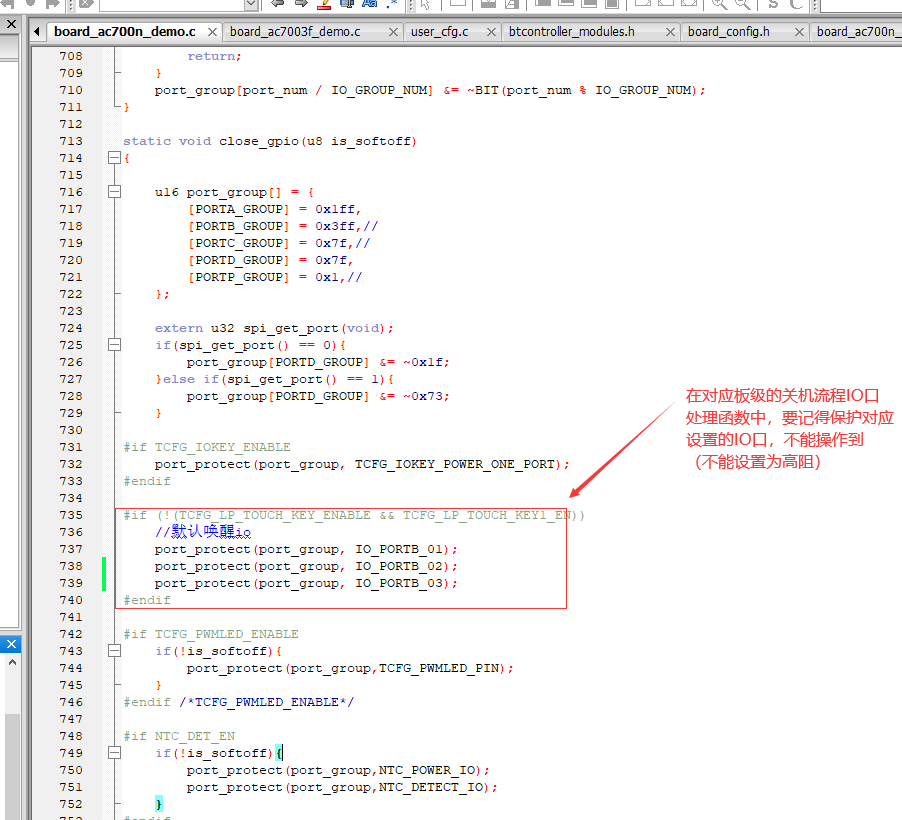
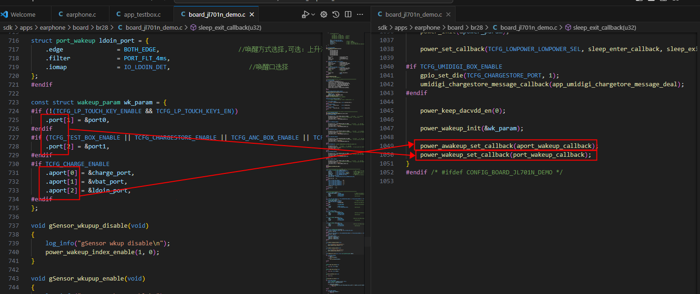

# UI普通外设

## RESET（复位，唤醒，低功耗）

### 唤醒源获取以及唤醒IO设置

#### AC700N/AC701N 唤醒源获取

##### 复位源

可以通过u8 is_reset_source(enum RST_REASON index); 判断复位源进行判断,调试可以通过打印 wakeup_source_value_dump(); 打印出唤醒源的值。

```c
u8 is_reset_source(enum RST_REASON index); //判断复位源
reset_source_dump(); //打印复位源源

//demo
//更多唤醒源查看  include_lib\driver\cpu\br28\asm\power\power_reset.h 定义
is_reset_source(MSYS_POWER_RETURN); //返回1 则代表是 上电复位
```

例子：

```c
apps\earphone\power_manage\app_power_manage.c
/**
 * @brief percent_save变量初始化，用于保存电量
 * 
 */
void percent_save_init(void)
{
    if(percent_save != 0xff){
        printf("percent_save != 0xff -> %d\n", percent_save);
        return;
    }
    is_power_up = (is_reset_source(P33_VDDIO_POR_RST) || is_reset_source(P33_VDDIO_LVD_RST));
    printf(">>>>>>>>>>>>>>>>>>is_power_up %d\n", is_power_up);
    percent_save = get_vm_vbat_percent();
}    
```

这个函数主要是在初始化电量保存变量`percent_save`时,会判断是否是P33复位源导致的唤醒。

- **唤醒时会有保持电量的操作，这个逻辑中会判断是什么复位源导致的唤醒。**
- **这个在机器启动日志有有所体现。**

1. 函数通过调用`is_reset_source()`检查了两种P33复位源:
   - ` P33_VDDIO_POR_RST`: P33 VDDIO掉电复位
   - ` P33_VDDIO_LVD_RST`: P33 VDDIO低压复位
2. 如果是这两种复位源中的任意一种，`is_power_up`变量会被设置为1,表示这是一次上电启动。
3. 这个判断很重要,因为在后续的电量计算逻辑中(` remap_calculate_vbat_percent`函数),会根据` is_power_up`的值来决定是否需要重置电量值:
   - 如果是上电启动(is_power_up=1)且在开机2秒内
   - 并且是非充电状态
   - 且新计算的电量比保存的电量低很多(相差超过20%) 那么就会重置电量值,避免电量显示异常。

这样的设计主要是为了确保在设备重新上电时能够正确处理和显示电量信息。


**也就是说并不是每一次唤醒都会重新计算电量值？**

不是每次唤醒都会重新计算电量值,只有在满足特定条件时才会重新计算。

首先在 `percent_save_init()` 函数中:

```c
void percent_save_init(void)
{
    if(percent_save != 0xff){    // 如果percent_save已经被初始化过,直接返回
        printf("percent_save != 0xff -> %d\n", percent_save);
        return;
    }
    is_power_up = (is_reset_source(P33_VDDIO_POR_RST) || is_reset_source(P33_VDDIO_LVD_RST));
    printf(">>>>>>>>>>>>>>>>>>is_power_up %d\n", is_power_up);
    percent_save = get_vm_vbat_percent();  // 从VM中读取保存的电量值
}
```

在 `remap_calculate_vbat_percent()` 函数中,只有满足以下所有条件才会重新计算电量:

```c
if(temp_percent == 0xff    // 第一次开机
    || (is_power_up && sys_timer_get_ms() < 2000 && get_charge_online_flag() == 0  // 上电启动且2秒内且非充电状态
    && percent < temp_percent && abs((int)(temp_percent/10*10) - (int)(percent)) > 20))  // 且电量差异大于20%
{
    printf("temp_percent abnormal, reset!!!\n");
    temp_percent = percent;  // 重置电量值
}
```

在正常使用过程中,电量值的更新是通过定时检测来完成的:

- 充电状态: 每16秒更新一次 (` CHARGING_POWER_PERCENT_UPDATE_TIME`)
- 非充电状态: 每8秒更新一次 (` NORMAL_POWER_PERCENT_UPDATE_TIME`)

这样设计的原因是:

1. 避免频繁读写VM存储,延长使用寿命
2. 防止电量显示跳变,提供更好的用户体验
3. 在异常情况下(如电池更换后)能够正确重置电量值

在SDK启动入口app_main中，`vbat_check_init()` 函数的主要作用是**初始化电量检测的定时器系统**，而不是直接初始化电量值。

```c
void vbat_check_init(void)
{
    percent_save_init();    // 初始化保存的电量值
    if (vbat_slow_timer == 0) {    // 创建慢速定时器
        vbat_slow_timer = sys_timer_add(NULL, vbat_check_slow, 10 * 1000);
    } else {
        sys_timer_modify(vbat_slow_timer, 10 * 1000);
    }

    if (vbat_fast_timer == 0) {    // 创建快速定时器
        vbat_fast_timer = usr_timer_add(NULL, vbat_check, 10, 1);
    }
}
```

这个函数的主要功能是：

1. 调用 `percent_save_init()` 初始化保存的电量值
2. 创建两个定时器：
   - ` vbat_slow_timer`: 慢速定时器，每10秒触发一次，用于常规电量检测
   - ` vbat_fast_timer`: 快速定时器，每10ms触发一次，用于低电量时的频繁检测

与 `percent_save_init()` 的功能并不重复，而是互补的关系：

- `percent_save_init()`: 负责电量值的初始化，从VM中读取保存的电量
- `vbat_check_init()`: 负责启动整个电量检测系统，包括定时器的创建和管理

在 `app_main` 中调用这个函数的目的是：

1. 确保系统启动后能够及时开始电量监测
2. 通过定时器系统持续监控电池电量变化
3. 在适当时机触发低电量警告、关机等保护措施

**这就是为什么SDK一启动，日志就会有复位源的信息。**

##### 软关机唤醒

软关机唤醒IO可以通过`u8 is_wakeup_source(enum WAKEUP_REASON index);` 对唤醒源进行判断,调试可以通过打印 `wakeup_source_value_dump();` 打印出唤醒源的值

```c
u8 is_wakeup_source(enum WAKEUP_REASON index);  //判断唤醒源
wakeup_source_value_dump(); //打印唤醒源

//demo
//更多唤醒源查看  include_lib\driver\cpu\br28\asm\power\power_wakeup.h 定义
is_wakeup_source(PWR_WK_REASON_EDGE_INDEX1);  //返回1 则代表是 wk_param.port[1] 口唤醒 
is_wakeup_source(PWR_WK_REASON_EDGE_INDEX2);  //返回1 则代表是 wk_param.port[2] 口唤醒
```

在FN3中`include_lib\system\power_manage.h`

关机相关：

```c
void sys_power_poweroff(void *arg);  // 断电关机，不释放资源
void sys_power_shutdown();           // 软关机，会触发DEVICE_EVENT_POWER_SHUTDOWN事件
```

唤醒相关：

```c
// 配置唤醒源
int sys_power_set_port_wakeup(const char *port, int enable);    // 设置IO口唤醒
int sys_power_set_alarm_wakeup(u32 sec, int enable);           // 设置定时器唤醒

// 唤醒源判断
const char *sys_power_get_wakeup_reason();    // 获取唤醒原因
void sys_power_clr_wakeup_reason(const char *str);   // 清除唤醒原因
```

电池相关：

```c
int sys_power_get_battery_voltage();     // 获取电池电压
int sys_power_get_battery_persent();     // 获取电池电量百分比
int sys_power_is_charging();             // 是否在充电
int sys_power_charger_online(void);      // 充电器是否在线
```

其中判断唤醒源的主要是：

- `sys_power_get_wakeup_reason()`: 获取唤醒原因，返回值可能是：
  - `PWR_WKUP_PORT`: IO口唤醒
  - `PWR_WKUP_ALARM`: 定时器唤醒
  - `PWR_WKUP_PWR_ON`: 开机键唤醒
  - `PWR_WKUP_ABNORMAL`: 异常唤醒
  - `PWR_WKUP_SHORT_KEY`: 短按键唤醒

##### SDK打印的复位源含义

在FN3中`include_lib\driver\cpu\br36\asm\power\power_reset.h`定义了一个枚举类型  RST_REASON，详细列出了所有可能的复位原因：

- 主系统(MSYS)复位源：

```c
MSYS_P11_RST,         // P11触发的主系统复位
MSYS_DVDD_POR_RST,    // DVDD掉电复位
MSYS_SOFT_RST,        // 软件复位
MSYS_P2M_RST,         // P2M复位
MSYS_POWER_RETURN,    // 电源恢复
```

- P11系统复位源：

```c
P11_PVDD_POR_RST,     // P11 PVDD掉电复位
P11_IVS_RST,          // IVS复位
P11_P33_RST,          // P33触发的P11复位
P11_WDT_RST,          // 看门狗复位
P11_SOFT_RST,         // P11软件复位
P11_MSYS_RST = 10,    // 主系统触发的P11复位
P11_POWER_RETURN,     // P11电源恢复
```

- P33系统复位源：

```c
P33_VDDIO_POR_RST,    // VDDIO掉电复位
P33_VDDIO_LVD_RST,    // VDDIO低压复位
P33_VCM_RST,          // VCM复位
P33_PPINR_RST,        // PPINR复位
P33_P11_RST,          // P11触发的P33复位
P33_SOFT_RST,         // P33软件复位
P33_PPINR1_RST,       // PPINR1复位
P33_POWER_RETURN,     // P33电源恢复
```

- 异常复位源：

```c
P33_EXCEPTION_SOFT_RST = 20,  // 异常软件复位
P33_ASSERT_SOFT_RST,         // 断言触发的软件复位
```

- P33唤醒源：

```c
PWR_WK_REASON_PLUSE_CNT_OVERFLOW,  // 脉冲计数溢出唤醒
PWR_WK_REASON_PORT_EDGE,           // 端口边沿唤醒
PWR_WK_REASON_ANA_EDGE,            // 模拟边沿唤醒
PWR_WK_REASON_VDDIO_LVD,           // VDDIO低压唤醒
PWR_WK_REASON_EDGE_INDEX0,         // 边沿索引0唤醒
...
PWR_WK_REASON_EDGE_INDEX11,        // 边沿索引11唤醒
```

- 相关的API函数：

```c
u8 power_reset_source_dump(void);        // 打印复位源信息
void set_reset_source_value(enum RST_REASON index);  // 设置复位源
u32 get_reset_source_value(void);        // 获取复位源值
u8 is_reset_source(enum RST_REASON index);  // 判断是否是指定复位源
```

这些复位源信息对于：

1. 系统调试
2. 问题定位
3. 复位原因追踪
4. 电源管理优化 都非常重要。

#### 唤醒IO设置

##### 注册多个IO口唤醒

AC700N及以后SDK 参考代码：

`apps\earphone\board\br36\board_ac700n_demo.c`在板级配置文件中可以注册多个IO口唤醒。

1. 唤醒参数结构体 `wakeup_param`:

```c
const struct wakeup_param wk_param = {
    #if (!(TCFG_LP_TOUCH_KEY_ENABLE && TCFG_LP_TOUCH_KEY1_EN))
        .port[1] = &port0,    // 普通IO口唤醒
    #endif
    #if (TCFG_TEST_BOX_ENABLE || TCFG_CHARGESTORE_ENABLE || TCFG_ANC_BOX_ENABLE)
        .port[2] = &port1,    // 测试盒/充电仓唤醒
    #endif
    #if TCFG_CHARGE_ENABLE
        .aport[0] = &charge_port,   // 充电检测唤醒
        .aport[1] = &vbat_port,     // 电池电压检测唤醒
        .aport[2] = &ldoin_port,    // LDOIN检测唤醒
    #endif
};
```

2. IO口唤醒配置结构体 `port_wakeup`

```c
struct port_wakeup {
    u8 pullup_down_enable;          // 上下拉使能
    u8 edge;                        // 唤醒边沿：FALLING_EDGE/RISING_EDGE/BOTH_EDGE
    u8 both_edge;                   // 双边沿使能
    u8 filter;                      // 滤波时间：PORT_FLT_NULL/1ms/2ms/4ms/8ms/16ms
    u32 iomap;                      // 唤醒IO口
};
```

3. 可以配置的唤醒类型：

   - 普通IO口唤醒 (.port[])：最多支持8个

   - 模拟IO口唤醒 (.aport[])：最多支持3个

4. 实际配置示例：

```c
// 普通按键唤醒配置
struct port_wakeup port0 = {
    .pullup_down_enable = ENABLE,    
    .edge = FALLING_EDGE,           
    .both_edge = 0,
    .filter = PORT_FLT_8ms,
    .iomap = IO_PORTB_01,           
};

// 充电仓唤醒配置
struct port_wakeup port1 = {
    .pullup_down_enable = DISABLE,    
    .edge = FALLING_EDGE,           
    .both_edge = 1,
    .filter = PORT_FLT_1ms,
    .iomap = TCFG_CHARGESTORE_PORT,  
};

// 充电检测唤醒配置
struct port_wakeup charge_port = {
    .edge = RISING_EDGE,           
    .both_edge = 0,
    .filter = PORT_FLT_16ms,
    .iomap = IO_CHGFL_DET,         
};
```

注意事项：

1. 不同唤醒源可以设置不同的触发条件和滤波时间
2. 通过宏定义控制是否启用某个唤醒源
3. 需要注意IO口复用，避免冲突
4. 建议根据实际应用场景选择合适的滤波时间，以平衡功耗和响应速度



在关机流程中的IO口处理函数(通常是`close_gpio()`)中，需要保护那些被设置为唤醒源的IO口。

在关机设置IO口状态的函数中，要做好对应保护，不能改其状态：

保护IO口的函数:

```c
static void port_protect(u16 *port_group, u32 port_num)
{
    if (port_num == NO_CONFIG_PORT) {
        return;
    }
    // 将对应的IO从port_group中清除，这样后续就不会被设置为高阻
    port_group[port_num / IO_GROUP_NUM] &= ~BIT(port_num % IO_GROUP_NUM);
}
```

关机时的IO口处理示例:

```c
static void close_gpio(u8 is_softoff)
{
    u16 port_group[] = {
        [PORTA_GROUP] = 0x1ff,
        [PORTB_GROUP] = 0x3ff,
        [PORTC_GROUP] = 0x7f,
        [PORTD_GROUP] = 0x7f,
        [PORTP_GROUP] = 0x1,
    };

    // 保护各类唤醒IO口
    #if TCFG_IOKEY_ENABLE
        // 保护按键唤醒IO
        port_protect(port_group, TCFG_IOKEY_POWER_ONE_PORT);
    #endif

    #if (!TCFG_LP_TOUCH_KEY_ENABLE)
        // 保护默认唤醒IO
        port_protect(port_group, IO_PORTB_01);
    #endif

    #if TCFG_CHARGE_ENABLE
        // 保护充电检测IO
        port_protect(port_group, IO_CHGFL_DET);
    #endif

    // 其他需要保护的IO
    #if TCFG_CHARGESTORE_ENABLE
        // 保护充电仓通信IO
        port_protect(port_group, TCFG_CHARGESTORE_PORT);
    #endif

    // 将未保护的IO设置为高阻
    gpio_dir(GPIOA, 0, 9, port_group[PORTA_GROUP], GPIO_OR);
    gpio_set_pu(GPIOA, 0, 9, ~port_group[PORTA_GROUP], GPIO_AND);
    gpio_set_pd(GPIOA, 0, 9, ~port_group[PORTA_GROUP], GPIO_AND);
    gpio_die(GPIOA, 0, 9, ~port_group[PORTA_GROUP], GPIO_AND);
    gpio_dieh(GPIOA, 0, 9, ~port_group[PORTA_GROUP], GPIO_AND);
    // ... 其他GPIO组的设置
}
```

重要注意事项：

1. 所有在`wakeup_param`中配置的唤醒IO都需要被保护
2. 充电检测、按键等功能相关的IO需要保护
3. 保护的方式是通过`port_protect()`将对应IO从`port_group`中排除
4. 未被保护的IO才会被设置为高阻态
5. 如果遗漏保护某个唤醒IO，可能导致：
   - 无法正常唤醒
   - 功耗异常
   - 系统不稳定

常见需要保护的IO类型：

- 按键唤醒IO
- 充电检测IO
- 充电仓通信IO
- 默认唤醒IO
- 其他特殊功能IO(如ANC等)

**这个机制确保了在关机状态下，唤醒IO能够正常工作，同时其他无用IO被设置为高阻态以降低功耗。**

##### 中断回调函数

IO配置为唤醒口后，开机状态下，IO的电平变化会触发中断回调

`apps\earphone\board\br36\board_ac700n_demo.c`

在开机状态下，配置为唤醒源的IO口的电平变化也会触发中断回调。从代码中可以看到两个主要的中断回调函数：

1. 普通IO口的回调函数：

```c
static void port_wakeup_callback(u8 index, u8 gpio)
{
    /* log_info("%s:%d,%d",__FUNCTION__,index,gpio); */
    switch (index) {
#if (TCFG_TEST_BOX_ENABLE || TCFG_CHARGESTORE_ENABLE || TCFG_ANC_BOX_ENABLE)
        case 2:
            extern void chargestore_ldo5v_fall_deal(void);
            chargestore_ldo5v_fall_deal();
            break;
#endif
    }
}
```

2. 模拟IO口的回调函数：

```c
static void aport_wakeup_callback(u8 index, u8 gpio, u8 edge)
{
#if TCFG_CHARGE_ENABLE
    switch (gpio) {
        case IO_CHGFL_DET:  //充电口
            charge_wakeup_isr();
            break;
        case IO_VBTCH_DET:  //vbat检测口
        case IO_LDOIN_DET:  //ldoin检测口
            ldoin_wakeup_isr();
            break;
    }
#endif
}
```

3. 注册这些回调的代码：

```c
void board_power_init(void)
{
    // ... 其他初始化代码 ...

    power_wakeup_init(&wk_param);

    // 注册回调函数
    aport_edge_wkup_set_callback(aport_wakeup_callback);
    port_edge_wkup_set_callback(port_wakeup_callback);
}
```



重要说明：

1. 开机状态下的中断处理：
   - IO电平变化会触发中断
   - 通过回调函数可以处理相应的业务逻辑
   - **可以用于充电检测、按键检测等功能**
2. 关机状态下的唤醒处理：
   - IO电平变化会触发唤醒
   - 系统会从低功耗模式恢复
   - **唤醒后也会执行对应的回调函数**
3. **常见应用场景：**
   - **充电插拔检测**
   - **充电仓盖开合检测**
   - **按键检测**
   - **电池电压检测**
4. 注意事项：
   - 回调函数中要注意处理时间，不要太长
   - 需要考虑防抖处理
   - 要注意中断优先级
   - **在回调函数中避免做复杂的操作**

所以这是一个双重机制：

- 关机时作为唤醒源
- 开机时作为中断源 这样可以保证在任何状态下都能及时响应IO变化。

##### 700N/701N/708N TWS 一拖二 V300

参考按键唤醒功能

`apps\common\device\key\key_driver.c`

从你提供的 `key_driver.c`文件来看，确实也可以实现按键唤醒功能。让我来解释按键唤醒和IO唤醒的区别：

按键唤醒实现(在` key_driver.c`中):

```c
//wakeup callback
void key_active_set(u8 port)
{
    is_key_active = 35;      //35*10Ms
}

static u8 key_idle_query(void)
{
    return !is_key_active;
}

#if !TCFG_LP_TOUCH_KEY_ENABLE
REGISTER_LP_TARGET(key_lp_target) = {
    .name = "key",
    .is_idle = key_idle_query,
};
#endif
```

主要区别：

- IO唤醒：
  - 直接通过硬件电平变化触发
  - 响应更快，功耗更低
  - 配置更简单，直接在板级配置
  - 主要用于单纯的唤醒功能
- 按键唤醒：
  - 需要按键驱动的支持
  - 可以实现更复杂的按键功能(如单击、双击、长按等)
  - 支持多种按键类型(IOKEY、ADKEY、RDEC等)
  - 可以实现按键音、按键消抖等附加功能

按键驱动支持的按键类型(` key_driver.h`):

```c
typedef enum __KEY_DRIVER_TYPE {
    KEY_DRIVER_TYPE_IO = 0x0,    // IO按键
    KEY_DRIVER_TYPE_AD,          // AD按键
    KEY_DRIVER_TYPE_RTCVDD_AD,   // RTCVDD AD按键
    KEY_DRIVER_TYPE_IR,          // 红外按键
    KEY_DRIVER_TYPE_TOUCH,       // 触摸按键
    KEY_DRIVER_TYPE_CTMU_TOUCH,  // CTMU触摸按键
    KEY_DRIVER_TYPE_RDEC,        // 旋转编码器
    KEY_DRIVER_TYPE_SLIDEKEY,    // 滑条按键
    KEY_DRIVER_TYPE_SOFTKEY,     // 软按键
    KEY_DRIVER_TYPE_BRIGHTNESS,  // 亮度调节
    KEY_DRIVER_TYPE_VOICE,       // 语音控制
} KEY_DRIVER_TYPE;
```

按键事件类型：

```c
enum key_event {
    KEY_EVENT_CLICK,          // 单击
    KEY_EVENT_LONG,           // 长按
    KEY_EVENT_HOLD,           // 保持按下
    KEY_EVENT_UP,             // 释放
    KEY_EVENT_DOUBLE_CLICK,   // 双击
    KEY_EVENT_TRIPLE_CLICK,   // 三击
    // ... 更多事件类型
};
```

使用场景选择：

- 使用IO唤醒的场景：
  - 充电检测
  - 充电仓检测
  - 简单的按键唤醒
  - 对功耗要求极高的场景
- 使用按键唤醒的场景：
  - 需要复杂按键组合功能
  - **需要按键音反馈**
  - 多种按键类型混合使用
  - 需要按键防抖处理

实际应用建议：

- 如果只需要简单唤醒，用IO唤醒更合适
- 如果需要完整的按键功能，用按键驱动更好
- 两种方式可以同时使用，互不影响
- 根据产品需求选择合适的方案