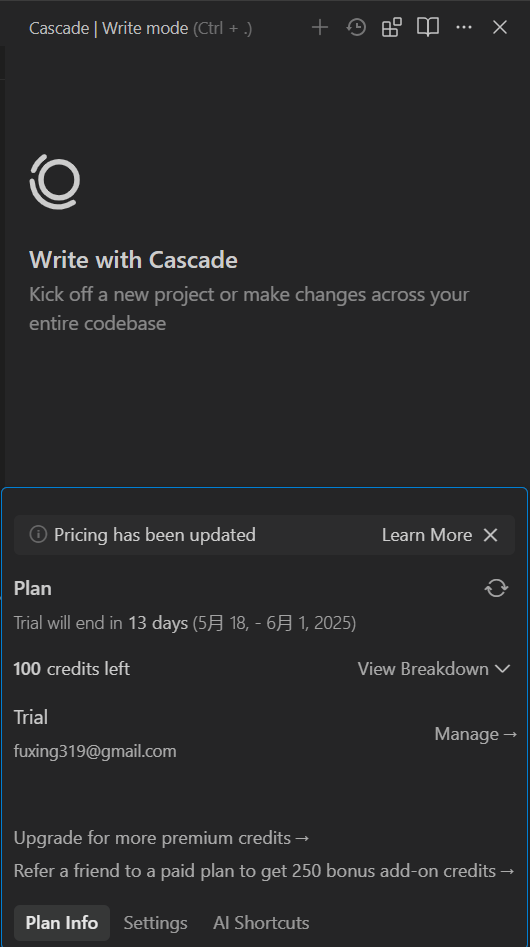
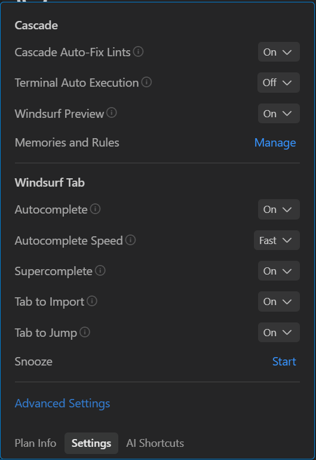
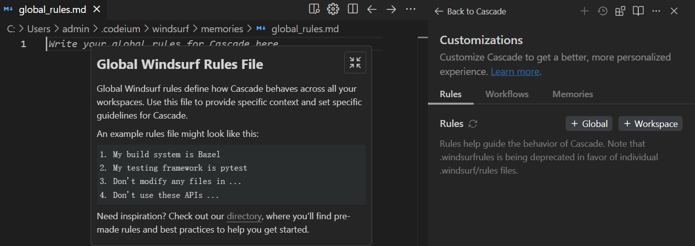
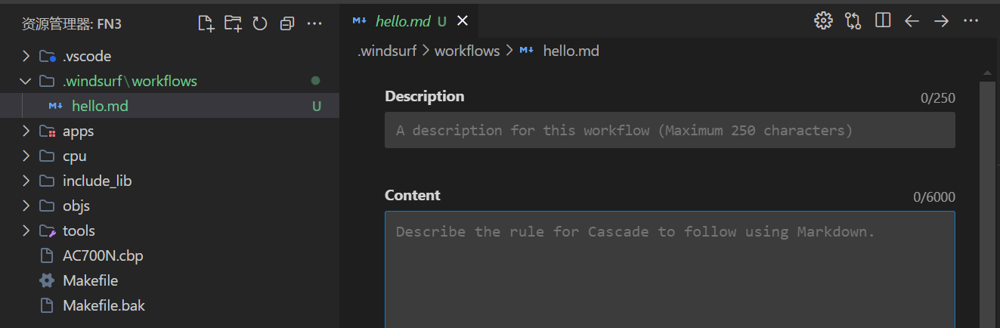

# windsurf

## 快捷键

- `ctrl+l`呼出AI对话框
  - `ctrl+i`按照提示修改选中代码
- `ctrl+p`按照关键词检索文件
- `ctrl+shift+p`显示并运行命令的面板

## cascade配置

点开AI面板的`cascade usage`:

介绍一下计划的信息，包括了账号，到期时间，剩余使用积分数量。

### settings

cascade的四个配置：

- 有一点像自动纠错，代码层面的。不知道是否消耗额度
- 这个是命令行是否执行的设置
  - 比如一些执行命令行的命令：查看代码实现，自动运行，提交git命令等等
- 这个配置可以调用本地浏览器进行预览操作
- 规则
  - 规则的作用域可以是全局的，也可以是工作区。
  - `C:\Users\admin\.codeium\windsurf\memories\global_rules.md`
- 记忆这个是自动生成的，为了保持对话的连贯性。可以选中管理其中的记忆。

还可以设置工作流。描述大概流程，比如hexo编写后，需要启动对应命令去浏览器预览，这是一个必要的流程。当你说出描述时，AI可以根据提示信息去完成对应操作。

## Tab工程师

- 自动补全建议
- 自动补全的显示速度
  - tab接收
  - esc就是不接受，或者不管就行
- 超级补全建议
- tab功能
  - 预测下一次编辑的位置并进行跳转
  - 还有一个不清楚

## MCP插件

- 文件系统
  - 可以通过这个MCP更好的操作和访问本地资源
  - 分析SDK源码可能比较好用
- Sequential Thinking MCP Server
  - 思考工具吧，相当于别人在提示词上又封装了一层思考逻辑。

## AI面板

- 聊天功能
  - 代码如果有，也是体现在聊天框中，不会直接体现在源码上
  - 这个代码也可以手动应用到源码中
- 编辑模式
  - 代码直接体现在源码上，也可以拒绝
- 选择AI模型
  - 不同的模式的额度消耗也不一样。
- /可以呼出自定义的工作流描述
- @可以选择回答时参考的资料

