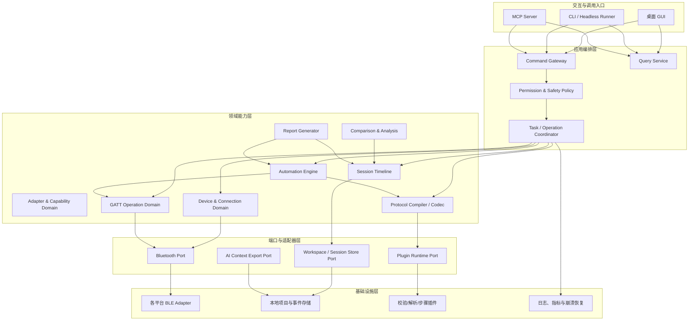
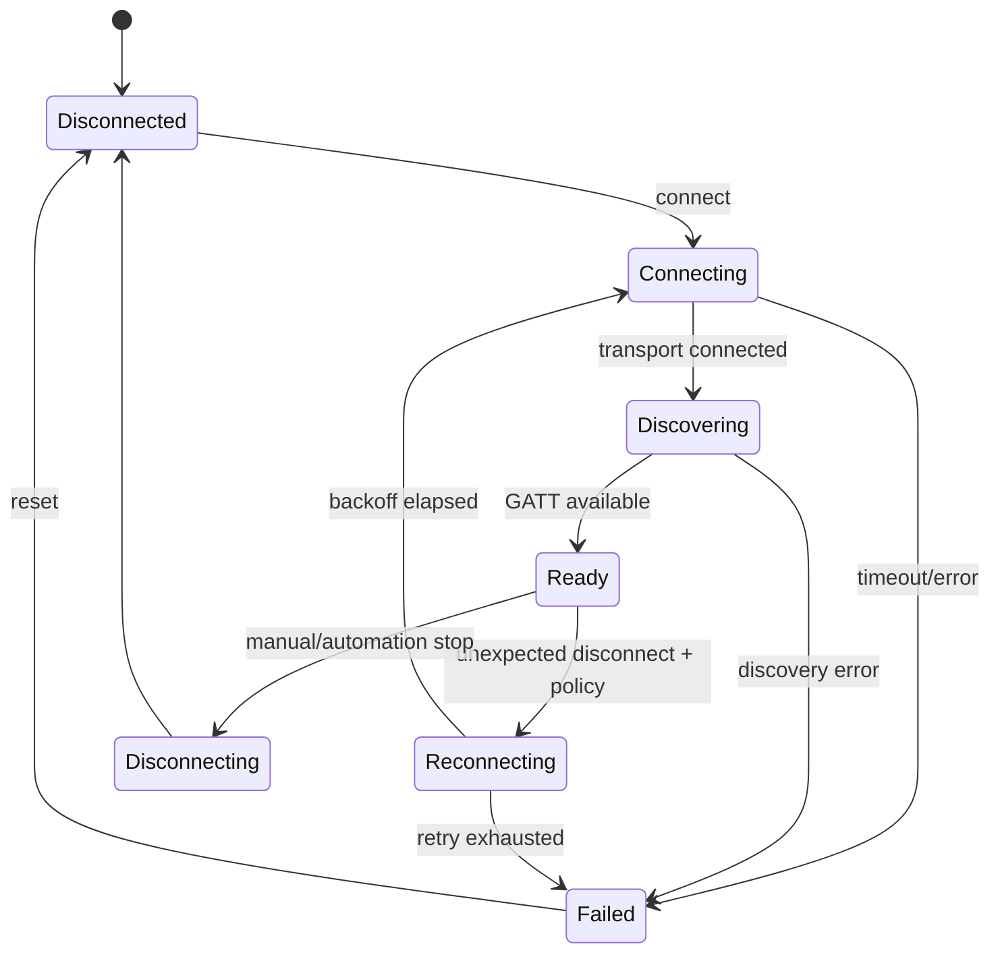
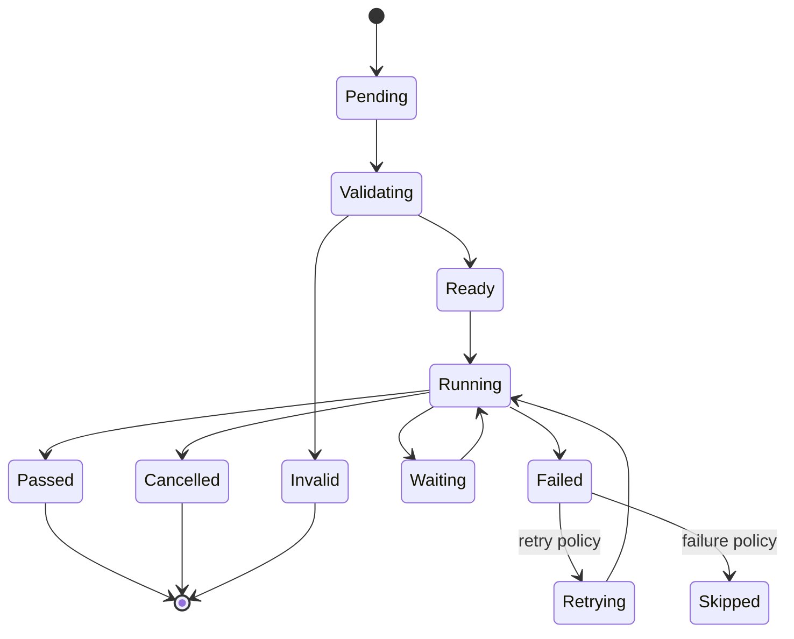
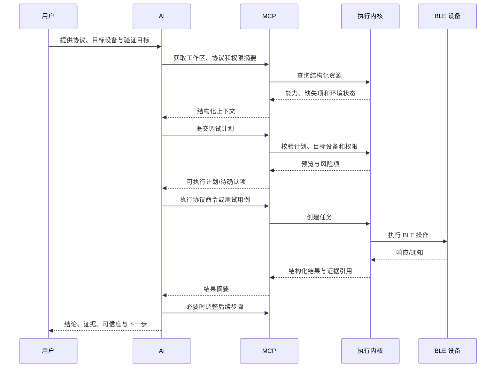

# AI 原生蓝牙调试工具最佳实践方案设计大纲

> 文档定位：基于产品需求形成的总体方案设计大纲，用于架构评审、模块拆分、接口设计、迭代规划和详细设计输入。
>
> 适用范围：第一阶段以 BLE Central 调试为核心，覆盖人工调试、协议组包与解析、自动化测试、会话记录以及 AI/MCP 调试闭环。

---

## 0. 文档信息

| 项目 | 内容 |
|---|---|
| 文档名称 | AI 原生蓝牙调试工具最佳实践方案设计大纲 |
| 文档类型 | 总体方案设计 / High-Level Design |
| 目标读者 | 产品经理、架构师、桌面端开发、蓝牙开发、测试工程师、AI/MCP 开发者、开源贡献者 |
| 核心目标 | 建立可扩展、可审计、可复现、AI 安全可控的本地蓝牙调试平台 |
| 当前范围 | BLE Central、私有协议、自动化测试、会话时间线、MCP 接口 |
| 后续范围 | BLE Peripheral 模拟、经典蓝牙 SPP、LE Audio |

### 0.1 术语约定

- **工作区（Workspace）**：一个独立调试项目的持久化容器。
- **设备定义（Device Profile）**：设备识别规则、GATT 预期结构及相关配置。
- **协议定义（Protocol Definition）**：描述应用层帧格式、命令、字段、校验和分包规则的声明式资产。
- **调试会话（Session）**：一次完整调试过程中的事件、数据和分析记录。
- **测试用例（Test Case）**：可重复执行、具备明确输入、步骤和断言的确定性流程。
- **执行内核（Execution Core）**：统一执行扫描、连接、读写、订阅、协议处理和测试步骤的本地核心服务。
- **MCP**：供 AI 查询状态、调用能力和获取结构化结果的标准接口层。

### 0.2 规范用语

- **必须（MUST）**：不可省略的强制设计要求。
- **应该（SHOULD）**：推荐遵循，偏离时必须说明理由。
- **可以（MAY）**：按版本、平台或资源情况选择实现。

---

## 1. 需求理解与方案目标

### 1.1 核心业务闭环

```text
协议文档/协议定义
        ↓
目标设备识别与连接
        ↓
协议命令生成与安全校验
        ↓
确定性执行读写/订阅/等待
        ↓
原始数据记录与协议解析
        ↓
断言、异常定位与会话对比
        ↓
报告生成与回归用例沉淀
```

### 1.2 方案目标

1. 人工调试、自动化测试和 AI 调试共用同一套底层执行能力。
2. 协议定义成为一等公民，统一驱动组包、解析、断言、UI 展示和 AI 调用。
3. 所有关键操作可见、可审计、可回放、可复现。
4. AI 只负责理解、规划和分析，不直接绕过安全边界操作系统蓝牙接口。
5. 自动化引擎独立于 AI，保证测试结果确定、稳定且可在离线环境运行。
6. 默认本地优先，敏感数据可控，导出和 AI 读取具备明确权限。
7. 支持跨平台能力差异，不以“最低公共能力”掩盖平台限制。
8. 为 BLE Peripheral、SPP、LE Audio 和插件生态预留扩展边界。

### 1.3 非功能目标

| 维度 | 目标 |
|---|---|
| 稳定性 | 长时间扫描、连接、订阅和批量测试不应导致状态失控 |
| 可恢复性 | 异常退出后可恢复项目、未完成会话和关键日志 |
| 可测试性 | 核心业务逻辑不依赖 GUI，支持模拟适配器和硬件在环测试 |
| 可扩展性 | 新平台、新校验算法、新协议类型和新测试步骤可插件化接入 |
| 安全性 | 设备锁定、命令白名单、权限模式、敏感数据脱敏与完整审计 |
| 性能 | 高频通知与界面渲染解耦，原始数据持久化不阻塞蓝牙回调 |
| 可维护性 | 模块边界清晰，领域模型、平台适配、存储和 UI 相互隔离 |
| 开源友好 | 协议格式、用例格式、MCP 契约、插件接口均可公开和版本化 |

---

## 2. 总体设计决策

### 2.1 关键决策摘要

| 决策 | 推荐方案 | 主要原因 |
|---|---|---|
| 核心架构 | 分层架构 + 领域模块化 + 端口适配器模式 | 隔离平台蓝牙差异，便于测试和扩展 |
| 执行入口 | GUI、CLI、自动化和 MCP 共用执行内核 | 避免能力重复实现和行为不一致 |
| 调试记录 | 追加式事件时间线 | 支持审计、回放、差异比较和故障恢复 |
| 协议系统 | 声明式协议定义 + 可控扩展函数 | 兼顾安全、可读性和复杂私有协议支持 |
| 自动化 | 确定性状态机/步骤引擎 | 测试可复现，不依赖 AI 的随机性 |
| AI 调用 | 粗粒度、高语义 MCP 工具 | 降低误操作、上下文消耗和逐包调用风险 |
| 数据策略 | Local-first，项目文件可导入导出 | 满足私有协议和设备数据安全要求 |
| 高频数据 | 蓝牙回调、持久化、解析和 UI 四级解耦 | 避免通知风暴拖垮界面或丢包 |
| 权限模型 | 只读、协议调试、完全控制三级权限 | 与产品场景匹配，默认最小权限 |
| 扩展机制 | 能力接口 + 插件清单 + 版本兼容检查 | 支持社区贡献且控制运行风险 |

### 2.2 最重要的架构原则

> **一个执行内核，多个受控入口；一条事件时间线，统一承载人工、自动化与 AI 行为。**

禁止出现以下反模式：

- GUI 直接调用平台蓝牙 API，而自动化/MCP 另写一套实现。
- AI 直接构造未经协议校验的任意字节并默认发送。
- 会话日志只保存文本，不保留结构化事件和原始数据。
- 把自动化测试写成 UI 操作脚本。
- 将高频通知逐包传递给大模型处理。
- 在平台不支持某能力时静默降级或伪装成功。

---

## 3. 范围与版本边界

### 3.1 第一阶段推荐范围

#### P0：可用 BLE 人工调试内核

- 适配器枚举与能力检测
- BLE 扫描、过滤和设备锁定
- 连接、断开、服务发现和 GATT 浏览
- Read、Write、Write Without Response
- Notify、Indicate 订阅
- 原始收发事件时间线
- 工作区保存与恢复
- 结构化错误和诊断信息

#### P1：协议与自动化闭环

- 协议定义、校验、组包和解析
- 会话保存、离线回放和重新解析
- 人工操作转测试步骤
- 自动化步骤、变量、等待、断言、重试和报告
- 历史运行结果比较

#### P2：AI/MCP 闭环

- MCP 状态查询和能力发现
- AI 读取协议和会话摘要
- AI 调用受控协议命令与测试用例
- 执行计划预览、暂停、接管和审计
- 失败分析、报告摘要与回归建议

### 3.2 第一阶段明确不纳入

- 空口抓包和链路层分析
- AI 直接调用系统蓝牙驱动
- 高频原始流逐包送入 AI
- 自动修改设备固件代码
- BLE Peripheral 模拟
- SPP 和 LE Audio 实际通信
- 云端设备管理和生产线批量能力

---

## 4. 总体架构

### 4.1 逻辑架构



### 4.2 进程与部署边界

推荐采用“界面进程 + 本地核心服务”的逻辑隔离方式；早期可同进程部署，但接口边界必须按可分离设计。

#### 桌面界面进程

- 负责视图、交互、状态呈现和用户输入。
- 不直接持有平台 BLE 资源。
- 不承担测试执行、协议编解码和日志持久化的核心责任。

#### 本地核心服务

- 负责适配器、扫描、连接、GATT、协议、自动化和会话记录。
- 对 GUI、CLI 和 MCP 暴露一致的命令与查询接口。
- 保证操作串行化、资源锁和权限校验。

#### MCP 服务

- 可作为核心服务内嵌模块或独立本地进程。
- 必须通过应用层命令网关调用能力，不得直接调用平台适配器。
- 默认只监听本地安全端点，并具备会话级授权。

### 4.3 分层职责

| 层级 | 职责 | 禁止事项 |
|---|---|---|
| 展示层 | UI 状态、用户操作、可视化 | 直接操作系统 BLE API |
| 应用层 | 用例编排、权限检查、事务边界、任务协调 | 内嵌平台特有逻辑 |
| 领域层 | 设备、协议、自动化、会话等业务规则 | 依赖具体 UI 或数据库实现 |
| 端口层 | 定义平台、存储、插件的抽象契约 | 包含业务流程判断 |
| 基础设施层 | 平台 API、文件/数据库、日志、插件运行时 | 绕过应用层对外暴露能力 |

---

## 5. 领域模型与模块边界

### 5.1 核心聚合

#### Workspace

包含：

- 项目元数据
- 设备定义引用
- 协议定义引用
- 测试用例引用
- 会话索引
- 报告索引
- 权限与脱敏配置
- 插件依赖清单

规则：

- 工作区必须具备独立标识和格式版本。
- 所有资产通过稳定 ID 引用，禁止仅依赖可变名称。
- 导入时必须进行版本、依赖和路径安全校验。

#### DeviceProfile

包含：

- 设备匹配规则：名称、地址/平台标识、Service UUID、厂商数据、服务数据。
- 可接受的多个识别条件及其优先级。
- 预期 GATT 快照。
- 默认连接参数、订阅项和协议绑定。
- 设备风险标签与允许操作范围。

#### ProtocolDefinition

包含：

- 帧格式、命令、请求、响应和事件。
- 字段、类型、字节序、编码、长度、校验和分包规则。
- 错误码和状态说明。
- GATT 路由：写特征值、读特征值、通知来源。
- 版本、兼容范围和测试样例。

#### Session

包含：

- 目标设备快照、环境快照和协议版本。
- 追加式事件流。
- 原始数据引用、解析结果、用户备注和 AI 分析。
- 会话状态：运行中、完成、异常中止、恢复、只读回放。

#### TestCase

包含：

- 前置条件、输入参数、步骤树、变量、断言和清理步骤。
- 超时、重试、失败策略和环境要求。
- 来源信息：手工录制、人工编辑、AI 生成。
- 版本和稳定性标签。

#### ExecutionRun

包含：

- 用例快照、输入值和运行环境。
- 步骤状态、输出、错误和时间指标。
- 运行产生的 Session 关联。
- 通过、失败、中止、跳过和不确定结果。

#### PermissionPolicy

包含：

- 权限模式。
- 设备允许列表。
- 服务/特征值允许列表。
- 协议命令允许列表。
- 原始写入限制。
- 单次写入、重试次数和执行时长限制。
- 高风险操作确认规则。

### 5.2 统一标识与关联

所有关键实体必须使用不可变 ID：

- `workspace_id`
- `device_profile_id`
- `protocol_id` / `protocol_version`
- `session_id`
- `event_id`
- `test_case_id` / `test_case_version`
- `run_id`
- `operation_id`
- `correlation_id`

其中 `correlation_id` 用于关联：

```text
用户/AI 发起命令
  → 底层 GATT 操作
  → 原始响应或通知
  → 协议解析结果
  → 自动化断言
  → 报告结论
```

---

## 6. 蓝牙平台抽象设计

### 6.1 能力模型

禁止假定所有平台能力一致。每个适配器启动时必须返回结构化能力描述：

- 是否支持 BLE Central。
- 是否支持多适配器选择。
- 是否支持扫描响应和扩展广播字段。
- 是否能获得稳定设备地址。
- 是否支持 MTU 查询或协商。
- 支持的写入类型。
- 是否支持并发连接。
- 是否支持 BLE Peripheral、SPP 或其他扩展。
- 平台权限、系统开关和驱动状态。

UI、自动化和 MCP 必须以能力模型决定可用操作，而不是执行后再依赖模糊错误。

### 6.2 BluetoothPort 推荐接口组

#### Adapter

- `list_adapters()`
- `get_adapter_capabilities(adapter_id)`
- `watch_adapter_state(adapter_id)`

#### Scanner

- `start_scan(scan_options)`
- `update_scan_filter(scan_id, filter)`
- `stop_scan(scan_id)`
- `subscribe_scan_events(scan_id)`

#### Connection

- `connect(device_ref, connection_options)`
- `disconnect(connection_id, reason)`
- `get_connection_state(connection_id)`
- `watch_connection_events(connection_id)`

#### GATT

- `discover_services(connection_id, refresh_policy)`
- `read_characteristic(target)`
- `write_characteristic(target, payload, write_type)`
- `subscribe_characteristic(target, subscription_options)`
- `unsubscribe_characteristic(subscription_id)`

### 6.3 连接状态机



设计要求：

- 同一物理设备在一个执行内核中应只有一个连接所有者。
- 连接状态变更必须事件化并持久化到会话。
- 自动重连必须有上限、指数退避和可取消机制。
- 用户主动断开不得触发自动重连。
- 扫描发现对象与连接对象分离，避免平台设备句柄失效。

### 6.4 GATT 操作队列

每个连接维护独立的串行操作队列：

- Read、Write、Discover、Subscribe 统一进入队列。
- 操作具有超时、取消令牌、重试策略和 `operation_id`。
- 默认不允许同一特征值并发写入。
- Write Without Response 可按适配器能力采用限速窗口，但仍需记录提交顺序。
- 订阅回调只负责快速入队，不执行复杂解析或 UI 更新。

### 6.5 目标设备防误连

设备选择必须支持多因子匹配：

1. 用户锁定的设备标识。
2. 广播 Service UUID。
3. 厂商数据或服务数据特征。
4. 名称模式。
5. 信号强度仅作为辅助，不作为唯一身份依据。

AI 或自动化连接前必须返回候选设备及匹配依据；低置信度时禁止自动选择。

---

## 7. 协议系统设计

### 7.1 设计原则

- 协议定义必须声明式、可读、可版本化、可校验。
- 原始字节与业务字段必须双向可追溯。
- 协议编译结果应供 UI、自动化和 MCP 共用。
- 协议扩展函数必须可控，不允许默认执行任意项目代码。
- 每个协议版本必须配套黄金样例和错误样例。

### 7.2 协议处理流水线

```text
参数输入
  → 类型与范围校验
  → 字段编码
  → 固定字段/默认值填充
  → 长度与序列号计算
  → 校验值计算
  → 分包与路由
  → 发送前策略校验
  → GATT 写入

接收原始数据
  → 流/分包重组
  → 帧边界识别
  → 长度与校验验证
  → 命令匹配
  → 字段解码
  → 请求响应关联
  → 结构化结果/异常
```

### 7.3 协议定义建议结构

```yaml
schema_version: 1
protocol:
  id: example.device.protocol
  version: 1.2.0
  byte_order: little

device_match:
  service_uuids: []

gatt_routes:
  command_write:
    service_uuid: "..."
    characteristic_uuid: "..."
    write_type: with_response
  event_notify:
    service_uuid: "..."
    characteristic_uuid: "..."

frame:
  header: []
  length_rule: {}
  sequence_rule: {}
  checksum_rule: {}
  fragmentation_rule: {}

commands:
  - id: read_version
    code: 0x01
    request:
      fields: []
    response:
      match: {}
      fields: []
      timeout_ms: 2000

errors:
  - code: 0x01
    name: invalid_command
    description: "..."

test_vectors:
  - name: read_version_ok
    input: {}
    encoded_hex: "..."
    response_hex: "..."
    decoded: {}
```

### 7.4 协议编译与校验

加载协议时必须执行：

- Schema 格式校验。
- 字段偏移、长度和依赖关系校验。
- 命令码和匹配规则冲突检查。
- GATT 路由完整性检查。
- 校验算法参数检查。
- 分包与最大报文长度检查。
- 示例向量编码/解码自验证。
- 插件依赖、版本和签名策略检查。

协议必须先编译成不可变的运行时模型，再用于执行，禁止边执行边解释可变源文件。

### 7.5 请求与响应关联

推荐按以下顺序匹配：

1. 明确的序列号或事务 ID。
2. 协议定义的命令响应映射。
3. 特征值来源与时间窗口。
4. 单飞请求上下文。
5. 无法可靠匹配时标记为“未关联事件”，禁止强行归属。

### 7.6 自定义扩展

优先提供受控的内置扩展点：

- 校验算法。
- 字段编码器/解码器。
- 帧边界识别器。
- 分包与重组器。
- 业务派生字段。

扩展必须具备：

- 插件清单和兼容版本。
- 明确输入输出 Schema。
- 执行超时和资源限制。
- 无默认网络、文件系统和进程权限。
- 可定位的插件错误，不得导致核心服务崩溃。

---

## 8. 会话时间线与回放设计

### 8.1 事件溯源式时间线

会话使用追加写、不可原地修改的结构化事件流。可通过补充事件添加备注、标签或修正解析结果，但不覆盖原始记录。

建议事件类型：

- `adapter.state_changed`
- `scan.started` / `scan.result` / `scan.stopped`
- `device.selected`
- `connection.requested` / `connection.changed`
- `gatt.discovered`
- `gatt.read.requested` / `gatt.read.completed`
- `gatt.write.requested` / `gatt.write.completed`
- `gatt.notification.received`
- `protocol.frame.decoded`
- `protocol.validation.failed`
- `automation.step.started/completed/failed`
- `assertion.evaluated`
- `ai.plan.created`
- `ai.tool.requested/completed`
- `permission.confirmation.requested/resolved`
- `user.annotation.added`
- `session.bookmark.added`

### 8.2 事件公共字段

```yaml
id: event-id
type: gatt.notification.received
schema_version: 1
session_id: session-id
timestamp_wall: 2026-01-01T10:00:00.123+08:00
timestamp_monotonic_ns: 123456789
sequence: 1024
source: bluetooth-core
actor:
  type: user | automation | ai | system
  id: optional-actor-id
operation_id: optional-operation-id
correlation_id: optional-correlation-id
payload: {}
attachments: []
sensitivity: normal | sensitive | secret
```

同时记录墙上时间和单调时钟，以支持跨事件排序与耗时计算。

### 8.3 原始数据与解析数据分离

- 原始字节作为不可变附件保存，并记录哈希。
- 解析结果保存所使用的协议 ID、版本和解析器版本。
- 使用新协议重新解析时生成新的派生事件，不覆盖旧结果。
- UI 支持原始 HEX、字节范围和结构化字段相互定位。

### 8.4 回放模式

回放必须满足：

- 不连接真实设备。
- 可按事件逐步、倍速和时间范围播放。
- 可重新应用协议解析和断言。
- 可生成新的分析和报告，但不得伪装成真实执行结果。
- 所有派生结果标记来源为 `replay`。

### 8.5 会话对比

推荐分为四层：

1. **环境层**：平台、适配器、设备、固件、协议版本。
2. **结构层**：广播和 GATT 快照差异。
3. **流程层**：操作顺序、等待时间、重试和状态转换。
4. **数据层**：请求、响应、字段、耗时和首次异常点。

首次差异算法应输出“可解释证据”，而不是仅给出相似度。

---

## 9. 自动化测试引擎设计

### 9.1 引擎原则

- 确定性：相同输入、环境和设备状态下产生可解释的相同执行逻辑。
- 无 UI 依赖：可由桌面端、CLI、CI 或 MCP 调用。
- 可取消：所有阻塞步骤必须响应取消。
- 可恢复：失败后允许从安全检查点重跑，而不是任意位置续跑。
- 可观察：每一步输入、输出、耗时、重试和失败原因进入时间线。
- 可验证：步骤定义和变量引用在运行前完成静态校验。

### 9.2 推荐步骤类型

#### 环境与设备

- 适配器能力检查
- 扫描设备
- 选择/锁定设备
- 连接、断开、重连
- GATT 发现与快照验证

#### GATT 操作

- Read
- Write
- Subscribe / Unsubscribe
- Wait Notification
- Wait Connection State

#### 协议操作

- Send Protocol Command
- Wait Protocol Response
- Decode Frame
- Validate Protocol Field

#### 流程控制

- Delay
- Set Variable
- Compute Value
- Conditional Branch
- Loop（必须有次数或时间上限）
- Retry Block
- Parallel Read-only Branch（后续能力，默认关闭）
- Cleanup / Finally

#### 结果处理

- Assertion
- Record Metric
- Add Bookmark
- Export Attachment
- Generate Report Section

### 9.3 步骤生命周期



### 9.4 变量与表达式

- 变量必须具备类型：字节、整数、字符串、布尔、时间、对象、协议字段等。
- 表达式语言必须是受限、安全、无副作用的。
- 禁止默认执行任意脚本。
- 变量作用域分为工作区参数、用例参数、运行变量和步骤输出。
- 日志展示时按敏感级别脱敏。

### 9.5 超时、重试和失败策略

每个步骤可配置：

- `timeout`
- `retry.max_attempts`
- `retry.backoff`
- `retry.retryable_errors`
- `on_failure: stop | continue | goto_cleanup | mark_inconclusive`

最佳实践：

- 仅对明确可恢复的错误重试。
- 写入类操作默认不自动重试，除非协议具备幂等键或明确重试语义。
- 连接重试与业务命令重试分别管理。
- 超时必须记录实际等待对象和最后观察状态。

### 9.6 断言模型

断言统一输出：

- 断言类型。
- 预期值。
- 实际值。
- 比较规则和容差。
- 原始数据证据。
- 解析字段路径。
- 结论：通过、失败、不确定、跳过。

“不确定”用于环境或证据不足，避免把无法判断等同于失败。

### 9.7 人工调试转测试用例

录制后必须经过“规范化”步骤：

1. 去除无关扫描结果和纯浏览操作。
2. 将具体设备句柄转换为设备匹配规则。
3. 将固定报文优先转换为协议命令和参数。
4. 将真实等待时间转换为条件等待 + 最大超时。
5. 从响应中提取可配置断言。
6. 标记潜在敏感值和动态字段。
7. 生成前置条件和清理步骤。
8. 运行一次验证后才允许标记为稳定用例。

---

## 10. MCP 与 AI 调试设计

### 10.1 MCP 设计原则

- MCP 是受控应用接口，不是底层蓝牙 API 的透传。
- 优先提供高语义、粗粒度工具，避免 AI 拼接大量底层调用。
- 所有写操作通过统一权限策略。
- 每次调用返回结构化状态、证据引用和可行动错误。
- 长时间任务采用任务 ID 和状态查询，不阻塞单次调用。
- 大体量会话返回摘要、分页和附件引用，不直接灌入全部原始数据。

### 10.2 推荐 MCP 能力分组

#### 资源与状态查询

- `workspace.list/open/get_summary`
- `adapter.list/get_capabilities`
- `device.scan/get_candidates`
- `connection.get_state`
- `gatt.get_snapshot`
- `protocol.list/get_schema/validate`
- `session.get_timeline/get_summary`
- `testcase.list/get`

#### 受控执行

- `device.connect_locked_target`
- `device.disconnect`
- `gatt.read`
- `gatt.subscribe`
- `protocol.preview_command`
- `protocol.execute_command`
- `testcase.validate`
- `testcase.run`
- `task.cancel`

#### 分析与产物

- `session.compare`
- `session.get_first_divergence`
- `report.generate`
- `testcase.create_from_session`
- `protocol.get_missing_information`

### 10.3 不推荐暴露的工具

- 不受限的 `raw_write_any_device`。
- 直接选择系统设备句柄的连接工具。
- 单次返回全部历史通知的工具。
- 每收到一包数据就触发一次 AI 回调的工具。
- 允许 AI 修改本地权限配置的工具。
- 绕过协议预览和审批直接执行高风险命令的工具。

### 10.4 AI 自动调试工作流



### 10.5 AI 权限模式

#### 只读模式

允许扫描、连接、发现、读取、订阅和查看日志；禁止任何写入。

#### 协议调试模式

允许执行已验证协议定义中的命令和已批准测试用例；禁止协议外原始写入。

#### 完全控制模式

允许受审计的原始写入和未知命令探索；必须显式启用，并对高风险操作逐次确认或按时间窗授权。

### 10.6 风险确认策略

以下操作必须触发显式确认或预授权：

- 原始任意写入。
- 固件升级、恢复出厂、删除数据、修改安全配置。
- 高速重复写入或长时间循环。
- 目标设备身份置信度不足。
- 超出协议定义范围的操作。
- 访问标记为敏感或秘密的数据。

确认界面至少展示：目标设备、特征值/命令、最终字节、业务含义、预计次数和风险说明。

### 10.7 AI 输出规范

AI 分析结果必须包含：

- 执行目标和实际完成范围。
- 通过、失败、不确定和跳过项。
- 首个异常点。
- 预期行为与实际证据。
- 可能原因及其证据强度。
- 已排除原因及排除依据。
- 问题归属和可信度。
- 推荐下一步测试。
- 对应会话、事件和原始数据引用。

禁止只输出无证据的“可能是设备问题”。

---

## 11. 人工与 AI 协同设计

### 11.1 统一操作模型

每次操作均包含：

- `actor`：用户、自动化、AI 或系统。
- `intent`：操作目的。
- `preview`：目标、参数和最终报文。
- `permission_decision`：允许、拒绝或待确认。
- `execution_result`：状态、证据和错误。

### 11.2 控制权状态

建议会话具备：

- 人工控制。
- 自动化运行。
- AI 运行。
- 已暂停。
- 正在取消。
- 只读回放。

同一连接默认只有一个主动控制者；其他入口只读观察。人工接管时，必须安全取消当前步骤并完成必要清理。

### 11.3 可见性要求

AI 执行期间 UI 必须展示：

- 当前目标。
- 当前步骤和进度。
- 即将执行的操作。
- 发送前的协议字段和最终报文。
- 权限判断。
- 当前等待条件和剩余超时。
- 最近响应和解析结果。
- 暂停、停止和接管按钮。

---

## 12. 本地数据与工作区设计

### 12.1 推荐工作区布局

```text
workspace/
├── workspace.yaml
├── devices/
│   └── *.device.yaml
├── protocols/
│   ├── *.protocol.yaml
│   └── fixtures/
├── testcases/
│   └── *.test.yaml
├── sessions/
│   └── <session-id>/
│       ├── session.yaml
│       ├── events.ndjson
│       ├── attachments/
│       └── derived/
├── reports/
│   └── *.report.json
├── plugins/
│   └── manifest.lock
└── settings/
    ├── permissions.yaml
    └── redaction.yaml
```

### 12.2 存储策略

- 小型配置资产采用可读文本格式，便于版本控制和社区共享。
- 高频事件采用追加式流格式或嵌入式事件存储，避免频繁重写大文件。
- 大型原始数据和附件独立存储，事件中只保存引用、长度和哈希。
- 项目索引可重建，不应成为唯一事实来源。
- 所有格式包含 `schema_version`，并提供显式迁移流程。

### 12.3 原子性与崩溃恢复

- 配置写入采用临时文件 + 原子替换。
- 事件按批次刷盘，并明确“已接收但未持久化”的内存窗口。
- 会话启动时创建恢复标记，正常结束后关闭。
- 异常退出后，下次启动提示恢复、封存或删除临时会话。
- 迁移前自动备份，迁移失败不得损坏原工作区。

### 12.4 导入导出

导出前执行：

- 敏感字段扫描。
- 密钥和认证数据默认排除。
- 路径穿越和非法文件校验。
- 插件依赖清单生成。
- Schema 与兼容版本检查。
- 可选签名和完整性清单。

---

## 13. 安全、隐私与权限

### 13.1 最小权限

- 默认使用只读模式。
- 工作区权限与全局权限分离。
- AI 权限不得高于当前用户授予的会话权限。
- 权限升级必须显式、可撤销并记录审计事件。

### 13.2 敏感数据分类

建议分为：

- `normal`：普通设备和调试数据。
- `sensitive`：账号、设备身份、用户数据、内部协议字段。
- `secret`：密钥、令牌、配对材料、可复用认证数据。

默认策略：

- `secret` 不进入普通日志、不导出、不发送给 AI。
- `sensitive` 在 UI 可查看，但复制、导出和 AI 读取前提示或脱敏。
- 脱敏配置必须保留字段类型和长度信息，便于协议分析。

### 13.3 日志安全

- 禁止在普通日志中记录完整密钥和认证报文。
- 原始二进制日志必须继承事件敏感级别。
- 错误栈和插件日志必须经过路径与数据脱敏。
- 诊断包生成时允许用户预览最终包含内容。

### 13.4 本地服务安全

- MCP 和本地核心服务默认仅绑定本机。
- 使用一次性会话令牌或操作系统进程间认证。
- 防止其他本地进程静默获得完全控制权限。
- 所有外部调用记录调用方、时间、参数摘要和结果。

---

## 14. 高频数据与性能设计

### 14.1 四级解耦流水线

```text
平台蓝牙回调
  → 无阻塞接收队列
  → 原始事件持久化队列
  → 协议解析/聚合队列
  → UI 增量视图与 AI 摘要
```

### 14.2 背压策略

- 蓝牙回调线程不得进行磁盘写入、复杂解析或 UI 渲染。
- 队列必须有容量、延迟和丢弃指标。
- 原始事件优先于 UI 展示；UI 可降频或暂停刷新。
- 当系统无法保证完整记录时，必须显式产生 `data.loss_detected` 事件。
- 可配置按特征值的采样、聚合和最大保存量，但默认不静默丢弃。

### 14.3 UI 展示优化

- 时间线使用虚拟列表和分页查询。
- 高频通知按时间窗聚合显示，可展开查看原始事件。
- 协议树按需解析和渲染。
- 搜索建立增量索引，不阻塞接收链路。
- 大型 HEX 数据采用分块读取和局部高亮。

### 14.4 性能指标建议

- GATT 操作排队延迟。
- 通知接收速率和峰值。
- 接收队列深度与丢包计数。
- 持久化延迟。
- 解析吞吐和失败率。
- UI 刷新延迟。
- 会话文件增长速率。
- 单次测试运行的内存峰值。

---

## 15. 错误模型与可行动诊断

### 15.1 统一错误结构

```yaml
code: GATT_WRITE_NOT_SUPPORTED
category: gatt
message: "目标特征值不支持所选写入类型"
user_action: "改用 Write Without Response，或检查设备 GATT 定义"
retryable: false
platform_code: optional
operation_id: operation-id
context:
  device_id: "..."
  service_uuid: "..."
  characteristic_uuid: "..."
  requested_write_type: with_response
```

### 15.2 错误分类

- 环境与权限。
- 适配器与平台能力。
- 扫描与设备识别。
- 连接与链路。
- GATT 结构和操作。
- 协议编码、解码和校验。
- 自动化步骤和断言。
- 存储、迁移和导出。
- 插件运行。
- MCP 调用与权限。

### 15.3 错误处理原则

- 用户错误、环境错误、设备错误和内部缺陷必须区分。
- 平台原始错误码作为诊断字段保留，但不直接作为唯一用户提示。
- 所有错误说明是否可重试以及推荐动作。
- 内部未知错误生成可关联的诊断 ID。
- 禁止吞掉异常后返回空结果或伪成功。

---

## 16. 插件与扩展架构

### 16.1 插件类型

- 协议字段编解码器。
- 校验算法。
- 分包和重组策略。
- 广播解析器。
- 报告模板。
- 自动化自定义步骤。
- 设备模板和协议模板。
- 后续平台能力适配器。

### 16.2 插件清单

至少包含：

- 插件 ID 和版本。
- 插件类型。
- 核心 API 兼容范围。
- 输入输出 Schema。
- 所需权限。
- 资源限制。
- 发布者和完整性信息。

### 16.3 兼容与隔离

- 插件 API 采用语义化版本。
- 重大版本不兼容时拒绝加载并给出迁移建议。
- 插件执行失败隔离为结构化错误。
- 自动化步骤插件必须声明是否幂等、可重试和可取消。
- 社区插件默认低权限运行。

---

## 17. 用户体验与信息架构

### 17.1 推荐主界面

```text
顶部：工作区 / 适配器 / 当前设备 / 全局命令 / 权限状态
左侧：项目资产树（设备、协议、用例、会话、报告）
中部：设备扫描 / GATT / 协议命令 / 自动化编辑器
右侧：AI 调试计划、当前任务、字段详情与风险确认
底部：统一会话时间线、原始数据、解析结果和错误
```

### 17.2 三种核心工作台

#### 探索工作台

用于扫描、连接、GATT 浏览、原始读写和通知观察。

#### 协议工作台

用于协议编辑、样例验证、字段可视化、命令预览和请求响应关联。

#### 测试与分析工作台

用于用例编辑、运行、断言、会话对比、报告和 AI 分析。

### 17.3 交互最佳实践

- 所有写入操作展示目标特征值、写入类型和最终字节。
- 常用操作支持键盘快捷键，但高风险操作不得一键无确认执行。
- 原始数据和协议字段双向高亮。
- 错误提示直接提供下一步操作。
- AI 生成内容明确标记为建议、草稿或已执行结果。
- 会话时间线是统一事实视图，避免各面板各自维护不一致日志。

---

## 18. 测试与质量保证策略

### 18.1 测试金字塔

#### 单元测试

- 协议编解码。
- 长度、校验和分包算法。
- 状态机和重试策略。
- 权限判定。
- 断言和表达式。
- 会话事件序列化与迁移。

#### 契约测试

- BluetoothPort 与各平台适配器。
- MCP 工具 Schema 和错误语义。
- 插件接口。
- 工作区和协议文件格式。

#### 模拟集成测试

使用可编程虚拟 BluetoothPort：

- 设备发现和身份变化。
- 连接超时、断开和重连。
- 服务缺失和属性变化。
- 通知乱序、重复、延迟和丢失。
- 协议错误帧和分包边界。

#### 硬件在环测试

建立标准设备矩阵：

- 不同平台和蓝牙适配器。
- 多种 GATT 结构。
- Write 与 Write Without Response。
- 高频通知。
- 长报文和分包。
- 异常断开和设备重启。

#### 端到端测试

- 首次连接到发送命令。
- 手工会话转自动化用例。
- 用例运行到报告生成。
- MCP 调用到人工暂停和接管。
- 会话保存、崩溃恢复和离线回放。

### 18.2 协议模糊测试

对协议编解码器开展：

- 随机长度。
- 边界值。
- 非法校验。
- 截断帧。
- 重复帧。
- 超长字段。
- 未知命令。
- 分包顺序异常。

目标：任何输入都不得导致核心服务崩溃或无限循环。

### 18.3 质量门禁

合并前至少检查：

- 核心单元测试通过。
- 文件格式和 API 契约兼容。
- 新增错误码有用户可行动说明。
- 新功能产生必要会话事件。
- 新写操作接入权限策略。
- 跨平台能力差异有明确处理。
- 文档和示例同步更新。

---

## 19. 可观测性与诊断

### 19.1 日志分层

- **业务事件**：进入 Session，面向用户和回放。
- **运行日志**：面向开发和诊断，可调整等级。
- **性能指标**：队列、耗时、吞吐、内存和失败率。
- **审计日志**：权限变化、AI 调用和高风险操作。

不得用开发日志替代业务事件时间线。

### 19.2 诊断包

可选择生成：

- 应用版本和平台信息。
- 适配器能力快照。
- 脱敏运行日志。
- 相关会话事件子集。
- 协议和用例版本信息。
- 插件清单。
- 崩溃或错误诊断 ID。

用户必须能预览和取消包含敏感内容的部分。

---

## 20. 跨平台与兼容策略

### 20.1 平台差异管理

- 通过能力对象显式暴露差异。
- 领域层使用统一语义，平台适配层负责转换。
- 无法映射的能力返回“明确不支持”，不做隐式模拟。
- 平台特有增强可作为可选能力开放，不污染核心协议模型。

### 20.2 兼容版本

需要独立版本化：

- 工作区格式。
- 协议 Schema。
- 测试用例 Schema。
- 会话事件 Schema。
- MCP 工具契约。
- 插件 API。

每项均应定义：

- 当前版本。
- 向后读取策略。
- 向前兼容行为。
- 迁移工具和失败回滚。
- 废弃周期。

---

## 21. 开源工程与治理

### 21.1 推荐仓库边界

可按单仓库模块化组织：

```text
apps/
  desktop/
  cli/
  mcp-server/
core/
  domain/
  application/
  protocol/
  automation/
  session/
ports/
  bluetooth/
  storage/
adapters/
  platform-a/
  platform-b/
plugins/
schemas/
examples/
docs/
tests/
```

### 21.2 开放标准资产

优先开源并稳定维护：

- 协议定义 Schema。
- 测试用例 Schema。
- 会话事件 Schema。
- MCP 工具定义。
- 插件 SDK 和示例。
- 示例设备、协议和测试用例。
- 兼容性与迁移说明。

### 21.3 社区贡献流程

- 提供协议模板验证工具。
- PR 自动执行 Schema、样例向量和安全扫描。
- 社区设备模板不得包含真实密钥和个人数据。
- 插件发布提供权限声明和兼容矩阵。
- 核心接口变更通过 RFC/ADR 评审。

---

## 22. 分阶段实施建议

### 22.1 V0.1：BLE 基础人工调试

#### 目标

建立稳定、可观测的 BLE 执行内核，而不是先堆叠复杂界面。

#### 主要交付

- BluetoothPort 和至少一个平台适配器。
- 适配器能力检测。
- 扫描、设备锁定、连接状态机。
- GATT 浏览、读写和订阅。
- 操作队列和统一错误模型。
- 基础工作区与事件时间线。
- CLI/开发调试入口。

#### 退出标准

- 连续运行扫描和订阅无明显资源泄漏。
- 所有 GATT 操作都有结构化事件和明确错误。
- 同一操作通过 GUI 和 CLI 得到一致结果。
- 异常断开可正确收敛到明确状态。

### 22.2 V0.2：项目与协议能力

#### 主要交付

- DeviceProfile、ProtocolDefinition Schema。
- 协议编译、组包、解析和测试向量。
- GATT 路由和请求响应关联。
- 会话持久化、离线回放和重新解析。
- 原始字节与字段双向高亮。

#### 退出标准

- 简单固定帧、TLV 和分包协议可通过声明式配置完成。
- 协议加载前能发现主要定义错误。
- 历史会话可使用新协议版本重新解析。

### 22.3 V0.3：自动化测试

#### 主要交付

- 确定性步骤引擎。
- 变量、等待、断言、重试、分支和清理。
- 手工会话转用例规范化流程。
- Headless Runner。
- 测试报告和历史结果比较。

#### 退出标准

- 用例可重复执行并输出一致的步骤级证据。
- GUI 和无界面运行使用同一引擎。
- 失败可定位到步骤、请求、响应和断言。

### 22.4 V0.4：MCP 与基础 AI 调试

#### 主要交付

- MCP 资源、工具和任务模型。
- 权限模式和设备/命令白名单。
- 协议命令预览和受控执行。
- 用例运行、任务取消和结果摘要。
- AI 操作统一进入会话时间线。
- 暂停、停止和人工接管。

#### 退出标准

- AI 能完成“连接—订阅—执行协议命令—校验结果—生成报告”的基础闭环。
- AI 无法绕过权限执行任意写入。
- 每一步可由用户查看、暂停和审计。

### 22.5 V0.5：高级 AI 调试

#### 主要交付

- 协议文档结构化草稿和缺失项检查。
- 计划生成、风险预览和多轮调试。
- 会话首次差异分析。
- 失败归因证据模型。
- 回归用例草稿生成。

#### 退出标准

- AI 结论具备会话证据引用和可信度。
- 生成的协议或用例必须经过静态校验和人工确认。
- AI 分析失败不会影响确定性测试结果。

---

## 23. 主要风险与应对

| 风险 | 表现 | 应对策略 |
|---|---|---|
| 跨平台 BLE 差异 | 地址、缓存、MTU、权限和连接行为不一致 | 能力模型、平台适配契约、硬件矩阵测试 |
| 状态并发失控 | GUI、自动化和 AI 同时操作同一连接 | 单连接所有权、命令网关、任务协调器 |
| 高频通知导致丢包 | UI 或解析阻塞回调 | 四级解耦、背压指标、批量持久化 |
| 私有协议过于复杂 | 声明式格式无法覆盖 | 内置扩展点 + 受限插件，不默认执行任意脚本 |
| AI 误操作设备 | 连接错设备、发错命令、重复写入 | 设备锁定、权限模式、预览确认、幂等策略 |
| 会话文件快速膨胀 | 高频数据长期记录 | 分块附件、压缩、保留策略和用户可见限额 |
| 自动化不稳定 | 固定延时、重试副作用、设备状态残留 | 条件等待、清理步骤、幂等声明、稳定性标签 |
| Schema 演进困难 | 项目、用例和插件不兼容 | 独立版本、迁移工具、契约测试、废弃周期 |
| 插件安全 | 任意代码读取敏感数据或破坏进程 | 权限清单、隔离运行、资源限制和签名策略 |
| 产品范围失控 | 过早进入 SPP、Peripheral、LE Audio | 以 BLE 调试闭环和退出标准约束迭代 |

---

## 24. 详细设计拆分清单

后续建议分别输出以下详细设计文档：

1. 《BluetoothPort 与平台适配器接口设计》
2. 《扫描、设备识别与连接状态机设计》
3. 《GATT 操作队列与通知数据管线设计》
4. 《协议定义 Schema 与编译器设计》
5. 《协议组包、解析、分包和请求响应关联设计》
6. 《会话事件模型、持久化与回放设计》
7. 《自动化步骤引擎、变量与断言设计》
8. 《人工调试转自动化用例设计》
9. 《MCP 资源、工具、任务和错误契约设计》
10. 《AI 权限、风险确认与人工接管设计》
11. 《工作区格式、版本迁移与导入导出设计》
12. 《插件 API、隔离模型与社区发布规范》
13. 《测试报告与会话差异分析设计》
14. 《性能、背压、日志和诊断设计》
15. 《跨平台兼容矩阵与硬件在环测试方案》

---

## 25. 建议建立的 ADR（架构决策记录）

- ADR-001：统一执行内核与多入口架构。
- ADR-002：本地核心服务是否独立进程。
- ADR-003：工作区配置格式与事件存储方案。
- ADR-004：协议 DSL 的能力边界和插件机制。
- ADR-005：自动化表达式语言与脚本策略。
- ADR-006：单连接所有权与并发控制模型。
- ADR-007：MCP 工具粒度和长任务模型。
- ADR-008：AI 权限模式与高风险确认规则。
- ADR-009：高频通知的背压与数据保留策略。
- ADR-010：Schema 版本、迁移和兼容政策。
- ADR-011：插件隔离和第三方代码信任模型。
- ADR-012：BLE Peripheral、SPP 和 LE Audio 的扩展边界。

---

## 26. 架构评审检查表

### 26.1 一致性

- [ ] GUI、CLI、自动化和 MCP 是否使用同一执行接口？
- [ ] 人工、自动化和 AI 操作是否进入同一会话时间线？
- [ ] 协议组包、解析、断言和展示是否基于同一协议模型？

### 26.2 安全性

- [ ] 所有写操作是否经过权限策略？
- [ ] AI 是否无法绕过协议预览和设备锁定？
- [ ] 高风险操作是否展示最终字节并要求确认？
- [ ] 密钥和认证数据是否默认禁止导出和 AI 读取？

### 26.3 稳定性

- [ ] 蓝牙回调是否完全无阻塞？
- [ ] 每个连接是否具有受控操作队列？
- [ ] 所有长时间操作是否可取消和超时？
- [ ] 重试是否区分幂等与非幂等操作？
- [ ] 崩溃后是否可恢复未完成会话？

### 26.4 可复现性

- [ ] 会话是否记录设备、环境、协议和用例版本？
- [ ] 原始字节是否不可变并可与解析结果关联？
- [ ] 回放结果是否明确标记为派生结果？
- [ ] 测试结果是否包含步骤级证据？

### 26.5 可扩展性

- [ ] 平台差异是否通过能力模型隔离？
- [ ] 协议扩展是否通过受控插件而非核心硬编码？
- [ ] Schema、MCP 和插件 API 是否独立版本化？
- [ ] 后续 Peripheral、SPP 和 LE Audio 是否可复用会话、协议和测试框架？

### 26.6 产品边界

- [ ] 当前版本是否聚焦 BLE 调试闭环？
- [ ] 是否避免将空口抓包、音频测试或云端管理提前纳入？
- [ ] 每个版本是否具备明确、可验证的退出标准？

---

## 27. 推荐的最小可行架构结论

第一阶段最优先实现的不是 AI 对话界面，而是以下可复用底座：

1. **跨平台 BluetoothPort 与明确的能力模型。**
2. **单连接所有权、连接状态机和 GATT 操作队列。**
3. **追加式结构化会话时间线。**
4. **声明式协议定义、编译、组包和解析。**
5. **独立于 UI 和 AI 的确定性自动化引擎。**
6. **统一命令网关、权限策略和任务取消机制。**
7. **在上述能力之上构建 MCP，而不是为 AI 另写蓝牙控制路径。**

当以上底座稳定后，AI 才能以低风险方式完成“理解协议—制定计划—调用能力—分析证据—沉淀用例”的完整闭环。

---

## 28. 一句话方案描述

> 以本地确定性执行内核为中心，通过声明式协议、事件化会话、可复现自动化和分级权限 MCP，将人工调试、测试执行与 AI 分析统一到同一条安全、可审计、可扩展的蓝牙调试链路中。
