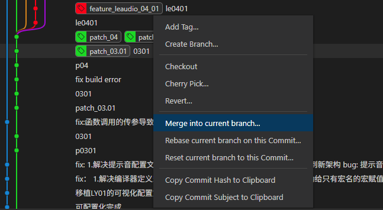
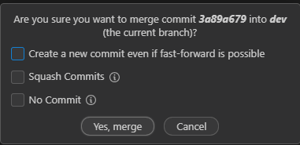

# 拉取主分支会一起更新所有分支吗？

不会，使用 Git 拉取远端主分支（如 `git pull origin main`）时，**只会更新当前所在分支（如本地的 `main` 分支）及其对应的远程分支（如 `origin/main`）**，**不会自动更新所有本地分支或远程分支的引用**。

## `git pull origin main` 会做什么？

该命令相当于：

```bash
git fetch origin main
git merge origin/main
```

也就是说，它会：

- 从远程仓库 `origin` 拉取 `main` 分支的最新提交；
- 将远程的 `origin/main` 合并到当前所在的本地分支。

## 不会更新哪些分支？

- 其他本地分支（如 `dev`, `feature/test` 等）不会被更新；
- 其他远程分支（如 `origin/dev`, `origin/feature/test` 等）也不会更新。

## 如果想更新所有远程分支引用怎么办？

```bash
git fetch --all
```

该命令会从远程仓库拉取**所有分支的最新引用信息**，但不会合并到本地分支，只是更新 `origin/*` 的引用。

执行完后，远程分支的最新状态就都同步到了本地的 `origin/*` 分支，例如：

- `origin/main`
- `origin/dev`
- `origin/feature/xxx`

但你本地的实际分支（如 `main`, `dev` 等）不会被修改。

# 撤销本地提交

我本地领先远程两个提交，现在这两个领先的提交我想丢弃掉

## 先fetch再reset

为了确保远程信息是最新的：

```bash
# 获取最新的远程信息
git fetch origin

# 重置到远程分支
git reset --hard origin/main
```

### 验证结果

执行后可以检查状态：

```bash
# 查看当前状态
git status

# 查看提交历史
git log --oneline -5
```

你应该看到类似这样的输出：

```bash
Your branch is up to date with 'origin/main'.
nothing to commit, working tree clean
```

### 注意事项

- `--hard` 参数会**完全删除**这两个提交的所有更改，包括工作区的修改
- 如果你想保留这些更改到工作区，可以使用 `--mixed`（默认）或 `--soft`
- 执行前确保没有重要的未保存工作
- 如果需要，可以先创建一个备份分支：`git branch backup-branch`

这样操作后，你的本地分支就会与远程分支完全同步，那两个领先的提交会被丢弃。

## 使用undo commit

可以把最新的本地提交撤销，所有更改都暂存在工作区中，提交信息也在输入框。

**适用场景：**

- 本地开发，提交还未推送到远程仓库
- 需要完全清除某个提交的痕迹
- 重新整理提交历史

## 使用revert commit

使用 `git revert` 后，被覆盖的原始提交依然存在于 Git 历史中。

**revert 的工作原理：**

- 原始提交：完全保留，仍在提交历史中
- revert 提交：创建一个新的提交，其内容是原始提交的"逆操作"
- 最终效果：代码状态回到原始提交之前，但历史记录包含了两个提交

举个例子：

```
A --- B --- C --- D
```

如果 revert 提交 B：

```
A --- B --- C --- D --- E(revert B)
```

- 提交 B 还在历史中
- 提交 E 是新创建的 revert 提交
- 代码状态相当于 A --- C --- D

**这样设计的好处：**

1. **完整的历史记录** - 可以看到发生了什么、何时撤销的
2. **可以再次 revert** - 如果后来发现撤销是错误的，可以 revert revert 提交来恢复
3. **安全性** - 不会丢失任何信息
4. **协作友好** - 其他开发者的历史不会被破坏

这就是为什么 revert 适合已推送的提交，而 reset 适合本地未推送的提交的原因。

**它也不会影响最新的提交？**

`git revert` 不会影响最新的提交或其他任何现有提交

假设当前提交历史是：

```
A --- B --- C --- D (HEAD)
```

如果你 revert 提交 B：

```
A --- B --- C --- D --- E(revert B) (HEAD)
```

**结果：**

- 提交 A、B、C、D 都完全不受影响，内容和历史完全保持原样
- 只是新增了一个提交 E，它包含了撤销提交 B 所做更改的代码
- HEAD 指向新的 revert 提交 E

**代码状态：**

- 工作区的最终代码效果 = A + C + D 的累积效果
- 就像提交 B 从未应用过一样，但 B 的历史记录依然存在

**关键点：**

- revert 是"增量操作"，只添加新提交
- 不修改、不删除、不移动任何现有提交
- 其他分支、标签、引用都不受影响
- 完全安全，可以随时撤销 revert 操作

这就是为什么 revert 被称为"安全的撤销方式"——它通过前进来后退，而不是真正地后退。

### 总结

**E 提交本身只包含：**

- 专门用来"撤销 B 的更改"的代码
- 比如 B 添加了一行代码，E 就删除那一行
- 比如 B 删除了一个函数，E 就重新添加那个函数

**当前工作区的最终代码状态：**

- 包含：A + B + C + D + E 的累积效果
- 由于 B 和 E 互相抵消，实际效果等于：A + C + D
- 但这不是说 E 包含了 A、C、D 的功能

**更准确的理解：**

- A：添加了功能 α
- B：添加了功能 β
- C：添加了功能 γ
- D：添加了功能 δ
- E：移除功能 β（revert B）

**最终结果：**

- 工作区有功能：α + γ + δ
- 但各个提交依然独立存在，E 只负责"抵消 B"

所以 E 不是"取代"B，而是"抵消"B。B 依然存在，只是它的效果被 E 中和了。

# 撤回本地与远程的最新提交

如果提交已经 **推送到远程**

需要在本地回退后，再 **强制推送** 到远程。

```
# 回退到上一个提交（本地HEAD前移一位）
git reset --hard HEAD~1

# 强制覆盖远程分支
git push origin HEAD --force
```

这样会删除远程与本地的最新提交。

⚠️ 注意：

- 这种方式会 **改写提交历史**，可能影响其他已拉取该分支的同事。
- 如果是公共分支（如 `main` / `master`），需谨慎操作。

如果提交 **只在本地**，还没推送

只需要回退本地：

```
git reset --hard HEAD~1
```

远程不会受影响。

**如果想“撤销提交但保留代码修改”**

有时并不是要丢弃改动，只是不想保留这次提交，可以用：

```
git reset --soft HEAD~1
```

这样提交会被撤销，但代码仍留在工作区和暂存区。

# 解决冲突

- 远程与本地都修改了相同的地方

```bash
$ git pull
remote: Enumerating objects: 29, done.
remote: Counting objects: 100% (29/29), done.
remote: Compressing objects: 100% (11/11), done.
remote: Total 19 (delta 8), reused 19 (delta 8), pack-reused 0 (from 0)
Unpacking objects: 100% (19/19), 32.61 KiB | 26.00 KiB/s, done.
From github.com:HK-bruc1/Work-Report
   c059b48..ab2bb49  main       -> origin/main
Auto-merging 杰理相关/JL-AC710N/CLAUDE.md
CONFLICT (add/add): Merge conflict in 杰理相关/JL-AC710N/CLAUDE.md
Auto-merging 杰理相关/JL-AC710N/可视化SDK开发问题/可视化SDK问题.md
error: could not apply fa80b88... 0813
hint: Resolve all conflicts manually, mark them as resolved with
hint: "git add/rm <conflicted_files>", then run "git rebase --continue".
hint: You can instead skip this commit: run "git rebase --skip".
hint: To abort and get back to the state before "git rebase", run "git rebase --abort".
hint: Disable this message with "git config set advice.mergeConflict false"
Could not apply fa80b88... 0813

```

现在遇到的是 **`git pull` 时的合并冲突**（实际上是因为 `git pull` 默认相当于 `fetch + rebase`，你的本地提交和远程提交修改了同一个文件的同一区域）。

1. **VS Code 解决冲突**（直接编辑冲突文件，去掉 `<<<<<<<` / `=======` / `>>>>>>>` 标记）。
2. `git add .` 标记已解决的冲突文件。
3. `git rebase --continue` 继续应用剩余提交，直到 rebase 完成。

等 rebase 完成之后，如果这是从远程拉取的更新，就别忘了最后：

```bash
git push -f
```

因为 rebase 改变了历史，普通 `push` 可能会被拒绝。

我建议以后如果你用 VS Code 解决冲突，可以直接用它自带的 **Accept Incoming / Accept Current / Accept Both** 按钮，速度会比手动删标记更快。

不过我注意到你的情况是 **pull 时触发 rebase**，这个是因为你的 `git pull` 默认启用了 `--rebase`。如果你更喜欢 merge 模式（一次性解决所有冲突，不分多步），可以执行：

```bash
git config pull.rebase false
```

这样以后 `git pull` 就直接 merge，不会每个提交都停下来问你。

# 合并分支内容且不带分支的提交历史

**手动合并没有公共祖先的分支，中间提交断开了。**

切换到目标分支（refactor）

```bash
git checkout refactor
```

把 patch_04.05 分支的文件覆盖到工作区

```bash
git checkout patch_04.05 -- .
```

- `-- .` 表示把 **patch_04.05** 分支的所有文件内容取过来，但不会带历史记录。
-  如果只想取某些目录/文件，可以把 `.` 换成具体路径。

查看变化

```bash
git status
git diff
```

- 确认哪些文件被修改/新增/删除。

添加修改到暂存区

```bash
git add .
```

提交成一个新的补丁提交

```bash
git commit -m "Apply changes from patch_04.05 branch"
```

这样，你就把 **patch_04.05** 的代码内容合并到了 `refactor` 分支上，但提交历史还是保持干净的。

不会直接覆盖你现有代码，放心。

 关键点在于 **你在 `refactor` 分支上执行 `git checkout patch_04.05 -- .`** 时，Git 的行为是：

- 它会把 **patch_04.05 分支的文件内容**拿到当前工作区。
- 如果某个文件在两个分支里都有修改：
  - Git 会直接把 `patch_04.05` 的版本放到工作区，相当于覆盖本地文件。
  - 但是 **不会自动提交**，你还有机会检查和决定要不要保留。

这种方式没有传统意义的“冲突解决提示”，而是直接拿 `patch_04.05` 的文件替换掉 `refactor` 的对应文件，**由你来决定是否提交**。

- **想要 patch_04.05 的修改直接应用（不关心覆盖）** → 用 `git checkout patch_04.05 -- .`

- **想要保留 refactor 的代码，并手动解决冲突** → 用 `git merge patch_04.05 --allow-unrelated-histories`

其实就是 **把 patch_04.05 分支的文件内容“拷”过来放到工作区**，但是：

- 它不会立刻修改提交历史。
- 你的 `refactor` 分支的 commit 都还在，完全不动。
- 你有机会用 `git diff`、`git status` 看清楚哪些文件被改动了。
- 如果有文件不想要 patch_04.05 的内容，可以 `git restore` 掉，恢复回 refactor 的版本。
- 最终，你只需要 `git add . && git commit`，就能把这次修改固化成一个新的提交。

这样做的好处是：

-  补丁内容进来了。
-  不会把两个分支的历史“硬合并”。
-  你保留了选择权，提交前能随时回退、调整。

## 方法二（前提是有公共祖先）



直接使用工具。选中指定提交合并到目标分支。



### **Create a new commit even if fast-forward is possible**

中文含义：即使可以快进合并（fast-forward），也要创建一个新的合并提交。

- **快进合并 (fast-forward)**：如果目标分支完全落后于源分支，没有额外的分叉，Git 默认只会把指针直接移动到源分支的最新提交，不会生成新的 commit。
- **启用这个选项**：即使可以快进，Git 也会生成一个“合并提交 (merge commit)”来记录这次合并。
- **作用场景**：
  - 你希望 **明确记录分支合并的历史**，而不是单纯移动指针。
  - 便于以后追踪每一次分支合并。

```css
A---B---C  (main)
         \
          D---E (feature)
```

合并 feature 到 main，如果 fast-forward，本来 main 直接移动到 E；
 勾选该选项后，会产生一个新的合并提交 M：

```css
A---B---C---M (main)
         \   /
          D---E (feature)
```

### **Squash commit**

中文含义：压缩提交。

- 会把源分支上的所有提交 **合并为一个提交**，再应用到目标分支。
- 原分支的提交历史不会被完整保留，只有目标分支会看到一个新的“squash commit”。
- **作用场景**：
  - 当功能分支开发过程中提交太多细碎的 commit，不希望这些历史污染目标分支。
  - 你只想把功能的最终结果合并为一个干净的提交。

```css
A---B---C  (main)
         \
          D---E---F (feature)
```

squash 后目标分支变为：

```css
A---B---C---S (main)
```

其中 `S` 是一个新的 commit，包含 D+E+F 的代码变更。

### **No commit**

中文含义：不生成提交。

- 这个操作会把源分支的更改 **合并到工作区和暂存区**，但是 **不创建合并提交**。
- 需要开发者自己在确认无误后手动执行 `git commit`。
- **作用场景**：
  - 想先合并代码，检查和调整一下（比如解决冲突、修改信息），再决定如何提交。
  - 更灵活，但多了一步手动确认。

例子：
 合并操作执行后，文件已经合并到工作目录，状态为 `staged`，但 `git log` 中不会新增 commit，直到你自己执行：

```css
git commit -m "merge feature into main"
```


# 推送所有标签

在 Git 中推送所有本地标签（tags）到远程仓库，可以使用以下命令：

```bash
git push origin --tags
```

说明：

- `origin` 是远程仓库的默认名字，如果远程仓库名字不同，需要替换为对应的名称。
- `--tags` 参数会把本地所有还未推送到远程的标签一次性推送上去。

如果你只想推送某一个标签，可以用：

```bash
git push origin <tagname>
git push origin v1.0.0
```

# 解决合并冲突后

强制推送到git远程仓库，本地强制覆盖远程，不管冲突的命名

```bash
git push origin <分支名> --force
```

这样会让远程分支的内容被你本地当前分支的提交历史覆盖，远程上与本地不一致的提交会被丢弃。

如果没有设置上游分支，需要先指定一次：

```bash
git push -u origin 当前分支名 --force
```

以后就可以省略分支名了。

```bash
git push --force
//git push -f
```

# 强行合并分支

我的当前分支是dev,我要强制合并feature_wfx分支。所有冲突都选择feature_wfx分支内容

```bash
# 确保在 dev 分支
git checkout dev

# 合并时冲突自动选择 feature_wfx 的内容
git merge feature_wfx -X theirs
```

`-X theirs` 在 `git merge` 的语境下指的是：**遇到冲突时优先使用被合并分支（这里就是 feature_wfx）的版本**。

如果你想要不留痕迹地直接让 `dev` 变成 `feature_wfx` 的内容，可以考虑用 `git reset` 或 `git checkout` 强制覆盖，但那样会丢弃 `dev` 的历史。

另一种更“绝对”的方式（直接用 `feature_wfx` 覆盖 `dev` 的所有内容）：

```bash
# 切换到 dev
git checkout dev

# 让 dev 和 feature_wfx 内容完全一致（但保留 dev 分支名）
git reset --hard feature_wfx
```

`merge -X theirs`：保留两边的提交历史，只是自动解决冲突时选择 `feature_wfx`。

`reset --hard feature_wfx`：直接让 `dev` 内容等于 `feature_wfx`，相当于放弃 `dev` 上的所有差异。

# git合并产生冲突的原理

## **核心原理**

- Git 合并时以**公共祖先（merge base）**为基准，比较两个分支（源分支和目标分支）相对于公共祖先的更改。
  - **签出另一条分支的起点。**
- 如果两个分支的更改**不涉及同一文件的同一部分**（例如同一行或同一代码块），Git 能够自动合并这些更改，不产生冲突。
- 冲突只在以下情况下发生：
  - 两个分支对同一文件的同一部分进行了**不同的修改**（例如同一行改成了不同内容）。
    - 基于祖先节点后，目标分支也修改了同一个地方，就会产生冲突。
  - 一个分支删除了某个文件或代码块，而另一个分支修改了同一文件或代码块。

## **删除不产生冲突的情况**

你提到的场景完全正确：

- 假设在公共祖先时，file.txt 包含某段代码（比如 Line 1: Hello）。
- 目标分支（例如 main）对这段代码**没有修改记录**。
- 源分支（例如 feature）删除了这段代码。
- 合并时，Git 会比较：
  - 目标分支相对于公共祖先：没有更改。
  - 源分支相对于公共祖先：删除了代码。
- 因为目标分支没有对该代码进行修改，Git 会接受源分支的删除操作，**不会产生冲突**。

## **为什么基于公共祖先？**

- Git 的三路合并算法依赖公共祖先来确定更改的上下文。如果目标分支上没有与源分支的更改（包括删除）发生竞争，Git 认为这些更改是可以安全合并的。
- 删除操作被视为一种“更改”，只要它不与目标分支的更改冲突，Git 就会直接应用。

# 主分支合并同步dev分支进度

忽略所有冲突，以dev分支为主。

切换到 main 分支：

```bash
git checkout main
```

合并 dev 分支到 main 分支，并使用“ours”策略以 dev 分支为主： 使用 git merge 配合 --strategy=theirs 来强制以 dev 分支的内容为主。然而，Git 默认没有直接的 theirs 合并策略（与 ours 相反）。我们可以通过以下方法实现类似效果：

```bash
git merge -X theirs 15d6a929c3a2fa84838bd15c52830afa398cb4b1
```

这里 -X theirs 表示在发生冲突时，优先选择 dev 分支（15d6a929c3a2fa84838bd15c52830afa398cb4b1）的内容。

提交合并结果： 如果合并没有冲突，Git 会自动完成合并并生成一个合并提交。如果有冲突，-X theirs 会自动解决冲突并以 dev 分支的内容为主。确认后提交：

```bash
git commit
```

推送更新到远程仓库： 确保将更新后的 main 分支推送到远程仓库：

```bash
git push origin main --force
```

- 直接强制推送避免再解决一次本地与远程的冲突。

## 变基与合并的区别？

 **定义**

- 合并（Merge）：
  - 将两个分支的历史合并，创建一个新的合并提交（merge commit），保留两个分支的提交历史。
  - 合并时，Git 会尝试将两个分支的内容整合，若有冲突需要手动解决。
- 变基（Rebase）：
  - 将一个分支的提交“移动”到另一个分支的最新提交之上，重写提交历史，使其看起来像是线性的。
  - 变基会改变提交的哈希值，因为它是基于新的基础（base）重新应用提交。

### **工作原理**

- 合并：
  - Git 找到两个分支的共同祖先，比较差异，然后将两个分支的更改合并到一个新的提交中。
  - 如果没有冲突，Git 会自动合并；如果有冲突，需要手动解决后提交。
  - 结果是保留了所有分支的提交历史，生成一个合并提交（除非使用 --ff-only 进行快进合并）。

```bash
git checkout main
git merge dev
```

合并后，历史可能如下：

```bash
*   Merge branch 'dev' into 'main'
|\
| * dev commit
* | main commit
* common ancestor
```

**变基**：

- Git 将当前分支的提交“提取”出来，基于目标分支的最新提交重新应用这些提交。
- 不会生成合并提交，历史看起来是线性的，仿佛所有更改都在目标分支上直接完成。

```bash
git checkout dev
git rebase main
```

变基后，历史可能如下：

```bash
* dev commit (new hash)
* main commit
* common ancestor
```

### **提交历史**

- 合并：
  - 保留所有分支的提交历史，历史记录中可以看到分支的结构和合并点。
  - 适合需要保留分支历史记录的场景（如团队协作，记录分支开发过程）。
  - 缺点：历史可能变得复杂，尤其是多次合并后会有许多合并提交。
- 变基：
  - 重写历史，生成线性历史，看起来更简洁，像是在单一分支上开发。
  - 缺点：会改变提交哈希，可能导致已推送的提交历史冲突（不建议对已推送到远程的公共分支使用变基）。

### **适用场景**

- 合并：
  - 适合团队协作，特别是在多人协作的公共分支上（如 main 或 develop）。
  - 适合需要保留分支历史记录的场景，例如想追踪每个功能的开发过程。
  - 示例：将 dev 分支的特性合并到 main 分支，同时保留开发历史。
- 变基：
  - 适合个人分支或本地开发，希望保持简洁的线性历史。
  - 常用于在推送前清理本地提交历史，或将主分支的最新更改引入到特性分支。
  - 示例：将 main 的最新提交引入到 dev 分支，保持 dev 分支的提交在最新代码之上。

### **优缺点**

- 合并：
  - **优点**：保留完整历史，非破坏性操作，适合协作；不会改变提交哈希。
  - **缺点**：历史可能变得复杂，包含大量合并提交。
- 变基：
  - **优点**：历史简洁，线性，易于阅读。
  - **缺点**：重写历史，可能导致冲突频繁；不适合已推送的公共分支（可能引发协作问题）。
