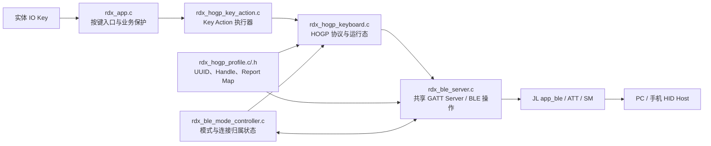
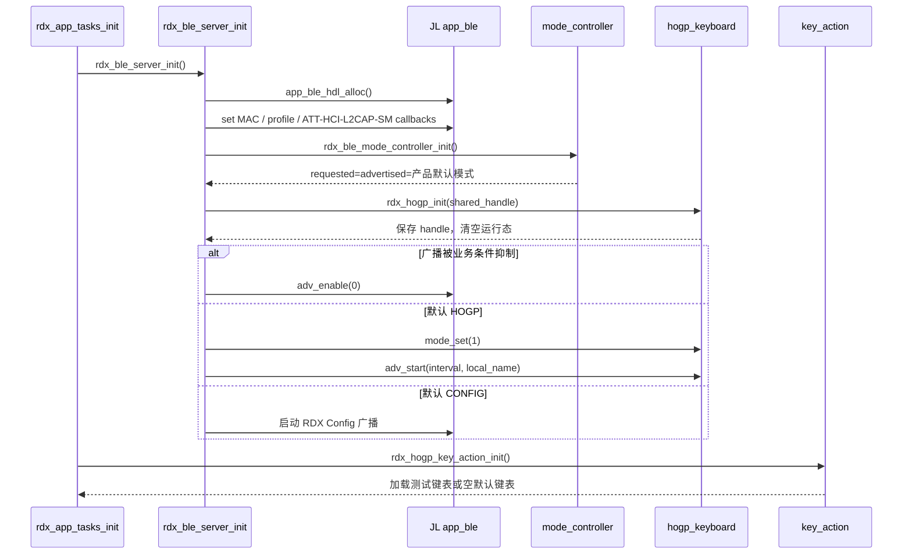
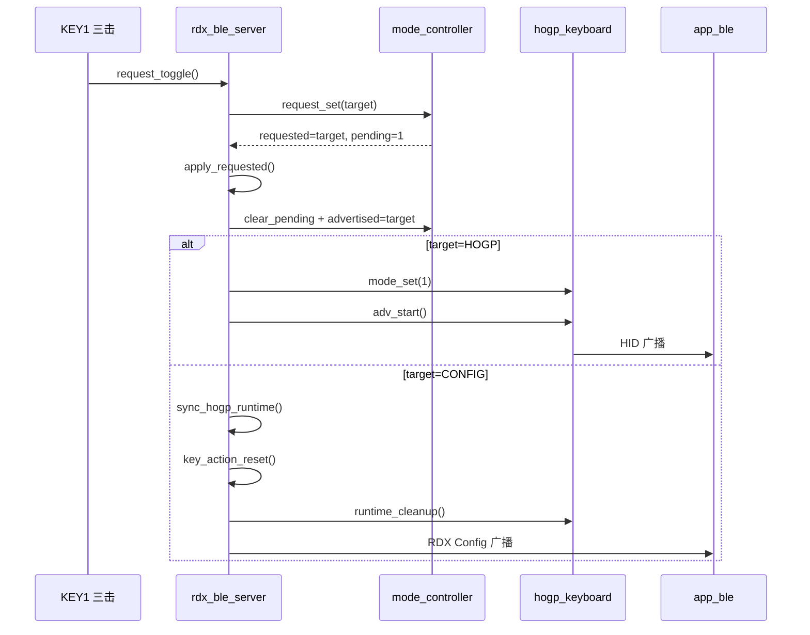
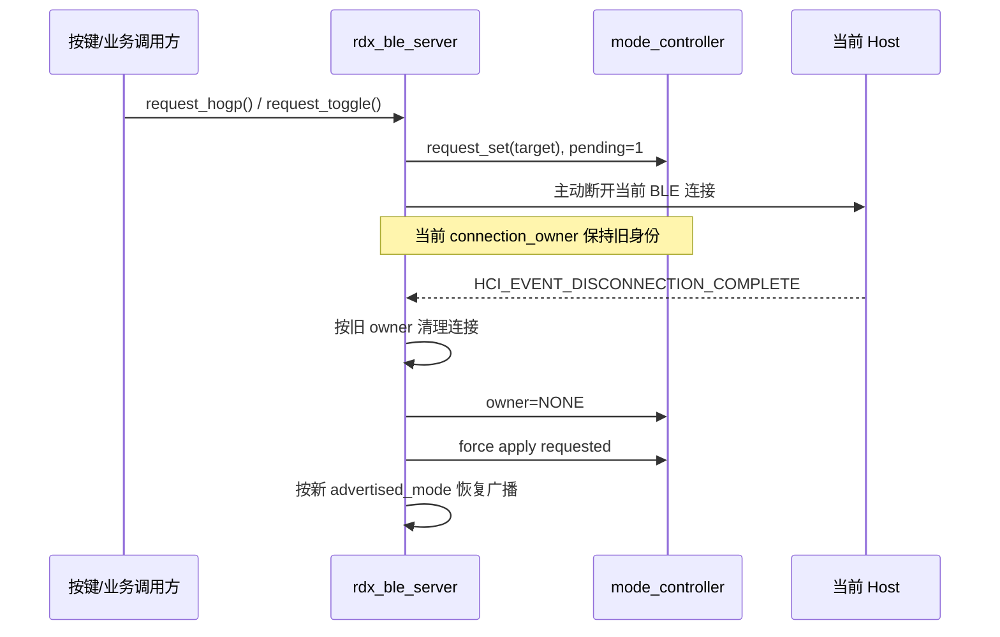
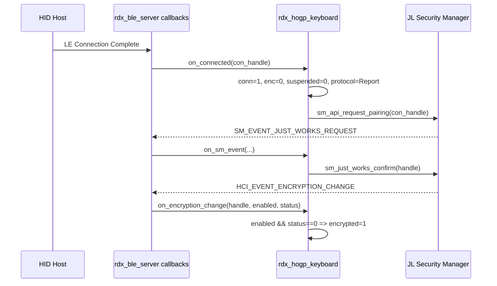
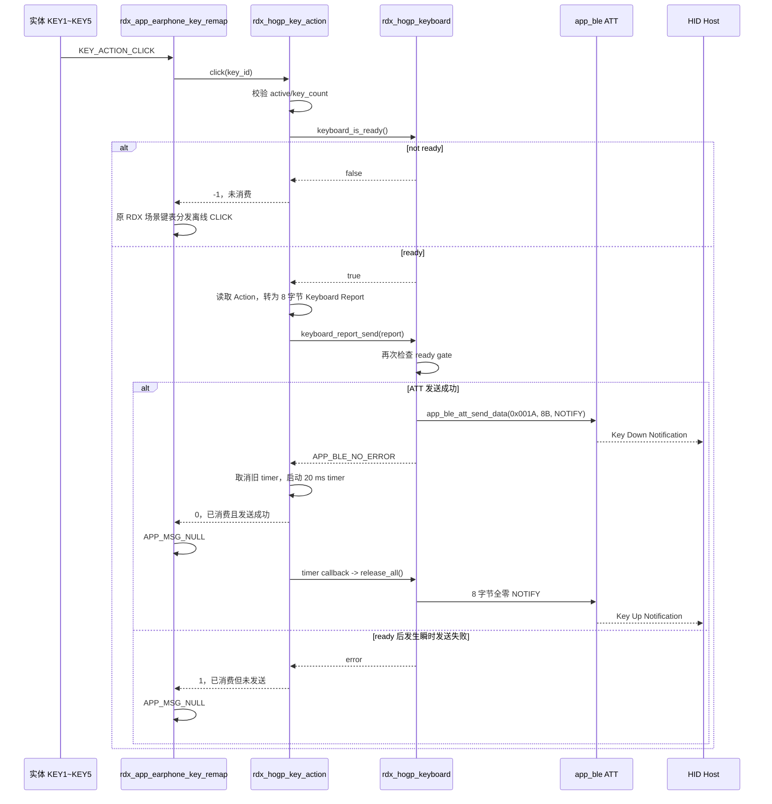
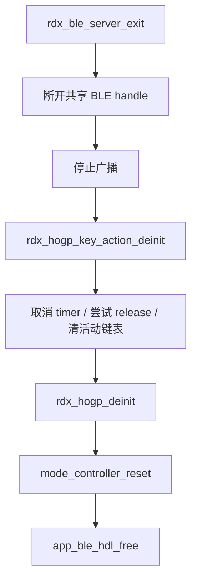
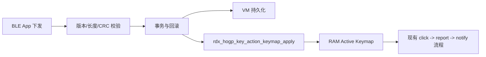

# HOGP HID 键盘全流程与调用链

> 本文以当前模块化重构后的源码为准，描述 T2620 产品中 HID over GATT Profile（HOGP）键盘从编译配置、初始化、广播、连接配对、ATT 交互，到实体按键产生 Keyboard Input Report、自动抬键、断连及退出清理的完整流程。
>
> 当前实现是 **HOGP Profile v1**：支持标准 6KRO 键盘 Input Report、LED Output Report 接收、Just Works 配对，以及 CONFIG/HOGP 两种 BLE 广播身份切换。BLE App 键表下发、VM 持久化、Macro/Layer/Consumer Control 不在本文所述的已实现范围内。

## 1. 总体架构

HOGP 没有创建第二套 GATT Server，也没有分配第二个 `app_ble` wrapper handle。它作为 RDX BLE Server 的子模块，复用 RDX 已分配的 handle、ATT 回调和 HCI/SM 事件入口。



模块职责如下：

| 模块 | 职责 | 明确不负责 |
| --- | --- | --- |
| `rdx_ble_mode_controller.c/.h` | 保存 requested mode、advertised mode、connection owner、switch pending | 不断连、不启停广播、不判断业务抑制条件 |
| `rdx_ble_server.c/.h` | 分配共享 BLE handle、注册 Profile/回调、执行广播和断连、分发 ATT/HCI/SM 事件 | 不构造键盘报告、不保存键表 |
| `rdx_hogp_profile.c/.h` | HID UUID、Handle、属性标志、Report Map、HID Information 的单一事实源 | 不保存运行态、不发送报告 |
| `rdx_hogp_keyboard.c/.h` | HOGP 运行态、ATT 读写、广播数据、配对、加密、Input Report 通知 | 不读取实体按键、不管理键表、不切换 RDX 业务模式 |
| `rdx_hogp_key_action.c/.h` | 活动键表、Action 到 8 字节报告转换、按下和定时抬键 | 不操作广播/连接、HFP、VM 或 BLE App 协议 |
| `rdx_app.c` | 接收系统按键事件，执行场景保护，路由 CLICK 和测试用三击切换 | 不构造 HID Report、不持有抬键定时器 |

关键源码入口：

- [`rdx_ble_server.c`](../SDK/apps/common/third_party_profile/rdx_protocol/rdx_ble_server.c)：共享 GATT Server 和跨模块总控。
- [`rdx_ble_mode_controller.c`](../SDK/apps/common/third_party_profile/rdx_protocol/rdx_ble_mode_controller.c)：BLE 模式状态。
- [`rdx_hogp_keyboard.c`](../SDK/apps/common/third_party_profile/rdx_protocol/rdx_hogp_keyboard.c)：HOGP 协议主体。
- [`rdx_hogp_profile.c`](../SDK/apps/common/third_party_profile/rdx_protocol/rdx_hogp_profile.c)：Report Map 和 HID Information。
- [`rdx_hogp_key_action.c`](../SDK/apps/common/third_party_profile/rdx_protocol/rdx_hogp_key_action.c)：键值执行器。
- [`rdx_app.c`](../SDK/apps/common/third_party_profile/rdx_protocol/rdx_app.c)：实体按键入口。

## 2. 编译开关与当前产品配置

HOGP 代码同时受 RDX 协议开关和 HOGP 主开关控制：

```c
#if TCFG_RDX_HOGP_ENABLE && (THIRD_PARTY_PROTOCOLS_SEL & RDX_EN)
```

当前 T2620 产品配置为：

| 配置 | 当前值 | 作用 |
| --- | ---: | --- |
| `TCFG_RDX_HOGP_ENABLE` | `1` | 编译 HID Service 和 HOGP 实现 |
| `RDX_BLE_DEFAULT_MODE` | `RDX_BLE_DEFAULT_MODE_HOGP` | 上电默认广播 HOGP 身份 |
| `RDX_HOGP_KEY_ACTION_TEST_ENABLE` | `1` | 加载五键测试键表，并开放 KEY1 三击切换模式 |
| `TCFG_RDX_HOGP_KEY_UP_DELAY_MS` | `20` | 键按下后自动发送全零报告的延迟 |
| `RDX_HOGP_ENCRYPTION_REQUIRED` | `1` | 必须完成链路加密后才允许发送按键 |
| `RDX_HOGP_PAIRING_MODE` | `0` | Just Works；其他值当前直接编译报错 |
| `RDX_HOGP_APPEARANCE` | `0x03C1` | BLE Appearance: Keyboard |

主开关关闭时：

- HID 属性不会加入 `rdx_profile_data[]`。
- `rdx_hogp_keyboard.c` 导出同名空实现，避免调用方出现条件编译扩散。
- `rdx_ble_mode_effective_default()` 强制返回 CONFIG，即使产品配置错误地指定了 HOGP 默认模式。

配置来源见 [`t2620_project_config.h`](../SDK/apps/earphone/include/t2620_project_config.h)、[`rdx_hogp_config.h`](../SDK/apps/common/third_party_profile/rdx_protocol/rdx_hogp_config.h) 和 [`rdx_app_config.h`](../SDK/apps/common/third_party_profile/rdx_protocol/rdx_app_config.h)。

## 3. GATT Profile 与 HID 数据契约

### 3.1 共享 Profile

`rdx_ble_server_init()` 只调用一次：

```c
app_ble_profile_set(rdx_ble_server_hdl, rdx_profile_data);
```

`rdx_profile_data[]` 同时包含原 RDX 服务和 HID 服务。HOGP 不调用独立的 `att_server_init()`，因此 `config_le_gatt_server_num` 仍保持 `1`。

### 3.2 HID 属性布局

| Handle | UUID | 属性 | 用途 |
| ---: | ---: | --- | --- |
| `0x0016` | `0x1812` | Primary Service | HID Service |
| `0x0018` | `0x2A4E` | Read / Write Without Response | Protocol Mode |
| `0x001A` | `0x2A4D` | Read / Write / Notify | Keyboard Input Report |
| `0x001B` | `0x2902` | Read / Write | Input Report CCC |
| `0x001C` | `0x2908` | Read | Input Report Reference，ID=1、Type=Input |
| `0x001E` | `0x2A4B` | Read | Report Map |
| `0x0020` | `0x2A4A` | Read | HID Information 1.11 |
| `0x0022` | `0x2A4C` | Write Without Response | HID Control Point |
| `0x0029` | `0x2A4D` | Read / Write / Write Without Response | LED Output Report |
| `0x002A` | `0x2908` | Read | Output Report Reference，ID=1、Type=Output |

`0x0029/0x002A` 位于 Device Information 属性之后，超出 HID Service 的 `0x0016~0x0022` 范围。这是 Profile v1 已冻结的兼容性债务，当前写路由必须对 `0x0029` 单独判断，不能只依赖 `rdx_hogp_is_handle()`。

### 3.3 Keyboard Input Report

运行时报告固定为 8 字节：

| 字节 | 含义 |
| ---: | --- |
| 0 | Modifier 位图：LCtrl、LShift、LAlt、LGUI、RCtrl、RShift、RAlt、RGUI |
| 1 | Reserved，固定为 `0` |
| 2~7 | 最多 6 个同时按下的 Keyboard Usage，即 6KRO |

```text
[modifier][reserved][usage0][usage1][usage2][usage3][usage4][usage5]
```

当前 Report Map 含 `Report ID = 1`，但 ATT Notification 的 payload 按冻结的 Profile v1 合约只发送上述 8 字节，**不在 payload 前附加 Report ID**。修改这一点会改变主机可见协议，必须同步修改 Profile 合约测试并重新做多平台配对回归。

`rdx_hogp_keyboard_report_t` 的内存布局就是这 8 字节，发送前直接复制为 payload。发送成功后，模块会保存一份 `s_hid_input_report`，供主机读取 Input Report；发送失败则不更新该快照。

### 3.4 Report Map 和 HID Information

- Report Map 长度固定为 70 字节，声明标准键盘 Modifier、6 个按键 Usage 和 3 位 LED Output。
- HID Information 为 `11 01 00 03`：HID 1.11、无国家码、Remote Wake 和 Normally Connectable 标志置位。
- 编译期数组长度断言防止常量和实际数据分离。
- [`test_hogp_profile_contract.ps1`](../tests/host/test_hogp_profile_contract.ps1) 冻结 Handle、属性顺序、Report Map、8 字节 payload 等外部契约。

## 4. 运行时状态模型

### 4.1 BLE 模式控制器状态

`rdx_ble_mode_controller` 保存四类状态：

| 状态 | 含义 |
| --- | --- |
| `requested_mode` | 业务最新请求的目标身份：CONFIG 或 HOGP |
| `advertised_mode` | 最近已提交到广播侧的身份，也是新连接的归属判定依据 |
| `connection_owner` | 当前连接属于 CONFIG、HOGP 或 NONE |
| `switch_pending` | requested 与当前状态之间有待应用的模式请求 |

不要用 `requested_mode` 判断当前连接属于谁。连接可能正在为模式切换而断开，此时 requested 已改变，但现有连接仍属于旧的 advertised identity。连接完成时，服务端根据 `advertised_mode` 锁定 `connection_owner`，后续 ATT 路由都以 owner 为准。

```mermaid
stateDiagram-v2
    [*] --> Default: controller_init
    Default --> AdvertisingConfig: default=CONFIG
    Default --> AdvertisingHogp: default=HOGP

    AdvertisingConfig --> ConnectedConfig: CONFIG 广播被连接
    AdvertisingHogp --> ConnectedHogp: HOGP 广播被连接

    AdvertisingConfig --> AdvertisingHogp: 请求 HOGP，无连接，立即应用
    AdvertisingHogp --> AdvertisingConfig: 请求 CONFIG，无连接，立即应用

    ConnectedConfig --> Disconnecting: 请求 HOGP
    ConnectedHogp --> Disconnecting: 请求 CONFIG
    Disconnecting --> AdvertisingHogp: 断连完成，提交 requested=HOGP
    Disconnecting --> AdvertisingConfig: 断连完成，提交 requested=CONFIG

    ConnectedConfig --> AdvertisingConfig: 普通断连
    ConnectedHogp --> AdvertisingHogp: 普通断连
```

### 4.2 HOGP 运行态

`rdx_hogp_keyboard` 私有保存：

- `s_hogp_mode`：HOGP 子模块是否处于启用模式。
- `s_hogp_connected` 和 `s_hid_con_handle`：HOGP 连接状态及连接句柄。
- `s_hid_notify_enabled`：主机是否写入 Input Report CCC 使能通知。
- `s_hogp_encrypted`：链路加密是否成功。
- `s_hogp_suspended`：主机是否通过 HID Control Point 请求 Suspend。
- `s_hid_protocol_mode`：Boot 或 Report，连接时默认 Report。
- `s_hid_input_report`：最后一次成功发送的 8 字节报告快照。

真正允许发送按键的条件是：

```text
connected
AND app_ble handle 有效
AND Input Report CCC notify 已使能
AND 未 suspend
AND 已加密（当前配置要求）
AND connection_owner == HOGP
```

只要任何一项不满足，`rdx_hogp_keyboard_is_ready()` 返回 `0`，报告不会进入 ATT Notify。

## 5. 上电初始化调用链



初始化顺序的关键点：

1. 先创建并注册共享 GATT Server。
2. 再初始化 mode controller，使默认模式在广播前确定。
3. 再把共享 handle 交给 HOGP 子模块。
4. 根据业务抑制条件和默认模式启动对应广播。
5. BLE/HOGP 就绪后才初始化 Key Action 执行器。

广播抑制条件包括 DUT、关机流程、WiFi 传输、SD 格式化。抑制只阻止广播启用；模式状态仍可提交，待抑制条件解除后由现有业务路径恢复相应广播。

## 6. HOGP 广播流程

HOGP 广播数据由 `rdx_hogp_fill_adv_data()` 按 31 字节上限构造：

1. Flags = `0x06`。
2. Complete 16-bit Service UUIDs = HID `0x1812`。
3. Appearance = Keyboard `0x03C1`。
4. Complete Local Name；空间不足时截断到剩余容量。

`rdx_hogp_adv_start()` 只有在 `s_hogp_mode == 1` 时才执行。内部顺序是先关闭旧广播并清空 Scan Response，再设置广播参数、广播数据并重新启用。CONFIG 与 HOGP 广播互斥，共用同一个 wrapper handle。

当前 `RDX_HOGP_NAME_SOURCE == 0`，HOGP 名称来自 `rdx_ble_server_get_local_name()`，而不是 `RDX_HOGP_CUSTOM_NAME`。该函数优先读取 VM 中的 `VM_RDX_BLE_NAME`；VM 中没有名称时，使用当前产品的 `BLE_LOCAL_NAME` 加 AuthKey 后四位生成默认名称。当前产品选择为 `APP_ZENCHORD_EN + DEVICE_ZENCORD_CC_T2616`，所以默认值通常类似 `Zenchord Case xxxx`，也可能是 BLE App 已写入 VM 的自定义 RDX 名称。

`RDX_HOGP_CUSTOM_NAME` 当前定义为 `VibeKeyboard`，但只有将 `RDX_HOGP_NAME_SOURCE` 改为 `1` 后才会生效。如果产品要求 HOGP 始终以 `VibeKeyboard` 出现，需要切换名称源；如果要求 CONFIG 与 HOGP 共用可配置名称，则应保持名称源为 `0`，并确保 VM/RDX local name 配置符合产品定义。

## 7. CONFIG/HOGP 模式切换

当前测试入口是 KEY1（`KEY_IO_NUM0`）三击：

```text
系统按键事件
 -> rdx_app_earphone_key_remap()
 -> rdx_ble_mode_request_toggle()
 -> rdx_ble_mode_request(target)
 -> rdx_ble_mode_request_set(target)
```

### 7.1 无连接时



### 7.2 有连接时

模式不能在活跃连接中直接替换身份。服务端先记录 requested/pending，再主动断连；收到真实的 `HCI_EVENT_DISCONNECTION_COMPLETE` 后才强制提交目标模式并按新身份重新广播。



切换到 CONFIG 时，`rdx_ble_mode_sync_hogp_runtime()` 会取消待执行的抬键定时器、尝试发送全零释放报告，并清空 HOGP 连接运行态。

### 7.3 模式持久化与 TWS 边界

当前 `requested_mode`、`advertised_mode`、`connection_owner` 和 `switch_pending` 都只是 `rdx_ble_mode_controller.c` 中的 RAM 状态，没有写入 VM：

- KEY1 三击切换只影响当前运行周期。
- BLE Server 退出时会调用 `rdx_ble_mode_controller_reset()`。
- 设备重启或 BLE Server 重新初始化后，会重新采用 `rdx_ble_mode_effective_default()`；当前 T2620 配置会回到 HOGP 默认模式。

当前也没有 HOGP 专用的 TWS 模式同步调用链。代码中没有把模式请求同步给 sibling，也没有由 TWS 消息恢复 HOGP mode。`rdx_app_tws_bind_info_sync()` 属于原 RDX 连接信息同步，不等价于 HOGP 模式同步。若未来同一产品由左右耳分别运行 BLE/HOGP，需要先明确哪个设备拥有 BLE 广播和连接，再设计模式同步及冲突处理；不能仅在两侧分别调用 `rdx_ble_mode_request_toggle()`。

## 8. 连接、配对和主机枚举流程

### 8.1 连接归属

普通或 Enhanced LE Connection Complete 到达后：

1. 服务端保存连接句柄并设置 `ble_conn = TRUE`。
2. 根据 `advertised_mode` 设置 owner。
3. owner 为 HOGP 时调用 `rdx_hogp_on_connected()`。
4. owner 为 CONFIG 时才运行原 RDX Config 的 MTU、连接参数和业务初始化路径。

HOGP 连接不会进入 `rdx_ble_server_connected_handle()` 的完整 RDX App Config 初始化，避免两个逻辑身份互相污染。

### 8.2 Just Works 与加密



加密事件必须同时满足 HOGP mode 和连接句柄匹配；旧连接的迟到事件会被忽略。加密失败或被关闭时，模块清空当前报告快照，后续发送被 ready gate 拒绝。

### 8.3 主机枚举与 CCC

主机连接后通常依次读取 HID Information、Report Map、Protocol Mode、Report Reference，并向 `0x001B` 写 `0x0001` 使能 Input Report Notification。

CCC 写入后：

```text
rdx_ble_server_att_write_callback()
 -> owner/HID handle 校验
 -> rdx_hogp_att_write()
 -> multi_att_set_ccc_config()
 -> s_hid_notify_enabled = 1
```

只有“配对加密成功”和“CCC 通知使能”都完成，键盘才真正进入可发送状态；两者的先后顺序不做假设。

## 9. ATT 读写分发

### 9.1 读取

`rdx_ble_server_att_read_callback()` 只在 `connection_owner == HOGP` 时把下列 Handle 转交给 `rdx_hogp_att_read()`：

- Protocol Mode：当前 1 字节模式。
- Report Map：支持 offset 分片读取。
- HID Information：支持 offset 分片读取。
- Input Report：最后一次成功通知的 8 字节快照。
- Input Report CCC：从 multi-ATT CCC 存储读取 2 字节配置。

读取 helper 在 `offset >= data_len` 时返回 0，并按 `buffer_size` 截断，满足 ATT 长属性分片读取要求。

### 9.2 写入

HID Service 范围 `0x0016~0x0022` 先做 owner 校验，再统一进入 `rdx_hogp_att_write()`：

| 写入目标 | 合法值 | 行为 |
| --- | --- | --- |
| Protocol Mode | `0` Boot、`1` Report | 更新运行态；offset 必须 0、长度必须 1 |
| HID Control Point | `0` Suspend、`1` Exit Suspend | Suspend 时禁止发键并清空报告快照 |
| Input Report CCC | bit0 = Notify | 保存 multi-ATT CCC 并更新 ready gate |
| Input Report Value | 任意 | 当前只记录 verbose 日志，不作为主机到设备的数据通道 |
| Output Report `0x0029` | 至少 1 字节 | 记录 LED 位值；当前不驱动实体 LED，也不持久化 |

非法 offset、长度或枚举值分别返回 ATT `0x07`、`0x0D`、`0x13`。非 HOGP owner 对 HID 的读写会被服务端拒绝；非 CONFIG owner 对 RDX App Config 写入和 CCC 写入也会被拒绝。

## 10. 实体按键到 HID 报告

### 10.1 按键入口和前置保护

所有 IO NUM 键先进入 `rdx_app_earphone_key_remap()`。以下状态会在 HOGP 路由前直接返回：

- SD 正在格式化。
- 当前处于 PC mode。
- 原代码保留的主页面 loading 保护被 `if (0)` 硬编码禁用，当前属于不可达残留逻辑。源码注释说明 OLED 功能已删除，但没有证据表明该分支是临时方案；是否删除或恢复应由对应产品功能确认。

只有 `KEY_IO_NUM0~KEY_IO_NUM4` 映射到 HOGP 的 `key_id = 0~4`。当前仅 `KEY_ACTION_CLICK` 进入 HOGP Key Action 执行器；LONG、HOLD、HOLDUP 等继续走原 RDX 场景键表。

### 10.2 当前测试键表

在 `RDX_HOGP_KEY_ACTION_TEST_ENABLE == 1` 时：

| 实体键 | key_id | HID Action |
| --- | ---: | --- |
| KEY1 | 0 | Left Ctrl + V |
| KEY2 | 1 | A |
| KEY3 | 2 | Enter |
| KEY4 | 3 | Left Ctrl + C |
| KEY5 | 4 | Backspace |

该表只用于当前固件验证，不是 Flash ABI。关闭测试开关后，默认活动键表有意保持为空，等待 BLE App 键表协议和 VM 持久化格式确定。

### 10.3 单击发送与自动抬键



Action 转换规则非常直接：

```text
report.modifiers = action.modifiers
report.reserved  = 0
report.usages    = action.usages[0..5]
```

发送成功后才创建抬键定时器。新按键成功发送前会取消旧定时器，再为新按键创建 20 ms 定时器。若定时器创建失败，执行器立即调用 `release_all()`，尽量避免主机侧出现卡键。

返回值语义：

| 返回值 | 含义 | `rdx_app.c` 行为 |
| ---: | --- | --- |
| `0` | Action 已消费且 Key Down 已发送 | 屏蔽旧键表 |
| `1` | Action 已消费，但发送或 timer 创建失败 | 仍屏蔽旧键表，防止一次点击触发两套业务 |
| `-1` | HOGP 未 ready，或 key_id/键表无效，未消费 | 回落到原 RDX 场景键表，执行离线 IO CLICK |

这里的“PC 已连接”按可发送状态定义，而不只是收到 LE Connection Complete。只有连接存在、Input Report CCC 已开启、未 Suspend、加密成功且 owner 为 HOGP 时，CLICK 才交给自定义 HID Action；其他状态都回落到离线 IO 键表。这样在 HOGP 广播等待连接、配对尚未完成、PC 断连或处于 CONFIG 模式时，五个 IO 键仍保持原产品功能。

执行器在预检查 ready 后，`rdx_hogp_keyboard_report_send()` 还会再次检查 ready gate。若两次检查之间连接状态突变，发送失败返回 `1` 并继续消费本次点击，避免同一次点击在竞态窗口中同时触发 HID 和离线动作；下一次点击会因 not ready 正常回落离线键表。

## 11. Suspend、断连与退出清理

### 11.1 Suspend

主机向 HID Control Point 写 `0`：

- `s_hogp_suspended = 1`。
- 清空当前 Input Report 快照。
- ready gate 立即关闭，后续按键不发送。

写 `1` 退出 Suspend，只恢复发送资格的一项；仍需连接、加密、CCC 和 HOGP owner 全部有效。

### 11.2 HOGP 普通断连

`HCI_EVENT_DISCONNECTION_COMPLETE` 到达后：

```text
rdx_ble_server_cbk_packet_handler()
 -> 记录 prev_owner
 -> rdx_hogp_on_disconnected()
 -> 清 conn handle / CCC / encryption / suspend / report snapshot
 -> connection_owner = NONE
 -> force apply pending mode（若有）
 -> 按当前 advertised_mode 恢复广播
```

恢复 HOGP 广播前会再次检查 DUT、关机、WiFi 传输、SD 格式化等抑制条件。

注意，HOGP owner 的这个普通断连分支当前不会调用 `rdx_ble_server_disconnected_cleanup_internal()`，因此也不会执行其中的 `rdx_hogp_key_action_reset()`。这与 CONFIG owner 的断连清理路径不同，具体 timer 影响见 12.4 节。

### 11.3 切离 HOGP

当待应用模式变成 CONFIG：

```text
rdx_ble_mode_sync_hogp_runtime()
 -> rdx_hogp_key_action_reset()
    -> cancel release timer
    -> release_all()（若已不可发送，允许失败）
 -> rdx_hogp_runtime_cleanup()
    -> 清空 HOGP 全部连接运行态并将 mode 置 0
```

### 11.4 BLE Server 退出



Key Action 必须先于 HOGP deinit，因为它的 deinit 会尝试通过 HOGP 发送释放报告；随后才可以清空 HOGP 保存的 shared handle。

## 12. 关键边界、异常路径与维护注意事项

### 12.1 单 GATT Server 约束

- 不要为 HOGP 再调用 `att_server_init()`。
- 不要把 `config_le_gatt_server_num` 改成 2。
- 新 HID 属性必须继续加入共享 `rdx_profile_data[]`，并通过现有 RDX wrapper handle 发送。

### 12.2 模式状态与连接归属不能混用

- `requested_mode` 表示未来目标。
- `advertised_mode` 表示广播身份和新连接身份。
- `connection_owner` 表示当前连接允许访问的协议面。
- ATT 路由必须看 owner，不能只看当前是否“请求 HOGP”。

### 12.3 报告发送失败不会启动抬键 timer

如果 Key Down 没有成功入 ATT 队列，就不应随后发送一个孤立的 Key Up。唯一例外是 timer 创建失败：此时 Key Down 已成功，所以立即尝试发送释放报告。

### 12.4 当前普通 HOGP 断连的 timer 行为

普通 HOGP 断连会清 HOGP 运行态，但当前不会直接调用 `rdx_hogp_key_action_reset()`；若断连恰好发生在 20 ms 抬键窗口内，timer 仍会到期并尝试发送释放，随后因 `not ready` 失败。切换到 CONFIG 和 BLE Server 退出路径会显式取消 timer。该行为通常不会造成主机卡键，因为链路已经断开，但若后续延长按键保持时间或引入长按报告，应把 HOGP 普通断连也纳入执行器 reset 生命周期。

若要修复，应在 `rdx_ble_server.c` 的 `HCI_EVENT_DISCONNECTION_COMPLETE`、`prev_owner == RDX_BLE_OWNER_HOGP` 分支中调用 `rdx_hogp_key_action_reset()`。不要让 `rdx_hogp_on_disconnected()` 直接调用 Key Action 模块：`rdx_hogp_keyboard` 是底层协议模块，不应反向依赖上层执行器。修复时还应考虑调用顺序，因为 `rdx_hogp_key_action_reset()` 会先尝试发送全零报告；若先执行 `rdx_hogp_on_disconnected()`，该发送必然被 ready gate 拒绝，但 timer 仍能被正确取消。

### 12.5 重复请求同一模式

controller 会把“目标模式已经请求且无 pending”视为无状态变化；但 server facade 目前仍可能在存在连接时继续走主动断连判断。调用方应避免在已处于目标模式时重复调用 `rdx_ble_mode_request_hogp()`。测试用 toggle 不存在这个问题，因为它总是请求相反模式。

### 12.6 Output Report 只完成协议接收

主机的 Num Lock/Caps Lock/Scroll Lock LED 字节目前只打印日志，没有映射到设备 LED。若未来接入 LED，建议在 HOGP 模块向上发出语义化事件，不要让 `rdx_hogp_keyboard.c` 直接依赖产品 LED 驱动。

## 13. 调试观测点

主要日志前缀：

| 前缀 | 关注内容 |
| --- | --- |
| `[BLE_MODE]` | requested、advertised、owner、pending、连接状态和模式应用时机 |
| `[HOGP]` | 模式、连接、CCC、加密、广播、报告发送、Protocol Mode、Control Point |
| `[HOGP_ERR]` | not ready、加密失败、非法写入、广播溢出、ATT 发送失败 |
| `[HOGP_KEY_ACTION]` | 键表校验、按键发送失败、抬键 timer 创建失败 |

推荐按以下顺序定位“按键无输出”：

1. 确认 `[BLE_MODE]` 中 `adv=HOGP` 且连接后 `owner=HOGP`。
2. 确认出现 HOGP connection complete 和 Just Works confirm。
3. 确认 encryption change 为 `enabled=1 status=0`。
4. 确认主机写入 `0x001B`，日志中 `notify=1`。
5. 确认按键被识别为 IO NUM 和 CLICK。
6. 确认 `report_send` 打印正确的 8 字节 Key Down。
7. 确认约 20 ms 后出现 8 字节全零 Key Up。

## 14. 验证范围

Host 合约测试覆盖以下软件契约：

- HID Handle、属性顺序和字节值。
- 70 字节 Report Map。
- 8 字节 Input Report，不附加 Report ID。
- mode controller、owner 路由和默认模式约束。
- Key Action 的键表边界、报告转换、timer 生命周期和模块依赖边界。
- HOGP 关闭时的 stub 和 CONFIG fallback。

运行方式：

```powershell
.\tests\host\run_host_tests.ps1
```

统一入口当前通过 `Get-Command powershell.exe` 启动子测试，适用于 Windows。在 macOS 上即使已安装 PowerShell 7，也不能直接运行该入口，应分别执行：

```powershell
pwsh -NoProfile -ExecutionPolicy Bypass -File ./tests/host/test_t2620_config_overlay.ps1
pwsh -NoProfile -ExecutionPolicy Bypass -File ./tests/host/test_hogp_profile_contract.ps1
```

软件测试不能替代真机验证。发布前仍应至少覆盖 Windows、macOS、iOS/Android 中目标平台的首次配对、回连、删除配对后重配、快速连按、模式切换中断、Suspend/Resume，以及断连发生在 Key Down/Key Up 之间的场景。

## 15. 后续 BLE App 键表接入点

BLE App 配置协议落地后，建议保持现有执行链不变，只新增“配置来源层”：



`rdx_hogp_key_action_keymap_apply()` 已提供 RAM 活动键表入口，并校验版本和 `key_count`。但当前结构注释明确说明它不是 Flash ABI；不要直接把 C struct 原样写入 VM。下发格式需要独立定义版本、长度、字节序、CRC、事务提交和失败回滚后，再转换为运行时 keymap。
