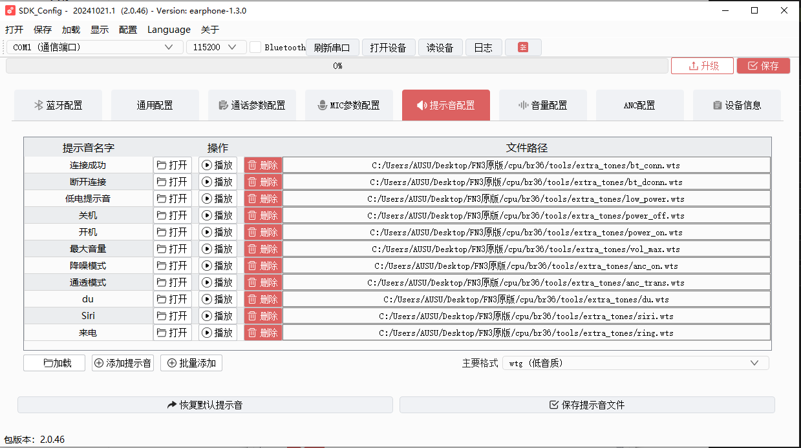

基于V138公版软件的鼎合丰内部版本V1

# 替换提示音

为了方便知道耳机的状态，把所有的音效改成中文。

## 替换

打开配置工具入口，点击配置工具：



1. 收集对应的中文MP3格式的音效素材
2. 把原有音效删除，新音效改为同名MP3
3. 然后点击打开选中即可
4. 格式跟原来一样，点击保存提示音文件
5. 再点击保存到bin即可编译生效。

# 打印

打开打印总开关：`apps\earphone\include\app_config.h`

```c
/*
 * 系统打印总开关
 */

#define LIB_DEBUG    0  //打开打印
#define CONFIG_DEBUG_LIB(x)         (x & LIB_DEBUG)

 #define CONFIG_DEBUG_ENABLE

#ifndef CONFIG_DEBUG_ENABLE
#define CONFIG_DEBUG_LITE_ENABLE  //轻量级打印开关, 默认关闭
#endif
```

## 使用

```c
printf("=== Log Test Start ===\n");
    
    // 测试普通打印
    printf("Normal printf working\n");
    
    // 测试日志级别打印
    log_info("Info log test\n");
    log_debug("Debug log test\n");
    log_error("Error log test\n");
    
    printf("=== Log Test End ===\n");
```

**普通printf输出**：

```c
[00:00:00.321]=== Log Test Start ===
[00:00:00.322]Normal printf working
```

- 格式：`[时间戳]内容`
- 特点：简单直接，只显示时间和内容

**log_info输出**：

```c
[00:00:00.322][Info]: [APP]Info log test
```

- 格式：`[时间戳][Info]: [APP]内容`
- 特点：包含了日志级别(Info)和模块标签(APP)

**log_error输出**：

```c
[00:00:00.323](error): <Error>: [APP]Error log test
```

- 格式：`[时间戳](error): <Error>: [APP]内容`
- 特点：错误日志有特殊标记，更容易识别

**时间戳格式**：

- 格式：`[HH:MM:SS.mmm]`
- 例如：`[00:00:00.321]`
- 精确到毫秒级别

## 日志输出

对于日志输出，需要以下配置：

**必需的宏定义**（这些要在包含头文件之前定义）：

```c
// 定义模块名称
#define LOG_TAG_CONST       APP    // 模块名称（大写）
#define LOG_TAG             "[APP]" // 模块标签（方括号格式）

// 启用需要的日志级别
#define LOG_ERROR_ENABLE    // 启用错误日志
#define LOG_DEBUG_ENABLE    // 启用调试日志
#define LOG_INFO_ENABLE     // 启用信息日志
//#define LOG_DUMP_ENABLE   // 启用数据打印（可选）
#define LOG_CLI_ENABLE      // 启用命令行（可选）
```

**必需的头文件**：

```c
#include "debug.h"          // 包含调试相关定义
```

**完整示例**：

```c
#include "app_config.h"     // 首先包含应用配置

// 日志配置（必须在debug.h之前）
#define LOG_TAG_CONST       APP
#define LOG_TAG             "[APP]"
#define LOG_ERROR_ENABLE
#define LOG_DEBUG_ENABLE
#define LOG_INFO_ENABLE
#define LOG_CLI_ENABLE

// 包含日志头文件
#include "debug.h"

// 使用示例
void test_function(void)
{
    log_info("Info message\n");
    log_debug("Debug message\n");
    log_error("Error message\n");
}
```

记住：

- 宏定义必须在包含 debug.h 之前

- app_config.h 中确保 LIB_DEBUG = 0

- 只有定义了对应的 ENABLE 宏，对应级别的日志才会输出

这样配置后就可以使用各种日志函数了：

- log_info() - 信息日志

- log_debug() - 调试日志

- log_error() - 错误日志

## 彩色打印(不会)

# SDK的启动流程

`app_main()`函数确实是整个SDK的应用层入口点。从代码中可以看到，在系统底层初始化完成后，`app_main()`函数被调用，它负责初始化应用层的各种组件并启动相应的应用程序。

系统启动流程大致如下：

1. 系统上电后，首先执行底层硬件初始化
2. 在`setup_arch()`函数中完成CPU内部模块的初始化，包括：
   - 内存初始化
   - 时钟配置
   - 看门狗初始化
   - 端口初始化
   - 定时器初始化（`sys_timer_init()`）
   - 调试功能初始化
3. 操作系统初始化并启动
4. 调用`board_init()`进行板级初始化
5. 最后调用`app_main()`作为应用程序的入口点

## 疑问1

**进入具体模式应用之前，是否初始化了一系列公用定时器事件？**

在进入具体的应用模式之前，SDK确实初始化了一系列公用的定时器事件。主要包括：

1. **系统定时器初始化**：在`setup_arch()`函数中调用`sys_timer_init()`**初始化系统定时器框架**
2. **按键扫描定时器**：在`key_driver_init()`函数中，为各种按键类型（如IO按键、AD按键、红外按键、触摸按键等）注册了扫描定时器，使用`sys_s_hi_timer_add()`函数添加
3. **蓝牙相关定时器**：如进入sniff模式的检查定时器
4. **自动关机定时器**：在`sys_auto_shut_down_enable()`中添加
5. 2ms定时器中断：在` app_main.c`中定义了`timer_2ms_handler()`函数，作为2ms定时器中断的回调函数（虽然在您提供的代码中这个函数是空的）

在`app_main()`函数中，系统会根据不同的条件（如是否处于充电状态）来决定启动哪个应用程序：

- 如果检测到充电状态，启动idle应用
- 否则，根据配置启动PC模式、助听器模式、Linein模式或耳机模式应用

每个应用程序在启动时也会初始化自己特定的定时器事件。

系统提供了多种定时器API：

- `sys_timer_add()` - 添加周期性定时器
- `sys_timeout_add()` - 添加一次性定时器
- `sys_s_hi_timer_add()` - 添加高优先级定时器

这些定时器API使得系统能够处理各种定时任务，如按键扫描、蓝牙连接管理、自动关机等功能。

总结来说，`app_main()`确实是SDK的应用层入口点，在进入具体应用模式之前，系统已经初始化了多种公用定时器事件，为各种功能模块提供了定时服务支持。

## 疑问2

**进入具体模式应用之前，会检测是否处于充电状态。如果已经是充电状态的话，vbat_check_init中初始化了两个定时器做电池电压检测并进入启动idle应用，没有充电状态的话，按照宏定义进入具体的模式应用，默认进入耳机模式应用？**

### 充电状态检测与应用启动流程

在`app_main()`函数中，系统会首先检测设备是否处于充电状态，然后根据不同的状态走不同的初始化和应用启动路径：

#### 充电状态下的流程

如果设备处于充电状态（`get_charge_online_flag()`返回非零值），系统会：

1. 如果启用了系统低电压检测功能（`TCFG_SYS_LVD_EN == 1`），则调用`vbat_check_init()`初始化电池电压检测
   - 在`vbat_check_init()`中通常会初始化两个定时器：
     - 一个用于定期检测电池电压
     - 一个用于处理低电压关机等情况
2. 然后启动idle应用：

```c
printf("启动idle应用\n");
init_intent(&it);
it.name = "idle";
it.action = ACTION_IDLE_MAIN;
start_app(&it);
```

idle应用通常是一个低功耗的待机应用，专门用于充电状态下的管理。

#### 非充电状态下的流程

如果设备不处于充电状态，系统会：

1. 检查开机电压：`check_power_on_voltage()`
2. 执行开机检查：`app_poweron_check(update)`
3. 初始化UI管理：`ui_manage_init()`
4. 更新UI状态为开机状态：`ui_update_status(STATUS_POWERON)`
5. 然后根据不同的宏定义配置，启动不同的应用模式：
   - 如果定义了`TCFG_WIRELESS_MIC_ENABLE`，启动无线麦克风
   - 如果定义了`TCFG_ENTER_PC_MODE`，启动PC模式应用
   - 如果定义了`TCFG_ENTER_HEARING_AID_MODE`，启动助听器模式应用
   - 如果定义了`TCFG_ADC_IIS_ENABLE`，启动Linein模式应用
   - 如果以上都没有定义，则默认启动耳机模式应用：

```c
printf("启动耳机模式应用\n");
init_intent(&it);
it.name = "earphone";
it.action = ACTION_EARPHONE_MAIN;
start_app(&it);
```

所以您的理解是完全正确的：

- 充电状态下，会初始化电池电压检测相关的定时器，并启动idle应用
- 非充电状态下，会根据宏定义进入具体的模式应用，如果没有特殊配置，默认会进入耳机模式应用

这种设计使得设备能够根据当前的工作状态（充电或非充电）自动选择最合适的应用模式，提高了系统的灵活性和用户体验。

# `app_main()`这个入口函数

系统初始化阶段：

```c
void app_main()
{
    int update = 0;
    u32 addr = 0, size = 0;
    struct intent it;
    
    printf("进入SDK入口\n");
    log_info("app_main\n");
    // 记录启动时间
    app_var.start_time = timer_get_ms();
```

音频编解码初始化:

```c
#if (defined(CONFIG_MEDIA_NEW_ENABLE) || (defined(CONFIG_MEDIA_DEVELOP_ENABLE)))
    /*解码器*/
    audio_enc_init();  // 编码器初始化
    audio_dec_init();  // 解码器初始化
#endif
```

升级检查：

```c
    if (!UPDATE_SUPPORT_DEV_IS_NULL()) {
        update = update_result_deal();  // 处理升级结果
    }
    
    app_var_init();  // 初始化应用变量
```

启动模式判断和应用选择：

```c
    if (get_charge_online_flag()) {  // 如果是充电启动
        // 电压检测初始化
        #if(TCFG_SYS_LVD_EN == 1)
            vbat_check_init();
        #endif

        // 启动空闲应用
        init_intent(&it);
        it.name = "idle";
        it.action = ACTION_IDLE_MAIN;
        start_app(&it);
    } else {  // 正常开机启动
        // 检查电源电压
        check_power_on_voltage();
        // 开机检查
        app_poweron_check(update);
        // UI管理初始化
        ui_manage_init();
        ui_update_status(STATUS_POWERON);
```

根据配置启动不同应用：

```c
#if  TCFG_ENTER_PC_MODE  // PC模式
        init_intent(&it);
        it.name = "pc";
        it.action = ACTION_PC_MAIN;
        start_app(&it);
#elif TCFG_ENTER_HEARING_AID_MODE  // 助听器模式
        init_intent(&it);
        it.name = "hearing_aid";
        it.action = ACTION_HEARING_AID_MAIN;
        start_app(&it);
#elif TCFG_ADC_IIS_ENABLE  // LineIn模式
        init_intent(&it);
        it.name = "linein";
        it.action = ACTION_LINEIN_MAIN;
        start_app(&it);
        app_curr_task = APP_LINEIN_TASK;
#else  // 默认耳机模式
        init_intent(&it);
        it.name = "earphone";
        it.action = ACTION_EARPHONE_MAIN;
        start_app(&it);
#endif
```

主要任务列表定义在开头：

```c
const struct task_info task_info_table[] = {
    {"app_core",            1,     768,   256  },  // 核心任务
    {"sys_event",           7,     256,   0    },  // 系统事件
    {"systimer",            7,     128,   0    },  // 系统定时器
    {"btctrler",            4,     512,   384  },  // 蓝牙控制
    {"btencry",             1,     512,   128  },  // 蓝牙加密
    {"btstack",             3,     768,   256  },  // 蓝牙协议栈
    {"audio_dec",           5,     800,   128  },  // 音频解码
    {"audio_enc",           6,     768,   128  },  // 音频编码
    // ... 其他任务
};
```

整体启动流程：

1. 系统初始化
2. 音频编解码初始化
3. 检查是否需要升级
4. 初始化应用变量
5. 判断启动模式(充电/正常开机)
6. 根据配置启动对应应用(PC/助听器/LineIn/耳机)

其他重要函数：

- `app_poweron_check()`: 开机检查
- `check_power_on_key()`: 检查开机按键
- `app_var_init()`: 初始化应用变量
- `timer_2ms_handler()`: 2ms定时器中断处理

这是一个典型的嵌入式系统启动流程，通过配置可以灵活切换不同的应用模式。

## 耳机模式应用（非充电状态下）

首先会检查是否处于充电状态(`get_charge_online_flag()`):

- 如果是充电状态,会进入 idle 应用模式
- 如果不是充电状态,则继续判断其他模式

在非充电状态下,会按照以下优先级依次判断:

```c
#if  TCFG_ENTER_PC_MODE        // 1. 优先判断是否进入PC模式
        init_intent(&it);
        it.name = "pc";
        it.action = ACTION_PC_MAIN;
        start_app(&it);
#elif TCFG_ENTER_HEARING_AID_MODE  // 2. 其次判断是否进入助听器模式
        init_intent(&it);
        it.name = "hearing_aid"; 
        it.action = ACTION_HEARING_AID_MAIN;
        start_app(&it);
#elif TCFG_ADC_IIS_ENABLE      // 3. 再次判断是否进入Linein模式
        init_intent(&it);
        it.name = "linein";
        it.action = ACTION_LINEIN_MAIN;
        start_app(&it);
#else                          // 4. 如果以上都未定义,才会进入默认的耳机模式
        init_intent(&it);
        it.name = "earphone";
        it.action = ACTION_EARPHONE_MAIN;
        start_app(&it);
#endif
```

所以耳机模式是作为默认模式存在的,只有在:

1. 非充电状态
2. 未定义 `TCFG_ENTER_PC_MODE`
3. 未定义 `TCFG_ENTER_HEARING_AID_MODE`
4. 未定义 `TCFG_ADC_IIS_ENABLE`

这些条件都满足的情况下,才会进入耳机模式应用。这种设计允许通过配置不同的宏来灵活切换设备的工作模式。

### 原理

**那么耳机模式应用的逻辑在什么地方？我没看见调用函数啊？**

耳机模式应用的主要逻辑在 `apps\earphone\earphone.c`文件中。从代码中可以看到，耳机模式的启动是通过应用注册和状态机的方式实现的。

首先在`earphone.c`中注册了耳机应用：

```c
REGISTER_APPLICATION(app_earphone) = {
    .name   = "earphone",
    .action = ACTION_EARPHONE_MAIN,
    .ops    = &app_earphone_ops,
    .state  = APP_STA_DESTROY,
};
```

当在`app_main.c`中调用：

```c
init_intent(&it);
it.name = "earphone";
it.action = ACTION_EARPHONE_MAIN;
start_app(&it);
```

这段代码会触发状态机的执行，通过 `start_app()` 函数找到已注册的 earphone 应用，并执行其状态机。

耳机模式的主要逻辑在状态机函数中：

```c
static int state_machine(struct application *app, enum app_state state, struct intent *it)
{
    switch (state) {
    case APP_STA_CREATE:
        // 创建应用时的初始化
        break;
    case APP_STA_START:
        if (!it) {
            break;
        }
        switch (it->action) {
        case ACTION_EARPHONE_MAIN:
            // 耳机模式的主要初始化逻辑
            clk_set("sys", BT_NORMAL_HZ);
            bt_function_select_init();
            bredr_handle_register();
            EARPHONE_STATE_INIT();
            btstack_init();
            // ...其他初始化
            break;
        }
        break;
    // ...其他状态处理
    }
}
```

事件处理也在 `earphone.c`中定义：

```c
static int event_handler(struct application *app, struct sys_event *event)
{
    switch (event->type) {
    case SYS_KEY_EVENT:
        // 按键处理
        app_earphone_key_event_handler(event);
        break;
    case SYS_BT_EVENT:
        // 蓝牙事件处理
        break;
    // ...其他事件处理
    }
}
```

这是一个基于状态机的应用框架，`start_app()` 函数是框架的一部分，它会：

1. 查找注册的应用
2. 触发应用的状态机
3. 执行相应的初始化流程
4. 设置事件处理器

所以虽然在 `app_main.c`中看不到直接的函数调用，但通过 `start_app()` 这个框架函数，实际上会执行到 `earphone.c`中定义的所有耳机模式相关逻辑。

这种设计模式的好处是：

- 解耦了应用的注册和使用
- 统一了应用的生命周期管理
- 方便添加新的应用模式

### 各种应用模式的选择

**也就是说耳机一启动进入什么模式应用，已经在代码中写死了。如果SDK应用于耳机就进入耳机模式应用，状态机一直执行耳机模式应用中的任务？**

**启动模式的选择确实在代码中预设了优先级顺序:**

```c
if (get_charge_online_flag()) {
    // 充电模式 -> idle应用
} else {
    #if  TCFG_ENTER_PC_MODE
        // PC模式
    #elif TCFG_ENTER_HEARING_AID_MODE
        // 助听器模式
    #elif TCFG_ADC_IIS_ENABLE
        // Linein模式
    #else
        // 默认耳机模式
    #endif
}
```

**这种设计是基于产品形态的:**

- 如果SDK用于耳机产品,就默认进入耳机模式应用
- 如果用于助听器产品,就定义`TCFG_ENTER_HEARING_AID_MODE`进入助听器模式
- 如果用于音频盒子,就定义`TCFG_ADC_IIS_ENABLE`进入Linein模式

一旦进入某个模式应用(比如耳机模式),状态机就会:

- 初始化该模式需要的模块(比如蓝牙、按键等)
- 持续处理该模式下的各种事件(按键事件、蓝牙事件等)
- 维护该模式下的各种状态(连接状态、播放状态等)

在` apps\earphone\board\br36\board_config.h`中可以看到板级配置的选择:

```c
#define CONFIG_BOARD_AC700N_DEMO
// #define CONFIG_BOARD_AC7006F_EARPHONE
// #define CONFIG_BOARD_AC700N_SD_PC_DEMO
// #define CONFIG_BOARD_AC700N_HEARING_AID
// #define CONFIG_BOARD_AC700N_IIS_LINEIN
```

- 板级配置文件定义的是与硬件设定相关的配置（**比如串口的具体IO口等**），后续会根据板级配置文件做对应模块的初始化与应用。

所以这个SDK的设计思路是:

- 通过宏定义来确定产品形态
- 根据产品形态决定启动时进入哪个应用模式
- 进入模式后就专注于处理该模式下的所有功能

这种设计方式的优点是:

- 代码结构清晰,每种产品形态的功能相对独立
- 通过宏定义方便切换不同产品形态
- 状态机模式便于管理复杂的应用逻辑

缺点是:

- 启动模式相对固定,运行时切换模式需要额外开发
- 不同模式之间的代码复用需要特别注意

### 总结

应用模式的这一些宏定义在代码编译时就会被预处理器处理,生成确定的代码路径。

烧录到耳机后:

- 代码已经是编译后的固件
- 宏定义的条件判断已经不存在
- 只保留了被选中的那个模式的代码
- 其他模式的代码在编译时就被剔除了

如果要改变模式,必须:

- 修改源代码中的宏定义
- 重新编译代码
- 重新烧录固件

如果确实需要运行时切换模式,需要:

- 在编译时保留多个模式的代码
- 设计模式切换的机制(比如通过按键组合)
- 实现模式切换时的资源释放和重新初始化
- 这需要额外的开发工作,并且会增加固件大小

在` board_config.h`中的配置:

```c
#define CONFIG_BOARD_AC700N_DEMO
// #define CONFIG_BOARD_AC7006F_EARPHONE
// #define CONFIG_BOARD_AC700N_SD_PC_DEMO
```

这些配置一旦确定并编译烧录,就不能在运行时改变了。

所以:

- 这种基于宏定义的设计主要是面向不同产品形态的开发
- 不是为了实现运行时的模式切换
- 如果产品需要运行时切换模式,需要在开发时就考虑进去并专门设计实现

# 耳机模式应用的逻辑分析
