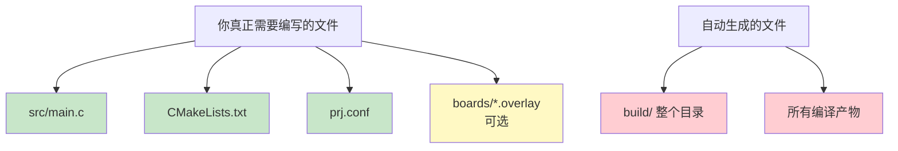
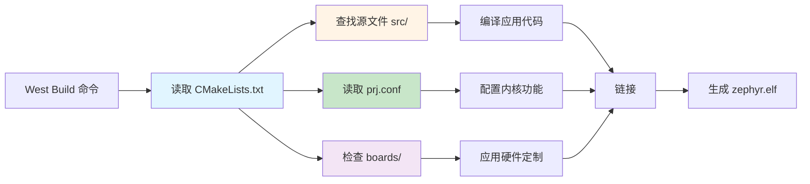
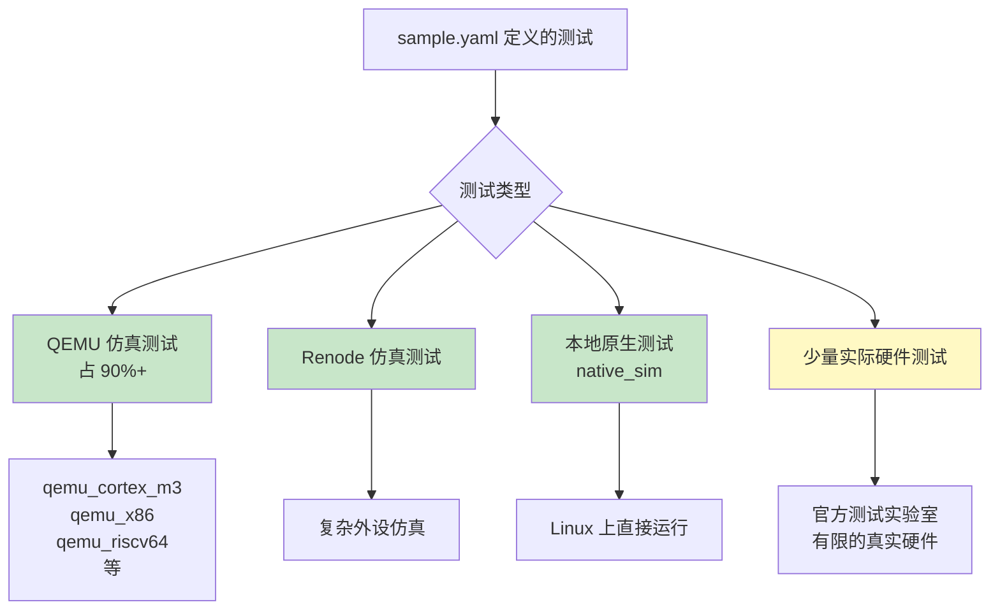

# blinky项目的架构

## 项目整体结构

### **源代码目录 (`src/`)**

- `main.c` - 应用程序的主要源代码文件，包含 LED 闪烁的核心逻辑

### **项目配置文件（根目录）**

- **`CMakeLists.txt`** - CMake 构建配置文件，定义项目名称、源文件和构建规则
- **`prj.conf`** - Zephyr 项目配置文件，用于启用/禁用内核特性和模块（使用 Kconfig）
- **`README.rst`** - 项目说明文档
- **`sample.yaml`** - 示例元数据文件，用于 Zephyr 的测试和 CI 系统

### **板级支持目录 (`boards/`)**

- **`esp32_devkitc_esp32_procpu.overlay`** - 设备树覆盖文件（Device Tree Overlay）
  - 用于自定义特定开发板的硬件配置
  - 可以修改 GPIO、外设等设置而不改动 Zephyr 主代码
  - **官方示例的 boards/ 目录只在该示例构建对应板子时生效。普通应用建议直接将 overlay 放在项目根目录。**

### **构建输出目录 (`build/`)**

这是 West 构建系统生成的目录，包含：

#### 构建配置文件：

- **`CMakeCache.txt`** - CMake 缓存
- **`build.ninja`** - Ninja 构建文件
- **`compile_commands.json`** - 编译命令数据库（用于 IDE 和代码分析工具）

#### Zephyr 相关文件：

- **`Kconfig/`** - 生成的 Kconfig 配置
- **`zephyr/`** - Zephyr 内核构建输出（包含最终的 .elf、.bin 等固件文件）
- **`zephyr_modules.txt`** - 使用的 Zephyr 模块列表
- **`zephyr_settings.txt`** - 构建时的设置快照

#### 应用构建：

- **`app/`** - 应用程序编译的对象文件
- **`modules/`** - 外部模块的构建输出
- **`CMakeFiles/`** - CMake 内部使用的文件

#### 其他：

- **`build_info.yml`** - 构建信息元数据
- **`.ninja_log` / `.ninja_deps`** - Ninja 构建系统的日志和依赖信息

#### 多核支持：

- **`procpu/`** - ESP32 的 Protocol CPU（主核心）构建
- **`appcpu/`** - ESP32 的 Application CPU（从核心）构建目录

## 关键要点

- **源码与构建分离**：源代码在根目录和 `src/`，构建产物在 `build/`
- **配置驱动**：通过 `prj.conf` 和 `.overlay` 文件配置，而非硬编码
- **West 工具链**：使用 West 命令管理构建、烧录等操作
- **CMake + Ninja**：底层使用 CMake 生成 Ninja 构建文件来加速编译

这种架构使得 Zephyr 项目具有良好的可移植性和可配置性，同一份代码可以通过不同的配置支持多种硬件平台。

## 实际需要手动编写的文件



## 最小化的 blinky 项目

实际上，一个最简单的 blinky 项目只需要：

### **src/main.c** (必需)

```c
/*
 * Copyright (c) 2016 Intel Corporation
 *
 * SPDX-License-Identifier: Apache-2.0
 */

#include <stdio.h>
#include <zephyr/kernel.h>
#include <zephyr/drivers/gpio.h>

/* 1000 msec = 1 sec */
#define SLEEP_TIME_MS   1000

/* The devicetree node identifier for the "led0" alias. */
#define LED0_NODE DT_ALIAS(led0)

/*
 * A build error on this line means your board is unsupported.
 * See the sample documentation for information on how to fix this.
 */
static const struct gpio_dt_spec led = GPIO_DT_SPEC_GET(LED0_NODE, gpios);

int main(void)
{
	int ret;
	bool led_state = true;

	if (!gpio_is_ready_dt(&led)) {
		return 0;
	}

	ret = gpio_pin_configure_dt(&led, GPIO_OUTPUT_ACTIVE);
	if (ret < 0) {
		return 0;
	}

	while (1) {
		ret = gpio_pin_toggle_dt(&led);
		if (ret < 0) {
			return 0;
		}

		led_state = !led_state;
		printf("LED state: %s\n", led_state ? "ON" : "OFF");
		k_msleep(SLEEP_TIME_MS);
	}
	return 0;
}

```

### **CMakeLists.txt** (必需，格式基本固定)

```cmake
# SPDX-License-Identifier: Apache-2.0

cmake_minimum_required(VERSION 3.20.0)
find_package(Zephyr REQUIRED HINTS $ENV{ZEPHYR_BASE})
project(blinky)

target_sources(app PRIVATE src/main.c)
```

**写法说明：前三行是固定模板，只需修改 `project()` 和 `target_sources()`**

### **prj.conf** (必需，但可能为空或很简单)

```ini
CONFIG_GPIO=y
# 就这一行！甚至可能不需要，因为 GPIO 默认启用
```

### **boards/\*.overlay** (可选，很多时候不需要)

只有在需要修改硬件配置时才需要

### **build/ 目录的真相**

- **不是你写的**
- **不需要提交到 Git**
- **完全由 `west build` 命令自动生成**
- **可以随时删除并重新生成**

## 最小项目文件作用详解



```
blinky/
├── CMakeLists.txt
├── prj.conf
├── src/
│   └── main.c
└── boards/
    └── esp32_devkitc_esp32_procpu.overlay
```

该结构体现了 **应用逻辑、构建描述、配置、硬件描述** 四个维度的清晰分离。

### `src/` —— 应用功能实现

- 用于存放 **用户应用层代码**
- 不包含硬件寄存器细节
- 通过 Zephyr API（如 GPIO、Kernel API）访问硬件

```c
#define LED0_NODE DT_ALIAS(led0)
static const struct gpio_dt_spec led = GPIO_DT_SPEC_GET(LED0_NODE, gpios);
```

含义说明：

- **应用代码不直接写 GPIO 号**
- 通过 `DT_ALIAS(led0)` 从设备树中获取硬件信息
- 实现了：
  - 应用代码与具体板级硬件的解耦
  - 同一应用可跨板复用，仅需改 overlay
  - 通过各板级的设备树DTS文件或者overlay文件补充或者覆盖！

### `prj.conf` —— 内核与驱动配置

```ini
CONFIG_GPIO=y
```

作用：

- 启用 GPIO 子系统
- 决定：
  - 哪些驱动会被编译
  - 哪些内核功能会被启用
- 是 **Kconfig 机制在应用层的入口**

特点：

- **不描述硬件连接**
- 只描述“是否需要某种能力”

### `CMakeLists.txt` —— 应用级构建描述

```cmake
cmake_minimum_required(VERSION 3.20.0)
find_package(Zephyr REQUIRED HINTS $ENV{ZEPHYR_BASE})
project(blinky)

target_sources(app PRIVATE src/main.c)
```

核心职责：

1. **声明 CMake 版本要求**
2. **定位 Zephyr 源码**
3. **定义应用工程名**
4. **指定应用入口源文件**

说明：

- Zephyr 的构建系统是 **“Zephyr 主导，应用挂载”**
- `app` 是 Zephyr 预定义的应用目标
- 不需要手动指定编译器、链接脚本等

### `boards/<board>.overlay` —— 板级硬件补充描述（重点）

```
boards/esp32_devkitc_esp32_procpu.overlay
```

文件名 **必须与 west build 指定的 board 完全一致**

构建时会自动合并到官方 DTS

```dts
/ {
    aliases {
        led0 = &myled0;
    };

    leds {
        compatible = "gpio-leds";

        myled0: led_0 {
            gpios = <&gpio0 2 GPIO_ACTIVE_HIGH>;
            label = "User LED";
        };
    };
};
```

作用分解说明：

##### 1）补充硬件节点

- 官方 DTS 中没有定义该 LED
- 通过 overlay 添加一个 `gpio-leds` 设备节点

**2）创建 alias**

```dts
aliases {
    led0 = &myled0;
};
```

- 为应用提供 **稳定的逻辑名称**

- 应用中使用 `DT_ALIAS(led0)` 获取

- 板级变更 → 只改 overlay，不改 C 代码

##### 3）实现“硬件描述而非驱动代码”

- GPIO 号、极性、控制器来源 → 属于 **设备树**
- 行为逻辑（闪烁、延时）→ 属于 **应用代码**

#### 位置

普通应用（99% 情况）

**overlay 文件必须放在应用根目录**

- 这是 **Zephyr CMake 自动发现机制唯一保证生效的位置**
- 与 SoC、架构、官方 board 完全兼容
- 不依赖 sample 特权逻辑

##### Zephyr 中 overlay 的“三种完全不同语义空间”

Zephyr **不是只有一种 overlay**。问题之所以混乱，是因为 **三种不同用途共用“.overlay”后缀**。

**Application Overlay（你现在用的）**

用途

- 为“某一个应用”定制硬件
- 不修改官方 board
- **优先级最高**

特点

- Zephyr **自动加载**
- 不需要 CMake 任何配置
- **不扫描子目录**

**Sample Overlay（官方示例的“特权行为”）**

典型结构

```
samples/basic/blinky/
├── CMakeLists.txt
├── prj.conf
├── boards/
│   ├── nrf52dk_nrf52832.overlay
│   ├── stm32f4_disco.overlay
│   └── esp32_devkitc.overlay
```

为什么这里能生效？

这是 **sample 框架额外加的能力**，**不是 Zephyr 的通用规则**。

重要结论

> sample 自带的 `boards/<board>.overlay`，
>  只在构建该 board 时生效；
>  换板之后，你自己的 overlay 必须回到 sample 根目录。

**Out-of-tree Board Overlay（自定义板）**

这是**最容易和你现在情况混淆的一类**。

目录结构（合法 board 定义）

```
app/
└── boards/
    └── xtensa/
        └── espressif/
            └── my_custom_board/
                ├── my_custom_board.dts
                ├── my_custom_board_defconfig
                └── board.cmake
```

这里的 `.overlay` 是什么？

- **不是 application overlay**
- 是 **board 级 overlay**
- 作用于 **board.dts 本身**

什么时候会用？

- 你在 **定义一块新板**
- 或 **维护私有板级支持包**

> ⚠️ 这个 `boards/` 与 sample 的 `boards/` **语义完全不同**


### 关键设计思想总结

| 层级               | 内容           |
| ------------------ | -------------- |
| `src/`             | 做什么（逻辑） |
| `prj.conf`         | 需要什么能力   |
| `boards/*.overlay` | 硬件是什么     |

### overlay 的核心价值

- 不修改 Zephyr 官方 DTS
- 支持：
  - 原型板
  - 客户定制硬件
  - 扩展外设
- 是 Zephyr 中 **硬件定制的标准方式**

### prj.conf有哪一些功能可以使用？

在 Zephyr 中，**`prj.conf` 能配置哪些功能，本质上取决于 Kconfig 系统**。

#### `prj.conf` 的本质

`prj.conf` 不是自由格式文本，而是 **Kconfig 配置输入文件**：

- 每一行 `CONFIG_xxx=y` 都必须：
  - 在 Zephyr 的 Kconfig 树中真实存在
  - 且在当前 **架构 + SoC + Board** 条件下可用
- 否则会：
  - 被静默忽略（不可选）
  - 或在构建时报 warning / error

#### 官方、权威的三种查询途径（强烈推荐）

`menuconfig`（最直观、最权威）

```bash
west build -t menuconfig
```

这是 **了解 prj.conf 可用功能的首选方式**。

##### 特点

- 实时基于：
  - 当前 board
  - 当前 SoC
  - 当前 overlay
- 显示：
  - 所有可配置项
  - 依赖关系
  - 默认值
  - 帮助说明（Help）

##### 操作要点

- `/`：搜索配置项
- `?`：查看当前选中项的详细说明
- `Y / N / M`：启用、关闭、模块化（如支持）

##### 典型用途

- 想知道 **GPIO 相关还能配置什么**
- 想确认 **某个 CONFIG 为什么选不上**
- 初学或排查配置问题时必用

#### 使用vscode插件查看

你必须**已经成功构建过一次工程**。

点击对应构建的齿轮会显示menuconfig

##### menuconfig 的基本操作逻辑（非常重要）

这是一个**纯键盘界面程序**，没有鼠标操作。

| 按键      | 作用       |
| --------- | ---------- |
| ↑ ↓       | 上下移动   |
| → / Enter | 进入子菜单 |
| ← / ESC   | 返回上一级 |

在带 `[ ]` 或 `[*]` 的选项上：

| 按键  | 作用           |
| ----- | -------------- |
| Space | 打开 / 关闭    |
| Enter | 有子菜单时进入 |

`/` —— 搜索配置项（最重要）

这是**使用 menuconfig 的核心能力**。

操作方法

1. 按 `/`
2. 输入关键词（如：`GPIO`、`LOG`、`SPI`）
3. 回车

`?` —— 查看配置说明（必须用）

在任意 CONFIG 项上按 `?`，可以看到：

- 这个配置做什么
- 默认值
- 依赖条件
- 被哪些配置 select

**是否该写进 `prj.conf`，主要靠这里判断。**

`C` —— 显示 CONFIG 名称（强烈推荐）

如果没开：

- 按 `C`

`A` —— 显示所有选项（调试用）

- 显示被依赖“隐藏”的配置
- 多用于排查“为什么选不上”

**不建议初学者长期打开**

**如何正确“修改并保存”配置**

- 修改选项（Space / Enter）

- 按 `S`（Save）

- 再按 `Q` 退出

> ⚠️ 如果你直接 `Q` 退出而不保存，**修改会丢失**

### overlay 与 dts 的合并顺序

- overlay 永远在 board.dts 之后生效，
-  既可覆盖已有定义，也可补充缺失节点。

## 需要贡献代码时才需要的两个文件

### **README.rst**

**需要的场景：**

1. **提交到 Zephyr 官方仓库**
   - Zephyr 文档系统使用 reStructuredText (`.rst`)
   - 会自动集成到官方文档网站
   - 必须遵循官方文档格式规范

2. **开源项目**

   - 让别人理解你的项目

   - GitHub/GitLab 展示

**不需要的场景：**

- 个人学习项目
- 公司内部闭源项目（可以用 `.md` 代替）
- 快速原型验证

### sample.yaml

**需要的场景：**

**1. 贡献到 Zephyr 官方仓库**

```yaml
# Zephyr CI 系统会读取这个文件
sample:
  name: Blinky Sample
  description: Blink an LED
tests:
  sample.basic.blinky:
    tags: LED gpio
    harness: led  # 使用 LED 测试框架
    platform_allow:  # 指定测试板子
      - esp32_devkitc/esp32/procpu
      - nrf52840dk/nrf52840
      - stm32f4_disco
```

**Zephyr CI 会：**
- 自动在 500+ 板子上编译测试
- 验证功能是否正常
- 确保新代码不破坏现有功能

**2. 你自己建立了自动化测试系统**
- 公司有多款硬件产品
- 需要定期回归测试
- 模仿 Zephyr 的测试框架
~~~

**不需要的场景：**

- 个人项目（手动测试即可）
- 单一硬件目标
- 不需要自动化测试

#### Zephyr 官方贡献要求

当你想贡献代码到 `zephyrproject-rtos/zephyr` 时：

**必须提供：**

```
samples/your_category/your_sample/
├── src/
│   └── main.c
├── CMakeLists.txt
├── prj.conf
├── README.rst          ← ✅ 必须！官方文档格式
├── sample.yaml         ← ✅ 必须！CI/CD 测试
└── boards/             ← 可选，但推荐
    ├── board1.overlay
    └── board2.conf
```

### Zephyr CI/CD 测试策略



---

## CMakeLists.txt 详细编写指南

### 基本模板（90% 的项目都是这样）

```cmake
# SPDX-License-Identifier: Apache-2.0

cmake_minimum_required(VERSION 3.20.0)
find_package(Zephyr REQUIRED HINTS $ENV{ZEPHYR_BASE})
project(my_project_name)

target_sources(app PRIVATE src/main.c)
```

### 逐行解释

| 行 | 代码 | 说明 | 是否固定 |
|----|------|------|---------|
| 1 | `cmake_minimum_required(VERSION 3.20.0)` | CMake 最低版本要求 | ✅ 固定 |
| 2 | `find_package(Zephyr REQUIRED HINTS $ENV{ZEPHYR_BASE})` | 加载 Zephyr 构建系统 | ✅ 固定 |
| 3 | `project(my_project_name)` | 定义项目名称 | ⚠️ 改名称 |
| 4 | `target_sources(app PRIVATE src/main.c)` | 指定源文件 | ⚠️ 改文件 |

**核心理解：**
- `app` 是 Zephyr 预定义的目标，**不能改名**
- `PRIVATE` 表示这些源文件只属于本项目
- 只需要列出 `.c` 文件，头文件会自动处理

### 多个源文件的写法

**方式一：逐个列出（推荐，清晰明确）**

```cmake
target_sources(app PRIVATE
    src/main.c
    src/sensor.c
    src/display.c
    src/network.c
)
```

**方式二：使用通配符（适合大量文件）**

```cmake
FILE(GLOB app_sources src/*.c)
target_sources(app PRIVATE ${app_sources})
```

**方式三：递归扫描子目录**

```cmake
FILE(GLOB_RECURSE app_sources src/*.c)
target_sources(app PRIVATE ${app_sources})
```

### 条件编译（根据 Kconfig 选择性编译）

```cmake
# 基础源文件
target_sources(app PRIVATE src/main.c)

# 只有启用 CONFIG_NET_UDP 时才编译 udp.c
target_sources_ifdef(CONFIG_NET_UDP app PRIVATE src/udp.c)

# 只有启用 CONFIG_NET_TCP 时才编译 tcp.c
target_sources_ifdef(CONFIG_NET_TCP app PRIVATE src/tcp.c)

# 只有启用蓝牙时才编译 ble.c
target_sources_ifdef(CONFIG_BT app PRIVATE src/ble.c)
```

### 添加头文件搜索路径

```cmake
# 添加 include 目录
target_include_directories(app PRIVATE include)

# 添加多个目录
target_include_directories(app PRIVATE
    include
    include/drivers
    third_party/lib/include
)
```

### 添加编译宏定义

```cmake
# 添加宏定义
target_compile_definitions(app PRIVATE
    MY_APP_VERSION=1
    DEBUG_ENABLED
)
```

### 链接外部库

```cmake
# 链接 Zephyr 内置库
target_link_libraries(app PRIVATE subsys__net__lib__sockets)

# 使用 Zephyr 提供的库链接宏
zephyr_library_link_libraries(app my_library)
```

### 完整的中等复杂度示例

```cmake
# SPDX-License-Identifier: Apache-2.0

cmake_minimum_required(VERSION 3.20.0)
find_package(Zephyr REQUIRED HINTS $ENV{ZEPHYR_BASE})
project(my_iot_device)

# 主要源文件
target_sources(app PRIVATE
    src/main.c
    src/app_init.c
)

# 条件编译：网络功能
target_sources_ifdef(CONFIG_NETWORKING app PRIVATE
    src/net/wifi_manager.c
    src/net/mqtt_client.c
)

# 条件编译：蓝牙功能
target_sources_ifdef(CONFIG_BT app PRIVATE
    src/ble/ble_service.c
)

# 添加头文件路径
target_include_directories(app PRIVATE
    include
)
```

### 去哪里找参考？

1. **官方示例** - 最佳参考来源
   ```
   zephyr/samples/basic/          # 简单示例
   zephyr/samples/bluetooth/      # 蓝牙示例
   zephyr/samples/net/            # 网络示例
   zephyr/samples/drivers/        # 驱动示例
   ```

2. **复杂度参考**
   | 项目类型 | 参考示例 |
   |---------|---------|
   | GPIO/LED | `samples/basic/blinky` |
   | 传感器 | `samples/sensor/*` |
   | 蓝牙 BLE | `samples/bluetooth/peripheral_hr` |
   | WiFi/网络 | `samples/net/sockets/echo_server` |
   | 文件系统 | `samples/subsys/fs/*` |

---

## prj.conf 详细编写指南

### 基本格式

```ini
# 这是注释
CONFIG_GPIO=y          # 启用 GPIO
CONFIG_GPIO=n          # 禁用 GPIO（通常不写，默认就是 n）
CONFIG_LOG_BUFFER_SIZE=2048    # 设置数值
CONFIG_BT_DEVICE_NAME="My Device"  # 设置字符串
```

### 常见配置分类速查

#### 基础外设

```ini
# GPIO
CONFIG_GPIO=y

# 串口/UART
CONFIG_SERIAL=y
CONFIG_UART_INTERRUPT_DRIVEN=y

# I2C
CONFIG_I2C=y

# SPI
CONFIG_SPI=y

# PWM
CONFIG_PWM=y

# ADC
CONFIG_ADC=y
```

#### 日志系统

```ini
CONFIG_LOG=y                    # 启用日志
CONFIG_LOG_MODE_DEFERRED=y      # 延迟模式（推荐）
CONFIG_LOG_BUFFER_SIZE=2048     # 日志缓冲区大小
CONFIG_LOG_PRINTK=y             # printk 也走日志系统
```

#### 蓝牙

```ini
CONFIG_BT=y                     # 启用蓝牙
CONFIG_BT_PERIPHERAL=y          # 外设角色
CONFIG_BT_CENTRAL=y             # 中心角色
CONFIG_BT_DEVICE_NAME="My BLE"  # 设备名称
```

#### 网络

```ini
CONFIG_NETWORKING=y             # 启用网络
CONFIG_NET_IPV4=y               # IPv4
CONFIG_NET_IPV6=y               # IPv6
CONFIG_NET_TCP=y                # TCP
CONFIG_NET_UDP=y                # UDP
CONFIG_NET_SOCKETS=y            # BSD Socket API
```

#### 调试相关

```ini
CONFIG_DEBUG=y                  # 调试模式
CONFIG_ASSERT=y                 # 启用断言
CONFIG_SHELL=y                  # 启用 Shell
CONFIG_THREAD_MONITOR=y         # 线程监控
CONFIG_THREAD_NAME=y            # 线程命名
```

#### 内存配置

```ini
CONFIG_MAIN_STACK_SIZE=2048     # 主线程栈大小
CONFIG_SYSTEM_WORKQUEUE_STACK_SIZE=1024
CONFIG_HEAP_MEM_POOL_SIZE=4096  # 堆大小
```

### 如何查找可用的 CONFIG 选项？

#### 方法一：menuconfig（最推荐 ⭐⭐⭐）

```bash
# 先构建一次（生成配置）
west build -b esp32_devkitc/esp32/procpu .

# 打开图形化配置界面
west build -t menuconfig
```

**操作技巧：**
| 按键 | 功能 |
|------|------|
| `/` | **搜索配置项**（最常用！） |
| `?` | 查看当前项的详细说明 |
| `C` | 显示 CONFIG_xxx 名称 |
| `Space` | 启用/禁用选项 |
| `S` | 保存配置 |
| `Q` | 退出 |

**搜索示例：**
- 按 `/`，输入 `GPIO`，回车 → 看到所有 GPIO 相关配置
- 按 `/`，输入 `LOG`，回车 → 看到所有日志相关配置

#### 方法二：查看官方文档

访问 [Zephyr Kconfig 搜索页面](https://docs.zephyrproject.org/latest/kconfig.html)

可以在线搜索所有 CONFIG 选项，包含：
- 选项说明
- 默认值
- 依赖关系
- 所在文件

#### 方法三：直接看 Kconfig 文件

Kconfig 文件位置规律：
```
zephyr/
├── Kconfig.zephyr           # 顶层配置
├── drivers/
│   ├── gpio/Kconfig         # GPIO 驱动配置
│   ├── i2c/Kconfig          # I2C 驱动配置
│   ├── spi/Kconfig          # SPI 驱动配置
│   └── ...
├── subsys/
│   ├── bluetooth/Kconfig    # 蓝牙配置
│   ├── net/Kconfig          # 网络配置
│   ├── logging/Kconfig      # 日志配置
│   └── ...
└── kernel/Kconfig           # 内核配置
```

**示例：查看 GPIO 相关配置**

打开 `zephyr/drivers/gpio/Kconfig`：

```kconfig
menuconfig GPIO
    bool "General-Purpose Input/Output (GPIO) drivers"
    help
      Include GPIO drivers in system config

config GPIO_SHELL
    bool "GPIO Shell"
    depends on SHELL
    help
      Enable GPIO Shell for testing.
```

这告诉我们：
- `CONFIG_GPIO=y` 启用 GPIO 驱动
- `CONFIG_GPIO_SHELL=y` 启用 GPIO Shell（需要先启用 SHELL）

#### 方法四：参考官方示例的 prj.conf

```bash
# 查看蓝牙心率示例的配置
cat zephyr/samples/bluetooth/peripheral_hr/prj.conf

# 查看网络示例的配置
cat zephyr/samples/net/sockets/echo_server/prj.conf
```

#### 方法五：查看构建后的 .config 文件

```bash
# 构建后查看最终生效的所有配置
cat build/zephyr/.config

# 搜索特定配置
grep "GPIO" build/zephyr/.config
```

### 常见问题：CONFIG 不生效？

**原因1：依赖项未满足**

```ini
# 错误：CONFIG_GPIO_SHELL 需要先启用 SHELL
CONFIG_GPIO_SHELL=y

# 正确：
CONFIG_SHELL=y
CONFIG_GPIO_SHELL=y
```

用 menuconfig 按 `?` 查看依赖关系。

**原因2：板级已经定义了默认值**

有些配置在 `boards/<board>/<board>_defconfig` 中已设置，你的 prj.conf 会覆盖它。

**原因3：拼写错误**

CONFIG 名称必须精确匹配，建议从 menuconfig 复制。

### prj.conf 常用配置模板

#### 最小 GPIO 项目

```ini
CONFIG_GPIO=y
```

#### 带日志的 GPIO 项目

```ini
CONFIG_GPIO=y
CONFIG_LOG=y
CONFIG_LOG_MODE_DEFERRED=y
```

#### I2C 传感器项目

```ini
CONFIG_GPIO=y
CONFIG_I2C=y
CONFIG_SENSOR=y
CONFIG_LOG=y
```

#### BLE 外设项目

```ini
CONFIG_BT=y
CONFIG_BT_PERIPHERAL=y
CONFIG_BT_DEVICE_NAME="My BLE Device"
CONFIG_LOG=y
```

#### WiFi + MQTT 项目

```ini
CONFIG_WIFI=y
CONFIG_NETWORKING=y
CONFIG_NET_IPV4=y
CONFIG_NET_TCP=y
CONFIG_NET_SOCKETS=y
CONFIG_MQTT_LIB=y
CONFIG_LOG=y
```

---

## 项目文件总结

### 必须手写的文件

| 文件 | 复杂度 | 写法 |
|------|--------|------|
| `src/main.c` | 取决于功能 | 自由编写，调用 Zephyr API |
| `CMakeLists.txt` | 简单 | **前三行固定**，只改项目名和源文件 |
| `prj.conf` | 简单 | 从 menuconfig 或示例复制，按需启用 |
| `*.overlay` | 中等 | 参考 `zephyr_overlay_guide.md` |

### 查找参考的位置

| 内容 | 参考位置 |
|------|---------|
| CMakeLists.txt 写法 | `zephyr/samples/*/CMakeLists.txt` |
| prj.conf 配置项 | menuconfig 或 `zephyr/**/Kconfig` |
| Overlay 写法 | `zephyr/boards/*/` 或 `zephyr_overlay_guide.md` |
| API 用法 | `zephyr/include/zephyr/` 或官方文档 |

