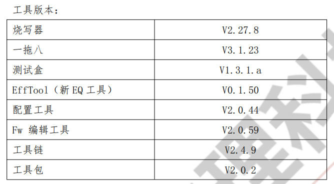
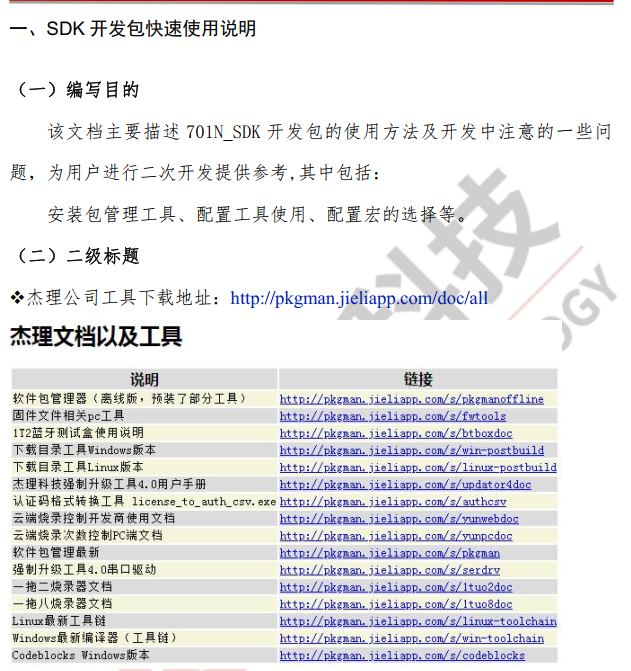
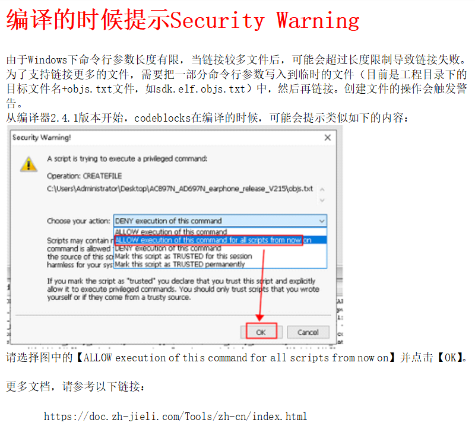
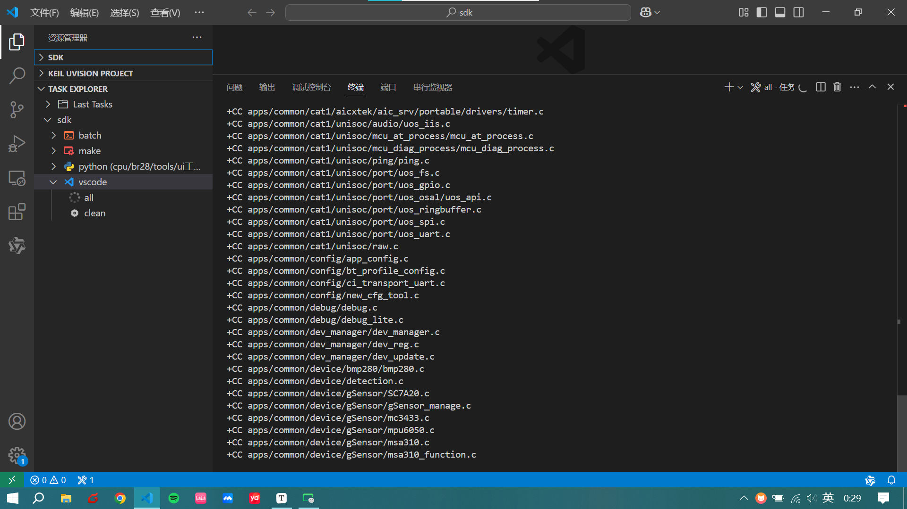
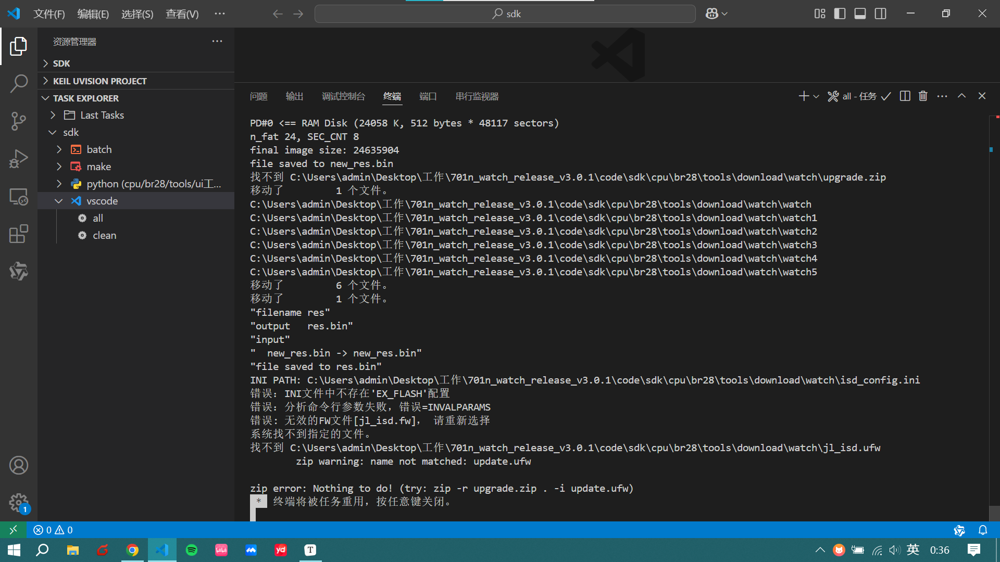

# 4.15日学习报告

## 编码规范的简单阅读

**记录之前很少使用的或者有疑问的点。**

### 版权和版本声明

出现在各头文件和源文件的顶部，可以利用VScode的模板或者注释插件实现。形式是固定的，可以先生成再修改。

### 在C++中使用C的形式

格式：

```c++
#ifdef __cplusplus
extern "C" {
    // C 语言风格的函数和变量声明
}
#endif
```

### 类的public与private的段次序问题

- 好的例子是 public 段在前，private 段在后
- 不好的例子，private 段在前，public 段在后

从封装的角度来看，`private` 和 `protected` 成员主要和类的内部实现以及继承体系有关，对于类的使用者来说是不可见的。将 `public` 成员放在前面，确实可以提高代码的可读性，使类的使用者能够更快地了解类的接口和功能。

### 断言

在文档中，断言（Assertion）是一种用于在代码中检查特定条件是否成立的机制。

- 断言用于确保程序的状态在某个特定点上符合预期。如果条件为真，则程序继续执行。如果条件为假，则断言会触发，通常会导致程序中止或报告错误。

- 在C/C++中，断言通常通过`assert`宏来实现。

- 文档中也给出了自定义的断言的实现方法，通过`DHFASSERT_FAILED`宏来实现。

**断言的主要作用是：**

- **尽早发现错误：** 断言可以在开发阶段帮助开发者快速发现代码中的错误，从而减少调试时间和精力。
- **提高代码的可靠性：** 通过在代码中加入断言，可以确保程序在运行时不会出现一些不应该出现的状态，提高代码的可靠性。
- **辅助调试：** 当断言触发时，通常会提供一些错误信息，帮助开发者定位问题。

**文档中强调，**

- 断言应该用于检查那些“一定要保证条件成立”的地方。
- 不应该用断言来处理那些可能发生的情况，而应该使用错误处理机制。 

总而言之，断言是一种在代码中加入检查点的机制，用于确保程序的状态符合预期，帮助开发者尽早发现和解决问题，提高代码的可靠性。

#### 断言的实现方法

文档中给出了一个自定义的断言的实现方法，通过宏来实现。

```c++
#ifdef  _DEBUG
    #ifdef _WIN32
        #define DECLARE_THIS_FILE_NAME
        #define DHFASSERT_FAILED(exp) (!(exp)?(_CrtDbgBreak(), 1) : 0)
    #else
        #define DECLARE_THIS_FILE_NAME static char s_szThisFileName[] = __FILE__;
        #define DHFASSERT_FAILED (exp) (!(exp)? (USPPrint(ERROR_LEVEL, "Assert(%d): %s\r\n",  __LINE__, s_szThisFileName), 1) : 0) 
    #endif
#else
    #define DECLARE_THIS_FILE_NAME 
    #define DHFASSERT_FAILED (exp) (!(exp))
#endif
```

这段代码定义了`DHFASSERT_FAILED`宏，用于实现断言。在调试模式下，这个宏会检查条件`exp`是否为真，如果为假，则会触发断言失败的处理。

**`#ifdef _DEBUG`**: 这是一个预处理指令，用于判断是否定义了`_DEBUG`宏。`_DEBUG`宏通常在编译器的调试模式下定义，因此这段代码的作用是：**仅在调试模式下，断言功能才有效**。在发布版本中，断言会被禁用，以避免影响程序性能。

**`#ifdef _WIN32`**: 这是一个预处理指令，用于判断是否为Windows平台。

- **`#define DECLARE_THIS_FILE_NAME`**: 这是一个空的宏定义，在Windows平台下，这个宏没有实际作用。
- `#define DHFASSERT_FAILED(exp) (!(exp)? (_CrtDbgBreak(), 1) : 0)`: 这是`DHFASSERT_FAILED`宏的定义。
  - **带参的宏，替换为三目运算符表达式**
    - **这个宏的逻辑是：**
      1. **`!(exp)`**: 首先，对传入的表达式 `exp` 取反。
      2. `?:` (三目运算符): 然后，使用三目运算符进行判断。
         - 如果 `!(exp)` 的结果为真（即 `exp` 为假，表示断言条件不成立），则执行 `_CrtDbgBreak(), 1`。`_CrtDbgBreak()` 会触发调试器中断，使程序暂停，方便开发者调试。
         - 如果 `!(exp)` 的结果为假（即 `exp` 为真，表示断言条件成立），则执行 `0`，即什么也不做。
    - 检查那些“一定要保证条件成立”的地方。
      - 把必定要成立的条件放入，假设条件不成立，就会触发断言
      - 如果条件成立的话，就不会触发。
  - `DHFASSERT_FAILED(exp)`: 这个宏接受一个表达式`exp`作为参数，`exp`就是需要判断的条件。
  - `(!(exp))`: 这个表达式的作用是对`exp`取反。如果`exp`为真（即条件成立），则`(!(exp))`为假；如果`exp`为假（即条件不成立），则`(!(exp))`为真。
  - `(_CrtDbgBreak(), 1)`: 这是一个逗号表达式。`_CrtDbgBreak()`是一个Windows API函数，用于触发调试器中断，使程序暂停执行，方便开发者进行调试。`1` 是这个逗号表达式的结果，但在这里它的作用并不重要。
  - `?:`: 这是一个三元条件运算符。整个宏的含义是：如果`exp`为假（即条件不成立），则执行`_CrtDbgBreak()`，否则什么也不做。

**`#else`**: 如果不是Windows平台，则执行以下代码。

- **`#define DECLARE_THIS_FILE_NAME static char s_szThisFileName[] = __FILE__;`**: 这个宏定义了一个静态字符数组`s_szThisFileName`，用于存储当前文件名。`__FILE__`是一个预定义宏，表示当前源文件的路径。
- `#define DHFASSERT_FAILED (exp) (!(exp)? (USPPrint(ERROR_LEVEL, "Assert(%d): %s\r\n", __LINE__, s_szThisFileName), 1) : 0)`: 这是`DHFASSERT_FAILED`宏的定义。
  - `USPPrint(ERROR_LEVEL, "Assert(%d): %s\r\n", __LINE__, s_szThisFileName)`: 这是一个自定义的函数，用于输出断言失败的信息。`ERROR_LEVEL`可能是表示错误级别的一个常量，`__LINE__`是一个预定义宏，表示当前代码的行号，`s_szThisFileName`是当前文件名。
  - 整个宏的含义是：如果`exp`为假（即条件不成立），则调用`USPPrint`函数输出错误信息，否则什么也不做。

**`#else`**: 如果没有定义`_DEBUG`宏（即发布版本），则执行以下代码。

- **`#define DECLARE_THIS_FILE_NAME`**: 这是一个空的宏定义，在发布版本中，这个宏没有实际作用。
- **`#define DHFASSERT_FAILED (exp) (!(exp))`**: 这是`DHFASSERT_FAILED`宏的定义。这个宏的作用是对`exp`取反，如果`exp`为假，则返回真，否则返回假。在发布版本中，断言实际上被禁用了，因为这个宏只会返回一个布尔值，而不会执行任何实际的断言检查。

**`#endif`**: 结束条件编译。

文档中给出了一个使用断言的示例：

```c++
DECLARE_THIS_FILE_NAME
......
BOOL DHFTest_iProcess(void *pData, void *pClient)
{
	BOOL bRet;
	if (DHFASSERT_FAILED(pData)) return FALSE;
	if (DHFASSERT_FAILED(pClient))
	{
		return FALSE;
	}
	……
	bRet = DHFOther_CallSomething();
	if (DHFASSERT_FAILED(bRet)) return FALSE;	
	......
	return TRUE;
}
```

这段代码展示了如何在函数中使用`DHFASSERT_FAILED`宏来实现断言。

- **`DECLARE_THIS_FILE_NAME`**: 这行代码的作用是展开之前定义的`DECLARE_THIS_FILE_NAME`宏。在Windows平台和发布版本中，这行代码没有实际作用；**在非Windows平台的调试版本中**，这行代码会定义静态字符数组`s_szThisFileName`，用于存储当前文件名。
- **`if (DHFASSERT_FAILED(pData)) return FALSE;`**: 这行代码使用`DHFASSERT_FAILED`宏来检查指针`pData`是否为空。如果`pData`为空（即条件不成立），则`DHFASSERT_FAILED(pData)`返回真，`if`条件成立，函数返回`FALSE`。
- **`if (DHFASSERT_FAILED(pClient)) { return FALSE; }`**: 这行代码使用`DHFASSERT_FAILED`宏来检查指针`pClient`是否为空。如果`pClient`为空（即条件不成立），则`DHFASSERT_FAILED(pClient)`返回真，`if`条件成立，函数返回`FALSE`。
- **`if (DHFASSERT_FAILED(bRet)) return FALSE;`**: 这行代码使用`DHFASSERT_FAILED`宏来检查变量`bRet`是否为真。如果`bRet`为假（即条件不成立），则`DHFASSERT_FAILED(bRet)`返回真，`if`条件成立，函数返回`FALSE`。

**断言中的条件表达式是一定要成立的，比如给一个指针，那么指针一定要非空时才会，才不会触发断言，而是返回0。**

**如果是一个假的条件的话，就会触发断言，进而返回1，外部条件就成立进而返回`FALSE`。**

#### 断言使用规则

- 在实现文件的#include段之后，必须加上DECLARE_THIS_FILE_NAME

- 断言失败必须返回。

   如果函数有返回值，必须返回一个表示错误的值，比如： if (DHFASSERT_FAILED(pData)) return FALSE; 

- 为了不让代码洁简，断言的if可以写成一行。

   但如果return在下一行，则必须使用{}框住。   

- 断言只能用于一定要保证条件成立的地方。

   比如：`void DHFModule::SetClient(void *pClient){   m_pClient = pClient; }`其中如pClient允许为`NULL`，则加上`if (DHFASSERT_FAILED(pData)) return FALSE;` 就是没有必要且错误的。 

- 对指针、句柄的非空断言可以省略与NULL的比较。但是做为条件则必须写。如下所示：

  - `DHFASSERT_FAILED(pData)`
  - `if (pData == NULL)，while (pData != NULL)` 

**目前看起来似乎跟判断或者死循环卡住的效果上没有区别。**

#### 形式

`DHFASSERT`：该形式定义在dhf_assert.h模块中，凡是基于USP的应用均包含它。但不支撑if的操作，但可以用下列形式替代：

```c++
if(bFailed)
{
    DHFASSERT(bCondition);
    return FALSE;
}
```

`DHFASSERT_FAILED`：可支撑if操作，也可想`DHFASSERT`一样使用，如：`If(DHFASSERT_FAILED(bCondition)) return FALSE;DHFASSERT_FAILED(bCondition);` 

- **`DHFASSERT`** 需要配合 `if` 语句使用，稍微多了一点代码，可读性稍差。

- **`DHFASSERT_FAILED`** 可以直接在 `if` 语句中使用，或者单独使用，形式上更灵活，也更接近于我们通常使用断言的习惯，可读性更好。

### 编译要求

文档中对于编译的要求是：**要求代码编译无错误无警告，必须将警告等级设为最高**

文档中还提到，对于以下情况，允许出现警告：

- 回调函数的参数未使用   

- 两个第三方系统中的定义不一致。例如，公司定义的`dhf_typedef.h`中与nucleus操作系统的`nucleus.h`中有重定义，如都有`typedef int INT`。但是，如果两者定义不一致，如一个`typedef int BOOL`，另一个`typedef char BOOL`，则必须修正。   

- 某些地方使用`DWORD`做位段定义。  例如：

- ```c++
  typedef struct _TDATE
  {
  	DWORD m_dwYear_13         :13;
  	DWORD m_dwMonth_8         :8;
  }TDATE,*PTDATE;
  ```

在项目上，`dhf_typedef.h`中把`DWORD`权宜地定义为了`unsigned int, typedef unsigned int DWORD`。  但在Win32上编译的时候，使用的`windows.h`中的定义，`DWORD`是`unsigned long`，因此出现警告。建议使用的时候，自己自动将`DWORD`全部改为`UINT`。   

### goto语句的使用

之前认为goto会破坏程序从上到下的次序以及代码可读性。但是还是尤其应用的背景。比如跳出多层循环。既不能使用continue也不能使用break达到此效果，而goto可以达到效果。

### 无限循环的写法

文档指出，嵌入式系统中经常用到无限循环，有以下三种常见的写法：

1. `while(1) { ...... }`
2. `for(;;) { ... }`
3. `NextLoop: ... goto NextLoop;`

**文档要求使用`for(;;)`的形式，并给出了原因：**

- **`for(;;)`没有警告：** `while(1)` 在VC的最高警告等级下可能会产生警告，而 `for(;;)` 不会。
  - "VC" 通常指的是 **Microsoft Visual C++**，它是微软公司开发的一款C++编译器和集成开发环境（IDE）。
- `goto` 禁用：文档中明确指出要禁用 `goto`语句。 

因此，`for(;;)` 这种写法，既避免了编译器的警告，又符合规范中禁用 `goto` 的要求，所以被推荐使用。

### 分配0字节的案例

```c++
BYTE *pMyBuf = NULL;

pMyBuf = new BYTE[0];
if (pMyBuf == NULL)
{
 puts("error");
}
else
{
 puts("ok");
}
```

这个案例主要讨论了使用 `new` 运算符分配 0 字节内存时的行为。

- **`new BYTE[0]`**: 这一行代码尝试使用 `new` 运算符分配一个包含 0 个 `BYTE` 类型的数组。
- **`if (pMyBuf == NULL)`**: 接下来，代码检查 `new` 运算符的返回值 `pMyBuf` 是否为 `NULL`。

**结论：**

文档中指出，**分配 0 字节内存是合法的**，无论是使用 `new` 还是 `malloc`。在这种情况下，系统可能会分配 1 个字节。因此，上述代码会输出 "ok"。   

**跟Java好像啊，new对象。。。**

## 重装系统后的一些问题

由于电脑过于卡顿，领导建议重装一下。安装了公司文档中开发所需要的软件和驱动。

按照文档对SDK进行编译时，出现报错：

自己电脑出现报错：

```c++
[2025/4/16 00:03:06] 无法使用 compilerPath“C:/JL/pi32/bin/clang.exe”解析配置。 请改用“D:\mingw64\bin\gcc.exe”。
```

-   杰里使用clang编译器，而我本机只有GCC编译器，公司电脑则没有C编译器。

  查阅手册得知：





**还是按照官方文档来走。**

## 按照官方文档配置开发环境

根据文档中的描述，以下是快速使用701N SDK进行二次开发的步骤， Windows 11系统：

**安装开发环境**   

- 先安装Codeblocks Windows版本，然后打开并关闭一次。
- 再安装Windows最新编译器（工具链）。

**安装软件包管理工具**   

- 打开软件包管理工具，点击检查更新，可以获取杰理的软件开发工具。
- 在软件包管理工具中，选择升级选项，点击下载可以下载对应的软件开发工具。

**SDK配置**   

- 打开SDK工程目录，进入 `cbp_out\cpu\br28\tools\701N_config_tool` 目录。
- 双击打开“701N-配置工具入口.jlxproj”，打开【杰理SDK工具】。

**使用SDK工具**   

- 编辑FW文件：点击【编辑FW文件】，可以修改FW文件的板级配置、蓝牙配置、状态配置和提示音配置。 
  - 注意：
    - 板级配置的可配选项取决于cfg_tool.bin文件。 
    - fw版本号要和工具的版本号一致。 
    - 可以替换生成的fw文件，或者制作fw文件的默认值。

- 显示原理图：

  - 点击【显示原理图】，可以打开一个包含原理图等相关文件的文件夹。 

- 编译前配置：

  - 点击【编译前配置】，可以配置通用配置、蓝牙配置、提示音配置和状态配置。配置完成后，保存配置会生成cfg_tools.bin到下载目录中，重新编译sdk代码即可应用最新配置。 

- 打开下载目录：

  - 点击【打开下载目录】，可以打开tools下载目录，cfg_tools.bin会输出到该目录下。 

- 检查更新：

  - 点击【检查依赖的软件包是否更新】，可以检查相关配置工具的版本更新，并进行下载更新。 

  

  

    工具链安装成功。这个时候就可以使用VScode编译了。

  

明天去公司把公司电脑配置一下。

报错了：



