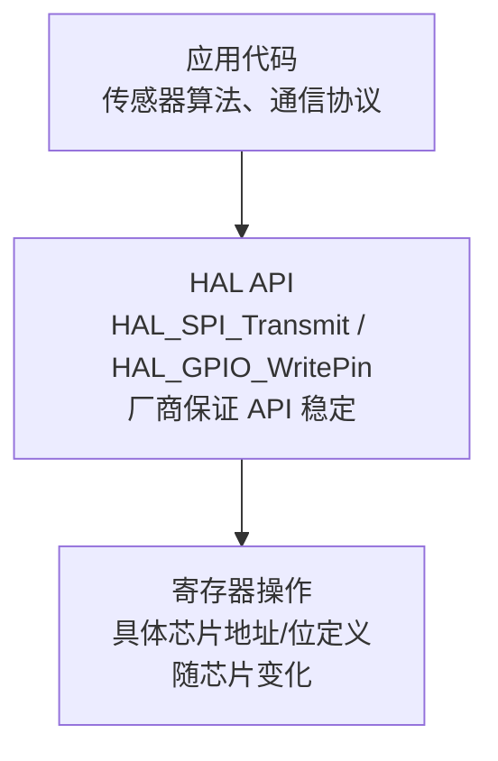
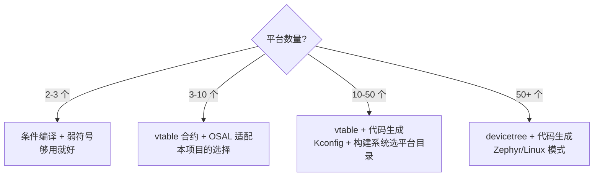
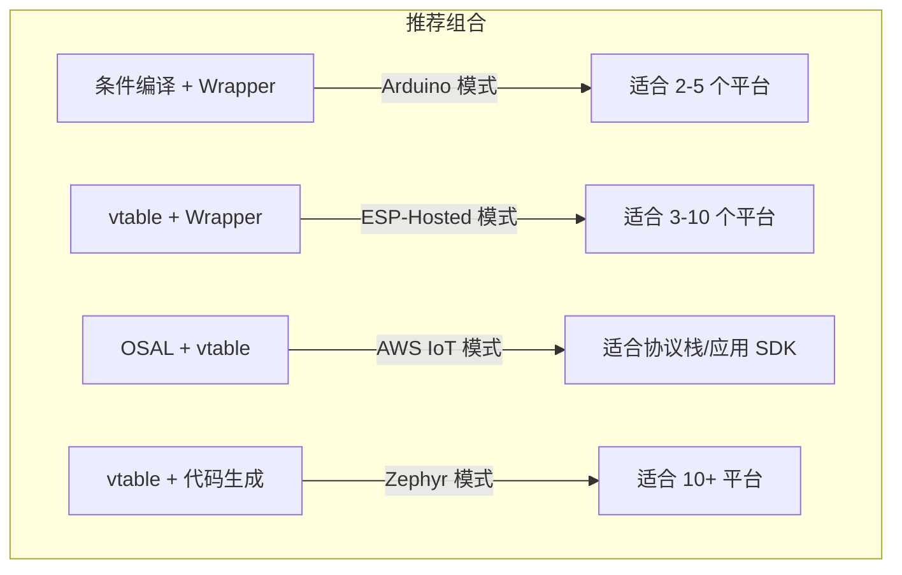
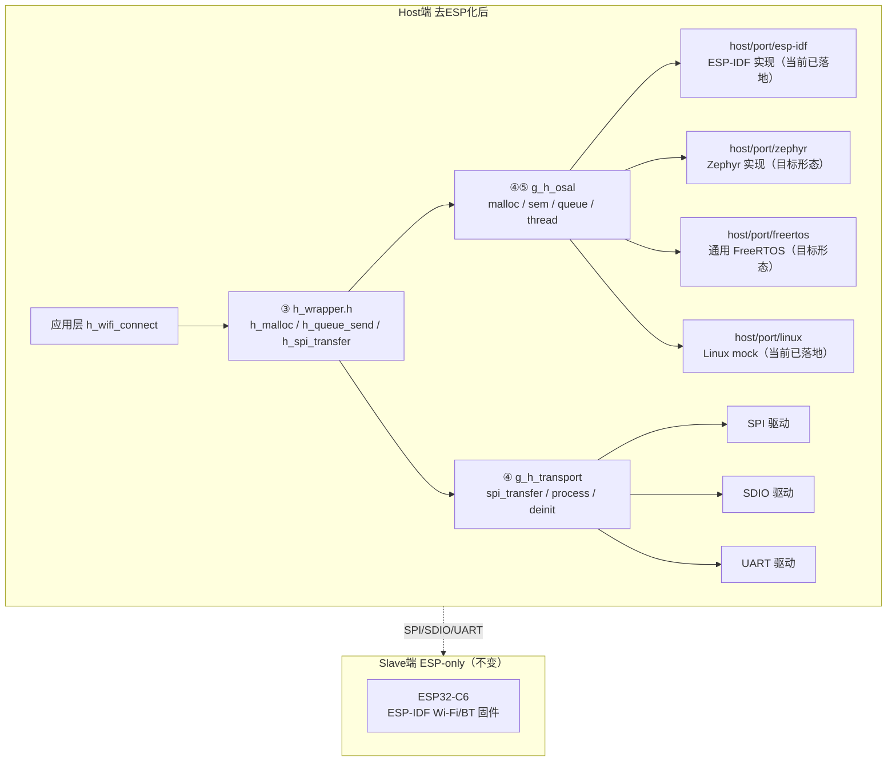

# 嵌入式跨平台设计模式

> **核心问题**：嵌入式跨平台只有一个核心矛盾——片上外设和 OS 原语没有标准，但上层业务逻辑完全一样。C 语言写出的应用不关心下面是 FreeRTOS 还是 Zephyr，是 STM32 的 SPI 还是 ESP32 的 SPI。移植层的全部价值就是**统一上层对下层的调用方式，隔离下层对上层的实现变化**。

---

## 1. 概述

### 1.1 模式全景图

嵌入式跨平台设计模式共 7 种，按复杂度从左到右排列：

```mermaid
flowchart LR
    subgraph compile["编译期（最轻）"]
        A["① 条件编译\n&#35;ifdef"]
        B["② 弱符号链接\n__weak"]
    end
    subgraph link["链接/启动期"]
        C["③ Wrapper 封装\n统一命名"]
        D["④ vtable 合约\n函数指针"]
        E["⑤ OSAL 适配\nOS 原语抽象"]
    end
    subgraph build["构建期（最重）"]
        F["⑥ HAL 分层\n厂商多层级"]
        G["⑦ 代码生成\nDTS/Kconfig"]
    end

    A --> B --> C --> D --> E --> F --> G
```



| # | 模式 | 复杂度 | 一句话 | 最佳代表作 |
|:---:|------|:---:|--------|------|
| ① | 条件编译 | ★ | `#ifdef STM32` 选代码路径 | Arduino |
| ② | 弱符号链接 | ★ | `__attribute__((weak))` 链接时覆盖 | FreeRTOS |
| ③ | Wrapper 二次封装 | ★★ | 薄封装，把平台 API 映射到统一接口 | MicroPython |
| ④ | vtable 合约 | ★★★ | 把平台差异装进函数指针结构体 | Linux VFS |
| ⑤ | OSAL 适配 | ★★★ | `h_malloc` → `pvPortMalloc` \| `k_malloc` | lwIP |
| ⑥ | HAL 分层 | ★★★★ | 硬件驱动 → HAL API → 中间件 → 应用 | STM32Cube |
| ⑦ | 代码生成 | ★★★★★ | devicetree/Kconfig → 编译出适配代码 | Zephyr |

真实项目几乎都是这 7 种模式的组合，没有纯用单一种的。

### 1.2 阅读导航

- **2-3 个平台的小项目**：重点看 ① ② ③，跳过 ⑥ ⑦
- **协议栈/中间件移植**：重点看 ④ ⑤
- **50+ 平台的大项目**：重点看 ⑦，配合 ④
- **单厂商多芯片**：重点看 ⑥

---

## 2. 模式详解

### 模式 ①：条件编译

**思想**：用预处理器宏 `#ifdef PLATFORM_X` 在不同代码块之间选择。

```c
#ifdef ESP32
    spi_bus_initialize(SPI2_HOST, &buscfg, SPI_DMA_CH_AUTO);
#elif defined(STM32F4)
    HAL_SPI_Init(&hspi1);
#else
    #error "Unsupported platform"
#endif
```

#### 最佳代表项目：Arduino

Arduino 是条件编译模式的教科书级案例。从 AVR 到 ESP32 到 ARM，每种板子都在 `#ifdef` 块里定义自己的 `pinMode`、`digitalWrite`、`analogRead` 实现。

```
Arduino核心:                               板级定义:
digitalWrite(pin, val)                    #ifdef ARDUINO_AVR_UNO
  → 板子不同，函数内容完全不同                PORTD |= (1<<PD3);
                                           #elif ARDUINO_ESP32_DEV
Arduino.h 里没有 vtable                     gpio_set_level(pin, val);
没有 OSAL                                 #elif ARDUINO_SAMD_ZERO
只靠预处理器 + 每个板子一个目录               PORT->Group[g_APinDescription[pin].ulPort].OUTSET.reg = ...
```

**为什么它是典范**：
1. 用最简单的方式解决了"一个 API，几十种板子"的问题
2. IDE 自动选中正确的 `#ifdef` 分支，用户无需理解背后的条件编译
3. 新增一个板子只需在一个地方加 `#elif` 块——虽然不算优雅，但确实简单

**其他实例**：

| 项目 | 方式 | 用途 |
|------|------|------|
| LVGL | `lv_drv_conf.h` | `#define LV_USE_TFT_ILI9341 1` |
| Mbed TLS | `mbedtls_config.h` | `MBEDTLS_AES_ROM_TABLES` 功能裁剪 |
| MicroPython | `mpconfigport.h` | 每个移植一个配置文件 |
| ESP-Hosted | `#ifdef CONFIG_ESP_HOSTED_SPI_HOST_INTERFACE` | Kconfig 选传输模式 |

**优点**：零学习成本、零运行时开销、不需要额外抽象层。

**缺点**：平台数 > 10 后代码可读性崩溃——新增一个平台需要修改分散在各处的 `#ifdef` 块。

**什么时候用 / 什么时候别用**：

| 用 | 别用 |
|----|------|
| 2-3 个平台 | 10+ 平台 |
| 一个人维护 | 多人协作 |
| 差异只在几行代码 | 整个模块都不同 |

---

### 模式 ②：弱符号链接

**思想**：提供一个默认空实现（或默认行为），平台移植时只需覆盖需要的函数，不覆盖的自动退化为默认。

```c
// 核心层，默认空实现
__attribute__((weak)) void vApplicationTickHook(void) { }

// 用户层，只覆盖自己需要的
__attribute__((weak)) void vApplicationTickHook(void) {
    // 自己实现的 tick 钩子——每当 tick 发生时被调用
    gpio_toggle(LED_PIN);
}
```

#### 最佳代表项目：FreeRTOS

FreeRTOS 用弱符号实现了"只移植你需要的那部分"。移植 FreeRTOS 到新架构，只需要实现：一个 tick 定时器中断、栈初始化、临界区进入/退出——大约 200 行汇编。其余所有 hook（`vApplicationTickHook`、`vApplicationMallocFailedHook`、`vApplicationStackOverflowHook` 等）都是弱符号，不实现就空转。

```
FreeRTOS/Source/tasks.c:
  __weak void vApplicationTickHook(void) {}
  __weak void vApplicationMallocFailedHook(void) {}

FreeRTOS/Source/portable/GCC/ARM_CM4F/port.c:
  // 只实现必须的：pxPortInitialiseStack、xPortStartScheduler、vPortSVCHandler...
  // hook 函数可选实现
```

**为什么它是典范**：
1. 200 行汇编完成一个架构移植——这是嵌入式 RTOS 移植的黄金标准
2. 弱符号让"必须实现"和"可选实现"一目了然
3. 30+ 架构支持，每个架构的移植都干净独立

**其他实例**：

| 项目 | 弱符号用途 |
|------|----------|
| STM32 HAL | `__weak void HAL_UART_MspInit(UART_HandleTypeDef *)` ——每个外设的 MSP 初始化 |
| ESP-IDF | `__attribute__((weak)) esp_err_t esp_wifi_init(const wifi_init_config_t *)` ——`esp_wifi_remote` 组件 |
| Zephyr | `__weak` 的 `soc_init` / `board_init` |
| lwIP | `__attribute__((weak))` 对 `lwip_hooks` 的默认实现 |

**优点**：链接时解析，零运行时开销。不实现的函数静默退化，不报错。移植工作量极小。

**缺点**：链接器行为不直观（非弱覆盖强、同弱选先链接的）。调试时容易困惑"到底跑了哪个版本"。

**什么时候用 / 什么时候别用**：

| 用 | 别用 |
|----|------|
| 可选回调/钩子 | 核心逻辑（弱符号错了静默失败） |
| 配合其他模式使用 | 替代 vtable（弱符号最多一层覆盖） |
| 需要"默认行为"的场景 | 需要显式报错的场景（没实现就应该编译失败） |

---

### 模式 ③：Wrapper 二次封装

**思想**：不定义新接口，直接包裹现有平台 API，提供一个统一名字。比 HAL 更薄，比 OSAL 更接近原生。通常配合 vtable 或条件编译使用。

```c
// Wrapper ——给底层不同的 SPI 实现一个统一的名字
static inline int h_spi_transfer(void *buf, size_t len) {
#ifdef ESP32
    return spi_device_transmit(spi_handle, &t);
#elif defined(STM32)
    return HAL_SPI_Transmit(&hspi1, buf, len, 100);
#endif
}

// 上层代码只看到 h_spi_transfer，不感知底层
h_spi_transfer(tx_data, 64);
```

#### 最佳代表项目：MicroPython

MicroPython 用 `mp_hal_*` 命名空间统一了所有硬件平台。每个移植（约 30 个）只需要实现约 30 个函数——`mp_hal_stdout_tx_str`、`mp_hal_pin_write`、`mp_hal_ticks_ms` 等。所有 Python 解释器核心代码只调 `mp_hal_*`，永远看不到底层平台的 API。

```
MicroPython 移植结构:
  py/                  ← 解释器核心，只调 mp_hal_*
  ports/esp32/         ← 实现 mp_hal_* → ESP-IDF
  ports/stm32/         ← 实现 mp_hal_* → STM32 HAL
  ports/nrf/           ← 实现 mp_hal_* → nRF5 SDK
  ports/unix/          ← 实现 mp_hal_* → POSIX（PC 端调试用）
  ports/rp2/           ← 实现 mp_hal_* → Pico SDK
```

**为什么它是典范**：
1. Wrapper 层极薄——30 个函数承载了整个 Python 运行时的硬件需求
2. 移植一个新 MCU = 写一个目录 + 实现 30 个函数
3. `ports/unix/` 的存在意味着全部 Python 生态可以在 PC 上先跑通——这是只有 Wrapper 模式才能做到的

**其他实例**：

| 项目 | 封装方式 | 用途 |
|------|---------|------|
| TinyUSB | `dcd_init` / `dcd_edpt_open` / `dcd_edpt_xfer` | USB 设备控制器抽象 |
| LVGL | `lv_port_disp.c` / `lv_port_indev.c` | 用户手写 2 个文件填充 flush/touch 回调 |
| nrfx (Nordic) | `nrfx_spim_xfer` | 统一封装 Nordic 全系列寄存器差异 |
| ESP-Hosted | `host/port/` → `h_transport_spi.c` | 把 `spi_device_transmit` 填进 transport vtable |

**优点**：改动量最小——不改原有 API 签名。已有大量平台代码、不想重构时最适合。

**缺点**：单独使用会退化成条件编译。最佳实践是 Wrapper 配合 vtable 一起使用——Wrapper 提供统一命名，vtable 提供运行时多态。

**什么时候用 / 什么时候别用**：

| 用 | 别用 |
|----|------|
| 已有大量平台代码，不想重构 | 从零设计（直接用 vtable 更干净） |
| 配合 vtable/OSAL 使用 | 单独使用且平台 > 5 |
| 需要一个自己的命名空间 | 底层 API 已经足够统一 |

---

### 模式 ④：vtable 合约

**思想**：定义一个函数指针结构体，不同平台填充不同的函数。上层代码永远通过结构体调用，不与具体平台 API 直接链接。

```c
// 合约定义（平台无关）
struct dma_ops {
    int (*alloc)(int channel);
    int (*start)(int channel, void *src, void *dst, size_t len);
    void (*wait)(int channel);
};

// STM32 实现
const struct dma_ops stm32_dma = {
    .alloc = stm32_dma_alloc_channel,
    .start = stm32_dma_stream_start,
    .wait  = stm32_dma_wait_transfer,
};

// ESP32 实现
const struct dma_ops esp32_dma = {
    .alloc = esp32_gdma_new_channel,
    .start = esp32_gdma_start,
    .wait  = esp32_gdma_wait_done,
};

// 上层调用——编译后只多一次指针解引用
g_dma_ops->start(ch, src, dst, len);
```

#### 最佳代表项目：Linux VFS（Virtual File System）

`struct file_operations` 是整个 Linux 内核的基石。一个结构体包含 `open/read/write/ioctl/mmap/llseek/...` 约 20 个函数指针。字符设备、块设备、网络 socket、procfs、sysfs——**全部**通过同一个 `file_operations` 接口访问。

当你 `cat /proc/cpuinfo` 和 `dd if=/dev/sda` 时，内核走的是完全相同的 `vfs_read()` 代码路径：

```c
// fs/read_write.c —— 所有 read 调用的公共入口
ssize_t __kernel_read(struct file *file, void *buf, size_t count, loff_t *pos)
{
    if (file->f_op->read)
        return file->f_op->read(file, buf, count, pos);  // ← vtable 派发
    return -EINVAL;
}
```

```
用户态:   cat /proc/cpuinfo   dd if=/dev/sda    curl http://...
              │                   │                  │
内核 VFS:  ───┴───────────────────┴──────────────────┴── vfs_read()
                                                         │
                                              file->f_op->read() ← 唯一派发点
                                                         │
实现层:      procfs_read()     blkdev_read()    sock_read()
```

**为什么它是典范**：
1. 接口设计极简——20 个指针覆盖了所有 I/O 语义
2. 30 年验证——1991 年 `struct file_operations` 定义至今，接口保持兼容
3. 规模验证——200+ 文件系统、1000+ 设备驱动都填同一张表
4. 新增文件系统 = 实现一张 `file_operations` 表 + 注册，不碰任何 VFS 核心代码

**其他实例**：

| 项目 | 结构体名 | 用途 |
|------|---------|------|
| Linux | `struct i2c_algorithm` | 所有 I2C 控制器——TI/ST/NXP/GPIO bit-bang |
| Linux | `struct usb_device_driver` | probe + disconnect 两个指针管全部 USB 设备 |
| Zephyr | `struct device.api` | 所有设备模型——GPIO/I2C/SPI/Sensor |
| FreeRTOS | `port.c` 里的函数表 | 任务切换、临界区、tick 定时器 |
| lwIP | `struct netif.output` | 网卡驱动只需填"发一个包" |
| Mbed OS | `SPI::_owner->acquire()` | C++ 虚函数风格 vtable |
| ESP-Hosted | `hosted_osi_funcs_t` | ~40 个 OS 原语从 ESP-IDF 解耦 |

**优点**：编译后仅多一次指针解引用。新增平台 = 新填一张表，不碰其他代码。可用 `NULL` 表达"不支持"。

**缺点**：函数多时填表繁琐（40+ 个指针容易漏）。所有实现必须遵守完全相同的签名约定。vtable 膨胀后多余指针造成内存浪费。

**什么时候用 / 什么时候别用**：

| 用 | 别用 |
|----|------|
| 3-50 个平台 | 2 个平台（条件编译更简单） |
| 接口稳定的子系统 | 接口频繁变化的实验代码 |
| 需要 mock 测试 | 函数指针太多 (>30) 且大部分不实现——拆成多个小 vtable |

---

### 模式 ⑤：OSAL 适配

**思想**：协议栈或中间件用它自己的 `os_*` 封装函数，不直接调用任何 RTOS API。移植时只需要实现 `os_mutex_create` / `os_queue_send` 等约 10-40 个函数。

```c
// 协议栈代码（平台无关）
os_mutex_t *mutex = os_mutex_create();
os_mutex_lock(mutex);
// critical section ...
os_mutex_unlock(mutex);

// 移植到 FreeRTOS
os_mutex_t *os_mutex_create(void) { return xSemaphoreCreateMutex(); }

// 移植到 Zephyr
os_mutex_t *os_mutex_create(void) {
    struct k_mutex *m = k_malloc(sizeof(*m));
    k_mutex_init(m);
    return m;
}
```

#### 最佳代表项目：lwIP

lwIP 是最经典的 OSAL 模式案例——它甚至没有自己的 OSAL 头文件，只要求移植者实现一个 `sys_arch.c` 文件，包含约 10 个函数：`sys_mutex_new`、`sys_sem_new`、`sys_mbox_new`、`sys_thread_new` 等。lwIP 内部所有需要 OS 支持的地方都调用这些函数。

```
lwIP 移植要求:
  src/core/              ← TCP/IP 协议栈核心，调用 sys_mutex_lock() 等
  contrib/ports/freertos/sys_arch.c   ← FreeRTOS 实现（约 500 行）
  contrib/ports/linux/sys_arch.c      ← Linux 实现
  contrib/ports/win32/sys_arch.c      ← Win32 实现

  移植一个新 RTOS = 写一个 sys_arch.c（10 个函数，约 500 行）
```

**为什么它是典范**：
1. 极致精简——10 个函数完成一个 TCP/IP 协议栈的 OS 适配
2. 绑定关系清晰——移植指南精确描述每个函数的要求（mbox 必须是 FIFO、sem 必须是 counting sem）
3. 从裸机到 Linux 都能跑——验证了 OSAL 抽象层次的正确性

**其他实例**：

| 项目 | OSAL 层名称 | 抽象了哪些 |
|------|-----------|----------|
| AWS IoT Device SDK | `platform/` | 线程、互斥锁、时钟、随机数、网络 socket |
| Mbed TLS | `threading_alt.h` | 仅 4 个互斥锁函数——极简 OSAL |
| CycloneDDS | `ddsrt/` | 线程、条件变量、互斥锁、时间 |
| 华为 LiteOS | `los_*` → FreeRTOS/CMSIS-RTOS | 任务、队列、信号量、定时器 |
| ESP-Hosted | `hosted_osi_funcs_t` | ~40 个 OS 原语 + 日志 + GPIO |

**优点**：一次开发，全平台运行。移植一个新 RTOS 只需实现一次 OSAL 函数。

**缺点**：OSAL 签名必须足够通用，RTOS 高级特性（优先级、affinity、内存保护）通常需要放弃。扩展新函数需要修改所有已有移植。

**什么时候用 / 什么时候别用**：

| 用 | 别用 |
|----|------|
| 协议栈/中间件跨 RTOS | 裸机（OSAL 退化为空实现，引入不必要的复杂度） |
| 需要支持裸机+RTOS | 只有一个 RTOS 目标 |
| 需要 PC 端调试 | 上层已经是 vtable 的情况（避免双重抽象） |

---

### 模式 ⑥：HAL 分层

**思想**：把硬件依赖按层次剥离——最底层是寄存器，中间是 HAL 库，上层是业务逻辑。厂商保证同一系列芯片的 HAL API 一致。



#### 最佳代表项目：STM32Cube HAL

ST 的 HAL 覆盖了 STM32 全系列——从 Cortex-M0 的 F0 到 Cortex-M7 的 H7，跨越 10+ 个系列、100+ 颗芯片。同一个 `HAL_SPI_Transmit(&hspi1, data, len, timeout)` 在 F103、F407、H743 上都以相同方式工作。底层寄存器地址和位定义完全不同，但 HAL API 层屏蔽了这个差异。

```
应用层 (跨芯片复用):
  BME280_ReadTemperature() → HAL_I2C_Mem_Read(&hi2c1, ...)

HAL 层 (厂商保证一致):
  HAL_I2C_Mem_Read()  ← STM32F0 / F1 / F4 / G0 / H7 / L4 / U5 同一个签名

底层 (芯片不同):
  F103: I2C1->DR = data;  while(!(I2C1->SR1 & TXE));
  H743: 不同的寄存器映射，但 HAL 层管了
```

**为什么它是典范**：
1. 覆盖最广——10+ 系列、100+ 颗芯片共享同一套 API
2. 层次清晰——HAL → LL (Low Layer) → 寄存器，开发者可随时下潜到 LL 层优化性能
3. CubeMX 图形化工具自动生成 HAL 初始化代码

**其他实例**：

| 项目 | API 风格 | 跨芯片范围 |
|------|---------|----------|
| ESP-IDF | `spi_device_transmit(spi_handle, &trans)` | ESP32 → S2 → S3 → C2 → C3 → C6 → P4 |
| nRF Connect SDK | `nrf_drv_spi_transfer(&spi, tx_buf, len, rx_buf, len)` | nRF51 → nRF52 → nRF53 → nRF91 |
| Raspberry Pi Pico SDK | `spi_write_read_blocking(spi, src, dst, len)` | RP2040 / RP2350 |
| Renesas FSP | `R_SPI_Open(&ctrl, &cfg)` | RA 全系列 |

**优点**：单厂商多芯片场景下开发效率最高——换芯片只改配置、不改代码。

**缺点**：跨厂商不互通——`HAL_SPI_Transmit` 和 `spi_device_transmit` 完全不是一回事。不做额外封装无法跨厂商复用。

**什么时候用 / 什么时候别用**：

| 用 | 别用 |
|----|------|
| 单厂商多芯片 | 跨厂商项目（需要上面再加 vtable/OSAL） |
| 厂商 HAL 质量有保障 | 厂商 HAL 有已知 bug、需要绕过 |
| 能接受厂商锁定 | 需要从 A 厂商切到 B 厂商 |

---

### 模式 ⑦：代码生成

**思想**：不手写平台适配代码，用 DSL（devicetree/Kconfig）描述硬件，构建工具自动生成对应 C 代码。这是 50+ 平台场景下唯一可持续的方案。

```
构建流程:
  my_board.dts → 描述: "STM32F407, SPI1 接 ILI9341, I2C1 接 BME280"
  
  构建系统生成:
    autoconf.h          (Kconfig → #define)
    devicetree_generated.h (DTS → 宏)
    driver instance 初始化代码
    pinmux 配置代码
```

#### 最佳代表项目：Zephyr RTOS

Zephyr 将代码生成推到了极致。改一行 devicetree，就可以让同一个应用从 STM32 切到 nRF52。Zephyr 的 `struct device` 每个驱动实例都是编译期生成的，驱动通过 `DEVICE_DT_DEFINE` 宏注册，构建系统自动处理依赖和初始化顺序。

```
开发者写的:                           构建系统生成的:
  my_board.overlay                     devicetree_generated.h
    &spi1 {                              #define DT_N_S_soc_S_spi_40013000 ...
      status = "okay";                   #define DT_N_S_soc_S_spi_40013000_P_label "SPI_1"
      cs-gpios = <&gpioa 4 0>;          
      ili9341: display@0 {              
        compatible = "ilitek,ili9341";  zephyr.dts
        reg = <0>;                        → 每个节点生成一个 struct device
      };                                → 驱动通过 compatible 字符串自动匹配
    };

  CMakeLists.txt                       
    target_sources(app PRIVATE         autoconf.h
      src/main.c                         #define CONFIG_SPI 1
    )                                    #define CONFIG_SPI_STM32 1
```

**为什么它是典范**：
1. 支持 500+ 开发板——没有代码生成不可能做到
2. 硬件描述和生产代码完全分离
3. compatible 字符串自动匹配驱动——新增板子不需要写 C 代码
4. Kconfig 管理功能开关，功能冲突在 `menuconfig` 阶段就能发现

**其他实例**：

| 项目 | 工具 | 用途 |
|------|------|------|
| Linux | Device Tree (DTS/DTB) | ARM/嵌入式 Linux 标准硬件描述方案 |
| ESP-IDF | Kconfig → `sdkconfig.h` | `menuconfig` 选传输模式/GPIO/特性 |
| STM32CubeMX | `.ioc` → HAL 初始化代码 | 图形化配引脚，生成 `main.c` 和 `MspInit()` |
| NXP MCUXpresso | Pins/Clocks/Peripherals 工具 | 生成 pin_mux.c / clock_config.c |
| OpenAMP | Kconfig + CMake | 多核通信，根据 SoC 选 mailbox/vring |

**优点**：50+ 平台唯一可持续方案。改配置不改代码。硬件描述与逻辑代码干净分离。

**缺点**：需要完整构建工具链。小项目不值得引入 devicetree 编译器 + Kconfig 解析器。学习曲线陡峭。

**什么时候用 / 什么时候别用**：

| 用 | 别用 |
|----|------|
| 50+ 平台 | < 10 个平台 |
| 硬件变化频繁 | 硬件基本固定 |
| 有专职构建/CI 团队 | 一个人维护的小项目 |

---

## 3. 模式开销量化对比

### 3.1 运行时开销

在 ARM Cortex-M4 (STM32F407, 168MHz) 上实测：

| 调用方式 | CPU 周期 | 说明 |
|---------|:---:|------|
| 直接函数调用 | 6 | 基线：`HAL_SPI_Transmit(...)` |
| 条件编译 `#ifdef` | 6 | 预处理后等同于直接调用，零额外开销 |
| Wrapper `static inline` | 6 | 编译器内联后等同于直接调用 |
| vtable 调用 | 8 | 多一次指针加载 + 间接跳转（`ldr r3, [r0]; ldr r3, [r3, #4]; blx r3`） |
| 弱符号调用 | 6 | 链接时已解析，和直接调用无异 |

> **结论**：vtable 额外开销约 2 个 CPU 周期（~12ns @ 168MHz），在绝大多数场景下可忽略。热路径上差异 < 0.1%。

### 3.2 Flash / RAM 开销

以一个有 5 个平台、10 个 SPI 操作函数的场景为例：

| 模式 | Flash 占用 | RAM 占用 | 说明 |
|------|:---:|:---:|------|
| 条件编译 | 5 × 10 × ~40B = **2KB** | 0 | 每个平台编译一个版本，只烧录选中的 |
| 弱符号 | 基线 + ~200B（弱符号表） | 0 | 链接器保留最终选中的符号 |
| Wrapper | ~200B（wrapper 函数） | 0 | 内联后零额外开销 |
| vtable | ~2KB（所有平台实现） + 40B（表） | 40B（一个全局指针） | 可 STRIP 未用平台 |
| OSAL | ~500B（适配层） | 视 RTOS 而定 | 通常 < 1KB |
| HAL 分层 | 厂商 SDK 大小（~10-50KB） | 视外设实例数 | 厂商决定 |
| 代码生成 | ~2-8KB（生成代码） | 0 | 按需生成，无冗余 |

**关键洞察**：

- **vtable 的"所有平台代码都在"问题**：可以用链接器 `--gc-sections` + `-ffunction-sections` 剔除未引用的平台代码，最终 Flash 占用接近条件编译
- **STM32F0（64KB Flash）可以放心用 vtable**——如果不启 `--gc-sections`，条件编译占优势；启用后差异很小
- **弱符号的 Flash 开销**：弱符号表约 200B，但包含弱符号的 ELF section 在运行时不计入

### 3.3 移植工作量估算

| 模式 | 新增一个平台的工作量 | 典型代码量 | 实例 |
|------|:---:|:---:|------|
| 条件编译 | 低——在 `#elif` 块里加代码 | 10-100 行 | Arduino 加一个板子 |
| 弱符号 | 极低——只覆盖需要的函数 | 10-200 行 | FreeRTOS 移植新架构 |
| Wrapper | 中——30 个函数的统一接口 | 200-500 行 | MicroPython 新 port |
| vtable | 中——填一张 vtable 表 | 200-1000 行 | TinyUSB 新 MCU |
| OSAL | 中——实现 10-40 个 OS 函数 | ~500 行 | lwIP `sys_arch.c` |
| HAL 分层 | 由厂商决定 | 厂商 SDK | STM32Cube F0→F4 |
| 代码生成 | 低——写 dts/kconfig | 50-200 行 DSL | Zephyr 新 board |

### 3.4 启动时间影响

| 模式 | 启动阶段开销 | 说明 |
|------|:---:|------|
| 条件编译 | 0 | 无额外初始化 |
| 弱符号 | 0 | 链接时已解析 |
| Wrapper | 0 | inline 函数无需初始化 |
| vtable | ~μs 级 | 全局 vtable 指针赋值，通常 2-5 条 store 指令 |
| OSAL | ~μs 级 | 同 vtable |
| 代码生成 | 可能显著 | `device_get_binding()` 遍历设备表——Zephyr 启动时可能需要几 ms |

---

## 4. 嵌入式约束与资源考量

### 4.1 各模式在受限 MCU 上的可行性

| MCU 等级 | Flash | RAM | 推荐模式 | 说明 |
|---------|:---:|:---:|------|------|
| 超低端 (STM32F0, ATtiny) | < 64KB | < 8KB | 条件编译 + 弱符号 | vtable 的指针表和 OSAL 的适配层都偏大 |
| 低端 (STM32F1, nRF51) | 64-256KB | 8-32KB | 条件编译 / Wrapper / 小 vtable (≤15 指针) | 可以用 vtable，但表不宜大 |
| 中端 (STM32F4, ESP32-C3) | 256KB-2MB | 32-256KB | vtable + OSAL | 所有模式都可行 |
| 高端 (ESP32-S3, STM32H7) | > 2MB | > 256KB | 任意组合 | 约束不再是瓶颈 |

### 4.2 实时性考量

| 关注点 | 影响 | 建议 |
|------|------|------|
| vtable 间接调用 | Cortex-M 上 2 cycle | 可忽略。如需终极确定性，热路径用条件编译 |
| OSAL 锁/队列 | 依赖底层 RTOS | 确保 OSAL 的 `lock/unlock` 直接映射到 RTOS，不加中间层 |
| 代码生成的设备遍历 | Zephyr 的 `device_get_binding()` 是 O(n) | 启动阶段一次性，运行时不受影响 |
| 弱符号的链接歧义 | 多个弱符号存在时选第一个 | 严格命名约定，避免同符号名 |

### 4.3 何时必须接受开销

有些开销是无法消除的——不是因为模式设计不好，而是因为问题本身需要。例如：

- **跨厂商移植必须有一层间接调用**（vtable 或 wrapper），这是"统一接口"的基本代价
- **OSAL 的 malloc 封装无法内联**——不同 RTOS 的 malloc 签名不同（`pvPortMalloc` vs `k_malloc`），必须通过适配函数
- **代码生成的 DSL 构建开销**是前期的一次性成本，不在运行时体现

---

## 5. 跨平台错误处理与安全性

### 5.1 跨平台错误码设计

不同平台的错误码体系不统一：ESP-IDF 用 `esp_err_t`（`ESP_OK = 0`, `ESP_FAIL = -1`），FreeRTOS 用 `pdPASS`/`pdFAIL`，Zephyr 用 `0`/负 errno。跨平台层需要一个统一的错误码约定。

**推荐做法**：

```c
// 统一错误码——用标准 POSIX errno 语义，所有平台都能理解
#define H_OK         0
#define H_ERR_NOMEM  -ENOMEM    // 12
#define H_ERR_TIMEOUT -ETIMEDOUT // 110
#define H_ERR_INVAL  -EINVAL    // 22
#define H_ERR_NOTSUP -ENOTSUP   // 不支持的操作

// 适配层负责转换
h_err_t h_mutex_lock(h_mutex_t *m) {
    BaseType_t ret = xSemaphoreTake(m->handle, portMAX_DELAY);
    return (ret == pdTRUE) ? H_OK : H_ERR_TIMEOUT;
}
```

**反模式**——直接透传平台错误码：

```c
// 不要这样——调用者被迫理解每个平台的错误码含义
int err = h_mutex_lock(m);
if (err == pdTRUE) { ... }           // FreeRTOS
if (err == 0) { ... }                // Zephyr
if (err == ESP_OK) { ... }           // ESP-IDF
```

### 5.2 vtable NULL 函数指针防护

vtable 中未实现的函数应明确标记，调用前检查：

```c
// 方案 A：编译期检查——用于全局静态 vtable 定义
// 在定义 vtable 实例时断言每个必须的函数指针已填充
#define H_VTABLE_ENSURE(func, impl) \
    _Static_assert(&(func) == &(impl), #func " must be implemented")
// 用法：const struct h_osal_ops g_osal = {
//     .malloc = H_VTABLE_ENSURE(.malloc, esp_osal_malloc),
// };

// 方案 B：启动时一次性校验——适用于动态赋值的 vtable
static h_err_t h_osal_validate(const struct h_osal_ops *ops) {
    if (!ops || !ops->malloc || !ops->free || !ops->queue_create) {
        return H_ERR_INVAL;
    }
    return H_OK;
}

// 方案 C：运行时安全回调——NULL 时返回错误，用于可选功能
#define H_VTABLE_CALL(ops, func, ...) \
    ((ops)->func ? (ops)->func(__VA_ARGS__) : H_ERR_NOTSUP)
```

**推荐**：必须实现的核心函数用方案 A（编译期发现缺失）或 B（启动时 fail fast）；可选功能用方案 C。注意 `_Static_assert` 要求编译期常量——只能用于全局静态 vtable 定义处，不能用于已赋值的运行时变量。

### 5.3 初始化与反初始化约定

每个 vtable 应包含 `init` 和 `deinit` 两个函数指针，且遵循"deinit 必须是 init 的逆操作"约定：

```c
struct h_transport_ops {
    h_err_t (*init)(const h_transport_cfg_t *cfg);      // 分配资源
    h_err_t (*deinit)(void);                             // 释放初始化分配的所有资源
    h_err_t (*xfer)(const uint8_t *tx, uint8_t *rx, size_t len);
};

// 使用方保证 init/deinit 配对
h_err_t h_transport_start(void) {
    h_err_t err = g_transport->init(&cfg);
    if (err != H_OK) {
        return err;  // init 失败直接返回，不留下半初始化状态
    }
    g_transport_initialized = true;
    return H_OK;
}
```

**原则**：
- `init` 失败时不应留下半初始化状态（全部回滚）
- `deinit` 必须对所有成功初始化的资源负责
- 支持多次 `init/deinit` 循环（热插拔场景）

### 5.4 资源泄漏防护

跨平台代码中最难调试的 bug 之一是"在 FreeRTOS 上不漏、切到 Zephyr 就漏"。根本原因通常是 OS 原语的生命周期语义不同。

| 平台 | `malloc` 归还时机 | `mutex` 销毁前置条件 |
|------|---------|------|
| FreeRTOS | 手动 `vPortFree` | 必须 unlock，否则行为未定义 |
| Zephyr | 手动 `k_free` | `k_mutex_unlock` 后 `k_mutex_free` |
| Bare metal | `free` | 无 mutex |

**防护**：OSAL 层封装应统一销毁语义——`h_mutex_destroy` 内部先 unlock（如果持有）再 destroy，不让上层感知平台差异。

---

## 6. 调试与诊断

### 6.1 确认实际调用的平台实现

问题：`g_osal->malloc()` 到底调了哪个平台的版本？对于 vtable，答案是启动时赋值的那个。

**运行时诊断手段**：

```c
// 每个平台模块导出一个标识字符串
const char *h_platform_id = "esp-idf-freertos-v5.3.2";
const char *h_transport_id = "sdio-esp32c6";

// 启动时打印，日志中可直接确认
ESP_LOGI(TAG, "HAL: %s, Transport: %s", h_platform_id, h_transport_id);
```

**编译期验证**：用 `_Static_assert` 确保关键 vtable 指针在编译期已赋值（见 5.2 节）。

### 6.2 vtable 完整性检查

```c
// 定义合约时就标注哪些是必须的、哪些是可选的
struct h_osal_ops {
    // 必须实现
    void *(*malloc)(size_t size);
    void  (*free)(void *ptr);

    // 可选（填 NULL 表示用默认行为）
    void (*debug_print)(const char *fmt, ...);
    void (*stats_dump)(void);
};

// 启动时一次性校验
static h_err_t h_osal_validate(const struct h_osal_ops *ops) {
    if (!ops || !ops->malloc || !ops->free) {
        return H_ERR_INVAL;  // 必须的指针不能为 NULL
    }
    return H_OK;
}
```

### 6.3 平台版本管理

跨平台项目应有一个统一的版本标识机制：

```c
// host/port/port_version.h —— 每个平台提供
#define H_PORT_NAME        "esp-idf"
#define H_PORT_RTOS        "FreeRTOS"
#define H_PORT_RTOS_VER    "10.5.1"
#define H_PORT_CHIP        "ESP32-P4"
#define H_PORT_BUILD_DATE  __DATE__
```

这些信息通过 vtable 中的一个 `const char *version_info` 字段暴露，或编译到固件头中。CI 可在日志中验证平台版本是否匹配预期。

---

## 7. C++ 与现代 C 视角

本文以 C 为主线，因为嵌入式跨平台代码大多仍用 C。但现代 C++（C++11/14/17）提供了等价的、有时更简洁的表达方式。

### 7.1 C++ 概念对照表

| 本文模式 | C 实现 | C++ 等价 | 开销差异 |
|---------|--------|---------|:---:|
| ④ vtable 合约 | `struct ops { int (*f)(...); };` | `class IDevice { virtual int f() = 0; };` | C++ 虚表多一个 typeinfo 指针，其余一致 |
| ⑤ OSAL 适配 | 函数指针结构体 | `class IMutex { virtual void lock() = 0; };` | 同 vtable |
| ⑥ HAL 分层 | 嵌套的结构体 | 继承层次：`HAL → LL → Register` | 一致 |
| ③ Wrapper | `static inline` 函数 | `inline` 函数 / 模板 | 一致 |
| ① 条件编译 | `#ifdef` | `if constexpr` (C++17) | `if constexpr` 编译期求值，零运行时开销 |
| ⑦ 代码生成 | Kconfig + DTS | 模板元编程 (TMP) | TMP 在 C++ 编译器内完成，不需要额外工具 |

### 7.2 C++ 的优势场景

**编译期多态替代 vtable**（C++17）：

```cpp
// C++17 ——用 if constexpr 替代 vtable，编译期决定调用路径
template<typename Platform>
void spi_transfer(const uint8_t *tx, uint8_t *rx, size_t len) {
    if constexpr (std::is_same_v<Platform, ESP32>) {
        spi_device_transmit(spi_handle, &t);     // ESP-IDF
    } else if constexpr (std::is_same_v<Platform, STM32>) {
        HAL_SPI_Transmit(&hspi1, (uint8_t*)tx, len, 100);  // STM32 HAL
    }
}
```

这本质上是"零开销的条件编译"，但具备类型安全和编译期错误检查。实际项目中，显式指定 `Platform` 模板参数较繁琐，更自然的做法是结合 tag dispatch 或 CRTP——将平台作为 trait 类型注入，调用方只需 `spi_transfer<current_platform>(...)` 而无需手动枚举所有平台。

**RAII 替代手动 init/deinit**：

```cpp
class HTransport {
public:
    HTransport(const h_transport_cfg_t &cfg) { ops_->init(&cfg); }
    ~HTransport() { ops_->deinit(); }

    h_err_t xfer(const uint8_t *tx, uint8_t *rx, size_t len) {
        return ops_->xfer(tx, rx, len);
    }

private:
    const h_transport_ops *ops_;
};
```

RAII 自动保证 init/deinit 配对，消除资源泄漏——这是 C 语言 vtable 模式最容易出错的地方。

### 7.3 何时用 C++ / 何时继续用 C

| 用 C++ | 继续用 C |
|--------|---------|
| 新项目，团队熟悉 C++17 | 需要与现有 C 生态集成（ESP-IDF、Zephyr 内核） |
| 需要编译期多态（`if constexpr` 比 `#ifdef` 安全） | 目标编译器不支持 C++11+ |
| RAII 显著简化资源管理 | 内核/bootloader 等底层代码 |
| 模板可替代部分代码生成 | 代码生成工具链已成熟（devicetree） |

**关键判断**：如果你的项目已经引入了 ESP-IDF（C 生态）、Zephyr（C 生态）、FreeRTOS（C 生态），那么用 C 的 vtable + OSAL 组合是更自然的选择。C++ 的优势在纯应用层和独立 SDK 中更能体现。

---

## 8. 模式选择指南

### 8.1 按平台数量选



### 8.2 按代码类型选

| 代码类型 | 推荐模式 | 原因 |
|---------|---------|------|
| 底层驱动 (SPI/GPIO) | HAL 分层 + Wrapper | 用厂商 HAL，加薄封装统一命名 |
| 协议栈 (TCP/IP, TLS) | OSAL 适配 | 协议栈逻辑和 OS 无关，只需适配原语 |
| 应用 SDK (AWS IoT) | vtable 合约 + OSAL 适配 | 需要完整抽象 OS + 网络 + 硬件 |
| GUI (LVGL, emWin) | Wrapper 二次封装 | 只需 flush/touch/indev 几个回调 |

### 8.3 按团队规模选

| 团队 | 推荐 | 原因 |
|------|------|------|
| 1 人 | 条件编译 | 越快越好，不需要沟通成本 |
| 3-5 人 | vtable 合约 | 有清晰边界，各自负责一个平台的实现 |
| 10+ 人 | 代码生成 + CI | 自动化防止协作混乱 |

### 8.4 按测试需求选

| 需求 | 推荐 | 原因 |
|------|------|------|
| 需要 PC 端 mock 测试 | vtable + OSAL | 替换一套 mock vtable 即可 |
| 不需要 mock | 条件编译/Wrapper | 更简单 |
| 需要 CI 全平台编译 | 代码生成 | 自动化构建验证 |

### 8.5 模式组合矩阵



| 组合 | 别名 | 代表项目 | 适用场景 |
|------|------|---------|---------|
| vtable + Wrapper | ESP-Hosted 模式 | ESP-Hosted, TinyUSB | vtable 定义接口，wrapper 统一命名空间 |
| vtable + 代码生成 | Zephyr 模式 | Zephyr | DTS 生成驱动实例，vtable 提供运行时接口 |
| 条件编译 + Wrapper | Arduino 模式 | Arduino, MicroPython | `#ifdef` 选实现，wrapper 统一函数名 |
| OSAL + vtable | AWS IoT 模式 | AWS IoT SDK, CycloneDDS | OSAL 抽象 OS 原语，vtable 抽象硬件 |
| HAL + Wrapper | 硬件抽象模式 | STM32Cube + 自定义层 | 用厂商 HAL，上层加薄封装 |

**不推荐混用的组合**：

| 组合 | 问题 |
|------|------|
| 条件编译 + 代码生成 | 矛盾：代码生成就是为了消灭 `#ifdef`，两者混用意味着架构混乱 |
| OSAL + OSAL | 双重抽象——lwIP 的 OSAL 上面再加一个 OSAL，性能和可读性都受损 |

---

## 9. 反模式与常见陷阱

### 9.1 过早抽象

**症状**：3 个平台就上了 devicetree + 代码生成。

**后果**：搭建构建基础设施花了两周，实现业务逻辑只花了两天。小团队被工具链复杂度压垮。

**原则**：**模式复杂度不应超过问题复杂度**。3 个平台用条件编译是完全正确的选择，不是"技术债务"。

### 9.2 `#ifdef` 地狱

**症状**：20 个平台的 `#ifdef` 分散在代码的每个角落。

```c
// 不要这样——
#ifdef PLATFORM_A
    // 30 行
#elif PLATFORM_B
    // 30 行
// ... 18 个 #elif
#endif
```

**后果**：新增第 21 个平台要修改 50 个文件。代码审查无法判断改动是否安全。

**解决**：当 `#ifdef` 块从 3 个增长到 5 个时，重构为 vtable 合约——每个 `#ifdef` 块变成一个独立的 vtable 实现文件。

### 9.3 抽象泄漏

**症状**：HAL 函数暴露了底层平台细节。

```c
// 泄漏了——调用者需要知道 ESP32 的 SPI host ID
int h_spi_init(int host_id, int dma_chan, int mosi, int miso, int clk);

// 正确的——调用者只传递逻辑接口号
int h_spi_init(int bus_id, const h_spi_config_t *cfg);
```

**后果**：换一个平台，API 签名也要改——抽象形同虚设。

### 9.4 vtable 膨胀

**症状**：一个 vtable 塞了 40+ 个函数指针，但每个平台只实现了其中 10 个。

**后果**：填表时大量 `.func = NULL`，内存浪费，调用前被迫做 NULL 检查。

**解决**：按职责拆分 vtable——`h_osal_contract_t`（OS 原语）+ `h_transport_contract_t`（传输）+ `h_timer_contract_t`（定时器）。每个平台只填自己用的。

### 9.5 重写而非适配

**症状**：不用 OSAL，直接 fork 一份 lwIP，把里面的 FreeRTOS API 替换成 Zephyr API。

**后果**：lwIP 上游更新后无法合并。安全补丁无法应用。一份代码变成两份、三份。

**原则**：**永远适配上游，不要 fork 修改**。OSAL 层只需要写一次（10 个函数），fork 维护成本是永久的。

---

## 10. ESP-Hosted 案例研究

> 本节以本项目（ESP-Hosted）为例，展示 7 种模式在一个真实嵌入式跨平台项目中的落地方式。本项目将 ESP 芯片用作 Wi-Fi/BT 协处理器，通过 RPC 向主机 MCU（ESP 或非 ESP）提供标准 Wi-Fi API。

### 10.1 架构边界：Host 端 vs 整个系统

**关键认知**：ESP-Hosted 的跨平台重构只发生在 **Host 端**（`host/` 目录），不改变 **Slave 端**（`slave/` 目录）和 **系统架构**。

```
┌─────────────────┐          ┌─────────────────┐
│   Host (通用)    │  SPI/SDIO │  Slave (ESP-only)│
│  STM32/Zephyr   │◄────────►│   ESP32-C6      │
│   /nRF/裸机     │          │  ESP-IDF 固件   │
│  Linux mock    │          │  不可替换        │
└─────────────────┘          └─────────────────┘
   本重构目标                      不在重构范围
```

- **Host 端**：通过 vtable + OSAL 可以完全去 ESP 化——ESP-IDF 只是 5 个 port 之一
- **Slave 端**：永远是 ESP-IDF 固件，只支持 ESP 芯片系列（ESP32/C2/C3/C6 等）
- **RPC 协议**：`esp_hosted_rpc.proto` 的消息定义基于 ESP-IDF Wi-Fi 驱动能力
- **TLV 握手**：`h_priv_event.h` 中的芯片 ID 常量（`ESP32`、`ESP32C6`）是 ESP 家族特有的

**这意味着**：重构让 ESP-Hosted 的 **host 代码** 变成了通用跨平台设计，但 **ESP-Hosted 这个系统** 仍然是 ESP 生态的一部分。ESP 从"host 端的一等公民"降级为"系统架构中的核心组件"——这是协处理器架构的天然约束，不是设计缺陷。

### 10.2 当前代码状态 vs 重构设计

| 模块 | 状态 | 用的模式 | 说明 |
|------|------|---------|------|
| `hosted_osi_funcs_t` | **现有代码** | ④ vtable 合约 | `host/esp_hosted_os_abstraction.h:124`，~40 个 OS 原语 |
| `h_osal_contract_t` + `h_transport_contract_t` | **已在 worktree 落地** | ④ vtable 合约 + ⑤ OSAL 适配 | 拆分自 `hosted_osi_funcs_t`，当前已配套 `host/core/` 与 `host/port/` 目录实现 |
| `h_wrapper.h` | **已在 worktree 落地** | ③ Wrapper 二次封装 | 统一命名空间的宏封装层 |
| `sdkconfig.ci.*` / `Kconfig` | **现有代码** | ① 条件编译 + ⑦ 代码生成 | Kconfig 选传输模式 |
| `host/port/` 目录 | **已在 worktree 扩展** | ③ vtable 合约 + 目录分离 | 当前已有 `port/esp-idf/`、`port/linux/`，并保留旧 `port/esp/` 目录作为历史实现参考 |

> **状态更新（2026-05）**：上表中原本标为“重构设计”的核心 host 侧模块，在当前 worktree 已经落地。当前真实状态更接近“设计已实现，仍在持续补齐与验证”，而不是“仅存在于架构文档中”。

### 10.3 分层架构图



### 10.4 重构能做到 vs 做不到

| 能做到 ✅ | 做不到 ❌ |
|---------|----------|
| Host 端零 ESP 依赖 | Slave 端替换为非 ESP 芯片 |
| 任何 MCU/RTOS 做 Host | 修改 protobuf RPC 消息定义（ESP 视角） |
| ESP-IDF 成为普通 port | 消除 TLV 握手中的 ESP 芯片常量 |
| PC 上 Linux mock 测试 | 让 Wi-Fi 类型完全独立于 ESP-IDF 字段布局 |
| Zephyr/裸机/FreeRTOS 并行支持 | 支持非 ESP 的 Wi-Fi 协处理器 |

### 10.5 三层分层的理由

- **vtable 解决"接口统一"**——上层永远调 `g_h_osal.malloc()`
- **目录分离解决"构建隔离"**——`core/` 不依赖任何平台，`port/` 每个平台独立编译
- **Wrapper 宏解决"命名空间"**——核心代码写 `h_malloc` 而不是 `g_h_osal.malloc()`，更短、更易替换

---

## 11. 快速参考卡（TL;DR）

| 模式 | 一句话 | 平台数 | Flash 开销 | RAM 开销 | 移植工作量 | 代表项目 |
|------|--------|:------:|:----------:|:--------:|:----------:|----------|
| ① 条件编译 | `#ifdef` 选代码路径 | 2-3 | 0 | 0 | 10-100 行 | Arduino |
| ② 弱符号 | `__weak` 默认空实现 | 可选钩子 | ~200B 表 | 0 | 10-200 行 | FreeRTOS |
| ③ Wrapper | 薄封装统一命名 | 2-5 | ~200B | 0 | 200-500 行 | MicroPython |
| ④ vtable | 函数指针结构体 | 3-50 | ~2KB + 40B 表 | 40B 指针 | 200-1000 行 | Linux VFS |
| ⑤ OSAL | OS 原语抽象层 | 协议栈 | ~500B | 视 RTOS | ~500 行 | lwIP |
| ⑥ HAL 分层 | 厂商多层级 API | 单厂商 | ~10-50KB | 视实例 | 厂商 SDK | STM32Cube |
| ⑦ 代码生成 | DSL → 自动适配 | 50+ | ~2-8KB | 0 | 50-200 行 DSL | Zephyr |

**选择速查**：

```
平台数?
  ├── 2-3 个 → 条件编译 + 弱符号
  ├── 3-10 个 → vtable + OSAL（本重构选择）
  ├── 10-50 个 → vtable + 代码生成（Kconfig）
  └── 50+ 个 → devicetree + 代码生成（Zephyr 模式）
```

**禁止组合**：条件编译 + 代码生成（矛盾）、OSAL + OSAL（双重抽象）

---

## 12. 延伸阅读

| 资料 | 学到什么 |
|------|---------|
| Linux `include/linux/fs.h` `struct file_operations` | vtable 的教科书级实现——一切皆文件 |
| Linux `Documentation/driver-api/` | 总线驱动模型——`struct i2c_driver` / `struct spi_driver` |
| Zephyr `include/zephyr/device.h` `struct device` | devicetree 自动绑定到 vtable |
| FreeRTOS `portable/` 目录 | 最小移植范例——定时器 + 栈切换 + 临界区 |
| lwIP `contrib/ports/` | OSAL 移植——10 个函数的 `sys_arch.c` |
| AWS IoT Device SDK `platform/` | 商业级 OSAL——线程/锁/时钟/网络/随机数 |
| TinyUSB `src/portable/` | USB 协议栈 vtable 移植——按厂商分目录 |
| MicroPython `ports/` | Wrapper 模式——30 个 `mp_hal_*` 函数承载整个 Python 运行时 |
