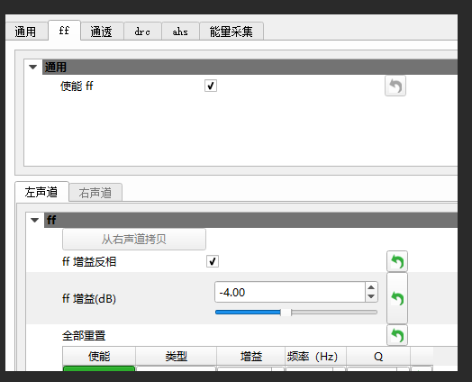
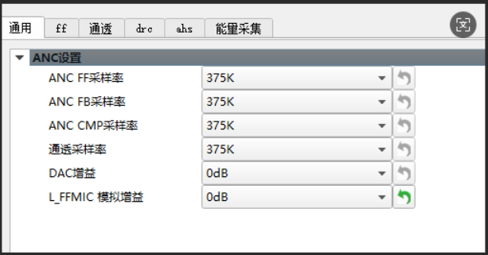

# 调试后

调试后会有一张参数图类似：


代码上保持参数一致

`cpu\br36\audio\audio_config.h`

- DAC增益


`apps\earphone\board\br36\board_ac700n_demo_cfg.h`

- MIC的ANC动态增益。


其他暂时不用修改，根据机器实际情况修改。

- 通话麦与降噪麦公用了，开启动态增益，就不用改？
- 还是mic的模拟增益固定为8？

## 710N芯片





`audio\cpu\br56\audio_config_def.h`

```c
/*
 *省电容mic使用固定收敛值
 *可以用来测试默认偏置是否合理：设置固定收敛值7000左右，让mic的偏置维持在1.5v左右即为合理
 *正常使用应该设置为0,让程序动态收敛
 */
#define TCFG_MC_DTB_FIXED				0

#define TCFG_ESCO_PLC					1  	//通话丢包修复(1T2已修改为节点)
#define TCFG_AEC_ENABLE					1	//通话回音消除使能

#define MAX_ANA_VOL               (3)	// 系统最大模拟音量,范围: 0 ~ 3
//#define MAX_COM_VOL             (16)    // 数值应该大于等于16，具体数值应小于联合音量等级的数组大小 (combined_vol_list)
//#define MAX_DIG_VOL             (16)    // 数值应该大于等于16，因为手机是16级，如果小于16会导致某些情况手机改了音量等级但是小机音量没有变化
```

似乎对不上DAC增益。

## 以谁的为准

- 以 anc 为准，但是要看看耳机这边听音乐声音够不够大。

- MIC的模拟增益也是一样吗？以ANC为准，调试通话也用这个模拟增益？
  - 通话的音量不够要去预处理做补偿。

