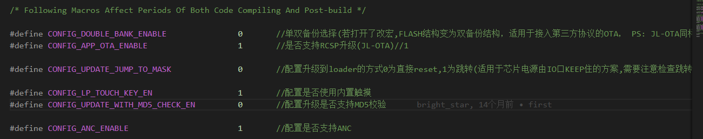
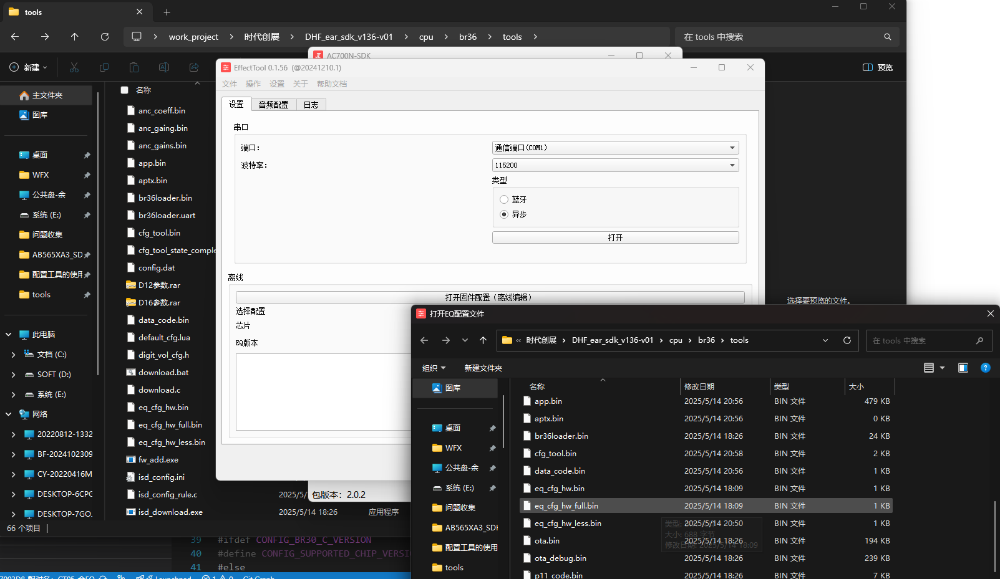
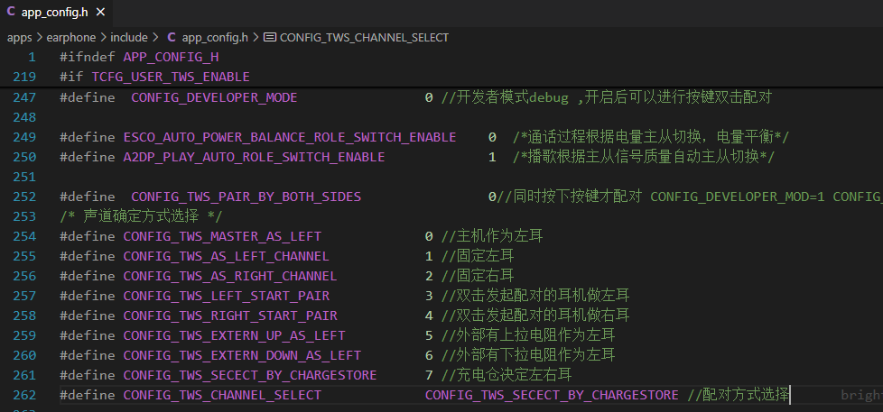
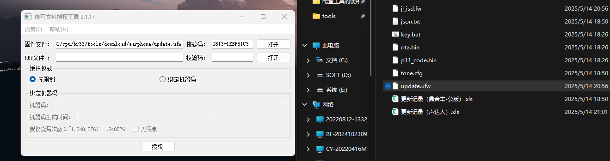
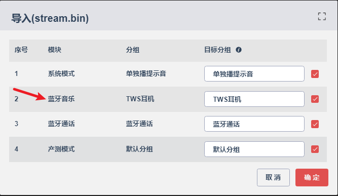

# EQ的的体现

蓝牙耳机下的EQ（Equalization，均衡器）不仅仅是指音乐播放效果之间的差异。EQ是一种音频处理技术，通过调整音频信号中不同频率成分的增益来改变音频的音色和听感。在蓝牙耳机中，EQ的作用远超简单的音乐播放优化，它是一个多功能的工具，能够根据不同的需求和场景进行个性化调整。

## EQ的具体作用

在蓝牙耳机中，EQ可以影响以下几个方面：

1. **音质调整**
    通过增强或减弱特定频率范围（如低音、中音、高音），EQ可以改变音乐的整体音质。例如，增强低音可以让音乐听起来更温暖有力，而提升高音则可能使其更明亮清晰。
2. **音乐类型优化**
    不同类型的音乐（如摇滚、爵士、古典）对频率响应的需求不同。EQ可以根据音乐类型调整频率分布，从而提供更适合该类型的听感。
3. **个人偏好**
    用户可以根据自己的听觉喜好调整EQ，比如喜欢重低音的用户可以增强低频，而偏好清澈人声的用户可以提升中频。
4. **环境适应**
    在嘈杂的环境中，EQ可以通过增强人声频率或削弱背景噪音频率来提升音频清晰度，例如提高语音的可懂度。
5. **设备兼容性**
    不同的蓝牙耳机和音频源设备可能有独特的频率响应特性，EQ可以帮助调整音频输出，使其在不同设备间达到更好的匹配效果。

## 除了音乐播放，EQ还有更多应用

EQ的功能不仅限于音乐播放，还在其他场景中发挥重要作用：

- **语音通话**
   在通话中，EQ可以优化人声的清晰度和自然度，让对话更易听懂。
- **游戏音效**
   在游戏中，EQ可以增强特定音效（如脚步声、枪声），提升玩家的沉浸感和反应能力。
- **电影和视频**
   EQ可以调整音频以匹配视频内容，例如增强低频以突出爆炸场面，或提升中频以强调对话，从而提供更沉浸的观影体验。

# 合EQ

## 有对应的EQbin文件

### 开启ANC模式的

先去代码中查看是否支持ANC模式决定替换哪一个文件。对应板级文件配置区域：`apps\earphone\board\br36\board_ac700n_demo_global_build_cfg.h`

`DHF_ear_sdk_v136-v01\cpu\br36\tools`

最终生效的是`eq_cfg_hw.bin`

**开启ANC模式**的选择`eq_cfg_hw_full.bin`，替换后**（不区分左右耳直接）**重新编译后，后者会被程序自动替换到`eq_cfg_hw.bin`，具体体现就是两者的修改时间是一致的。

### 不开ANC模式

不开ANC模式的话，把bin文件替换`eq_cfg_hw_less.bin`，然后**（不区分左右耳直接）**重新编译。成功的体现为后修改文件与最终生效文件的修改时间是一致的。

## 没有bin文件，只有数值

打开配置工具`DHF_ear_sdk_v136-v01\cpu\br36\tools`：调音工具。

**根据ANC是否打开，选择full或者less文件进行修改。修改之后保存到bin文件即可。**

### 调整音乐EQ也在此

**调整音乐EQ也是在这里，选择下拉框的普通音频EQ就是。也要区分左右耳出包，区分ANC决定替换less还是full。**

## 注意事项

编译之前如果区分左右耳的话需要在`apps\earphone\include\app_config.h`

**不区分不用看**

选择左右耳后再编译。`DHF_ear_sdk_v136-v01\cpu\br36\tools\download\earphone`再把升级文件ufw，放到出包文件夹中。

### 出包时的校验码

**比较与上一次的校验码的差异可以知道是否编译成功。**

# 可视化

**直接导入对应的EQ即可**。

先保证原来升级文件目录处有空`ALIGN_DIR`文件夹，如果没有的话，升级文件不会生成（`JL7016G`）。编译即可。
