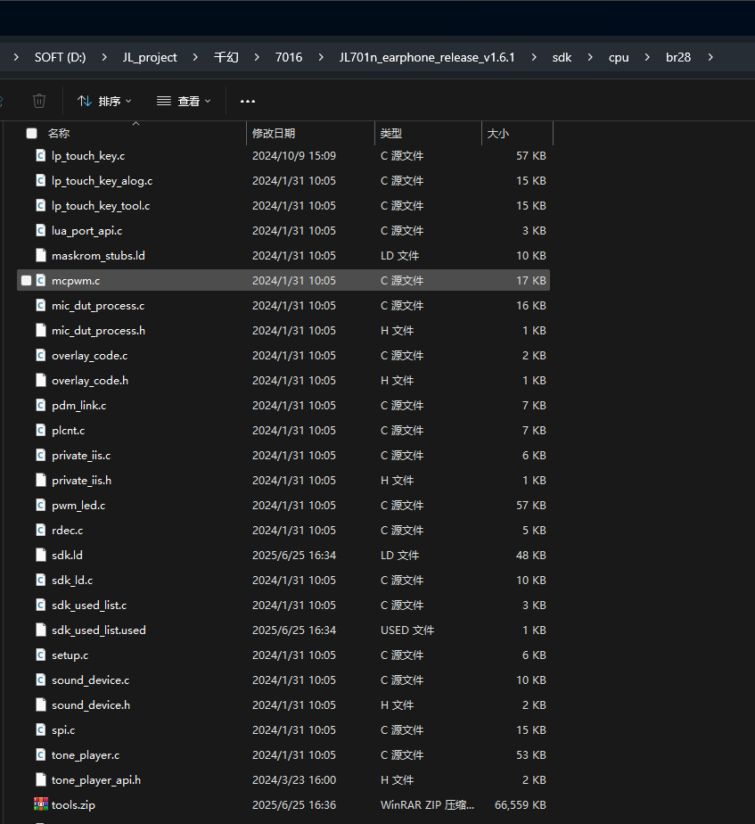

# 打开对应宏

在`apps\earphone\board\br36\board_ac700n_demo_cfg.h`板级文件中打开宏


有一些SDK不一样，但是核心是开EQ总使能，找到在线EQ调试打开，后面有对应的宏说明

其他SDK：


# 修改声道选择

`apps\earphone\include\app_config.h`

```c
/* 声道确定方式选择 */
#define CONFIG_TWS_MASTER_AS_LEFT             0 //主机作为左耳
#define CONFIG_TWS_AS_LEFT_CHANNEL            1 //固定左耳
#define CONFIG_TWS_AS_RIGHT_CHANNEL           2 //固定右耳
#define CONFIG_TWS_LEFT_START_PAIR            3 //双击发起配对的耳机做左耳
#define CONFIG_TWS_RIGHT_START_PAIR           4 //双击发起配对的耳机做右耳
#define CONFIG_TWS_EXTERN_UP_AS_LEFT          5 //外部有上拉电阻作为左耳
#define CONFIG_TWS_EXTERN_DOWN_AS_LEFT        6 //外部有下拉电阻作为左耳
#define CONFIG_TWS_SECECT_BY_CHARGESTORE      7 //充电仓决定左右耳
#define CONFIG_TWS_CHANNEL_SELECT             CONFIG_TWS_MASTER_AS_LEFT//CONFIG_TWS_AS_LEFT_CHANNEL //配对方式选择
```

# 编译打包TOOLS包

- 因为tools包中有配置工具和升级文件。



# 问题

`apps\earphone\include\app_config.h`这个不打开的话，编译会失败

```c
#define USB_PC_NO_APP_MODE                        1
```


**不是SPP进不去界面。**

# 使用手机连接调EQ

一样的操作。
