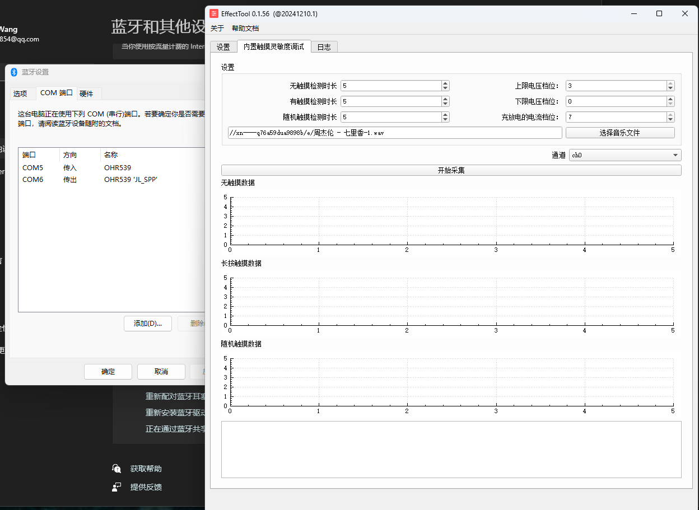
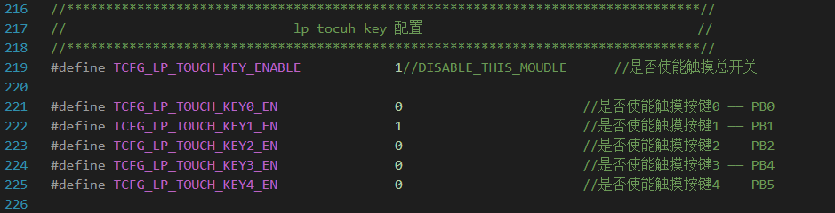

# 使能内置触摸

`apps\earphone\board\br36\board_ac700n_demo_cfg.h`

```c
//内置触摸灵敏度调试工具使能, 使能后可以通过连接PC端上位机通过SPP调试,
//打开该宏需要确保同时打开宏:
//1.USER_SUPPORT_PROFILE_SPP
//2.APP_ONLINE_DEBUG
//可以针对每款样机校准灵敏度参数表(在lp_touch_key.c ch_sensitivity_table), 详细使用方法请参考《低功耗内置触摸介绍》文档.
#define TCFG_LP_TOUCH_KEY_BT_TOOL_ENABLE 	1//DISABLE
```

# 内置触摸调试工具



十个才能得到数据。

# 使用什么通道

**看代码定义使用了哪一个触摸按键**

`apps\earphone\board\br36\board_ac700n_demo_cfg.h`



