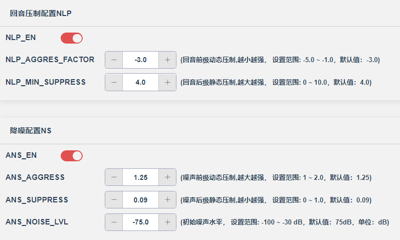

# 前提

## 先测试硬件是否有问题

气密性和麦的频响曲线正常再说。


## 频响特性分析

**整体表现：**

- 频响范围大约从100Hz到8kHz，这对于TWS耳机的麦克风来说是合理的
- 曲线相对平滑，没有出现严重的峰值或谷值

**具体频段分析：**

1. 低频段（100-500Hz）：
   - 大部分曲线在-80dB以下，这是正常的，因为麦克风通常对低频不太敏感
   - 绿色和灰色曲线在低频段表现稍差
2. 中频段（500Hz-2kHz）：
   - 这是人声的关键频段，大部分曲线在-20到-40dB之间
   - 红色、蓝色和黑色曲线在此频段表现较好
   - 在800Hz-1kHz左右有一个小的峰值，这对语音清晰度有利
3. 高频段（2kHz以上）：
   - 高频衰减比较明显，这是典型的麦克风特性
   - 绿色曲线在高频段衰减过快

## 潜在问题

1. **一致性问题：** 不同颜色的曲线（可能代表不同的麦克风或测试条件）之间存在一定差异，特别是绿色曲线与其他曲线差异较大
2. **高频响应：** 部分曲线在4kHz以上衰减较快，可能影响语音的清晰度和自然度
3. **气密性相关：** 如果这些差异是由气密性问题引起的，建议检查麦克风腔体的密封性

## 建议

- 优化麦克风腔体设计，提高一致性
- 考虑适当的EQ补偿来改善高频响应
- 检查装配工艺，确保气密性的一致性

总体来说，这个频响曲线在可接受范围内，但还有优化空间。

# 背景

## 远端通话有回音，手机降一格正常

**近端说话被耳机麦克风采集传递到远端。那么近端的音量大小也是影响近端接听声音大小啊？会有回音可能是什么原因？**

**正确的信号流向：**

- 近端说话 → 近端麦克风采集 → 传输到远端 → 远端听到
- 远端说话 → 远端麦克风采集 → 传输到近端 → 近端耳机播放

**所以近端音量大小（耳机播放音量）不会直接影响远端听到的声音大小。**

- **近端与远端的音量指的是各自端播放出来的声音的大小。**
  - 这是用户可以控制的。

**麦克风**：

- 只负责采集您(**近端**)说话的声音
- 将声音信号传递给手机，再发送到远端

**扬声器（喇叭）**：

- 只负责播放(**远端**)传来的声音
- 将接收到的音频信号转换为您能听到的声音

### 这种分工的优势

**物理隔离**：

- 麦克风通常在耳机线控上或贴近嘴部
- 扬声器在耳朵里
- 两者距离远，声音不会相互干扰

**避免回音**：

- 远端声音只进入您的耳朵，不会被麦克风采集
- **消除了"扬声器→麦克风→远端"的回音路径**

**音质更好**：

- 每个组件专注于单一功能
- 信号传输更清晰，干扰更少

**这就是为什么使用耳机通话时很少出现回音问题，而手机免提通话容易产生回音的根本原因。耳机的设计天然就避免了声学耦合问题。**

### 手机免提通话容易产生回音

#### 手机免提通话的回音机制

**声音循环路径**：

1. 远端说话 → 传输到您的手机
2. 手机扬声器大音量播放 → 您听到声音
3. 扬声器声音被手机麦克风采集 → 重新传输给远端
4. 远端听到自己的声音（回音）

#### 免提模式的特点

**音量必须大**：

- 需要足够大的音量让您在不贴近手机时也能听清
- 扬声器功率输出增强

**麦克风敏感度高**：

- 需要采集到距离较远的您的说话声
- 同时也更容易采集到扬声器的声音

**物理结构限制**：

- 扬声器和麦克风都在同一设备上
- 距离很近，声学隔离困难

#### 现代手机的应对方案

- **AEC算法**：声学回音消除技术
- **波束成形**：多麦克风阵列定向采集
- **噪声抑制**：智能识别并过滤回音

但在某些环境下（如安静房间、高音量），这些技术仍可能无法完全消除回音，所以降低音量或使用耳机是最直接有效的解决方案。


### 远端听到回音的可能原因

1. 声学回音 \- 最常见原因
   - 近端耳机音量过大，声音泄漏到麦克风
     - 声音从耳朵里泄露出来，被麦克风重新采集传递到远端。
     - 那么远端通话时就会听到自己的回音
   - 远端说的话 → 近端耳机播放 → **声音泄漏** → 近端麦克风重新采集 → 传回远端
   - **这就是为什么降低近端音量可以缓解回音**
2. 耳机密封性差
   - 开放式设计或佩戴不紧密
   - **声音容易从耳机泄漏到外界**
3. 麦克风位置不当
   - 麦克风太靠近耳机扬声器
   - 拾取到耳机播放的声音
4. 回音消除算法失效
   - AEC（声学回音消除）功能故障
   - 处理延迟过大导致算法无法正确工作
5. 环境因素
   - 近端环境有强反射面
   - 麦克风同时拾取直接声音和反射声音
   - 空旷的大堂环境（容易回音）

**解决方案优先级：**

1. 降低近端耳机音量（最直接有效）
2. 改善耳机佩戴密封性
3. 选择更好的通话环境
4. 检查设备的回音消除设置

## 机器的气密性与麦克风的频响

### 气密性对通话的影响

**正面作用：**

- 提高被动降噪能力，减少环境噪音干扰，**让对方更清楚听到你的声音**
- 增强低频响应，使声音更饱满自然
- 减少声音泄漏，避免回音和啸叫问题

**负面影响：**

- 过度密封可能产生"闷塞感"，影响佩戴舒适度
- 可能放大呼吸声和口水声等生理噪音
- 长时间佩戴容易产生耳压不适
- **这就是ANC要的效果**

### 麦克风频响对通话的影响

**关键频段：**

- **300-3400Hz**：人声的基本频率范围，**直接影响语音清晰度**
- **1-4kHz**：语音理解度的关键频段，影响辅音识别
- **低频（<300Hz）**：**过强会产生闷音，过弱声音会显得单薄**

**优化要求：**

- 在人声频段保持相对平坦的响应
- 适当衰减低频，减少环境噪音和呼吸声
- 高频不宜过度提升，避免齿音过重

# 调试遇到的问题

## 调节ENC

### 前提

**单麦还是双麦？**

- 单麦没有ENC

`apps\earphone\board\br30\board_ad697n_demo_cfg.h`

```c
/*ENC(双mic降噪)使能*/
#define TCFG_AUDIO_DUAL_MIC_ENABLE		    DISABLE_THIS_MOUDLE   //双麦没有使能
/*ENC双mic配置主mic副mic对应的mic port*/
#define DMS_MASTER_MIC0		0 //mic0是主mic
#define DMS_MASTER_MIC1		1 //mic1是主mic
#define TCFG_AUDIO_DMS_MIC_MANAGE			DMS_MASTER_MIC0
/*双mic降噪/单麦mic降噪 DUT测试模式，配合设备测试mic频响和(双mic)降噪量*/
#define TCFG_AUDIO_DMS_DUT_ENABLE			DISABLE_THIS_MOUDLE
```

在对应项目的配置工具也可以看到：


### 问题

**这个enc优化一下，有点杂音**

## 调节通话清晰度

## 通话参数类型选择的区别

### 单麦配置

### 开启双麦配置

#### 双麦使能以及开启厂测

```c
/*ENC(双mic降噪)使能*/
#define TCFG_AUDIO_DUAL_MIC_ENABLE		    1//DISABLE_THIS_MOUDLE
/*ENC双mic配置主mic副mic对应的mic port*/
#define DMS_MASTER_MIC0		0 //mic0是主mic
#define DMS_MASTER_MIC1		1 //mic1是主mic
#define TCFG_AUDIO_DMS_MIC_MANAGE			DMS_MASTER_MIC0
/*双mic降噪/单麦mic降噪 DUT测试模式，配合设备测试mic频响和(双mic)降噪量*/
#define TCFG_AUDIO_DMS_DUT_ENABLE			1//DISABLE_THIS_MOUDLE  厂测一定要开
```

#### 配置工具改为双麦配置


##### 添写双麦间距

在立项表中查看


##### 喇叭DAC的增益


##### AGC增益


## 调整喇叭输出

[知识科普](#远端通话有回音，手机降一格正常)

### 问题描述

- **声音过小，跟之前你们提供的平EQ的软件音量差太多**

`apps\earphone\board\br36\board_ac700n_demo_cfg.h`

```c
//*********************************************************************************//
//                                 Audio配置                                       //
//*********************************************************************************//
/*内存使用自定义*/
#define TCFG_AUDIO_AAC_RAM_MALLOC_ENABLE	DISABLE_THIS_MOUDLE		//AAC编解码内存动态申请配置

#define TCFG_AUDIO_ADC_ENABLE				ENABLE_THIS_MOUDLE
#define TCFG_AUDIO_ADC_LINE_CHA				LADC_LINE0_MASK

#define TCFG_AUDIO_DAC_ENABLE				ENABLE_THIS_MOUDLE
#define TCFG_AUDIO_DAC_LDO_VOLT				DACVDD_LDO_2_60V//DACVDD_LDO_2_60V //普通模式 DACVDD
#define TCFG_AUDIO_DAC_LDO_VOLT_HIGH        DACVDD_LDO_2_60V//DACVDD_LDO_2_60V //音量增强模式 DACVDD
#define TCFG_AUDIO_DAC_DEFAULT_VOL_MODE     (1) //首次开机默认模式 1：音量增强模式  0：普通模式
#define TCFG_AUDIO_DAC_VCM_CAP_EN           (1) //VCM引脚是否有电容  0:没有  1:有


//*********************************************************************************//
//                                  低功耗配置                                     //
//*********************************************************************************//
#define TCFG_LOWPOWER_POWER_SEL				PWR_DCDC15//PWR_LDO15                    //电源模式设置，可选DCDC和LDO
#define TCFG_LOWPOWER_BTOSC_DISABLE			0                            //低功耗模式下BTOSC是否保持
#define TCFG_LOWPOWER_LOWPOWER_SEL			0   //芯片是否进入powerdown
/*强VDDIO等级配置,可选：
    VDDIOM_VOL_20V    VDDIOM_VOL_22V    VDDIOM_VOL_24V    VDDIOM_VOL_26V
    VDDIOM_VOL_30V    VDDIOM_VOL_30V    VDDIOM_VOL_32V    VDDIOM_VOL_36V*/
#define TCFG_LOWPOWER_VDDIOM_LEVEL			VDDIOM_VOL_32V//VDDIOM_VOL_28V
/*弱VDDIO等级配置，可选：
    VDDIOW_VOL_21V    VDDIOW_VOL_24V    VDDIOW_VOL_28V    VDDIOW_VOL_32V*/
#define TCFG_LOWPOWER_VDDIOW_LEVEL			VDDIOW_VOL_30V               //弱VDDIO等级配置
#define TCFG_LOWPOWER_OSC_TYPE              OSC_TYPE_LRC
#define TCFG_LOWPOWER_LIGHT_SLEEP_ATTRIBUTE 	LOWPOWER_LIGHT_SLEEP_ATTRIBUTE_KEEP_CLOCK 		//低功耗LIGHT模式属性, 可以选择是否保持住一些电源和时钟
```

`cpu\br36\audio\audio_config.h`

```c
#define MAX_ANA_VOL             (15)	// 系统最大模拟音量,范围: 0 ~ 15
#define MAX_COM_VOL             (16)    // 数值应该大于等于16，具体数值应小于联合音量等级的数组大小 (combined_vol_list)
#define MAX_DIG_VOL             (16)    // 数值应该大于等于16，因为手机是16级，如果小于16会导致某些情况手机改了音量等级但是小机音量没有变化
```

`apps\common\audio\audio_dvol.c`

```c
/*
 *数字音量级数 DIGITAL_VOL_MAX
 *数组长度 DIGITAL_VOL_MAX + 1
 */
#define DIGITAL_VOL_MAX		16
const u16 dig_vol_table[DIGITAL_VOL_MAX + 1] = {
	    0, //0: None
	    26, // 1:-56.00 db
        55, // 2:-49.47 db
	   83, // 3:-45.93 db
	  124, // 4:-42.40 db
	  187, // 5:-38.87 db
	  280, // 6:-35.33 db
	  518, // 7:-30.00 db
	  760, // 8:-26.67 db
	 1116, // 9:-23.33 db
	 1638, // 10:-20.00 db
	 2405, // 11:-16.67 db
	 3530, // 12:-13.33 db
	 5181, // 13:-10.00 db
	 7605, // 14:-6.67 db
	11162, // 15:-3.33 db
	16384, // 16:0.00 db
};
```

如果支持ANC的话，对应的数据要同步。

- MAX_ANA_VOL和DAC增益
- `apps\earphone\board\br36\board_ac700n_demo_global_build_cfg.h`中没有看到的话，就不用


## ANC效果以及防破音

`cpu\br28\audio_anc.h`


**混馈的后边都开一下这个功能**


## 通话不清晰


1. **先把通话EQ关掉试一下**
   - 反复与手机通话对比。

## 有风声


把降噪DNS第二个参数调整到0.06，第三个参数调整到-100。

`apps\earphone\aec\br30\audio_aec_dms.c`


### 问题

**在风扇旁通话时有时会有很大的噪音，enc需要优化**


## 通话音量调整


### 远端听到的声音很小

双方的喇叭音量都调到最大，但是远端听到的声音还是很小。

- 把近端的麦克风采集的音量放大即可。


一般12保持不动。

#### 还是不行

**先12改14，步进4db，试一试不行再改AGC**，改13没啥变化的。

- 把麦克风的采集放大修改复原。
- 沿着路径一路放大

 

#### 不行，影响了通话

没用EQ的话，可以使用平EQ然后拉高总增益。可以调节近端AEC的EQ


但是有两个。两个一起改，全部拉平，增加总增益。打开EQ,然后导出覆盖对应的eq的bin文件即可。

## 两个软件的工具通话参数一样

但是有一个远端音量很小。首先怀疑单麦双麦配置是否一致。

`apps\earphone\board\br30\board_ad697n_demo_cfg.h`

```c
/*ENC(双mic降噪)使能*/
#define TCFG_AUDIO_DUAL_MIC_ENABLE		    1//DISABLE_THIS_MOUDLE//单麦与双麦
/*ENC双mic配置主mic副mic对应的mic port*/
#define DMS_MASTER_MIC0		0 //mic0是主mic
#define DMS_MASTER_MIC1		1 //mic1是主mic
#define TCFG_AUDIO_DMS_MIC_MANAGE			DMS_MASTER_MIC0
/*双mic降噪/单麦mic降噪 DUT测试模式，配合设备测试mic频响和(双mic)降噪量*/
#define TCFG_AUDIO_DMS_DUT_ENABLE			1//DISABLE_THIS_MOUDLE//一定要开
```

# 不带ANC的机器调通话

1. 先确定麦的配置
2. 通话声音是否正常，尽量贴近手机效果。
   - 麦采集的声音，跟近端远端喇叭没关系。
3. 麦孔与麦之间是否贴棉
   - 调不好再贴棉

- **EQ不一定需要。如果结构好，还原度好，通话清晰。**

- **单人调试，远端手机静音。**


## 标准参数





## 加满还是声音小一点

退回一个挡位，去另一个地方补到27db。


下面这个也不要加太大：


## EQ软件

前提是声音大小确定了。再调音质（清晰度）


## 有回音

- 喇叭声音降低

- 回音压制算法
  - 有可能TWS双耳复位，ram不够。
- 气密性不行
  - 会有回音，喇叭漏音了。

## 声音很小

- mic增益大一点

## 不够清晰

- EQ问题
- 通常三个点调试


这个也会影响清晰度。

## 声音空旷

- MIC的采集减少，外部加上。
- 有尾音


# 非可视化的调通话


前一段对话是耳机的，后一段的手机的效果。 

给出 音量对比（例如不同通话段落的响度、峰值差异） 频谱分析（EQ 调整效果验证） 背景噪声检测 人声清晰度或频带分布评估

不過您仍然可以將這段音頻的頻譜圖透過本地軟體進行查看，例如使用 **Adobe Audition** 或 **Audacity** 中的「頻譜視圖」功能來對比前後段（耳機 vs 手機）在人聲頻段（約 300Hz–3400Hz）及其高頻部分的能量分布是否有所差異。

## 实际调整原则（建议顺序）

1. **确认录音内容**是否是人声为主，无背景音乐或环境干扰。
2. **使用 EQ（均衡器）软件**（如 Adobe Audition、Audacity 或 ReaEQ）对耳机通话录音进行频段调整。
3. **重点增强中频段（500Hz–3000Hz）**，特别是 800–2000Hz 的部分。
4. **试听调整后的效果**，判断是否更清楚、更贴近正常讲话的音质。
5. **对比原始麦克风频谱图**，找出差异最大的频率区段对症处理。

## 建议优先处理的频率段及目的

| 频率范围        | 作用                     | 建议操作                 | 常用 EQ 参数参考 |
| --------------- | ------------------------ | ------------------------ | ---------------- |
| **300–500Hz**   | 语音厚度、共鸣感         | 适度提升可增加声音存在感 | +2~4 dB，Q=1.2   |
| **500–1600Hz**  | 语音主体，清晰度核心     | 能量不足时需提升         | +3~6 dB，Q=1.0   |
| **1600–3400Hz** | 细节与辨识度，辅音发音   | 可适当增强高频辅音清晰度 | +2~5 dB，Q=1.5   |
| **>4000Hz**     | 光亮感、空气感（非关键） | 可忽略，除非太尖锐       | 保持原样或微调   |
| **<300Hz**      | 背景低频/杂音/环境音     | 通常可削弱以减少浑浊     | -6~10 dB，Q=0.8  |

# mic模拟增益增加，后级数字增益增加，EQ总增益增加，对音量的影响区别

##  MIC模拟增益增加

**作用位置：** ADC之前，最前端

```
声音 → [MIC模拟增益] → ADC → 算法处理 → 输出
```

**对音量的影响：**

- ✅ **提高整体音量**
- ✅ **提高信噪比**（人声和噪声同时放大，但相对比例改善）
- ✅ **改善算法处理效果**（给算法更强的原始信号）
- ⚠️ **可能增加硬件底噪**（如果超过15dB）

## 后级数字增益增加（AGC等）

**作用位置：** 算法处理后

```
声音 → MIC增益 → ADC → 算法处理 → [数字增益] → 输出
```

**对音量的影响：**

- ✅ **提高整体音量**
- ❌ **不改善信噪比**（算法处理后的所有内容一起放大）
- ❌ **放大算法残留问题**（尾音、噪声、失真都被放大）
- ❌ **容易产生"被放大感"**

## EQ总增益增加

**作用位置：** 通常在数字域，音频处理链的后段

```
声音 → MIC增益 → ADC → 算法处理 → [EQ处理] → 输出
```

**对音量的影响：**

- ✅ **提高整体音量**
- 🔄 **改变频率平衡**（不同频段增益不同）
- ❌ **可能引入失真**（某些频段过度增强）
- ⚠️ **可能影响算法效果**（如果EQ在算法前）

## 方案组合效果

```
MIC增益大 → 原始信号质量好 → 给降噪算法更好的工作条件
        ↓
降噪参数强 → 更有效地去除尾音、空间感、噪声残留
        ↓  
后级增益小 → 避免放大算法处理后的残留问题
        ↓
= 干净清晰的最终输出
```

### 第一步：MIC增益调整

```
当前：9dB
建议：12-14dB（提升3-5dB）
上限：不超过15dB（文档建议）
```

### 第二步：后级增益对应调整

```
如果MIC增益提升了4dB
则MAX_GAIN减少4dB进行补偿
保持总体音量平衡
```

### 第三步：降噪参数增强

**如果使用ANS：**

```
优先调整：ANS_AGGRESS（动态压制）适当增大
配合调整：ANS_SUPPRESS 可以适当减小一点
注意：步进不要超过0.1
```

**如果使用DNS：**

```
DNS_OverDrive 适当增大（>1，建议1.2-1.5）
DNS_GainFloor 保持或微调
```

### 优势

```
空间感 → 强降噪直接处理反射声和混响
尾音 → 强降噪压制噪声尾巴  
被放大感 → 低后级增益避免过度放大

MIC增益提升 → 算法输入信号好
降噪参数强 → 算法处理更彻底
后级增益低 → 不会放大处理残留

潜在风险：
⚠️ 降噪过强可能导致：
   - 人声损失（吃音现象）
   - 声音不自然
   - 双工效果变差

⚠️ MIC增益过高可能：
   - 引入硬件底噪
   - ADC饱和失真
```

# 单麦不加ANC（可视化）

- 先确定两个机器的mic频响曲线是不是一致
  - **在可视化的音频配置中，产测配置中，把音频/通话产测打开，不然无法测试。**
  - 烧录同一款软件去对比频响曲线。

- 是否有气密性
  - 堵孔与不堵孔的曲线应该相似，但是堵孔的要低一些。
  - 还在相同位置或者重合就是没有气密性。


## 确定音量

- 前级模拟增益与后级数字增益的数值关系？
  - mic增益以及AGC的数字增益


## 确定回音和尾音以及是否有噪音

- 回音消除AEC与回音压制的区别
  - 他们的数值关系

### 回音处理方式


- 减小近端音量，避免被近端mic采集到。
- 再不然就是回音消除和回音压制
- 再不然就是mic的采集增益小一点。

## 预处理是带ANC才开启的

## 具体问题

### 增加远端音量

- 可能会改变其他效果

AGC调试的是远端听到的声音。该模块是后级数字模块，即在一定的mic模拟增益的情况下，**做完回音消除处理后**，准备送到远端之前做的一个数字放大AGC。

- 增益单位是dB
- 当mic采集到的数据人声大于speech_thr（近端声音放大的阈值）时放大MAX_GAIN
- 当mic采集到的数据人声小于等于speech_thr（近端声音放大的阈值）时放大MIN_GAIN
- speech_thr（近端声音放大的阈值）这个值根据mic采到的声音大小而定，如果太大，声音得不到均匀放大，即一会 放大max_gain，一会放大min_gain，听起来有可能忽大忽小。太小则有可能环境声也会一并放大
  - 如果将 `max_gain` 和 `min_gain` 设置为相同的值，**确实可以避免增益在两个不同值之间切换，从而消除"忽大忽小"的问题。**
  - 这样做实际上就**失去了AGC（自动增益控制）的意义**
    - AGC的目的是根据输入信号的强弱**动态调整增益**，让输出音量保持在合适的范围内：
      - 对于较弱的语音信号 → 给予较大增益（MAX_GAIN）进行补偿
      - 对于较强的语音信号 → 给予较小增益（MIN_GAIN）避免过载
    - 如果max_gain = min_gain会怎样
      - 这相当于使用**固定增益**，虽然避免了增益跳变，但会带来新问题：
        - **弱信号**可能仍然太小，远端听不清
        - **强信号**可能被过度放大，造成失真或不适
        - 无法适应不同说话者的音量差异
        - 无法适应说话者与麦克风距离的变化

### 通话清晰度

**现在通过AU软件，分析出2000周围，耳机要比手机高一点。但是客户说声音不够清晰，我是提升还是降低去贴合手机效果？**

根据客户反馈"声音不够清晰"，您应该**提升2000Hz附近的频段**，而不是降低去贴合手机效果。

#### 分析原因：

**为什么不应该降低2000Hz：**

- 手机扬声器在2000Hz较低，通常是因为硬件限制和成本考虑
- 手机的"清晰度"往往依赖更高频段（3-5kHz）的补偿
- 简单模仿手机频响会丢失耳机的优势

**为什么要提升2000Hz：**

- **语音清晰度核心**：2000Hz是辅音识别的关键频段
- **客户需求导向**：既然反馈不够清晰，直接针对清晰度频段调整
- **耳机优势发挥**：耳机在2000Hz有更好的控制能力，应该充分利用

#### 具体调整建议：

**第一步：适度提升**

- 将2000Hz从当前+2.6dB提升至+3.2dB或+3.5dB
- 观察1500-2500Hz区间的整体响应

**第二步：配合调整**

- 如果提升2000Hz后声音过于"硬"，可微调1000Hz（-0.5dB）
- 如果需要更多存在感，可同时微提3000Hz（+0.8dB）

**第三步：验证效果**

- 用语音测试素材（包含丰富辅音的句子）
- 对比调整前后的语音可懂度
- 确认没有引入刺耳感

记住：**客户体验优于技术指标**。AU显示的频响差异只是参考，最终目标是满足实际使用中的清晰度需求。

#### 总结

**也就是说耳机与手机效果一样，不一定完全贴合，只要他们相近即可，趋势相似即可？感觉可以增0.5看看？**

##### 频响匹配的正确理念：

**不需要完全贴合：**

- 耳机和手机是完全不同的声学系统
- 手机扬声器有物理限制，不应成为耳机的"天花板"
- **趋势相似比数值完全一致更重要**

**相近即可的原因：**

- 用户的听觉适应性很强，微小差异不会被察觉
- 重要的是**整体音色风格**和**清晰度特征**保持一致
- 过度追求数值匹配反而可能牺牲音质

##### 您的调整策略很合理：

**+0.5dB的微调优势：**

- 步进小，风险低，不会产生突兀变化
- 符合人耳对音量变化的感知阈值（约0.5-1dB）
- 便于A/B对比测试效果

**建议测试流程：**

1. **先调整**：2000Hz +0.5dB（从+2.6变为+3.1dB）
2. **快速验证**：播放包含"t、k、p"等辅音的测试音频
3. **客户反馈**：让客户对比调整前后的清晰度
4. **必要时继续**：如果还不够清晰，再+0.5dB

**核心原则：**

- 以用户体验为准
- 频响曲线只是参考工具
- 渐进式调整比一步到位更安全

您的思路很专业，这种细致的微调方法正是音频调试的精髓所在。

### 低频拉不上

- 直接低频拉高
- 低频放平，高频拉低
- 但是效果不是很行，谨慎选择。

### 空间感

空间感确实与高频增益有很大关系！

**高频与空间感的关系：**

1. 高频过多 = 增加空间感
   - 6-10kHz过多会产生"飘"的感觉
   - 10kHz以上过亮会让声音听起来很"远"、很"空"
   - 创造出类似在大空间里听音的感觉
2. 为什么会这样？
   - 自然环境中，距离越远的声音高频衰减越多
   - 大空间的反射主要影响高频部分
   - 过多高频会模拟这种"远距离/大空间"的听感
3. 具体频段影响：
   - **6-8kHz** - 过多会产生"刺激"和"距离感"
   - **8-12kHz** - 过亮会让声音"飘浮"
   - **12kHz以上** - 过多会产生明显的空洞感

## 标准EQ

- EQ以外的参数就是音量对比相似即可。
  - 没有回音
  - 没有杂音
  - 音量输出相似


### 各频段设置原理

**200Hz高通滤波器 (0dB, Q=0.7)**

- 滤除低频噪音和环境杂音（如空调声、交通噪音）
- 减少proximity effect（近距离效应）造成的低频过重
- 提高语音清晰度，避免"闷"的感觉

**2000Hz峰值提升 (+2.6dB, Q=0.7)**

- 这是人声的关键频段，特别是辅音和语音清晰度
- 提升这个频段能显著改善语音的可懂度
- 人耳对2-4kHz频段最敏感，适度提升效果明显

**6000Hz峰值提升 (+1.6dB, Q=0.7)**

- 增强语音的"明亮度"和"存在感"
- 提升辅音的清晰度，如"s"、"t"、"k"等音素
- 让声音听起来更加清脆、不模糊

### 关于200Hz高通滤波器的作用

**高通滤波器的工作原理：**

- 200Hz高通滤波器会**逐渐衰减**200Hz以下的频率，而不是完全"切断"
- Q值0.7意味着衰减是渐进的，不是急剧的陡坡
- 即使设置为0dB增益，高通滤波器仍然在工作

**为什么能避免"闷"的感觉：**

- 人声的基频虽然在100-300Hz范围，但过多的低频会让声音显得"厚重"
- 特别是单麦耳机，容易拾取到过多的低频共振和环境噪音
- 高通滤波器减少了这些不必要的低频成分，让中高频更突出

### 你提到的调试策略很准确

**6000Hz调整：**

- 降低6000Hz → 减少尖锐感、刺耳感
- 也能减少一些空间混响感（因为高频在空间中反射更明显）

**2000Hz调整：**

- 提升2000Hz → 增强语音清晰度和可懂度
- 这个频段是语音识别的关键区域

# 首次默认通话音量

```c
static u16 power_mode_timer = 0;

//首次连接的默认通话音量
static u8 user_set_phone_call_vol_frist_conn =0;
static u16 user_set_phone_call_timerid =0;
void phone_sync_vol(void);
void user_set_phone_call_timeout_deal(void) {
    bt_user_priv_var.phone_vol = 11;
    phone_sync_vol();
#if TCFG_USER_TWS_ENABLE 
    bt_tws_sync_volume();
#endif
    app_var.call_volume = 11;
    r_printf("phone_active:%d\n", app_var.call_volume);
    app_audio_set_volume(APP_AUDIO_STATE_CALL, app_var.call_volume, 1);
    if(user_set_phone_call_timerid !=0) {
        sys_timeout_del(user_set_phone_call_timerid);
        user_set_phone_call_timerid = 0;
    }
}

void bt_get_vm_mac_addr(u8 *addr);


//.......
case BT_STATUS_PHONE_ACTIVE:
//.......
#endif //TCFG_EAR_DETECT_AUTO_CHG_MASTER
#endif // TCFG_EAR_DETECT_ENABLE

#if TCFG_ONE_CONN_CALL_VOL_SET
if(user_set_phone_call_vol_frist_conn){
    if(user_set_phone_call_timerid ==0){
        user_set_phone_call_timerid = sys_timeout_add(NULL, user_set_phone_call_timeout_deal, 800);
    }else {
        sys_timer_modify(user_set_phone_call_timerid, 800);
    }
    user_set_phone_call_vol_frist_conn = 0;
}else {
    //phone_sync_vol();
#if TCFG_USER_TWS_ENABLE
    bt_tws_sync_volume();
#endif
    r_printf("phone_active:%d\n", app_var.call_volume);
    app_audio_set_volume(APP_AUDIO_STATE_CALL, app_var.call_volume, 1);
#if TCFG_EAR_DETECT_ENABLE
#if TCFG_EAR_DETECT_CALL_CTL_SCO
        ear_detect_phone_active_deal();
#endif
#if (TCFG_EAR_DETECT_AUTO_CHG_MASTER && TCFG_USER_TWS_ENABLE)
        ear_detect_call_chg_master_deal();
#endif //TCFG_EAR_DETECT_AUTO_CHG_MASTER
#endif // TCFG_EAR_DETECT_ENABLE
}
#endif
        break;
case BT_STATUS_PHONE_HANGUP:
```


挡位0-15。

# 非可视化

## D40


高频都是平的，首先检查气密性。

不改动气密性的话，那就拉高MIC的模拟增益，让其可以采集到高频数据，其他频段减低。

### 做好气密性

- 但是音量不够以及清晰度不够
- 使能EQ但是平的


- 不带ANC，增加1dBMIC模拟增益后
  - 使能EQ但是平的。
- 如此贴近曲线，那就对嘴说，看看差异。
  - 听出音量的差异
  - 清晰度


### 不够清晰

- 中高频拉高1dB。


曲线只能辅助，靠耳听。
