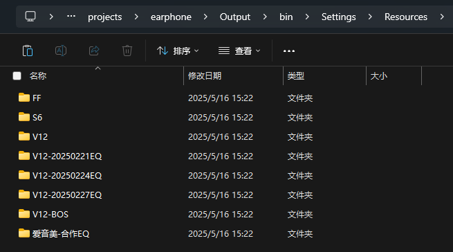
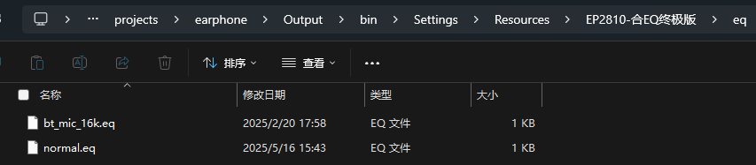
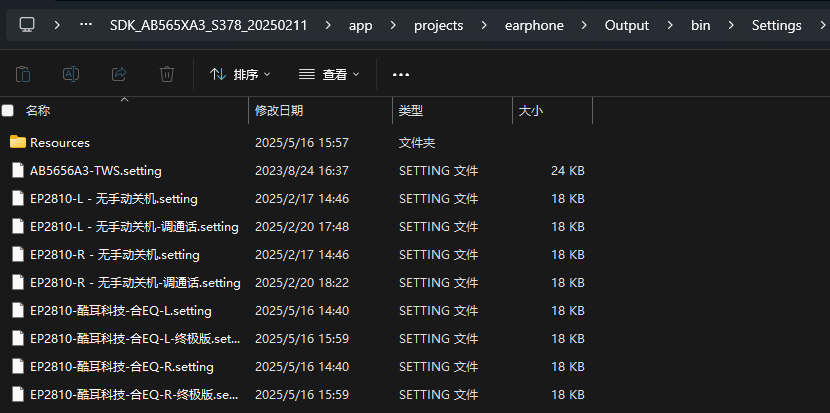

# 蓝讯合EQ

客户提供eq后缀文件，源码和功能不改动的情况下，只改动自定义资源文件夹中的eq文件。为了存档会重新复制一个资源文件夹出来替换其中的eq文件。

**前一个eq为通话eq,后一个eq为音乐eq**

**配置工具的setting文件也要复制存档，因为有时候会改动配对名。**

**最后通过配置工具生成升级文件，会生成一个校验码后续可以通过校验码确定上一个版本**

最后按照打包格式命名以及更新表格文件即可。