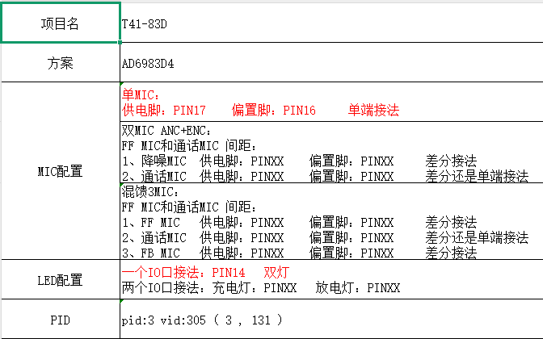

# 公版问题

## 烧录

### 返回KEYERR

- 需要加一个`141-AMW-AC690X-41C3.key`文件
- `download.bat`中

```c
..\..\isd_download.exe ..\..\isd_config.ini -tonorflash -dev br34 -boot 0x20000 -div8 -wait 300 -uboot ..\..\uboot.boot -app ..\..\app.bin -res cfg_tool.bin tone.cfg p11_code.bin eq_cfg_hw.bin -uboot_compress      -key   141-AMW-AC690X-41C3.key
```

### 返回芯片信息不匹配


`apps\earphone\board\br34\board_ad698x_demo_global_build_cfg.h`

```c
#define CONFIG_PID                              TWS//AD698N              //烧写或强制升级之前可以修改,之后升级要保持一致
```

## 触摸按键不能使用

`apps\earphone\board\br34\board_ad698x_demo_cfg.h`

```c
#define TCFG_USER_TWS_ENABLE                      1   //tws功能使能

//*********************************************************************************//
//                             lp tocuh key 配置                                   //
//*********************************************************************************//
#define TCFG_LP_TOUCH_KEY_ENABLE 		   CONFIG_LP_TOUCH_KEY_EN  //是否使能触摸按键
#define TCFG_LP_TOUCH_KEY0_EN               1                           //是否使能触摸按键0 —— PB0
#define TCFG_LP_TOUCH_KEY1_EN               0                           //是否使能触摸按键1 —— PB2
```

`CONFIG_LP_TOUCH_KEY_EN`没使能

`apps\earphone\board\br34\board_ad698x_demo_global_build_cfg.h`

```c
#define CONFIG_LP_TOUCH_KEY_EN					1//0		//配置是否使用内置触摸
```

## 功能正常但是灯效没有



可能硬件配置选择有问题：

`apps\earphone\board\br34\board_ad698x_demo_cfg.h`

```c
//*********************************************************************************//
//                                  LED 配置                                       //
//*********************************************************************************//
#define TCFG_PWMLED_ENABLE					DISABLE_THIS_MOUDLE			//是否支持PMW LED推灯模块
#define TCFG_PWMLED_IOMODE					LED_ONE_IO_MODE				//LED模式，单IO还是两个IO推灯
#define TCFG_PWMLED_PIN						IO_PORTB_06					//LED使用的IO口
```

LED是接的是PIN14针脚，不一定是IO口14。具体看芯片数据手册

- **查到对应的IO口还是不行**，立项出现了问题。
- `IO_PORTB_06`正确，打开`TCFG_PWMLED_ENABLE`即可

# 硬件配置

- 选择对应的板级文件配置
  - `apps\earphone\board\br34\board_config.h`
- 硬件的具体选择以及模块使能
  - `apps\earphone\board\br34\board_ad698x_demo_cfg.h`
  - `apps\earphone\board\br34\board_ad698x_demo_global_build_cfg.h`
- 硬件的功能配置与实现
  - `apps\earphone\board\br34\board_ad698x_demo.c`

# 读取配置文件还是硬编码

**是否使用配置工具的参数配置，默认蓝牙、通话、状态、音量是使用配置工具的参数，如果有其他需要可按需设置**

`apps\earphone\user_cfg.c`公版也是这么选择？

```c
#define USE_CONFIG_BIN_FILE                  0

#define USE_CONFIG_STATUS_SETTING            1                          //状态设置，包括灯状态和提示音
#define USE_CONFIG_AUDIO_SETTING             USE_CONFIG_BIN_FILE        //音频设置
#define USE_CONFIG_CHARGE_SETTING            USE_CONFIG_BIN_FILE        //充电设置
#define USE_CONFIG_KEY_SETTING               USE_CONFIG_BIN_FILE        //按键消息设置
#define USE_CONFIG_MIC_TYPE_SETTING          USE_CONFIG_BIN_FILE        //MIC类型设置
#define USE_CONFIG_LOWPOWER_V_SETTING        USE_CONFIG_BIN_FILE        //低电提示设置
#define USE_CONFIG_AUTO_OFF_SETTING          USE_CONFIG_BIN_FILE        //自动关机时间设置
#define USE_CONFIG_COMBINE_VOL_SETTING       1					        //联合音量读配置
```

## USE_CONFIG_STATUS_SETTING

只在一个地方使用：`apps\earphone\user_cfg.c`

`cfg_file_parse`函数中

```c
#if USE_CONFIG_STATUS_SETTING
    /* g_printf("status_config:"); */
    log_info("status_config:");
    STATUS_CONFIG *status = (STATUS_CONFIG *)tmp;
    ret = syscfg_read(CFG_UI_TONE_STATUS_ID, status, sizeof(STATUS_CONFIG));
    if (ret > 0) {
        memcpy((u8 *)&status_config, (u8 *)status, sizeof(STATUS_CONFIG));
        log_info_hexdump(&status_config, sizeof(STATUS_CONFIG));
    }
#endif
```


## USE_CONFIG_COMBINE_VOL_SETTING

`cfg_file_parse`中只有这一部分：

```c
#if (SYS_VOL_TYPE == VOL_TYPE_AD)
    audio_combined_vol_init(USE_CONFIG_COMBINE_VOL_SETTING);
#endif/*SYS_VOL_TYPE*/
```

获取配置文件的部分似乎不可见。

# 与彩屏仓有关的部分

[硬件配置](#硬件配置)文件中跟仓有关的配置有吗？

**充电仓配置位置**

`apps\earphone\board\br34\board_ad698x_demo_cfg.h`

```c
//*********************************************************************************//
//                                  充电仓配置                                     //
//*********************************************************************************//
#define TCFG_CHARGESTORE_ENABLE				DISABLE_THIS_MOUDLE       //是否支持智能充点仓
#define TCFG_TEST_BOX_ENABLE			    1
#define TCFG_CHARGESTORE_PORT				IO_PORTP_00               //耳机和充点仓通讯的IO口
#define TCFG_CHARGESTORE_UART_ID			IRQ_UART1_IDX             //通讯使用的串口号

//*********************************************************************************//
//                                  充电参数配置                                   //
//*********************************************************************************//
//是否支持芯片内置充电
#define TCFG_CHARGE_ENABLE					ENABLE_THIS_MOUDLE
//是否支持开机充电
#define TCFG_CHARGE_POWERON_ENABLE			DISABLE
//是否支持拔出充电自动开机功能
#define TCFG_CHARGE_OFF_POWERON_NE			ENABLE
/*
充电截止电压可选配置：
    CHARGE_FULL_V_3962  CHARGE_FULL_V_4002  CHARGE_FULL_V_4044  CHARGE_FULL_V_4086
    CHARGE_FULL_V_4130  CHARGE_FULL_V_4175  CHARGE_FULL_V_4222  CHARGE_FULL_V_4270
    CHARGE_FULL_V_4308  CHARGE_FULL_V_4349  CHARGE_FULL_V_4391  CHARGE_FULL_V_4434
    CHARGE_FULL_V_4472  CHARGE_FULL_V_4517  CHARGE_FULL_V_4564  CHARGE_FULL_V_4611
*/
#define TCFG_CHARGE_FULL_V					CHARGE_FULL_V_4222
/*
充电截止电流可选配置：
    CHARGE_FULL_mA_2	CHARGE_FULL_mA_5	CHARGE_FULL_mA_7	 CHARGE_FULL_mA_10
    CHARGE_FULL_mA_15	CHARGE_FULL_mA_20	CHARGE_FULL_mA_25	 CHARGE_FULL_mA_30
*/
#define TCFG_CHARGE_FULL_MA					CHARGE_FULL_mA_10
/*
充电电流可选配置：
    CHARGE_mA_20		CHARGE_mA_30		CHARGE_mA_40		CHARGE_mA_50
    CHARGE_mA_60		CHARGE_mA_70		CHARGE_mA_80		CHARGE_mA_90
    CHARGE_mA_100		CHARGE_mA_110		CHARGE_mA_120		CHARGE_mA_140
    CHARGE_mA_160		CHARGE_mA_180		CHARGE_mA_200		CHARGE_mA_220
 */
#define TCFG_CHARGE_MA						CHARGE_mA_50
```

**通信协议分析**

- 使用UART协议进行通信：
  - 配置的串口号为 `UART1`（通过 `IRQ_UART1_IDX` 定义）
  - 波特率配置未在文件中显示，但通常与串口初始化参数相关
  - 使用的GPIO为 `IO_PORTP_00`（作为通信端口）

**屏幕相关配置分析**

```c
//*********************************************************************************//
//                                  UI 配置                                        //
//*********************************************************************************//

#define TCFG_UI_ENABLE 						0//ENABLE_THIS_MOUDLE 	//UI总开关
// #define CONFIG_UI_STYLE                     STYLE_JL_SOUNDBOX
#define CONFIG_UI_STYLE                  STYLE_UI_SIMPLE //这是309 sdk ui 风格 需要再开启TCFG_SIMPLE_LCD_ENABLE
#define TCFG_LRC_LYRICS_ENABLE             0// ENABLE_THIS_MOUDLE  //歌词显示
#define TCFG_LCD_OLED_ENABLE	            ENABLE_THIS_MOUDLE
// #define TCFG_SPI_LCD_ENABLE                 0//ENABLE_THIS_MOUDLE //spi lcd开关
#define TCFG_SIMPLE_LCD_ENABLE             1// DISABLE_THIS_MOUDLE//去ui 框架的驱动开关 开启请关闭了TCFG_SPI_LCD_ENABLE
#define TCFG_TFT_LCD_DEV_SPI_HW_NUM			 1// 1: SPI1    2: SPI2 配置lcd选择的spi口
#define LCD_SPI_INTERRUPT_ENABLE             0//默认开启 需要主动关闭
#define ALL_KEY_EVENT_CLICK_ONLY	         0 	//是否全部按键只响应单击事件
#define APP_CASE_EARPHONE                     1
```

