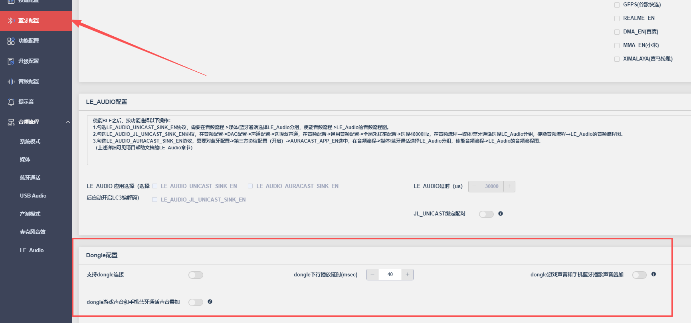
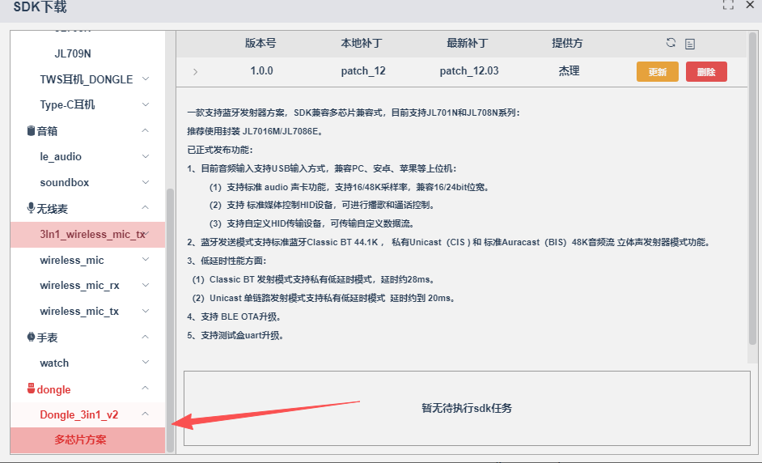

# Dongle

## 耳机710N配7016M做dongle

### 耳机SDK



功能打不开似乎，默认打开，插在电脑上可以直接连接。

### dongle对应SDK




公版按照文档操作，可以使用电脑利用2.4G连接到耳机。但是连接速度和断开速度太慢。

## 减少dongle开机被动等待连接时间

`apps\dongle\adapter\mode\bt\edr\edr_conn_play.c`

- `open_reconn_set`

```c
        init_conn_timer = sys_timeout_add((void *)1, page_page_scan_switch, 100);
```

## 修改灯效

### led的启用

`apps\dongle\adapter\board\br28\led_config.c`

```c
// ------------701LED配置.json------------
#define TCFG_PWMLED_ENABLE 1 // LED配置

#define TCFG_PWMLED_STA_ENABLE 1 // LED状态配置

// ------------701LED配置.json------------
```

### led初始化

`apps\dongle\adapter\board\br28\led_config.c`

```c
#if TCFG_PWMLED_ENABLE

int board_led_config()
{
    led_ui_manager_init();

    return 0;
}
platform_initcall(board_led_config);//调用系统的初始化。

#endif /* #if TCFG_PWMLED_ENABLE */
```

## 与可视化工具的对应以及状态的对应

- `apps\dongle\adapter\ui\led\led_ui_manager.h`

```c
//led各种状态
typedef enum {
    LED_STA_NULL = 0,
    LED_STA_POWERON,
    LED_STA_POWEROFF,
    LED_STA_POWERON_LOWPOWER,
    LED_STA_BT_INIT_OK,
    LED_STA_BT_CONN,
    LED_STA_BT_SLAVE_CONN_MASTER,
    LED_STA_BT_MASTER_CONN_ONE,
    LED_STA_BT_DISCONN,
    LED_STA_BT_TWS_CONN,
    LED_STA_BT_TWS_DISCONN,
    LED_STA_PHONE_INCOME,
    LED_STA_PHONE_OUT,
    LED_STA_PHONE_ACTIV,

    //充电态ui中间不能插入其他状态
    LED_STA_CHARGE_START,
    LED_STA_CHARGE_FULL,
    LED_STA_CHARGE_CLOSE,
    LED_STA_CHARGE_ERR,
    LED_STA_LOWPOWER,
    LED_STA_CHARGE_LDO5V_OFF,
    LED_STA_EXIT_LOWPOWER,
    LED_STA_NORMAL_POWER,
    //充电态ui中间不能插入其他状态

    LED_STA_POWER_NULL,

    LED_STA_MUSIC_MODE,
    LED_STA_MUSIC_PLAY,
    LED_STA_MUSIC_PAUSE,
    LED_STA_LINEIN_MODE,
    LED_STA_LINEIN_PLAY,
    LED_STA_LINEIN_PAUSE,
    LED_STA_PC_MODE,
    LED_STA_PC_PLAY,
    LED_STA_PC_PAUSE,
    LED_STA_FM_MODE,
    LED_STA_RECORD_MODE,
    LED_STA_SPDIF_MODE,
    LED_STA_RTC_MODE,
} LED_UI_STATUS;

//led配置对应的uuid
#define PWMLED_ALL_OFF                           0x9120 //"PWM_LED_BLUE_RED_ALL_OFF",
#define PWMLED_ALL_ON                            0xdda2 //"PWM_LED_BLUE_RED_ALL_ON",
#define PWMLED_BLUE_OFF_RED_ON                   0xe924 //"PWM_LED_BLUE_OFF_RED_ON",
#define PWMLED_BLUE_OFF_RED_SLOW                 0x19f9 //"PWM_LED_BLUE_OFF_RED_SLOW_FLASH",
#define PWMLED_BLUE_OFF_RED_FAST                 0x7d82 //"PWM_LED_BLUE_OFF_RED_FAST_FLASH",
#define PWMLED_BLUE_OFF_RED_5S                   0x585c //"PWM_LED_BLUE_OFF_RED_5S_FLASH",
#define PWMLED_BLUE_OFF_RED_5S_DOUBLE            0x5a36 //"PWM_LED_BLUE_OFF_RED_5S_DOUBLE_FLASH",
#define PWMLED_BLUE_OFF_RED_BREATHE              0x7aa2 //"PWM_LED_BLUE_OFF_RED_BREATHE",
#define PWMLED_BLUE_OFF_RED_FLASH_3_TIME         0x77da //"PWM_LED_BLUE_OFF_RED_FLASH_THREE_TIME",
#define PWMLED_RED_OFF_BLUE_ON                   0xa6a4 //"PWM_LED_RED_OFF_BLUE_ON",
#define PWMLED_RED_OFF_BLUE_SLOW                 0x5779 //"PWM_LED_RED_OFF_BLUE_SLOW_FLASH",
#define PWMLED_RED_OFF_BLUE_FAST                 0xbb02 //"PWM_LED_RED_OFF_BLUE_FAST_FLASH",
#define PWMLED_RED_OFF_BLUE_5S                   0x35dc //"PWM_LED_RED_OFF_BLUE_5S_FLASH",
#define PWMLED_RED_OFF_BLUE_5S_DOUBLE            0x07b6 //"PWM_LED_RED_OFF_BLUE_5S_DOUBLE_FLASH",
#define PWMLED_RED_OFF_BLUE_BREATHE              0xa822 //"PWM_LED_RED_OFF_BLUE_BREATHE",
#define PWMLED_RED_OFF_BLUE_FLASH_3_TIME         0xd55a //"PWM_LED_RED_OFF_BLUE_FLASH_THREE_TIME",
#define PWMLED_RED_BLUE_FAST_FLASH_ALTERNATELY   0x1c8c //"PWM_LED_RED_BLUE_FAST_FLASH_ALTERNATELY",
#define PWMLED_RED_BLUE_SLOW_FLASH_ALTERNATELY   0x2383 //"PWM_LED_RED_BLUE_SLOW_FLASH_ALTERNATELY",
#define PWMLED_RED_BLUE_FAST_BREATHE_ALTERNATELY 0x4299 //"PWM_LED_RED_BLUE_FAST_BREATHE_ALTERNATELY"
```

- 具体配置在可视化工具中配置

## 耳机断开

`apps\dongle\adapter\board\br28\led_config.c`

- `led_ui_normal_status_deal`

```c
case LED_STA_BT_INIT_OK:
	led_ui_manager_display(0, PWMLED_RED_BLUE_SLOW_FLASH_ALTERNATELY, 0);
	break;
case LED_STA_BT_DISCONN:
	led_ui_manager_display(0, PWMLED_RED_BLUE_FAST_FLASH_ALTERNATELY, 0);
	break;
case LED_STA_BT_CONN:
	led_ui_manager_display(0, PWMLED_RED_OFF_BLUE_5S, 0);
	break;	
case LED_STA_POWERON:
	led_ui_manager_display(0, PWMLED_RED_OFF_BLUE_ON, 0);
	break;
```

