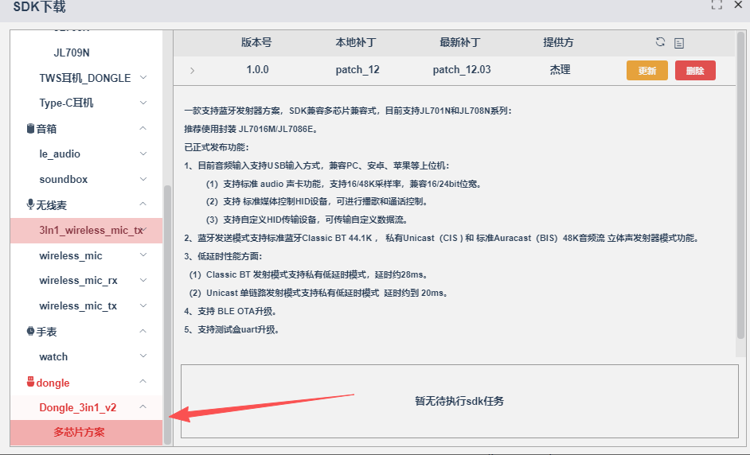
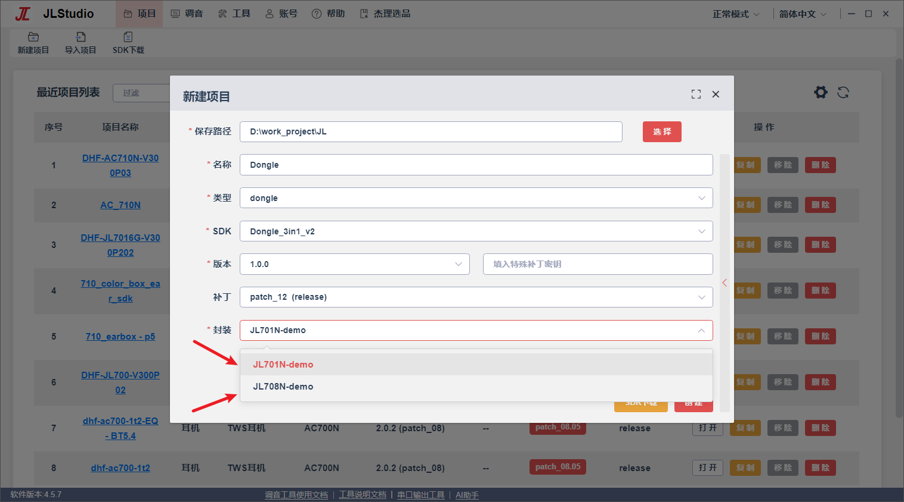

# Dongle

## 耳机710N配7016M做dongle

### 耳机SDK


功能打不开似乎，默认打开，插在电脑上可以直接连接。

### dongle对应SDK





公版按照文档操作，可以使用电脑利用2.4G连接到耳机。但是连接速度和断开速度太慢。

## 加快回连速度

- 首次连接后的回连速度

`apps\dongle\adapter\mode\bt\edr\edr_conn_play.c`

- `open_reconn_set`

```c
        init_conn_timer = sys_timeout_add((void *)1, page_page_scan_switch, 100);
```


