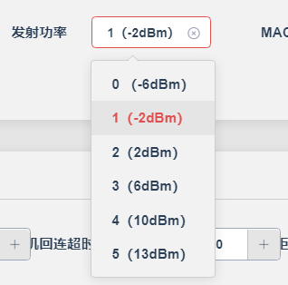

# Dongle

## 耳机710N配7016M做dongle

### 耳机SDK


功能打不开似乎，默认打开，插在电脑上可以直接连接。

### dongle对应SDK


公版按照文档操作，可以使用电脑利用2.4G连接到耳机。但是连接速度和断开速度太慢。

## 减少dongle开机被动等待连接时间

`apps\dongle\adapter\mode\bt\edr\edr_conn_play.c`

- `open_reconn_set`

```c
        init_conn_timer = sys_timeout_add((void *)1, page_page_scan_switch, 100);
```

## 修改灯效

### led的启用

`apps\dongle\adapter\board\br28\led_config.c`

```c
// ------------701LED配置.json------------
#define TCFG_PWMLED_ENABLE 1 // LED配置

#define TCFG_PWMLED_STA_ENABLE 1 // LED状态配置

// ------------701LED配置.json------------
```

### led初始化

`apps\dongle\adapter\board\br28\led_config.c`

```c
#if TCFG_PWMLED_ENABLE

int board_led_config()
{
    led_ui_manager_init();

    return 0;
}
platform_initcall(board_led_config);//调用系统的初始化。

#endif /* #if TCFG_PWMLED_ENABLE */
```

## 与可视化工具的对应以及状态的对应

- `apps\dongle\adapter\ui\led\led_ui_manager.h`

```c
//led各种状态
typedef enum {
    LED_STA_NULL = 0,
    LED_STA_POWERON,
    LED_STA_POWEROFF,
    LED_STA_POWERON_LOWPOWER,
    LED_STA_BT_INIT_OK,
    LED_STA_BT_CONN,
    LED_STA_BT_SLAVE_CONN_MASTER,
    LED_STA_BT_MASTER_CONN_ONE,
    LED_STA_BT_DISCONN,
    LED_STA_BT_TWS_CONN,
    LED_STA_BT_TWS_DISCONN,
    LED_STA_PHONE_INCOME,
    LED_STA_PHONE_OUT,
    LED_STA_PHONE_ACTIV,

    //充电态ui中间不能插入其他状态
    LED_STA_CHARGE_START,
    LED_STA_CHARGE_FULL,
    LED_STA_CHARGE_CLOSE,
    LED_STA_CHARGE_ERR,
    LED_STA_LOWPOWER,
    LED_STA_CHARGE_LDO5V_OFF,
    LED_STA_EXIT_LOWPOWER,
    LED_STA_NORMAL_POWER,
    //充电态ui中间不能插入其他状态

    LED_STA_POWER_NULL,

    LED_STA_MUSIC_MODE,
    LED_STA_MUSIC_PLAY,
    LED_STA_MUSIC_PAUSE,
    LED_STA_LINEIN_MODE,
    LED_STA_LINEIN_PLAY,
    LED_STA_LINEIN_PAUSE,
    LED_STA_PC_MODE,
    LED_STA_PC_PLAY,
    LED_STA_PC_PAUSE,
    LED_STA_FM_MODE,
    LED_STA_RECORD_MODE,
    LED_STA_SPDIF_MODE,
    LED_STA_RTC_MODE,
} LED_UI_STATUS;

//led配置对应的uuid
#define PWMLED_ALL_OFF                           0x9120 //"PWM_LED_BLUE_RED_ALL_OFF",
#define PWMLED_ALL_ON                            0xdda2 //"PWM_LED_BLUE_RED_ALL_ON",
#define PWMLED_BLUE_OFF_RED_ON                   0xe924 //"PWM_LED_BLUE_OFF_RED_ON",
#define PWMLED_BLUE_OFF_RED_SLOW                 0x19f9 //"PWM_LED_BLUE_OFF_RED_SLOW_FLASH",
#define PWMLED_BLUE_OFF_RED_FAST                 0x7d82 //"PWM_LED_BLUE_OFF_RED_FAST_FLASH",
#define PWMLED_BLUE_OFF_RED_5S                   0x585c //"PWM_LED_BLUE_OFF_RED_5S_FLASH",
#define PWMLED_BLUE_OFF_RED_5S_DOUBLE            0x5a36 //"PWM_LED_BLUE_OFF_RED_5S_DOUBLE_FLASH",
#define PWMLED_BLUE_OFF_RED_BREATHE              0x7aa2 //"PWM_LED_BLUE_OFF_RED_BREATHE",
#define PWMLED_BLUE_OFF_RED_FLASH_3_TIME         0x77da //"PWM_LED_BLUE_OFF_RED_FLASH_THREE_TIME",
#define PWMLED_RED_OFF_BLUE_ON                   0xa6a4 //"PWM_LED_RED_OFF_BLUE_ON",
#define PWMLED_RED_OFF_BLUE_SLOW                 0x5779 //"PWM_LED_RED_OFF_BLUE_SLOW_FLASH",
#define PWMLED_RED_OFF_BLUE_FAST                 0xbb02 //"PWM_LED_RED_OFF_BLUE_FAST_FLASH",
#define PWMLED_RED_OFF_BLUE_5S                   0x35dc //"PWM_LED_RED_OFF_BLUE_5S_FLASH",
#define PWMLED_RED_OFF_BLUE_5S_DOUBLE            0x07b6 //"PWM_LED_RED_OFF_BLUE_5S_DOUBLE_FLASH",
#define PWMLED_RED_OFF_BLUE_BREATHE              0xa822 //"PWM_LED_RED_OFF_BLUE_BREATHE",
#define PWMLED_RED_OFF_BLUE_FLASH_3_TIME         0xd55a //"PWM_LED_RED_OFF_BLUE_FLASH_THREE_TIME",
#define PWMLED_RED_BLUE_FAST_FLASH_ALTERNATELY   0x1c8c //"PWM_LED_RED_BLUE_FAST_FLASH_ALTERNATELY",
#define PWMLED_RED_BLUE_SLOW_FLASH_ALTERNATELY   0x2383 //"PWM_LED_RED_BLUE_SLOW_FLASH_ALTERNATELY",
#define PWMLED_RED_BLUE_FAST_BREATHE_ALTERNATELY 0x4299 //"PWM_LED_RED_BLUE_FAST_BREATHE_ALTERNATELY"
```

- 具体配置在可视化工具中配置

## 耳机断开

### 灯效

`apps\dongle\adapter\board\br28\led_config.c`

- `led_ui_normal_status_deal`

```c
case LED_STA_BT_INIT_OK:
	led_ui_manager_display(0, PWMLED_RED_BLUE_SLOW_FLASH_ALTERNATELY, 0);
	break;
case LED_STA_BT_DISCONN:
	led_ui_manager_display(0, PWMLED_RED_BLUE_FAST_FLASH_ALTERNATELY, 0);
	break;
case LED_STA_BT_CONN:
	led_ui_manager_display(0, PWMLED_RED_OFF_BLUE_5S, 0);
	break;	
case LED_STA_POWERON:
	led_ui_manager_display(0, PWMLED_RED_OFF_BLUE_ON, 0);
	break;
```

经过验证，可以通过这里修改灯效。

### 日志

```bash
[00:03:03.187][LMP]LMP_SNIFF_REQ
[00:03:08.490][DONGLE]BT_STATUS_AVRCP_INCOME_OPID:70
[00:03:08.491][DONGLE EDR]++++++++ BT_STATUS_AVRCP_INCOME_OPID +++++++++  
[00:03:08.500][AVCTP]disconn flag 20a4--8--1 
[00:03:08.500][AVCTP]diconn:106484,2084
[00:03:08.501]source: channel_close

[00:03:08.502][BDMGR]sort_1_edr
edr 200 (48 0)
[00:03:08.502][LMP]set_a2dp_channel: 0
[00:03:08.503][AVCTP]disconn flag 20a0--4--1 
[00:03:08.503][AVCTP]diconn:106484,2080
[00:03:08.504][AVCTP]disconn flag 80--2020--1 
[00:03:08.505][AVCTP]diconn:106484,80
[00:03:08.505]source: channel_close

[00:03:08.506][DONGLE] BT STATUS DEFAULT:46
[00:03:08.507][DONGLE EDR]++++++++ BT_STATUS_DISCON_HFP_CH +++++++++  
[00:03:08.510][AVCTP]phone not support hfp connect
[00:03:08.510][AVCTP]disconn flag 0--80--0 
[00:03:08.511][AVCTP]dis total_connect_dev:1--9
[00:03:08.512][DONGLE]BT_STATUS_DISCONNECT###################################
[00:03:08.512][DONGLE EDR]+++++++++++disconnect++++++++###################################
[00:03:08.513]tone_player_faild: tone_en/bt_dconn.*
[00:03:08.520][HCI_LMP]lmp_hci_disconnect:41964c,13,48
[00:03:08.520][AVCTP]diconn:106484,0
[00:03:08.521][LMP]lmp_start_detach: 48, 19
[00:03:08.521][LMP]do_detach : 48, 19
[00:03:08.522][LMP]TX LMP_DETACH
[00:03:08.523]wait_lmp_empty: super_timeout = 0
[00:03:08.530][LMP]do_detach : 48, 19
[00:03:08.530][LMP]s_free:0x41bf28
[00:03:08.531][DONGLE]-----------bt_hci_event_handler reason 5 13
[00:03:08.532][DONGLE]HCI_EVENT_DISCONNECTION_COMPLETE #########################
[00:03:08.532]<<<<<<<<<<<<<<total_dev: 0>>>>>>>>>>>>>
[00:03:08.533][DONGLE EDR]dual conn HCI_EVENT_DISCONNECTION_COMPLETE 
[00:03:08.534][DONGLE EDR]Test mode, open inquiry_scan/page_scan!!
[00:03:08.550][BDMGR]sort_0_edr
ide 1000
[00:03:08.550]link_close_exit
[00:03:08.551][LMP]lmp_del_suss
[00:03:08.551][LMP]HCI_WRITE_SCAN_ENABLE : 3
[00:03:08.562]inquiry_scan: DB45F

51 BC BC 9F 2C F7 
[00:03:08.563][BDMGR]sort_0_edr
iqs 34
ide 1000
I
[00:03:08.563]page_scan_enable

51 BC BC 9F 2C F7 
[00:03:08.564][BDMGR]sort_0_edr
iqs 34
pgs 34
ide 1000
PIPIPIPIPIPIPIPIPIPIPI
```

## EDR连接耳机

```bash
[00:09:03.718]rx_link_buff_size=684
[00:09:03.719]link_inquiry_disable
[00:09:03.719][BDMGR]sort_0_edr
pgs 34
ide 1000
[00:09:03.720][BDMGR]sort_0_edr
ide 1000
[00:09:03.721][BDMGR]sort_1_edr
edr 200 (48 100)
[00:09:03.722][LMP]LMP_FEATURES_REQ
[00:09:03.726][LMP]LMP_VERSION_REQ
[00:09:03.728][LMP]LMP_FEATURES_REQ_EXT
[00:09:03.732][LMP]LMP_FEATURES_REQ_EXT
[00:09:03.733][LMP]LMP_HOST_CONNECTION_REQ
[00:09:03.734][DONGLE] BT STATUS DEFAULT:5
[00:09:03.735][DONGLE EDR]No evtent handler:5
[00:09:03.740][LMP]req_role_switch
[00:09:03.740]>bof:293

[00:09:03.741][LMP]lmp_role_switch_misc_alloc
[00:09:03.741][LMP]rs_instant: 0x5aa, 0x708
[00:09:03.746][LMP]LMP_ACCEPTED
[00:09:03.746][LMP]LMP_SWITCH_REQ
[00:09:03.749][LMP]conn->core.role 0x1
[00:09:03.750][LMP]rs_after: 0x151, 0x5b8, 0x708
[00:09:03.958]rs_2_master 
[00:09:03.958]lt 2 
41 82 1B 7A D9 B1 

D2 B7 3E 35 03 
xA
[00:09:03.961]rw disxB
[00:09:03.968][LMP]rs_succ:0x0
[00:09:03.968][LMP]stage:0, step:62, lt_addr:1
[00:09:03.969][LMP]TX_SET_AFH_REQ: 4, d470c
[00:09:03.970][LMP]tx setup_complete 
[00:09:03.970][LMP]LMP_TX_PACKET_TYPE_TABLE_REQ
[00:09:03.971][LMP]lmp_role_switch_misc_free
[00:09:03.972][LMP]LMP_SETUP_COMPLET
[00:09:03.973][LMP] ========    HCI_AUTHENTICATION_REQUESTED  
[00:09:03.974][DONGLE]-----------bt_hci_event_handler reason 3 0
[00:09:03.975][LMP]ROLE_SW_S_TO_M reject 1
[00:09:03.976][DONGLE] HCI_EVENT_CONNECTION_COMPLETE #############################
[00:09:03.976][DONGLE]ERROR_CODE_SUCCESS  
[00:09:03.977][DONGLE EDR]dual conn HCI_EVENT_CONNECTION_COMPLETE:0 #####################################
[00:09:03.979][LMP]LMP_SUPERVISION_TIMEOUT
[00:09:03.980][LMP]super_timeout: 8000
[00:09:03.981][LMP]LMP_MAX_SLOT_REQ=41964c,48,5
[00:09:03.982][LMP]LMP_NAME_REQ
[00:09:03.983][LMP]LMP_TIMING_ACCURACY_REQ
[00:09:03.984][LMP]LMP_ACCEPTED
[00:09:03.985][LMP]LMP_MAX_SLOT_REQ
[00:09:03.986][LMP]LMP_NAME_RES
[00:09:03.986][LMP]remote_name: DB45F
[00:09:04.002][LMP]LMP_TIMING_ACCURACY_RES
[00:09:04.004][LMP]E4_LMP_ACCEPTED_EXT
[00:09:04.005][LMP]LMP_PACKET_TYPE_TABLE_REQ
[00:09:04.032][LMP]LMP_POWER_CONTROL_REQ
[00:09:04.032][LINK]pwr_set=0,7,2,255,7
[00:09:04.067][LMP]LMP_POWER_CONTROL_REQ
[00:09:04.067][LINK]pwr_set=0,7,2,255,7
[00:09:04.100][LMP]LMP_POWER_CONTROL_REQ
[00:09:04.101][LINK]pwr_set=0,7,2,255,7
[00:09:04.127][LMP]LMP_POWER_CONTROL_REQ
[00:09:04.127][LINK]pwr_set=0,7,2,255,7
[00:09:04.160][LMP]LMP_POWER_CONTROL_REQ
[00:09:04.161][LINK]pwr_set=0,7,2,255,7
[00:09:04.169][LMP]LMP_AU_RAND
[00:09:04.170][LMP]lmp_rx_au_rand
[00:09:04.170][LMP]send_sres_after_get_link_key
[00:09:04.171][LMP]LMP_WAIT_HCI_EVENT_LINK_KEY_REPLY 1 =40b
[00:09:04.178][LMP]LMP_ENCRYPTION_MODE_REQ
[00:09:04.179][LMP]LMP_TX_ENCRYPTION_KEY_SIZE_REQ
[00:09:04.180][LMP]LMP_WAIT_ACCEPT_ENCRYPTION_KEY_SIZE_REQ 0 0 0
[00:09:04.182][LMP]LMP_ACCEPTED
[00:09:04.182][LMP]LMP_ENCRYPTION_KEY_SIZE_REQ
[00:09:04.183][LMP]LMP_WAIT_ACCEPT_ENCRYPTION_KEY_SIZE_REQ 6 20 0
[00:09:04.183][LMP]LMP_TX_START_ENCRYPTION_REQ
1D CD C7 51 45 D0 E4 6E C3 CB 53 02 73 A2 6F 0D 
[00:09:04.185][LMP]start_enc_req_prob_cb
[00:09:04.186]set_encrypt: 1, 0

[00:09:04.186]memory_pool_get=419a98
[00:09:04.187]---------   sdp_creat 
[00:09:04.187]memory_pool_get=419a98
[00:09:04.188]wait get remote device company 40

[00:09:04.189][LMP]LMP_WAIT_ACCEPT_START_ENCRYPTION_REQ
[00:09:04.195][LMP]LMP_ACCEPTED
[00:09:04.196][LMP]LMP_START_ENCRYPTION_REQ
1D CD C7 51 45 D0 E4 6E C3 CB 53 02 73 A2 6F 0D 
[00:09:04.197]set_encrypt: 1, 1

[00:09:04.198][LMP]LMP_WAIT_ACCEPT_START_ENCRYPTION_REQ
[00:09:04.198][DONGLE] BT STATUS DEFAULT:8
[00:09:04.199][DONGLE EDR]No evtent handler:8
[00:09:04.201][LMP]LMP_POWER_CONTROL_REQ
[00:09:04.201][LINK]pwr_set=0,7,2,255,7
[00:09:04.256]sdp_data_len 0

[00:09:04.257]sdp info len end===181===:178
[00:09:04.258]element len= 181

[00:09:04.258]shortUUID= 1101

[00:09:04.259]shortUUID= 110b

[00:09:04.259]shortUUID= 110e

[00:09:04.260]shortUUID= 110f

[00:09:04.260]shortUUID= 110c

[00:09:04.261]shortUUID= 111e

[00:09:04.261]shortUUID= 1203

[00:09:04.262]=========sdp free=========

[00:09:04.276]memory_pool_get=419a98
[00:09:04.276]memory_pool_get=419a9c
[00:09:04.277]memory_pool_get=419a98
[00:09:04.278]source

[00:09:04.298][DONGLE]BT_STATUS_CONNECTED #####################################
[00:09:04.299][DONGLE EDR]dual_conn BT_STATUS_FIRST_CONNECTED #####################################
[00:09:04.300]tone_player_faild: tone_en/bt_conn.*
[00:09:04.301][DONGLE] BT STATUS DEFAULT:29
[00:09:04.301][DONGLE EDR]No evtent handler:29
[00:09:04.310]source: channel_open

41 82 1B 7A D9 B1 
[00:09:04.311]memory_pool_get=419a98
[00:09:04.312]get avrcp_volume from vm 255
[00:09:04.313]memory_pool_get=419aa4
[00:09:04.332][DONGLE]BT_STATUS_AVRCP_INCOME_OPID:70
[00:09:04.333][DONGLE EDR]++++++++ BT_STATUS_AVRCP_INCOME_OPID +++++++++  
[00:09:04.356][LMP]LMP_POWER_CONTROL_REQ
[00:09:04.356][LINK]pwr_set=0,7,2,255,7
[00:09:04.509][LMP]LMP_POWER_CONTROL_REQ
[00:09:04.510][LINK]pwr_set=0,7,2,255,7
[00:09:04.660][LMP]LMP_POWER_CONTROL_REQ
[00:09:04.661][LINK]pwr_set=0,7,2,255,7
[00:09:04.857][LMP]LMP_POWER_CONTROL_REQ
[00:09:04.857][LINK]pwr_set=0,7,2,255,7
[00:09:05.023][LMP]LMP_POWER_CONTROL_REQ
[00:09:05.023][LINK]pwr_set=0,7,2,255,7
[00:09:05.184][LMP]LMP_POWER_CONTROL_REQ
[00:09:05.185][LINK]pwr_set=0,7,2,255,7
[00:09:05.276]Received DISCOVER_CMD

01 01 01 01 01 
[00:09:05.295]>>38,  38

[00:09:05.295][LMP]--------set_a2dp_type: 0
[00:09:05.298]Received OPEN_CMD
[00:09:05.306]memory_pool_get=419a98
[00:09:05.316][DONGLE]++++++++ BT_STATUS_CONN_A2DP_CH +++++++++  
[00:09:05.317][DONGLE EDR]++++++++ BT_STATUS_CONN_A2DP_CH +++++++++  
[00:09:06.519][DONGLE EDR]AVDTP close...
[00:09:06.519][DONGLE EDR]a2dp_pp:1, is_priv_conn:0, uac:0
[00:09:06.520][DONGLE EDR]open a2dp err, uac:0
[00:09:06.749][LMP]LMP_POWER_CONTROL_REQ
[00:09:06.750][LINK]pwr_set=0,7,2,255,7
[00:09:07.320][AVCTP]wait 1.5 second then connect hfp
[00:09:07.321]---------   sdp_creat 
[00:09:07.321]memory_pool_get=419a98
[00:09:07.345]sdp_data_len 0

[00:09:07.346]sdp info len end===181===:178
[00:09:07.346]element len= 181

[00:09:07.347]shortUUID= 1101

[00:09:07.347]shortUUID= 110b

[00:09:07.348]shortUUID= 110e

[00:09:07.349]shortUUID= 110f

[00:09:07.349]shortUUID= 110c

[00:09:07.350]shortUUID= 111e

[00:09:07.350]shortUUID= 1203

[00:09:07.351]=========sdp free=========

[00:09:07.522][LMP]LMP_POWER_CONTROL_REQ
[00:09:07.522][LINK]pwr_set=0,7,2,255,7
[00:09:08.299][LMP]LMP_POWER_CONTROL_REQ
[00:09:08.300][LINK]pwr_set=0,7,2,255,7
[00:09:09.812][LMP]LMP_POWER_CONTROL_REQ
```

## 高低电平点灯？

单IO推双灯的结构，高低电平无法直接切换灯，只能重新设置输出模式，经过一个高阻态。。。

```
//第一次设置直接设置输出模式，但是切换时必须经过一个高阻态
gpio_set_mode(PORTA, PORT_PIN_2, PORT_HIGHZ);
gpio_set_mode(PORTA, PORT_PIN_2, PORT_OUTPUT_LOW);
```

典型的单IO双灯电路结构

```
VCC
         |
        LED1 (阳极向上)
         |
    ----+---- GPIO
         |
        LED2 (阳极向下)
         |
        GND
```

### 为什么直接切换电平不工作？

当你设置 `OUTPUT_HIGH` 点亮LED2后：

- GPIO输出高电平
- LED2导通发光
- 但此时LED1也处于**反向偏置但未完全截止**的状态

**关键问题**：直接从 `OUTPUT_HIGH` 切换到 `OUTPUT_LOW` 时，GPIO内部的**输出驱动电路状态转换**可能不够彻底，导致：

1. 残余电荷未释放
2. 输出级的P-MOS/N-MOS未完全切换
3. 两个LED之间形成微弱的电流路径

方案1：添加高阻态过渡（你已经发现）

方案3：硬件改进（如果可以修改硬件）

```c
      VCC
       |
      R1
       |
      LED1
       |
  ----+---- GPIO
       |
      LED2
       |
      R2
       |
      GND
```

- 添加限流电阻可以改善切换特性。

### 为什么PWM模式下正常？

PWM模式下，芯片的PWM外设会：

1. **硬件级别快速切换**输出状态
2. 每个周期都有完整的充放电过程
3. 高频切换天然避免了电荷残留问题

而直接操作GPIO模式，软件切换不够"干净"。

单IO双灯切换时**必须经过高阻态过渡**，这不是bug而是电路特性决定的必要步骤。

## 测试延迟数据

- 蓝牙连接测试的耳机需要提供耳机喇叭阻值
  - 问客户或者硬件

## 添加le audio

- 前提是耳机端与dongle端都要有le audio的配置项。不然只能走经典蓝牙edr.延迟也大很多。

## 添加PA增强信号需要降低dongle发射功率




- 文档说降低是为了避免烧坏PA芯片

- 一档或二档，0dbm附近
