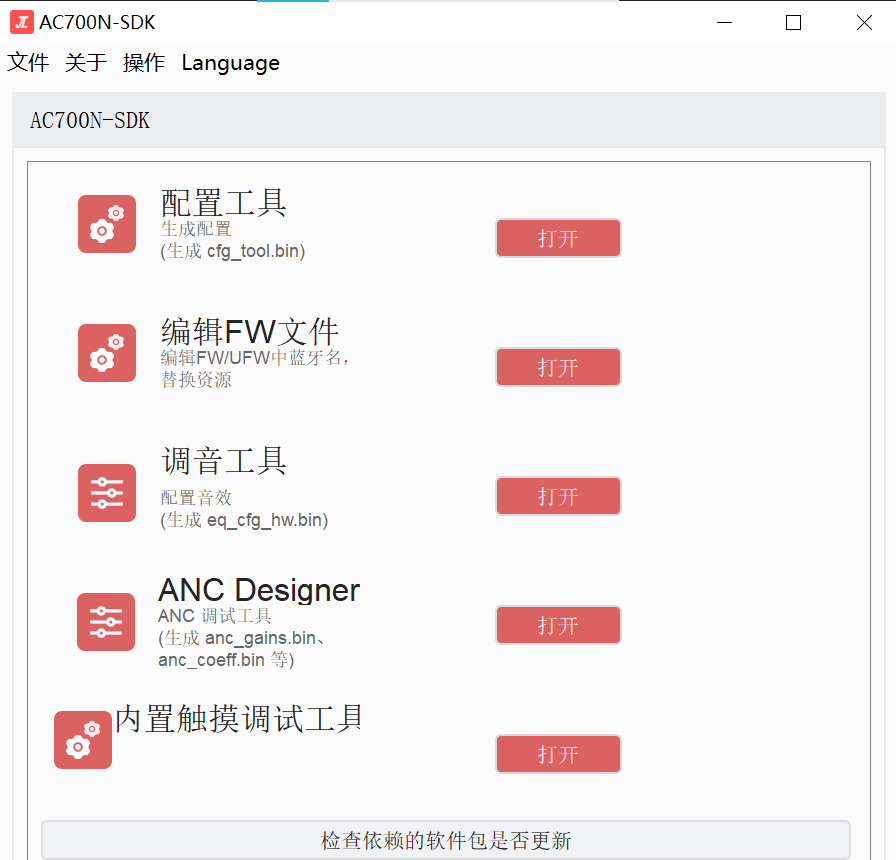

# 文档说明

此文档表述与理论基本来自AI代码分析工具，有一些流程和理论暂时没有在生产环境中得到验证，此后会根据实际实践经验不断完善表述和纠正错误。

# 替换提示音

为了方便知道耳机的状态，把所有的音效改成中文。

## 替换

打开配置工具入口，点击配置工具：


1. 收集对应的中文MP3格式的音效素材
2. 把原有音效删除，新音效改为同名MP3
3. 然后点击打开选中即可
4. 格式跟原来一样，点击保存提示音文件
5. 再点击保存到bin即可编译生效。
6. **换音质的话，应该从MP3开始转换，如果WTG低音质转成WTS高音质的话，会失真。**

## 区分左右耳

**区分左右耳的话，出包需要分开编译分别打包各自的ufw文件：**

**apps\earphone\include\app_config.h**

```c
/* 声道确定方式选择 */
#define CONFIG_TWS_MASTER_AS_LEFT             0 //主机作为左耳
#define CONFIG_TWS_AS_LEFT_CHANNEL            1 //固定左耳
#define CONFIG_TWS_AS_RIGHT_CHANNEL           2 //固定右耳
#define CONFIG_TWS_LEFT_START_PAIR            3 //双击发起配对的耳机做左耳
#define CONFIG_TWS_RIGHT_START_PAIR           4 //双击发起配对的耳机做右耳
#define CONFIG_TWS_EXTERN_UP_AS_LEFT          5 //外部有上拉电阻作为左耳
#define CONFIG_TWS_EXTERN_DOWN_AS_LEFT        6 //外部有下拉电阻作为左耳
#define CONFIG_TWS_SECECT_BY_CHARGESTORE      7 //充电仓决定左右耳
#define CONFIG_TWS_CHANNEL_SELECT             CONFIG_TWS_AS_LEFT_CHANNEL //配对方式选择
```

**左右耳分别切换宏编译出包。**

格式支持要做好，不要的格式就不启用，免得占用资源：

`apps\earphone\board\br30\board_ad697n_demo_cfg.h`

`TCFG_BT_SUPPORT_G729` 用于控制 G.729 格式（即 WTG）的支持：

- 置为 `1` 时开启 G.729（WTG）格式解码支持；
- 置为 `0` 时关闭此支持。

`TCFG_DEC_WTGV2_ENABLE` 用于控制 WTS 格式的支持：

- 置为 `1` 时开启 WTS 格式解码支持；
- 置为 `0` 时关闭此支持。

**格式对不上的话，烧录进入是完全没有提示音的。**

## 出包

在左耳文件夹中更新表格，并重命名新的包含校验码和修改时间的文件名。

使用**烧写文件授权工具**可以查看大写的校验码，使用校验码查看工具可以看到小写的校验码。

分别打包压缩发出即可。

# 日志与打印输出

**首先保证板级文件中的配置以及模式使能了**

```c
//                                 UART配置                                        //
//*********************************************************************************//
#define TCFG_UART0_ENABLE				    ENABLE_THIS_MOUDLE                     //串口打印模块使能
#define TCFG_UART0_RX_PORT					NO_CONFIG_PORT                         //串口接收脚配置（用于打印可以选择NO_CONFIG_PORT）
#define TCFG_UART0_TX_PORT  				IO_PORT_DP                             //串口发送脚配置
#define TCFG_UART0_BAUDRATE  				1000000                                //串口波特率配置
```

打开打印总开关：`apps\earphone\include\app_config.h`

```c
/*
 * 系统打印总开关
 */

#define LIB_DEBUG    1//0  //打开打印
#define CONFIG_DEBUG_LIB(x)         (x & LIB_DEBUG)

#define CONFIG_DEBUG_ENABLE

#ifndef CONFIG_DEBUG_ENABLE
//#define CONFIG_DEBUG_LITE_ENABLE  //轻量级打印开关, 默认关闭
#endif
```

## 使用

```c
printf("=== Log Test Start ===\n");
    
    // 测试普通打印
    printf("Normal printf working\n");
    
    // 测试日志级别打印
    log_info("Info log test\n");
    log_debug("Debug log test\n");
    log_error("Error log test\n");
    
    printf("=== Log Test End ===\n");
```

**普通printf输出**：

```c
[00:00:00.321]=== Log Test Start ===
[00:00:00.322]Normal printf working
```

- 格式：`[时间戳]内容`
- 特点：简单直接，只显示时间和内容

**log_info输出**：

```c
[00:00:00.322][Info]: [APP]Info log test
```

- 格式：`[时间戳][Info]: [APP]内容`
- 特点：包含了日志级别(Info)和模块标签(APP)

**log_error输出**：

```c
[00:00:00.323](error): <Error>: [APP]Error log test
```

- 格式：`[时间戳](error): <Error>: [APP]内容`
- 特点：错误日志有特殊标记，更容易识别

**时间戳格式**：

- 格式：`[HH:MM:SS.mmm]`
- 例如：`[00:00:00.321]`
- 精确到毫秒级别

## 日志输出

对于日志输出，需要以下配置：

**必需的宏定义**（这些要在包含头文件之前定义）：

```c
// 定义模块名称
#define LOG_TAG_CONST       APP    // 模块名称（大写）
#define LOG_TAG             "[APP]" // 模块标签（方括号格式）

// 启用需要的日志级别
#define LOG_ERROR_ENABLE    // 启用错误日志
#define LOG_DEBUG_ENABLE    // 启用调试日志
#define LOG_INFO_ENABLE     // 启用信息日志
//#define LOG_DUMP_ENABLE   // 启用数据打印（可选）
#define LOG_CLI_ENABLE      // 启用命令行（可选）
```

**必需的头文件**：

```c
#include "debug.h"          // 包含调试相关定义
```

**完整示例**：

```c
#include "app_config.h"     // 首先包含应用配置

// 日志配置（必须在debug.h之前）
#define LOG_TAG_CONST       APP
#define LOG_TAG             "[APP]"
#define LOG_ERROR_ENABLE
#define LOG_DEBUG_ENABLE
#define LOG_INFO_ENABLE
#define LOG_CLI_ENABLE

// 包含日志头文件
#include "debug.h"

// 使用示例
void test_function(void)
{
    log_info("Info message\n");
    log_debug("Debug message\n");
    log_error("Error message\n");
}
```

记住：

- 宏定义必须在包含 debug.h 之前

- app_config.h 中确保 LIB_DEBUG = 0

- 只有定义了对应的 ENABLE 宏，对应级别的日志才会输出

这样配置后就可以使用各种日志函数了：

- log_info() - 信息日志

- log_debug() - 调试日志

- log_error() - 错误日志

## 彩色打印(不会)

`include_lib\system\generic\log.h`

```c
#define r_printf(x, ...)    log_i("\e[31m\e[1m" x "\e[0m", ## __VA_ARGS__)
#define g_printf(x, ...)    log_i("\e[32m\e[1m" x "\e[0m", ## __VA_ARGS__)
#define y_printf(x, ...)    log_i("\e[33m\e[1m" x "\e[0m", ## __VA_ARGS__)
#define r_f_printf(x, ...)  log_i("\e[31m\e[5m\e[1m" x "\e[0m", ## __VA_ARGS__)
#define g_f_printf(x, ...)  log_i("\e[32m\e[5m\e[1m" x "\e[0m", ## __VA_ARGS__)
#define y_f_printf(x, ...)  log_i("\e[33m\e[5m\e[1m" x "\e[0m", ## __VA_ARGS__)
```

把`log_i`改用`printf`即可

# SDK的启动流程

## app_main() 作为主入口

- app_main() 是整个应用的主入口函数，类似于传统C程序的 main()。

- 该函数负责初始化系统、判断启动模式、进入主应用等。

## 启动流程详细步骤

### 变量和环境初始化

- log_info("app_main\n");
  - 打印启动日志，便于调试。

- app_var.start_time = timer_get_ms();
  - 记录启动时间。
  - start_time 记录系统启动时间，主要用于：
    - 系统运行时间统计：可以用来计算系统运行了多长时间
    - 定时任务管理：用于各种定时任务的计时基准
    - 性能分析：可以用来分析系统启动到各个功能点的时间
    - 调试和日志：在调试时可以记录关键事件发生的时间点

### 音频解码/编码初始化

- 如果定义了 CONFIG_MEDIA_NEW_ENABLE 或 CONFIG_MEDIA_DEVELOP_ENABLE，则初始化音频解码和编码（audio_enc_init()、audio_dec_init()）。

#### 蓝牙耳机中音频编码和解码的作用

##### 音频编码 (audio_enc_init)

音频编码在蓝牙耳机中主要用于：

**通话功能：**

- 将麦克风采集的语音信号编码成数字数据

- 使用特定的编码格式（如SBC、AAC、aptX等）压缩音频数据

- 减少数据传输量，提高传输效率

**语音命令：**

- 处理语音助手的语音输入（如Siri、Google Assistant等）

- 将语音命令编码后发送给手机进行处理

**降噪处理：**

- 配合AEC（回声消除）和ANC（主动降噪）功能

- 对麦克风输入进行预处理和编码

##### 音频解码 (audio_dec_init)

音频解码在蓝牙耳机中主要用于：

音乐播放：

- 解码从手机接收的压缩音频数据

- 支持多种音频格式（如SBC、AAC、aptX等）

- 将数字信号转换为模拟信号输出到耳机

通话功能：

- 解码从手机接收的对方语音数据

- 将解码后的音频信号输出到耳机扬声器

提示音处理：

- 解码系统提示音（如开机提示音、低电量提示音等）

- 处理各种状态提示的音频输出

#### 编码解码流程

```
 手机端                    蓝牙传输                    耳机端
  [音频数据] ----编码----> [压缩数据] ----解码----> [音频输出]
   ↑                        ↑                        ↑
   |                        |                        |
音乐/通话                蓝牙协议栈                扬声器输出
```

### 主要音频编码格式

SBC (Subband Coding)：

- 蓝牙标准音频编码

- **兼容性最好，但音质一般**
- **蓝汛提示音是SBC格式**
  - "SBC (Subband Coding)"是一种音频编码格式，它定义了如何对音频数据进行压缩和解压缩。而"提示音是SBC格式"意味着这个提示音的音频数据就是使用SBC这种编码格式进行存储和传输的。

AAC (Advanced Audio Coding)：

- 苹果设备常用

- 音质较好，压缩效率高
- 手机显示AAC标志是其通过蓝牙向耳机传输音频时，正在使用AAC这种特定音频编码格式的一个视觉确认。
  - 如果设备之间不支持AAC，或者SBC是唯一的共同支持格式，那么就不会显示AAC标志，而是会使用SBC或其他共同支持的编码格式。许多苹果设备（如iPhone）在连接蓝牙耳机时会优先选择AAC，如果耳机支持的话。

aptX：

- 高通开发的编码格式

- 低延迟，音质好

LDAC：

- 索尼开发的编码格式

- 支持高解析度音频

### 测试/调试功能

- 如果定义了 BT_DUT_INTERFERE 或 BT_DUT_ADC_INTERFERE，则进入相关的音频测试模式。
- ifndef与if来判断宏的区别
  - ifndef如果定义了宏，则进入编译，这个可以没有宏体，只有宏名即可
  - if如果宏替换后为1则进入编译
- **主要区别概括：**
  - `#ifndef` 关注的是一个宏**是否被定义**（存在性检查）。
  - `#if` 关注的是一个**表达式的计算结果**（数值或布尔值）。

### 升级检测

- if (!UPDATE_SUPPORT_DEV_IS_NULL()) { update = update_result_deal(); }
  - 检查是否有固件升级需求，并处理升级结果。
- **这个升级是开发模式下，用于升级软件的？还是生产环境下，处理用户升级的？还是通用？**
  - **代码本身是通用的**，通过以下方式适配不同环境：
    1. **条件编译**（如 `CONFIG_DEBUG_ENABLE`）：开发阶段启用调试功能，生产环境关闭。
    2. **运行时配置**（config_update_mode）：决定升级逻辑的实际行为（开发/生产均可灵活配置）。
    3. **硬件特性开关**（如 RCSP_UPDATE_EN）：控制特定功能的启用（如存储升级标志）。

### 应用变量初始化

- app_var_init();
  - 初始化全局变量 app_var，如播放开机音等标志。

- 初始化bt_user_priv_var结构体

  -   通过 memset 全部清零，确保电话状态、连接参数、定时器等字段初始为默认状态（如无来电、无连接、定时器关闭等）。

- 显式设置为 1，表示默认启用开机提示音功能。此标志可能在后续逻辑中被动态修改（例如通过配置文件或用户设置）。

  - 前面赋值了一个启动时间

  - **app_var结构体成员就是全局变量默认的为零了。**

### 硬件相关初始化

- 例如 mc_trim_init(update);，用于麦克风偏置自动校准等。

- **以下情况触发麦克风偏置自动校准:**

  1. **固件升级成功(update=1)**

  2. **电源复位(POWER_RESET_VDDIO_POR)**

  3. **引脚复位(POWER_RESET_PPINR)**

### 判断充电状态

- if (get_charge_online_flag()) { ... } else { ... }
  - 判断当前是否处于充电状态，决定进入哪种工作模式。

#### 充电状态

- 初始化电池电压检测（vbat_check_init()）。
  - **这里初始化了两个定时器**

  - 快检测（vbat_check）：每10毫秒高频触发，用于实时监控电压骤降（如大电流放电导致的瞬间低电压）。

  - 慢检测（vbat_check_slow）：初始10秒触发，根据充电状态动态调整间隔（充电时延长至60秒），用于稳定电量计算。

- 进入 idle 应用（it.name = "idle"; it.action = ACTION_IDLE_MAIN; start_app(&it);）。

#### 非充电状态

- 检查电池电压（check_power_on_voltage();）。
- 进行上电检测（app_poweron_check(update);），如按键检测、LDO上电等。
  - **可以检测上电的方式，按键开机或者拔电自动开机（默认开启后者）**

- 初始化UI（ui_manage_init(); ui_update_status(STATUS_POWERON);）。
- 根据配置进入不同的主应用：

  - PC模式（it.name = "pc";）

  - 助听器模式（it.name = "hearing_aid";）

  - Line-in模式（it.name = "linein";）

  - 默认耳机模式（it.name = "earphone";）

### USB后台运行

- 如果配置了 TCFG_USB_CDC_BACKGROUND_RUN，则后台运行USB CDC。

## 任务调度与多任务

- 通过 task_info_table 定义了系统的多任务调度表，包括蓝牙、音频、UI、升级、ANC等任务。

- 每个任务有自己的优先级、堆栈大小等参数，系统会根据表格自动创建和调度任务。

- **跟freertos一样，创建任务时也有这一些参数需要设置。每一个任务中都是while1。最后启动调度器，各任务就开始并发执行了。**

## 低功耗与唤醒

- eSystemConfirmStopStatus() 用于系统进入低功耗时的唤醒策略（如充满电后进入软关机）。

## 软复位与异常处理

- 软复位相关函数 cpu_reset_by_soft()。

- 异常号处理 __errno()。

## 总结流程图

1. 上电/复位

2. → 进入 app_main()

3. → 初始化变量、音频、升级检测

4. → 判断充电状态

   - 是 → 进入 idle 模式

   - 否 → 检查电压、按键、UI初始化

5. → 根据配置进入主应用（耳机/PC/助听器/Line-in）

6. → 各子系统（蓝牙、音频、UI等）通过任务表**并发运行**

7. → 进入正常工作/待机/低功耗/升级等状态

## 典型蓝牙耳机芯片SDK启动特点

- 多任务调度：通过任务表实现各子系统并发。

- 灵活启动模式：可根据硬件状态（如充电、按键）进入不同应用。

- 低功耗管理：支持软关机、定时唤醒等。

- 升级机制：支持开机时自动检测升级。

- 丰富的外设支持：如Line-in、助听器、无线麦克风等。

## 进入app_main(）之前的初始化（可以使用日志打印验证）

- **调用顺序**：`setup_arch()` 是 CPU 上电后首先执行的初始化函数，其调用顺序早于 `app_main()`。
- **依赖关系**：`sys_timer_init()` 和 `tick_timer_init()` 的初始化为后续模块（如任务调度、UI 更新、蓝牙协议栈等）提供了定时服务支持。
- **结论**：系统在进入具体应用模式（如耳机模式、助听器模式）前，已通过 `setup_arch()` 完成了公用定时器事件的初始化。

### 系统定时器初始化

```c
sys_timer_init();
```

- **功能**：该函数在 `setup_arch()` 末尾调用，负责初始化系统级定时器服务。
- **接口定义**：在 timer.h中，`sys_timer_init()` 虽未显式声明，但通过 sys_timer_add()、[sys_timeout_add()等接口可知，系统提供了完整的定时器管理机制，支持：
  - **ms 级定时任务**（同步接口，支持低功耗唤醒）。
  - **us 级定时任务**（异步接口，适用于高精度场景）。
- **初始化时机**：`sys_timer_init()` 在操作系统启动前调用，确保应用层启动时已有可用的定时服务。

### 系统滴答定时器初始化

```c
tick_timer_init();
```

- **功能**：初始化操作系统所需的滴答定时器（Tick Timer），用于任务调度、延时等核心功能。
- **作用**：为 RTOS 提供时间基准，确保任务调度和超时机制正常工作。
- 我记得freertos就是使用系统滴答定时器作为时间片轮转的参考的。
- FreeRTOS 提供了软件定时器（Software Timers）机制，用于实现定时任务和周期任务
  - 软件定时器并不依赖于硬件定时器（如 Timer3 或 Timer4），而是通过系统滴答定时器和定时器服务任务来实现。
- HAL（硬件抽象层）库中的延迟函数（如 `HAL_Delay()`）通常依赖于硬件定时器（如 Timer4）来实现延迟。具体实现方式可能因不同的 HAL 库版本和微控制器型号而异，但一般来说，`HAL_Delay()` 会配置一个硬件定时器，在定时器溢出中断中更新一个全局计数器，然后在延迟时间到达时返回。
  - 需要注意的是，`HAL_Delay()` 是一个阻塞函数，在延迟期间不会进行任务调度。因此，在使用 FreeRTOS 时，建议使用 `vTaskDelay()` 或 `vTaskDelayUntil()` 等非阻塞函数来实现任务延迟，以避免影响系统的实时性和响应性。

### setup_arch函数干了什么？

1. **硬件初始化**
   - **电源管理**：关闭 DSP 模块特定电源域（PMU_CON 配置）。
   - **内存管理**：调用 `memory_init()` 初始化内存，并设置栈溢出检测魔数（`stack_magic`）。
   - **GPIO 配置**：强制初始化 P11 引脚（系统必需的早期 GPIO 配置）。
2. **时钟与定时器**
   - **看门狗定时器**：启用 8 秒超时的看门狗（wdt_init(WDT_8S)）。
   - 系统时钟：
     - 配置电压为 1.26V（clk_voltage_init）。
     - 设置系统时钟源及频率（clk_early_init）。
   - **滴答定时器**：初始化 RTOS 内核时间基准（`tick_timer_init()`）。
3. **调试与日志**
   - **串口调试**：初始化调试 UART（`debug_uart_init`）及日志缓冲区（log_early_init）。
   - **信息打印**：输出系统启动时间、时钟配置、eFuse 状态、复位源等调试信息。
4. **中断与异常处理**
   - 注册调试异常中断处理函数（`exception_irq_handler`）。
5. **系统服务初始化**
   - **可移动代码段**：调用 code_movable_init()支持代码动态加载。
   - **系统定时器服务**：初始化支持低功耗唤醒的 ms 级定时器（`sys_timer_init()`）。
   - **CRC 校验互斥锁**：用于数据完整性校验（`__crc16_mutex_init()`）。

#### 初始化顺序与依赖

- **早于操作系统启动**：该函数在操作系统内核初始化前执行，为后续任务调度、驱动加载提供基础硬件支持。
- **依赖关系**：后续模块（如蓝牙协议栈、音频处理）依赖此处初始化的时钟、定时器和 GPIO 配置。

#### setup_arch与STM32中的启动文件的相似性

1. **硬件初始化**
   - 时钟与电源管理：
     - `setup_arch()` 中的 clk_voltage_init() 和 clk_early_init() 类似 STM32 启动文件中对 RCC（复位和时钟控制）寄存器的配置，用于设置系统时钟源和频率。
   - 看门狗定时器：
     - wdt_init(WDT_8S) 类似 STM32 中通过寄存器启用独立看门狗（IWDG），确保系统异常时能自动复位。
   - GPIO 初始化：
     - p11_init()和 port_init() 类似 STM32 启动后对 GPIO 引脚的默认配置（如复用功能、上下拉状态）。
2. **系统级资源管理**
   - 栈溢出检测：
     - `memset(stack_magic, 0x5a, ...)` 类似 STM32 启动文件中对栈空间的初始化，用于检测栈溢出。
   - 异常处理：
     - request_irq(0, 2, exception_irq_handler, 0)类似 STM32 启动文件中定义的异常向量表（如 HardFault_Handler），用于捕获系统异常。
3. **为操作系统铺垫**
   - 滴答定时器：
     - `tick_timer_init()` 类似 STM32 中配置 SysTick 定时器，为 RTOS 提供时间基准。
   - 中断优先级配置：
     - request_irq()注册的中断处理函数类似 STM32 中通过 NVIC_SetPriority() 设置中断优先级。

#### 差异之处

| 特性             | `setup_arch()`                         | STM32 启动文件（如 `startup_stm32f4xx.s`）             |
| :--------------- | :------------------------------------- | :----------------------------------------------------- |
| **语言与实现**   | C 语言实现，依赖编译器生成的启动代码   | 汇编语言实现，直接操作硬件寄存器                       |
| **核心职责**     | 针对特定 SoC（如 BR36）的外设初始化    | 针对 Cortex-M 内核的通用初始化（如堆栈指针、中断向量） |
| **启动流程位置** | 在操作系统内核初始化前调用             | 在 `main()` 函数之前执行，甚至早于 C 运行时初始化      |
| **操作系统依赖** | 专为 RTOS 或裸机系统设计               | 通用启动代码，适配任意操作系统或裸机环境               |
| **内存初始化**   | 调用 `memory_init()`（需查看具体实现） | 通过链接脚本（.ld 文件）定义内存布局和初始化段         |

#### 关键区别示例

1. **栈指针初始化**：
   - STM32 启动文件：直接在汇编中设置 MSP（主栈指针）。
   - `setup_arch()`：依赖编译器生成的 C 运行时初始化栈指针。
2. **中断向量表**：
   - STM32：在启动文件中定义完整的中断向量表（如 `g_pfnVectors`）。
   - `setup_arch()`：通过 request_irq()动态注册中断处理函数。
3. **系统时钟配置**：
   - STM32：通过 `SystemInit()` 配置 PLL 和时钟树。
   - BR36：通过 clk_early_init()直接设置时钟源和分频。

### 总结

每个应用程序在启动时也会初始化自己特定的定时器事件。

系统提供了多种定时器API：

- `sys_timer_add()` - 添加周期性定时器
- `sys_timeout_add()` - 添加一次性定时器
- `sys_s_hi_timer_add()` - 添加高优先级定时器

这些定时器API使得系统能够处理各种定时任务，如按键扫描、蓝牙连接管理、自动关机等功能。

总结来说，`app_main()`确实是SDK的应用层入口点，在进入具体应用模式之前，系统已经初始化了多种公用定时器事件，为各种功能模块提供了定时服务支持。

## 耳机还有UI初始化？

非充电模式下，初始化UI，并更新状态为开机

```c
ui_manage_init();
ui_update_status(STATUS_POWERON);
```

- **基于LED的状态指示UI**

```c
int ui_manage_init(void)
{
    if (!sys_ui_var.ui_init_flag) {
        // 初始化UI状态循环缓冲区
        cbuf_init(&(sys_ui_var.ui_cbuf), &(sys_ui_var.ui_buf), UI_MANAGE_BUF);
        sys_ui_var.ui_init_flag = 1; // 设置初始化标志
    }
    return 0;
}
```

- 功能：
  - 初始化UI状态管理的核心数据结构：
    - 使用 cbuf循环缓冲区（大小为8字节）存储待处理的UI状态队列。
    - 确保多状态更新时的队列处理能力（如：充电 → 连接 → 通话）。
- 硬件依赖：
  - 依赖 pwm_led.h提供的PWM控制接口，用于驱动LED。
- 调用时机：
  - 在首次更新UI状态时自动触发初始化（见 ui_update_status()）。

```c
void ui_update_status(u8 status)
{
    STATUS *p_led = get_led_config();
    if (!sys_ui_var.ui_init_flag) {    
        ui_manage_init(); // 若未初始化则自动触发
    }

    // 特殊处理三段式闪烁（开机/关机动画）
    if ((status == STATUS_POWERON && p_led->power_on == PWM_LED0_FLASH_THREE) || 
        (status == STATUS_POWEROFF && p_led->power_off == PWM_LED1_FLASH_THREE)) {
        sys_ui_var.ui_flash_cnt = 7; // 设置7次闪烁计数
    }

    // 将新状态写入队列
    cbuf_write(&(sys_ui_var.ui_cbuf), &status, 1);

    // 触发立即扫描更新
    if (sys_ui_var.ui_flash_cnt >= 1 && sys_ui_var.ui_flash_cnt <= 6) {
        return; // 如果正在闪烁中，延迟更新
    }
    ui_manage_scan(NULL); // 执行状态更新
}
```

- 功能：
  - **状态队列管理**：将新状态（如 `STATUS_POWERON`）写入缓冲区队列。
  - 动态动画控制：
    - 对特殊状态（如三段式闪烁）设置 `ui_flash_cnt` 闪烁计数器。
    - 支持渐变动画（如开机时LED三次闪烁）。
  - **即时生效**：调用 `ui_manage_scan()` 立即应用新状态。

### ui_update_status() 的全状态支持

```c
void ui_update_status(u8 status)
{
    // ...
    cbuf_write(&(sys_ui_var.ui_cbuf), &status, 1); // 所有状态均写入缓冲区
    // ...
    ui_manage_scan(NULL); // 触发状态处理
}
```

- **全状态处理**：ui_update_status()接收所有状态（如 STATUS_BT_CONN, STATUS_CHARGE_START等），通过 cbuf_write()写入缓冲区队列。
- **特殊处理仅限开机/关机**：`ui_flash_cnt = 7` 仅用于三段式闪烁动画，其他状态直接进入缓冲区。
  - **也就意味着开机和关机的灯效优先级高。**

### `ui_manage_scan()` 的LED驱动逻辑

```c
void ui_manage_scan(void *priv)
{
    // 从缓冲区读取当前状态
    if (get_ui_status(&sys_ui_var.current_status)) {
        // 更新电源状态或其它状态
        if (sys_ui_var.current_status >= STATUS_CHARGE_START && 
            sys_ui_var.current_status <= STATUS_NORMAL_POWER) {
            sys_ui_var.power_status = sys_ui_var.current_status;
        } else {
            sys_ui_var.other_status = sys_ui_var.current_status;
        }
    }
 if (sys_ui_var.other_status != STATUS_POWEROFF && sys_ui_var.power_status != STATUS_NORMAL_POWER) {  //关机的状态优先级要高于电源状态
        switch (sys_ui_var.power_status) {
        case STATUS_LOWPOWER:
            log_info("[STATUS_LOWPOWER]\n");
            pwm_led_mode_set(p_led->lowpower);
            return;

        case STATUS_CHARGE_START:
            log_info("[STATUS_CHARGE_START]\n");
            pwm_led_mode_set(p_led->charge_start);
            return;
        //其他状态处理...
                
                
                
    switch (sys_ui_var.other_status) {
    case STATUS_POWERON:
        log_info("[STATUS_POWERON]\n");
        if (p_led->power_on != PWM_LED0_FLASH_THREE) {
            pwm_led_mode_set(p_led->power_on);
        } else {
            if (sys_ui_var.ui_flash_cnt) {
                if (get_bt_tws_connect_status()) {
                    sys_ui_var.ui_flash_cnt = 0;
                    ui_manage_scan(NULL);
                    return;
                }
                if (sys_ui_var.ui_flash_cnt % 2) {
                    pwm_led_mode_set(PWM_LED0_OFF);
                } else {
                    pwm_led_mode_set(PWM_LED0_ON);
                }
            }
        }
        break;
    case STATUS_POWEROFF:
        log_info("[STATUS_POWEROFF]\n");
        if (p_led->power_off != PWM_LED1_FLASH_THREE) {
            pwm_led_mode_set(p_led->power_off);
        } else {
            if (sys_ui_var.ui_flash_cnt) {
                if (sys_ui_var.ui_flash_cnt % 2) {
                    pwm_led_mode_set(PWM_LED1_OFF);
                } else {
                    pwm_led_mode_set(PWM_LED1_ON);
                }
            }
        }
        break;
   //其他状态处理...
    }
}
```

- **状态传递机制**：
  - **缓冲区通信**：通过 `cbuf_write()` 和 `get_ui_status()` 在 `ui_update_status()` 和 `ui_manage_scan()` 之间传递状态。
  - **全局变量**：`sys_ui_var.current_status` 保存当前LED状态，供 `ui_manage_scan()` 直接读取。
    - 会赋值sys_ui_var.other_status和sys_ui_var.power_status
    - **根据各自的状态走不同的灯效**
- **LED驱动实现**：
  - 每个状态对应预定义的PWM模式（如 `p_led->power_on` 是 `PWM_LED0_ON`）。
  - 通过 `pwm_led_mode_set()` 调用底层PWM驱动（见 `pwm_led.c`）实现具体LED控制。

### **典型状态流转示例**

当调用`ui_update_status(STATUS_BT_CONN)`时：

1. **写入缓冲区**：`cbuf_write()` 将 `STATUS_BT_CONN`存入队列。
2. **触发扫描**：`ui_manage_scan(NULL)` 被调用。
3. **读取状态**：`get_ui_status()` 从缓冲区取出`STATUS_BT_CONN`。
4. **更新LED**：`pwm_led_mode_set(p_led->bt_connect_ok)`执行（如慢闪模式）。

### 灯效与状态对应关系？

通过`void ui_update_status(u8 status)`函数传入状态，例如开关机。会做一些特殊处理后再将新状态写入队列。其他状态会直接将新状态写入队列。在`ui_manage_scan(NULL)`中统一处理。

**UI状态类型：**

```c
typedef enum {
    STATUS_NULL = 0,                    // 空状态
    STATUS_POWERON,                     // 开机状态
    STATUS_POWEROFF,                    // 关机状态
    STATUS_POWERON_LOWPOWER,            // 开机低电量状态
    STATUS_BT_INIT_OK,                  // 蓝牙初始化完成
    STATUS_BT_CONN,                     // 蓝牙已连接
    STATUS_BT_SLAVE_CONN_MASTER,        // 从设备连接主设备
    STATUS_BT_MASTER_CONN_ONE,          // 主设备单连接
    STATUS_BT_DISCONN,                  // 蓝牙断开
    STATUS_BT_TWS_CONN,                 // 对耳连接成功
    STATUS_BT_TWS_DISCONN,              // 对耳连接断开
    STATUS_PHONE_INCOME,                // 来电状态
    STATUS_PHONE_OUT,                   // 呼出状态
    STATUS_PHONE_ACTIV,                 // 通话进行中
    STATUS_CHARGE_START,                // 充电开始
    STATUS_CHARGE_FULL,                 // 电池充满
    STATUS_CHARGE_CLOSE,                // 充电关闭
    STATUS_CHARGE_ERR,                  // 充电异常
    STATUS_LOWPOWER,                    // 系统低电量
    STATUS_CHARGE_LDO5V_OFF,            // LDO5V电源关闭
    STATUS_EXIT_LOWPOWER,               // 退出低功耗模式
    STATUS_NORMAL_POWER,                // 正常供电状态
    STATUS_POWER_NULL,                  // 电源空状态
} UI_STATUS;
```

**led的状态类型：**

```c
typedef struct __STATUS {
    u8 charge_start;    //开始充电
    u8 charge_full;     //充电完成
    u8 power_on;        //开机
    u8 power_off;       //关机
    u8 lowpower;        //低电
    u8 max_vol;         //最大音量
    u8 phone_in;        //来电
    u8 phone_out;       //去电
    u8 phone_activ;     //通话中
    u8 bt_init_ok;      //蓝牙初始化完成
    u8 bt_connect_ok;   //蓝牙连接成功
    u8 bt_disconnect;   //蓝牙断开
    u8 tws_connect_ok;   	//TWS连接成功
    u8 tws_disconnect;   	//TWS蓝牙断开
} _GNU_PACKED_ STATUS;
```

通过`pwm_led_mode_set(p_led->lowpower);`驱动硬件LED显示对应状态的灯效。

**每个状态对应的具体灯效：**

```c
enum pwm_led_mode {
    PWM_LED_MODE_START,

    PWM_LED_ALL_OFF,         		//mode1: 全灭
    PWM_LED_ALL_ON,              	//mode2: 全亮

    PWM_LED0_ON,             		//mode3: 蓝亮
    PWM_LED0_OFF,            		//mode4: 蓝灭
    PWM_LED0_SLOW_FLASH,           	//mode5: 蓝慢闪
    PWM_LED0_FAST_FLASH,           	//mode6: 蓝快闪
    PWM_LED0_DOUBLE_FLASH_5S,  		//mode7: 蓝灯5秒连闪两下
    PWM_LED0_ONE_FLASH_5S,    		//mode8: 蓝灯5秒连闪1下

    PWM_LED1_ON,             		//mode9:  红亮
    PWM_LED1_OFF,            		//mode10: 红灭
    PWM_LED1_SLOW_FLASH,           	//mode11: 红慢闪
    PWM_LED1_FAST_FLASH,            //mode12: 红快闪
    PWM_LED1_DOUBLE_FLASH_5S,  		//mode13: 红灯5秒连闪两下
    PWM_LED1_ONE_FLASH_5S,    		//mode14: 红灯5秒闪1下

    PWM_LED0_LED1_FAST_FLASH,   	//mode15: 红蓝交替闪（快闪）
    PWM_LED0_LED1_SLOW_FLASH, 		//mode16: 红蓝交替闪（慢闪）

    PWM_LED0_BREATHE,				//mode17: 蓝灯呼吸灯模式
    PWM_LED1_BREATHE,				//mode18: 红灯呼吸灯模式
    PWM_LED0_LED1_BREATHE,			//mode19: 红蓝交替呼吸灯模式

    PWM_LED_MODE_END,

    PWM_LED1_FLASH_THREE,           //自定义状态，不能通过pmd_led_mode去设置
    PWM_LED0_FLASH_THREE,           //自定义状态，不能通过pmd_led_mode去设置

#ifdef PWM_LED_THREE_IO_SUPPORT
    //LED2
    PWM_LED2_ON,             		//
    PWM_LED2_OFF,            		//
    PWM_LED2_SLOW_FLASH,           	//
    PWM_LED2_FAST_FLASH,            //
    PWM_LED2_DOUBLE_FLASH_5S,  		//
    PWM_LED2_ONE_FLASH_5S,    		//
    PWM_LED0_LED2_FAST_FLASH,
    PWM_LED1_LED2_FAST_FLASH,
    PWM_LED0_LED2_SLOW_FLASH,
    PWM_LED1_LED2_SLOW_FLASH,
#endif /* #ifdef PWM_LED_THREE_IO_SUPPORT */
    _PWM_LED_MODE_END_,


    PWM_LED_USER_DEFINE_BEGIN = 0x50,
    PWM_LED_USER_DEFINE_MODE0,  	//用户自定义模式0:
    PWM_LED_USER_DEFINE_END,

    PWM_LED_NULL = 0xFF,
};
```

led状态与灯效的对应关系通过`STATUS *p_led = get_led_config();`获取

```c
STATUS *get_led_config(void)
{
    return &(__this->led);
}
//status bin结构体
typedef struct __STATUS {
    u8 charge_start;    //开始充电
    u8 charge_full;     //充电完成
    u8 power_on;        //开机
    u8 power_off;       //关机
    u8 lowpower;        //低电
    u8 max_vol;         //最大音量
    u8 phone_in;        //来电
    u8 phone_out;       //去电
    u8 phone_activ;     //通话中
    u8 bt_init_ok;      //蓝牙初始化完成
    u8 bt_connect_ok;   //蓝牙连接成功
    u8 bt_disconnect;   //蓝牙断开
    u8 tws_connect_ok;   	//TWS连接成功
    u8 tws_disconnect;   	//TWS蓝牙断开
} _GNU_PACKED_ STATUS;

typedef struct __STATUS_CONFIG {
    u8 sw;
    STATUS led;    //led status
    STATUS tone;   //tone status
} _GNU_PACKED_ STATUS_CONFIG;
```

在板级文件`apps\earphone\board\br36\board_ac700n_demo.c`的实现中就有状态与灯效的映射：

```c
/*各个状态下默认的闪灯方式和提示音设置，如果USER_CFG中设置了USE_CONFIG_STATUS_SETTING为1，则会从配置文件读取对应的配置来填充改结构体*/
STATUS_CONFIG status_config = {
    //灯状态设置
    .led = {
        .charge_start  = PWM_LED1_ON,
        .charge_full   = PWM_LED0_ON,
        .power_on      = PWM_LED0_ON,
        .power_off     = PWM_LED1_FLASH_THREE,
        .lowpower      = PWM_LED1_SLOW_FLASH,
        .max_vol       = PWM_LED_NULL,
        .phone_in      = PWM_LED_NULL,
        .phone_out     = PWM_LED_NULL,
        .phone_activ   = PWM_LED_NULL,
        .bt_init_ok    = PWM_LED0_LED1_SLOW_FLASH,
        .bt_connect_ok = PWM_LED0_ONE_FLASH_5S,
        .bt_disconnect = PWM_LED0_LED1_FAST_FLASH,
        .tws_connect_ok = PWM_LED0_LED1_FAST_FLASH,
        .tws_disconnect = PWM_LED0_LED1_SLOW_FLASH,
    },
    //提示音设置
    .tone = {
        .charge_start  = IDEX_TONE_NONE,
        .charge_full   = IDEX_TONE_NONE,
        .power_on      = IDEX_TONE_POWER_ON,
        .power_off     = IDEX_TONE_POWER_OFF,
        .lowpower      = IDEX_TONE_LOW_POWER,
        .max_vol       = IDEX_TONE_MAX_VOL,
        .phone_in      = IDEX_TONE_NONE,
        .phone_out     = IDEX_TONE_NONE,
        .phone_activ   = IDEX_TONE_NONE,
        .bt_init_ok    = IDEX_TONE_BT_MODE,
        .bt_connect_ok = IDEX_TONE_BT_CONN,
        .bt_disconnect = IDEX_TONE_BT_DISCONN,
        .tws_connect_ok   = IDEX_TONE_TWS_CONN,
        .tws_disconnect   = IDEX_TONE_TWS_DISCONN,
    }
};
```

# SDK的公共流程走完之后进入具体应用模式

进入具体应用模式之前的任务列表：`const struct task_info task_info_table[]`

这些任务在系统初始化时通过`start_app()`函数创建，为后续的应用模式（如耳机模式、助听器模式等）提供底层支持。具体应用模式的任务切换通过`ACTION_*`动作标识控制。

## 公共任务特征

1. **无条件启用**
   这些任务不依赖任何宏定义（如 `#if TCFG_XXX`），在所有编译配置下都会被包含，是系统运行的 **基础依赖**。
2. **系统级服务**
   提供蓝牙协议栈、音频处理、系统事件管理等核心功能，无论进入何种应用模式（如耳机模式、助听模式、Line-in模式等），这些任务都必须存在。
3. **优先级与资源分配固定**
   任务优先级和栈大小已明确配置（如 `btctrler` 优先级 4，栈大小 512），确保系统稳定性和实时性。

| 任务名称        | 核心职责说明                       |
| :-------------- | :--------------------------------- |
| `app_core`      | 应用逻辑中枢，协调全局状态         |
| sys_event       | 管理按键、中断等系统事件           |
| `btctrler`      | 蓝牙协议栈底层控制（连接、配对等） |
| `audio_enc/dec` | 音频编解码，支持音乐播放和通话     |
| `btstack`       | 蓝牙协议栈核心，处理蓝牙通信       |
| `aec`           | 回声消除，保障通话质量             |

## 公共任务与应用模式的关系

- **公共任务 = 系统地基**
  这些任务在 start_app()中被创建，无论后续进入哪种应用模式（如通过 `ACTION_EARPHONE_MAIN或 ACTION_HEARING_AID_MAIN`，它们始终运行以提供底层服务。
- **应用模式任务 = 功能扩展**
  特定模式的任务（如 `HearingAid`、`linein`）由条件编译控制，仅在启用相关功能时才会激活，依赖公共任务提供的基础服务。

## 公共任务如何支撑应用模式

假设进入 **耳机模式**（`ACTION_EARPHONE_MAIN`）：

1. 公共任务（如 `btctrler`、`audio_enc`）已启动，负责蓝牙连接和音频通道。
2. 应用模式任务（如 tws、`anc`）根据需求动态启用，依赖公共任务提供的服务。

# 耳机模式应用

在`earphone.c`中注册的应用模式通过`REGISTER_APPLICATION(app_earphone)`结构体实现，其核心流程如下：

**结构体绑定关系**

```c
// ... existing code ...
static const struct application_operation app_earphone_ops = {
    .state_machine  = state_machine,  // 状态机函数
    .event_handler 	= event_handler,  // 事件处理函数
};

REGISTER_APPLICATION(app_earphone) = {
    .name 	= "earphone",
    .action	= ACTION_EARPHONE_MAIN,
    .ops 	= &app_earphone_ops,  // 绑定操作函数
    .state  = APP_STA_DESTROY,
};
```

**启动流程解析** 当在`app_main.c`中调用`start_app(&it)`时：

```c
struct intent it;
init_intent(&it);
it.action = ACTION_EARPHONE_MAIN;  // 与注册结构体中的.action对应
start_app(&it);
```

**状态机执行流程**

```c
// ... existing code ...
static int state_machine(struct application *app, enum app_state state, struct intent *it)
{
    switch (state) {
    case APP_STA_CREATE:
        // 创建阶段：播放开机提示音等
        break;
    case APP_STA_START:
        // 启动阶段：
        bt_function_select_init();   // 蓝牙功能初始化
        bredr_handle_register();     // 注册BR/EDR处理函数
        btstack_init();              // 蓝牙协议栈初始化
        sys_key_event_enable();      // 使能按键事件
        break;
    case APP_STA_PAUSE:
        // 后台运行处理
        break;
    case APP_STA_RESUME:
        // 恢复前台运行
        break;
    case APP_STA_STOP:
        // 停止状态
        break;
    case APP_STA_DESTROY:
        // 销毁阶段：执行退出操作
        bt_app_exit(NULL);
        break;
    }
}
```

**事件处理机制**

```c
// ... existing code ...
static int event_handler(struct application *app, struct sys_event *event)
{
    switch (event->type) {
    case SYS_KEY_EVENT:
        // 处理按键事件
        app_earphone_key_event_handler(event);
        break;
    case SYS_BT_EVENT:
        // 处理蓝牙事件
        bt_connction_status_event_handler(&event->u.bt);
        bt_hci_event_handler(&event->u.bt);
        break;
    // 其他事件处理...
    }
}
```

**关键函数调用链**

```c
start_app() 
→ app_earphone_ops.state_machine(APP_STA_DESTROY) 
  → bt_function_select_init() 
  → bredr_handle_register() 
  → btstack_init() 
  → sys_key_event_enable()
```

该实现遵循模块化设计：

- `state_machine`管理生命周期状态
- `event_handler`处理各类系统事件
- 通过注册机制解耦接口与实现
- 采用状态模式处理不同运行阶段

## 疑问

**我的疑问在于注册时这个耳机模式应用的状态是APP_STA_DESTROY？？？被app_main中调用时不应该是APP_STA_CREATE？？？**

在这个SDK中，应用程序的注册和启动是分开的两个步骤：

**应用注册阶段**：

```c
REGISTER_APPLICATION(app_earphone) = {
    .name 	= "earphone",
    .action	= ACTION_EARPHONE_MAIN,
    .ops 	= &app_earphone_ops,
    .state  = APP_STA_DESTROY,
};
```

这里的`APP_STA_DESTROY`表示应用在**初始注册时**处于未激活状态。这是一个初始状态，**表示应用程序已经注册到系统中，但还没有被创建和启动。**

**应用启动阶段**： 在`app_main.c`中，通过`start_app(&it)`函数启动应用：

```c
init_intent(&it);
it.name = "earphone";
it.action = ACTION_EARPHONE_MAIN;
start_app(&it);
```

当调用`start_app`函数时，系统会查找已注册的名为"earphone"的应用，并将其状态从`APP_STA_DESTROY`转变为`APP_STA_CREATE`，然后执行应用的状态机处理函数。

## 状态机处理

在`earphone.c`中的`state_machine`函数中，可以看到对不同状态的处理：

```c
static int state_machine(struct application *app, enum app_state state, struct intent *it)
{
    int error = 0;
    switch (state) {
    case APP_STA_CREATE:
        // 创建应用的代码
        break;
    // 其他状态处理...
    case APP_STA_DESTROY:
        // 销毁应用的代码
        break;
    }
    return error;
}
```

**为什么使用`APP_STA_DESTROY`作为初始状态？**

这种设计有几个优点：

1. **资源管理**：应用在未使用时不会占用系统资源，只有在需要时才会被创建和初始化。
2. **状态清晰**：明确区分了应用的注册和启动阶段，使代码结构更清晰。
3. **多应用管理**：在多应用系统中，允许多个应用注册但只有需要的应用被激活，其他应用保持在`DESTROY`状态。
4. **生命周期控制**：提供了完整的应用生命周期管理，从创建到销毁。

**应用启动流程**

当系统调用`start_app`函数时，实际上会执行以下流程：

1. 查找已注册的应用
2. 调用应用的状态机函数，状态参数为`APP_STA_CREATE`
3. 应用执行创建逻辑，初始化必要的资源
4. 应用状态变为活动状态

这种设计模式类似于很多操作系统中的应用管理方式，**应用程序在系统中注册但不一定立即运行，只有在需要时才会被启动。**

## 状态机函数

这个函数是耳机应用的核心控制部分，负责处理应用在不同状态下的行为。

### APP_STA_CREATE（应用创建阶段）

当应用首次被启动时，系统会调用状态机函数并传入`APP_STA_CREATE`状态。在这个阶段，主要完成以下工作：

```c
case APP_STA_CREATE:
    // 播放开机提示音或蓝牙初始化提示音
    #if TCFG_APP_LINEIN_EN
        // Linein模式下的提示音处理
    #elif !TCFG_APP_LINEIN_EN
        // 播放开机提示音
        if(1) {
            STATUS *p_tone = get_tone_config();
            tone_play_index(p_tone->power_on, 1);
        } else {
            #ifdef CONFIG_CURRENT_SOUND_DEAL_ENABLE
                dac_analog_power_control(0);
            #endif
        }
    #endif
    break;
```

这个阶段主要负责：

- 播放开机提示音
- 初始化基本资源
- 准备进入启动阶段

### APP_STA_START（应用启动阶段）

这是应用正式启动的阶段，在这个阶段会根据不同的启动动作（action）执行不同的初始化流程：

```c
case APP_STA_START:
    // 更新UI状态，退出低电量状态
    ui_update_status(STATUS_EXIT_LOWPOWER);
    
    if (!it) {
        break;
    }
    
    switch (it->action) {//这是最开始指定的动作ACTION_EARPHONE_MAIN
    case ACTION_EARPHONE_MAIN:
        // 耳机模式主要初始化
        clk_set("sys", BT_NORMAL_HZ);  // 设置系统时钟
        u32 sys_clk = clk_get("sys");
        bt_pll_para(TCFG_CLOCK_OSC_HZ, sys_clk, 0, 0);
        
        bt_function_select_init();     // 蓝牙功能选择初始化
        bredr_handle_register();       // 蓝牙协议栈事件处理注册
        EARPHONE_STATE_INIT();         // 耳机状态初始化
        DHFAppCommand_init();          // 通话命令初始化
        btstack_init();                // 蓝牙协议栈初始化
        
        set_bt_version(BLUETOOTH_CORE_SPEC_54);  // 设置蓝牙版本
        
        #if TCFG_USER_TWS_ENABLE
            tws_profile_init();        // TWS配置文件初始化
            sys_key_event_filter_disable();
        #endif
        
        // FCC测试模式处理
        if (BT_MODE_IS(BT_FCC)) {
            bt_ble_fre_offset_write_cbk(fre_offset_write_handle, fre);
            bt_ble_fre_offset_read_cbk(fre_offset_read_handle);
        }
        
        sys_key_event_enable();        // 按键事件使能
        sys_auto_shut_down_enable();   // 自动关机使能
        bt_sniff_feature_init();       // 低功耗sniff模式初始化
        sys_auto_sniff_controle(MY_SNIFF_EN, NULL);  // 自动sniff控制
        app_var.dev_volume = -1;
        break;
        
    case ACTION_A2DP_START:
        // A2DP音频解码启动
        a2dp_dec_open(0);
        break;
        
    case ACTION_BY_KEY_MODE:
        // 按键模式启动，发送播放命令
        user_send_cmd_prepare(USER_CTRL_AVCTP_OPID_PLAY, 0, NULL);
        break;
        
    case ACTION_TONE_PLAY:
        // 播放提示音
        STATUS *p_tone = get_tone_config();
        tone_play_index(p_tone->bt_init_ok, 1);
        break;
        
    case ACTION_DO_NOTHING:
        break;
    }
    break;
```

这个阶段主要负责：

- 蓝牙协议栈的初始化
- 蓝牙功能的配置
- 按键事件的使能
- 自动关机功能的使能
- 低功耗模式的初始化
- 根据不同动作执行不同的启动流程

### APP_STA_PAUSE（应用暂停阶段）

当应用需要暂时进入后台运行时，会进入这个状态：

```c
case APP_STA_PAUSE:
    // 转入后台运行
    #if CONFIG_BT_BACKGROUND_ENABLE
        error = bt_switch_to_background();
        if (error == 0) {
            sys_auto_shut_down_disable();  // 禁用自动关机
        }
        
        #if (BT_SUPPORT_MUSIC_VOL_SYNC)
            // 保存音乐音量，以便恢复时使用
            app_var.bt_volume = app_audio_get_volume(APP_AUDIO_STATE_MUSIC);
            if (app_var.dev_volume != -1) {
                // 切换到其它模式恢复上一次的音量
                app_audio_set_volume(APP_AUDIO_STATE_MUSIC, app_var.dev_volume, 1);
                app_var.dev_volume = -1;
            }
        #endif
        
        log_info("APP_STA_PAUSE: %d\n", error);
    #endif
    break;
```

这个阶段主要负责：

- 将蓝牙应用切换到后台运行
- 禁用自动关机功能
- 保存当前音量设置，以便恢复时使用

### APP_STA_RESUME（应用恢复阶段）

当应用从后台恢复到前台运行时，会进入这个状态：

```c
case APP_STA_RESUME:
    #if (BT_SUPPORT_MUSIC_VOL_SYNC && CONFIG_BT_BACKGROUND_ENABLE)
        // 保存设备音量，以便切换回蓝牙模式时恢复
        app_var.dev_volume = app_audio_get_volume(APP_AUDIO_STATE_MUSIC);
        r_printf("APP_STA_RESUME rec dev_volume=%d\n", app_audio_get_volume(APP_AUDIO_STATE_MUSIC));
    #endif
    // 恢复前台运行
    sys_auto_shut_down_disable();  // 禁用自动关机
    break;
```

这个阶段主要负责：

- 保存当前设备音量，以便切换回蓝牙模式时恢复
- 禁用自动关机功能（可能是为了后续重新配置）

### APP_STA_STOP（应用停止阶段）

当应用需要停止但不销毁时，会进入这个状态：

```c
case APP_STA_STOP:
    break;
```

### APP_STA_DESTROY（应用销毁阶段）

当应用需要完全退出时，会进入这个状态：

```c
case APP_STA_DESTROY:
    r_printf("APP_STA_DESTROY\n");
    if (!app_var.goto_poweroff_flag) {
        bt_app_exit(NULL);  // 调用蓝牙应用退出函数
    }
    break;
```

这个阶段主要负责：

- 打印销毁日志
- 如果不是因为关机而销毁，则调用蓝牙应用退出函数
- 清理资源，释放内存

#### 蓝牙应用退出函数

在`APP_STA_DESTROY`状态中调用的`bt_app_exit`函数实现了蓝牙应用的完整退出流程：

```c
int bt_app_exit(void *priv)
{
    int a2dp_state;
    a2dp_state = a2dp_get_status();
    
    // 关闭正在运行的媒体
    extern u8 bt_media_is_running();
    extern void a2dp_dec_close();
    if (bt_media_is_running()) {
        a2dp_dec_close();
        a2dp_media_clear_packet_before_seqn(0);
    }
    
    // 停止提示音播放
    tone_play_stop();
    
    // 禁用蓝牙扫描和连接
    user_send_cmd_prepare(USER_CTRL_WRITE_SCAN_DISABLE, 0, NULL);
    user_send_cmd_prepare(USER_CTRL_WRITE_CONN_DISABLE, 0, NULL);
    user_send_cmd_prepare(USER_CTRL_PAGE_CANCEL, 0, NULL);
    user_send_cmd_prepare(USER_CTRL_CONNECTION_CANCEL, 0, NULL);
    user_send_cmd_prepare(USER_CTRL_POWER_OFF, 0, NULL);
    
    // TWS模式特殊处理
    #if TCFG_USER_TWS_ENABLE
        if (tws_api_get_tws_state() & TWS_STA_SIBLING_DISCONNECTED) {
            return 1;
        }
    #endif
    
    // 退出蓝牙协议栈
    btstack_exit();
    sys_auto_shut_down_disable();
    return 1;
}
```

## 事件处理函数

事件处理函数是耳机应用的核心组件之一，负责处理系统中发生的各种事件并做出相应的响应。

```c
static int event_handler(struct application *app, struct sys_event *event)
{
    // 事件重映射处理
    if (SYS_EVENT_REMAP(event)) {
        return 0;
    }

    // 根据事件类型进行分发处理
    switch (event->type) {
        case SYS_KEY_EVENT:
            // 按键事件处理
            break;
        case SYS_BT_EVENT:
            // 蓝牙事件处理
            break;
        case SYS_DEVICE_EVENT:
            // 设备事件处理
            break;
        // 其他事件类型处理
        default:
            return false;
    }

    // 特定事件处理
    SYS_EVENT_HANDLER_SPECIFIC(event);
    
    // 后台模式下的默认事件处理
    #ifdef CONFIG_BT_BACKGROUND_ENABLE
        if (app) {
            default_event_handler(event);
        }
    #endif
    
    return false;
}
```

### 运行机制

1. **事件分发**：系统将各种事件（按键、蓝牙、设备等）封装成`sys_event`结构体，传递给事件处理函数。
2. **事件重映射**：首先检查事件是否需要重映射（`SYS_EVENT_REMAP`），如果需要则直接返回。
3. **类型分发**：根据事件类型（`event->type`）将事件分发到不同的处理分支。
4. **特定处理**：调用`SYS_EVENT_HANDLER_SPECIFIC`宏处理特定事件。
5. **默认处理**：在后台模式下，调用`default_event_handler`进行默认事件处理。

### 主要任务内容

事件处理函数处理的主要事件类型及其任务包括：

#### 按键事件（SYS_KEY_EVENT）

```c
case SYS_KEY_EVENT:
    // 快速测试模式处理
    if (bt_user_priv_var.fast_test_mode) {
        audio_adc_mic_demo_close();
        tone_play_index(IDEX_TONE_NORMAL, 1);
    }
    
    // 后台模式下不处理按键
    #if CONFIG_BT_BACKGROUND_ENABLE
        if (bt_in_background()) {
            break;
        }
    #endif
    
    // 调用耳机按键事件处理函数
    app_earphone_key_event_handler(event);
    break;
```

主要任务：

- 处理快速测试模式下的按键
- 在非后台模式下调用专门的按键事件处理函数

#### 蓝牙事件（SYS_BT_EVENT）

```c
case SYS_BT_EVENT:
    // 连接状态事件
    if ((u32)event->arg == SYS_BT_EVENT_TYPE_CON_STATUS) {
        bt_connction_status_event_handler(&event->u.bt);
    } 
    // HCI事件
    else if ((u32)event->arg == SYS_BT_EVENT_TYPE_HCI_STATUS) {
        bt_hci_event_handler(&event->u.bt);
    }
    // UART相关事件
    #if TCFG_ADSP_UART_ENABLE
    else if (!strcmp(event->arg, "UART")) {
        bt_uart_command_handler(&event->u.uart);
    } else if (!strcmp(event->arg, "UART_CMD")) {
        adsp_uart_command_event_handle(&event->u.uart_cmd);
    }
    #endif
    // TWS事件
    #if TCFG_USER_TWS_ENABLE
    else if (((u32)event->arg == SYS_BT_EVENT_FROM_TWS)) {
        bt_tws_connction_status_event_handler(&event->u.bt);
    }
    #endif
    break;
```

主要任务：

- 处理蓝牙连接状态变化
- 处理HCI命令和事件
- 处理UART通信事件
- 处理TWS对耳连接事件

#### 设备事件（SYS_DEVICE_EVENT）

```c
case SYS_DEVICE_EVENT:
    // 充电事件
    if ((u32)event->arg == DEVICE_EVENT_FROM_CHARGE) {
        #if TCFG_CHARGE_ENABLE
            return app_charge_event_handler(&event->u.dev);
        #endif
    } 
    // 配置工具事件
    else if ((u32)event->arg == DEVICE_EVENT_FROM_CFG_TOOL) {
        app_cfg_tool_event_handler(&event->u.cfg_tool);
    }
    // 电源事件
    else if ((u32)event->arg == DEVICE_EVENT_FROM_POWER) {
        return app_power_event_handler(&event->u.dev);
    }
    // 充电盒事件
    #if TCFG_CHARGESTORE_ENABLE || TCFG_TEST_BOX_ENABLE
    else if ((u32)event->arg == DEVICE_EVENT_CHARGE_STORE) {
        app_chargestore_event_handler(&event->u.chargestore);
    }
    #endif
    // 入耳检测事件
    #if TCFG_EAR_DETECT_ENABLE
    else if ((u32)event->arg == DEVICE_EVENT_FROM_EAR_DETECT) {
        ear_detect_event_handle(event->u.ear.value);
    }
    #endif
    // 其他设备事件...
    break;
```

主要任务：

- 处理充电相关事件
- 处理配置工具事件
- 处理电源管理事件
- 处理充电盒事件
- 处理入耳检测事件

#### 红外传感器事件（SYS_IR_EVENT）

```c
#if TCFG_USER_TWS_ENABLE
case SYS_IR_EVENT:
    // TWS连接状态下的处理
    if (get_bt_tws_connect_status()) {
        if (event->u.ir.event == IR_SENSOR_EVENT_FAR) {
            tws_api_sync_call_by_uuid('T', SYNC_CMD_IRSENSOR_EVENT_FAR, 500);
        } else if (event->u.ir.event == IR_SENSOR_EVENT_NEAR) {
            tws_api_sync_call_by_uuid('T', SYNC_CMD_IRSENSOR_EVENT_NEAR, 500);
        }
    } else {
        // 单耳模式下的处理
        if (event->u.ir.event == IR_SENSOR_EVENT_FAR) {
            // 远离时停止音乐
            if (a2dp_get_status() == BT_MUSIC_STATUS_STARTING) {
                user_send_cmd_prepare(USER_CTRL_AVCTP_OPID_PAUSE, 0, NULL);
            }
        } else if (event->u.ir.event == IR_SENSOR_EVENT_NEAR) {
            // 靠近时播放音乐
            if (a2dp_get_status() != BT_MUSIC_STATUS_STARTING) {
                user_send_cmd_prepare(USER_CTRL_AVCTP_OPID_PLAY, 0, NULL);
            }
        }
    }
    return 0;
#endif
```

主要任务：

- 处理红外传感器的近离事件
- 在TWS模式下同步两个耳机的状态
- 控制音乐的自动播放和暂停

#### PBG事件（SYS_PBG_EVENT）

```c
case SYS_PBG_EVENT:
    pbg_user_event_deal(&event->u.pbg);
    break;
```

主要任务：

- 处理PBG（可能是某种协议或功能）相关事件

### 事件处理的特点和优势

1. **模块化设计**：不同类型的事件由不同的处理函数处理，使代码结构清晰。
2. **可配置性**：通过宏定义控制功能的启用和禁用，适应不同的产品需求。
3. **层次化处理**：先进行事件分类，再调用具体的处理函数，逻辑清晰。
4. **前后台切换支持**：支持应用在前台和后台运行时的不同处理逻辑。
5. **多功能集成**：集成了按键控制、蓝牙连接、充电管理、入耳检测等多种功能。

### 后台事件处理

SDK还提供了一个专门用于后台事件处理的函数：

```c
int bt_in_background_event_handler(struct sys_event *event)
{
    return event_handler(NULL, event);
}
```

这个函数通过传递**NULL**作为应用参数，调用主事件处理函数，实现了在后台模式下的事件处理。

# SDK可视化配置工具与程序代码的联系机制分析（待整理）



## 配置工具工作原理

SDK的可视化配置工具主要通过`cfg_tool.bin`文件与程序代码进行交互。这个文件存储了各种配置参数，当程序运行时会读取这些参数来配置相应的功能。

### 配置文件存储位置

`apps\common\config\include\cfg_tool.h`配置工具保存时会提示保存到了这个文件中（**之一**）

```c
/*新配置工具文件所属文件ID为0*/
#define CFG_TOOL_FILEID     0x00000000

#if (defined CONFIG_NEW_CFG_TOOL_ENABLE)
#define CFG_TOOL_FILE       SDFILE_RES_ROOT_PATH"cfg_tool.bin"
#else
#define CFG_TOOL_FILE       SDFILE_APP_ROOT_PATH"cfg_tool.bin"
#endif
```

配置文件`cfg_tool.bin`存储在资源目录或应用目录中，具体取决于是否启用了新的配置工具。

### 通信协议

配置工具与设备之间通过特定的协议进行通信，主要包括以下命令：

**利用宏直接去对应地址读取配置信息？**

```c
#define ONLINE_SUB_OP_QUERY_BASIC_INFO          0x00000023  //查询固件的基本信息
#define ONLINE_SUB_OP_QUERY_FILE_SIZE           0x0000000B  //查询文件大小
#define ONLINE_SUB_OP_QUERY_FILE_CONTENT        0x0000000C  //读取文件内容
#define ONLINE_SUB_OP_PREPARE_WRITE_FILE        0x00000022  //准备写入文件
#define ONLINE_SUB_OP_READ_ADDR_RANGE           0x00000027  //读取地址范围内容
#define ONLINE_SUB_OP_ERASE_ADDR_RANGE          0x00000024  //擦除地址范围内容
#define ONLINE_SUB_OP_WRITE_ADDR_RANGE          0x00000025  //写入地址范围内容
#define ONLINE_SUB_OP_ENTER_UPGRADE_MODE        0x00000026  //进入升级模式
```

这些命令允许配置工具查询设备信息、读取和修改配置文件内容。

### 配置工具与程序的交互流程

1. **事件处理机制**：当配置工具发送命令时，设备通过`app_cfg_tool_event_handler`函数处理这些命令。
2. **数据传输通道**：支持多种通信方式，包括USB、UART和蓝牙SPP：

```c
#if (TCFG_COMM_TYPE == TCFG_USB_COMM)
    cdc_write_data(0, send_buf, len + 8);
#elif (TCFG_COMM_TYPE == TCFG_UART_COMM)
    ci_uart_write(send_buf, len + 8);
#elif (TCFG_COMM_TYPE == TCFG_SPP_COMM)
    ci_send_packet_new(INITIATIVE_STYLE, buf, len);
#endif
```

3. **配置文件读写**：

   - 配置工具可以读取当前的配置文件内容

   - 修改配置后，通过`ONLINE_SUB_OP_WRITE_ADDR_RANGE`命令将新的配置写入设备

4. **系统事件通知**：修改配置后，通过系统事件通知机制通知应用程序：

```c
void cfg_tool_event_to_user(u8 *packet, u32 type, u8 event, u8 size)
{
    struct sys_event e;
    e.type = SYS_DEVICE_EVENT;
    // ...
    sys_event_notify(&e);
}
```

### 配置文件的结构和内容

配置文件`cfg_tool.bin`包含多种配置参数，如：

1. **蓝牙参数配置**：设备名称、连接参数等
2. **音频参数配置**：EQ设置、音效参数等
3. **功能开关配置**：各种功能的启用/禁用状态
4. **按键映射配置**：按键功能定义

这些参数在程序中通过读取配置文件来获取，从而影响程序的行为。

### 修改配置的影响

当您在可视化配置工具中修改配置时，实际上是在修改`cfg_tool.bin`文件的内容。这些修改会通过以下方式影响程序：

1. **直接影响**：某些配置在程序启动时直接读取并应用
2. **条件编译**：某些配置会影响预处理器宏定义，从而改变编译结果
3. **运行时行为**：某些配置会影响程序的运行时行为

### 实际应用举例

举例说明如何通过配置工具修改程序行为：

1. **修改蓝牙设备名称**：
   - 在配置工具中修改设备名称
   - 修改后的名称会写入`cfg_tool.bin`
   - 程序启动时读取此配置并应用为设备名称
2. **修改音频EQ设置**：
   - 在配置工具中调整EQ参数
   - 参数写入配置文件
   - 音频处理模块读取这些参数并应用到音频处理中
3. **启用/禁用功能**：
   - 在配置工具中切换功能开关
   - 开关状态保存到配置文件
   - 程序根据配置文件中的开关状态决定是否启用某功能

# 配置工具与板级文件的联系（待整理）

## 板级文件配置与配置工具配置的区别

### 板级文件配置

板级文件配置主要是基于硬件设计的固定配置，包括：

1. **硬件资源定义**：

   - IO口功能定义（如`TCFG_UART0_TX_PORT`、`TCFG_IOKEY_POWER_ONE_PORT`等）
   - 外设配置（如IIC、UART、ADC等）
   - 按键配置（IOKEY、ADKEY等）

2. **硬件功能使能：**

   - 各种硬件模块的使能/禁用（如`TCFG_UART0_ENABLE、TCFG_IOKEY_ENABLE`等）

   - 不同板型的特定功能（如`ANC、DMS`等）

3. 系统资源配置：

   - 时钟配置（如`CONFIG_BT_NORMAL_HZ、CONFIG_BT_CALL_HZ`等）

   - 电源管理（如`CONFIG_PHONE_CALL_USE_LDO15`）

### 配置工具配置

配置工具主要针对软件功能和算法参数的配置，包括：

1. **音频参数配置**：
   - EQ参数
   - 音效参数
   - ANC参数
2. **蓝牙参数配置**：
   - 蓝牙名称
   - 蓝牙地址
   - 连接参数
3. **功能开关配置**：
   - 软件功能的使能/禁用
   - 算法参数调整

## 两者的联系

1. **层次关系**：
   - 板级文件配置是**底层配置**，定义了硬件资源和基本功能
   - 配置工具配置是**上层配置**，在硬件基础上调整软件功能和参数
2. **编译时与运行时**：
   - 板级文件配置主要影响**编译时**的代码生成
   - 配置工具配置主要影响**运行时**的功能行为
3. **配置方式**：
   - 板级文件配置通过修改头文件中的宏定义实现
   - 配置工具配置通过修改`cfg_tool.bin`文件实现

## 可能的冲突

板级文件配置与配置工具配置之间可能存在以下冲突：

1. **功能使能冲突**：
   - 如果板级文件禁用了某个硬件功能（如`TCFG_ANC_ENABLE = 0`），但配置工具尝试启用相关软件功能，则会导致功能无法正常工作
2. **资源分配冲突**：
   - 如果板级文件将某个IO口分配给了特定功能，但配置工具尝试将同一IO口用于其他功能，会导致硬件冲突
3. **参数范围冲突**：
   - 板级文件可能定义了某些参数的有效范围，如果配置工具设置的参数超出这个范围，可能导致功能异常

## 实际应用中的处理方式

在实际应用中，SDK通常采用以下方式处理这些关系和可能的冲突：

**优先级机制**：

- 板级文件配置通常具有更高的优先级，因为它与硬件直接相关
- 配置工具会检查板级配置，只允许修改不与板级配置冲突的参数

**条件编译**：

```c
#ifdef CONFIG_NEW_CFG_TOOL_ENABLE
#define CONFIG_ENTRY_ADDRESS                    0x1e00100
#endif
```

- 通过条件编译，确保配置工具的功能只在适当的条件下启用

**运行时检查**：

- 程序在运行时会检查配置工具的设置是否与硬件兼容
- 如果发现冲突，会使用默认值或板级配置值

## 如何正确使用两种配置方式

1. **板级文件配置**：
   - 用于定义硬件资源和基本功能
   - 根据实际硬件设计选择合适的板级文件
   - 修改板级文件后需要重新编译固件
2. **配置工具配置**：
   - 用于调整软件功能和参数
   - 在确定硬件配置后使用
   - 修改后无需重新编译，直接更新配置文件即可

## 总结

板级文件定义了硬件的相关配置，SDK程序功能就是根据硬件配置去实现的。而配置工具就是给程序一个读取配置信息的作用而已，相当于传递参数给程序。板级文件其实很想STM32中的SPL标准外设库中的必要文件，比如启动文件等文件，他们也是定义了硬件，寄存器的宏，时钟配置等等，我们才可以使用宏的形式访问寄存器。

假设没有板级文件的硬件定义的话可以类比到没有STM32的SPL库的必要文件：

在 STM32 SPL（Standard Peripheral Library）框架下，这些预先准备的文件各司其职，共同构成了一个从上电到用户代码执行的完整运行环境。缺少任意一类文件，都意味着需要手工补足对应功能：例如，

- 若无启动文件，必须自行编写汇编代码来设置堆栈、向量表并跳转到 `main()`；
- 若无系统配置文件，需在 C 代码中手动配置时钟树并维护 `SystemCoreClock`；
- 若无 CMSIS 头文件，对 Cortex-M3 内核寄存器的访问将缺乏统一接口；
- 若无驱动库，只能直接操作寄存器，负担加重；
- 若无中断模板，新建中断服务将变得零起点；若无链接脚本，则要深入了解 ELF 段/节和内存布局才能完成链接。

总体来说，这些文件显著降低了 bare-metal 编程的复杂度和入门门槛。

**难度与收益对比**

缺少上述任何一类文件，虽然理论上仍可完成 “裸机编程”——全部功能都由用户从零搭建——但实际上工作量会成倍增长：

- **维护成本**：每个例程都需重复编写启动、时钟、向量表等重复性工作。
- **错误率**：手写汇编与脚本易出错，调试更费时。
- **可移植性**：难以在不同 IDE/工具链之间复用代码。
- **社区支持**：无法直接利用 SPL 示例与第三方库，学习曲线陡峭。

因此，合理利用 ST 官方提供的这些文件，能够在保证灵活性的同时，大幅降低开发难度与风险。

**国产芯片不只是给了开发的必要文件，还有接口以及产品功能都写好了，只需要按照客户需求修改代码逻辑即可。**
