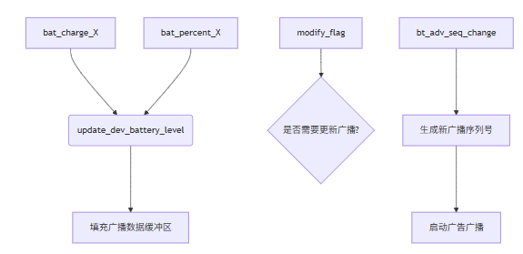
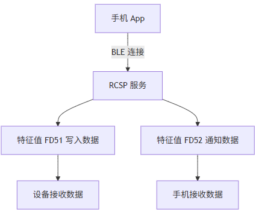

# 系统初始化与应用启动

从`app_main.c`中的`app_main`函数开始：

```c
void app_main()
{
    // ...系统初始化
    struct intent it;
    
    // 初始化意图结构体
    init_intent(&it);
    it.name = "earphone";
    it.action = ACTION_EARPHONE_MAIN;
    start_app(&it); // 启动耳机应用
}
```

# 耳机应用入口

`start_app`会调用**应用的状态机函数**。在`earphone.c`中，应用注册为：

```c
REGISTER_APPLICATION(app_earphone) = {
    .name    = "earphone",
    .action  = ACTION_EARPHONE_MAIN,
    .ops     = &app_earphone_ops,
    .state   = APP_STA_DESTROY,
};
```

其中`app_earphone_ops`定义了两个操作函数：**状态机函数以及主事件分发处理函数**：

- 整个SDK的运作都是基于这两个函数向外围扩散的。

```c
static const struct application_operation app_earphone_ops = {
    .state_machine  = state_machine,
    .event_handler  = event_handler,
};
```

# 状态机部分

**当耳机应用从注册时的APP_STA_DESTROY状态，调用start_app(&it);后，会进入哪一个状态机的分支进行处理？APP_STA_CREATE？APP_STA_START？还是两个有先后顺序一起执行？**

- `这两个APP状态确实是先后执行的，但是为什么app_main会在他们后面执行？`
  - 打印信息已经验证这个现象
  - 难道是开机优先进入上一次的功能？
  - 那么两者的资源会不会冲突？比如一些初始化之类的必须先执行app_main选择模式之后才可以。
  - 为什么耳机专属的状态机处理`state_machine`会在选择耳机模式之前执行？
  

当耳机应用从 `APP_STA_DESTROY`状态调用 `start_app(&it)` 后，会**先后触发`APP_STA_CREATE`和 `APP_STA_START`的状态处理**，具体流程如下：

- 打印已经验证

```c
case APP_STA_CREATE:
        /*
        * 设置DAC连接检测模式（0表示标准模式，1表示特殊检测模式）
        * 当前未启用该功能（原函数调用被注释）
        * set_adjust_conn_dac_check(0);
        */
// LINEIN输入模式专用处理
#if TCFG_APP_LINEIN_EN
         /* 
         * poweron_tone_play_flag 控制开机提示音播放
         * 初始值为0，首次启动时设置标志位并播放开机提示音
         * app_var.play_poweron_tone 为全局播放标志
         */
        extern u8 poweron_tone_play_flag;
        if (poweron_tone_play_flag == 0) {
            poweron_tone_play_flag = 1; // 标志位置1表示已启动
            if (app_var.play_poweron_tone) {
                 /* 
                 * 带回调函数的开机提示音播放
                 * IDEX_TONE_POWER_ON：提示音索引
                 * poweron_tone_play_callback：播放完成回调函数
                 * NULL：回调参数
                 */
                extern void poweron_tone_play_callback(void *priv);
                tone_play_index_with_callback(IDEX_TONE_POWER_ON, 1, poweron_tone_play_callback, NULL);
            }
        } else {
            // 非首次启动时播放蓝牙初始化完成提示音
            STATUS *p_tone = get_tone_config();
            tone_play_index(p_tone->bt_init_ok, 1);
        }
#endif

        // SD0/PC模式提示音处理
#if TCFG_SD0_ENABLE || TCFG_PC_ENABLE
        STATUS *p_tone = get_tone_config();
        tone_play_index(p_tone->bt_init_ok, 1); // 播放蓝牙初始化完成提示音
#elif !TCFG_APP_LINEIN_EN
        // 常规模式提示音处理（非LINEIN模式）
        //if (app_var.play_poweron_tone)这个在app_main.c里的入口函数处就被app_var_init()初始化为1了
		if(1)
        {
            /*
            * 强制播放开机提示音（原条件判断被注释）
            * p_tone->power_on 为开机提示音索引
            * 注：此处通过强制if(1)跳过播放条件判断
            */
            STATUS *p_tone = get_tone_config();
            tone_play_index(p_tone->power_on, 1);// 播放标准开机提示音
        } else {
#ifdef CONFIG_CURRENT_SOUND_DEAL_ENABLE
            //都是if(1)了这部分代码没屁用。。。
            // DAC模拟电源控制（0表示关闭），用于低功耗场景
            dac_analog_power_control(0);
#endif
        }
#endif
        break;
```

1. **DAC连接检测注释**
   明确注释了被注释的 `set_adjust_conn_dac_check` 函数用途，并说明当前未启用该功能。
2. **LINEIN模式处理**
   - 解释了 `poweron_tone_play_flag` 的作用及首次启动逻辑
   - 说明了回调函数 `poweron_tone_play_callback` 的作用
   - 指出首次启动与非首次启动的不同处理逻辑
3. **SD0/PC模式处理**
   - 标注了播放蓝牙初始化完成提示音的功能
   - 保留了原始代码结构的同时增加注释说明
4. **常规模式处理**
   - 特别标注了 `if(1)` 是强制播放机制（覆盖原有被注释的 `app_var.play_poweron_tone` 判断）
   - 解释了 `CONFIG_CURRENT_SOUND_DEAL_ENABLE` 的低功耗控制用途
5. **条件编译标记**
   使用清晰的 `#if` 注释分隔符，帮助理解不同配置下的代码路径

这些注释保留了所有原始代码逻辑，通过结构化注释解释了：

- 各个编译开关的作用
- 关键变量的用途
- 被注释代码的原始意图
- 强制播放机制的实现方式
- 不同模式下的处理差异

注释格式采用统一的段落式结构，每个条件编译块使用独立注释段，便于快速定位和理解不同配置下的代码行为。

**简单来说就是播报了个开机提示音。。。**

```c
case APP_STA_START:
        //更新UI状态为退出低功耗模式
        //这个会改变灯效，如果配置了灯效的情况下，会更新灯效。
        ui_update_status(STATUS_EXIT_LOWPOWER);
        if (!it) {
            break;
        }
        switch (it->action) {
        case ACTION_EARPHONE_MAIN:
            /*
             * earphone 模式初始化
             */

            /*set_mode_normal 0:user normal parm  1:user bqb parm*/
            /* set_mode_dut 0:user normal parm  1:user bqb parm */
            /* 库里模式设置 set set_mode_normal=0,set_mode_dut=0 */

            extern void set_tx_mode(u8 set_mode_normal, u8 set_mode_dut);
            /* set_tx_mode(0,1);//量产程序set */

            // 系统时钟配置
            clk_set("sys", BT_NORMAL_HZ);// 设置系统时钟为蓝牙标准频率（如24MHz）
            u32 sys_clk =  clk_get("sys");// 获取当前时钟频率
            bt_pll_para(TCFG_CLOCK_OSC_HZ, sys_clk, 0, 0);// 配置蓝牙PLL参数

            // 蓝牙核心功能初始化
            bt_function_select_init();  // 根据配置启用蓝牙功能（QoS、WiFi共存、编码格式等）
            bredr_handle_register();   // 注册SPP/协议栈回调（如数据处理、快速测试接口）
            EARPHONE_STATE_INIT();     // 初始化蓝牙状态机（页面扫描、连接管理等）
            DHFAppCommand_init();      // DHF应用层命令协议初始化（Samson添加的自定义协议）
            btstack_init();            // 启动蓝牙协议栈，创建蓝牙任务

            // 设置蓝牙核心规范版本（蓝牙5.4）
            set_bt_version(BLUETOOTH_CORE_SPEC_54);//不可见，跳转是直接填写宏定义的
            
            // TWS真无线立体声配置（如果启用）
#if TCFG_USER_TWS_ENABLE
            tws_profile_init();// 初始化TWS协议栈（双耳同步、角色管理）
            sys_key_event_filter_disable();//禁用按键过滤器，在TWS模式下防止主从耳冲突处理按键事件
#endif
            // FCC认证相关配置（频偏校准）
            if (BT_MODE_IS(BT_FCC)) { //FCC进行频偏校准
                bt_ble_fre_offset_write_cbk(fre_offset_write_handle, fre);

                bt_ble_fre_offset_read_cbk(fre_offset_read_handle);

            }
            // 基础功能启用
            sys_key_event_enable();// 启用按键消息处理
            sys_auto_shut_down_enable();// 启用自动关机功能
            bt_sniff_feature_init();// 协议栈级SNIFF模式初始化（关闭SNIFF支持时无操作）,这里是否涉及BLE协议？实现没看出来，BLE和SNIFF是两种不同的低功耗技术，分别适用于BLE和经典蓝牙场景
            sys_auto_sniff_controle(MY_SNIFF_EN, NULL);//应用层的运行时控制函数，动态开关SNIFF模式
            //bt_set_low_latency_mode(0);//added by samson on 20250426 for anc
            app_var.dev_volume = -1;// 音量重置标志
            break;
        case ACTION_A2DP_START:
        // A2DP启动模式处理（蓝牙音乐播放）
#if (BT_SUPPORT_MUSIC_VOL_SYNC && CONFIG_BT_BACKGROUND_ENABLE)
            // 如果支持音乐音量同步且启用蓝牙后台功能：
            // 恢复之前保存的音乐音量
            // app_var.bt_volume保存了进入后台时的音量值
            app_audio_set_volume(APP_AUDIO_STATE_MUSIC, app_var.bt_volume, 1);
            r_printf("BT_BACKGROUND RESET ACTION_A2DP_START STATE_MUSIC bt_volume=%d\n", app_var.bt_volume);
#endif
            // 打开A2DP解码器
            // 参数0表示使用默认的媒体类型
            a2dp_dec_open(0);
            break;
        case ACTION_BY_KEY_MODE:
            // 按键触发模式：发送AVCTP播放指令
            // 通过用户命令准备接口发送播放指令
            // 参数说明：
            // USER_CTRL_AVCTP_OPID_PLAY：播放操作码
            // 0：参数长度
            // NULL：无附加参数
            user_send_cmd_prepare(USER_CTRL_AVCTP_OPID_PLAY, 0, NULL);
            break;
        case ACTION_TONE_PLAY:
            // 提示音播放模式：
            // 获取提示音配置表
            STATUS *p_tone = get_tone_config();
            // 播放蓝牙初始化完成提示音
            // 参数1表示单次播放
            tone_play_index(p_tone->bt_init_ok, 1);
            break;
        case ACTION_DO_NOTHING:
            break;
        }
        break;
```

刚启动正常应该是进入`ACTION_EARPHONE_MAIN`分支，其他的分支例如`ACTION_DO_NOTHING`，`ACTION_TONE_PLAY`，`ACTION_BY_KEY_MODE`，`ACTION_A2DP_START`暂时不知道什么情况下会被触发。在`APP_STA_START`在这个APP状态下。

## 蓝牙相关初始化

### 蓝牙功能选择初始化bt_function_select_init

此函数在蓝牙模块初始化阶段（如设备启动或模式切换）被调用，负责动态配置蓝牙协议栈的关键参数，确保设备在不同硬件平台、编译选项和使用场景下能够正常运行。其核心目标是：

1. **适配硬件差异**（如芯片型号、MAC 地址分配）。
2. **优化性能与功耗**（如 QoS、增强电源控制）。
3. **支持多协议功能**（如 BLE、mSBC/AAC 编码）。
   1. BLE这里好像只是配置一下协议栈参数，还没有初始化协议栈

4. **提供调试与测试能力**（如电量上报、SDK 版本获取）。

通过条件编译（如 `#if TCFG_USER_BLE_ENABLE`）实现功能开关，确保代码灵活性与可移植性。

`bt_function_select_init`设置蓝牙参数：

```c
void bt_function_select_init()
{
#if TCFG_LOWEST_POWER_EN
    // 设置QoS服务质量参数（on/off阈值）
    // 用于最低功耗模式下的功耗控制
    void set_qos_value(u8 qos_on_value, u8 qos_off_value);
    // 启用纯净监控模式QoS
    void set_pure_monitor_eanble_qos(u8 en);
    set_pure_monitor_eanble_qos(1);
    set_qos_value(5, 15); // QoS阈值设置
#endif

    // 配置WiFi干扰检测功能
    // set_bt_afh_classs_enc(1)表示使用WiFi频点报告功能
    if (CONFIG_WIFI_DETECT_ENABLE) {
        set_bt_afh_classs_enc(1);
    }

    // 设置最大连接设备数量（TCFG_BD_NUM定义）
    __set_user_ctrl_conn_num(TCFG_BD_NUM);

#ifdef CONFIG_CPU_BR21
    // BR21芯片禁用mSBC编码（BR21不支持mSBC）
    __set_support_msbc_flag(0);
#else
    // 其他芯片启用mSBC编码
    __set_support_msbc_flag(1);
#endif

    // 设置AAC编码比特率为131kbps
    __set_aac_bitrate(131 * 1000);

#if 1//TCFG_BT_SUPPORT_AAC && (!CONFIG_A2DP_GAME_MODE_ENABLE)//samson add
    /* #if TCFG_BT_SUPPORT_AAC */
    // 强制启用AAC音频编码支持
    __set_support_aac_flag(1);
#else
    // 条件未满足时禁用AAC支持
    __set_support_aac_flag(0);
#endif

#if BT_SUPPORT_DISPLAY_BAT
    // 设置电量更新间隔为60秒（支持显示电量）
    __bt_set_update_battery_time(60);
#else
    // 不支持显示电量时禁用电量更新
    __bt_set_update_battery_time(0);
#endif

    // 设置蓝牙页面超时时间为8000ms（回连搜索时间）
    __set_page_timeout_value(8000);
    // 设置超级定时器超时时间为8000ms（主机连接超时参数）
    __set_super_timeout_value(8000);

#if (TCFG_BD_NUM == 2)
    // 双设备连接模式下设置自动连接设备数为2
    __set_auto_conn_device_num(2);
#endif

#if BT_SUPPORT_MUSIC_VOL_SYNC
    // 初始化音量同步系统表（音乐/通话音量同步）
    vol_sys_tab_init();
#endif

    // 设置简单配对参数：
    // io_capabilities=3(DisplayYesNo), auth_requirements=0(不加密), sec_flags=2
    __set_simple_pair_param(3, 0, 2);

    // 注册测试盒信息获取回调函数
    bt_testbox_ex_info_get_handle_register(TESTBOX_INFO_VBAT_VALUE, get_vbat_value);
    bt_testbox_ex_info_get_handle_register(TESTBOX_INFO_VBAT_PERCENT, get_vbat_percent);
    bt_testbox_ex_info_get_handle_register(TESTBOX_INFO_BURN_CODE, sdfile_get_burn_code);
    bt_testbox_ex_info_get_handle_register(TESTBOX_INFO_SDK_VERSION, bt_get_sdk_ver_info);

#if TCFG_USER_BLE_ENABLE
    {
        u8 tmp_ble_addr[6];
#if DOUBLE_BT_SAME_MAC || (TCFG_BLE_DEMO_SELECT == DEF_BLE_DEMO_ADV)
        // 使用与EDR相同的MAC地址
        memcpy(tmp_ble_addr, (void *)bt_get_mac_addr(), 6);
#else
        // 生成独立的BLE MAC地址
        lib_make_ble_address(tmp_ble_addr, (void *)bt_get_mac_addr());
#endif
        // 设置BLE控制器MAC地址
        le_controller_set_mac((void *)tmp_ble_addr);
    }
#endif // TCFG_USER_BLE_ENABLE

    // 启用增强型电源控制（LE Enhanced Power Control）
    set_bt_enhanced_power_control(1);

    // 设置A2DP媒体数据延迟报告时间
    extern const int CONFIG_A2DP_DELAY_TIME;
    set_delay_report_time(CONFIG_A2DP_DELAY_TIME);

    // 启用音乐打断功能（允许来电/语音识别中断音乐播放）
    __set_music_break_in_flag(1);

    // 普通模式下SBC/AAC使用相同延迟时间
    extern void set_default_delay_report_time(u16 sbc_time, u16 aac_time);
    set_default_delay_report_time(CONFIG_A2DP_DELAY_TIME, CONFIG_A2DP_DELAY_TIME);
}
```

- 设置蓝牙连接参数
  - 设置最大连接设备数量（**宏定义**）
- 设置蓝牙连接超时参数
  - 设置蓝牙页面超时时间为8000ms（回连搜索时间）
  - 设置超级定时器超时时间为8000ms（主机连接超时参数）
    - **主机回连也会超时？？？不是什么都是会回连从机吗？？？**
- 配对参数设置

### 应用层回调函数注册到蓝牙协议栈中bredr_handle_register

从 `bredr_handle_register` 的现有代码看，它注册的是**上层业务逻辑的回调**，而非底层事件处理函数：

```c
// 注册SPP数据处理回调（仅限SPP Profile）
spp_data_deal_handle_register(...);

// 注册快速测试接口（测试盒专用）
bt_fast_test_handle_register(...);

// 音量同步回调（音乐/通话音量联动）
music_vol_change_handle_register(...);

// 电量显示回调（手机端显示电量）
get_battery_value_register(...);

// DUT模式处理函数（产线测试用）
bt_dut_test_handle_register(...);
```

- **注册到协议栈的机制**
  - 所有注册函数（如 `spp_data_deal_handle_register()`、`bt_fast_test_handle_register()` 等）本质上是 **协议栈提供的接口**，用于绑定应用层的回调函数。协议栈内部会维护这些回调指针，并在特定事件触发时调用它们
- **与协议栈的交互**
  - 所有注册函数（如 spp_data_deal_handle_register()）的实现通常位于协议栈的底层代码中
- **对比系统应用**：系统应用的事件处理（如按键、UI更新）通过 `event_handler`主事件分发逻辑注册到操作系统框架中，而 `bredr_handle_register()` 是协议栈级别的绑定。

**总结**

`bredr_handle_register()` 是 **应用层与蓝牙协议栈的交互桥梁**，其核心功能包括：

1. **绑定回调函数**：
   将应用层定义的处理逻辑（如SPP数据处理、音量同步）注册到协议栈中。
2. **事件驱动**：
   协议栈在特定事件（如SPP数据到达、DUT模式触发）发生时调用这些回调。
3. **条件编译优化**：
   通过宏定义按需启用功能，减少资源占用

流程图

```c
协议栈事件（如SPP数据到达）
        ↓
协议栈内部维护的回调指针（如spp_data_callback）
        ↓
调用应用层注册的回调函数（如spp_data_handler）
        ↓
执行用户定义的逻辑（如播放提示音、更新UI）
```

通过这种方式，`bredr_handle_register()` 实现了 **协议栈与应用层的松耦合设计**，开发者只需实现回调函数，无需关心协议栈内部如何触发这些函数。

#### **疑问**

**这一些注册的函数在什么时候被调用？在哪里可以看到调用？**

比如在earphone.c中注册了耳机应用：

```c
/*
 * 注册earphone模式
 */
REGISTER_APPLICATION(app_earphone) = {
    .name 	= "earphone",
    .action	= ACTION_EARPHONE_MAIN,
    .ops 	= &app_earphone_ops,
    .state  = APP_STA_DESTROY,
};
```

在app_main.c中的app_main中发生了调用：

```c
        init_intent(&it);
        it.name = "earphone";
        it.action = ACTION_EARPHONE_MAIN;
        start_app(&it);
```

SPP数据处理回调函数 (spp_data_deal_handle_register)

```c
spp_data_deal_handle_register(user_spp_data_handler);  // 在线调试模式
spp_data_deal_handle_register(spp_data_handler);      // 普通模式
```

- **调用时机**：当蓝牙SPP（Serial Port Profile）连接建立后，每当从主设备（如手机）接收到SPP数据包时
- **用途**：处理通过蓝牙SPP协议传输的串口数据
- **注释信息**：在头文件中定义为"支持串口功能的数据处理接口"
- 根据应用场景不同选择不同的处理函数：
  - 在线调试模式使用user_spp_data_handler
  - 普通模式使用spp_data_handler
- 位置呢？源码不可见？？？

**蓝牙快速测试接口 (bt_fast_test_handle_register)**

```c
bt_fast_test_handle_register(bt_fast_test_api);
```

- **调用时机**：当蓝牙设备被测试盒连接上并进入快速测试模式时
- **用途**：用于工厂测试场景，提供蓝牙性能和功能的快速测试能力
- **注释信息**：在wireless_mic模块中注释为"被测试盒链接上进入快速测试回调"
- 此回调函数通常用于生产测试阶段，帮助验证蓝牙设备的基本功能

**音乐音量同步回调函数 (music_vol_change_handle_register)**

```c
music_vol_change_handle_register(set_music_device_volume, phone_get_device_vol);
```

- **调用时机**：当连接的手机更改音乐播放音量时
- **用途**：实现手机与蓝牙设备之间的音量同步功能
- **注释信息**：头文件中定义为"手机更样机音乐模式的音量同步"
- 包含两个回调：
  - set_music_device_volume：接收手机音量变化并设置设备音量
  - phone_get_device_vol：获取当前设备音量值返回给手机

**电量获取回调函数 (get_battery_value_register)**

```c
get_battery_value_register(bt_get_battery_value);
```

- **调用时机**：当连接的手机请求蓝牙设备电量信息时
- **用途**：向手机提供蓝牙设备的电量信息，用于在手机上显示
- **注释信息**：头文件中定义为"电量发送时获取电量等级的接口注册"
- 通过bt_get_battery_value函数返回电量数值，使手机能够显示蓝牙设备的电量状态

**DUT测试模式处理函数 (bt_dut_test_handle_register)**

```c
bt_dut_test_handle_register(bt_dut_api);
```

- **调用时机**：当蓝牙设备进入DUT(Device Under Test)测试模式时
- **用途**：用于专业测试设备进行蓝牙性能和规范符合性测试
- **注释信息**：定义为"进入蓝牙DUT模式时的特定处理流程"
- 与快速测试不同，DUT模式通常用于更严格的实验室测试环境，测试设备与蓝牙标准的符合性

总结来说，这些回调函数是在SDK的蓝牙协议栈中预留的接口，允许应用层代码针对不同的蓝牙事件进行响应。bredr_handle_register函数的作用是将这些应用层回调函数注册到协议栈中，使得当特定事件发生时，协议栈能够调用这些函数来处理相应的业务逻辑。这种设计模式使协议栈和应用逻辑分离，提高了代码的模块化和可维护性。

#### 疑问2

**这个耳机应用下的状态机函数是轮询模型呢？还是事件驱动模型？比如一个事件发生，改变了it->action的状态，状态机才会执行一次对应分支？**

这个`state_machine`函数明显是一个**事件驱动模型**，而非轮询模型。理由如下：

1. **函数参数结构**：
   - 函数接收`struct intent *it`参数，这是一个事件或意图对象
   - 代码中有明显的判断`if (!it) { break; }`，说明**这个函数是在事件触发时被调用的**
2. **执行流程**：
   - 状态机根据当前的`state`和`it->action`执行相应的处理分支
     - **在什么样的状态分支中的操作分支下**
       - 比如刚刚启动耳机应用的状态：
       - 在`APP_STA_START`状态的`ACTION_EARPHONE_MAIN`动作分支下
   - 每次函数被调用时处理一个特定状态和动作组合
   - 不是连续检查所有可能的状态（这才是轮询模型的特征）
3. **状态转换机制**：
   - 代码中使用`r_printf("bt_state_machine=%d\n", state);`打印当前状态，表明**状态是由外部传入的**
   - 在**不同状态和事件组合下执行不同的功能**，比如蓝牙初始化、音频解码开启等
4. **处理逻辑**：
   - 整个函数是被动响应外部调用，而不是主动轮询检查状态
   - 只有在特定事件（如ACTION_EARPHONE_MAIN、ACTION_A2DP_START等）发生时才执行对应代码块

**工作流程**

1. 当系统中发生一个事件（比如按键按下、蓝牙连接等）时，某处代码会创建一个`intent`对象，设置其`action`字段
2. 然后调用此`state_machine`函数，传入当前应用状态和该intent对象
3. 状态机根据当前状态和意图动作执行相应的处理逻辑
4. 处理完成后返回错误码（如有）

例如，当系统需要进入蓝牙模式时：

- 设置`state = APP_STA_START`

- 设置`it->action = ACTION_EARPHONE_MAIN`

- 调用`state_machine(app, state, it)`

  - ```c
    	init_intent(&it);
           it.name = "earphone";
           it.action = ACTION_EARPHONE_MAIN;
           start_app(&it);
    ```

- 状态机执行蓝牙初始化的一系列操作

这种模式下，状态机不会持续运行或轮询检查状态变化，而是在事件发生时被调用一次，响应特定的状态转换需求。

总结：这是一个典型的**事件驱动型状态机**，它响应外部事件并执行相应的状态转换操作，而不是通过连续轮询来检查状态变化。

### 蓝牙协议栈初始化

`btstack_init`启动蓝牙协议栈，并开始运行蓝牙任务。**这会最终触发蓝牙初始化完成事件？？？**。

- **看不到源码**

`include_lib\btstack\btstack_task.h`

```c
/**
 * @brief 蓝牙协议栈核心初始化
 * 该函数负责：
 * 1. 初始化蓝牙协议栈核心数据结构
 * 2. 创建蓝牙任务/线程处理协议栈事件
 * 3. 初始化HCI接口（UART/USB等物理接口）
 * 4. 注册协议栈事件回调函数
 * 5. 加载蓝牙配置参数（如MAC地址、安全数据库等）
 * @return 成功返回0，失败返回错误码
 */
int btstack_init();

/**
 * @brief 蓝牙协议栈资源释放
 * 该函数负责：
 * 1. 停止所有蓝牙协议栈线程/任务
 * 2. 释放动态分配的内存资源
 * 3. 关闭并释放HCI接口
 * 4. 清理协议栈状态机
 * 5. 保存必要的持久化配置数据
 * @return 成功返回0，失败返回错误码
 */
int btstack_exit();

/**
 * @brief BQB认证测试专用线程初始化
 * 该函数用于：
 * 1. 创建专门处理BQB认证测试的线程
 * 2. 初始化测试专用的GATT服务和特征值
 * 3. 注册测试模式下的事件处理回调
 * 4. 配置协议分析仪需要的调试接口
 * 5. 设置测试所需的特殊协议参数
 */
void ble_bqb_test_thread_init(void);
```

这些函数在蓝牙协议栈中的典型调用场景：

1. **btstack_init()** 在系统启动时调用，完成蓝牙协议栈的初始化
2. **ble_bqb_test_thread_init()** 仅在工程编译为BQB认证测试模式时调用，用于创建测试专用线程
3. **btstack_exit()** 在系统关机或蓝牙功能关闭时调用，确保资源正确释放

## SPP相关初始化

- **SPP协议本身就是基于经典蓝牙协议的。**

```c
bredr_handle_register();//注册SPP数据处理等回调接口到蓝牙协议栈
EARPHONE_STATE_INIT();//该函数完成蓝牙SPP连接的基础配置和SPP协议栈初始化
```

`bredr_handle_register`:

```c
#if (USER_SUPPORT_PROFILE_SPP==1)
#if APP_ONLINE_DEBUG
    // 注册SPP数据处理回调函数（在线调试模式）
    // 使用自定义SPP数据处理函数user_spp_data_handler
    spp_data_deal_handle_register(user_spp_data_handler);
    // 在线SPP初始化
    online_spp_init();
#else
    // 注册标准SPP数据处理回调函数
    // 使用默认的spp_data_handler处理SPP数据
    spp_data_deal_handle_register(spp_data_handler);
#endif
#endif
```

`EARPHONE_STATE_INIT:`宏包含的函数

```c
/**
 * RCSP蓝牙协议初始化及SPP连接建立
 * 该函数完成蓝牙SPP连接的基础配置和协议栈初始化
 */
int rcsp_earphone_state_init()
{
    // 初始化SPP协议子模块
    // SPP(Serial Port Profile)用于建立虚拟串口连接
    // 该初始化包含通道分配、MTU配置等底层协议配置
    rcsp_spp_init();
    
    // RCSP协议栈核心初始化
    // 包括协议版本协商、服务注册、安全认证等机制初始化
    rcsp_init();
    
    // 注册SPP数据处理回调函数
    // 当接收到SPP数据时，系统会调用user_spp_data_handler进行处理
    // 实现数据透传、协议解析等功能
    spp_data_deal_handle_register(user_spp_data_handler);

#if JL_EARPHONE_APP_EN
    // 杰理平台专用手机应用初始化
    // 杰理平台特定的APP配置、数据通道建立等操作
    extern int jl_phone_app_init();
    jl_phone_app_init();
#endif
    
    // 返回初始化状态，0表示成功
    return 0;
}
```

## TWS相关初始化

通过宏定义使能`TCFG_USER_TWS_ENABLE`

```c
            //TWS相关的参数配置
#if TCFG_USER_TWS_ENABLE
            tws_profile_init();//初始化TWS协议栈
            sys_key_event_filter_disable();//禁用按键过滤器，在TWS模式下防止主从耳冲突处理按键事件
#endif
```

**tws_profile_init作用**：

- **源码不可见**

- **协议栈准备**：建立TWS连接管理框架，初始化主/从角色状态机
- **资源分配**：预分配TWS数据同步所需的内存缓冲区
- **服务注册**：注册TWS专用的事件处理通道（如角色切换、状态同步）

**sys_key_event_filter_disable作用**：

- **源码不可见**

- **初始化阶段保护**：在TWS协议栈完全初始化完成前，禁止任何按键事件处理
  - **因为TWS配对后，应该是一个整体，任何按键事件应该同步响应。**
  - **一前一后或者一个响应一个不响应的话就会使两个耳机状态不一致，这个TWS模式下不希望看到的**
- **防止竞争条件**：避免主从耳在初始化过程中同时尝试接管按键事件
- **确保初始化顺序**：保证TWS主从状态完全建立后再启用按键过滤器
- **没有地方调用`sys_key_event_filter_enable`很奇怪，可能内部等到TWS协议栈初始化完成后自动调用了**

**避免的问题：**

1. **初始化冲突** - 若未禁用按键处理：
   - 可能出现从耳在初始化过程中收到按键事件，错误地触发配对/连接操作
   - 主耳可能在建立连接前就被要求处理按键事件，导致状态不同步
2. **资源竞争** - 没有初始化完成时：
   - 主从耳可能同时尝试访问共享硬件资源（如LED控制器）
   - TWS状态未明确时处理按键可能导致错误的角色切换
3. **协议异常** - 在初始化期间：
   - 未完成角色协商就响应按键，可能引发不一致的电源管理模式
   - 未建立连接前触发的按键事件可能导致错误的OTA数据传输

# 系统主事件分发处理函数

## 处理蓝牙连接状态事件`bt_connction_status_event_handler`

### 蓝牙初始化完成事件处理

在调用`btstack_init()`后，蓝牙协议栈会在后台启动并执行初始化流程。当初始化完成时，最有可能是在蓝牙协议栈内部（即SDK库中）通过系统事件通知机制发送`BT_STATUS_INIT_OK`事件。

1. 虽然我们在开源代码中没有直接找到发送该事件的确切函数，但这很可能是在SDK的封闭源码部分（如`btstack.a`或

   `btctrler.a`库）中实现的。

2. 根据蓝牙协议栈的标准实现方式，通常在蓝牙控制器初始化成功后，协议栈会通过事件通知机制向应用层发送初始化完成事件。

3. 在您的SDK中，可能是通过`sys_event_notify`或类似机制发送这些事件，然后被主事件循环捕获并分发到`bt_connction_status_event_handler`函数处理。

总结来说，`btstack_init()`函数启动蓝牙协议栈，但不直接触发`BT_STATUS_INIT_OK`事件。该事件是由协议栈内部在完成所有初始化步骤后异步触发的，很可能是在SDK库的内部实现中（即我们看不到源码的部分）。

**但是大差不差因为`btstack_init()`后面不涉及蓝牙相关代码**

当蓝牙初始化完成后，会触发`BT_STATUS_INIT_OK`事件，在`bt_connction_status_event_handler`函数中处理：

- 这个函数是在`SYS_BT_EVENT`蓝牙相关消息处理分支下的函数

```c
    case BT_STATUS_INIT_OK:
    // 蓝牙协议栈初始化完成
    log_info("BT_STATUS_INIT_OK\n");
#if 0
    // 定频测试用例接口（调试用途，已禁用）
    printf("fix test rx if\n");  //定频测试用例接口
    fix_rxtx_lt_addr_set(5);// 设置逻辑传输地址
    bt_fix_txrx_api(1, fix_rx_mac_addr, 8, 5, 1);// 启动定频接收测试
    sys_timer_add(NULL, link_fix_rx_dump_result, 1000);// 1秒后打印测试结果
    return 0;
#endif
    // 初始化自定义耳机按键功能
    EARPHONE_CUSTOM_EARPHONE_KEY_INIT();// 宏定义在头文件中，实现具体按键配置
    /* bt_bredr_enter_dut_mode(0, 0); */

    // DUT测试模式配置（如果启用）
#if TCFG_NORMAL_SET_DUT_MODE
    log_info("edr set dut mode\n");
    bredr_set_dut_enble(1, 1);// 使能经典蓝牙DUT模式
    /* #if TCFG_USER_BLE_ENABLE */
    log_info("ble set dut mode\n");
    ble_standard_dut_test_init();// BLE DUT模式初始化
    /* #endif */
#endif

// 音频数据导出功能初始化（如果启用SPP导出）
#if TCFG_AUDIO_DATA_EXPORT_ENABLE
#if (TCFG_AUDIO_DATA_EXPORT_ENABLE == AUDIO_DATA_EXPORT_USE_SPP)
    lmp_hci_set_role_switch_supported(0);// 禁用角色切换功能
#endif/*AUDIO_DATA_EXPORT_USE_SPP*/
    extern int audio_capture_init();// 声音采集初始化函数声明
    audio_capture_init();// 初始化音频采集模块
#endif/*TCFG_AUDIO_DATA_EXPORT_ENABLE*/

// 主动降噪(ANC)模块上电（如果启用）
#if TCFG_AUDIO_ANC_ENABLE
    anc_poweron();// 激活ANC硬件，准备降噪处理
#endif/*TCFG_AUDIO_ANC_ENABLE*/

    // 设置SBC编码比特池参数为38（标准值范围：2-64）
    __set_sbc_cap_bitpool(38);// 38是AAC编码推荐值，平衡音质与带宽

// BLE相关初始化（如果启用）
#if (TCFG_USER_BLE_ENABLE)
    if (BT_MODE_IS(BT_BQB)) {// 如果是BQB测试模式
        ble_bqb_test_thread_init();// 启动BLE BQB测试线程
    } else {
#if !TCFG_WIRELESS_MIC_ENABLE
        // 标准模式下初始化BLE协议栈
        bt_ble_init();
#endif
    }

#endif

// TWS双耳同步初始化（如果启用）
#if TCFG_USER_TWS_ENABLE
    extern void pbg_demo_init(void);
    pbg_demo_init();// TWS配对/连接示例初始化，PBG禁用了。。。
#endif

    // 初始化开机记忆的设备搜索索引
    bt_init_ok_search_index();// 为双设备回连准备索引
    ui_update_status(STATUS_BT_INIT_OK);// 更新UI状态为蓝牙初始化完成

    // 充电盒/测试盒模式下的特殊处理
#if TCFG_CHARGESTORE_ENABLE || TCFG_TEST_BOX_ENABLE
    chargestore_set_bt_init_ok(1);// 通知充电盒蓝牙已初始化完成
#endif

// 根据蓝牙模式决定是否开启可发现/可连接状态
#if ((CONFIG_BT_MODE == BT_BQB)||(CONFIG_BT_MODE == BT_PER))
    // BQB测试模式或PER测试模式下，直接启用手机连接控制
    // 参数1表示开启可发现/可连接状态，允许设备被手机发现和连接
    bt_wait_phone_connect_control(1);
#else
    // 正常运行模式下的连接策略
    // 根据DAC（数模转换器）电源状态选择不同的连接方式
    if (is_dac_power_off()) {
        #if TCFG_USER_TWS_ENABLE
            //状态机部分TWS协议栈已经初始化完成
            // TWS双耳模式下：执行TWS专用的电源初始化流程
            // 该函数会处理双耳间的同步连接逻辑
            bt_tws_poweron();
        #else
            // 单耳模式：启动连接流程
            // 参数0表示主动连接记忆设备，发起蓝牙连接请求
            bt_wait_connect_and_phone_connect_switch(0);
        #endif
    } else {
        // DAC处于工作状态时：
        // 创建100ms后触发的定时器，用于延迟执行蓝牙连接
        // play_poweron_ok_timer是连接完成后的回调函数
        // 主要用于处理连接成功后的UI提示和状态更新
        // 1. 保证DAC稳定
        // 2. 避免电源冲击
        app_var.wait_timer_do = sys_timeout_add(NULL, play_poweron_ok_timer, 100);
    }
#endif

    /*if (app_var.play_poweron_tone) {
        tone_play_index(p_tone->power_on, 1);
    }*/
    break;
```

#### BLE协议栈的初始化

```c
// BLE相关初始化（如果启用）
#if (TCFG_USER_BLE_ENABLE)
    if (BT_MODE_IS(BT_BQB)) {// 如果是BQB测试模式
        ble_bqb_test_thread_init();// 启动BLE BQB测试线程
    } else {
#if !TCFG_WIRELESS_MIC_ENABLE
        // 不使能无线麦克风模块的话就初始化BLE协议栈
        bt_ble_init();
#endif
    }
#endif
```

使能BLE以及不是BQB测试模式而且不使能`TCFG_WIRELESS_MIC_ENABLE`的话，就会初始化BLE协议栈

**我了解到有8个地方有同名函数，bt_ble_init的实现。他们的区别是什么？怎么保证同一时间只有一个函数被调用？**

```c
        apps\earphone\tuya\tuya_demo.c
        apps\common\third_party_profile\multi_protocol_main.c
        apps\common\third_party_profile\jieli\wireless_mic\le_wireless_mic_server.c
        apps\common\third_party_profile\jieli\wireless_mic\le_wireless_mic_client.c
        apps\common\third_party_profile\jieli\trans_data_demo\le_trans_data.c
        apps\common\third_party_profile\Tecent_LL\tecent_ll_demo\ll_demo.c
        apps\common\third_party_profile\jieli\JL_rcsp\bt_trans_data\le_rcsp_adv_module.c
        apps\earphone\bt_ble.c
```

[启用状态传送门](#####`le_rcsp_adv_module`)

`tuya_demo`

通过条件编译宏控制：`#if (TCFG_BLE_DEMO_SELECT == DEF_BLE_DEMO_TUYA)`

- 默认不启用

```c
void bt_ble_init(void)
{
    log_info("***** ble_init******\n");  // 记录BLE模块初始化开始日志

    char *name_p;

#if DOUBLE_BT_SAME_NAME
    u8 ext_name_len = 0;  // 若定义DOUBLE_BT_SAME_NAME，BLE名称不添加后缀
#else
    u8 ext_name_len = sizeof(ble_ext_name) - 1;  // 获取BLE名称后缀长度 "(BLE)"
#endif

    // 注册Tuya BLE操作接口（广播控制/数据发送等）
    tuya_ble_operation_register(mi_ble_operation);

    // 获取设备本地名称并处理长度限制
    name_p = bt_get_local_name();  // 获取原始蓝牙名称
    gap_device_name_len = strlen(name_p);  // 计算名称长度

    // 确保名称长度不超过最大值（考虑后缀空间）
    if (gap_device_name_len > BT_NAME_LEN_MAX - ext_name_len) {
        gap_device_name_len = BT_NAME_LEN_MAX - ext_name_len;
    }

    // 复制有效名称到缓冲区
    memcpy(gap_device_name, name_p, gap_device_name_len);

#if DOUBLE_BT_SAME_NAME == 0
    // 添加"(BLE)"后缀以区分经典蓝牙设备
    memcpy(&gap_device_name[gap_device_name_len], "(BLE)", ext_name_len);
    gap_device_name_len += ext_name_len;  // 更新名称总长度
#endif

    // 记录生成的BLE设备名称（含后缀）
    log_info("ble name(%d): %s \n", gap_device_name_len, gap_device_name);

#if ATT_DATA_RECIEVT_FLOW
    // 启用ATT数据接收流控机制（防止缓冲区溢出）
    log_info("att_server_flow_enable\n");
    att_server_flow_enable(1);
#endif

    // 设置BLE工作状态为初始化完成
    set_ble_work_state(BLE_ST_INIT_OK);

    // 启用BLE模块（可能触发广播启动）
    ble_module_enable(1);

    // 调用Tuya特定应用层初始化函数
    extern void tuya_ble_app_init();
    tuya_ble_app_init();
}
```

`multi_protocol_main`

通过条件编译宏`#if SMART_BOX_EN`控制

- 默认不启用

```c
// 主蓝牙初始化流程
void bt_main_init(void) {
    // 1. 协议栈基础初始化
    btstack_init();

    // 2. 通用BLE初始化
    bt_ble_init();  // <<-- 当前函数

    // 3. 产品特定功能初始化
#if TUYA_BLE_ENABLE
    tuya_ble_app_init();
#endif
}
```

`le_wireless_mic_server`

通过条件编译宏`#if (TCFG_BLE_DEMO_SELECT == DEF_BLE_DEMO_WIRELESS_MIC_SERVER)`控制

- 默认不启用

```c
void bt_ble_init(void)
{
    // 记录BLE模块初始化开始日志
    log_info("***** ble_init******\n");
    
    char *name_p;  // 设备名称指针

    // 获取BLE名称后缀长度（固定为"(BLE)"字符串长度-1）
    u8 ext_name_len = sizeof(ble_ext_name) - 1;
    
    // 记录当前BLE设备名称及其长度
    log_info("ble name(%d): %s \n", gap_device_name_len, gap_device_name);

#if (WIRELESS_MIC_24G_ENABLE)
    // 启用2.4G频段Hackable编码（无线麦克风专用）
    // 使用预定义编码ID配置射频参数，优化音频传输稳定性
    rf_set_24g_hackable_coded(WIRELESS_MIC_MASTER_24G_CODE_ID);
#endif

    // 设置BLE状态机进入初始化完成状态
    set_ble_work_state(BLE_ST_INIT_OK);

    // 启用BLE模块（可能触发广播启动）
    // 包含射频参数配置、连接参数初始化等底层操作
    ble_module_enable(1);
}
```

`le_wireless_mic_client`

通过条件编译宏`#if (TCFG_BLE_DEMO_SELECT == DEF_BLE_DEMO_WIRELESS_MIC_SERVER)`控制

- 默认不启用

```c
void bt_ble_init(void)
{
    // 记录BLE模块初始化开始日志
    log_info("***** ble_init******\n");
    
    char *name_p;  // 设备名称指针

    // 获取BLE名称后缀长度（固定为"(BLE)"字符串长度-1）
    u8 ext_name_len = sizeof(ble_ext_name) - 1;
    
    // 记录当前BLE设备名称及其长度
    log_info("ble name(%d): %s \n", gap_device_name_len, gap_device_name);

#if (WIRELESS_MIC_24G_ENABLE)
    // 启用2.4G频段Hackable编码（无线麦克风专用）
    // 使用预定义编码ID配置射频参数，优化音频传输稳定性
    rf_set_24g_hackable_coded(WIRELESS_MIC_MASTER_24G_CODE_ID);
#endif

    // 设置BLE状态机进入初始化完成状态
    set_ble_work_state(BLE_ST_INIT_OK);

    // 启用BLE模块（可能触发广播启动）
    // 包含射频参数配置、连接参数初始化等底层操作
    ble_module_enable(1);
}
```

`le_trans_data`

通过条件编译宏`#if (TCFG_BLE_DEMO_SELECT == DEF_BLE_DEMO_TRANS_DATA)`控制

- 默认不启用

```c
void bt_ble_init(void)
{
    // 记录BLE模块初始化开始日志（含文件路径信息）
    log_info("***** ble_init******\n");
    log_info("ble_file: %s", __FILE__);  // 标记当前代码文件位置

    char *name_p;  // 蓝牙设备名称指针

#if DOUBLE_BT_SAME_NAME
    u8 ext_name_len = 0;  // 若定义共用名称，不添加后缀
#else
    // 默认添加"(BLE)"后缀（长度为字符串长度-1）
    u8 ext_name_len = sizeof(ble_ext_name) - 1;
#endif

    // 获取原始蓝牙设备名称并处理长度限制
    name_p = bt_get_local_name();  // 从系统配置获取设备名
    gap_device_name_len = strlen(name_p);  // 计算原始名称长度

    // 确保总长度不超过最大值（考虑后缀空间）
    if (gap_device_name_len > BT_NAME_LEN_MAX - ext_name_len) {
        gap_device_name_len = BT_NAME_LEN_MAX - ext_name_len;
    }

    // 复制有效名称到缓冲区
    memcpy(gap_device_name, name_p, gap_device_name_len);

#if DOUBLE_BT_SAME_NAME == 0
    // 添加"(BLE)"后缀以区分经典蓝牙设备
    memcpy(&gap_device_name[gap_device_name_len], "(BLE)", ext_name_len);
    gap_device_name_len += ext_name_len;  // 更新总长度
#endif
    gap_device_name[gap_device_name_len] = 0;  // 添加字符串结束符

    // 记录生成的BLE设备名称（含后缀）
    log_info("ble name(%d): %s \n", gap_device_name_len, gap_device_name);

#if ATT_DATA_RECIEVT_FLOW
    // 启用ATT数据接收流控机制（防止缓冲区溢出）
    log_info("att_server_flow_enable\n");
    att_server_flow_enable(1);
    /* sys_timer_add(0, timer_trans_flow_test, 3000); // 流控测试定时器（注释） */
#endif

    // 设置BLE状态机进入初始化完成状态
    set_ble_work_state(BLE_ST_INIT_OK);

    // 启用BLE模块（可能触发广播启动）
    ble_module_enable(1);

#if TEST_SEND_DATA_RATE
    // 启动测试定时器（用于测量数据传输速率）
    server_timer_start();
#endif
}
```

`ll_demo`

通过条件编译宏`#if (TCFG_BLE_DEMO_SELECT == DEF_BLE_DEMO_LL_SYNC)`控制

- 默认不启用

```c
void bt_ble_init(void)
{
    // 记录BLE模块初始化开始日志
    log_info("***** ble_init******\n");
    
    char *name_p;  // 蓝牙设备名称指针

#if DOUBLE_BT_SAME_NAME
    u8 ext_name_len = 0;  // 若定义共用名称，不添加后缀
#else
    // 默认添加"(BLE)"后缀（长度为字符串长度-1）
    u8 ext_name_len = sizeof(ble_ext_name) - 1;
#endif

    // 获取原始蓝牙设备名称并处理长度限制
    name_p = bt_get_local_name();  // 从系统配置获取设备名
    gap_device_name_len = strlen(name_p);  // 计算原始名称长度

    // 确保总长度不超过最大值（考虑后缀空间）
    if (gap_device_name_len > BT_NAME_LEN_MAX - ext_name_len) {
        gap_device_name_len = BT_NAME_LEN_MAX - ext_name_len;
    }

    // 复制有效名称到缓冲区
    memcpy(gap_device_name, name_p, gap_device_name_len);

#if DOUBLE_BT_SAME_NAME == 0
    // 添加"(BLE)"后缀以区分经典蓝牙设备
    memcpy(&gap_device_name[gap_device_name_len], "(BLE)", ext_name_len);
    gap_device_name_len += ext_name_len;  // 更新总长度
#endif
    gap_device_name[gap_device_name_len] = 0;  // 添加字符串结束符

    // 记录生成的BLE设备名称（含后缀）
    log_info("ble name(%d): %s \n", gap_device_name_len, gap_device_name);

#if ATT_DATA_RECIEVT_FLOW
    // 启用ATT数据接收流控机制（防止缓冲区溢出）
    log_info("att_server_flow_enable\n");
    att_server_flow_enable(1);
    /* sys_timer_add(0, timer_trans_flow_test, 3000); // 流控测试定时器（注释） */
#endif

    // 设置BLE状态机进入初始化完成状态
    set_ble_work_state(BLE_ST_INIT_OK);

    // 腾讯LL协议栈专用初始化
    tecent_ll_init();

    // BLE模块启用配置（当前采用腾讯LL专用流程）
#if 0
    ble_module_enable(1);  // 原通用启用方式（已禁用）
#else
    // 配置LL同步参数并启动广告
    ble_set_llsync_param();        // 设置LL同步参数
    ble_qiot_advertising_start(); // 启动腾讯QIoT广告广播
#endif

#if TEST_SEND_DATA_RATE
    // 启动测试定时器（用于测量数据传输速率）
    server_timer_start();
#endif
}
```

##### `le_rcsp_adv_module`

通过条件编译宏`#if (TCFG_BLE_DEMO_SELECT == DEF_BLE_DEMO_ADV_RCSP)`控制

- **启用状态**

```c
void bt_ble_init(void)
{
    // 记录BLE模块初始化开始日志
    log_info("***** ble_init******\n");

    // 获取蓝牙设备名称及其长度
    gap_device_name = bt_get_local_name();  // 从系统配置获取设备名
    gap_device_name_len = strlen(gap_device_name);  // 计算名称长度

    // 确保名称长度不超过最大限制
    if (gap_device_name_len > BT_NAME_LEN_MAX) {
        gap_device_name_len = BT_NAME_LEN_MAX;  // 截断超长名称
    }

    // 记录生成的BLE设备名称
    log_info("ble name(%d): %s \n", gap_device_name_len, gap_device_name);

    // 设置BLE状态机进入初始化完成状态
    set_ble_work_state(BLE_ST_INIT_OK);

    // 执行底层BLE初始化（电池/广播数据等初始化）
    bt_ble_init_do();

#if (!MUTIl_CHARGING_BOX_EN)
    // 非多充电盒模式：直接启用RCSP广告广播和BLE模块
    bt_ble_rcsp_adv_enable();  // 启动RCSP协议专用广告广播
    ble_module_enable(1);      // 启用BLE模块（可能触发广播启动）
#else
    // 多充电盒模式：先启用BLE模块
    ble_module_enable(1);

#if(TCFG_CHARGE_BOX_ENABLE)
    // 如果充电盒功能启用且盒盖打开，则启动广告
    if (get_chgbox_lid_status()) {  // 检测充电盒开合状态
        bt_ble_rcsp_adv_enable();   // 启动RCSP广告广播
    }
#endif

#endif

#if TEST_SEND_DATA_RATE
    // 启动测试定时器（用于测量数据传输速率）
    server_timer_start();
#endif
}
```

1. **设备名称处理**
   - 直接使用系统配置的蓝牙名称（通过 `bt_get_local_name()` 获取）
   - 自动截断超长名称以符合蓝牙协议规范（最大长度由 `BT_NAME_LEN_MAX` 定义）
2. **状态机管理**
   - `set_ble_work_state(BLE_ST_INIT_OK)`：明确标记初始化完成状态
   - 状态码定义在 `ble_state_e` 枚举中（需参考头文件）
3. **底层初始化**
   - `bt_ble_init_do()`：执行底层初始化操作，可能包含：
     - 电池电量初始化
     - 广播数据缓冲区初始化
     - 设备地址设置等
4. **充电盒适配**
   - 非多充电盒模式（`MUTIl_CHARGING_BOX_EN`未定义）：
     - 直接启动广告广播和BLE模块
   - 多充电盒模式（`MUTIl_CHARGING_BOX_EN`已定义）：
     - 先启用BLE模块
     - 根据充电盒开合状态决定是否启动广告（需 `TCFG_CHARGE_BOX_ENABLE` 启用）
5. **测试功能**
   - `TEST_SEND_DATA_RATE`宏定义控制传输速率测试模块：
     - 启动定时器测量数据包发送速率
     - 常用于性能调优阶段
6. **模块依赖**
   - `bt_ble_rcsp_adv_enable()`：RCSP协议专用广告广播启动函数
   - `ble_module_enable(1)`：底层BLE模块启用函数，可能涉及：
     - 射频参数配置
     - 连接参数初始化
     - 广播参数加载

##### BLE状态机进入初始化完成状态

**没有处理啊。。。**

两个启用状态的分支：

`apps\common\third_party_profile\interface\dma_use_lib\dma_le_port.c`

```c
case BLE_ST_INIT_OK:
case BLE_ST_NULL:
case BLE_ST_DISCONN:
break;
```

`apps\common\third_party_profile\jieli\JL_rcsp\bt_trans_data\le_rcsp_adv_module.c`

```c
case BLE_ST_INIT_OK:
case BLE_ST_NULL:
case BLE_ST_DISCONN:
break;
```

##### 执行底层BLE初始化

```c
void bt_ble_init_do(void)
{
    // 记录底层BLE初始化开始日志
    log_info("bt_ble_test_tag_do\n");

    // 初始化三个设备的电池状态（左耳/右耳/充电盒）
    /* swapX(bt_get_mac_addr(), &user_tag_data[7], 6); */  // MAC地址写入（注释掉）

    // 连接标志初始化为"未连接"
    __this->connect_flag = 0;

    // 电池充电状态初始化（1=未充电）
    __this->bat_charge_L = 1;   // 左耳
    __this->bat_charge_R = 1;   // 右耳
    __this->bat_charge_C = 1;   // 充电盒

    // 电池电量百分比初始化为满电状态
    __this->bat_percent_L = 100;  // 左耳
    __this->bat_percent_R = 100;  // 右耳
    __this->bat_percent_C = 100;  // 充电盒

    // 数据修改标志初始化
    __this->modify_flag = 0;     // 0=无修改

    // BLE广告通知标志初始化
    __this->ble_adv_notify = 0;  // 0=通知未触发

    // 更新设备电池状态信息
    update_dev_battery_level();  // 将初始化的电池状态写入广播数据

    // 广播序列变更处理
    bt_adv_seq_change();         // 生成初始广播序列号/随机数

    // 注释掉的设备连接标志更新函数（保留扩展性）
    // update_dev_connect_flag();
}
```

该函数实现**BLE子系统底层初始化**，主要完成以下核心操作：

1. **设备状态初始化**
   - 电池状态：预设左右耳机和充电盒的初始充电状态（未充电）
   - 电池电量：预设满电状态（100%）
   - 连接标志：初始设置为"未连接"状态
   - 广播标志：初始化广播通知标志位
2. **广播数据准备**
   - `update_dev_battery_level()`：将初始化的电池信息写入广播数据缓冲区
   - `bt_adv_seq_change()`：生成广播序列号并更新广播数据包
3. **功能扩展预留**
   - 被注释的MAC地址写入代码：表明存在设备身份识别功能的扩展可能
   - 注释掉的连接标志更新函数：保留了后续集成连接状态感知功能的接口
4. **全局变量初始化**
   - 通过`__this`指针操作全局状态机变量
   - 所有初始值均为合理默认值（如满电状态、无修改标志）

**该函数作为BLE初始化的核心底层实现，通过预置合理的默认值和初始化序列，为后续的BLE广告广播和设备发现流程做好数据准备，是实现TWS（真无线立体声）设备状态广播的基础模块。**



##### 使能BLE模块

```c
#if (!MUTIl_CHARGING_BOX_EN)
// 非多充电盒模式：直接启用RCSP广告广播和BLE模块
bt_ble_rcsp_adv_enable();  // 启动RCSP协议专用广告广播
ble_module_enable(1);      // 启用BLE模块（可能触发广播启动）
```

**这不是BLE协议吗？怎么跟RSCP协议也就是SPP协议相关？**

在蓝牙开发中，RCSP（Real-time Communication Service Protocol）是基于 **BLE（低功耗蓝牙）** 的一种 **专有协议**，用于实现类似经典蓝牙（BR/EDR）中 SPP（Serial Port Profile）的数据透传功能。

**RCSP 与 BLE 的关系**

- **RCSP 是 BLE 的扩展协议**
  RCSP 是基于 BLE 的 ATT/GATT 协议栈实现的 **私有协议**，并非传统经典蓝牙的 SPP（SPP 是经典蓝牙的协议）。它通过自定义的 GATT 服务和特征值（Characteristic）实现数据透传功能。
- **目标场景**
  RCSP 主要用于 **低功耗、低成本的数据透传场景**（如 TWS 耳机、手环等设备），替代经典蓝牙的 SPP 协议，同时兼容 BLE 的低功耗特性。

**RCSP 是基于 BLE 的专有透传协议**
它利用 BLE 的 ATT/GATT 协议栈，实现类似经典蓝牙 SPP 的数据透传功能，但更省电且兼容 BLE 设备。

- **代码中的逻辑**
  - `bt_ble_rcsp_adv_enable()`：初始化 RCSP 协议所需的广播数据。
  - [ble_module_enable(1)](javascript:void(0))：启动 BLE 模块并开始广播。
  - [MUTIl_CHARGING_BOX_EN](javascript:void(0))：控制是否根据充电盒状态动态启用广播。
- **典型应用**
  - TWS 耳机与手机的透传通信（如音频控制指令）。
  - 低功耗传感器数据上传（如心率手环）。




#### 蓝牙初始化中设置了连接策略(重点)

在`BT_STATUS_INIT_OK`分支处理中设置了连接策略，这段代码决定了设备如何与手机或其他蓝牙设备建立连接。

```c
#if ((CONFIG_BT_MODE == BT_BQB)||(CONFIG_BT_MODE == BT_PER))
    // BQB测试模式或PER测试模式下，直接启用手机连接控制
    // 参数1表示开启可发现/可连接状态，允许设备被手机发现和连接
    bt_wait_phone_connect_control(1);
#else
    // 正常运行模式下的连接策略
    // 根据DAC（数模转换器）电源状态选择不同的连接方式
    if (is_dac_power_off()) {
        #if TCFG_USER_TWS_ENABLE
        	//状态机部分TWS协议栈已经初始化完成
            // TWS双耳模式下：执行TWS专用的电源初始化流程
            // 该函数会处理双耳间的同步连接逻辑
            bt_tws_poweron();
        #else
            // 非TWS模式（单耳模式）：启动连接流程
            // 参数0表示主动连接记忆设备，发起蓝牙连接请求
            bt_wait_connect_and_phone_connect_switch(0);
        #endif
    } else {
        // DAC处于工作状态时：
        // 创建100ms后触发的定时器，用于延迟执行蓝牙连接
        // play_poweron_ok_timer是连接完成后的回调函数
        // 主要用于处理连接成功后的UI提示和状态更新
        app_var.wait_timer_do = sys_timeout_add(NULL, play_poweron_ok_timer, 100);
    }
#endif
```

##### 非TWS模式蓝牙连接流程(非重点)

```c
int bt_wait_connect_and_phone_connect_switch(void *p)
{
    int ret = 0;
    int timeout = 0;
    s32 wait_timeout;

    // 当自动连接计时器归零时，结束连接尝试流程
    //即使还有记忆设备未遍历完，只要auto_connection_counter <= 0，
    //函数就会结束整个连接流程。记忆设备的遍历只是在总超时时间允许的范围内进行的，总超时时间是最终的控制条件。
    if (bt_user_priv_var.auto_connection_counter <= 0) {
        bt_user_priv_var.auto_connection_timer = 0;
        bt_user_priv_var.auto_connection_counter = 0;

        // 取消蓝牙页面扫描（停止寻找新设备）
        EARPHONE_STATE_CANCEL_PAGE_SCAN();
        log_info("auto_connection_counter = 0\n");
        // 发送取消页面扫描命令
        user_send_cmd_prepare(USER_CTRL_PAGE_CANCEL, 0, NULL);

        // 如果存在开机记忆的设备索引
        if (get_current_poweron_memory_search_index(NULL)) {
            // 重新初始化设备搜索索引
            bt_init_ok_search_index();
            // 递归调用自身进行下一台设备连接尝试
            return bt_wait_connect_and_phone_connect_switch(0);
        } else {
            // 进入可发现/可连接状态，等待新设备连接
            //BQB测试模式或PER测试模式下，是直接进入的可发现/可连接状态
            bt_wait_phone_connect_control(1);
            return 0;
        }
    }

    // 根据参数p决定连接模式：
    // p=0: 主动连接记忆设备；p!=0: 被动等待新连接
    if ((int)p == 0) {
        if (bt_user_priv_var.auto_connection_counter) {
            // 主动连接模式：设置较长的超时时间
            timeout = 5600;
            // 关闭可发现/可连接状态（专注连接指定设备）
            bt_wait_phone_connect_control(0);
            // 发送通过地址连接指定设备的命令
            user_send_cmd_prepare(USER_CTRL_START_CONNEC_VIA_ADDR, 
                                 6, bt_user_priv_var.auto_connection_addr);
            ret = 1; // 返回1表示已发起连接请求
        }
    } else {
        // 被动连接模式：设置较短的超时时间
        timeout = 400;
        // 取消当前页面扫描
        user_send_cmd_prepare(USER_CTRL_PAGE_CANCEL, 0, NULL);
        // 启用可发现/可连接状态（进入配对模式）
        bt_wait_phone_connect_control(1);
    }

    // 更新剩余自动连接时间，每次函数调用都会从总超时时间中减去当前操作的超时时间：
    // 主动连接：减去5600ms
    // 被动连接：减去400ms
    if (bt_user_priv_var.auto_connection_counter) {
        bt_user_priv_var.auto_connection_counter -= timeout;
        log_info("do=%d\n", bt_user_priv_var.auto_connection_counter);
    }

    // 设置新的超时定时器，再次调用本函数形成循环
    // 参数说明：(!(int)p)用于区分模式（0:主动连接 1:被动等待）
    bt_user_priv_var.auto_connection_timer = sys_timeout_add(
        (void *)(!(int)p),
        bt_wait_connect_and_phone_connect_switch, 
        timeout);

    return ret;
}
```

**参数为0的执行流程**

1.**初始进入函数**

- 当参数为0时，表示要主动连接记忆设备。

2.检查自动连接计数器

- 首先检查`auto_connection_counter`是否小于等于0
  - 如果是，表示已经没有回连时间了，进入超时处理
  - 如果否，继续执行主动连接流程

3.主动连接流程

- 因为参数p=0，进入主动连接分支
- 检查`auto_connection_counter`是否大于0
  - 如果是，设置超时时间为5600ms
  - 关闭可发现可连接状态：`bt_wait_phone_connect_control(0)`
  - 发送连接指定地址的命令：`user_send_cmd_prepare(USER_CTRL_S）`
  - 减少`auto_connection_counter`的值（减去5600）
  - 创建新的定时器，超时后以参数`(void *)(!(int)0)` = `(void *)1`再次调用本函数
  - 返回1（表示已发起连接）

4.超时后再次进入（参数为1）

- 当第3步的定时器超时，会以参数1再次调用本函数
- 因为参数p!=0，进入被动连接分支
- 设置超时时间为400ms
- 取消当前页面扫描
- 启用可发现可连接状态：`bt_wait_phone_connect_control(1)`
- 减少`auto_connection_counter`的值（减去400）
- 创建新的定时器，超时后以参数`(void *)(!(int)1)` = `(void *)0`再次调用本函数
- 返回0

5.超时后再次进入（参数为0）

- 重复第3步和第4步，**在主动连接和被动连接之间交替**
- 这个过程会不断减少`auto_connection_counter`的值

6.连接尝试结束处理

- 当`auto_connection_counter`减到小于等于0时：
  - 重置`auto_connection_timer = 0`和`auto_connection_counter = 0`
  - 取消页面扫描
  - 检查是否还有其他记忆设备可尝试连接：`get_current_poweron_memory_search_index(NULL)`
    - 如果有，重置搜索索引并再次调用`bt_wait_connect_and_phone_connect_switch(0)`尝试下一个设备
    - 如果没有，调用`bt_wait_phone_connect_control(1)`进入可发现可连接状态，并返回0

**原理解释**

这个函数的核心原理是：

1. **交替尝试策略**：在主动连接（寻找指定设备）和被动等待（允许被发现和连接）之间交替
2. 时间控制机制：通过`auto_connection_counter`控制总的尝试时间
3. **递归调用链**：函数通过定时器和递归调用自身形成循环，直到连接成功或尝试时间耗尽
4. **多设备尝试**：如果一个设备连接失败，会尝试连接下一个记忆设备

**函数是否会结束？**

函数确实会结束，但通过定时器和递归调用形成了一个"循环"机制：

1. 单次调用会结束，但会创建定时器再次调用自身
2. 当`auto_connection_counter`耗尽且没有更多记忆设备时，函数才会真正"结束循环"
   1. 总超时时间消耗完了就会结束，不会等到遍历完所有记忆设备
   2. **记忆设备遍历触发递归**：仅在总超时时间未耗尽时，才会继续遍历记忆设备。
   3. 若遍历完成且总超时仍有剩余，则进入等待新设备连接状态。

3. **如果连接成功，蓝牙协议栈会触发连接事件，可能会在事件处理函数中取消这个定时器**

所以从用户角度看，函数会持续工作直到：

- 成功连接到某个设备
- 尝试了所有记忆设备后进入可发现可连接状态
- 被其他事件中断（如手动取消、关机等）

这种设计确保了设备能够尽可能地恢复之前的连接，同时又不会无限期地尝试连接不可用的设备。

##### TWS模式配对流程(重点)

DAC电源关闭时：

- TWS双耳模式：执行`bt_tws_poweron()`，处理双耳间的同步连接

```c
/*
 * 开机tws初始化
 */
/*
 * TWS(真无线立体声)设备初始化连接函数
 * 该函数在蓝牙协议栈初始化完成后调用，负责处理TWS设备的连接策略
 * 主要功能：
 * 1. 处理DUT测试模式特殊场景
 * 2. 初始化TWS连接状态
 * 3. 处理已配对设备的连接流程
 * 4. 实现未配对设备的配对策略
 * 5. 配置音频传输通道参数
 */
u8 s_ucLowlatency_mode = 0;//added by samson 在开机的时候，设置低延迟不发送通知；
__BANK_INIT_ENTRY
int bt_tws_poweron()
{
    int err;
    u8 addr[6];
    char channel;

    // 如果处于充电盒DUT测试模式，启用可发现/可连接状态并返回
    if (chargestore_get_ex_enter_dut_flag()) {
        log_info("tws poweron enter dut case\n");
        printf("%s:%d-----samson--------------\n", __func__, __LINE__);
        user_send_cmd_prepare(USER_CTRL_WRITE_SCAN_ENABLE, 0, NULL);
        user_send_cmd_prepare(USER_CTRL_WRITE_CONN_ENABLE, 0, NULL);
        return 0;
    }
   printf("%s:%d-----samson--------------\n", __func__, __LINE__);
#if TCFG_AUDIO_ANC_ENABLE
    /*支持ANC训练快速连接，不连接tws*/
#if TCFG_ANC_BOX_ENABLE
    if (ancbox_get_status())
#else
    if (0)
#endif/*TCFG_ANC_BOX_ENABLE*/
    {
        printf("%s:%d-----samson--------------\n", __func__, __LINE__);
        EARPHONE_STATE_SET_PAGE_SCAN_ENABLE();
        user_send_cmd_prepare(USER_CTRL_WRITE_SCAN_ENABLE, 0, NULL);
        user_send_cmd_prepare(USER_CTRL_WRITE_CONN_ENABLE, 0, NULL);
        return 0;
    } else {
        /*tws配对前，先关闭可发现可连接，不影响tws配对状态*/
        //user_send_cmd_prepare(USER_CTRL_WRITE_SCAN_DISABLE, 0, NULL);
        //user_send_cmd_prepare(USER_CTRL_WRITE_CONN_DISABLE, 0, NULL);
    }
#endif/*TCFG_AUDIO_ANC_ENABLE*/

    gtws.tws_dly_discon_time = 0;// 清除延迟断开定时器
    gtws.state = BT_TWS_POWER_ON;// 设置当前状态为电源开启
    gtws.connect_time = 0;// 重置连接时间

    // 根据配置设置TWS配对模式
#if CONFIG_TWS_PAIR_BY_BOTH_SIDES
    bt_set_pair_code_en(0);// 禁用配对码功能
#endif
    lmp_hci_write_page_timeout(12000);// 设置页面超时时间为12秒（TWS连接超时阈值）

    // 根据A2DP游戏模式配置自动角色切换功能
#if A2DP_PLAY_AUTO_ROLE_SWITCH_ENABLE
    tws_api_auto_role_switch_enable();// 启用自动主从角色切换
#else
    tws_api_auto_role_switch_disable();// 禁用自动主从角色切换
#endif

    // 根据ESCO电源平衡配置启用相应功能
#if ESCO_AUTO_POWER_BALANCE_ROLE_SWITCH_ENABLE
    extern void tws_api_esco_power_balance_role_switch(u8 enable);
    tws_api_esco_power_balance_role_switch(ESCO_AUTO_POWER_BALANCE_ROLE_SWITCH_ENABLE);
#endif

    int result = 0;
    // 尝试获取已存储的对耳设备地址
    err = tws_get_sibling_addr(addr, &result);
    if (err == 0) {
        /*
         * 获取到对耳地址，表示设备已配对过
         * 以下步骤处理已配对设备的连接流程
         */
        printf("\n ---------have tws info----------\n");
        gtws.state |= BT_TWS_PAIRED;// 设置已配对状态标志

        EARPHONE_STATE_TWS_INIT(1);// 通知底层已进入TWS初始化阶段

        // 设置对耳设备地址
        tws_api_set_sibling_addr(addr);

        // 根据硬件配置选择音频传输通道
        if (set_channel_by_code_or_res() == 0) {
            channel = bt_tws_get_local_channel();
            tws_api_set_local_channel(channel);// 设置本地通道标识
        }

        // 特殊情况处理：测试盒模式跳过连接过程
#if TCFG_TEST_BOX_ENABLE
        if (chargestore_get_testbox_status()) {
            // 测试盒模式特殊处理
        } else
#endif
        {
#ifdef CONFIG_NEW_BREDR_ENABLE
            /* if (bt_tws_get_local_channel() == 'L') { */
            /* syscfg_read(CFG_TWS_LOCAL_ADDR, addr, 6); */
            /* } */
            // 新版EDR配置：生成快速连接地址
            u8 local_addr[6];
            syscfg_read(CFG_TWS_LOCAL_ADDR, local_addr, 6);
            for (int i = 0; i < 6; i++) {
                addr[i] += local_addr[i];// 组合生成快速连接地址
            }
            tws_api_set_quick_connect_addr(addr);
#endif
            // 开始连接对耳设备，设置连接超时时间
            bt_tws_connect_sibling(CONFIG_TWS_CONNECT_SIBLING_TIMEOUT);
        }

    } else {
        // 未找到对耳地址，表示设备未配对
        printf("\n ---------no tws info----------\n");

        EARPHONE_STATE_TWS_INIT(0);// 通知底层未进入TWS初始化阶段

        // no_tws for test
        //EARPHONE_STATE_TWS_INIT(1);
        //EARPHONE_STATE_SET_PAGE_SCAN_ENABLE();

        gtws.state |= BT_TWS_UNPAIRED;

        // 根据配置设置本地通道标识
        if (set_channel_by_code_or_res() == 0) {
            tws_api_set_local_channel('U');// 设置为未指定通道
        }
#if TCFG_TEST_BOX_ENABLE
        if (chargestore_get_testbox_status()) {
            // 测试盒模式特殊处理
        } else
#endif
        {

#if CONFIG_TWS_PAIR_MODE == CONFIG_TWS_PAIR_BY_AUTO
            /*
             * 自动配对模式：
             * 1. 生成自动配对码
             * 2. 开始连接对耳设备
             */
#ifdef CONFIG_NEW_BREDR_ENABLE
            tws_api_set_quick_connect_addr(tws_set_auto_pair_code());// 设置自动生成的配对码
#else
            tws_auto_pair_enable = 1;// 启用自动配对功能
            tws_le_acc_generation_init();// 初始化LE地址生成
#endif
            bt_tws_connect_sibling(6);// 开始连接对耳设备

#else

// 其他配对模式处理（如按键配对）
#if CONFIG_TWS_PAIR_MODE == CONFIG_TWS_PAIR_BY_CLICK
            if (result == VM_INDEX_ERR) {
                printf("tws_get_sibling_addr index_err and bt_tws_start_search_sibling =%d\n", result);
                // 存储索引错误时启动搜索
                tws_search_sibling();
            } else
#endif
            {
                /*
                 * 未配对状态下的连接策略：
                 * 1. 切换连接和可发现状态
                 * 2. 启动连接流程
                 */
                bt_tws_connect_and_connectable_switch();
                /*tws_api_create_connection(0);*/
                /*bt_tws_search_sibling_and_pair();*/

            }
#endif
        }
    }

#ifndef CONFIG_NEW_BREDR_ENABLE
    tws_remote_state_clear();// 清除远程设备状态信息
#endif

//added by samson on 20250502 这个在上面会截断开机提示音，放到这里等开机提示音完成后再进行
// 延迟执行低延迟模式设置（等待开机提示音播放完成）
    #ifdef CONFIG_A2DP_GAME_MODE_ENABLE
    extern void bt_set_low_latency_mode(int enable);
     os_time_dly(100); //延迟是等开机提示音结束，延时100ms确保开机提示音播放完成
    /* tws_api_auto_role_switch_disable(); */
     bt_set_low_latency_mode(0);//开机默认低延时模式设置 added by samson on 20240426，默认关闭低延迟模式
#endif
    return 0;
}
```

**测试模式处理**

- 当设备处于充电盒DUT测试模式时，直接启用蓝牙可发现/可连接状态，跳过常规连接流程。

**ANC训练模式优化**

- 支持ANC训练时快速进入蓝牙模式，避免TWS连接干扰。

**基础初始化**

- 初始化TWS状态标志，配置蓝牙页面超时时间。

**配对模式配置**

- 根据配置启用/禁用双侧配对功能。

**已配对设备连接**

- 流程：
  1. 读取存储的对耳地址
  2. 更新本地通道标识（左耳/右耳）
  3. 生成快速连接地址（新版EDR）
  4. 启动对耳连接定时器

**未配对设备处理**

- **自动配对**：生成配对码并连接
- **按键配对**：等待用户触发后搜索对耳设备

流程示意图

```c
上电初始化
│
├─→ 测试模式检查 → 是 → 启用可发现/连接
│
└─→ 否 → ANC模式检查 → 是 → 直接启用蓝牙
│
│        └→ 否 → 加载配对信息 → 已配对 → 设置地址+通道 → 发起连接
│
│                              └→ 未配对 → 启动配对流程(自动/按键)
│
└─→ 连接完成后 → 延迟关闭低延迟模式 → 返回-----人为添加
```

### 耳机与手机蓝牙连接成功

#### 非TWS经典蓝牙连接成功流程

[之前的连接流程](#####非TWS模式蓝牙连接流程(非重点))

**蓝牙协议栈初始化完成后，进入`BT_STATUS_INIT_OK`非TWS模式会调用`bt_wait_connect_and_phone_connect_switch(0);`进入记忆设备回连操作。假如回连设备成功的话，会进入`BT_STATUS_SECOND_CONNECTED`或者 `case BT_STATUS_FIRST_CONNECTED:`**
**分支吗？两者有什么区别？**

[双设备模式概念](#双设备模式)，如果不开启`TCFG_BD_NUM`双设备模式的话，耳机回连成功手机蓝牙根本不会走`BT_STATUS_SECOND_CONNECTED`分支。

**单设备模式下蓝牙连接成功后做了什么通用操作？哪一些是使用宏控制的？**

**通用操作**（无条件执行）：

- **电源模式切换**

  - 调用 `earphone_change_pwr_mode(PWR_DCDC15, 3000)`将电源模式切换为DCDC15（1.5V），3秒后生效，以降低功耗。

- **禁用自动关机**

  - 调用`sys_auto_shut_down_disable()`禁用自动关机功能，确保设备持续运行。

- **UI状态更新**

  - 调用 `ui_update_status(STATUS_BT_CONN)`更新用户界面状态为蓝牙连接成功。
  - **这个状态更新后不知道会不会触发灯效更新？？？**
    - **有对应状态配置了灯效的话，就会更新灯效**

- **延迟断开与提示音播放**

  - 如果当前无通话且未启用延迟断开，则启动定时器：

  - ```c
    app_var.wait_timer_do = sys_timeout_add(NULL, play_bt_connect_dly, 1600);
    ```

  - 1.6秒后播放连接提示音（`play_bt_connect_dly`回调触发）。

宏管理操作：

- **BLE图标控制**（宏`TCFG_BLE_DEMO_SELECT`）
  - **作用**：区分自动重连和首次连接，设置对应的BLE图标。
- **充电盒通知**（宏`TCFG_CHARGESTORE_ENABLE`）
  - **作用**：充电盒状态同步，如指示灯或电量上报。
- **双设备模式检查**（宏`TCFG_BD_NUM == 2`）
  - **单设备模式下不执行**：该宏仅在双设备模式下启用。

#### TWS经典蓝牙连接成功流程

单设备模式下也是进入`BT_STATUS_FIRST_CONNECTED`分支逻辑。

## 处理TWS事件`bt_tws_connction_status_event_handler`

### TWS配对成功流程

[之前的连接流程](#####TWS模式配对流程(重点))


# 双设备模式

这种技术在现代蓝牙耳机中确实存在，叫做**多点连接（Multipoint Connection）**：

**典型使用场景：**

1. **工作+生活设备**：同时连接工作手机和个人手机
2. **手机+电脑**：连接手机和笔记本电脑，可以无缝切换
3. **主备设备**：一个主要设备 + 一个备用设备

**实际体验：**

- 正在听电脑音乐时，手机来电话会自动切换
- 手机通话结束后自动回到电脑音乐
- 两个设备都可以控制耳机

**那么双设备模式比单设备模式多了什么操作呢？第二个设备连接成功时也只是多了一个clear_current_poweron_memory_search_index(0);而已？**

可见的双设备模式额外操作：

- 连接状态管理

```c
#if (TCFG_BD_NUM == 2)
if (get_current_poweron_memory_search_index(NULL) == 0) {
    bt_wait_phone_connect_control(1);  // 启用第二设备连接控制
}
```

- 页面扫描控制

```c
#if (TCFG_AUTO_STOP_PAGE_SCAN_TIME && TCFG_BD_NUM == 2)
if (get_total_connect_dev() == 1) {
    // 只有一个设备时，延时停止扫描等待第二个
    app_var.auto_stop_page_scan_timer = sys_timeout_add(...);
} else {
    // 两个设备都连接后，立即停止扫描
    sys_timeout_del(app_var.auto_stop_page_scan_timer);
}
```

看到的只是**连接成功后的处理**，双设备模式的真正复杂性在于：

1. 音频仲裁与切换

   - 两个设备同时播放音频时的优先级处理

   - 通话优先级（电话 > 音乐）

   - 自动切换逻辑


2. 协议栈层面的资源管理

   - ACL连接数量管理

   - 内存分配策略

   - 射频时分复用


3. 状态机复杂化

   - 需要维护两套设备的连接状态

   - 断线重连策略

   - 配对信息管理


4. 用户体验处理

   - 提示音策略（避免双重提示）

   - LED指示逻辑

   - 按键响应分配


**为什么代码看起来差别不大？**

1. **架构设计良好**：底层协议栈已经抽象了多设备处理
2. **这只是应用层**：真正的复杂逻辑在蓝牙协议栈内部
3. **统一接口**：对上层应用来说，处理第1个和第2个设备的接口是一致的

当 `TCFG_BD_NUM = 2` 时，整个蓝牙协议栈、内存分配、状态机都会按双设备模式初始化，这是系统级的差异，不只是应用层的几行代码。
