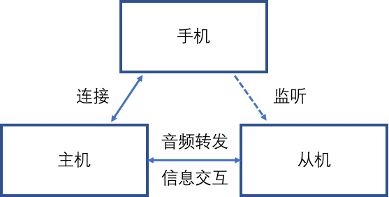

# 经典蓝牙

## 蓝牙连接原理

### 蓝牙常用的几种状态

**Page连接（Page）**

- **定义**：这是蓝牙设备**主动对其他蓝牙设备发起连接的状态。**
- **作用**：处于Page状态的设备会发送连接请求，尝试与处于Page Scan状态的设备建立连接。
- **示例**：假设您的手机（设备A）想连接蓝牙耳机（设备B），手机会进入Page状态，主动发起连接请求。

**Page Scan连接扫描（Page Scan）**

- **定义**：这是蓝牙设备**处于可被其他设备连接的状态。**
- **作用**：设备会周期性地监听来自其他设备的连接请求，以便被发现并连接。**只有处于Page Scan状态的设备，才能被发起Page的设备成功连接。**
- **示例**：蓝牙耳机（设备B）在未连接时，通常处于Page Scan状态，等待手机（设备A）的连接请求。

**Inquiry搜索（Inquiry）**

- **定义**：这是蓝牙设备**主动搜索周围其他蓝牙设备的状态。**
- **作用**：处于Inquiry状态的设备会发送搜索信号，**尝试发现处于Inquiry Scan状态的设备。**
- **示例**：手机（设备A）在蓝牙设置界面搜索可用设备时，会进入Inquiry状态。

**Inquiry Scan搜索扫描（Inquiry Scan）**

- **定义**：这是蓝牙设备**处于可被其他设备搜索到的状态。**
- **作用**：设备会监听来自其他设备的搜索信号，以便被发现。**只有处于Inquiry Scan状态的设备，才能被发起Inquiry的设备搜索到。**
- **示例**：蓝牙耳机（设备B）开机后，通常进入Inquiry Scan状态，以便手机（设备A）能搜索到它。

**Connection连接状态（Connection）**

- **定义**：这是蓝牙设备**已经与另一个设备成功建立连接的状态。**
- **作用**：在Connection状态下，设备可以进行数据传输，例如音频流或控制命令。
- **示例**：手机（设备A）通过Page或Inquiry过程与蓝牙耳机（设备B）连接成功后，**双方进入Connection状态，耳机可以播放手机的音频。**

### 蓝牙连接的过程

**首次配对**

- 手机：由手机发起Inquiry，搜索周围的蓝牙设备；

- 耳机：耳机要处于Inquiry Scan，才能被手机搜索到；

- 配对完成：手机和耳机都会记录配对信息，**配对信息中包含对方的蓝牙地址。**

**耳机回连手机**

- 耳机：由耳机发起Page，page的蓝牙地址是手机的蓝牙地址

- 手机：手机要处于Page Scan状态，才能被耳机回连上
  - **手机要把蓝牙打开**

- 特殊点：

  1. page用的蓝牙地址可以从配对信息中获取，这样的过程就是**耳机回连已经配对过的手机**；

  1. page用的蓝牙地址来源于其他方式，**如uart上报，或者代码指定**：
     1. 如果耳机已经跟手机配对过，就正常回连；
     2. 如果耳机没有跟手机配对过，会经过一个配对过程，如果手机允许配对，就正常配对连接，产生配对信息，否则连接失败。

**耳机回连手机失败后**

- 耳机处于Inquiry Scan和Page Scan的**可发现可连接状态，可被手机发现和连接。**

### 蓝牙连接的完整流程

蓝牙设备的连接过程可以分为两个主要阶段：**发现阶段和连接阶段**。

**发现阶段（Inquiry & Inquiry Scan）**

- **目的**：设备A（如手机）需要找到目标设备B（如蓝牙耳机）的**蓝牙地址和时钟信息，为后续连接做准备。**
- 步骤：
  1. 设备A进入**Inquiry状态**，发送搜索信号到周围。
     1. **主动发送搜索信号**
  2. 设备B处于**Inquiry Scan状态**，接收到搜索信号后，向设备A回应自己的地址和时钟信息。
     1. **可以被搜索到：会回应搜索信号**
  3. 设备A接收到回应，记录设备B的信息（如蓝牙地址）。
     1. **比如呈现到手机界面上（蓝牙名称等等）**
- **注意**：此阶段只是发现设备的过程，并未建立实际连接。**蓝牙耳机通常会在开机时进入Inquiry Scan状态，以便被手机发现。**

**连接阶段（Page & Page Scan）**

- **目的**：设备A利用发现阶段获得的信息，与设备B建立实际的连接。
- 步骤：
  1. 设备A进入**Page状态**，使用设备B的地址和时钟信息发送连接请求。
     1. **手机点击某个蓝牙设备进行连接**
  2. 设备B处于**Page Scan状态**，接收到连接请求后，向设备A回应。
  3. 设备A和设备B进行频率跳变同步（蓝牙使用跳频技术保证通信安全和稳定性），并交换连接参数。
  4. 连接建立完成后，设备A和设备B进入**Connection状态**。
- **注意**：连接成功后，设备可以开始传输数据。例如，蓝牙耳机会通过SCO链路接收手机的音频数据。

## 状态之间的关系与转换

**未连接时的状态**：

- 蓝牙耳机（作为从设备）在未连接时，通常同时处于**Page Scan**和**Inquiry Scan**状态。这意味着它**既可以被搜索到（Inquiry Scan），也可以被已知地址的设备直接连接（Page Scan）。**
  - 回连就是跳过了发现阶段，直接利用记录的配对信息进行连接
  - 前提是手机开了蓝牙，耳机之前配对过，知道手机的蓝牙地址，耳机开机后会先拿着手机的蓝牙地址进行回连。

- **主动发起时的状态**：
  - 当手机（作为主设备）需要搜索设备时，进入**Inquiry状态**；需要连接已知设备时，进入**Page状态**。
    - 打开手机蓝牙界面，可以搜索到回应的蓝牙信号，此时处于**Inquiry状态**
    - 当点击显示的蓝牙设备时，此时就处于**Page状态**
- **连接建立后的状态**：
  - 一旦连接成功，手机和耳机都进入**Connection状态**，开始数据通信。

#### 示例

**首次配对过程**

你提到的情况完全正确，我们先梳理一下首次配对时的状态：

- **手机：**
  - 当你打开手机的蓝牙功能并进入蓝牙界面时，手机的蓝牙会进入 **Inquiry 状态**。在这个状态下，手机会主动扫描周围的蓝牙设备，搜索那些处于 **Inquiry Scan 状态** 的设备。
  - 一旦蓝牙界面显示出可用的设备（比如你的蓝牙耳机），你点击某个设备进行连接时，手机会进入 **Page 状态**。在这个状态下，手机会向选定的蓝牙设备发送连接请求。
  - 连接成功后，手机和耳机双方都进入 **Connection 状态**，建立起稳定的蓝牙连接。
- **蓝牙耳机**：
  - 首次配对时，耳机开机后会进入 **Inquiry Scan**和 **Page Scan**状态。
    - **Inquiry Scan**：使耳机可以被其他设备（比如手机）通过扫描发现。
    - **Page Scan**：使耳机可以接收来自其他设备的连接请求。
  - 手机可以通过扫描（Inquiry）获取耳机的蓝牙地址，然后通过 **Page** 过程发起连接；或者，如果已经知道耳机的地址，也可以直接发起连接。
  - 连接成功后，双方进入 **Connection 状态**。

**回连过程（有配对记录时）**

**蓝牙耳机的行为**

- 回连的机制：
  - 当蓝牙耳机已经有配对记录（比如之前与你的手机配对过），**开机后它通常会尝试自动回连到手机**。这是很多蓝牙耳机设计上的常见功能，为了让用户无需手动操作就能恢复连接。
  - 在这个过程中，**耳机会利用存储的配对记录中的手机蓝牙地址，主动发起连接请求。**
- 蓝牙耳机的状态：
  - 是的，此时蓝牙耳机会进入 **Page 状态**。
  - 在 **Page 状态** 下，耳机会根据存储的手机蓝牙地址发送连接请求，试图重新建立与手机的连接。
  - 这意味着在回连时，耳机不再是被动等待，而是主动扮演发起连接的角色（暂时成为“主设备”）。

**手机的状态**

- 手机需要处于什么状态？
  - 为了接受耳机发来的连接请求，手机的蓝牙必须处于 **Page Scan 状态**。
    - **蓝牙功能打开就是处于Page Scan，被连接时会弹出窗口**
  - 在 **Page Scan 状态** 下，手机会监听来自已配对设备的连接请求（比如耳机发出的 Page 请求），并在收到请求后接受连接。
  - 一旦连接成功，双方再次进入 **Connection 状态**。
- 手机可以处于 Inquiry Scan 状态吗？
  - 你问到手机是否也可以处于 **Inquiry Scan 状态**。**答案是：可以，但这不是回连过程的关键。**
  - **Inquiry Scan** 是手机让自己可被其他设备发现的状态（比如在首次配对时让耳机找到手机）。但在回连场景中，耳机已经知道手机的蓝牙地址，不需要再次通过扫描（Inquiry）来发现手机，而是直接通过 **Page** 发起连接。
  - 因此，对于回连来说，手机只需要处于 **Page Scan 状态** 就足够了。不过，在实际中，很多手机在蓝牙开启时会同时启用 **Inquiry Scan** 和 **Page Scan**，以保持既可被新设备发现，又能接受已配对设备的连接请求。所以严格来说，手机可能处于 **Inquiry Scan 状态**，但这对耳机的回连过程没有直接作用。

## 开发中的注意事项

在蓝牙耳机产品开发中，理解这些状态的实际意义非常重要。以下是一些关键点：

- 电量管理：
  - 处于**Page Scan**和**Inquiry Scan**状态的耳机会周期性地监听信号，因此会消耗一定的电量。开发时需要优化这些状态的功耗，例如调整扫描间隔。
- 角色分工：
  - 蓝牙耳机通常作为从设备（Slave），保持在**Page Scan**和**Inquiry Scan**状态，等待手机等主设备（Master）发起连接。
- 连接类型：
  - 在**Connection状态**下，根据应用需求（如音频传输或数据传输），设备会使用不同的链路类型。例如，SCO链路用于实时音频（如通话），ACL链路用于数据传输（如控制命令）。

## 疑问

**这么说手机蓝牙功能打开的话，它可以同时处于Page Scan 状态，Inquiry Scan状态以及Inquiry状态，这很符合现实场景？**

**Page Scan 和 Inquiry Scan 可以同时存在**

- 手机蓝牙功能打开后，通常会**同时处于 Page Scan 和 Inquiry Scan 状态**。
- 原因：
  - 这两种状态负责监听不同类型的请求（Page Scan 监听连接请求，Inquiry Scan 监听搜索请求），手机的蓝牙模块可以交替或同时处理这两种任务（具体取决于硬件和软件设计）。
  - 这样，手机既能被新设备发现（Inquiry Scan），又能接受已配对设备的连接（Page Scan），非常符合日常使用需求。
- 现实场景：
  - 你打开手机蓝牙后，既可以用另一台设备找到它进行配对，也能让已配对的耳机自动连接，这种设计提供了无缝的用户体验。

**Inquiry 状态的特殊性**

- Inquiry 状态是临时的：
  - 手机只有在主动搜索其他设备时才会进入 Inquiry 状态，比如你手动点击“搜索附近设备”。
  - 搜索完成后，手机会退出 Inquiry 状态，恢复到 Page Scan 和 Inquiry Scan 状态。
  - **手机蓝牙打开后，会先进行 Inquiry 状态搜索一波用发现设备并呈现在界面上，然后恢复到 Page Scan 和 Inquiry Scan 状态。这就是为什么有时后设备没有看到时，需要点击刷新操作的原因了，手机不可能一直处于Inquiry 状态，一直发送收缩信号，这非常消耗资源。**
- 与 Page Scan 和 Inquiry Scan 的兼容性：
  - 当手机进入 Inquiry 状态时，它需要集中资源发送搜索信号并接收响应，因此通常会暂停或减少 Page Scan 和 Inquiry Scan 的活动。
  - 虽然理论上三种状态可以短暂共存，但实际中 Inquiry 状态的优先级较高，可能会暂时影响其他两种状态的正常运行。
  - 不同设备的具体实现可能有所差异，但一般来说，Inquiry 状态不会与 Page Scan 和 Inquiry Scan 长期同时存在。

# TWS连接

## 手机、TWS主机、TWS从机的关系（仅讨论AC697N以后的方案）

TWS（true wireless stereo 真无线蓝牙）**不属于标准蓝牙协议**，每家方案都有所区别。我们方案有以下三种方案：

- 转发：主机和手机连接，同时和从机连接，主机收到手机数据后，转发给从机。
  - 主耳机充当中间者，连接两边。

- 监听：监听模式，主从机可以对于手机来说是同一个设备，从机能监听到手机和主机之间的通讯，从而减小主从之间的数据交流。

- 监听+转发：

  - 根据使用的场景切换监听或者转发模式

  - 监听的前提下，再加入转发机制

    - //在lib_btctrler_config.c里面配对TWS方式

    - //0 监听 1 转发  2 监听+转发

    - const int CONFIG_TWS_WORK_MODE

## TWS配对

1. 左右耳使用公共的配对地址
2. 左右耳分别在Page <--> Page Scan之间切换
3. 在同一个时间段内，当左右耳中，有一个处于Page，另一个处于Page Scan，则可以建立连接
4. 连接成功后记录配对信息

**在 TWS 耳机的配对过程中，左右耳机的状态并不是固定的。它们会周期性地在 Page 和 Page Scan 之间切换，以确保在某一时刻，一个耳机处于 Page 状态而另一个处于 Page Scan 状态，从而建立连接。这种切换机制保证了配对的灵活性，而不需要预先指定哪个耳机始终处于某个状态。**

例如：

- 在某一时刻，左耳机可能处于 Page 状态，右耳机处于 Page Scan 状态，此时它们可以连接。
- 在下一时刻，左耳机可能切换到 Page Scan，右耳机切换到 Page，而它们仍然能够连接。

这表明，在配对阶段，左右耳机的角色是对称的，没有固定的状态分配。

## TWS回连

1. 左右耳使用特有的配对地址（可能是配对信息中的地址，或者只有左右耳知道，没有第三者知道的某个地址）
2. 左右耳分别在Page <--> Page Scan之间切换
3. 在同一个时间段内，当左右耳中，有一个处于Page，另一个处于Page Scan，则可以建立连接

## TWS的配对信息

1. 另一只耳机的地址（REMOTE地址）
2. 通过特定方式生成的公共地址（COMMON地址）

左右耳机各自拥有固定的MAC地址，用于唯一标识自己。MAC地址是公开的，但配对使用的COMMON地址和密钥是私有的，只有配对的耳机知道。因为TWS耳机通过加密、MAC地址过滤和特定协议，确保只有配对的耳机能连接，其他设备无法干扰。

## 四个蓝牙地址的定义

- **LOCAL地址**：耳机自身的蓝牙MAC地址，用于标识自己。

- **REMOTE地址**：配对的另一只耳机的MAC地址，用于识别对方。

- **BT_MAC**：耳机的标准蓝牙MAC地址，通常用于与手机等外部设备配对。

- **COMMON地址**：一个公共地址，通常由左右耳机共享或生成，用于与手机配对时将TWS耳机作为一个整体呈现。

## **地址关系与使用场景**

### **(a) 用于TWS配对连接的地址：LOCAL地址和REMOTE地址**

- 作用：
  - 在TWS耳机配对过程中，左右耳机通过**LOCAL地址**（自己的MAC地址）和**REMOTE地址**（对方的MAC地址）相互识别并建立连接。
  - 例如，左耳机的LOCAL地址是自己的MAC地址，REMOTE地址是右耳机的MAC地址；右耳机反之亦然。
- 重要性：
  - 如果**LOCAL地址**或**REMOTE地址**丢失或被更改，耳机将无法识别对方，导致TWS耳机无法回连（即重新连接）。
- 场景：
  - 耳机开机后，会尝试使用这两个地址自动连接对方。

### **(b) 用于与手机配对连接的地址：BT_MAC和COMMON地址**

- 作用：
  - **BT_MAC**：耳机的标准蓝牙MAC地址，用于与手机等**外部设备**建立初始连接。
  - **COMMON地址**：一个共享地址，用于在TWS耳机配对后与手机连接，让手机将左右耳机视为单一设备。
- 使用场景：
  - 根据TWS耳机的配对状态，使用的地址会有所不同（见下文c和d）。

### **(c) 当TWS左右耳已经配对上或有过配对记录时**

- 情况：
  - 左右耳机已经成功配对，或者之前配对过且保留了配对记录。
- 连接方式：
  - 使用**COMMON地址**与手机配对连接。
- 原因：
  - **COMMON地址**将左右耳机呈现为一个整体设备，手机只需连接一个地址即可同时控制两只耳机，提供无缝体验。

### **(d) 当TWS左右耳从未配对过时**

- 情况：
  - 左右耳机没有任何配对记录，例如首次使用或恢复出厂设置后。
- 连接方式：
  - 使用各自的**BT_MAC**与手机配对连接。
- 原因：
  - 此时没有生成**COMMON地址**，手机可能会将左右耳机视为两个独立设备，用户需要手动进行TWS连接。

### **地址之间的关系总结**

- TWS耳机内部配对：
  - 依赖**LOCAL地址**和**REMOTE地址**，确保左右耳机能够相互识别和连接。
- 与手机的配对：
  - 使用**BT_MAC**（未配对时）或**COMMON地址**（已配对时）与手机连接。
- 地址联系：
  - **LOCAL地址**通常与**BT_MAC**相同，都是耳机自身的MAC地址。
  - **REMOTE地址**是配对耳机的MAC地址。
  - **COMMON地址**基于配对信息生成，用于与手机通信时简化连接。

### **实际例子**

- 首次配对：
  - 左右耳机使用**BT_MAC**与手机连接，手机可能分别识别两只耳机。
    - **蓝牙名是相同的，只不过MAC地址不一样而已。**
  - 配对成功后，耳机记录对方的**REMOTE地址**并生成**COMMON地址**。
    - 蓝牙名依旧相同，只不过使用的地址是**COMMON地址**
- 后续使用：
  - 耳机通过**LOCAL地址**和**REMOTE地址**回连，手机则通过**COMMON地址**连接整个TWS设备。

# 整个过程

## **单个耳机开机后的TWS回连过程**

当单个耳机开机时，它会首先尝试与配对的另一只耳机进行 **TWS回连** 操作：

- **行为**：耳机在 **Page 状态**（主动发起连接）和 **Page Scan 状态**（监听连接请求）之间周期切换，试图重新建立与另一只耳机的连接。
- **对手机蓝牙的影响**：在此过程中，耳机专注于TWS回连，不处于 **Inquiry Scan 状态**（可被其他设备发现的状态）。
   **因此，手机蓝牙无法发现耳机**。

## **TWS回连超时后的状态**

如果TWS回连超时（即未能成功连接到另一只耳机），耳机的状态会发生变化：

- 新状态：耳机同时进入 Inquiry Scan 状态和 Page 状态。
  - **Inquiry Scan 状态**：耳机广播自己，允许手机等外部设备通过蓝牙搜索发现它。
  - **Page 状态**：耳机可能继续尝试连接到另一只耳机或准备与手机建立连接（取决于具体实现）。
- **对手机蓝牙的影响**：此时，**手机蓝牙可以搜索到耳机**，因为耳机已进入可被发现的状态。

## **TWS回连与手机蓝牙回连的顺序**

- **顺序**：是的，**TWS回连过程发生在手机蓝牙回连过程之前**。
- 原因：
  1. 耳机开机后，优先尝试与另一只耳机建立TWS连接，此时手机无法发现耳机。
  2. 只有在TWS回连失败或完成后，耳机才会进入 **Inquiry Scan 状态**，允许手机发现并发起连接。
- **逻辑**：这种设计确保耳机先完成内部配对（TWS连接），再与外部设备（如手机）建立联系，以保证立体声体验的完整性。

## **耳机呈现的地址**

耳机呈现给手机的地址取决于TWS回连的结果：

- **TWS回连失败**：耳机呈现自身的 **BT_MAC 地址**（即耳机本身的蓝牙MAC地址）。
- **TWS回连成功**：两只耳机作为一个整体，呈现 **COMMON 地址**（公共地址）给手机。

这意味着，只有在TWS回连过程结束后，耳机与手机建立连接时呈现的地址才会确定。

## 注意事项

在蓝牙经典（BR/EDR）协议中，**Inquiry Scan 状态并非设备主动广播自身信息，而是设备监听来自主设备（Central）的 Inquiry 请求，并在接收到该信号后，按协议规定发送包含自身地址、时钟等信息的 FHS（Frequency Hopping Synchronization）响应包。**该过程通过跳频扫描、多次响应以及随机退避机制，既能保证发现效率，又能避免多个设备同时回复导致的碰撞。下