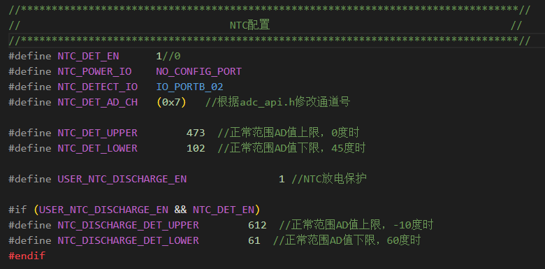
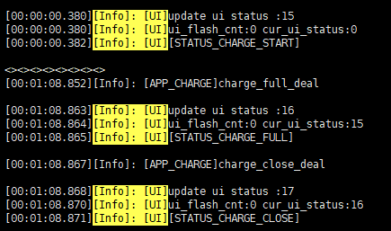
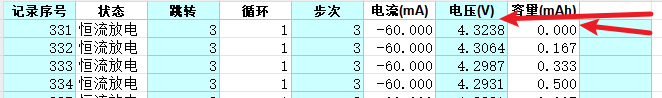
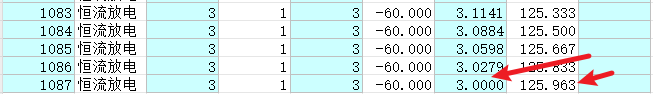
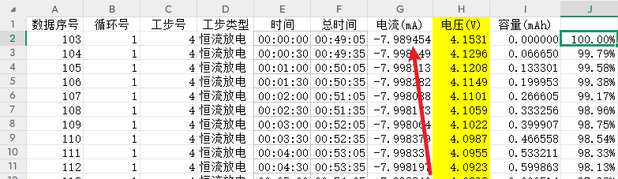
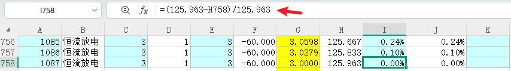
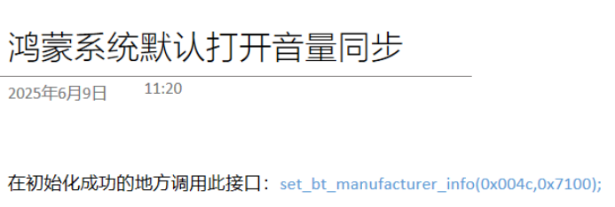
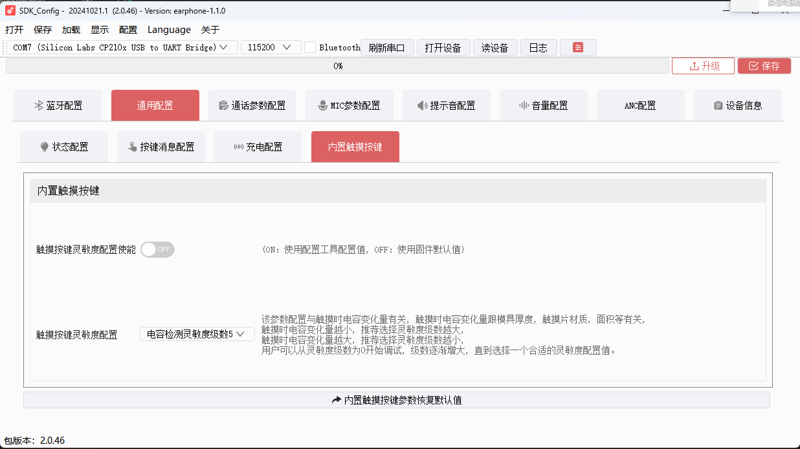
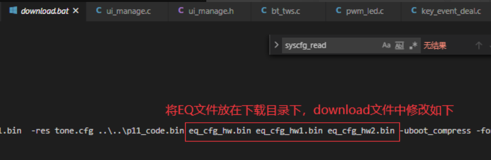

# 复位

**游戏模式下呼出Siri会复位**

- **关打印模块使能**

```c
#define TCFG_UART0_ENABLE					0//ENABLE_THIS_MOUDLE                     //串口打印模块使能
```

- **提示音的回调函数**

```c
void siri_tone_callback(){
    user_send_cmd_prepare(USER_CTRL_HFP_GET_SIRI_OPEN, 0, NULL);
}


#if ONE_KEY_CTL_DIFF_FUNC
static void lr_diff_otp_deal(u8 opt, char channel)
{
    log_info("lr_diff_otp_deal:%d", opt);
    switch (opt) {
   
    
    case ONE_KEY_LOW_LANTECY_SIRI:
        if (channel == 'L') {
            // tone_play_index(IDEX_TONE_NORMAL, 1);
            // delay_2ms(200);
            tone_play_index_with_callback(IDEX_TONE_NORMAL, 1, siri_tone_callback, NULL);
            // user_send_cmd_prepare(USER_CTRL_HFP_GET_SIRI_OPEN, 0, NULL);
        } else if (channel == 'R') {
            //游戏模式切换
            bt_set_low_latency_mode(!bt_get_low_latency_mode());
        } else {
//*!=====================单耳使用=====================================================*/
#if     Tcfg_software_left
            /*  软件固定左耳*/
          tone_play_index_with_callback(IDEX_TONE_NORMAL, 1, siri_tone_callback, NULL);
            //tone_play_index(IDEX_TONE_DU, 1);
            // user_send_cmd_prepare(USER_CTRL_HFP_GET_SIRI_OPEN, 0, NULL);                       
#elif   Tcfg_software_right 
            /*  软件固定右耳*/                 
            bt_set_low_latency_mode(!bt_get_low_latency_mode());                                    
                                              
#elif   Tcfg_hardware_channel 
        /*  硬件固定左右 需要创建earphone_passage_get()接口*/
        if (earphone_passage_get() & NOT_TWS_PASSAGE_LEFT) {
            user_send_cmd_prepare(USER_CTRL_HFP_GET_SIRI_OPEN, 0, NULL);   
        } else if (earphone_passage_get() & NOT_TWS_PASSAGE_RIGHT){
            bt_set_low_latency_mode(!bt_get_low_latency_mode());
        }

#elif   Tcfg_master_channel
       tone_play_index_with_callback(IDEX_TONE_NORMAL, 1, siri_tone_callback, NULL);
            // user_send_cmd_prepare(USER_CTRL_HFP_GET_SIRI_OPEN, 0, NULL);
                                   
#endif   
//*!==================================================================================*/ 
        }
        break;
    default:
        break;
    }
}
```

原来的写法

```c
 case ONE_KEY_LOW_LANTECY_SIRI:
        if (channel == 'L') {
            tone_play_index(IDEX_TONE_NORMAL, 1);
            //tone_play_index(IDEX_TONE_DU, 1);
            user_send_cmd_prepare(USER_CTRL_HFP_GET_SIRI_OPEN, 0, NULL);
        } else if (channel == 'R') {
            //游戏模式切换
            bt_set_low_latency_mode(!bt_get_low_latency_mode());
        } else {
//*!=====================单耳使用=====================================================*/
#if     Tcfg_software_left
            /*  软件固定左耳*/
            user_send_cmd_prepare(USER_CTRL_HFP_GET_SIRI_OPEN, 0, NULL);                            
#elif   Tcfg_software_right 
            /*  软件固定右耳*/                 
            bt_set_low_latency_mode(!bt_get_low_latency_mode());                                    
                                              
#elif   Tcfg_hardware_channel 
        /*  硬件固定左右 需要创建earphone_passage_get()接口*/
        if (earphone_passage_get() & NOT_TWS_PASSAGE_LEFT) {
            user_send_cmd_prepare(USER_CTRL_HFP_GET_SIRI_OPEN, 0, NULL);   
        } else if (earphone_passage_get() & NOT_TWS_PASSAGE_RIGHT){
            bt_set_low_latency_mode(!bt_get_low_latency_mode());
        }

#elif   Tcfg_master_channel
        /*  左右共软件按键配对情况、功能配置单一*/
        user_send_cmd_prepare(USER_CTRL_HFP_GET_SIRI_OPEN, 0, NULL);
                                   
#endif   
//*!==================================================================================*/ 
        }
        break;
```

**当操作和提示音一起时，要用回调接口？**

# 开关机

## 关机同步关机

出仓组队后，一个入仓，另一个也要关机:

`apps\earphone\power_manage\app_charge.c`

```c
void charge_ldo5v_in_deal(void)
{
    log_info("%s\n", __FUNCTION__);


#if TCFG_IRSENSOR_ENABLE
    if (get_bt_tws_connect_status()) {
        tws_api_sync_call_by_uuid('T', SYNC_CMD_EARPHONE_CHAREG_START, 300);
    }
#endif

    //另一只耳机直接关机----------------------------------------------
    tws_api_sync_call_by_uuid('T', SYNC_CMD_POWER_OFF_TOGETHER, 400);
    //插入交换
    power_event_to_user(POWER_EVENT_POWER_CHANGE);

    charge_full_flag = 0;
    
```

有概率不会关机。

## 断开充电不开机

tws断电自动开机的。

`apps\earphone\board\br30\board_ad697n_demo_cfg.h`

```c
//*********************************************************************************//
//                                  充电参数配置                                   //
//*********************************************************************************//
//是否支持芯片内置充电
#define TCFG_CHARGE_ENABLE					ENABLE_THIS_MOUDLE
//是否支持开机充电
#define TCFG_CHARGE_POWERON_ENABLE			DISABLE
//是否支持拔出充电自动开机功能
#define TCFG_CHARGE_OFF_POWERON_NE			ENABLE
```

## 升级完程序自动开机

- 上电开机

```c
#define TCFG_POWER_ON_NEED_KEY				      0//1	  //是否需要按按键开机配置
```

## NTC过温度保护同步关机

一边高温保护关机了，另一边也要关机

- 风枪吹NTC器件，温度不要太高。



`apps\common\device\ntc\ntc_det.c`

- `ntc_discharge_det_timer_deal`

```c
static void ntc_discharge_det_timer_deal(void *priv)
{
    //printf("ntc_discharge_det_timer_deal33333333333333333333333\r\n");
    u32 value;

#if NTC_DET_CNT
    if (ntc_discharge_det.cnt == 0) {
        sys_timer_modify(ntc_discharge_det.timer, NTC_DET_DUTY2);
    }
#endif
    value = adc_get_value(NTC_DET_AD_CH);
    printf("ntc_discharge_det_timer_deal1111111111111111111111111111111111111-------------%d", value);

    ntc_discharge_det.cnt++;
    if (NTC_DISCHARGE_IS_NORMAL(value, ntc_discharge_det.state * 8)) { //温度恢复一定范围后才算正常，防止临界状态
        ntc_discharge_det.normal_cnt++;
    } else if (NTC_DISCHARGE_IS_BAD_RES(value)) {
        ntc_discharge_det.res_cnt++;
    }
    if (ntc_discharge_det.cnt >= NTC_DET_CNT) {
        if (ntc_discharge_det.normal_cnt > NTC_DET_CNT / 2) {
            if (ntc_discharge_det.state == NTC_STATE_ABNORMAL) {
                printf("temperature recover, start charge");
                ntc_discharge_det.state = NTC_STATE_NORMAL;
                //charge_start();
            }
        }
#if NTC_DET_BAD_RES
        else if (ntc_det.res_cnt > NTC_DET_CNT / 2) {
            printf("bad res, stop det");
            ntc_det_stop();
        }
#endif
        else {
            if (ntc_discharge_det.state == NTC_STATE_NORMAL) {
                printf("ntc_discharge_det_timer_deal temperature is abnormall, stop using");
                ntc_discharge_det.state = NTC_STATE_ABNORMAL;
                //charge_close();
                //CHARGE_EN(0);

                //sys_enter_soft_poweroff(NULL);
                if (get_tws_sibling_connect_state()) {
                    printf("tws_api_sync_call_by_uuid------------------SYNC_CMD_POWER_OFF_TOGETHER--------TWS_SYNC_TIME_DO");
                    tws_api_sync_call_by_uuid('T', SYNC_CMD_POWER_OFF_TOGETHER, TWS_SYNC_TIME_DO);
                } else {
                    printf("sys_enter_soft_poweroff------------------------------------------------------------------------");
                    sys_enter_soft_poweroff(NULL);
                }
            }
            /* power_set_soft_poweroff(); */
        }
        ntc_discharge_det.cnt = 0;
        ntc_discharge_det.res_cnt = 0;
        ntc_discharge_det.normal_cnt = 0;
        sys_timer_modify(ntc_discharge_det.timer, NTC_DET_DUTY1);
    }
}
```

- 电池，板子都可能导致不会同步。

## 长按开机时间

`include_lib\driver\cpu\br30\asm\lp_touch_key.h`

```c
#define LP_CTMU_CHANNEL_SIZE                        2

#define CTMU_SHORT_CLICK_DELAY_TIME 	            400 	//单击事件后等待下一次单击时间(ms)
#define CTMU_LONG_CLICK_DELAY_TIME 		            1000 	//产生长按事件的触摸时间(ms)
#define CTMU_HOLD_CLICK_DELAY_TIME 		            200 	//long事件产生后, 发hold事件间隔(ms)

//长按开机时间:
#define CFG_M2P_CTMU_SOFTOFF_LONG_TIME 			    44//5 	//(n + 6) * 100(ms)

//======== CH0是否发送单击事件
#define CFG_EAROUT_NOTIFY_CH0_ONE_CLICK_EVNET 		1  //CH0是否发送单击事件

//======== 在耳外选择发送触摸通道类型
#define CFG_EAROUT_NOTIFY_CH0_ALL_EVENT				0  //在耳外发CH0所有消息
#define CFG_EAROUT_NO_NOTIFY_CH0_ALL_EVENT 			1  //在耳外不发CH0所有消息
#define CFG_EAROUT_NO_NOTIFY_CH0_CLICK_EVENT 		2  //在耳外只发CH0 LONG, HOLD, UP事件

#define CFG_EAROUT_NOTIFY_CH0_EVENT_SEL 			CFG_EAROUT_NOTIFY_CH0_ALL_EVENT

//触摸按键长按复位时间配置
#define CTMU_RESET_TIME_CONFIG			            0//8000	//长按复位时间(ms), 配置为0关闭
```

## 关机电压

`apps\earphone\include\app_power_manage.h`

```c
#define LOW_POWER_SHUTDOWN      300  //低电直接关机电压-拔出不开机-开盖不开机
#define LOW_POWER_OFF_VAL   	300//310  //低电关机电压
#define LOW_POWER_WARN_VAL   	330  //低电提醒电压
#define LOW_POWER_WARN_TIME   	(60 * 1000)  //低电提醒时间
```

# 自由组队

`apps\earphone\include\app_config.h`

```c
#if CONFIG_TWS_PAIR_MODE == CONFIG_TWS_PAIR_BY_AUTO
#if CONFIG_DEVELOPER_MODE
#define CONFIG_TWS_AUTO_PAIR_WITHOUT_UNPAIR     /* 不取消配对也可以配对新的耳机 */
#endif
#endif
```

# 灯效

## 超距断开灯效

`bt_hci_event_handler`

```c
        case ERROR_CODE_CONNECTION_TIMEOUT:
            log_info(" ERROR_CODE_CONNECTION_TIMEOUT \n");
    #if USER_CONNECTION_TIMEOUT_LED
            //避免让蓝牙断开灯效打乱
            dhf_connection_timeout_flag = 1;
            ui_update_status(STATUS_BT_TWS_CONN_TIMEOUT);
    #endif
            bt_hci_event_connection_timeout(bt);
            break;
```

在这里直接推出一个新case即可，如果灯效出现5s闪烁两次的话，需要写入109补丁文档。

`apps\earphone\include\ui_manage.h`

- 新加一个枚举值

`apps\earphone\ui_manage.c`

```c
static u8 ui_exit_sniff = 0;

static void ui_enter_sniff_set(void *priv)
{
    puts("ui_enter_sniff_set\n");
    u8 *flag = (u8 *)priv;
    *(flag) = 0;
}

static void ui_exit_sniff_set(void *priv)
{
    puts("ui_exit_sniff_set\n");
    // pwm_led_mode_set(PWM_LED1_ON);
    pwm_led_mode_set(PWM_LED0_ONE_FLASH_5S);
    sys_timeout_add(&ui_exit_sniff,ui_enter_sniff_set,2000);
    user_send_cmd_prepare(USER_CTRL_SNIFF_IN,0,NULL);
}

    case STATUS_BT_TWS_CONN_TIMEOUT:
        log_info("[STATUS_BT_TWS_CONN_TIMEOUT]\n");
        //pwm_led_mode_set(PWM_LED0_ONE_FLASH_5S);
        ui_exit_sniff = 1;
        // os_time_dly(1);
        // pwm_led_mode_set(p_led->lowpower);
        user_send_cmd_prepare(USER_CTRL_SNIFF_EXIT,0,NULL);
        
        sys_timeout_add(NULL,ui_exit_sniff_set,2000);
        
        // sys_timeout_add(&ui_exit_sniff,ui_enter_sniff_set,2000);
        break;
```

## 充电充满的灯效最后会熄灭



只有开始充电灯效，后面都是熄灭的。

```c
		case STATUS_CHARGE_START:
            log_info("[STATUS_CHARGE_START]\n");
            pwm_led_mode_set(PWM_LED1_ON);
            // pwm_led_mode_set(p_led->charge_start);
            return;

        case STATUS_CHARGE_FULL:
            log_info("[STATUS_CHARGE_FULL]\n");
            // pwm_led_mode_set(p_led->charge_full);
            pwm_led_mode_set(PWM_LED0_ON);
            // pwm_led_mode_set(PWM_LED1_ON);
                // if (charge_full_led == 0) {
                //     charge_full_led = sys_timer_add(NULL, charge_full_led_deal, 1000);
                // }

            return;

        case STATUS_CHARGE_ERR:
            log_info("[STATUS_CHARGE_ERR]\n");
            pwm_led_mode_set(PWM_LED0_ON);
            //pwm_led_mode_set(PWM_LED1_OFF);
            return;

        case STATUS_CHARGE_CLOSE:
            log_info("[STATUS_CHARGE_CLOSE]\n");
            //pwm_led_mode_set(PWM_LED0_OFF);
            pwm_led_mode_set(PWM_LED0_ON);
            //pwm_led_mode_set(PWM_LED1_OFF);
            return;
```

**使用定时器代替**

- 后面的灯效都关掉

```c
case STATUS_CHARGE_FULL:
            log_info("[STATUS_CHARGE_FULL]\n");
            // pwm_led_mode_set(p_led->charge_full);
            //pwm_led_mode_set(PWM_LED0_ON);
            //pwm_led_mode_set(PWM_LED1_ON);
                if (charge_full_led == 0) {
                    charge_full_led = sys_timer_add(NULL, charge_full_led_deal, 1000);
                }
            return;
```

定义在调用的前面即可

```c
int charge_full_led = 0;
volatile u8 charge_full_led_cnt =0;
void charge_full_led_deal(void)
{
    charge_full_led_cnt++;
    printf("charge_full_led_cnt = %d\n",charge_full_led_cnt);
    pwm_led_mode_set(PWM_LED0_ON);//pwm_led_mode_set(PWM_LED0_ON);
    if(charge_full_led_cnt >= CHARGE_FULL_LED_TIME){
        charge_full_led_cnt = 0;
        pwm_led_mode_set(PWM_LED_ALL_OFF);
        if(charge_full_led)sys_timer_del(charge_full_led);
       power_set_soft_poweroff();

    }
}
```

- 一定要有删除不然灯效更新函数无法打断。

常亮

```c
int charge_full_led = 0;
volatile u8 charge_full_led_cnt =0;
void charge_full_led_deal(void)
{
    charge_full_led_cnt++;
    printf("charge_full_led_cnt = %d\n",charge_full_led_cnt);
    pwm_led_mode_set(PWM_LED0_ON);//pwm_led_mode_set(PWM_LED0_ON);
    // if(charge_full_led_cnt >= CHARGE_FULL_LED_TIME){
    //     charge_full_led_cnt = 0;
    //     pwm_led_mode_set(PWM_LED_ALL_OFF);
    //     if(charge_full_led)sys_timer_del(charge_full_led);
    //     power_set_soft_poweroff();
    // }
}
```

客户要求断电不开机，所以这种情况可以更新后续灯效。不然定时器一定要删除。

## 不亮灯

在`apps\earphone\board\br30\board_ad697n_demo_cfg.h`相同的情况下，硬件也没有问题的情况下。那就是引脚被占用了。

```c
//*********************************************************************************//
//                                  LED 配置                                       //
//*********************************************************************************//
#define TCFG_PWMLED_ENABLE					ENABLE_THIS_MOUDLE			//是否支持PMW LED推灯模块
#define TCFG_PWMLED_IOMODE					LED_ONE_IO_MODE				//LED模式，单IO还是两个IO推灯
#define TCFG_PWMLED_PIN						IO_PORTB_02//IO_PORTB_06					//LED使用的IO口
```

还是按键的引脚：

```c
static void board_devices_init(void)
{
#if TCFG_PWMLED_ENABLE
    pwm_led_init(&pwm_led_data);
#endif

#if (TCFG_IOKEY_ENABLE || TCFG_ADKEY_ENABLE)
	key_driver_init();
#endif
	//for touch key EARIN
	// gpio_set_direction(IO_PORTB_02, 1);
	// gpio_set_pull_up(IO_PORTB_02, 1);//不注释的话，PB2是输入状态。作为灯是需要输出的。

#if TCFG_UART_KEY_ENABLE
	extern int uart_key_init(void);
	uart_key_init();
#endif /* #if TCFG_UART_KEY_ENABLE */

#if TCFG_LP_TOUCH_KEY_ENABLE
	lp_touch_key_init(&lp_touch_key_config);
#endif /* #if TCFG_LP_TOUCH_KEY_ENABLE */

}
```


# 提示音

## 同一个软件，另一个来电提示音报不出来

```c
u8 phone_ring_play_start(void)
{
    char *len_lst[34];

    if (get_call_status() == BT_CALL_HANGUP) {
        log_info("hangup,--phone ring play return\n");
        return 0;
    }
    log_info("%s,%d\n", __FUNCTION__, bt_user_priv_var.inband_ringtone);
    /* check if support inband ringtone */
    if (!bt_user_priv_var.inband_ringtone) {
        tone_play_stop();
#if DAC_PA_EN  //------------------------------------
        user_pa_deal(1);
#endif    //-------------------------------
        number_to_play_list(NULL, len_lst);
        tone_file_list_play((const char **)len_lst, 1);
        return 1;
    } else {
#if BT_INBAND_RINGTONE
        /* bt_user_priv_var.phone_timer_id = sys_timeout_add(NULL, phone_check_inband_ring_play_timer, 4000); //4s之后检测有没建立通话链路，没有建立播本地铃声 */
#endif
    }
    return 0;
}
```

原因不清楚。

## 音乐播放状态下来电无提示音(带功放)

`apps\earphone\earphone.c`

- `bt_connction_status_event_handler`
- 功放开关问题

```c
case BT_STATUS_PHONE_HANGUP:
        esco_dump_packet = ESCO_DUMP_PACKET_CALL;
        log_info("phone_handup\n");
        ui_update_status(STATUS_BT_CONN);//确保挂断电话后闪灯跟连接成功一样
#if TCFG_KWS_VOICE_RECOGNITION_ENABLE
        jl_kws_speech_recognition_close();
#endif /* #if TCFG_KWS_VOICE_RECOGNITION_ENABLE */
        if (bt_user_priv_var.phone_ring_flag) {
            bt_user_priv_var.phone_ring_flag = 0;
            tone_play_stop();
            if (bt_user_priv_var.phone_timer_id) {
                sys_timeout_del(bt_user_priv_var.phone_timer_id);
                bt_user_priv_var.phone_timer_id = 0;
            }
        }
        bt_user_priv_var.phone_income_flag = 0;
        bt_user_priv_var.phone_num_flag = 0;
        bt_user_priv_var.phone_con_sync_num_ring = 0;
        bt_user_priv_var.phone_con_sync_ring = 0;
        lmp_private_esco_suspend_resume(4);
#if (TCFG_EAR_DETECT_ENABLE && TCFG_EAR_DETECT_AUTO_CHG_MASTER && TCFG_USER_TWS_ENABLE)
        ear_detect_change_master_timer_del(); //假如通话结束了，但是还没开始切换主从，取消切换
#endif
#if  DAC_PA_EN
//user_pa_deal(0);
#endif
        break;

case BT_STATUS_A2DP_MEDIA_START:
        log_info(" BT_STATUS_A2DP_MEDIA_START:0x%x", bt->value);
#if  DAC_PA_EN
user_pa_deal(1);
#endif
        ui_update_status(STATUS_A2DP_START);
        uint8_t a2dp_status = a2dp_get_status();
        printf("a2dp_status:%d", a2dp_status);
        EARPHONE_PALY_STATUS_INDICATE(a2dp_status == BT_MUSIC_STATUS_STARTING ? 1 : 0);
        a2dp_dec_open(bt->value);
        break;
    case BT_STATUS_A2DP_MEDIA_STOP:
        log_info(" BT_STATUS_A2DP_MEDIA_STop");
        ui_update_status(STATUS_A2DP_STOP);
        EARPHONE_PALY_STATUS_INDICATE(0);
        a2dp_dec_close();
#if  DAC_PA_EN
// user_pa_deal(0);
#endif
        break;
```


# 低功耗

## 流程

主事件分发中的`bt_connction_status_event_handler`函数

`BT_STATUS_SNIFF_STATE_UPDATE`分支会定时调用。

```c
case BT_STATUS_SNIFF_STATE_UPDATE:
        log_info(" BT_STATUS_SNIFF_STATE_UPDATE %d\n", bt->value);    //0退出SNIFF
        if (bt->value == 0) {
#if defined CFG_LED_MODE && (CFG_LED_MODE == CFG_LED_SOFT_MODE)
            pwm_led_mode_set(pwm_led_display_mode_get());
#endif
#if(TCFG_USER_TWS_ENABLE == 1)
            led_module_exit_sniff_mode();
            pwm_led_clk_set(PWM_LED_CLK_BTOSC_24M);
#endif
            sys_auto_sniff_controle(MY_SNIFF_EN, bt->args);
        } else {
#if(TCFG_USER_TWS_ENABLE == 1)
            led_module_enter_sniff_mode();
            pwm_led_clk_set((!TCFG_LOWPOWER_BTOSC_DISABLE) ? PWM_LED_CLK_RC32K : PWM_LED_CLK_BTOSC_24M);
#endif
            sys_auto_sniff_controle(0, bt->args);
        }
        break;
```

`sys_auto_sniff_controle`

```c
void sys_auto_sniff_controle(u8 enable, u8 *addr)
{
    if (addr) {
        if (bt_api_conn_mode_check(enable, addr) == 0) {
            log_info("sniff ctr not change\n");
            return;
        }
    }

    if (enable) {
        if (addr) {
            log_info("sniff cmd timer init\n");
            user_send_cmd_prepare(USER_CTRL_HALF_SEC_LOOP_CREATE, 0, NULL);
            /* user_cmd_timer_init(); */
        }

        if (bt_user_priv_var.sniff_timer == 0) {
            log_info("check_sniff_enable\n");
            bt_user_priv_var.sniff_timer = sys_timer_add(NULL, bt_check_enter_sniff, 1000);
        }
        EARPHONE_STATE_SNIFF(0);
    } else {

        if (addr) {
            log_info("sniff cmd timer remove\n");
            user_send_cmd_prepare(USER_CTRL_HALF_SEC_LOOP_DEL, 0, NULL);
            /* remove_user_cmd_timer(); */
        }

        if (bt_user_priv_var.sniff_timer) {
            log_info("check_sniff_disable\n");
            sys_timeout_del(bt_user_priv_var.sniff_timer);
            bt_user_priv_var.sniff_timer = 0;

            if (exit_sniff_timer == 0) {
                //去里面注释功放不行，只能外面了。整个定时器注释掉
                //exit_sniff_timer = sys_timer_add(NULL, bt_check_exit_sniff, 5000);
            }
        }
        EARPHONE_STATE_SNIFF(1);
    }
}
```

会有0跟2两个值。

2的话就周期调用`bt_check_enter_sniff`

```c
void bt_check_enter_sniff()
{
    struct sniff_ctrl_config_t sniff_ctrl_config;
    u8 addr[12];
    u8 conn_cnt = 0;
    u8 i = 0;
    if (get_ota_status()) {
        return;
    }
#if TCFG_AUDIO_ANC_ENABLE
    if (anc_train_open_query()) { //如果ANC训练则不进入SNIFF
        return;
    }
#endif
    if (sniff_ready_status) {
        sniff_ready_status = 0;
        return;
    }

    /*putchar('H');*/
    conn_cnt = bt_api_enter_sniff_status_check(SNIFF_CNT_TIME, addr);

#if (TCFG_BD_NUM == 2)
    if (BT_STATUS_PLAYING_MUSIC == get_bt_connect_status() || get_esco_coder_busy_flag()) {
        return;
    }
#endif
    ASSERT(conn_cnt <= 2);

    for (i = 0; i < conn_cnt; i++) {
        log_info("-----USER SEND SNIFF IN %d %d\n", i, conn_cnt);
        sniff_ctrl_config.sniff_max_interval = SNIFF_MAX_INTERVALSLOT;
        sniff_ctrl_config.sniff_mix_interval = SNIFF_MIN_INTERVALSLOT;
        sniff_ctrl_config.sniff_attemp = SNIFF_ATTEMPT_SLOT;
        sniff_ctrl_config.sniff_timeout  = SNIFF_TIMEOUT_SLOT;
        memcpy(sniff_ctrl_config.sniff_addr, addr + i * 6, 6);
//#if TCFG_USER_TWS_ENABLE
        //if (tws_api_get_role() == TWS_ROLE_SLAVE) {
            //return;
        //}
//#endif
#if  DAC_PA_EN//放到后面，跟进入sniff一起，不要跳过前面的判断。
    user_pa_deal(0);
#endif
        user_send_cmd_prepare(USER_CTRL_SNIFF_IN, sizeof(struct sniff_ctrl_config_t), (u8 *)&sniff_ctrl_config);
    }

}
```

0的话会周期调用

```c
void bt_check_exit_sniff()
{
    sys_timeout_del(exit_sniff_timer);
    exit_sniff_timer = 0;

#if TCFG_USER_TWS_ENABLE
    if (tws_api_get_role() == TWS_ROLE_SLAVE) {
        return;
    }
#endif
#if  DAC_PA_EN
    user_pa_deal(1);//不要主动开启，某一些地方手动开启了。只要保证进低功耗时关闭就行
#endif
    user_send_cmd_prepare(USER_CTRL_ALL_SNIFF_EXIT, 0, NULL);
}
```

`log_info(" BT_STATUS_SNIFF_STATE_UPDATE %d\n", bt->value);   //0退出SNIFF`

- 周期性出现0和2，也就是周期性检查sniff的进入与退出
- 如果这个两个函数中带着功放的使能与关闭
- 也就导致功耗的跳动。
- 功放并不能在实际进入/退出的的位置写入，在外面就会有这种问题。
- 保证不跳动的话
  - 进入sniff模式时，跟着一起关。
  - 在需要的场景下，手动开启功放
    - 来电提示音
    - 音乐等
    - 忘记打开的话，就会丢失声音。

## 有功放时有一遍不进低功耗

`apps\earphone\earphone.c`

```c
void bt_check_exit_sniff()
{
    sys_timeout_del(exit_sniff_timer);
    exit_sniff_timer = 0;

#if TCFG_USER_TWS_ENABLE
    // if (tws_api_get_role() == TWS_ROLE_SLAVE) {
    //     return;
    // }
#endif
#if  DAC_PA_EN
    user_pa_deal(0);//不要主动开启，某一些地方手动开启了。只要保证进低功耗时关闭就行
#endif
    user_send_cmd_prepare(USER_CTRL_ALL_SNIFF_EXIT, 0, NULL);
}


void bt_check_enter_sniff()
{
    struct sniff_ctrl_config_t sniff_ctrl_config;
    u8 addr[12];
    u8 conn_cnt = 0;
    u8 i = 0;
    if (get_ota_status()) {
        return;
    }
#if TCFG_AUDIO_ANC_ENABLE
    if (anc_train_open_query()) { //如果ANC训练则不进入SNIFF
        return;
    }
#endif
    if (sniff_ready_status) {
        sniff_ready_status = 0;
        return;
    }

    /*putchar('H');*/
    conn_cnt = bt_api_enter_sniff_status_check(SNIFF_CNT_TIME, addr);

#if (TCFG_BD_NUM == 2)
    if (BT_STATUS_PLAYING_MUSIC == get_bt_connect_status() || get_esco_coder_busy_flag()) {
        return;
    }
#endif
    ASSERT(conn_cnt <= 2);

    for (i = 0; i < conn_cnt; i++) {
        log_info("-----USER SEND SNIFF IN %d %d\n", i, conn_cnt);
        sniff_ctrl_config.sniff_max_interval = SNIFF_MAX_INTERVALSLOT;
        sniff_ctrl_config.sniff_mix_interval = SNIFF_MIN_INTERVALSLOT;
        sniff_ctrl_config.sniff_attemp = SNIFF_ATTEMPT_SLOT;
        sniff_ctrl_config.sniff_timeout  = SNIFF_TIMEOUT_SLOT;
        memcpy(sniff_ctrl_config.sniff_addr, addr + i * 6, 6);
#if TCFG_USER_TWS_ENABLE
        // if (tws_api_get_role() == TWS_ROLE_SLAVE) {
        //     return;
        // }
#endif
#if  DAC_PA_EN
    user_pa_deal(0);
#endif
        user_send_cmd_prepare(USER_CTRL_SNIFF_IN, sizeof(struct sniff_ctrl_config_t), (u8 *)&sniff_ctrl_config);

    }

}
```

- 这里从机返回了，导致实际进入低功耗的只有一边。
- 在特定场景下主动打开功放的话，低功耗就都关闭状态吧。
  - 一定要保证需要声音的地方要主动打开，不然会丢失声音。

# 放电分配

697默认没有

`get_vbat_percent()` 函数将电池电压值转换为百分比形式的电量显示。

## 电量分配计算流程

获取当前电池电压

```c
u16 bat_val = get_vbat_level();
```

设定电池满电值

```c
if (battery_full_value == 0) {
#if TCFG_CHARGE_ENABLE
    battery_full_value = (get_charge_full_value() - 100) / 10;
#else
    battery_full_value = 420;  // 默认4.2V
#endif
}
```

- 如果支持充电，使用充电满电值减去100mV的缓冲

- 否则默认使用4.2V作为满电电压

低电量保护判断

```c
if (bat_val <= app_var.poweroff_tone_v) {
    return 0;
}
```

如果当前电压低于关机提示电压，直接返回0%

## 电量百分比计算

使用重映射函数

```c
tmp_bat_val = remap_calculate_vbat_percent(bat_val);
```

首先尝试使用预设的电压-电量映射表来计算

**线性计算**

```c
if (!tmp_bat_val) {
    tmp_bat_val = ((u32)bat_val - app_var.poweroff_tone_v) * 100 / 
                  (battery_full_value - app_var.poweroff_tone_v);
}
```

如果映射表没有结果，使用线性公式：

```c
电量百分比 = (当前电压 - 关机电压) × 100 / (满电电压 - 关机电压)
```

结果限制

```c
if (tmp_bat_val > 100) {
    tmp_bat_val = 100;
}
```

确保百分比不超过100%

## 分配原理

这个函数实现了**分段线性映射**的电量分配策略：

- **有效电压范围**：从关机电压到满电电压
- **百分比范围**：0% 到 100%
- **保护机制**：低于关机电压时显示0%，防止意外关机
- **精度优化**：优先使用电压-电量映射表，提高非线性电池特性的显示精度

这种分配方式能够比较准确地反映锂电池的放电特性，为用户提供直观的电量显示。

## 映射表计算

这个表默认的看不到。

## 手动计算

```c
u8 get_vbat_percent(void)
{
    u16 tmp_bat_val;
    u16 bat_val = get_vbat_level();
    if (battery_full_value == 0) {
#if TCFG_CHARGE_ENABLE
        battery_full_value = (get_charge_full_value() - 100) / 10; //防止部分电池充不了这么高电量，充满显示未满的情况
#else
        battery_full_value = 420;
#endif
    }

    if (bat_val <= app_var.poweroff_tone_v) {
        return 0;
    }
    if(bat_val >= 406){        // 4.06V-4.3V区间都显示100%
    	tmp_bat_val = 100;
    }else if(bat_val >= 397){
        tmp_bat_val = 90;
    }else if(bat_val >= 389){
        tmp_bat_val = 80;
    }else if(bat_val >= 383){
        tmp_bat_val = 70;
    }else if(bat_val >= 377){
        tmp_bat_val = 60;
    }else if(bat_val >= 372){
        tmp_bat_val = 50;
    }else if(bat_val >= 367){
        tmp_bat_val = 40;
    }else if(bat_val >= 364){
        tmp_bat_val = 30;
    }else if(bat_val >= 360){
        tmp_bat_val = 20;
    }else if(bat_val >= 320){  // 可以调整这个值，手机最少显示10%，而且会在这个值附近关机。大于设置的低电关机电压时。
        tmp_bat_val = 10;
    }
    //else if(bat_val > 310){
        //tmp_bat_val = 5;
    //}else{
        //tmp_bat_val = 0;
    //}
    // tmp_bat_val = remap_calculate_vbat_percent(bat_val);
    // if (!tmp_bat_val) {
    //     tmp_bat_val = ((u32)bat_val - app_var.poweroff_tone_v) * 100 / (battery_full_value - app_var.poweroff_tone_v);
    //     if (tmp_bat_val > 100) {
    //         tmp_bat_val = 100;
    //     }
    // }
    return (u8)tmp_bat_val;
}
```

## 根据客户的放电曲线表格

有专门的放电测试机器的。直接根据表格也行。

截取一段完整的

- 满电电压到关机电压的持续放电时间。





- 60mA放电电流不正常。



- 按正常功耗来放。


公式



写等号自动识别。

- 多少C放电？
- 放电曲线有什么要求吗？
  - 正常放电电流6~13之间
  - 60估计是直接拿电池放的。

# 左右电量相差过大(不行)

- 能不能根据电量进行主从切换？

```c
#define ESCO_AUTO_POWER_BALANCE_ROLE_SWITCH_ENABLE    1//0  /*通话过程根据电量主从切换，电量平衡*/
#define A2DP_PLAY_AUTO_ROLE_SWITCH_ENABLE             0  /*播歌根据主从信号质量自动主从切换*/

apps\earphone\bt_tws.c
#if A2DP_PLAY_AUTO_ROLE_SWITCH_ENABLE
    tws_api_auto_role_switch_enable();
#else
    tws_api_auto_role_switch_disable();
#endif

#if ESCO_AUTO_POWER_BALANCE_ROLE_SWITCH_ENABLE
    extern void tws_api_esco_power_balance_role_switch(u8 enable);
    tws_api_esco_power_balance_role_switch(ESCO_AUTO_POWER_BALANCE_ROLE_SWITCH_ENABLE);
#endif

case TWS_EVENT_ROLE_SWITCH:
#if (ESCO_AUTO_POWER_BALANCE_ROLE_SWITCH_ENABLE==1)&&(TCFG_USER_TWS_ENABLE==1)
        if (get_esco_coder_busy_flag()) {
            if (role == TWS_ROLE_MASTER) {
                esco_ul_stream_switch(1);
            } else {
                esco_ul_stream_switch(0);
                /* tone_play(TONE_LOW_LATENCY_IN, 1); */

            }
        }
#endif
        EARPHONE_STATE_ROLE_SWITCH(role);
        break;
    case TWS_EVENT_ROLE_SWITCH_START:
#if (ESCO_AUTO_POWER_BALANCE_ROLE_SWITCH_ENABLE==1)&&(TCFG_USER_TWS_ENABLE==1)
        if (get_esco_coder_busy_flag()) {
            if (role == TWS_ROLE_SLAVE) {
                g_printf("TWS_EVENT_ROLE_SWITCH_START");
                esco_ul_stream_switch(1);
            }
        }
#endif
        break;
```

## 在电量上报到手机时，做一下判断。那一边电量多那一边作为主机

- 4.2~3.7V这段两边电压都是稳定的。3.7v往下右边就耗电快了
- 不要根据信号质量进行切换主从即可

```c
#define ESCO_AUTO_POWER_BALANCE_ROLE_SWITCH_ENABLE    0  /*通话过程根据电量主从切换，电量平衡*/
#define A2DP_PLAY_AUTO_ROLE_SWITCH_ENABLE             1//0  /*播歌根据主从信号质量自动主从切换*/
```

## **是因为带功放，进入低功耗时，有一遍没有关功放导致的。**

# 鸿蒙系统的音量问题

## 问题描述

1. **鸿蒙系统手机播放音乐时候，长按音量无反应**
2. **兼容性这块音量和华为手机不同步**
   1. 蓝牙设置中**蓝牙设备音量与手机同步**开关没有打开




在蓝牙初始化完成时调用

- `apps\earphone\earphone.c`

```c
case BT_STATUS_INIT_OK:
        /*
         * 蓝牙初始化完成
         */
        EARPHONE_CUSTOM_EARPHONE_KEY_INIT();
        log_info("BT_STATUS_INIT_OK\n");
        //鸿蒙系统打开音量同步
        set_bt_manufacturer_info(0x004c,0x7100);
```

# 修改触摸灵敏度

配置工具不生效，没有使能。



`apps\earphone\board\br30\board_ad697n_demo_cfg.h`

```c
//*********************************************************************************//
//                             lp tocuh key 配置                                   //
//*********************************************************************************//
#define TCFG_LP_TOUCH_KEY_ENABLE 			1//DISABLE_THIS_MOUDLE 		//是否使能触摸按键

#define TCFG_LP_TOUCH_KEY0_EN               1                           //是否使能触摸按键0 —— PB0
#define TCFG_LP_TOUCH_KEY1_EN               0                           //是否使能触摸按键1 —— PB2

#define TCFG_LP_SLIDE_KEY_ENABLE          0                         //是否使能触摸按键的滑动功能

#define TCFG_LP_EARTCH_KEY_ENABLE 			DISABLE_THIS_MOUDLE 	 	//是否使能 触摸按键1 用作入耳检测
#define TCFG_LP_EARTCH_SOFT_INEAR_VAL       100                         //入耳检测算法需要的入耳阈值，参考文档设置
#define TCFG_LP_EARTCH_SOFT_OUTEAR_VAL      80                          //入耳检测算法需要的出耳阈值，参考文档设置


//电容检测灵敏度级数配置(范围: 0 ~ 9)
//该参数配置与触摸时电容变化量有关, 触摸时电容变化量跟模具厚度, 触摸片材质, 面积等有关,
//触摸时电容变化量越小, 推荐选择灵敏度级数越大,
//触摸时电容变化量越大, 推荐选择灵敏度级数越小,
//用户可以从灵敏度级数为0开始调试, 级数逐渐增大, 直到选择一个合适的灵敏度配置值.
#define TCFG_LP_TOUCH_KEY0_SENSITIVITY 		5//7 	//触摸按键电容检测灵敏度配置(级数0 ~ 9)
#define TCFG_LP_TOUCH_KEY1_SENSITIVITY 		5//7 	//触摸按键电容检测灵敏度配置(级数0 ~ 9)

//内置触摸灵敏度调试工具使能, 使能后可以通过连接PC端上位机通过SPP调试,
//打开该宏需要确保同时打开宏:
//1.USER_SUPPORT_PROFILE_SPP
//2.APP_ONLINE_DEBUG
//可以针对每款样机校准灵敏度参数表(在lp_touch_key.c ch_sensitivity_table), 详细使用方法请参考《低功耗内置触摸介绍》文档.
#define TCFG_LP_TOUCH_KEY_BT_TOOL_ENABLE 	DISABLE
```

保险起见两个都修改。

**SDK可视化的这个部分都注释掉了，可视化配置。**

# 超距断开回连超时时间设置

## 对耳与手机超距

- `apps\earphone\earphone.c`

```c
#define TIMEOUT_CONN_TIME         60 //超时断开之后回连的时间s
#define POWERON_AUTO_CONN_TIME    12  //开机去回连的时间
#define TWS_RETRY_CONN_TIMEOUT    ((rand32() & BIT(0)) ? 200 : 400)
#define PHONE_DLY_DISCONN_TIME    0//4000  //超时断开，快速连接上不播提示音

static void bt_hci_event_connection_timeout(struct bt_event *bt)//这是手机断开的
{
    earphone_change_pwr_mode(PWR_LDO15, 0);

    if (chargestore_get_ex_enter_dut_flag()) {
        bt_discovery_and_connectable_using_loca_mac_addr(1, 1);
        return;
    }

    if (!get_remote_test_flag() && !get_esco_busy_flag()) {
        bt_user_priv_var.auto_connection_counter = (TIMEOUT_CONN_TIME * 1000);
        memcpy(bt_user_priv_var.auto_connection_addr, bt->args, 6);
#if TCFG_USER_TWS_ENABLE
        bt_tws_phone_connect_timeout();
#else
        //......
```


## 对耳之间超距

暂时不知道。

# SDKBUG

## 5S一闪有时会闪烁两次

- `apps\earphone\ui_manage.c`
- 5s一闪放进来

```c
void sniff_achor_point_hook(u32 slot)
{
    u8 led_mode = pwm_led_display_mode_get();
    //if (led_mode != PWM_LED0_ONE_FLASH_5S && led_mode != PWM_LED1_ONE_FLASH_5S) {
        if (get_bt_tws_connect_status()) {
            //交替闪进sniff同步
            if (led_mode == PWM_LED0_LED1_FAST_FLASH) {
                if ((slot % ((CFG_DOUBLE_FAST_FLASH_FREQ * 1000) / 625)) < 800) {
                    led_sniff_mode_double_display((slot / ((CFG_DOUBLE_FAST_FLASH_FREQ * 1000) / 625)) & BIT(0));
                }
            } else if (led_mode == PWM_LED0_SLOW_FLASH) {
                if ((slot % ((CFG_DOUBLE_SLOW_FLASH_FREQ * 1000) / 625)) < 800) {
                    led_sniff_mode_double_display((slot / ((CFG_DOUBLE_SLOW_FLASH_FREQ * 1000) / 625)) & BIT(0));
                }
            }
        }
        return;
    //}
```

# 切换多eq文件

`cpu\br36\audio\eq_config.c`

```c
#if TCFG_EQ_FILE_SWITCH_EN
const u8 *eq_file_switch_list[] = {
    (u8 *)SDFILE_RES_ROOT_PATH"eq_cfg_hw.bin",
    (u8 *)SDFILE_RES_ROOT_PATH"eq_cfg_hw1.bin",
    (u8 *)SDFILE_RES_ROOT_PATH"eq_cfg_hw2.bin",
};
#endif

#if TCFG_EQ_FILE_SWITCH_EN
//根据eq_file_switch_list切换到指定的eq文件
void eq_file_set_by_index(u8 index)
{
    if (index >= ARRAY_SIZE(eq_file_switch_list)) {
        printf("err, max index %d\n", ARRAY_SIZE(eq_file_switch_list));
        return;
    }
    EQ_CFG *eq_cfg = get_eq_cfg_hdl();
    if (!eq_cfg) {
        return;
    }
    int ret = eq_file_get_cfg(eq_cfg, eq_file_switch_list[index]);
    printf("eq_file_switch : %d, ret : %d", index, ret);
}

//根据eq_file_switch_list成员个数顺序切换eq文件
void eq_file_switch()
{
    static u8 index = 0;
    index++;
    if (index >= ARRAY_SIZE(eq_file_switch_list)) {
        index = 0;
    }
    eq_file_set_by_index(index);
}

#endif
```



## 多种音乐风格的bing文件

```c
u8 curr_eq_index = 0;
const u8 *eq_file_list[] = {
    (u8 *)SDFILE_RES_ROOT_PATH"eq_normal.bin",
    (u8 *)SDFILE_RES_ROOT_PATH"eq_rock.bin",
    (u8 *)SDFILE_RES_ROOT_PATH"eq_pop.bin",
    (u8 *)SDFILE_RES_ROOT_PATH"eq_class.bin",
    (u8 *)SDFILE_RES_ROOT_PATH"eq_jazz.bin",

    //音效界面
    (u8 *)SDFILE_RES_ROOT_PATH"eq_film.bin",
    (u8 *)SDFILE_RES_ROOT_PATH"eq_music.bin",
    (u8 *)SDFILE_RES_ROOT_PATH"eq_game.bin",

};

void eq_effect_switch(u8 index)
{
    if(index == 0xff){
        curr_eq_index++;
        if(curr_eq_index >= ARRAY_SIZE(eq_file_list)){
            curr_eq_index = 0;
        }
    }else{
        if(index >= ARRAY_SIZE(eq_file_list)){
            return;
        }
        curr_eq_index = index;
    }

#if (!TCFG_EQ_ONLINE_ENABLE)
    EQ_CFG *eq_cfg = get_eq_cfg_hdl();
    if(!eq_cfg){
        return;
    }
    eq_cfg->eq_type = EQ_TYPE_FILE;
    int ret = eq_file_get_cfg(eq_cfg, eq_file_list[curr_eq_index]);
    printf("eq_effect_switch %d ret %d\n", curr_eq_index, ret);
#endif
}
u8 get_current_eq_info(void)
{
    return curr_eq_index;
}
```


原本的eq文件没有放入了，通话eq还能生效吗？

# 回连速度慢

## 有连接记录，耳机入仓再出仓回连速度慢

# 射频等级

**蓝牙发射功率**


