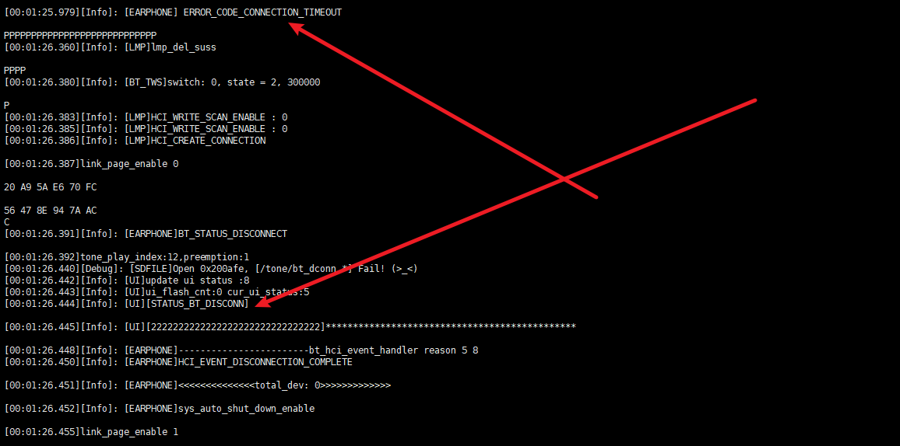
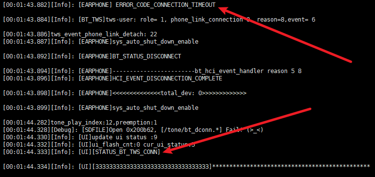

# 复位

**游戏模式下呼出Siri会复位**

- **关打印模块使能**

```c
#define TCFG_UART0_ENABLE					0//ENABLE_THIS_MOUDLE                     //串口打印模块使能
```

- **提示音的回调函数**

```c
void siri_tone_callback(){
    user_send_cmd_prepare(USER_CTRL_HFP_GET_SIRI_OPEN, 0, NULL);
}


#if ONE_KEY_CTL_DIFF_FUNC
static void lr_diff_otp_deal(u8 opt, char channel)
{
    log_info("lr_diff_otp_deal:%d", opt);
    switch (opt) {
   
    
    case ONE_KEY_LOW_LANTECY_SIRI:
        if (channel == 'L') {
            // tone_play_index(IDEX_TONE_NORMAL, 1);
            // delay_2ms(200);
            tone_play_index_with_callback(IDEX_TONE_NORMAL, 1, siri_tone_callback, NULL);
            // user_send_cmd_prepare(USER_CTRL_HFP_GET_SIRI_OPEN, 0, NULL);
        } else if (channel == 'R') {
            //游戏模式切换
            bt_set_low_latency_mode(!bt_get_low_latency_mode());
        } else {
//*!=====================单耳使用=====================================================*/
#if     Tcfg_software_left
            /*  软件固定左耳*/
          tone_play_index_with_callback(IDEX_TONE_NORMAL, 1, siri_tone_callback, NULL);
            //tone_play_index(IDEX_TONE_DU, 1);
            // user_send_cmd_prepare(USER_CTRL_HFP_GET_SIRI_OPEN, 0, NULL);                       
#elif   Tcfg_software_right 
            /*  软件固定右耳*/                 
            bt_set_low_latency_mode(!bt_get_low_latency_mode());                                    
                                              
#elif   Tcfg_hardware_channel 
        /*  硬件固定左右 需要创建earphone_passage_get()接口*/
        if (earphone_passage_get() & NOT_TWS_PASSAGE_LEFT) {
            user_send_cmd_prepare(USER_CTRL_HFP_GET_SIRI_OPEN, 0, NULL);   
        } else if (earphone_passage_get() & NOT_TWS_PASSAGE_RIGHT){
            bt_set_low_latency_mode(!bt_get_low_latency_mode());
        }

#elif   Tcfg_master_channel
       tone_play_index_with_callback(IDEX_TONE_NORMAL, 1, siri_tone_callback, NULL);
            // user_send_cmd_prepare(USER_CTRL_HFP_GET_SIRI_OPEN, 0, NULL);
                                   
#endif   
//*!==================================================================================*/ 
        }
        break;
    default:
        break;
    }
}
```

原来的写法

```c
 case ONE_KEY_LOW_LANTECY_SIRI:
        if (channel == 'L') {
            tone_play_index(IDEX_TONE_NORMAL, 1);
            //tone_play_index(IDEX_TONE_DU, 1);
            user_send_cmd_prepare(USER_CTRL_HFP_GET_SIRI_OPEN, 0, NULL);
        } else if (channel == 'R') {
            //游戏模式切换
            bt_set_low_latency_mode(!bt_get_low_latency_mode());
        } else {
//*!=====================单耳使用=====================================================*/
#if     Tcfg_software_left
            /*  软件固定左耳*/
            user_send_cmd_prepare(USER_CTRL_HFP_GET_SIRI_OPEN, 0, NULL);                            
#elif   Tcfg_software_right 
            /*  软件固定右耳*/                 
            bt_set_low_latency_mode(!bt_get_low_latency_mode());                                    
                                              
#elif   Tcfg_hardware_channel 
        /*  硬件固定左右 需要创建earphone_passage_get()接口*/
        if (earphone_passage_get() & NOT_TWS_PASSAGE_LEFT) {
            user_send_cmd_prepare(USER_CTRL_HFP_GET_SIRI_OPEN, 0, NULL);   
        } else if (earphone_passage_get() & NOT_TWS_PASSAGE_RIGHT){
            bt_set_low_latency_mode(!bt_get_low_latency_mode());
        }

#elif   Tcfg_master_channel
        /*  左右共软件按键配对情况、功能配置单一*/
        user_send_cmd_prepare(USER_CTRL_HFP_GET_SIRI_OPEN, 0, NULL);
                                   
#endif   
//*!==================================================================================*/ 
        }
        break;
```

**当操作和提示音一起时，要用回调接口？**

# 关机同步关机

出仓组队后，一个入仓，另一个也要关机:

`apps\earphone\power_manage\app_charge.c`

```c
void charge_ldo5v_in_deal(void)
{
    log_info("%s\n", __FUNCTION__);


#if TCFG_IRSENSOR_ENABLE
    if (get_bt_tws_connect_status()) {
        tws_api_sync_call_by_uuid('T', SYNC_CMD_EARPHONE_CHAREG_START, 300);
    }
#endif

    //另一只耳机直接关机----------------------------------------------
    tws_api_sync_call_by_uuid('T', SYNC_CMD_POWER_OFF_TOGETHER, 400);
    //插入交换
    power_event_to_user(POWER_EVENT_POWER_CHANGE);

    charge_full_flag = 0;
    
```

有概率不会关机。


# 自由组队

`apps\earphone\include\app_config.h`

```c
#if CONFIG_TWS_PAIR_MODE == CONFIG_TWS_PAIR_BY_AUTO
#if CONFIG_DEVELOPER_MODE
#define CONFIG_TWS_AUTO_PAIR_WITHOUT_UNPAIR     /* 不取消配对也可以配对新的耳机 */
#endif
#endif
```

# 超距断开灯效

## 单耳超距断开

`apps\earphone\earphone.c`

**bt_connction_status_event_handler**

```c
case BT_STATUS_FIRST_DISCONNECT:
case BT_STATUS_SECOND_DISCONNECT:
        log_info("BT_STATUS_DISCONNECT\n");
#if TCFG_ADSP_UART_ENABLE
        ADSP_UART_Deinit();
#endif
        if (app_var.goto_poweroff_flag) {
            /*关机不播断开提示音*/
            /*关机时不改UI*/
            break;
        }

#if PHONE_DLY_DISCONN_TIME
        if (app_var.phone_dly_discon_time == 0) {
            app_var.phone_dly_discon_time = sys_timeout_add(NULL, bt_discon_dly_handle, PHONE_DLY_DISCONN_TIME);
        }
#else
        bt_discon_dly_handle(NULL);
#endif
        EARPHONE_STATE_BT_DISCONNECTED();
        break;
```

`bt_discon_dly_handle`

```c
static void bt_discon_dly_handle(void *priv)
{
    app_var.phone_dly_discon_time = 0;

    STATUS *p_tone = get_tone_config();

#if(TCFG_BD_NUM == 2)               //对耳在bt_tws同步播放提示音
    /* tone_play(TONE_DISCONN); */
    tone_play_index(p_tone->bt_disconnect, 1);
#else

#if TCFG_USER_TWS_ENABLE
    if (!get_bt_tws_connect_status() && !get_bt_tws_discon_dly_state())
#endif
    {
        tone_play_index(p_tone->bt_disconnect, 1);
    }
#endif

#if TCFG_USER_TWS_ENABLE
    STATUS *p_led = get_led_config();
    if (get_bt_tws_connect_status()) {
#if TCFG_CHARGESTORE_ENABLE
        chargestore_set_phone_disconnect();
#endif
        if (tws_api_get_role() == TWS_ROLE_MASTER) {
            bt_tws_play_tone_at_same_time(SYNC_TONE_PHONE_DISCONNECTED, 400);
        }
    } else {
        //断开手机时，如果对耳未连接，要把LED时钟切到RC（因为单台会进SNIFF）
        pwm_led_clk_set((!TCFG_LOWPOWER_BTOSC_DISABLE) ? PWM_LED_CLK_RC32K : PWM_LED_CLK_BTOSC_24M);
        //pwm_led_clk_set(PWM_LED_CLK_RC32K);
        ui_update_status(STATUS_BT_DISCONN);//更新灯效------------------------
    }
#endif

}
```

```c
case STATUS_BT_DISCONN:
        log_info("[STATUS_BT_DISCONN]\n");
        // pwm_led_mode_set(p_led->bt_disconnect);
#if USER_CONNECTION_TIMEOUT_LED
        //单耳超距断开直接走这里
        extern u8 dhf_connection_timeout_flag;
        if (dhf_connection_timeout_flag) {
            dhf_connection_timeout_flag = 0;
            log_info("[2222222222222222222222222222222]**********************************************\n");
            pwm_led_mode_set(PWM_LED0_ONE_FLASH_5S);
        } else {
            if(tws_api_get_tws_state() & TWS_STA_SIBLING_CONNECTED){
                //pwm_led_mode_set(PWM_LED0_FAST_FLASH);
                pwm_led_mode_set(PWM_LED0_LED1_FAST_FLASH);//pwm_led_mode_set(PWM_LED0_ONE_FLASH_5S);
            }else{
                pwm_led_mode_set(PWM_LED0_LED1_FAST_FLASH);
            }
        }
#else
        if(tws_api_get_tws_state() & TWS_STA_SIBLING_CONNECTED){
            // if(tws_api_get_local_channel()=='L'){
            pwm_led_mode_set(PWM_LED0_LED1_FAST_FLASH);//pwm_led_mode_set(PWM_LED0_LED1_FAST_FLASH);
            // }else{
            //     pwm_led_mode_set(PWM_LED0_SLOW_FLASH);//pwm_led_mode_set(PWM_LED0_ONE_FLASH_5S);
            // }
        }else{
            pwm_led_mode_set(PWM_LED0_LED1_FAST_FLASH);
        }
#endif
        break;
```

`apps\earphone\earphone.c`

```c
#if USER_CONNECTION_TIMEOUT_LED
u8 dhf_connection_timeout_flag = 0;
#endif
```

`bt_hci_event_handler`

```c
case ERROR_CODE_CONNECTION_TIMEOUT:
	log_info(" ERROR_CODE_CONNECTION_TIMEOUT \n");
#if USER_CONNECTION_TIMEOUT_LED
	dhf_connection_timeout_flag = 1;
#endif
	bt_hci_event_connection_timeout(bt);
	break;
```



## 双耳超距断开



但是有时候闪两次。


# 提示音

## 使用自带外部来电提示音


