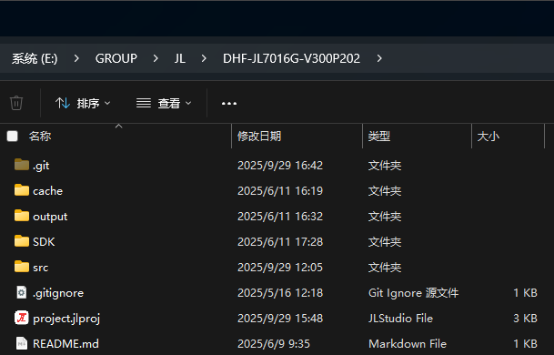
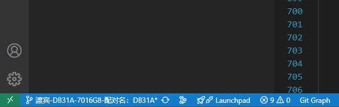

# 灯效

`apps\earphone\ui\led\led_ui_manager.c`还是这个函数`ui_manage_scan`更新但是有区别。

TWS配对灯效：

```c
 	case STATUS_BT_TWS_CONN:
        log_info("[STATUS_BT_TWS_CONN]\n");
         if (get_bt_tws_connect_status()) {
            if ( (channel == 'L')) {
                    led_ui_manager_display(1,LED_RED_BLUE_FAST_FLASH,0); 
                    log_info("STATUS_BT_TWS_CONN L------------------------\n");
            } else if (channel == 'R') {
                    led_ui_manager_display(1,LED_ALL_OFF,0); 
                    log_info("STATUS_BT_TWS_CONN R------------------------\n");
            }
            //  led_ui_manager_display(0,LED_RED_SLOW_FLASH,0); 
        }
        break;
```

# 入耳检测位置

参考：





## 外部入耳检测硬件

`apps\earphone\board\br28\board_ac701n_demo_cfg.h`

```c
//*********************************************************************************//
//                                 外置入耳检测                                        //
//*********************************************************************************//
#define TCFG_EAR_DETECT_ENABLE                  ENABLE_THIS_MOUDLE//DISABLE_THIS_MOUDLE         //入耳检测使能
#define DEVICE_EVENT_FROM_EAR_DETECT		     (('E' << 24) | ('A' << 16) | ('R' << 8) | '\0')
/*检测类型 :
    EAR_DETECT_BY_TOUCH , EAR_DETECT_BY_IR
*/
#define TCFG_EAR_DETECT_TYPE    		        EAR_DETECT_BY_IR

// TOUCH
#define TCFG_EAR_DETECT_DET_IO                  IO_PORTB_02                //检测引脚
#define TCFG_EAR_DETECT_TOUCH_MODE				0          				//入耳检测方式 1：timer检测  0 ：触发检测

// IR
#define TCFG_EAR_DET_IR_POWER_IO                NO_CONFIG_PORT                //入耳红外检测IO1
#define TCFG_EAR_DETECT_IRO1                    IO_PORTC_04                //入耳红外检测IO1
#define TCFG_EAR_DETECT_IRO1_LEVEL     			0                         //IOR1工作电平选择
#define TCFG_EAR_DETECT_IRO2                  	IO_PORTC_05//IO_PORT_DM//IO_PORTC_02                //入耳红外检测IO2
#define TCFG_EAR_DETECT_IR_MODE              	0                          //0: IO检测  1：AD检测
//IR AD 检测
#define TCFG_EAR_DETECT_AD_CH                	NO_CONFIG_PORT 			   //AD检测IO
#define TCFG_EAR_DETECT_AD_VALUE             	60

//common config
#define TCFG_EAR_DETECT_DET_LEVEL               1                          //入耳检测电平
#define TCFG_EAR_DETECT_AUTO_CHG_MASTER         1                          //通话过程中，自动切换主从
#define TCFG_EAR_DETECT_CALL_CTL_SCO            0//1                          //入耳控制通话链路
#define TCFG_EAR_DETECT_CTL_KEY            	   	1                          //入耳按键有效使能
#define TCFG_KEY_IN_EAR_FILTER_ENABLE           0                          //入耳过滤按键(针对IOKEY)
```

## 实现

- `apps\common\device\in_ear_detect\in_ear_detect.c`

```c
void __ear_detect_tch_run(void *priv)
{
    if (__this->check_status == DETECT_IDLE) {
        __this->check_status = DETECT_CHECKING;
        gpio_set_mode(IO_PORT_SPILT(TCFG_EAR_DETECT_DET_IO), PORT_INPUT_PULLUP_10K);
        sys_hi_timer_modify(__this->s_hi_timer, 2);
        return;
    }
    if (gpio_read(TCFG_EAR_DETECT_DET_IO) == TCFG_EAR_DETECT_DET_LEVEL) { //入耳
        __this->out_cnt = 0;
        if (__this->in_cnt < __this->cfg->ear_det_in_cnt) {
            //putchar('i');
            __this->is_idle = 0; //过滤期间不进入idle
            __this->in_cnt++;
            if (__this->in_cnt == __this->cfg->ear_det_in_cnt) {
                log_info("earphone touch in\n");
#if TCFG_KEY_IN_EAR_FILTER_ENABLE
                if (gpio_read(IO_PORTB_01) == 0) {
                    io_key_filter_flag = 1;
                } else {
                    io_key_filter_flag = 0;
                }
#endif
                __this->is_idle = 1;
                ear_detect_change_state_to_event(TCFG_EAR_DETECT_DET_LEVEL);
            }
        }
    } else {
        __this->in_cnt = 0;
        if (__this->out_cnt < __this->cfg->ear_det_out_cnt) {
            //putchar('o');
            __this->is_idle = 0; //过滤期间不进入idle
            __this->out_cnt++;
            if (__this->out_cnt == __this->cfg->ear_det_out_cnt) {
                log_info("earphone touch out\n");
                __this->is_idle = 1;
                ear_detect_change_state_to_event(!TCFG_EAR_DETECT_DET_LEVEL);
            }
        }
    }
    __this->check_status = DETECT_IDLE;
    gpio_set_mode(IO_PORT_SPILT(TCFG_EAR_DETECT_DET_IO), PORT_HIGHZ);
    sys_hi_timer_modify(__this->s_hi_timer, 10);
}

void ear_detect_change_state_to_event(u8 state)
{
    u8 event = EAR_DETECT_EVENT_NULL;
    log_info(" __this->pre_state===%d",  __this->pre_state);
    log_info(" __this->cur_state===%d",  __this->cur_state);
    __this->pre_state = __this->cur_state;
    __this->cur_state = state;
    if (__this->cur_state == __this->pre_state) {
        log_info("same state,return");
        return;
    }
    log_info("post event, cur_state:%d, pre_state:%d", __this->cur_state, __this->pre_state);
    event = (state == TCFG_EAR_DETECT_DET_LEVEL) ? EAR_DETECT_EVENT_IN : EAR_DETECT_EVENT_OUT;
    ear_detect_post_event(event);
}
```

## 处理

`apps\common\device\in_ear_detect\in_ear_manage.c`

```c
int ear_detect_event_handle(int *msg)
{  log_info("%s", __func__);
    // switch (state) {
    log_info("%s ,%d\n", __func__,msg[1]);
    if (msg[0] != DEVICE_EVENT_FROM_EAR_DETECT)
    {
        log_info("%s ,msg err\n", __func__);
        return 0;
    }
    
    switch (msg[1]) {
    case EAR_DETECT_EVENT_NULL:
        log_info("EAR_DETECT_EVENT_NULL");
        break;
    case EAR_DETECT_EVENT_IN:
        log_info("EAR_DETECT_EVENT_IN");
#if INEAR_ANC_UI
        etch_in_anc();
#endif
        log_info("toggle = %d,call_status = %d\n", __this->toggle, bt_get_call_status());
        if (__this->toggle && __this->bt_init_ok && (bt_get_call_status() == BT_CALL_HANGUP)) {
#if TCFG_USER_TWS_ENABLE
            if (get_tws_sibling_connect_state()) { //对耳链接上了，对耳不在耳时播，第一只播
                if (__this->tws_state != TCFG_EAR_DETECT_DET_LEVEL) { //对耳已经戴上了，不播放
                    // bt_tws_play_tone_at_same_time(SYNC_TONE_EARDET_IN, 400);
                    // tws_play_tone_file(get_tone_files()->ear_check, 400);
                }
            } else //对耳没连接上，自己决定

#endif
            {
                // tone_play(TONE_EAR_CHECK, 1);
                // play_tone_file(get_tone_files()->ear_check);
            }
        }
#if TCFG_USER_TWS_ENABLE
        if (get_tws_sibling_connect_state()) {
            tws_sync_ear_detect_state(1);
            if (tws_api_get_role() == TWS_ROLE_MASTER) {
                __ear_detect_in_dealy_deal(NULL);
            }
        } else
#endif
        {
            __ear_detect_in_dealy_deal(NULL);
        }
        if ((__this->key_enable_timer == 0) && (__this->cfg->ear_det_key_delay_time != 0)) {
            __this->key_enable_timer = sys_timeout_add((void *)1, ear_detect_set_key_delay_able, __this->cfg->ear_det_key_delay_time);
        }
        break;
    case EAR_DETECT_EVENT_OUT:
        log_info("EAR_DETECT_EVENT_OUT");
#if INEAR_ANC_UI
        etch_out_anc();
#endif
#if TCFG_USER_TWS_ENABLE
        if (get_tws_sibling_connect_state()) {
            tws_sync_ear_detect_state(1);
            if (tws_api_get_role() == TWS_ROLE_MASTER) {
                ear_detect_out_deal();
            }
        } else
#endif
        {
            ear_detect_out_deal();
        }
        if (__this->cfg->ear_det_key_delay_time != 0) {
            ear_detect_set_key_delay_able(0);
            if (__this->key_enable_timer) {
                sys_timeout_del(__this->key_enable_timer);
                __this->key_enable_timer = 0;
            }
        }
        break;
#if TCFG_USER_TWS_ENABLE
    case EAR_DETECT_EVENT_IN_DEAL:
#if INEAR_ANC_UI
        etch_in_anc();
#endif
        log_info("EAR_DETECT_EVENT_IN_DEAL");
        if (tws_api_get_role() == TWS_ROLE_MASTER) {
            __ear_detect_in_dealy_deal(NULL);
        }
        break;
    case EAR_DETECT_EVENT_OUT_DEAL:
        log_info("EAR_DETECT_EVENT_OUT_DEAL");
#if INEAR_ANC_UI
        etch_out_anc();
#endif
        if (tws_api_get_role() == TWS_ROLE_MASTER) {
            ear_detect_out_deal();
        }
        break;
#endif
    default:
        break;
    }
}

APP_MSG_PROB_HANDLER(ear_detect_msg_entry) = {  
    .owner      = 0xff,
    .from       = MSG_FROM_IN_EAR,
    .handler    = ear_detect_event_handle,
};
```

## 出入耳的ANC操作

```c
#if INEAR_ANC_UI
#include "audio_anc.h"
u8 inear_tws_ancmode = ANC_OFF;
#endif

#if INEAR_ANC_UI
void etch_in_anc(void)
{
    if (get_tws_sibling_connect_state()) {//tws
        if (__this->tws_state && __this->cur_state) {
            if (inear_tws_ancmode == ANC_ON) {
                log_info("switch anc mode\n");
                anc_mode_switch(inear_tws_ancmode, 0);
                inear_tws_ancmode = 1;
            }
        } else if (__this->cur_state && !__this->tws_state) {
            if (inear_tws_ancmode == ANC_ON) {
                anc_mode_switch(ANC_TRANSPARENCY, 0);
            }
        }
    }
}

void etch_out_anc(void)
{
    if (get_tws_sibling_connect_state()) {//tws
        if (anc_mode_get() == ANC_ON) {
            inear_tws_ancmode = ANC_ON;
            if (!__this->cur_state) {
                anc_mode_switch(ANC_OFF, 0);
            } else {
                anc_mode_switch(ANC_TRANSPARENCY, 0);

            }
        } else if (anc_mode_get() == ANC_TRANSPARENCY) {
            if (inear_tws_ancmode == ANC_ON) {
                anc_mode_switch(ANC_OFF, 0);
            }
        }
    }
}
#endif
```

