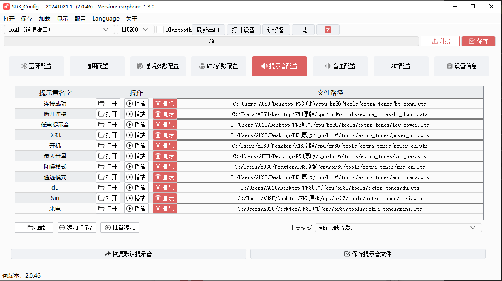

# 开低功耗

- 功耗不行
  - 先看有没有开低功耗
  - 再看在EQ有没有关
  - 看官方文档

开低功耗可以1mA以下。不开一般5mA以内。

```c
//*********************************************************************************//
//                                  低功耗配置                                     //
//*********************************************************************************//
#define TCFG_LOWPOWER_POWER_SEL				PWR_DCDC15//PWR_LDO15                    //电源模式设置，可选DCDC和LDO
#define TCFG_LOWPOWER_BTOSC_DISABLE			0                            //低功耗模式下BTOSC是否保持
#define TCFG_LOWPOWER_LOWPOWER_SEL			1//0   //芯片是否进入powerdown
/*强VDDIO等级配置,可选：
    VDDIOM_VOL_20V    VDDIOM_VOL_22V    VDDIOM_VOL_24V    VDDIOM_VOL_26V
    VDDIOM_VOL_30V    VDDIOM_VOL_30V    VDDIOM_VOL_32V    VDDIOM_VOL_36V*/
#define TCFG_LOWPOWER_VDDIOM_LEVEL			VDDIOM_VOL_28V
/*弱VDDIO等级配置，可选：
    VDDIOW_VOL_21V    VDDIOW_VOL_24V    VDDIOW_VOL_28V    VDDIOW_VOL_32V*/
#define TCFG_LOWPOWER_VDDIOW_LEVEL			VDDIOW_VOL_26V               //弱VDDIO等级配置
#define TCFG_LOWPOWER_OSC_TYPE              OSC_TYPE_LRC
#define TCFG_LOWPOWER_LIGHT_SLEEP_ATTRIBUTE 	LOWPOWER_LIGHT_SLEEP_ATTRIBUTE_KEEP_CLOCK 		//低功耗LIGHT模式属性, 可以选择是否保持住一些电源和时钟

```

看是否带ANC，可能会影响ANC效果以及灯效。

`apps\earphone\board\br36\board_ac700n_demo_cfg.h`

```c
/**************
 *ANC配置
 *************/
#define TCFG_AUDIO_ANC_ENABLE				CONFIG_ANC_ENABLE		//ANC总使能,根据global_bulid_cfg板级定义
#define TCFG_ANC_TOOL_DEBUG_ONLINE 			1//DISABLE_THIS_MOUDLE		//ANC工具蓝牙spp调试
#define TCFG_ANC_EXPORT_RAM_EN				DISABLE_THIS_MOUDLE		//ANCdebug数据释放RAM使能
#if TCFG_ANC_EXPORT_RAM_EN
#define TCFG_AUDIO_CVP_CODE_AT_RAM			DISABLE_THIS_MOUDLE
#define TCFG_AUDIO_AAC_CODE_AT_RAM			DISABLE_THIS_MOUDLE
#endif/*TCFG_ANC_EXPORT_RAM_EN*/
```

**要保护的IO口**

`apps\earphone\board\br36\board_ac700n_demo.c`

```c
#if TCFG_AUDIO_ANC_ENABLE
	if(anc_status_get() && (!is_softoff)){
		//ANC 低功耗状态下需要保持的IO口
		port_protect(port_group, TCFG_AUDIO_MIC_PWR_PORT); 
	}
#endif/*TCFG_AUDIO_ANC_ENABLE*/
	gpio_set_pull_up(IO_PORT_DP, 0);
    gpio_set_pull_down(IO_PORT_DP, 0);
    gpio_set_die(IO_PORT_DP, 0);
    gpio_set_dieh(IO_PORT_DP, 0);
    gpio_set_direction(IO_PORT_DP, 1);
    //冲突了？保护PC2但是DM脚与它共用？
    //DM的状态有消耗？还是不行。。。
    // gpio_set_pull_up(IO_PORT_DM, 0);
    // gpio_set_pull_down(IO_PORT_DM, 0);
    // gpio_set_die(IO_PORT_DM, 0);
    // gpio_set_dieh(IO_PORT_DM, 0);
    // gpio_set_direction(IO_PORT_DM, 1);
```


## 连接状态进入低功耗后，功耗会跳变

- **公版也会跳动。**

## 不进入低功耗

检查所有对外的调试接口，都要关闭。

- 在线EQ
- 触摸测试等

# ANC

## 记忆模式

`cpu\br36\audio\audio_anc.h`

```c
#define ANC_INFO_SAVE_ENABLE	1//0	/*ANC信息记忆:保存上一次关机时所处的降噪模式等等*/
```

## 每次都保存ANC模式

`cpu\br36\audio\audio_anc.c`

```c
/*ANC信息保存*/
void anc_info_save()
{
    if (anc_hdl) {
        anc_info_t anc_info;
        int ret = syscfg_read(CFG_ANC_INFO, &anc_info, sizeof(anc_info));
        if (ret == sizeof(anc_info)) {
#if INEAR_ANC_UI
            if (anc_info.mode == anc_hdl->param.mode && anc_info.inear_tws_mode == inear_tws_ancmode) {
#else
            if (anc_info.mode == anc_hdl->param.mode) {
#endif/*INEAR_ANC_UI*/
                user_anc_log("anc info.mode == cur_anc_mode");
                return;
            }
        } else {
            user_anc_log("read anc_info err");
        }

        user_anc_log("save anc_info");
        //anc_info.mode = anc_hdl->param.mode;//anc_hdl->param.mode = ANC_OFF;
        anc_info.mode = ANC_ON; //打开记忆功能，每次都保存ANC，保证每次开机都是ANC_ON状态
#if INEAR_ANC_UI
        anc_info.inear_tws_mode = inear_tws_ancmode;
#endif/*INEAR_ANC_UI*/
        ret = syscfg_write(CFG_ANC_INFO, &anc_info, sizeof(anc_info));
        if (ret != sizeof(anc_info)) {
            user_anc_log("anc info save err!\n");
        }

    }
}
```

## 开降噪测试

在降噪测试仪上测降噪。

跟调ANC参数同理。开SPP。


`apps\earphone\board\br36\board_ac700n_demo_cfg.h`


- 自动打开SPP和在线调试功能

- **`TCFG_AEC_TOOL_ONLINE_ENABLE`** - 回音消除（AEC）参数在线调试功能开启
- **`TCFG_AUDIO_DMS_DUT_ENABLE`** - 双麦克风降噪DUT（Device Under Test）模式开启
- **`TCFG_ANC_TOOL_DEBUG_ONLINE`** - ANC（主动降噪）工具蓝牙SPP调试功能开启
- **`TCFG_COMM_TYPE == TCFG_SPP_COMM`** - 通信类型配置为SPP通信模式

当上述任意条件满足时，代码会：

```c
#undef USER_SUPPORT_PROFILE_SPP    // 取消之前的定义
#undef APP_ONLINE_DEBUG            // 取消之前的定义
#define USER_SUPPORT_PROFILE_SPP 1  // 启用SPP配置文件支持
#define APP_ONLINE_DEBUG 1          // 启用应用在线调试功能
```

允许在需要调试功能时自动启用SPP支持，避免在正常产品中包含不必要的调试代码。

- **还是要手动打开`APP_ONLINE_DEBUG`，降噪仪器才能使用。**
- **开对应的调试宏，开SPP，开在线调试宏。**


# EQ

## 音乐整体音量

- 播放整体音量降1db
- 直接在 音乐eq 上去减


- 根据是否开ANC，选择EQ文件进行修改


**编译后，最终eq会被替换。最明显的标志就是两者的修改时间是一样的。但是这一次校验码没变，不知道为什么。**

## 支持eq配置bin文件切换

可以切换`NORMAL`和`BASS`的EQ

`apps\earphone\board\br36\board_ac700n_demo_cfg.h`

```c
#define TCFG_USE_EQ_FILE                          1    //离线eq使用配置文件还是默认系数表 1：使用文件  0 使用默认系数表
#define TCFG_EQ_FILE_SWITCH_EN                    1//0     //支持eq配置文件切换(需使能TCFG_USE_EQ_FILE)
```

**切换时的提示音**

`apps\earphone\include\tone_player.h`

使用工具转换。

```c
#define TONE_NORMAL_EQ  		SDFILE_RES_ROOT_PATH"tone/normal_eq.*"
#define TONE_BASS_EQ  	    	SDFILE_RES_ROOT_PATH"tone/bass_eq.*"

IDEX_TONE_NORMAL_EQ,
IDEX_TONE_BASS_EQ,
```

`eq_file_switch();`

```c
#if TCFG_EQ_FILE_SWITCH_EN
//根据eq_file_switch_list切换到指定的eq文件
void eq_file_set_by_index(u8 index)
{
    if (index >= ARRAY_SIZE(eq_file_switch_list)) {
        printf("err, max index %d\n", ARRAY_SIZE(eq_file_switch_list));
        return;
    }
    EQ_CFG *eq_cfg = get_eq_cfg_hdl();
    if (!eq_cfg) {
        return;
    }
    int ret = eq_file_get_cfg(eq_cfg, eq_file_switch_list[index]);
    printf("eq_file_switch : %d, ret : %d", index, ret);
}

//根据eq_file_switch_list成员个数顺序切换eq文件
void eq_file_switch()
{
    static u8 index = 0;
    // index++;
    // if (index >= ARRAY_SIZE(eq_file_switch_list)) {
    //     index = 0;
    // }
    if(index){
        tone_play_index(IDEX_TONE_NORMAL_EQ,1);
    }else{
        tone_play_index(IDEX_TONE_BASS_EQ,1);
    }
    index = !index;
    eq_file_set_by_index(index);
}
#endif
```

`cpu\br36\audio\eq_config.c`

```c
#if TCFG_EQ_FILE_SWITCH_EN
const u8 *eq_file_switch_list[] = {
    (u8 *)SDFILE_RES_ROOT_PATH"eq_cfg_hw.bin",
    (u8 *)SDFILE_RES_ROOT_PATH"eq_cfg_hw1.bin",
    // (u8 *)SDFILE_RES_ROOT_PATH"eq_cfg_hw2.bin",
};
#endif
```

使用不同的eq的bin文件实现不同音效模式。

## 在线调EQ

不定义就会报错：


## EQ的启用形式

- **当常规流程替换外面的eq时校验码没有改变时，可能eq的应用形式已经改变。**

`apps\earphone\board\br36\board_ac700n_demo_cfg.h`


- `cpu\br36\audio\eq_config.c`
- 这是EQ切换时的数组


- 没有用到外面的eq文件？


**正常带APP的download：**


所以按常规流程不行，没用到那个文件。

# 按键

## 内置触摸多击加长按X秒的检测

- 实现：检测多击加长按X秒，同时不会发出多击事件和长按事件

- 原理：检测完多击之后，检测是否还处于长按状态，利用内置触摸的long和hold回调计算长按时间

**加一个变量**

- `include_lib\driver\cpu\br36\asm\lp_touch_key_api.h`

```c
struct ctmu_key {
    u8 init;
    u8 softoff_mode;
    u8 slide_dir;
    u8 click_cnt[LP_CTMU_CHANNEL_SIZE];
    u8 last_key[LP_CTMU_CHANNEL_SIZE];
    u16 short_timer[LP_CTMU_CHANNEL_SIZE];

    u8 key_ch_msg_lock;
    u16 key_ch_msg_lock_timer;

    u8 eartch_inear_ok;
    u8 eartch_last_state;
    u8 eartch_trim_flag;
    u16 eartch_trim_value;
    u16 key_active_cnt[LP_CTMU_CHANNEL_SIZE];//长按计数

    const struct lp_touch_key_platform_data *config;
};
```

**long回调判断之前有没有多击，有多击就进入多击长按流程**

- `cpu\br36\lp_touch_key.c`

```c
static void ctmu_long_click_handle(u8 ch)
{
    struct sys_event e;
#if CTMU_CLICK_LONG_PRESS_DET_EN
    //多击+长按状态不发长按事件（可以改成自定义事件）
    if(__this->last_key[ch] == CTMU_KEY_SHORT_CLICK){
        __this->key_active_cnt[ch] = 0;
        __this->last_key[ch] = CTMU_KEY_SHORT_LONG_CLICK;
        e.u.key.event = KEY_EVENT_USER + __this->click_cnt[ch];
        e.u.key.value = __this->key_active_cnt[ch];
        __ctmu_notify_key_event(&e, ch);
        log_debug("notify key short long");
        return;
    }
#endif
    __this->last_key[ch] = CTMU_KEY_LONG_CLICK;
    e.u.key.event = KEY_EVENT_LONG;
    e.u.key.value = __this->config->ch[ch].key_value;

    __ctmu_notify_key_event(&e, ch);
}
```

**hold回调计算长按时间**

- `cpu\br36\lp_touch_key.c`

```c
static void ctmu_hold_click_handle(u8 ch)
{
    struct sys_event e;
#if CTMU_CLICK_LONG_PRESS_DET_EN
    //多击+长按状态不发HOLD事件（可以改成自定义事件）
    if(__this->last_key[ch] == CTMU_KEY_SHORT_LONG_CLICK){
        if((__this->key_active_cnt[ch] + 1) >= 255){
            return;//超过255次不处理
        }
        __this->key_active_cnt[ch] += 1;
        e.u.key.event = KEY_EVENT_USER + __this->click_cnt[ch];
        e.u.key.value = __this->key_active_cnt[ch];
        __ctmu_notify_key_event(&e, ch);
        return;
    }
#endif

    __this->last_key[ch] = CTMU_KEY_HOLD_CLICK;
    e.u.key.event = KEY_EVENT_HOLD;
    e.u.key.value = __this->config->ch[ch].key_value;

    __ctmu_notify_key_event(&e, ch);
}
```

**raise回调结束流程**

- `cpu\br36\lp_touch_key.c`

```c
static void ctmu_raise_click_handle(u8 ch)
{
    struct sys_event e = {0};

#if CTMU_CLICK_LONG_PRESS_DET_EN
    //多击+长按状态不发长按抬起事件（可以改成自定义事件）
    if(__this->last_key[ch] == CTMU_KEY_SHORT_LONG_CLICK){
        __this->last_key[ch] = CTMU_KEY_NULL;
        //e.u.key.event = KEY_EVENT_USER + __this->click_cnt[ch];
        //e.u.key.value = __this->key_active_cnt[ch];
        //__ctmu_notify_key_event(&e, ch);
        log_debug("notify key short long up");
        return;
    }
#endif

    if (__this->last_key[ch] >= CTMU_KEY_LONG_CLICK) {
        e.u.key.event = KEY_EVENT_UP;
        e.u.key.value = __this->config->ch[ch].key_value;
        __ctmu_notify_key_event(&e, ch);

        __this->last_key[ch] = CTMU_KEY_NULL;
        log_debug("notify key HOLD UP event");
    } else {
        ctmu_short_click_handle(ch);
    }
}
```

**屏蔽多击事件**

```c
static void __ctmu_short_click_time_out_handle(void *priv)
{
    u8 ch = *((u8 *)priv);
    struct sys_event e;

#if CTMU_CLICK_LONG_PRESS_DET_EN
    //触摸状态下不允许发多击事件
    if(P2M_CTMU_WKUP_MSG & (P2M_MESSAGE_KEY_ACTIVE_FLAG)){
        __this->short_timer[ch] = LP_TOUCH_KEY_TIMER_MAGIC_NUM;
        log_debug("key%d is active!!!!!!!/n", ch);
        return;
    }
#endif

    switch (__this->click_cnt[ch]) {
```

**获取多击+长按事件**

- `apps\earphone\key_event_deal.c`
- `app_earphone_key_event_handler`

```c
#if TCFG_APP_MUSIC_EN
    if (event->arg == DEVICE_EVENT_FROM_CUSTOM) {
        log_e("is music mode msg\n");
        return false;
    }
#endif
#if CTMU_CLICK_LONG_PRESS_DET_EN
    if (key->event >= KEY_EVENT_USER) {
        log_info("key_event_user:%d %d\n",key->event,key->value);
        //内置触摸按键的多击+长按功能处理
        u8 click_cnt = key->event - KEY_EVENT_USER; //多击次数
        u32 long_press_cnt = key->value;//长按时间（实际时间用second_to_cnt反推）
        switch (click_cnt) {
            case 1:
             //单击+长按(这里默认两秒？)
             if (get_tws_sibling_connect_state()) {
                    if ((u32)event->arg != KEY_EVENT_FROM_TWS) {
                        tws_api_sync_call_by_uuid('T', SYNC_CMD_POWER_OFF_TOGETHER, TWS_SYNC_TIME_DO);
                    } else {
                        goto_poweroff_cnt--;
                    }
                } else {
                    sys_enter_soft_poweroff(NULL);
                }
                break;
            // case 3:
            //     //三击+长按
            //     if(long_press_cnt == second_to_cnt(5)){
            //         //三击+长按5秒强制TWS组队，清除手机配对记录
            //         printf("三击+长按5秒强制TWS组队,清除手机配对记录\n");
            //         set_tws_force_pair_flag(1);
            //         user_send_cmd_prepare(USER_CTRL_DEL_ALL_REMOTE_INFO, 0, NULL); //清除手机配对记录
            //         sys_enter_soft_poweroff(NULL);
            //     }
            //     break;
            default:
                break;
        }
    }
#endif
```

**宏值定义**

- `include_lib\driver\cpu\br36\asm\lp_touch_key_api.h`

```c
enum ctmu_key_event {
    CTMU_KEY_NULL,
    CTMU_KEY_SHORT_CLICK,
    CTMU_KEY_LONG_CLICK,
    CTMU_KEY_HOLD_CLICK,
    CTMU_KEY_SHORT_LONG_CLICK,//单击+长按
};
```

# 提示音

## 替换提示音

打开配置工具入口，点击配置工具：



1. 收集对应的中文MP3格式的音效素材
2. 把原有音效删除，新音效改为同名MP3
3. 然后点击打开选中即可
4. 格式跟原来一样，点击保存提示音文件
5. 再点击保存到bin即可编译生效。
6. **换音质的话，应该从MP3开始转换，如果WTG低音质转成WTS高音质的话，会失真。**

### 区分左右耳

**区分左右耳的话，出包需要分开编译分别打包各自的ufw文件：**

**apps\earphone\include\app_config.h**

```c
/* 声道确定方式选择 */
#define CONFIG_TWS_MASTER_AS_LEFT             0 //主机作为左耳
#define CONFIG_TWS_AS_LEFT_CHANNEL            1 //固定左耳
#define CONFIG_TWS_AS_RIGHT_CHANNEL           2 //固定右耳
#define CONFIG_TWS_LEFT_START_PAIR            3 //双击发起配对的耳机做左耳
#define CONFIG_TWS_RIGHT_START_PAIR           4 //双击发起配对的耳机做右耳
#define CONFIG_TWS_EXTERN_UP_AS_LEFT          5 //外部有上拉电阻作为左耳
#define CONFIG_TWS_EXTERN_DOWN_AS_LEFT        6 //外部有下拉电阻作为左耳
#define CONFIG_TWS_SECECT_BY_CHARGESTORE      7 //充电仓决定左右耳
#define CONFIG_TWS_CHANNEL_SELECT             CONFIG_TWS_AS_LEFT_CHANNEL //配对方式选择
```

**左右耳分别切换宏编译出包。**

格式支持要做好，不要的格式就不启用，免得占用资源：

`apps\earphone\board\br30\board_ad697n_demo_cfg.h`

`TCFG_BT_SUPPORT_G729` 用于控制 G.729 格式（即 WTG）的支持：

- 置为 `1` 时开启 G.729（WTG）格式解码支持；
- 置为 `0` 时关闭此支持。

`TCFG_DEC_WTGV2_ENABLE` 用于控制 WTS 格式的支持：

- 置为 `1` 时开启 WTS 格式解码支持；
- 置为 `0` 时关闭此支持。

**格式对不上的话，烧录进入是完全没有提示音的。**

### 出包

在左耳文件夹中更新表格，并重命名新的包含校验码和修改时间的文件名。

使用**烧写文件授权工具**可以查看大写的校验码，使用校验码查看工具可以看到小写的校验码。

分别打包压缩发出即可。

## 生效

`apps\earphone\include\tone_player.h`工具转换了，但是代码不引用也是不生效的。


**所以demo.c配置了，TWS模式下，`play_tone_at_same_time`这里不调用，也是不生效。**


## 最大提示音需要打断（抢断）音乐

`apps\earphone\key_event_deal.c`

```c
void volume_up(u8 inc)
{
    u8 test_box_vol_up = 0x41;
    s8 cur_vol = 0;
    u8 call_status = get_call_status();

    if (tone_get_status() && volume_flag) {
        if (get_call_status() == BT_CALL_INCOMING) {
            volume_up_down_direct(1);
        }
        return;
    }

    /*打电话出去彩铃要可以调音量大小*/
    if ((call_status == BT_CALL_ACTIVE) || (call_status == BT_CALL_OUTGOING)) {
        cur_vol = app_audio_get_volume(APP_AUDIO_STATE_CALL);
    } else {
        cur_vol = app_audio_get_volume(APP_AUDIO_STATE_MUSIC);
    }
    if (get_remote_test_flag()) {
        user_send_cmd_prepare(USER_CTRL_TEST_KEY, 1, &test_box_vol_up); //音量加
    }

    if (cur_vol >= app_audio_get_max_volume()) {
#if TCFG_USER_TWS_ENABLE
        if (get_tws_sibling_connect_state()) {
            if (tws_api_get_role() == TWS_ROLE_MASTER && replay_tone_flag) {
                replay_tone_flag = 0;               //防止提示音被打断标志
                bt_tws_play_tone_at_same_time(SYNC_TONE_MAX_VOL, 400);
                max_tone_timer_hdl = sys_timeout_add(NULL, max_tone_timer, TWS_SYNC_TIME_DO + 100);  //同步在TWS_SYNC_TIME_DO之后才会播放提示音，所以timer需要在这个时间之后才去检测提示音状态
            }
        } else
#endif
        {
#if TCFG_MAX_VOL_PROMPT
            STATUS *p_tone = get_tone_config();
            //1是抢断，0是叠加---------------这是单耳的
            tone_play_index(p_tone->max_vol, 0);
#endif
        }

//...
```

双耳调用的是`bt_tws_play_tone_at_same_time(SYNC_TONE_MAX_VOL, 400);`

```c
TWS_SYNC_CALL_REGISTER(tws_tone_play) = {
    .uuid = 0x123A9E50,
    .task_name = "app_core",
    .func = play_tone_at_same_time,
};

void bt_tws_play_tone_at_same_time(int tone_name, int msec)
{
    tws_api_sync_call_by_uuid(0x123A9E50, tone_name, msec);
}
```

`apps\earphone\bt_tws.c`

```c
/*
 * 提示音同步播放
 */
static void play_tone_at_same_time(int tone_name, int err)
{
    STATUS *p_tone = get_tone_config();
    int state;

    switch (tone_name) {
#if TCFG_EAR_DETECT_ENABLE
    //...
    case SYNC_TONE_MAX_VOL:
#if TCFG_MAX_VOL_PROMPT
        if (p_tone->max_vol != IDEX_TONE_NONE) {
            //1是可以抢断音乐
            tone_play_index(p_tone->max_vol, 1);
        } else {
            /* tone_sin_play(150, 1); */
        }
#endif
        break;
```

## 内部提示音引用路径位置

`apps\earphone\include\tone_player.h`

```c
#define TONE_LOW_LATENCY_IN     	DEFAULT_SINE_TONE(SINE_WTONE_LOW_LATENRY_IN)//SDFILE_RES_ROOT_PATH"tone/game_mode.*"//DEFAULT_SINE_TONE(SINE_WTONE_LOW_LATENRY_IN)
#define TONE_LOW_LATENCY_OUT    	SDFILE_RES_ROOT_PATH"tone/music_mode.*"//DEFAULT_SINE_TONE(SINE_WTONE_LOW_LATENRY_OUT)
```

- 使用内部和弦音或者引用外部提示音配置

## 提示音不同步

以**两个SDK**工程区分机器左右耳的话，如果代码层面没有查出问题的话。而烧录同一个工程又可以同步时。

可以`AC897N_AD697N_earphone_release_V2.3.0-left\cpu\br30\tools\earphone\standard`查看tone.cfg文件大小不一样的话，需要同步替换一下。

**其中一个工程修改过提示音的音质的话，两边音质不一样，提示音文件解析速度不一样就导致了双耳提示音不同步。**

## 两个提示音函数

### `tone_play_index(TONE_LOW_LATENCY_IN, 1);`

```c
/*
 *index:提示音索引
 *preemption:抢断标志-----1会打断，0会叠加
 */
__BANK_TONE_ENTRY
int tone_play_index(u8 index, u8 preemption)
{
    printf("tone_play_index:%d,preemption:%d", index, preemption);
    if (index >= IDEX_TONE_NONE) {
        return 0;
    }
    return tone_play(tone_index[index], preemption);
}
```

这意味着`apps\earphone\include\tone_player.h`需要定义类似的枚举变量`IDEX_TONE_NONE`，值不能超过`IDEX_TONE_NONE`，也就是添加在它的前面。

`tone_play_index(TONE_LOW_LATENCY_OUT, 1);`直接使用的话。`TONE_LOW_LATENCY_OUT`这是一个宏（提示音引用路径），可能过不了那个if判断而出错（**经过验证**）。

#### 疑问

`apps\earphone\board\br36\board_ac700n_demo.c`中定义的提示音又是怎么使用呢？

`STATUS_CONFIG status_config`

```c
	//提示音设置
    .tone = {
        .charge_start  = IDEX_TONE_NONE,
        .charge_full   = IDEX_TONE_NONE,
        .power_on      = IDEX_TONE_POWER_ON,
        .power_off     = IDEX_TONE_POWER_OFF,
        .lowpower      = IDEX_TONE_LOW_POWER,
        .max_vol       = IDEX_TONE_MAX_VOL,
        .phone_in      = IDEX_TONE_NONE,
        .phone_out     = IDEX_TONE_NONE,
        .phone_activ   = IDEX_TONE_NONE,
        .bt_init_ok    = IDEX_TONE_BT_MODE,
        .bt_connect_ok = IDEX_TONE_BT_CONN,
        .bt_disconnect = IDEX_TONE_BT_DISCONN,
        .tws_connect_ok   = IDEX_TONE_TWS_CONN,
        .tws_disconnect   = IDEX_TONE_TWS_DISCONN,
    }
```

**这个也是生效的。前提是工具有音源文件，代码中路径也搞好了。不知道这个是同名索引枚举值？**

- 加`IDEX`内部应该有处理的。

```c
#define TONE_POWER_ON			SDFILE_RES_ROOT_PATH"tone/power_on.*"

IDEX_TONE_ANC_OFF
```

### `tone_play(TONE_LOW_LATENCY_IN, 1);`

提示音的底层播放函数是，可以直接传入提示音的宏定义（引用路径）

## 外部提示音的宏定义怎么来的？

使用配置工具添加并保存提示音后，也没有宏定义。难道是手动写？工具只是转换以及保存到`tone.cfg`以及`cfg_tool.bin`

**如果是可视化的话，自动生成。如果是配置工具的话，就是自己写。**

- 通过配置工具添加保存到文件中（工程中）
  - `tone.cf`
  - `cfg_tool.bin`
- 模仿其他宏写对应定义
- 使用`tone_play`播放

## 最大最小提示音

`apps\earphone\bt_tws.c`

- 在加减提示音音量函数中有相关的判断
  - `volume_down`
  - `volume_up`

```c
void volume_up(u8 inc)
{
    u8 test_box_vol_up = 0x41;
    s8 cur_vol = 0;
    u8 call_status = get_call_status();

    if (tone_get_status() && volume_flag) {
        if (get_call_status() == BT_CALL_INCOMING) {
            volume_up_down_direct(1);
        }
        return;
    }

    /*打电话出去彩铃要可以调音量大小*/
    if ((call_status == BT_CALL_ACTIVE) || (call_status == BT_CALL_OUTGOING)) {
        cur_vol = app_audio_get_volume(APP_AUDIO_STATE_CALL);
    } else {
        cur_vol = app_audio_get_volume(APP_AUDIO_STATE_MUSIC);
    }
    if (get_remote_test_flag()) {
        user_send_cmd_prepare(USER_CTRL_TEST_KEY, 1, &test_box_vol_up); //音量加
    }

    //获取最大音量，与当前音量比较
    if (cur_vol >= app_audio_get_max_volume()) {
#if TCFG_USER_TWS_ENABLE //TWS双耳的逻辑
        if (get_tws_sibling_connect_state()) {
            if (tws_api_get_role() == TWS_ROLE_MASTER && replay_tone_flag) {
                replay_tone_flag = 0;               //防止提示音被打断标志
                bt_tws_play_tone_at_same_time(SYNC_TONE_MAX_VOL, 400);//400ms后调用函数
                max_tone_timer_hdl = sys_timeout_add(NULL, max_tone_timer, TWS_SYNC_TIME_DO + 100);  //同步在TWS_SYNC_TIME_DO之后才会播放提示音，所以timer需要在这个时间之后才去检测提示音状态
            }
        } else
#endif
        {
#if TCFG_MAX_VOL_PROMPT //单耳的逻辑
            STATUS *p_tone = get_tone_config();
            tone_play_index(p_tone->max_vol, 1);//这里直接使用配置中的枚举
#endif
        }

        if (get_call_status() != BT_CALL_HANGUP) {
            /*本地音量最大，如果手机音量还没最大，继续加，以防显示不同步*/
            if (bt_user_priv_var.phone_vol < 15) {
                if (get_curr_channel_state() & HID_CH) {
                    user_send_cmd_prepare(USER_CTRL_HID_VOL_UP, 0, NULL);
                } else {
                    user_send_cmd_prepare(USER_CTRL_HFP_CALL_VOLUME_UP, 0, NULL);
                }
            }
            return;
        }
#if BT_SUPPORT_MUSIC_VOL_SYNC
        opid_play_vol_sync_fun(&app_var.music_volume, 1);
        user_send_cmd_prepare(USER_CTRL_CMD_SYNC_VOL_INC, 0, NULL);
#endif/*BT_SUPPORT_MUSIC_VOL_SYNC*/
        return;
    }

#if BT_SUPPORT_MUSIC_VOL_SYNC
    opid_play_vol_sync_fun(&app_var.music_volume, 1);
    app_audio_set_volume(APP_AUDIO_STATE_MUSIC, app_var.music_volume, 1);
#else
    app_audio_volume_up(inc);
#endif/*BT_SUPPORT_MUSIC_VOL_SYNC*/
    log_info("vol+: %d", app_audio_get_volume(APP_AUDIO_CURRENT_STATE));
    if (get_call_status() != BT_CALL_HANGUP) {
        if (get_curr_channel_state() & HID_CH) {
            user_send_cmd_prepare(USER_CTRL_HID_VOL_UP, 0, NULL);
        } else {
            user_send_cmd_prepare(USER_CTRL_HFP_CALL_VOLUME_UP, 0, NULL);
        }
    } else {
#if BT_SUPPORT_MUSIC_VOL_SYNC
        /* opid_play_vol_sync_fun(&app_var.music_volume, 1); */

#if TCFG_USER_TWS_ENABLE
        user_send_cmd_prepare(USER_CTRL_CMD_SYNC_VOL_INC, 0, NULL);     //使用HID调音量
        //user_send_cmd_prepare(USER_CTRL_AVCTP_OPID_SEND_VOL, 0, NULL);
#else
        user_send_cmd_prepare(USER_CTRL_CMD_SYNC_VOL_INC, 0, NULL);
#endif/*TCFG_USER_TWS_ENABLE*/
#endif/*BT_SUPPORT_MUSIC_VOL_SYNC*/
    }
}
```

`bt_tws_play_tone_at_same_time`

```c
/*
 * 提示音同步播放
 */
static void play_tone_at_same_time(int tone_name, int err)
{
    STATUS *p_tone = get_tone_config();
    int state;

    switch (tone_name) {
            case SYNC_TONE_MAX_VOL:
#if TCFG_MAX_VOL_PROMPT
        if (p_tone->max_vol != IDEX_TONE_NONE) {
            tone_play_index(p_tone->max_vol, 1);
        } else {
            /* tone_sin_play(150, 1); */
        }
#endif
        break;
```

**所以demo.c配置了，TWS模式下，这里不调用，也是不生效。**

### 没有按键控制，使用手机控制到最大音量时

手机上操作到最大音量就不会往上加了，耳机到最大提示音时，还要加音量，耳机触发条件会播报。

## 提示音的音量调节

### 来电同步手机的提示音太小

- 这个是手机的，音量增加不了，只能手机控制音量，进而控制来电提示音的大小

### 调节耳机提示音的音量大小

- 这个软件的提示音film mode,music mode, game mode这3个提示音的音量要帮忙减小1/3
  - 如果是个别的话直接修改音源。


`cpu\br36\audio\audio_config.h`

```c
#define MAX_ANA_VOL             (15)	// 系统最大模拟音量,范围: 0 ~ 15
#define MAX_COM_VOL             (16)    // 数值应该大于等于16，具体数值应小于联合音量等级的数组大小 (combined_vol_list)
#define MAX_DIG_VOL             (16)    // 数值应该大于等于16，因为手机是16级，如果小于16会导致某些情况手机改了音量等级但是小机音量没有变化

#if (SYS_VOL_TYPE == VOL_TYPE_DIGITAL)  //---------提示音音量
#define SYS_MAX_VOL             16
#define SYS_DEFAULT_VOL         16
#define SYS_DEFAULT_TONE_VOL    10
#define SYS_DEFAULT_SIN_VOL    	8
```

## 添加按键提示音

配置工具中要有按键提示音的音源文件。


`apps\earphone\board\br28\board_jl701n_demo_cfg.h`

```c
//*********************************************************************************//
//                                 key 配置                                        //
//*********************************************************************************//
#define KEY_NUM_MAX                        	10
#define KEY_NUM                            	3

#define MULT_KEY_ENABLE						DISABLE 		//是否使能组合按键消息, 使能后需要配置组合按键映射表

#define TCFG_KEY_TONE_EN					1//DISABLE 		// 按键提示音。
```

`apps\earphone\board\br28\board_jl701n_demo_cfg.h`对应的解码要打开：


`cpu\br28\lp_touch_key.c`

`p33_ctmu_key_event_irq_handler`中：

```c
case CTMU_P2M_CH4_FALLING_EVENT:
        log_debug("CH%d: FALLING", ch_num);
        is_lpkey_active = 1;

#if CTMU_CHECK_LONG_CLICK_BY_RES
        falling_res_avg[ch_num] = lp_touch_key_ctmu_res_buf_avg(ch_num);
        log_debug("falling_res_avg: %d", falling_res_avg[ch_num]);
#endif
        #if  TCFG_KEY_TONE_EN
        //这个不行audio_key_tone_init();
		audio_key_tone_play();
        #endif
        break;
```

`apps\common\device\key\key_driver.c`

```c
if (key_event_remap(&e)) {
        sys_event_notify(&e);
#if TCFG_KEY_TONE_EN
        audio_key_tone_play();
#endif
    }
_scan_end:
    scan_para->last_key = cur_key_value;
    return;
}
```

`cpu\br28\audio_dec.c`

```c
int audio_dec_init()
{
    int err;
    printf("audio_dec_init\n");

    tone_play_init();

#if TCFG_KEY_TONE_EN
    // 按键音初始化
    audio_key_tone_init();
#endif
```

**全局搜索-按键提示音-有相关的接口。** **全局搜索`TCFG_KEY_TONE_EN`**

### 问题

注意可能复位的情况。

## 来电提示音

替换了还是手机自带的提示音而不是配置工具中的。

`apps\earphone\board\br30\board_ad697n_demo_cfg.h`

```c
#define BT_INBAND_RINGTONE                        0//1   //是否播放手机自带来电铃声
#define BT_PHONE_NUMBER                           0   //是否播放来电报号
#define BT_SUPPORT_DISPLAY_BAT                    1   //是否使能电量检测
#define BT_SUPPORT_MUSIC_VOL_SYNC                 1   //是否使能音量同步
```

# 三方通话

`apps\earphone\key_event_deal.c`

```c
#if THREE_CALL_DEAL_ENABLE
extern u8 get_second_call_status(); //三方通话状态获取
/*
返回0 当前正在和第一个手机通话，没有来电
返回2 当前正在和第一个手机通话，第二个电话进来
返回8 当前已经保留了一个电话，正在和另外一个手机通话
*/
/*  当前正在和第一个号码通话中，没有来电*/
#define bt_second_call_active()     (get_second_call_status()==BT_THREE_CALL_ACTIVE)
/*  当前正在和第一个号码通话中，第二个电话进来*/
#define bt_second_call_incoming()   (get_second_call_status()==BT_THREE_CALL_INCOMING)
/*  当前已经保留了一个电话，正在和另外一个手机通话*/
#define bt_second_call_coming()     (get_second_call_status()==BT_THREE_CALL_COMING)
#endif
```

之前接口调用错了。

```c
typedef enum{
    BT_THREE_CALL_ACTIVE   = 0,//当前正在和第一个号码通话中，没有来电
    BT_THREE_CALL_INCOMING = 2,//当前正在和第一个号码通话中，第二个电话进来
    BT_THREE_CALL_COMING   = 8,//当前已经保留了一个电话，正在和另外一个手机通话
}BT_THREE_CALL_IND_STA;

			if ((BT_STATUS_CONNECTING == get_bt_connect_status()) ||
                (BT_STATUS_TAKEING_PHONE == get_bt_connect_status()) ||
                (BT_STATUS_PLAYING_MUSIC == get_bt_connect_status())){ 

                printf("*************get_second_call_status() = %d*****",get_second_call_status());
                if (get_call_status() == BT_CALL_INCOMING){
                    //单击第一方来电接听
                    user_send_cmd_prepare(USER_CTRL_HFP_CALL_ANSWER, 0, NULL);
                }
                else if(get_second_call_status() == BT_THREE_CALL_INCOMING){
                    //单击挂断当前去听另一个（未接听或者在保留状态都可以）
                    user_send_cmd_prepare(USER_CTRL_HFP_THREE_WAY_ANSWER1, 0, NULL);
                }else if(get_call_status()== BT_CALL_ACTIVE){
                    //单击挂断当前通话
                    user_send_cmd_prepare(USER_CTRL_HFP_CALL_HANGUP, 0, NULL);
                }else if(get_call_status() == BT_CALL_OUTGOING){
                    //单击取消拨打
                    user_send_cmd_prepare(USER_CTRL_HFP_CALL_HANGUP, 0, NULL);
                }else {
                    //单击音乐的播放与暂停
                    user_send_cmd_prepare(USER_CTRL_AVCTP_OPID_PLAY, 0, NULL); 
                    y_printf("*********USER_CTRL_AVCTP_OPID_PLAY*****");
                }
            }

if(get_second_call_status() == BT_THREE_CALL_INCOMING || get_second_call_status() == BT_THREE_CALL_COMING){
            //优先判断三方通话状态
            //保持当前通话，接听第二个来电
            user_send_cmd_prepare(USER_CTRL_HFP_THREE_WAY_ANSWER2, 0, NULL);
            //切换通话。
        }else if (get_call_status() == BT_CALL_INCOMING){
            //双击第一方来电挂断
            user_send_cmd_prepare(USER_CTRL_HFP_CALL_HANGUP, 0, NULL);
        }else if (get_bt_connect_status() >= BT_STATUS_CONNECTING) {
            //du一声,打断音乐会有割裂感
            tone_play_index(IDEX_TONE_DU, 0);
            //双击控制音量
            key_tws_lr_diff_deal(event,ONE_KEY_CTL_NEXT_PREV);
        }
```


# TWS

## 主动发起TWS配对

```c
case KEY_FIVE_CLICK:
    if (bt_tws_start_search_sibling()) {
        // tone_play_index(IDEX_TONE_NORMAL, 1);
        break;
    }
break;
```

- **场景**
  - 主要是恢复出厂设置后的TWS配对
  - 不是开机自动配对的模式

## 不同步关机

```c
    case  KEY_POWEROFF_HOLD:
#if (TCFG_USER_TWS_ENABLE && CONFIG_TWS_POWEROFF_SAME_TIME == 0)
        if ((u32)event->arg == KEY_EVENT_FROM_TWS) {
            break;
        }
#endif
        log_info("poweroff flag:%d cnt:%d\n", goto_poweroff_flag, goto_poweroff_cnt);

        if (goto_poweroff_flag) {
            //200累加一次
            goto_poweroff_cnt++;
#if CONFIG_TWS_POWEROFF_SAME_TIME
            if (goto_poweroff_cnt == POWER_OFF_CNT) {
                if (get_tws_sibling_connect_state()) {
                    if ((u32)event->arg != KEY_EVENT_FROM_TWS) {
                        tws_api_sync_call_by_uuid('T', SYNC_CMD_POWER_OFF_TOGETHER, TWS_SYNC_TIME_DO);
                    } else {
                        goto_poweroff_cnt--;
                    }
                } else {
                    sys_enter_soft_poweroff(NULL);
                }
            }
#else//注释这个就可以单耳关机，不进行同步。
            if (goto_poweroff_cnt >= POWER_OFF_CNT) {
                goto_poweroff_cnt = 0;
                sys_enter_soft_poweroff(NULL);
            }
#endif //CONFIG_TWS_POWEROFF_SAME_TIME

        }
        break;
```

## 相关接口

**获取左右声道：**

```c
if (bt_tws_get_local_channel()=='L'){
    gpio_led_mode_set(GPIO_LED0_LED1_FAST_FLASH);
}else{
    gpio_led_mode_set(GPIO_LED0_ONE_FLASH_5S);
}
```

**tws连接状态**：

```c
if(tws_api_get_tws_state() & TWS_STA_SIBLING_CONNECTED){
    gpio_led_mode_set(GPIO_LED0_ONE_FLASH_5S);//wang
}else{
    gpio_led_mode_set(GPIO_LED0_ONE_FLASH_5S);//wang
}
//不起作用，直接搜索接口的其他调用案例。
```

## TWS自动配对，可以随意组队??

`apps\earphone\include\app_config.h`

```c
#if CONFIG_TWS_PAIR_MODE != CONFIG_TWS_PAIR_BY_CLICK
#if (CONFIG_TWS_CHANNEL_SELECT == CONFIG_TWS_LEFT_START_PAIR) ||\
    (CONFIG_TWS_CHANNEL_SELECT == CONFIG_TWS_RIGHT_START_PAIR)
#undef CONFIG_TWS_CHANNEL_SELECT
#define CONFIG_TWS_CHANNEL_SELECT             CONFIG_TWS_MASTER_AS_LEFT
#endif

#if CONFIG_TWS_PAIR_MODE == CONFIG_TWS_PAIR_BY_AUTO
#if CONFIG_DEVELOPER_MODE
#define CONFIG_TWS_AUTO_PAIR_WITHOUT_UNPAIR     /* 不取消配对也可以配对新的耳机 */
#endif
#endif
#endif
```

# 灯效

- 单IO推灯
  - pwm推灯
  - 高低电平推灯
- 双IO推灯
  - pwm推灯
  - 高低电平推灯

**IO高低电平驱动LED确实不如PWM驱动来得平滑，特别是在状态切换时。**

**高低电平驱动的问题**

- **突变效应**：IO直接切换高低电平时，LED从完全亮到完全灭是瞬间完成的，这种突变在视觉上显得生硬，特别是频繁切换状态时会有明显的闪烁感。

- **无中间状态**：只有开/关两种状态，无法实现渐变效果。

**PWM驱动的优势**

- **亮度渐变**：PWM可以通过调节占空比实现不同亮度级别，让LED在状态切换时有一个渐变过程，视觉上更加柔和。

- **更丰富的效果**：可以实现呼吸灯、淡入淡出等效果，用户体验更好。

**在TWS耳机中的应用**

- 对于TWS蓝牙耳机的红蓝LED状态指示，PWM驱动确实更合适：

- **配对状态**：可以用蓝色呼吸灯表示配对模式，比单纯的闪烁更优雅 **充电状态**：红色LED可以从暗到亮渐变，直观显示充电进度 **连接状态**：可以用不同的淡入淡出速度区分不同状态

不过需要注意的是，PWM驱动会稍微增加功耗和代码复杂度。对于追求极致续航的设备，有时候简单的IO控制也是合理选择。但从用户体验角度看，PWM驱动的"丝滑"效果确实更胜一筹。

## 单IO双IO推灯的原理

### 单IO推双灯

这种方案通常使用**共阴极**或**共阳极**的双色LED，最常见的是红绿双色LED。

**核心原理：利用LED的"电压差"**

想象一下，红色LED和绿色LED就像两个不同高度的"门槛"：

- 红色LED的"门槛"高一些（通常需要1.8-2.2V才亮）
- 绿色LED的"门槛"低一些（通常需要2.0-3.2V才亮）

电路就像一个"水管系统"

```c
单IO口 ——— 红色LED ——— 绿色LED ——— 地线(GND)
   |                              |
   +——————————————————————————————+
```

把这个电路想象成一个水管，水从IO口流向地线。

**当IO输出高电平（比如3.3V）时：**

- 就像打开水龙头，水压很足
- 水流方向：IO → 红色LED → 绿色LED → 地线
- 但是！红色LED的"门槛"比较容易跨过，所以红色LED先亮起来
- 红色LED亮了之后，电压被它"吃掉"了大部分，绿色LED得到的电压不够，所以不亮
- **结果：只有红灯亮**

**当IO输出低电平（0V）时：**

- 水龙头关闭，但是...
- 这时候绿色LED那边的电压通过内部电路有一个反向的小电流
- 绿色LED更容易在低电压下工作，所以绿灯亮
- **结果：只有绿灯亮**

**用PWM控制**

- **PWM高占空比**：大部分时间是高电平，红灯亮得多
- **PWM低占空比**：大部分时间是低电平，绿灯亮得多
- **PWM中等占空比**：红绿快速切换，眼睛看起来像黄色/橙色

就像两个灯泡快速轮流闪烁，我们眼睛看起来就像混合的颜色！

#### 疑问

**电路原理也看不出共阴极或共阳极的双色LED啊？硬件是有两个单独的LED还是一个硬件上有两个LED结构？**

硬件结构分为两种情况

真正的双色LED（一个封装，两个芯片）

- 这是**一个物理器件**，内部有两个LED芯片：

共阴极双色LED：

```c
    红色LED阳极 ——— 引脚1
         |
    LED芯片1 ——— 共同阴极 ——— 引脚2（接GND）
         |
     绿色LED阳极 ——— 引脚3
         |  
    LED芯片2 ——— 共同阴极 ——— 引脚2（接GND）
```

共阳极双色LED：

```c
红色LED阴极 ——— 引脚1
         |
    LED芯片1 ——— 共同阳极 ——— 引脚2（接VCC）
         |
     绿色LED阴极 ——— 引脚3
         |
    LED芯片2 ——— 共同阳极 ——— 引脚2（接VCC）
```

**两个独立的LED**

- 这是**两个分离的LED器件**，通过特殊的电路连接实现单IO控制。

单IO控制的真正电路

以共阴极双色LED为例：

```c
IO口 ——— 限流电阻 ——— 红色LED阳极
                        |
                    双色LED
                        |
                   绿色LED阳极
                        |
                    共同阴极 ——— GND
```

但这样连接还是需要两个IO！

**真正的单IO推双灯电路**

- 实际上是这样的：

```c
VCC ——— 限流电阻1 ——— 红色LED阳极
                        |
                    双色LED  
                        |
                   绿色LED阳极 ——— 限流电阻2 ——— IO口
                        |
                    共同阴极 ——— GND
```

**工作原理：**

- **IO输出高电平**：绿色LED导通发光
- **IO输出低电平**：红色LED通过VCC导通发光
- **PWM控制**：可以混合两种颜色

所以答案是：**通常使用一个硬件的共阴极或共阳极双色LED**，而不是两个独立的LED。这种双色LED在外观上就是一个LED，但内部有两个不同颜色的芯片。

### 双IO推双灯

这种方案更灵活，可以实现更多状态：

```c
IO1 ——— 限流电阻1 ——— 红色LED阳极
                      |
                  红色LED阴极 ——— GND

IO2 ——— 限流电阻2 ——— 绿色LED阳极  
                      |
                  绿色LED阴极 ——— GND
```

**状态控制**

- **IO1=1, IO2=0**：红灯亮
- **IO1=0, IO2=1**：绿灯亮
- **IO1=1, IO2=1**：双灯同时亮（橙色）
- **IO1=0, IO2=0**：双灯灭
- **使用PWM**：两个IO都可以独立PWM控制，实现更丰富的颜色和亮度组合

**在TWS耳机中的应用**

对于你提到的红蓝LED，双IO方案更常见：

- 红色LED：充电/低电量指示
- 蓝色LED：蓝牙连接状态指示
- 可以通过PWM实现呼吸灯效果

单IO推双灯在成本敏感的场景下很有用，但颜色组合相对固定。双IO方案虽然多用一个IO，但控制更灵活，特别是配合PWM使用时效果更佳。

## 双IO口高低电平推灯

这个LED灯效控制代码通过状态机和定时器的组合来实现各种灯效模式。

### 核心实现机制

**初始化清理**

```c
led_cnt=0;
led_priv=0;
sys_timer_del(led_time);
led_time = 0;
```

每次设置新的LED模式前，先清理计数器、私有参数和定时器，确保状态干净。

**GPIO控制基础**

- `gpio_set_direction()`: 设置GPIO方向（0=输出，1=输入）

- `gpio_set_output_value()`: 设置GPIO输出电平（0=低电平，1=高电平）

- 通过控制两个LED引脚（GPIO_LED0_PIN和GPIO_LED1_PIN）实现不同效果

**定时器驱动的动态效果**

对于需要闪烁的效果，使用定时器机制：

```c
led_time = sys_timer_add(NULL, gpio_led_mode_display, 频率);
```

- 设置私有参数（`led_priv`）标识当前模式
- 添加定时器，定期调用`gpio_led_mode_display`函数
- 通过不同的频率实现快闪、慢闪效果

### 蓝灯慢闪

```c
void  gpio_led_mode_set(u8 led_mode)
{
    led_cnt=0;
    led_priv=0;
    sys_timer_del(led_time);
    led_time = 0;
    /**每次更新LED状态之前把计数器、私有参数、定时器都删除避免遗漏**/

    switch(led_mode){
            //......
        case GPIO_LED0_SLOW_FLASH:
            led_priv=_LED0_SLOW_FLASH_TIMER_PRIV;
            //频率为1000ms调用一次
            led_time=sys_timer_add(NULL,gpio_led_mode_display,CFG_GPIO_LED_SINGLE_SLOW_FLASH_FREQ);
        break;
```

**gpio_led_mode_display**

```c
void  gpio_led_mode_display()
{
       switch(led_priv){
               case _LED0_SLOW_FLASH_TIMER_PRIV://蓝灯1s闪一次
                   led_cnt^=1;
                   if(led_cnt){
                       gpio_set_direction(GPIO_LED0_PIN, 0);         //0：输出  1：输入
                       gpio_set_direction(GPIO_LED1_PIN , 0);         //0：输出  1：输入
                       gpio_set_output_value(GPIO_LED0_PIN,1);       //输出的状态
                       gpio_set_output_value(GPIO_LED1_PIN ,0);       //输出的状态
                   }
                   else{
                       gpio_set_direction(GPIO_LED0_PIN, 1);         //0：输出  1：输入
                       gpio_set_direction(GPIO_LED1_PIN , 1);         //0：输出  1：输入
                   }
               break;
```

**状态切换机制**

```c
led_cnt^=1;  // 关键：每次调用都翻转led_cnt的值（0变1，1变0）
```

这是一个**异或翻转操作**，实现了状态的自动切换：

- 第1次调用：`led_cnt = 0^1 = 1`
- 第2次调用：`led_cnt = 1^1 = 0`
- 第3次调用：`led_cnt = 0^1 = 1`
- 以此类推...

**根据状态控制LED**

```c
if(led_cnt){  // led_cnt=1时，点亮LED0
    gpio_set_direction(GPIO_LED0_PIN, 0);     // 设为输出模式
    gpio_set_direction(GPIO_LED1_PIN, 0);     // 设为输出模式
    gpio_set_output_value(GPIO_LED0_PIN,1);   // LED0输出高电平（亮）
    gpio_set_output_value(GPIO_LED1_PIN,0);   // LED1输出低电平（灭）
}
else{  // led_cnt=0时，关闭所有LED
    gpio_set_direction(GPIO_LED0_PIN, 1);     // 设为输入模式（相当于关闭）
    gpio_set_direction(GPIO_LED1_PIN, 1);     // 设为输入模式（相当于关闭）
}
```

**完整工作流程**

1. **初始化**：设置定时器，比如每1秒调用一次`gpio_led_mode_display()`
2. **第1秒**：`led_cnt`变为1 → LED0亮，LED1灭
3. **第2秒**：`led_cnt`变为0 → 两个LED都灭
4. **第3秒**：`led_cnt`变为1 → LED0亮，LED1灭
5. **循环往复**...

**关键技巧**

1. 异或翻转（`^=1`）

这是一个非常巧妙的状态切换技巧：

- 比`if-else`判断更简洁
- 自动实现0和1之间的切换
- 代码更紧凑

2.输入模式关闭LED

```c
gpio_set_direction(GPIO_LED0_PIN, 1);  // 设为输入模式
```

将GPIO设为输入模式是一种关闭LED的方式，因为输入模式下GPIO不会输出电流。

3.私有参数区分模式

通过`led_priv`参数，同一个回调函数可以处理多种不同的闪烁模式，每种模式有不同的状态切换逻辑。

这种设计非常适合嵌入式系统，因为它：

- 资源占用少
- 逻辑清晰
- 易于扩展新的闪烁模式
- 定时精确

### 改变亮灯的持续时间

```c
led_cnt^=1;  // 这种方式只能实现1:1的亮灭比例
```

**借鉴 五秒蓝灯闪烁一次，一次0.5s**

```c
void  gpio_led_mode_set(u8 led_mode)
{
    led_cnt=0;
    led_priv=0;
    sys_timer_del(led_time);
    led_time = 0;
    /**每次更新LED状态之前把计数器、私有参数、定时器都删除避免遗漏**/

    switch(led_mode){
            case GPIO_LED0_ONE_FLASH_5S:
               led_priv=_LED0_ONE_FLASH_5S_TIMER_PRIV;
               led_time=sys_timer_add(NULL,gpio_led_mode_display,500);
            break;
            
void  gpio_led_mode_display()
{
       switch(led_priv){
        case _LED0_ONE_FLASH_5S_TIMER_PRIV://蓝灯5s闪一次，一次维持0.5s
            led_cnt++;
            if(led_cnt<10) {
                gpio_set_direction(GPIO_LED0_PIN, 1);         //0：输出  1：输入
                gpio_set_direction(GPIO_LED1_PIN , 1);         //0：输出  1：输入
            } else {
                gpio_set_direction(GPIO_LED0_PIN, 0);         //0：输出  1：输入
                gpio_set_direction(GPIO_LED1_PIN , 0);         //0：输出  1：输入
                gpio_set_output_value(GPIO_LED0_PIN,1);       //输出的状态
                gpio_set_output_value(GPIO_LED1_PIN ,0);       //输出的状态
                led_cnt=0;
            }
        break;
```

我想两秒蓝灯闪烁一次的话。

```c
led_time=sys_timer_add(NULL,gpio_led_mode_display,500);
```

200ms调用一次。前9次熄灭，最后一次亮。2秒一个总周期，一次小周期的时间是。

### 关机闪烁三次

`apps\earphone\ui_manage.c`的`ui_manage_scan`

```c
case STATUS_POWEROFF:
        log_info("[STATUS_POWEROFF]\n");
        //判断配置是不是自定义灯效
        if (p_led->power_off != GPIO_LED1_FLASH_THREE) {
            //读取demo.c中的配置
            gpio_led_mode_set(p_led->power_off);
        } else {
            if (sys_ui_var.ui_flash_cnt) {
                //红灯闪烁三次
                if (sys_ui_var.ui_flash_cnt % 2) {
                    gpio_led_mode_set(GPIO_LED1_OFF);
                } else {
                    gpio_led_mode_set(GPIO_LED1_ON);
                }
            }
        }
break;
```

**目前是关机灯效没有生效，是关机前的灯效状态**

这样就行？？？狗东西

**果然读取配置是有问题的。判断也不要**

```c
if (sys_ui_var.ui_flash_cnt) {
    //红灯闪烁三次
    if (sys_ui_var.ui_flash_cnt % 2) {
        gpio_led_mode_set(GPIO_LED1_OFF);
    } else {
        gpio_led_mode_set(GPIO_LED1_ON);
    }
}
```

**这个也不行。**

在把关机回调函数的时间延长至1000，因为这个300ms调用一次。

```c
case STATUS_POWEROFF:
        log_info("[STATUS_POWEROFF]\n");
        //判断配置是不是自定义灯效
        //if (p_led->power_off != GPIO_LED1_FLASH_THREE) {
            //读取demo.c中的配置
            //gpio_led_mode_set(p_led->power_off);
        //} else {
            // if (sys_ui_var.ui_flash_cnt) {
            //     //红灯闪烁三次
            //     if (sys_ui_var.ui_flash_cnt % 2) {
            //         gpio_led_mode_set(GPIO_LED1_ON);
            //         //gpio_led_mode_set(GPIO_LED1_OFF);
            //     } else {
            //         //gpio_led_mode_set(GPIO_LED1_ON);
            //         gpio_led_mode_set(GPIO_LED1_OFF);
            //     }
            // }
            gpio_led_mode_set(GPIO_LED_flash_three);
        //}
        break;
```

```c
case  KEY_POWEROFF_HOLD:
#if (TCFG_USER_TWS_ENABLE && CONFIG_TWS_POWEROFF_SAME_TIME == 0)
        if ((u32)event->arg == KEY_EVENT_FROM_TWS) {
            break;
        }
#endif
        log_info("poweroff flag:%d cnt:%d\n", goto_poweroff_flag, goto_poweroff_cnt);

        if (goto_poweroff_flag) {
            //200累加一次
            goto_poweroff_cnt++;
#if CONFIG_TWS_POWEROFF_SAME_TIME
            if (goto_poweroff_cnt == POWER_OFF_CNT) {
                if (get_tws_sibling_connect_state()) {
                    if ((u32)event->arg != KEY_EVENT_FROM_TWS) {
                        //1000ms
                        tws_api_sync_call_by_uuid('T', SYNC_CMD_POWER_OFF_TOGETHER, TWS_SYNC_TIME_DO);
                    } else {
                        goto_poweroff_cnt--;
                    }
                } else {
                    sys_enter_soft_poweroff(NULL);
                }
            }
#else
            if (goto_poweroff_cnt >= POWER_OFF_CNT) {
                goto_poweroff_cnt = 0;
                sys_enter_soft_poweroff(NULL);
            }
#endif //CONFIG_TWS_POWEROFF_SAME_TIME

        }
        break;
```


### 软件配置分析

```c
//*********************************************************************************//
//                                  LED 配置                                       //
//*********************************************************************************//
//*********************************************************************************//
//      目前带anc的案子暂不使用pwm推灯模块，避免pwm推灯产生的噪声   2023.12.04
//      适用普通高低电平推灯流程   
//      驱动文件：.\cpu\br36\gpio_led.c  
//      头文件：.\include_lib\driver\cpu\br36\asm\gpio_led.h
//      驱动文件编译路径vscode需要在makefile添加，codeblck头文件跟C文件都要添加
//      gpio推灯默认流程给高电平灯亮，具体要跟硬件门同事核对，样机实际灯光颜色对应软件配置以实际验证为准
//*********************************************************************************//
#define TCFG_PWMLED_ENABLE					DISABLE_THIS_MOUDLE			//是否支持PMW LED推灯模块
#define TCFG_PWMLED_IOMODE					LED_TWO_IO_MODE				//LED模式，单IO还是两个IO推灯
#define TCFG_PWMLED_PIN0				    IO_PORTB_05					//LED使用的IO口
#define TCFG_PWMLED_PIN1					IO_PORTG_05					//LED使用的IO口


/*  普通高低电平推灯引脚*/
#define TCFG_GPIO_LED                       1//CONFIG_ANC_ENABLE
#define BULE_LED_PIN                        IO_PORTB_05     //红灯
#define RED_LED_PIN                         IO_PORTG_05     //蓝灯
#define GPIO_LED0_PIN				        BULE_LED_PIN	//LED1使用的IO口
#define GPIO_LED1_PIN					    RED_LED_PIN	    //LED2使用的IO口


#if (TCFG_GPIO_LED == ENABLE_THIS_MOUDLE)
#define TCFG_PWMLED_ENABLE					DISABLE_THIS_MOUDLE			//开了gpio推灯就不要开pwm推灯了
```

设置灯效的接口：

```c
gpio_led_mode_set(GPIO_LED0_LED1_FAST_FLASH);

void  gpio_led_mode_set(u8 led_mode)
{
    led_cnt=0;
    led_priv=0;
    sys_timer_del(led_time);
    led_time = 0;
    /**每次更新LED状态之前把计数器、私有参数、定时器都删除避免遗漏**/

    switch(led_mode){
        case GPIO_LED_ALL_OFF:
               gpio_set_direction(GPIO_LED0_PIN,1);         //0：输出  1：输入
               gpio_set_direction(GPIO_LED1_PIN,1);         //0：输出  1：输入
            break;
        case GPIO_LED0_LED1_FAST_FLASH://快闪
            gpio_set_direction(GPIO_LED0_PIN, 0);         //0：输出  1：输入
            gpio_set_direction(GPIO_LED1_PIN, 0);         //0：输出  1：输入
            led_priv=_LED0_LED1_FAST_FLASH_TIMER_PRIV;      
            led_time=sys_timer_add(NULL,gpio_led_mode_display,CFG_GPIO_LED_DOUBLE_FAST_FLASH_FREQ);
        	break;
```

利用非超时定时器实现周期灯效：

```c
int   led_time;
int   led_priv;
int   led_cnt;
void ui_manage_scan(void *priv);
void  gpio_led_mode_set(u8 led_mode);
void  gpio_led_mode_display()
{
       switch(led_priv){
           case _LED0_LED1_FAST_FLASH_TIMER_PRIV://红蓝0.5s交替闪
                led_cnt = !led_cnt;
                if(led_cnt>=10)led_cnt=0;   
                if(led_cnt){//红亮关蓝灯
                    gpio_set_output_value(GPIO_LED0_PIN,0);       //输出的状态
                    gpio_set_output_value(GPIO_LED1_PIN ,1);       //输出的状态
                } else {//蓝亮关红灯
                    gpio_set_output_value(GPIO_LED0_PIN,1);       //输出的状态
                    gpio_set_output_value(GPIO_LED1_PIN ,0);       //输出的状态
                }
               break;
           case _LED0_LED1_SLOW_FLASH_TIMER_PRIV://红蓝0.5s交替闪
                led_cnt = !led_cnt;
                if(led_cnt>=10)led_cnt=0;   
                if(led_cnt){//红亮关蓝灯
                    gpio_set_output_value(GPIO_LED0_PIN,0);       //输出的状态
                    gpio_set_output_value(GPIO_LED1_PIN ,1);       //输出的状态
                } else {//蓝亮关红灯
                    gpio_set_output_value(GPIO_LED0_PIN,1);       //输出的状态
                    gpio_set_output_value(GPIO_LED1_PIN ,0);       //输出的状态
                }
               break;
```

设置GPIO口的电平传输方向和高低电平。

## 灯效分了主从？

**TWS连接后双灯一起闪烁不是在：**

```c
case STATUS_BT_TWS_CONN:
        log_info("[STATUS_BT_TWS_CONN]\n");
        // earphone_tws_ledstatus(GPIO_LED0_LED1_FAST_FLASH,GPIO_LED0_ONE_FLASH_5S);
        //双耳同时慢闪
        //gpio_led_mode_set(GPIO_LED0_ONE_FLASH_5S);//wang
#if 1
        if (bt_tws_get_local_channel()=='L'){
		    gpio_led_mode_set(GPIO_LED0_ONE_FLASH_5S);
     	}else{
		    gpio_led_mode_set(GPIO_LED0_ONE_FLASH_5S);
		}
#endif
        break;
```

增加APP后有地方影响了TWS同步灯效：

```c
#if (TCFG_GPIO_LED == ENABLE_THIS_MOUDLE)
void ui_manage_scan(void *priv)
{

    STATUS *p_led = get_led_config();

    sys_ui_var.sys_ui_timer = 0;

    log_info("ui_flash_cnt:%d cur_ui_status:%d", sys_ui_var.ui_flash_cnt, sys_ui_var.current_status);
//......注释掉
#if 0 // ((RCSP_ADV_EN)&&(JL_EARPHONE_APP_EN))
    if (tws_api_get_role() == TWS_ROLE_SLAVE) {
        gpio_led_mode_set(GPIO_LED_ALL_OFF);
        return;
    }
#endif
```

## 超距断开灯效

### 问题

- 会出现蓝灯闪烁两次的问题，即使调用的是5s一次

`apps\earphone\earphone.c`的`bt_hci_event_handler`

- 这个函数是主事件分发自动调用的。

```c
#if USER_CONNECTION_TIMEOUT_LED
u8 dhf_connection_timeout_flag = 0;
#endif
//......
case ERROR_CODE_CONNECTION_TIMEOUT:
	log_info(" ERROR_CODE_CONNECTION_TIMEOUT \n");
#if USER_CONNECTION_TIMEOUT_LED
	dhf_connection_timeout_flag = 1;
#endif
	bt_hci_event_connection_timeout(bt);
break;
```

`apps\earphone\ui_manage.c`

```c
case STATUS_BT_DISCONN:
        log_info("[STATUS_BT_DISCONN]\n");
#if USER_CONNECTION_TIMEOUT_LED
        //单耳超距断开最后走这里
        extern u8 dhf_connection_timeout_flag;
        if (dhf_connection_timeout_flag) {
            dhf_connection_timeout_flag = 0;
            log_info("[2222222222222222222222222222222]**********************************************\n");
            pwm_led_mode_set(PWM_LED0_ONE_FLASH_5S);
        } else {
            //正常单双耳断开？？
            if(tws_api_get_tws_state() & TWS_STA_SIBLING_CONNECTED){
            // if(tws_api_get_local_channel()=='L'){
            pwm_led_mode_set(PWM_LED0_LED1_FAST_FLASH);//pwm_led_mode_set(PWM_LED0_LED1_FAST_FLASH);
            // }else{
            //     pwm_led_mode_set(PWM_LED0_SLOW_FLASH);//pwm_led_mode_set(PWM_LED0_ONE_FLASH_5S);
            // }
            }else{
                pwm_led_mode_set(PWM_LED0_LED1_FAST_FLASH);
            }
#endif
        break;
     
            //......
case STATUS_BT_TWS_CONN:
        log_info("[STATUS_BT_TWS_CONN]\n");
        // pwm_led_mode_set(p_led->tws_connect_ok);
        // if (bt_tws_get_local_channel()=='L'){
		//pwm_led_mode_set(PWM_LED0_LED1_SLOW_FLASH);//pwm_led_mode_set(PWM_LED0_LED1_FAST_FLASH);
     	// }else{
		//     pwm_led_mode_set(PWM_LED0_SLOW_FLASH);//pwm_led_mode_set(PWM_LED0_ONE_FLASH_5S);
		// }
#if USER_CONNECTION_TIMEOUT_LED
        //双耳超距断开，最后会走这里
        extern u8 dhf_connection_timeout_flag;
        if (dhf_connection_timeout_flag) {
            dhf_connection_timeout_flag = 0;
            log_info("[333333333333333333333333333333333]**********************************************\n");
            pwm_led_mode_set(PWM_LED0_ONE_FLASH_5S);
        } else {
            if(tws_api_get_tws_state() & TWS_STA_SIBLING_CONNECTED){
                // if(tws_api_get_local_channel()=='L'){
                pwm_led_mode_set(PWM_LED0_LED1_FAST_FLASH);//pwm_led_mode_set(PWM_LED0_LED1_FAST_FLASH);
                // }else{
                //     pwm_led_mode_set(PWM_LED0_SLOW_FLASH);//pwm_led_mode_set(PWM_LED0_ONE_FLASH_5S);
                // }
            }else{
                pwm_led_mode_set(PWM_LED0_LED1_FAST_FLASH);
            }
        }
#endif
        break;
```

**其他可以借鉴的地方**

`apps\earphone\board\br30\board_ad697n_demo_cfg.h`

```c
//*********************************************************************************//
//                                 自定义配置                                     //
//*********************************************************************************//
#define    CTMU_SHORT_LONG_DETECT_EN                1   //多击+长按

#define    CHARGE_FULL_LED_TIME                    10//30  //满电后亮灯持续时长，30秒

#define    THREE_CALL_DEAL_ENABLE                  1//三方通话使能

#define DAC_PA_EN         1//0
#define DAC_PA_PORT       IO_PORTC_03

#define USER_CONNECTION_TIMEOUT_LED     1//自定义超距断开连接灯效
#define USER_IO_CLICK_LONG_EN           1//io按键多击+长按
#define USER_LOW_TWS_POWEROFF_EN        1//低电同步关机
#define USER_LOW_POWER_LED_EN           1//低电LED灯效
```

697-241仓库可以借鉴


## 开盖开机灯效状态

```c
    1.在耳机在仓内，开盖后更新的状态为：STATUS_CHARGE_LDO5V_OF,随后更新为BT_STATUS_INIT_OK，
    2.开机时更新两个STATUS_POWERON，随后BT_STATUS_INIT_OK.
    3.开机灯效建议设置在BT_STATUS_INIT_OK状态，因为如果设在STATUS_POWERON会由于更新两次，所以开机灯效会执行两次且期间会进行蓝牙初始化，耗时.
    4.耳机在仓充电，打开仓（如果有霍尔），更新的状态为STATUS_CHARGE_LDO5V_OF
    5.耳机和手机连接，更新状态为：STATUS_BT_CONN    耳机和手机断连：双耳未配对-STATUS_BT_DISCONN  双耳配对-STATUS_BT_TWS_CONN
    6.没电池充电-STATUS_CHARGE_CLOSE
    7.pwm_led_mode_set(0)灯会灭
    8.无法实现一个灯亮的同时另一个灯闪
```

# 硬件配置

## MIC的配置

`apps\earphone\board\br36\board_ac700n_demo_cfg.h`以及`apps\earphone\board\br36\board_ac700n_demo.c`赋值的结构体数据。

- 供电脚
  - `TCFG_AUDIO_MIC_PWR_PORT`
- 偏置脚
  - 

## LED的配置

- `apps\earphone\board\br36\board_ac700n_demo_cfg.h`

```c
//多少个IO控制LED 
#define LED_IO_CHOOSE

//*********************************************************************************//
//                                  LED 配置                                       //
//*********************************************************************************//
#if (LED_IO_CHOOSE == 1)
#define TCFG_PWMLED_ENABLE					_TCFG_PWMLED_ENABLE			//是否支持PMW LED推灯模块
#define TCFG_PWMLED_IOMODE					_TCFG_PWMLED_IOMODE			//LED模式，单IO还是两个IO推灯
#define TCFG_PWMLED_PIN						_TCFG_PWMLED_PIN			//LED使用的IO口

#elif(LED_IO_CHOOSE == 2)

#define TCFG_PWMLED_ENABLE					0			//是否支持PMW LED推灯模块
#define TCFG_PWMLED_IOMODE					LED_ONE_IO_MODE				//LED模式，单IO还是两个IO推灯
#define TCFG_PWMLED_PIN						NO_CONFIG_PORT		        //LED使用的IO口

/*  普通高低电平推灯引脚*/
#define TCFG_GPIO_LED                       1
#define TCFG_PWMLED_PIN0				    IO_PORTA_08					//LED使用的IO口
#define TCFG_PWMLED_PIN1					IO_PORTA_06					//LED使用的IO口
```


# 关机电压参数

`apps\earphone\include\app_power_manage.h`

```c
#define LOW_POWER_SHUTDOWN      300  //低电直接关机电压-拔出不开机-开盖不开机
#define LOW_POWER_OFF_VAL   	310  //低电关机电压
#define LOW_POWER_WARN_VAL   	340  //低电提醒电压
#define LOW_POWER_WARN_TIME   	(5 * 60 * 1000)  //低电提醒时间----单位是毫秒
```

# 关机方式

```c
sys_enter_soft_poweroff(NULL);//这个有关机灯效和提示音
//power_set_soft_poweroff();//这个直接关，啥都没有。
```


