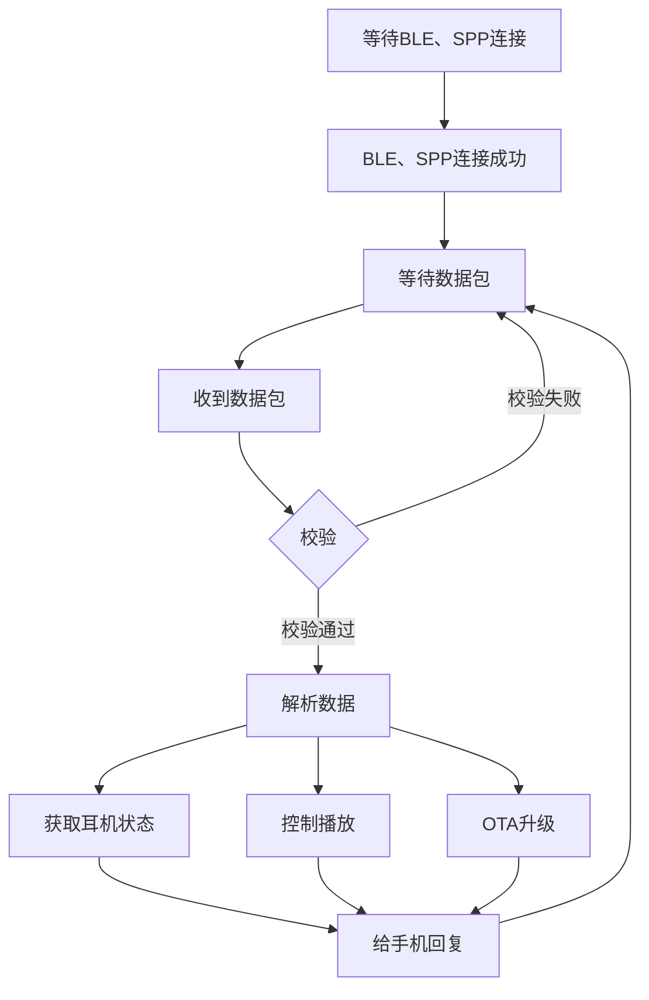
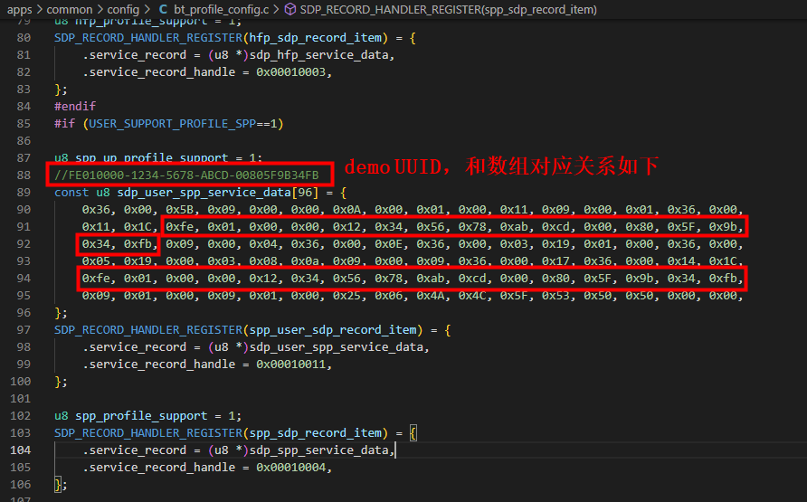
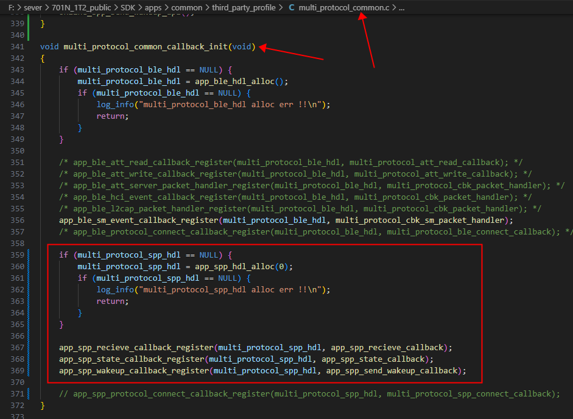

# 耳机端的APP流程



# 打开耳机的SPP功能

## SPP功能开关

```c
#define USER_SUPPORT_PROFILE_SPP                  1
```

## SPP连接状态和数据接口

### 标准UUID

用到的回调函数注册接口

```c
extern void spp_data_deal_handle_register(void (*handler)(u8 packet_type, u16 channel, u8 *packet, u16 size)); /*支持串口功能的数据处理接口*/
```

回调函数demo

```c
void spp_data_handler(u8 packet_type, u16 ch, u8 *packet, u16 size)
{
    switch (packet_type) {
    case 1: //SPP连接成功
        log_info("spp connect\n");
        break;
    case 2: //SPP连接断开
        log_info("spp disconnect\n");
        break;
    case 7: //SPP收到数据
        log_info("spp_rx:");
        put_buf(packet,size);
        break;
    }
}
//蓝牙初始化成功后再调用注册接口注册回调函数
/*spp_data_deal_handle_register(spp_data_handler);*/
```

SPP发数据接口

```c
/**
USER_CTRL_SPP_SEND_DATA命令有参数，参数会先存起来，
param_len是数据长度，param发送数据指针
返回0，表示准备成功，会PENDing发完才返回
返回3，表示上一包数据没发完
要求：size <= 512，data必须是全局或者静态数组
*/
user_send_cmd_prepare(USER_CTRL_SPP_SEND_DATA, size, data);
```

### 自定义UUID

修改自定义UUID



添加回调函数（无需注册，底层会直接调用）

```c
int mutil_handle_data_deal(u8 local_id, u8 packet_type, u16 channel, u8 *packet, u16 size)
{
    printf("%s[packet_type = %d, packet:]\n",__func__, packet_type);
    put_buf(packet, size);
    switch (packet_type){
    case 0x01:
        log_info("SPP_CONNECT");
        break;
    case 0x02:
        log_info("SPP_DISCONNECT");
        break;
    case 0x07:
        log_info("RECEIVE_DATA");
        break;
    
    default:
        break;
    }
}
```

发数接口

```c
extern int multi_spp_send_data(u8 local_cid, u8 rfcomm_cid,  u8 *buf, u16 len);
//调用方法
int user_spp_send_data(u8 *data, u16 len)
{
    return multi_spp_send_data(0x0A, 0, data, len);
}
```

### 可视化SDK接口

添加回调函数

```c
//spp收数回调
void app_spp_recieve_callback(void *hdl, void *remote_addr, u8 *buf, u16 len)
{
    log_info("%s %x\n", __func__, (u32)hdl);
    put_buf(buf, len);
}

//spp连接状态回调
void app_spp_state_callback(void *hdl, void *remote_addr, u8 state)
{
    log_info("%s %x state %d\n", __func__, (u32)hdl, state);
}

//发数结束、spp空闲回调
void app_spp_send_wakeup_callback(void *hdl)
{
    log_info("%s %x\n", __func__, (u32)hdl);
}
```

在multi_protocol_common_callback_init函数中添加代码

注意：app_spp_hdl_alloc(u8 local_id);// local_id：0：标准SPP uuid；0xa：自定义SPP uuid，自定义id方法同普通SDK

```c
    if (multi_protocol_spp_hdl == NULL) {
        multi_protocol_spp_hdl = app_spp_hdl_alloc(0);//0：标准SPP uuid；0xa：自定义SPP uuid
        if (multi_protocol_spp_hdl == NULL) { 
            log_info("multi_protocol_spp_hdl alloc err !!\n"); 
            return; 
        }
    }

    app_spp_recieve_callback_register(multi_protocol_spp_hdl, app_spp_recieve_callback);
    app_spp_state_callback_register(multi_protocol_spp_hdl, app_spp_state_callback);
    app_spp_wakeup_callback_register(multi_protocol_spp_hdl, app_spp_send_wakeup_callback);
```



发数接口

```c
app_spp_data_send(multi_protocol_spp_hdl, data, len);
```

