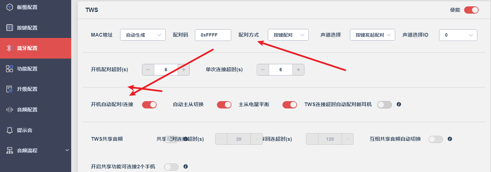
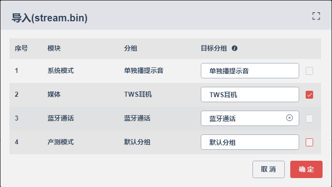

# 虚拟机（VM）区域在进行更新操作时的擦除行为

`apps\earphone\board\br56\board_ac710n_demo_global_build_cfg.h`

这个宏 `CONFIG_VM_OPT` 是用来控制虚拟机（VM）区域在进行更新操作时的擦除行为的。

根据注释说明：

- **功能**：配置在执行更新操作时是否擦除这个区域
- 取值含义：
  - `1` - 不执行任何操作（No Operation）
  - `0` - 擦除（Erase）

从上下文来看，这应该是在嵌入式系统或固件开发中使用的配置项，涉及到Flash存储器的管理。在固件更新过程中，有时需要决定是否擦除特定的虚拟机存储区域。

当前这个宏被设置为 `0`，意味着在更新时会擦除该VM区域。如果设置为 `1`，则在更新时会保留该区域的数据不被擦除。

# 电源相关

## 低电提醒时间

`apps\earphone\include\app_power_manage.h`

```c
#define LOW_POWER_WARN_TIME   	(5 * 60 * 1000)  //低电提醒时间
```

## 长按开机时间

`interface\driver\cpu\periph\lp_touch_key_common.h`

```c
#define LP_TOUCH_KEY_PLATFORM_DATA_BEGIN(data) \
    const struct lp_touch_key_platform_data data = {

#define LP_TOUCH_KEY_PLATFORM_DATA_END() \
    .ldo_wkp_algo_reset = 1,\
    .charge_enter_algo_reset = 0,\
    .charge_exit_algo_reset = 1,\
    .charge_online_algo_reset = 1,\
    .charge_online_softoff_wakeup = 0,\
    .softoff_wakeup_time = 4000, \
    .short_click_check_time = 500, \
    .long_click_check_time = 2000, \
    .hold_click_check_time = 200, \
    .eartch_touch_filter_time = 500, \
    .eartch_touch_valid_time = 1300, \
    .eartch_check_touch_valid_time = 50, \
    .eartch_audio_det_valid_time = 2000, \
    .eartch_audio_det_filter_param = 6, \
}
```

这个长按唤醒参数没有作用。

在长按唤醒日志中发现：

```c
__INITCALL_BANK_CODE
static struct app_mode *app_task_init()
{
    app_var_init();
    app_version_check();

#ifndef CONFIG_CPU_BR56
    sdfile_init();
    syscfg_tools_init();
#endif
    cfg_file_parse(0);

    jlstream_init();

    do_early_initcall();
    board_init();
    do_platform_initcall();

#if (defined(TCFG_DEBUG_DLOG_ENABLE) && TCFG_DEBUG_DLOG_ENABLE)
    dlog_init();
    dlog_enable(1);
    extern void dlog_uart_auto_enable_init(void);
    extern int dlog_uart_output_set(enum DLOG_OUTPUT_TYPE type);
    dlog_uart_output_set(DLOG_OUTPUT_2_FLASH | dlog_output_type_get());
    dlog_uart_auto_enable_init();
#endif

    key_driver_init();

    do_initcall();
    do_module_initcall();
    do_late_initcall();

    dev_manager_init();


    int update = 0;
    if (CONFIG_UPDATE_ENABLE) {
        update = update_result_deal();
    }
#if TCFG_MC_BIAS_AUTO_ADJUST
    mic_capless_trim_init(update);
#endif

    int msg[4] = { MSG_FROM_APP, APP_MSG_GOTO_MODE, 0, 0 };

    if (get_charge_online_flag()) {
#if(TCFG_SYS_LVD_EN == 1)
        vbat_check_init();
#endif
        msg[2] = APP_MODE_IDLE | (IDLE_MODE_CHARGE << 8);
    } else {
        msg[2] = APP_MODE_POWERON;
        check_power_on_voltage();//有一堆电量日志
        app_poweron_check(update);//如果是长按的话还有“++”的日志，长按唤醒参数跟这里有关

        app_send_message(APP_MSG_POWER_ON, 0);
    }

#if TCFG_CHARGE_ENABLE
    set_charge_event_flag(1);
#endif

    struct app_mode *mode;
    mode = app_mode_switch_handler(msg);
    ASSERT(mode != NULL);
    return mode;
}


/*充电拔出,CPU软件复位, 不检测按键，直接开机*/
__INITCALL_BANK_CODE
static void app_poweron_check(int update)
{
#if (CONFIG_BT_MODE == BT_NORMAL)
    if (!update && cpu_reset_by_soft()) {
        app_var.play_poweron_tone = 0;
        return;
    }
#if TCFG_CHARGE_ENABLE
    if (is_ldo5v_wakeup()) {
#if TCFG_CHARGE_OFF_POWERON_EN
        app_var.play_poweron_tone = 0;
        app_var.poweron_reason = SYS_POWERON_BY_OUT_BOX;
        return;
#else
        //拔出关机
        power_set_soft_poweroff();
#endif
    }
#endif

#if TCFG_AUTO_POWERON_ENABLE
    return;
#endif
    check_power_on_key();//上电自动开机关闭就会走这里。

#endif
}


__INITCALL_BANK_CODE
void check_power_on_key(void)
{
    u32 delay_10ms_cnt = 0;

    while (1) {
        wdt_clear();
        os_time_dly(1);

        if (get_power_on_status()) {
            putchar('+');
            delay_10ms_cnt++;
            if (delay_10ms_cnt > 500) {//这个数值就可以影响唤醒时间。不知道是否通用。IO按键已经验证。
                app_var.poweron_reason = SYS_POWERON_BY_KEY;
                return;
            }
        } else {
            log_info("enter softpoweroff\n");
            delay_10ms_cnt = 0;
            app_var.poweroff_reason = SYS_POWEROFF_BY_KEY;
            power_set_soft_poweroff();
        }
    }
}
```

## 充电同步关机

`apps\earphone\battery\charge.c`

- charge_ldo5v_in_deal

```c
u8 charge_ldo5v_in_flag = 0;//充电标志位
void charge_ldo5v_in_deal(void)
{
    int abandon = 0;
    const struct app_charge_handler *handler;

    log_info("%s\n", __FUNCTION__);

#if _TWS_POWER_OFF_CHARGE_5V_IN_ENABLE
    //小概率失效
    //tws_sync_poweroff(); 充电耳机也关机不能充电
    charge_ldo5v_in_flag = 1;
    tws_api_sync_call_by_uuid('T', SYNC_CMD_POWER_OFF_LDO5V_IN, 300);
#endif

    //插入交换
    batmgr_send_msg(POWER_EVENT_POWER_CHANGE, 0);

    charge_full_flag = 0;

    charge_check_and_set_pinr(0);

    for_each_app_charge_handler(handler) {
        abandon += handler->handler(CHARGE_EVENT_LDO5V_IN, 0);
    }

#if defined(TCFG_CHARGE_KEEP_UPDATA) && TCFG_CHARGE_KEEP_UPDATA
    //升级过程中,不执行充电插入关机流程
    if (dual_bank_update_exist_flag_get() || classic_update_task_exist_flag_get()) {
        return;
    }
#endif

    if (get_charge_poweron_en() == 0) {
        if (!app_in_mode(APP_MODE_IDLE)) {
            if (abandon == 0) {
                sys_enter_soft_poweroff(POWEROFF_RESET);
            }
        } else {
            charge_start();
            wdt_init(WDT_32S);
            log_info("set wdt to 32s!\n");
            goto _check_reset;
        }
    } else {
        charge_start();
        goto _check_reset;
    }
    return;

_check_reset:
    //防止耳机低电时,插拔充电有几率出现关机不充电问题
    if (app_var.goto_poweroff_flag) {
        cpu_reset();
    }
}
```

`apps\earphone\include\bt_tws.h`

```c
enum {
    SYNC_CMD_SHUT_DOWN_TIME,
    SYNC_CMD_POWER_OFF_TOGETHER,
    SYNC_CMD_POWER_OFF_LDO5V_IN,//充电另一边关机
    SYNC_CMD_EARPHONE_CHAREG_START,
    SYNC_CMD_IRSENSOR_EVENT_NEAR,
    SYNC_CMD_IRSENSOR_EVENT_FAR,
#if(USE_DMA_TONE)
    SYNC_CMD_CUT_TWS_TONE,     //断开对耳提示音
    SYNC_CMD_START_SPEECH_TONE,//AI键提示音
    SYNC_CMD_DMA_CONNECTED_ALL_FINISH_TONE,   //AI连接成功
    SYNC_CMD_NEED_BT_TONE,     //需要连接蓝牙
    SYNC_CMD_PLEASE_OPEN_XIAODU_TONE,//请打开小度
#endif

    SYNC_CMD_RESET, //新增公共枚举值，不区分项目
    
    SYNC_CMD_OPUS_CLOSE,
};
```

`apps\earphone\mode\bt\bt_tws.c`

```c
/*
 * 主从同步调用函数处理
 */
static void tws_sync_call_fun(int cmd, int err)
{
    log_d("TWS_EVENT_SYNC_FUN_CMD: %d\n", cmd);

    switch (cmd) {
    case SYNC_CMD_EARPHONE_CHAREG_START:
        if (bt_a2dp_get_status() != BT_MUSIC_STATUS_STARTING) {
            bt_cmd_prepare(USER_CTRL_AVCTP_OPID_PLAY, 0, NULL);
        }
        break;
    case SYNC_CMD_IRSENSOR_EVENT_NEAR:
        if (bt_a2dp_get_status() != BT_MUSIC_STATUS_STARTING) {
            bt_cmd_prepare(USER_CTRL_AVCTP_OPID_PLAY, 0, NULL);
        }
        break;
    case SYNC_CMD_IRSENSOR_EVENT_FAR:
        if (bt_a2dp_get_status() == BT_MUSIC_STATUS_STARTING) {
            bt_cmd_prepare(USER_CTRL_AVCTP_OPID_PAUSE, 0, NULL);
        }
        break;
    case SYNC_CMD_RESET:
		extern void factory_reset_deal_callback(void);
        factory_reset_deal_callback();
        break;
    case SYNC_CMD_POWER_OFF_LDO5V_IN:
        extern u8 charge_ldo5v_in_flag;
        if(charge_ldo5v_in_flag == 1){
            charge_ldo5v_in_flag = 0;
            break;//充电这边不执行关机
        }else {
            sys_enter_soft_poweroff(POWEROFF_NORMAL); // 软关机复位
            break;
        }
        break;
    }
}
```

## 充电电流与截至电流


### 系数与挡位的关系

#### 充电电流

```c
/*
 	充电电流选择
	恒流：30-225mA
    实际充电电流=恒流档位*分频器
*/
#define CHARGE_mA_30			0
#define CHARGE_mA_37P5			1
#define CHARGE_mA_45			2
#define CHARGE_mA_52P5			3
#define CHARGE_mA_60			4
#define CHARGE_mA_75			5
#define CHARGE_mA_90			6
#define CHARGE_mA_105			7
#define CHARGE_mA_120			8
#define CHARGE_mA_135			9
#define CHARGE_mA_150			10
#define CHARGE_mA_165			11
#define CHARGE_mA_180			12
#define CHARGE_mA_195			13
#define CHARGE_mA_210			14
#define CHARGE_mA_225			15
//电流分频器
#define CHARGE_DIV_1            0x00
#define CHARGE_DIV_2            0x10
#define CHARGE_DIV_3            0x20
#define CHARGE_DIV_4            0x30
#define CHARGE_DIV_5            0x60
#define CHARGE_DIV_6            0x70
#define CHARGE_DIV_7            0xa0
#define CHARGE_DIV_8            0xb0
#define CHARGE_DIV_9            0xe0
#define CHARGE_DIV_10           0xf0

.charge_mA				= TCFG_CHARGE_MA | TCFG_CHARGE_DIV,         //充电电流
```

- 直接使用宏体名称计算即可。

#### 截至电流

```c
/*充满判断电流为恒流电流的比例配置*/
#define CHARGE_FC_IS_CC_DIV_5	5 // full current = constant_current / 5
#define CHARGE_FC_IS_CC_DIV_6	6
#define CHARGE_FC_IS_CC_DIV_7	7
#define CHARGE_FC_IS_CC_DIV_8	8
#define CHARGE_FC_IS_CC_DIV_9	9
#define CHARGE_FC_IS_CC_DIV_10	10
#define CHARGE_FC_IS_CC_DIV_11	11
#define CHARGE_FC_IS_CC_DIV_12	12
#define CHARGE_FC_IS_CC_DIV_13	13
#define CHARGE_FC_IS_CC_DIV_14	14
#define CHARGE_FC_IS_CC_DIV_15	15
#define CHARGE_FC_IS_CC_DIV_16	16
#define CHARGE_FC_IS_CC_DIV_17	17
#define CHARGE_FC_IS_CC_DIV_18	18
#define CHARGE_FC_IS_CC_DIV_19	19
#define CHARGE_FC_IS_CC_DIV_20	20
```

直接除以得出。

# TWS相关

## 获取本地声道

```c
//获取本地声道，只能用于配对方式选择了固定左右耳宏的？
char channel = tws_api_get_local_channel();
```

## TWS配对方式



修改的是配对方式，而不是把开机自动配对关闭，这样的话搜索不到蓝牙名。

# 按键

## 通话相关场景下按键流程

## 非通话相关场景下按键流程

## 所有场景下按键流程

`apps\earphone\mode\bt\bt_key_msg_table.c`的`bt_key_power_msg_remap`

## 按键相关的参数

### 长按相关的参数

`interface\driver\cpu\periph\lp_touch_key_common.h`

```c
#define LP_TOUCH_KEY_PLATFORM_DATA_END() \
    .ldo_wkp_algo_reset = 1,\
    .charge_enter_algo_reset = 0,\
    .charge_exit_algo_reset = 1,\
    .charge_online_algo_reset = 1,\
    .charge_online_softoff_wakeup = 0,\
    .softoff_wakeup_time = 1000, \   //-----------------------开机识别
    .short_click_check_time = 500, \  //----------------------短按识别
    .long_click_check_time = 2000, \  //----------------------长按识别
    .hold_click_check_time = 200, \   //----------------------长按保持识别
    .eartch_touch_filter_time = 500, \
    .eartch_touch_valid_time = 1300, \
    .eartch_check_touch_valid_time = 50, \
    .eartch_audio_det_valid_time = 2000, \
    .eartch_audio_det_filter_param = 6, \
}
```

- 多击延迟参数没有看到。

## 多击检测（触摸按键）

`apps\common\device\key\key_driver.h`

```c
enum key_action {
    KEY_ACTION_CLICK,
    KEY_ACTION_LONG,
    KEY_ACTION_HOLD,
    KEY_ACTION_UP,
    KEY_ACTION_DOUBLE_CLICK,
    KEY_ACTION_TRIPLE_CLICK,
    KEY_ACTION_FOURTH_CLICK,
    KEY_ACTION_FIFTH_CLICK,
    KEY_ACTION_SEXTUPLE_CLICK,
    KEY_ACTION_SEPTUPLE_CLICK,
    KEY_ACTION_HOLD_1SEC,           //10
    KEY_ACTION_HOLD_3SEC,
    KEY_ACTION_HOLD_5SEC,
    KEY_ACTION_HOLD_8SEC,
    KEY_ACTION_HOLD_10SEC,

    /* TWS两边同时按下消息 */
    KEY_ACTION_TWS_CLICK,
    KEY_ACTION_TWS_DOUBLE_CLICK,
    KEY_ACTION_TWS_TRIPLE_CLICK,
    KEY_ACTION_TWS_FOURTH_CLICK,
    KEY_ACTION_TWS_FIRTH_CLICK,
    KEY_ACTION_TWS_SEXTUPLE_CLICK,
    KEY_ACTION_TWS_SEPTUPLE_CLICK,
    KEY_ACTION_TWS_HOLD_1SEC,
    KEY_ACTION_TWS_HOLD_3SEC,
    KEY_ACTION_TWS_HOLD_5SEC,
    KEY_ACTION_TWS_HOLD_8SEC,
    KEY_ACTION_TWS_HOLD_10SEC,

    //多击+长按
    KEY_ACTION_CLICK_PLUS_LONG,         // 单击+长按
    KEY_ACTION_DOUBLE_CLICK_PLUS_LONG,  // 双击+长按
    KEY_ACTION_TRIPLE_CLICK_PLUS_LONG,  // 三击+长按
    KEY_ACTION_QUAD_CLICK_PLUS_LONG,    // 四击+长按

    /*=======新增按键动作请在此处之上增加，不建议中间插入，可能影响基于偏移量计算的功能，比如多击判断流程=======*/
    KEY_ACTION_NO_KEY,
    KEY_ACTION_MAX,
};
```

### 扩展触摸多击检测

- `cpu\components\touch\lp_touch_key_click.c`

```c
static void lp_touch_key_short_click_time_out_handle(void *priv)
{
    u32 ch_idx = (u32)priv;
    const struct touch_key_cfg *key_cfg = &(__this->pdata->key_cfg[ch_idx]);
    struct touch_key_arg *arg = &(__this->arg[ch_idx]);

    struct key_event e;
    switch (arg->click_cnt) {
    case 1:
        e.event = KEY_ACTION_CLICK;
        break;
    case 2:
        e.event = KEY_ACTION_DOUBLE_CLICK;
        break;
    case 3:
        e.event = KEY_ACTION_TRIPLE_CLICK;
        break;
    case 4:
        e.event = KEY_ACTION_FOURTH_CLICK;
        break;
    case 5:
        e.event = KEY_ACTION_FIFTH_CLICK;
        break;
    default:
        e.event = KEY_ACTION_NO_KEY;
        break;
    }
    e.value = key_cfg->key_value;

    log_debug("notify key:%d short event, cnt: %d", ch_idx, arg->click_cnt);
    lp_touch_key_notify_key_event(&e, ch_idx);

    arg->short_timer = 0;
    arg->last_key = 0;
    arg->click_cnt = 0;
}
```

## 同时按键消息使能单击失效问题


开启后，单耳单击可以生效，但是TWS状态下，单击失效。

```c
#ifdef _MKJ_M86
u8 local_press = 0;
u8 sibling_press = 0;
u8 key_alone_flag = 0;//同时按键超时标志
void sys_clean_click(void *priv) {
    local_press = 0;
    sibling_press = 0;
    key_alone_flag = 1;
}
#endif

case KEY_ACTION_FIFTH_CLICK:
#ifdef _MKJ_M86
                if (tws_state & TWS_STA_SIBLING_CONNECTED) {
                    if ((channel == 'L' && msg[1] != APP_KEY_MSG_FROM_TWS) ||
                        (channel == 'R' && msg[1] == APP_KEY_MSG_FROM_TWS)) {
                        sibling_press = 1;
                    } else {
                        local_press = 1;
                    } 
                }
                if ((local_press == 1) && (sibling_press == 1)) {  
#if _TONE_KEY_ACTION_TWS_FIFTH_CLICK_ENABLE
        tws_play_tone_file(get_tone_files()->_TONE_KEY_ACTION_TWS_FIFTH_CLICK_NAME,300);
#elif _TONE_KEY_ACTION_TWS_FIFTH_CLICK_ALONE_ENABLE
        tws_play_tone_file_alone(get_tone_files()->_TONE_KEY_ACTION_TWS_FIFTH_CLICK_NAME,300);
#endif
                    //按键消息都是在主机中处理，可以接收到从机的按键消息
                    app_msg = _TWS_STA_PHONE_CONNECTED_SIBLING_CONNECTED_KEY_ACTION_FIFTH_CLICK_L;
                    //完成同时五击按键消息后清除状态
                    local_press = 0;
                    sibling_press = 0;
                    break;
                }
                //放外面相当于全局变量了,单边五击，设置一个超时清除
                sys_timeout_add(NULL,sys_clean_click,1000);
                //超时后执行单边功能
                if(key_alone_flag == 1){
                    app_msg = APP_MSG_NULL;
                    //执行完清除状态
                    key_alone_flag = 0;
                }
#else
                if (tws_state & TWS_STA_SIBLING_CONNECTED) {
                    if ((channel == 'L' && msg[1] != APP_KEY_MSG_FROM_TWS) ||
                        (channel == 'R' && msg[1] == APP_KEY_MSG_FROM_TWS)) {
                        app_msg = _TWS_STA_PHONE_CONNECTED_SIBLING_CONNECTED_KEY_ACTION_FIFTH_CLICK_L;
                        break;
                    }else {
                        app_msg = _TWS_STA_PHONE_CONNECTED_SIBLING_CONNECTED_KEY_ACTION_FIFTH_CLICK_R; 
                        break;
                    }
                }else if(tws_state & TWS_STA_SIBLING_DISCONNECTED) {
                    if ((channel == 'L' && msg[1] != APP_KEY_MSG_FROM_TWS) ||
                        (channel == 'R' && msg[1] == APP_KEY_MSG_FROM_TWS)) {
                        app_msg = _TWS_STA_PHONE_CONNECTED_SIBLING_DISCONNECTED_KEY_ACTION_FIFTH_CLICK_L;
                        break;
                    }else {
                        app_msg = _TWS_STA_PHONE_CONNECTED_SIBLING_DISCONNECTED_KEY_ACTION_FIFTH_CLICK_R;
                        break;
                    }
                } 
#endif
                break;
```

- 先暂时手动实现，把宏关了。

# 恢复出厂设置

## 主从同步调用函数处理

`apps\earphone\mode\bt\bt_tws.c`

```c
/*
 * 主从同步调用函数处理
 */
static void tws_sync_call_fun(int cmd, int err)
{
    log_d("TWS_EVENT_SYNC_FUN_CMD: %d\n", cmd);

    switch (cmd) {
    case SYNC_CMD_EARPHONE_CHAREG_START:
        if (bt_a2dp_get_status() != BT_MUSIC_STATUS_STARTING) {
            bt_cmd_prepare(USER_CTRL_AVCTP_OPID_PLAY, 0, NULL);
        }
        break;
    case SYNC_CMD_IRSENSOR_EVENT_NEAR:
        if (bt_a2dp_get_status() != BT_MUSIC_STATUS_STARTING) {
            bt_cmd_prepare(USER_CTRL_AVCTP_OPID_PLAY, 0, NULL);
        }
        break;
    case SYNC_CMD_IRSENSOR_EVENT_FAR:
        if (bt_a2dp_get_status() == BT_MUSIC_STATUS_STARTING) {
            bt_cmd_prepare(USER_CTRL_AVCTP_OPID_PAUSE, 0, NULL);
        }
        break;
    case SYNC_CMD_RESET:
		extern void factory_reset_deal_callback(void);
        factory_reset_deal_callback();
        break;
    }
}

TWS_SYNC_CALL_REGISTER(tws_tone_sync) = {
    .uuid = 'T',
    .task_name = "app_core",
    .func = tws_sync_call_fun,
};
```

- 没看到在哪里调用`SYNC_CMD_RESET`

- `tws_sync_call_fun`是注册到系统任务中的：

**跟上面两者不知道怎么联系起来。**

```c
    //IR_NUM中间不允许插入msg

    APP_MSG_FACTORY_RESET,//新增公共枚举值，不区分项目----wang

    APP_MSG_INPUT_FILE_NUM,
```

`bt_key_power_msg_remap`创建一个按键对应的消息处理case

```c
case KEY_ACTION_FOURTH_CLICK:
	app_msg = APP_MSG_FACTORY_RESET;
	break;
```

创建`APP_MSG_FACTORY_RESET`对应消息的处理函数：

- **手动写具体的处理分支**

```c
int bt_app_msg_handler(int *msg)
{
    u8 data[1];
    if (!app_in_mode(APP_MODE_BT)) {
        return 0;
    }
    switch (msg[0]) {
    case APP_MSG_VOL_UP:
        log_info("APP_MSG_VOL_UP\n");
#if (TCFG_LE_AUDIO_APP_CONFIG & LE_AUDIO_AURACAST_SINK_EN)
        app_audio_volume_up(1);
#else
        bt_volume_up(1);
#endif
        bt_tws_sync_volume();
#if ((TCFG_LE_AUDIO_APP_CONFIG & (LE_AUDIO_UNICAST_SINK_EN | LE_AUDIO_JL_UNICAST_SINK_EN)))
        data[0] = CIG_EVENT_OPID_VOLUME_UP;
        le_audio_media_control_cmd(data, 1);
#endif
        return 0;
    case APP_MSG_VOL_DOWN:
        log_info("APP_MSG_VOL_DOWN\n");
#if (TCFG_LE_AUDIO_APP_CONFIG & LE_AUDIO_AURACAST_SINK_EN)
        app_audio_volume_down(1);
#else
        bt_volume_down(1);
#endif
        bt_tws_sync_volume();
#if ((TCFG_LE_AUDIO_APP_CONFIG & (LE_AUDIO_UNICAST_SINK_EN | LE_AUDIO_JL_UNICAST_SINK_EN)))
        data[0] = CIG_EVENT_OPID_VOLUME_DOWN;
        le_audio_media_control_cmd(data, 1);
#endif
        return 0;
    case APP_MSG_FACTORY_RESET:
        puts("dhf----APP_MSG_FACTORY_RESET\n");
        dhf_factory_reset_deal();//-----------------------这里面有区分一起恢复出厂还是单耳的逻辑
        return 0;
    }

    /* 下面是蓝牙相关消息,从机不用处理  */
#if TCFG_USER_TWS_ENABLE
    if (tws_api_get_role_async() == TWS_ROLE_SLAVE) {
        return 0;
    }
#endif
    switch (msg[0]) {
    case APP_MSG_MUSIC_PP:
```

`factory_reset_deal_callback();`

```c
void factory_reset_deal_callback(void) {
    bt_cmd_prepare(USER_CTRL_DEL_ALL_REMOTE_INFO, 0, NULL);
    bt_tws_remove_pairs();
    led_ui_set_state(LED_STA_ALL_OFF, DISP_CLEAR_OTHERS);
    if (factory_reset_led == 0) {
        factory_reset_led = sys_timer_add(NULL, factory_reset_deal, 200);
    }
}
```

`factory_reset_deal`

```c
int factory_reset_led = 0;
volatile u8 factory_reset_cnt =0;
void factory_reset_deal(void *priv)
{
    factory_reset_cnt++;
    printf("factory_reset_cnt = %d\n",factory_reset_cnt);
    led_ui_set_state(LED_STA_ALL_ON, DISP_CLEAR_OTHERS);
    // if (factory_reset_cnt%2 == 0) {
    //     led_ui_set_state(LED_STA_RED_ON, DISP_CLEAR_OTHERS);
    // } else {
    //     led_ui_set_state(LED_STA_ALL_OFF, DISP_CLEAR_OTHERS);
    // }
    if (factory_reset_cnt == 7) {
        if(factory_reset_led) {
            sys_timer_del(factory_reset_led);
            factory_reset_led=0;
        }
        // cpu_reset();
        //sys_enter_soft_poweroff(NULL);//不想关机的话，可以使用POWEROFF_RESET进行复位，把蓝牙名都重置了？
        sys_enter_soft_poweroff(POWEROFF_NORMAL_TWS);
        // power_set_soft_poweroff();
    }
}

void factory_reset_deal_callback(void) {
    bt_cmd_prepare(USER_CTRL_DEL_ALL_REMOTE_INFO, 0, NULL);
    bt_tws_remove_pairs();
    led_ui_set_state(LED_STA_ALL_OFF, DISP_CLEAR_OTHERS);
    if (factory_reset_led == 0) {
        factory_reset_led = sys_timer_add(NULL, factory_reset_deal, 200);
    }
}

 static void dhf_factory_reset_deal(void)
 {
    if (get_tws_sibling_connect_state()) {
        tws_api_sync_call_by_uuid('T', SYNC_CMD_RESET, 300);
    } else {
        factory_reset_deal_callback();
    }
 }
```

看到了`SYNC_CMD_RESET`，先判断TWS是否连接成功。成功就一起调用`SYNC_CMD_RESET`，此分支再调用`factory_reset_deal_callback();`，单耳调用还是一起调用的区别而已。

`factory_reset_deal_callback`是具体的处理函数。

但是`SYNC_CMD_RESET`分支不是在`tws_sync_call_fun()`中吗？

```c
/*
 * 通过uuid，主从同步调用相同函数
 */
int tws_api_sync_call_by_uuid(int uuid, int priv, int delay_ms);
```

**uuid怎么拿到？**

直接调用`tws_sync_call_fun`传递分支也是可以的，没验证。

## 带APP的恢复出厂设置

恢复出厂设置时要调用以下接口，保证楚删除连接记录外，其他所有自定义功能全部恢复默认。另外避免生产过程有被自定义，因此在测试盒配对时也调用此接口做恢复默认处理

```c
u8 rcsp_setting_info_reset() //恢复默认的APP设置
{
    printf("%s", __func__);

    u32 time_stamp = 0xffffffff;
    syscfg_write(CFG_RCSP_ADV_TIME_STAMP, (u8 *)&time_stamp, sizeof(time_stamp));

#if RCSP_ADV_NAME_SET_ENABLE 
    u8 name[LOCAL_NAME_LEN];
    memset(name, 0x00, sizeof(name));
    syscfg_read_string(CFG_BT_NAME, name, sizeof(name), 0);
    syscfg_write(CFG_BT_NAME, name, LOCAL_NAME_LEN);
#endif 

#if RCSP_ADV_KEY_SET_ENABLE
    u8 key_setting_info[8] = {0}; //重点注意带长按跟三击时这里数组大小要改
    memset(key_setting_info, 0xff, 8);  //重点注意带长按跟三击时这里数组大小要改
    syscfg_write(CFG_RCSP_ADV_KEY_SETTING, key_setting_info, sizeof(key_setting_info));
#endif
    
#if RCSP_ADV_LED_SET_ENABLE
    u8 led_setting_info[3] = {0};
    memset(led_setting_info, 0xff, 3);
    syscfg_write(CFG_RCSP_ADV_LED_SETTING, led_setting_info, sizeof(led_setting_info));
#endif

#if RCSP_ADV_MIC_SET_ENABLE
    u8 mic_setting_info = 0xff;
    syscfg_write(CFG_RCSP_ADV_MIC_SETTING, &mic_setting_info, sizeof(mic_setting_info));
#endif

#if RCSP_ADV_WORK_SET_ENABLE
    u8 work_setting_info = 0xff;
    syscfg_write(CFG_RCSP_ADV_WORK_SETTING, &work_setting_info, sizeof(work_setting_info));
#endif

#if RCSP_ADV_EQ_SET_ENABLE
    u8 eq_setting_info[10] = {0};
    u8 eq_setting_mode = 0xff;
    memset(eq_setting_info, 0xff, 10);
    syscfg_write(CFG_RCSP_ADV_EQ_DATA_SETTING, &eq_setting_info, sizeof(eq_setting_info));
    syscfg_write(CFG_RCSP_ADV_EQ_MODE_SETTING, &eq_setting_mode, sizeof(eq_setting_mode));
#endif
    return 0;
}
```

完善：	

- APP中的高低音的设置不能恢复到默认。

# 灯效

接口：`led_ui_set_state(LED_STA_RED_BLUE_FAST_FLASH_ALTERNATELY, DISP_CLEAR_OTHERS);`

调用需要先包含头文件：

```c
#include "pwm_led/led_ui_tws_sync.h"
#include "pwm_led/led_ui_api.h"
```

```c
//总入口 只有一个对外接口调用
void led_ui_set_state(enum led_state_name name, enum led_disp_mode disp_mode)
{
    struct led_state_obj *obj;
    const struct led_state_map *map;

    log_info("led_name = %d, disp_mode = 0x%x\n", name, disp_mode);

    for (int i = 0; ; i++) {
        map = &g_led_state_table[i];
        if (map->name == 0) {
            PWMLED_LOG_ERR("search END, may no this effect config");
            break;
        }
        if (name != map->name) {
            /* PWMLED_LOG_DEBUG("find next effect to match from g_led_state_table,map->name = %d", map->name); */
            continue;
        }
        PWMLED_LOG_SUCC("Find effect Succ");
        const u8 *arg1 = (const u8 *)map->arg1;

        obj = zalloc(sizeof(*obj));
        if (!obj) {
            PWMLED_LOG_ERR("obj zalloc fail");
            return;
        }
        obj->name           = name;
        obj->disp_mode      = disp_mode;
        if (map->time_flag == TIME_EFFECT_MODE) {
            obj->time       = (const led_pdata_t *)arg1;
        } else {
            obj->table      = (const struct led_state_item *)arg1;
            obj->table_size = map->time_flag;
        }
        led_ui_add_state(obj);
        break;
    }
}
```

这是LED灯效设置的唯一对外接口，通过LED状态名称和显示模式来激活对应的灯效。

**参数输入**

- `name`: LED状态名称枚举，标识要设置的具体灯效
- `disp_mode`: 显示模式枚举，控制灯效的显示方式

**状态表查找**

```c
for (int i = 0; ; i++) {
    map = &g_led_state_table[i];
    if (map->name == 0) break;  // 遇到表结束标记
    if (name != map->name) continue;  // 继续查找匹配项
```

遍历全局状态表 `g_led_state_table`，寻找与输入名称匹配的LED状态配置。

**状态对象创建**

找到匹配项后，动态分配内存创建LED状态对象：

```c
obj = zalloc(sizeof(*obj));  // 分配并清零内存
obj->name = name;
obj->disp_mode = disp_mode;
```

**配置数据解析**

根据时间标志位判断配置数据类型：

```c
if (map->time_flag == TIME_EFFECT_MODE) {
    obj->time = (const led_pdata_t *)arg1;  // 时间效果模式
} else {
    obj->table = (const struct led_state_item *)arg1;  // 状态表模式
    obj->table_size = map->time_flag;  // 表大小
}
```

**状态激活**

调用 `led_ui_add_state(obj)` 将配置好的状态对象添加到LED控制系统中。

## `g_led_state_table`

`apps\earphone\ui\led\led_config.c`

这个表是LED灯效系统的配置映射表。

**基本结构**

```c
struct led_state_map {
    enum led_state_name name;    // LED状态名称
    u32 time_flag;              // 时间标志/表大小
    void *arg1;                 // 配置数据指针
};
```

**配置方式分类**

- **时间效果模式 (TIME_EFFECT_MODE)** 大部分灯效都使用这种模式，直接引用预定义的配置数据：

```c
{ LED_STA_RED_ON, TIME_EFFECT_MODE, &led_red_on_config }
```

- **状态表模式 (LED_STATE_TABLE)** 用于复杂的软件组合灯效：

```c
{ LED_STA_BLUE_1S_FLASHS_3_TIMES, LED_STATE_TABLE(blue_led_1s_flashs_3_times) }
```

**功能分类**

1. **全局控制**

- `LED_STA_ALL_ON/OFF`: 所有LED的开关控制

2. **红色LED灯效** (条件编译 `TCFG_LED_RED_ENABLE`)

- **持续点亮**: 常亮、1秒亮、2秒亮、3秒亮
- **闪烁次数**: 闪1次、2次、3次
- **周期闪烁**: 慢闪、快闪、每秒1次、每5秒1次
- **呼吸效果**: 红色呼吸灯

3. **蓝色LED灯效** (条件编译 `TCFG_LED_BLUE_ENABLE`)

- 功能与红色LED完全对应
- 额外包含开机效果：`LED_STA_POWERON` 映射到蓝色1秒亮

4. **双色组合效果**

- **交替闪烁**: 红蓝慢闪交替、快闪交替
- **交替呼吸**: 红蓝呼吸交替

## 调用已有灯效

`led_ui_set_state(LED_STA_RED_BLUE_FAST_FLASH_ALTERNATELY, DISP_CLEAR_OTHERS);`


在`apps\earphone\include\led_config.h`选灯效参数。`apps\common\ui\pwm_led\led_ui_api.h`选择灯效属性。

```c
//灯效属性
enum led_disp_mode : u8 {
    DISP_NON_INTR          = 0x01, // 当前设置的灯效不允许被打断
    DISP_CLEAR_OTHERS      = 0x02, // 清除其它灯效, 设置了DISP_NON_INTR标记的不会被清除
    DISP_RECOVERABLE       = 0x04, // 周期灯效和非周期灯效共存标记, 被非周期的灯效打断后不会被删除
    DISP_TWS_SYNC          = 0x08, // 需要tws同步的灯效。默认只允许tws主机设置,
    // 硬件会间隔发起tws通信保持同步，软件只会同步第一次。
    DISP_TWS_SYNC_RX       = 0x10, // tws主机发起的同步灯效，从机收到后自动添加此标记
    DISP_TWS_SYNC_TX       = 0x20, // tws主机发起的同步灯效，主机发送后自动添加此标记
};
```

## 增加自定义灯效

**在枚举中添加新的LED状态名称**

```c
// 在 enum led_state_name 中添加
enum led_state_name {
    // ... 现有的枚举值
    LED_STA_MY_CUSTOM_EFFECT,     // 你的自定义灯效名称
    // ...
};
```

### **选择灯效实现方式**

**方式一：时间效果模式 (TIME_EFFECT_MODE)**

如果是简单的单色或双色效果，创建配置结构：

```c
const struct led_platform_data led_my_custom_config = {
    .ctl_option = CTL_LED0_ONLY,           // 只控制LED0(红灯)
    .ctl_mode = CYCLE_ONCE_BRIGHT,         // 周期单闪模式
    .ctl_cycle = 20,                       // 每个周期1秒 (20*50ms=1000ms)
    .ctl_cycle_num = 3,                    // 总共闪3次
    .once_bright.bright_time = 4,          // 每次亮0.2秒 (4*50ms=200ms)
};
```

**时间单位**

- 所有时间参数都是以50ms为单位
- 例如：`ctl_cycle = 20` 表示1000ms (20×50ms)

**控制选项 (ctl_option)**

```c
enum led_ctl_option {
    CTL_LED0_ONLY,                  //只控led0
    CTL_LED1_ONLY,                  //只控led1
    CTL_LED01_ASYNC,                //led0&led1异步(交替)
    CTL_LED01_SYNC,                 //led0&led1同步
};
```

**控制模式 (ctl_mode)**

```c
enum led_ctl_mode {
    CYCLE_ONCE_BRIGHT,              //周期单闪
    CYCLE_TWICE_BRIGHT,             //周期双闪
    CYCLE_BREATHE_BRIGHT,           //周期呼吸
    ALWAYS_BRIGHT,                  //常亮
    ALWAYS_EXTINGUISH,              //常灭
};
```

**关键理解点**

1. **ctl_cycle**: 每个周期的总时间
2. ctl_cycle_num:
   - `0` = 无限循环
   - `>0` = 指定次数后停止
3. **bright_time**: 在每个周期内的亮灯时间
4. **异步模式**: LED0和LED1轮流工作，实现交替效果
5. **同步模式**: LED0和LED1同时工作

**方式二：状态表模式 (LED_STATE_TABLE)**

```c
const struct led_state_item my_custom_led_effect[] = {
    //LED名称    时间   亮度              呼吸时间        动作
    
    // 第1步：初始化 - 关闭所有LED
    { LED_RED,   0,    LED_BRIGHT_OFF,   0,             LED_ACTION_CONTINUE },
    { LED_BLUE,  0,    LED_BRIGHT_OFF,   0,             LED_ACTION_CONTINUE },
    
    // 第2步：红灯快闪2次
    { LED_RED,   2,    LED_RED_BRIGHTNESS, 0,           LED_ACTION_WAIT },  // 红灯亮100ms
    { LED_RED,   2,    LED_BRIGHT_OFF,     0,           LED_ACTION_WAIT },  // 红灯灭100ms
    { LED_RED,   2,    LED_RED_BRIGHTNESS, 0,           LED_ACTION_WAIT },  // 红灯亮100ms
    { LED_RED,   2,    LED_BRIGHT_OFF,     0,           LED_ACTION_WAIT },  // 红灯灭100ms
    
    // 第3步：蓝灯慢闪1次
    { LED_BLUE,  10,   LED_BLUE_BRIGHTNESS, 0,          LED_ACTION_WAIT },  // 蓝灯亮500ms
    { LED_BLUE,  10,   LED_BRIGHT_OFF,      0,          LED_ACTION_WAIT },  // 蓝灯灭500ms
    
    // 第4步：间隔后循环
    { LED_BLUE,  20,   LED_BRIGHT_OFF,     0,           LED_ACTION_LOOP },  // 等待1秒，然后循环
};
```

表的元素结构：

```c
struct led_state_item {
    u8 led_name;        // LED名称 (LED_RED/LED_BLUE)
    u8 time_msec;       // 灯亮的时间，单位50ms
    u8 brightiness;     // 亮度值
    u8 breath_time;     // 呼吸灯效参数（0=非呼吸灯，有值=呼吸灯保持时间）
    u8 action;          // 动作类型
};
```

**time_msec（时间）**

- 单位：50ms
- 含义：这一步的**总持续时间**
- 示例：`time_msec = 10` 表示这一步持续 500ms

**breath_time（呼吸参数）**

- `breath_time = 0`：普通开关模式
- `breath_time > 0`：呼吸灯模式
- 呼吸灯模式下：
  - `breath_time` 表示亮度到最大时的**保持时间**
  - 必须满足：`breath_time < time_msec`

**呼吸灯效果示例**

```c
const struct led_state_item breathing_effect[] = {
    // 红灯呼吸效果：总时间1秒，最亮时保持200ms
    { LED_RED, 20, LED_RED_BRIGHTNESS, 4, LED_ACTION_WAIT },
    //         ↑   ↑                  ↑
    //      1000ms 最大亮度        200ms保持时间
    
    // 关闭
    { LED_RED, 10, LED_BRIGHT_OFF, 0, LED_ACTION_LOOP },
};
```

**呼吸效果时间分配**：

- 总时间1000ms
- 渐亮时间：(1000-200)/2 = 400ms
- 保持时间：200ms
- 渐灭时间：400ms

### 在状态表中添加映射

```c
const struct led_state_map g_led_state_table[] = {
    // ... 现有的映射
    
    // 添加你的自定义灯效
    { LED_STA_MY_CUSTOM_EFFECT, TIME_EFFECT_MODE, &led_my_custom_config },
    // 或者使用状态表模式：
    // { LED_STA_MY_CUSTOM_EFFECT, LED_STATE_TABLE(my_custom_led_effect) },
    
    { 0, 0, 0 } // END must end
};
```

#### 调用自定义灯效

```c
// 在需要的地方调用
led_ui_set_state(LED_STA_MY_CUSTOM_EFFECT, DISP_CLEAR_OTHERS);
```

## 各状态的灯效

`apps\earphone\ui\led\led_ui_msg_handler.c`

电源相关的灯效

- `ui_battery_msg_handler`

各状态的灯效

- ui_app_msg_handler

  - 开关机灯效

  - tws配对灯效

  - 开机回连手机灯效

  - 等待手机连接状态

蓝牙协议相关的灯效

- ui_bt_stack_msg_handler
  - 一拖二时耳机的灯效。

TWS相关的灯效

- ui_tws_msg_handler
  - TWS连接
  - TWS断开？？？

## 低电关机灯效定制化

`apps\earphone\battery\battery_level.c`

```c
static void power_warning_timer(void *p)
{
    batmgr_send_msg(POWER_EVENT_POWER_WARNING, 0);
}

static int app_power_event_handler(int *msg)
{
    int ret = false;

#if(TCFG_SYS_LVD_EN == 1)
    switch (msg[0]) {
    case POWER_EVENT_POWER_NORMAL:
        break;
    case POWER_EVENT_POWER_WARNING:
        play_tone_file(get_tone_files()->low_power);
        if (lowpower_timer == 0) {
            //这里实现定时低电播报
            lowpower_timer = sys_timer_add(NULL, power_warning_timer, LOW_POWER_WARN_TIME);
        }
        break;
    case POWER_EVENT_POWER_LOW:
        //这里时低电关机的消息处理
        r_printf(" POWER_EVENT_POWER_LOW");
        vbat_timer_delete();
        if (lowpower_timer) {
            sys_timer_del(lowpower_timer);
            lowpower_timer = 0 ;
        }
#if TCFG_APP_BT_EN
#if (RCSP_ADV_EN)
        adv_tws_both_in_charge_box(1);
#endif
        if (!app_in_mode(APP_MODE_IDLE)) {
            //蓝牙模式下单独关机
            sys_enter_soft_poweroff(POWEROFF_NORMAL);
        } else {
            //否则无声关机
            power_set_soft_poweroff();
        }
#else
        app_send_message(APP_MSG_GOTO_MODE, APP_MODE_IDLE | (IDLE_MODE_PLAY_POWEROFF << 8));
#endif
        break;
```

- 关机流程中利用了全局变量的关机标志位
  - 可以新增一个全局变量，在这里置1。
  - 在关机流程中判断，如果是1的话，则发送另一个app层灯效消息。
  - 这样低电关机也可以有专属灯效。
- `APP_VAR app_var;`
  - 在哪里初始化？
  - 初始化?

## 充电状态相关灯效

### 关机状态插入充电到充满

```c
[00:00:00.273][APP_CHARGE]charge_ldo5v_in_deal
[00:00:00.274]TWS_EVENT_SYNC_FUN_CMD: 2 //另一边关机命令
[00:00:00.274][CHARGE]charge_start
[00:00:00.275][APP_CHARGE]set wdt to 32s!
[00:00:00.275][APP_CHARGE]charge_start_deal
[00:00:00.276][APP_CHARGE]batmgr_send_msg(BAT_MSG_CHARGE_START, 0); //发送消息
[00:00:00.277][PWM_LED]led_name = 3, disp_mode = 0x2 //灯效流程获取到消息更新灯效
[00:00:00.277][LED_UI]MSG_FROM_BATTERY----ui_battery_msg_handler----BAT_MSG_CHARGE_STARTS<> //开始充电灯效日志
[00:00:00.375][CHARGE]constant_current_progi_volt_config, 233, cur_vbat: 4264 mV
S<>S<>S<>S<>S<>S<>S<>S<>S<>S<>*****************S<>*S<>S<>S<>S<>S<>S<>S<>S<>S<>S<>S<>S<>S<>S<>S<>S<>S<>S<>S<>S<>S<>S<>S<>S<>S<>S<>S<>S<>S<>S<>S<>S<>S<>S<>S<>S<>S<>S<>S<>S<>S<>S<>S<>S<>S<>S<>S<>S<>
[00:00:58.276][APP_CHARGE]charge_full_deal
[00:00:58.277][CHARGE]charge_close
[00:00:58.277][APP_CHARGE]charge_close_deal
[00:00:58.278][APP_CHARGE]batmgr_send_msg(BAT_MSG_CHARGE_CLOSE, 0);//发送消息
[00:00:58.279][LED_UI]MSG_FROM_BATTERY----ui_battery_msg_handler----BAT_MSG_CHARGE_CLOSE//结束充电灯效日志，最终是这里
[00:00:58.280][LED_UI]MSG_FROM_BATTERY----ui_battery_msg_handler----BAT_MSG_CHARGE_ERR
[00:00:58.281][PWM_LED]led_name = 17, disp_mode = 0x2 //灯效流程获取到消息更新灯效
[00:00:58.282][LED_UI]MSG_FROM_BATTERY----ui_battery_msg_handler----BAT_MSG_CHARGE_LDO5V_OFF //结束充电灯效日志
```

- 开启灯口保护后可以使充满灯效常亮
- 不开启灯口保护会使充满灯效亮一会后熄灭

### 充电拔出

```c
[00:00:00.236][APP_CHARGE]charge_ldo5v_in_deal
[00:00:00.237]TWS_EVENT_SYNC_FUN_CMD: 2
[00:00:00.237][CHARGE]charge_start
[00:00:00.238][APP_CHARGE]set wdt to 32s!
[00:00:00.238][APP_CHARGE]charge_start_deal
[00:00:00.239][APP_CHARGE]batmgr_send_msg(BAT_MSG_CHARGE_START, 0);
[00:00:00.240][PWM_LED]led_name = 3, disp_mode = 0x2
[00:00:00.240][LED_UI]MSG_FROM_BATTERY----ui_battery_msg_handler----BAT_MSG_CHARGE_STARTS<>
[00:00:00.338][CHARGE]constant_current_progi_volt_config, 233, cur_vbat: 3804 mV
[00:00:00.339][CHARGE]constant_current_progi_volt_config, 245, max_progi: 904 mV
S<>S<>S<>S<>S<>S<>S<>S<>S<>S<>S<>S<>S<>S<>S<>S<>S<>S<>S<>S<>S<>S<>S<>S<>S<>S<>S<>S<>S<>S<>S<>S<>S<>S<>S<>S<>S<>S<>S<>S<>S<>S<>S<>S<>S<>S<>S<>S<>S<>S<>S<>S<>S<>S<>S<>S<>S<>S<>S<>S<>S<>S<>S<>S<>S<>S<>S<>S<>S<>S<>S<>S<>S<>S<>S<>S<>S<>S<>S<>S<>S<>S<>S<>S<>S<>S<>S<>S<>S<>S<>S<>S<>S<>S<>S<>**************************S<>S<>S<>S<>S<>S<>S<>S<>S<>S<>S<>S<>S<>S<>S<>S<>S<>S<>S<>S<>S<>S<>S<>S<>S<>S<>S<>S<>S<>S<>S<>S<>S<>S
[00:02:07.127][APP_CHARGE]charge_ldo5v_off_deal
[00:02:07.127][CHARGE]charge_close
[00:02:07.128][APP_CHARGE]batmgr_send_msg(BAT_MSG_CHARGE_LDO5V_OFF, 0);
[00:02:07.129][APP_CHARGE]set wdt to 4s!
[00:02:07.129][APP_CHARGE]ldo5v off,enter softpoweroff
[00:02:07.130][PMU]=============power_set_soft_poweroff============
[00:02:07.131][PMU]sf_keep_lpctmu: 0
[00:02:07.131][PMU]sf_keep_pvdd: 0
[00:02:07.132][PMU]sf_keep_nvdd: 0
[00:02:07.132][PMU]sf_vddio_keep: 1
[00:02:07.132][PMU]keep_lrc: 0
[00:02:07.133][PMU]sfc_bit_mode: 2, port: 0
```

- 开启灯口保护后，拔出，充电中的红灯不会熄灭

```c
void charge_ldo5v_off_deal(void)
{
    int abandon = 0;
    int off_type = LDO5V_OFF_TYPE_NORMAL_ON;
    bool lowpower_flag = FALSE, is_bt_mode, is_idle_mode;
    const struct app_charge_handler *handler;

    log_info("%s\n", __FUNCTION__);

    //拨出交换
    batmgr_send_msg(POWER_EVENT_POWER_CHANGE, 0);

    charge_full_flag = 0;

    charge_close();

    batmgr_send_msg(BAT_MSG_CHARGE_LDO5V_OFF, 0);
    log_info("batmgr_send_msg(BAT_MSG_CHARGE_LDO5V_OFF, 0);\n");
#if _TCFG_PWMLED_PORT_PROTECT_ENABLE
    //灯口保护中，发了消息但是灯效没有变化，这里手动更新一次
    led_ui_set_state(LED_STA_ALL_OFF, DISP_CLEAR_OTHERS);
#endif
```

# DUT

`bt_key_power_msg_remap`创建按键事件触发后的DUT函数

```c
case KEY_ACTION_CLICK:
	app_msg = APP_MSG_BT_CLOSE_DUT;
	break;
case KEY_ACTION_FIRTH_CLICK:
    app_msg = APP_MSG_BT_OPEN_DUT;
    break;
```

具体的处理函数定义：`bt_app_msg_handler`

```c
/* 下面是蓝牙相关消息,从机不用处理  */
//.......
case APP_MSG_BT_OPEN_DUT:
    puts("APP_MSG_BT_OPEN_DUT\n");
    bt_bredr_enter_dut_mode(1, 1);//进入DUT
    break;
case APP_MSG_BT_CLOSE_DUT:
    puts("APP_MSG_BT_CLOSE_DUT\n");
    if (get_bt_tws_connect_status()) {
        printf("APP_MSG_BT_CLOSE_DUT--get_bt_tws_connect_status()\r\n");
        // if (TWS_ROLE_MASTER == tws_api_get_role()) {
        if (('U' == tws_api_get_local_channel()) || ('L' == tws_api_get_local_channel())) {
            printf("APP_MSG_BT_CLOSE_DUT--channel:[L]\r\n");
            led_ui_set_state(LED_STA_RED_BLUE_FAST_FLASH_ALTERNATELY, DISP_CLEAR_OTHERS);
        } else {
            printf("APP_MSG_BT_CLOSE_DUT--channel:[R]\r\n");
            led_ui_set_state(LED_STA_BLUE_FLASH_1TIMES_PER_5S, DISP_CLEAR_OTHERS);
        }
    } else {
        printf("APP_MSG_BT_CLOSE_DUT--!!!!get_bt_tws_connect_status()\r\n");
        led_ui_set_state(LED_STA_RED_BLUE_FAST_FLASH_ALTERNATELY, DISP_CLEAR_OTHERS);
    }
    bt_bredr_exit_dut_mode();//退出
    break;
```


```c
#include "pwm_led/led_ui_tws_sync.h"
#include "pwm_led/led_ui_api.h"

/**********进入蓝牙dut模式
*  mode=0:使能可以进入dut，原本流程不变。
*  mode=1:删除一些其它切换状态，产线中通过工具调用此接口进入dut模式，提高测试效率
 *********************/
void bt_bredr_enter_dut_mode(u8 mode, u8 inquiry_scan_en)
{
    puts("<<<<<<<<<<<<<bt_bredr_enter_dut_mode>>>>>>>>>>>>>>\n");

#if (defined CONFIG_CPU_BR56)
    u32 curr_clk = clk_get_max_frequency();
    y_printf("DUT test,set clock:%d\n", curr_clk);
    clock_alloc("DUT", curr_clk);
#endif
    bredr_set_dut_enble(1, 1);
    if (mode) {
        led_ui_set_state(LED_STA_RED_ON, DISP_CLEAR_OTHERS);//设置DUT模式的灯效
        clr_device_in_page_list();
        dut_idle_run_slot(2);
        g_bt_hdl.auto_connection_counter = 0;
#if TCFG_USER_TWS_ENABLE
        bt_page_scan_for_test(inquiry_scan_en);
#endif

    }
}
```

## **同时进DUT，会重新自动配对，测试盒进入，串口断开后会跑5VOFF**

- 灯效会被刷新

`apps\earphone\mode\bt\earphone.c`

```c
/**********进入蓝牙dut模式
*  mode=0:使能可以进入dut，原本流程不变。
*  mode=1:删除一些其它切换状态，产线中通过工具调用此接口进入dut模式，提高测试效率
 *********************/
u8 dut_flag = 0;
void bt_bredr_enter_dut_mode(u8 mode, u8 inquiry_scan_en)
{
    puts("<<<<<<<<<<<<<bt_bredr_enter_dut_mode>>>>>>>>>>>>>>\n");

    dut_flag = 1;//测试盒进入，串口断开会跑5Voff，标志位限制

#if (defined CONFIG_CPU_BR56)
    u32 curr_clk = clk_get_max_frequency();
    y_printf("DUT test,set clock:%d\n", curr_clk);
    clock_alloc("DUT", curr_clk);
#endif
    bredr_set_dut_enble(1, 1);
    if (mode) {
        //led_ui_set_state(_LED_BT_OPEN_DUT_NAME, _LED_BT_OPEN_DUT_DISP_MODE);//设置DUT模式的灯效
        //后面TWS断开会更新灯效。
        clr_device_in_page_list();
        dut_idle_run_slot(2);
        g_bt_hdl.auto_connection_counter = 0;
#if TCFG_USER_TWS_ENABLE
        bt_page_scan_for_test(inquiry_scan_en);
#endif

    }
}


case APP_MSG_BT_OPEN_DUT:
        puts("APP_MSG_BT_OPEN_DUT\n");
        //bt_bredr_enter_dut_mode(1, 1);
        if(bt_get_total_connect_dev() == 0){
            //无连接才能进入
            //主从同时进入
            tws_api_sync_call_by_uuid('T', SYNC_CMD_ENTER_DUT_TOGETHER, 400);
        }
        break;
```

`apps\earphone\mode\bt\bt_tws.c`

```c
void bt_page_scan_for_test(u8 inquiry_en)
{
    u8 local_addr[6];

    log_info("\n\n\n\n -------------bt test page scan\n");

    tws_api_cancle_wait_pair();
    tws_api_cancle_create_connection();

    //主耳主动清除配对
    if(tws_api_get_role() == TWS_ROLE_MASTER){
        //bt_tws_remove_pairs();两个接口的区别？？？后者内部还是调用这个
        tws_api_remove_pairs();
    }
    //确保最终灯效。
    led_ui_set_state(_LED_BT_OPEN_DUT_NAME, _LED_BT_OPEN_DUT_DISP_MODE);//设置DUT模式的灯效
    bt_cmd_prepare(USER_CTRL_PAGE_CANCEL, 0, NULL);

    tws_api_detach(TWS_DETACH_BY_POWEROFF, 5000);

    bt_cmd_prepare(USER_CTRL_POWER_OFF, 0, NULL);

    if (0 == bt_get_total_connect_dev()) {
        bt_get_vm_mac_addr(local_addr);
        lmp_hci_write_local_address(local_addr);
        if (inquiry_en) {
            bt_cmd_prepare(USER_CTRL_WRITE_SCAN_ENABLE, 0, NULL);
        }
        bt_cmd_prepare(USER_CTRL_WRITE_CONN_ENABLE, 0, NULL);
    }

    sys_auto_shut_down_disable();
    sys_auto_shut_down_enable();

    gtws.state = 0;
}
```

## 测试盒进入问题

`apps\earphone\battery\charge.c`

- `app_charge_event_handler`

```c
    case CHARGE_EVENT_LDO5V_OFF:
#if ((TCFG_OTG_MODE & OTG_SLAVE_MODE) && (TCFG_OTG_MODE & OTG_CHARGE_MODE))
        otg_status = usb_otg_online(0);
#endif
        if (get_charge_poweron_en() || (otg_status != SLAVE_MODE)) {
            charge_ldo5v_off_deal();
            extern u8 dut_flag;
            if(dut_flag == 1){
                break;
            }
        }
        break;
```

`apps\earphone\tools\app_testbox.c`

```c
static void app_testbox_sub_event_handle(u8 *data, u16 size)
{
    u8 mac = 0;
    switch (data[0]) {
    case CMD_BOX_FAST_CONN:
    case CMD_BOX_ENTER_DUT:
        __this->event_hdl_flag = 0;
        if (!app_in_mode(APP_MODE_BT)) {
            if (!app_var.goto_poweroff_flag) {
                app_var.play_poweron_tone = 0;
                app_send_message(APP_MSG_GOTO_MODE, APP_MODE_BT);
            }
        } else {
            if ((!__this->connect_status) && __this->bt_init_ok) {
                log_info("\n\nbt_page_inquiry_scan_for_test\n\n");
                __this->connect_status = 1;
                log_info("bredr_dut_enbale\n");
                //bt_bredr_enter_dut_mode(1, 1);
                tws_api_sync_call_by_uuid('T', SYNC_CMD_ENTER_DUT_TOGETHER, 400);
            }
        }
        break;
```

# 提示音

## 提示音文件

在可视化工具中导出后，在顶级目录的output中tone_xx.cfg。可以直接导入即可。

## 按键提示音

使能按键音

`apps\earphone\board\br56\board_ac710n_demo_cfg.h`

- `TCFG_KEY_TONE_EN`

导入音源

- 工具开不开对应解码好像都可以，保持WAV格式，转换反而不行。

### 发送按键音消息

`apps\earphone\mode\key_tone.c`

```c
#ifdef SUPPORT_MS_EXTENSIONS
#pragma bss_seg(".key_tone.data.bss")
#pragma data_seg(".key_tone.data")
#pragma const_seg(".key_tone.text.const")
#pragma code_seg(".key_tone.text")
#endif
#include "fs/resfile.h"
#include "app_main.h"
#include "app_tone.h"
#include "key_driver.h"

#if TCFG_KEY_TONE_NODE_ENABLE

static u8 g_have_key_tone_file = 0;

static bool is_key_tone_enable()
{
    if (g_have_key_tone_file == 0) {
        char file_path[48];
        strcpy(file_path, FLASH_RES_PATH);
        strcpy(file_path + strlen(FLASH_RES_PATH), get_tone_files()->key_tone);
        void *file = resfile_open(file_path);
        if (file) {
            g_have_key_tone_file = 1;
            resfile_close(file);
        } else {
            g_have_key_tone_file = 0xff;
        }
    }
    return g_have_key_tone_file == 1 ? true : false;
}

static int key_tone_msg_handler(int *msg)
{
    if (!is_key_tone_enable()) {
        return 0;
    }
    if (msg[0] == APP_MSG_KEY_TONE) {
        play_key_tone_file(get_tone_files()->key_tone);
    }
    return 0;
}
APP_MSG_HANDLER(key_tone_msg_entry) = {
    .owner      = 0xff,
    .from       = MSG_FROM_APP,
    .handler    = key_tone_msg_handler,
};
#endif


#if TCFG_IOKEY_ENABLE
void key_down_event_handler(u8 key_value)
{
#if TCFG_KEY_TONE_NODE_ENABLE
    if (g_have_key_tone_file == 1) {
        app_send_message(APP_MSG_KEY_TONE, 0);
    }
#endif
}
#endif

#if TCFG_LP_TOUCH_KEY_ENABLE
void touch_key_send_key_tone_msg(void)
{
#if TCFG_KEY_TONE_NODE_ENABLE
    if (g_have_key_tone_file == 1) {
        app_send_message(APP_MSG_KEY_TONE, 0);
    }
#endif
}
#endif
```

已经提供了发送按键音的接口。

`cpu\br56\periph\touch\lp_touch_key.c`

```c
void lp_touch_key_state_event_deal(u32 ch_idx, u32 event)
{
    struct touch_key_arg *arg = &(__this->arg[ch_idx]);
    const struct touch_key_cfg *key_cfg = &(__this->pdata->key_cfg[ch_idx]);

    if (__this->pdata->slide_mode_en) {
        if (event == TOUCH_KEY_FALLING_EVENT) {
            lp_touch_key_fall_click_handle(ch_idx);
        } else if (event == TOUCH_KEY_RAISING_EVENT) {
            lp_touch_key_cnacel_long_hold_click_check(ch_idx);
        }
        u32 key_type = lp_touch_key_check_slide_key_type(event, ch_idx);
        if (key_type) {
            log_debug("touch key%d: key_type = 0x%x\n", ch_idx, key_type);
            lp_touch_key_send_slide_key_type_event(key_type);
        }
    } else {
        switch (event) {
        case TOUCH_KEY_FALLING_EVENT:
            log_debug("touch key%d FALLING !\n", ch_idx);

#if TCFG_LP_EARTCH_KEY_ENABLE
            if (key_cfg->eartch_en) {
                touch_abandon_short_click_once = 0;
                lp_touch_key_eartch_event_deal(1);
                return;
            }
#endif

#if CTMU_CHECK_LONG_CLICK_BY_RES
            arg->falling_res_avg = lp_touch_key_ctmu_res_buf_avg(ch_idx);
            log_debug("falling_res_avg: %d", arg->falling_res_avg);
#endif
            lp_touch_key_fall_click_handle(ch_idx);
            //lp_touch_key_send_key_tone_msg();放里面不行。
#if TCFG_KEY_TONE_EN
            extern void touch_key_send_key_tone_msg(void);
            touch_key_send_key_tone_msg();
            log_debug("touch_key_send_key_tone_msg-----------------------");
#endif
            break;

        case TOUCH_KEY_RAISING_EVENT:
            log_debug("touch key%d RAISING !\n", ch_idx);

#if TCFG_LP_EARTCH_KEY_ENABLE
            if (key_cfg->eartch_en) {
                touch_abandon_short_click_once = 0;
                lp_touch_key_eartch_event_deal(0);
                return;
            }
#endif

#if CTMU_CHECK_LONG_CLICK_BY_RES
            lp_touch_key_ctmu_res_buf_clear(ch_idx);
#endif
            lp_touch_key_cnacel_long_hold_click_check(ch_idx);
            lp_touch_key_raise_click_handle(ch_idx);
            break;

        case TOUCH_KEY_LONG_EVENT:
            log_debug("touch key%d LONG !\n", ch_idx);

#if CTMU_CHECK_LONG_CLICK_BY_RES
            if (lp_touch_key_check_long_click_by_ctmu_res(ch_idx)) {
                return;
            }
#endif
            lp_touch_key_long_click_handle(ch_idx);
            lp_touch_key_send_key_long_tone_msg();
            break;

        case TOUCH_KEY_HOLD_EVENT:
            log_debug("touch key%d HOLD !\n", ch_idx);

#if CTMU_CHECK_LONG_CLICK_BY_RES
            if (lp_touch_key_check_long_click_by_ctmu_res(ch_idx)) {
                return;
            }
#endif
            lp_touch_key_hold_click_handle(ch_idx);
            break;
        }
    }
}
```

### 按键音是否叠加(打断)

默认叠加。

## 添加其他自定义提示音

先导入音源文件。

把输出名称添加到对应位置：

`apps\earphone\include\app_tone.h`

```c
struct tone_files {
    const char *num[10];
    const char *power_on;
    const char *power_off;
    const char *bt_mode;
    const char *bt_connect;
    const char *bt_disconnect;
    const char *phone_in;
    const char *phone_out;
    const char *phone_active;
    const char *tws_connect;
    const char *tws_disconnect;
    const char *charge_start;
    const char *charge_full;
    const char *low_power;
    const char *max_vol;
    const char *low_latency_in;
    const char *low_latency_out;
    const char *normal;
    const char *anc_on;
    const char *anc_trans;
    const char *anc_off;
    const char *key_tone;
    const char *anc_adaptive;
    const char *anc_adaptive_coeff;
    const char *anc_normal_coeff;
    const char *spkchat_on;
    const char *spkchat_off;
    const char *winddet_on;
    const char *winddet_off;
    const char *wclick_on;
    const char *wclick_off;
    const char *linein_mode;
    const char *pc_mode;
    const char *music_mode;
    const char *device_sd;
    const char *device_udisk;
    const char *fit_det_on;
    const char *share_search_pairing;
    const char *share_wait_pairing;
    const char *share_conn_master;
    const char *share_conn_slave;
    const char *share_disconnect;
    const char *factory;
    const char *du；
};
```

在对应的中英文处添加路径

- 其实我是没有找到这个路径的

```c
static const struct tone_files chinese_tone_files = {
    .num = {
        "tone_zh/0.*",
        "tone_zh/1.*",
        "tone_zh/2.*",
        "tone_zh/3.*",
        "tone_zh/4.*",
        "tone_zh/5.*",
        "tone_zh/6.*",
        "tone_zh/7.*",
        "tone_zh/8.*",
        "tone_zh/9.*",
    },
    .power_on           = "tone_zh/power_on.*",
    .power_off          = "tone_zh/power_off.*",
    .bt_mode            = "tone_zh/bt.*",
    .bt_connect         = "tone_zh/bt_conn.*",
    .bt_disconnect      = "tone_zh/bt_dconn.*",
    .phone_in           = "tone_zh/ring.*",
    .phone_out          = "tone_zh/ring.*",
    .low_power          = "tone_zh/low_power.*",
    .max_vol            = "tone_zh/vol_max.*",
    .tws_connect        = "tone_zh/tws_conn.*",
    .tws_disconnect     = "tone_zh/tws_dconn.*",
    .normal             = "tone_zh/normal.*",
    .low_latency_in     = "tone_zh/game_in.*",
    .low_latency_out    = "tone_zh/game_out.*",
    .anc_on    			= "tone_zh/anc_on.*",
    .anc_trans    		= "tone_zh/anc_trans.*",
    .anc_off    		= "tone_zh/anc_off.*",
    .key_tone  		    = "tone_zh/key_tone.*",
    .anc_adaptive       = "tone_zh/adaptive.*",
    .anc_adaptive_coeff = "tone_zh/anc_on.*",
    .anc_normal_coeff   = "tone_zh/anc_on.*",
    .spkchat_on         = "tone_zh/spkchat_on.*",
    .spkchat_off        = "tone_zh/spkchat_off.*",
    .winddet_on         = "tone_zh/winddet_on.*",
    .winddet_off        = "tone_zh/winddet_off.*",
    .wclick_on          = "tone_zh/wclick_on.*",
    .wclick_off         = "tone_zh/wclick_off.*",
    .linein_mode        = "tone_zh/linein.*",
    .pc_mode         	= "tone_zh/pc.*",
    .music_mode         = "tone_zh/music.*",
    .device_sd          = "tone_zh/sd.*",
    .device_udisk       = "tone_zh/usb.*",
    .fit_det_on         = "tone_zh/fit_det_on.*",
    .share_search_pairing = "tone_zh/sharesearc.*",
    .share_wait_pairing = "tone_zh/sharewait.*",
    .share_conn_master = "tone_zh/sharemaster.*",
    .share_conn_slave = "tone_zh/shareslaver.*",
    .share_disconnect = "tone_zh/share_dconn.*",
    .factory = "tone_en/factory.*",
    .du = "tone_zh/du.*",
};

static const struct tone_files english_tone_files = {
    .num = {
        "tone_en/0.*",
        "tone_en/1.*",
        "tone_en/2.*",
        "tone_en/3.*",
        "tone_en/4.*",
        "tone_en/5.*",
        "tone_en/6.*",
        "tone_en/7.*",
        "tone_en/8.*",
        "tone_en/9.*",
    },
    .power_on           = "tone_en/power_on.*",
    .power_off          = "tone_en/power_off.*",
    .bt_mode            = "tone_en/bt.*",
    .bt_connect         = "tone_en/bt_conn.*",
    .bt_disconnect      = "tone_en/bt_dconn.*",
    .phone_in           = "tone_en/ring.*",
    .phone_out          = "tone_en/ring.*",
    .low_power          = "tone_en/low_power.*",
    .max_vol            = "tone_en/vol_max.*",
    .tws_connect        = "tone_en/tws_conn.*",
    .tws_disconnect     = "tone_en/tws_dconn.*",
    .normal             = "tone_en/normal.*",
    .low_latency_in     = "tone_en/game_in.*",
    .low_latency_out    = "tone_en/game_out.*",
    .anc_on    			= "tone_en/anc_on.*",
    .anc_trans    		= "tone_en/anc_trans.*",
    .anc_off    		= "tone_en/anc_off.*",
    .key_tone  		    = "tone_en/key_tone.*",
    .anc_adaptive       = "tone_en/adaptive.*",
    .anc_adaptive_coeff = "tone_en/anc_on.*",
    .anc_normal_coeff   = "tone_en/anc_on.*",
    .spkchat_on         = "tone_en/spkchat_on.*",
    .spkchat_off        = "tone_en/spkchat_off.*",
    .winddet_on         = "tone_en/winddet_on.*",
    .winddet_off        = "tone_en/winddet_off.*",
    .wclick_on          = "tone_en/wclick_on.*",
    .wclick_off         = "tone_en/wclick_off.*",
    .linein_mode        = "tone_en/linein.*",
    .pc_mode         	= "tone_en/pc.*",
    .music_mode         = "tone_en/music.*",
    .device_sd          = "tone_en/sd.*",
    .device_udisk       = "tone_en/usb.*",
    .fit_det_on         = "tone_en/fit_det_on.*",
    .share_search_pairing = "tone_en/sharesearc.*",
    .share_wait_pairing = "tone_en/sharewait.*",
    .share_conn_master = "tone_en/sharemaster.*",
    .share_conn_slave = "tone_en/shareslaver.*",
    .share_disconnect = "tone_en/share_dconn.*",
    .factory = "tone_en/factory.*",
    .du = "tone_en/du.*",
};
```

在对应位置调用接口即可。

- `play_tone_file(get_tone_files()->_TONE_KEY_ACTION_DOUBLE_CLICK_NAME);`

## 出仓需要开机提示音

`apps\earphone\mode\power_on\power_on.c`

```c
static int poweron_mode_init()
{
    log_info("power on");
#if _DAC_PA_EN
    //手动开启功放，在这里打开不会丢掉开机提示音
    extern void user_pa_deal(u8 enable);
    user_pa_deal(1);
#endif
    if (app_var.play_poweron_tone) {
#if _CHARGE_OUT_TONE_ENABLE
        //跟那边换一下,一般这个提示音为空。
        int ret = play_tone_file_callback(get_tone_files()->bt_mode, NULL, poweron_tone_play_end_callback);
#else
        int ret = play_tone_file_callback(get_tone_files()->power_on, NULL, poweron_tone_play_end_callback);
#endif
        if (ret != 0) {
            log_error("power on tone play err!!!");
            poweron_task_start();
        }
    } else {
        poweron_task_start();
    }
    app_send_message(APP_MSG_ENTER_MODE, APP_MODE_POWERON);
    return 0;
}
```

`apps\earphone\mode\bt\earphone.c`

- 任何开机方式都要经过的地方。

```c
int bt_mode_init()
{
    log_info("bt mode\n");

#if (defined CONFIG_CPU_BR56) && (CONFIG_BT_MODE == BT_FCC || CONFIG_BT_MODE == BT_BQB || TCFG_NORMAL_SET_DUT_MODE == 1)
    u32 curr_clk = clk_get_max_frequency();
    y_printf("DUT test,set clock:%d\n", curr_clk);
    clock_alloc("DUT", curr_clk);
#endif

#if (TCFG_BT_BACKGROUND_ENABLE)      //后台返回到蓝牙模式如果是通过模式切换返回的还是要播放提示音
    if (g_bt_hdl.background.backmode == BACKGROUND_GOBACK_WITH_MODE_SWITCH && !bt_background_switch_mode_check())
#endif  //endif TCFG_BLUETOOTH_BACK_MODE
    {
        tone_player_stop();
#if _CHARGE_OUT_TONE_ENABLE
        play_tone_file_callback(get_tone_files()->power_on, NULL, tone_bt_mode_callback);
#endif
    }
```


# 时钟频率

**函数整体功能**：根据音频管道名称返回对应的UUID

**每个管道的用途**：

- tone: 系统提示音
- ring: 来电铃声
- esco: 蓝牙语音通话
- a2dp: 蓝牙高质量音频
- linein: 模拟音频输入
- pc_spk/pc_mic: USB音频设备
- music: 本地音乐播放
- ai_voice: AI语音处理
- le_audio: 低功耗蓝牙音频
- 等等

**时钟分配的原因**：

- 不同管道根据音频质量和实时性需求分配不同的时钟频率
- 24MHz用于基本音频处理
- 48MHz用于蓝牙音频
- 96MHz用于USB音频
- 120MHz用于线路输入（避免DAC缓存不足）

**条件编译**：解释了各种宏定义的作用和启用条件

```c
/**
 * @brief 根据音频管道名称获取对应的管道UUID
 * @param name 音频管道名称字符串
 * @return 返回对应的管道UUID，如果未找到匹配的管道则返回0
 */
static int get_pipeline_uuid(const char *name)
{
    /* 纯音调播放管道 - 用于播放系统提示音、按键音等 */
    if (!strcmp(name, "tone")) {
        return PIPELINE_UUID_TONE_NORMAL;
    }

    /* 铃声播放管道 - 用于来电铃声播放 */
    if (!strcmp(name, "ring")) {
        /* 为esco管道分配48MHz时钟，确保铃声播放的实时性 */
        clock_alloc("esco", 48 * 1000000UL);
        return PIPELINE_UUID_TONE_NORMAL;
    }

    /* eSCO蓝牙语音通话管道 - Enhanced Synchronous Connection Oriented */
    if (!strcmp(name, "esco")) {
        /* 分配48MHz时钟频率，满足语音通话的实时处理需求 */
        clock_alloc("esco", 48 * 1000000UL);
        /* 向用户层发送eSCO启动事件通知 */
        audio_event_to_user(AUDIO_EVENT_ESCO_START);
        return PIPELINE_UUID_ESCO;
    }

    /* A2DP蓝牙高质量音频传输管道 - Advanced Audio Distribution Profile */
    if (!strcmp(name, "a2dp")) {
        /* 分配48MHz时钟，保证高质量音频解码和播放 */
        clock_alloc("a2dp", 48 * 1000000UL);
        /* 向用户层发送A2DP启动事件通知 */
        audio_event_to_user(AUDIO_EVENT_A2DP_START);
        
        /* 如果启用了音频DUT(Device Under Test)测试功能 */
#if TCFG_AUDIO_DUT_ENABLE
        /* 检查是否启用了音频解码DUT测试模式 */
        if (audio_dec_dut_en_get(0)) {
            return PIPELINE_UUID_A2DP_DUT;  /* 返回A2DP测试管道UUID */
        }
#endif
        return PIPELINE_UUID_A2DP;  /* 返回正常A2DP管道UUID */
    }

    /* 模拟音频线路输入管道 - 用于AUX输入音频处理 */
#if TCFG_APP_LINEIN_EN
    if (!strcmp(name, "linein")) {
        /* 此处设置时钟不低于120MHz是由于切时钟会停止CPU，
         * 多次切换会导致DAC缓存少于1ms，造成音频断续 */
        clock_alloc("linein", 120 * 1000000UL);
        return PIPELINE_UUID_A2DP;  /* 复用A2DP管道处理线路输入 */
    }
#endif

    /* PC音频管道 - 用于USB音频设备功能 */
#if TCFG_APP_PC_EN
    /* PC扬声器输出管道 - 作为USB音频设备的输出端 */
    if (!strcmp(name, "pc_spk")) {
        /* 分配96MHz时钟，满足USB音频传输和处理需求 */
        clock_alloc("pc_spk", 96 * 1000000UL);
        return PIPELINE_UUID_PC_AUDIO;
    }
    
    /* PC麦克风输入管道 - 作为USB音频设备的输入端 */
    if (!strcmp(name, "pc_mic")) {
        /* 分配96MHz时钟，保证麦克风音频采集和上传的实时性 */
        clock_alloc("pc_mic", 96 * 1000000UL);
        return PIPELINE_UUID_PC_AUDIO;
    }
#endif

    /* 本地音乐播放管道 - 用于播放存储在设备上的音频文件 */
#if TCFG_APP_MUSIC_EN
    if (!strcmp(name, "music")) {
        /* 分配64MHz时钟，满足音频文件解码播放需求 */
        clock_alloc("music", 64 * 1000000UL);
        return PIPELINE_UUID_A2DP;  /* 复用A2DP管道处理本地音乐 */
    }
#endif

    /* AI语音处理管道 - 用于语音识别、语音助手等功能 */
    if (!strcmp(name, "ai_voice")) {
        /* 注释掉的时钟分配，可能AI语音处理对时钟要求不高 */
        /* clock_alloc("a2dp", 24 * 1000000UL); */
        return PIPELINE_UUID_AI_VOICE;
    }

    /* 设备数据流管道 - 用于设备间的数据传输 */
    if (!strcmp(name, "dev_flow")) {
        return PIPELINE_UUID_DEV_FLOW;
    }

    /* 麦克风效果处理管道 - 用于麦克风音效处理或助听器功能 */
#if (TCFG_MIC_EFFECT_ENABLE || TCFG_AUDIO_HEARING_AID_ENABLE)
    if (!strcmp(name, "mic_effect")) {
        /* 分配24MHz时钟，满足麦克风音效处理的基本需求 */
        clock_alloc("mic_effect", 24 * 1000000UL);
        return PIPELINE_UUID_MIC_EFFECT;
    }
#endif

    /* LE Audio低功耗音频管道 - 蓝牙LE Audio标准 */
#if LE_AUDIO_STREAM_ENABLE
    if (!strcmp(name, "le_audio")) {
        /* 如果启用了LE Audio单播接收功能 */
#if (TCFG_LE_AUDIO_APP_CONFIG & LE_AUDIO_JL_UNICAST_SINK_EN)
        /* 分配最大时钟频率，确保LE Audio的高质量传输 */
        clock_alloc("le_audio", clk_get_max_frequency());
#endif
        return PIPELINE_UUID_LE_AUDIO;
    }
    
    /* LE Audio通话管道 - 用于基于LE Audio的语音通话 */
    if (!strcmp(name, "le_audio_call") || \
        !strcmp(name, "mic_le_audio_call")) {
        /* 如果启用了LE Audio单播接收功能 */
#if (TCFG_LE_AUDIO_APP_CONFIG & LE_AUDIO_JL_UNICAST_SINK_EN)
        /* 分配最大时钟频率，保证通话质量 */
        clock_alloc("le_audio", clk_get_max_frequency());
#endif
        return PIPELINE_UUID_ESCO;  /* 复用eSCO管道处理LE Audio通话 */
    }
#endif

    /* ADDA环路测试管道 - 用于音频ADC/DAC环路测试 */
    if (!strcmp(name, "adda_loop")) {
        /* 分配24MHz时钟，满足基本的环路测试需求 */
        clock_alloc("adda_loop", 24 * 1000000UL);
        return PIPELINE_UUID_A2DP_DUT;  /* 使用A2DP测试管道UUID */
    }
    
    /* 如果没有匹配的管道名称，返回0表示未找到 */
    return 0;
}
```

# 硬件配置

## 资料


## MIC配置


**DAC与ADC记忆：**

- DAC是数字信号转为电压（声音）**喇叭**
  - D喇叭
- ADC是电压（声音）转为数字信号  **麦克风**

**后面的偏置脚是输入端，MICP MICN是用来确定是麦0还是麦1的同时也是确定输入端。**

**隔直电容以及省电容**

- 前者是硅麦
- 后者是原麦

## LED配置

- 数据手册要对的上芯片型号
- 单IO推双灯需要一高一低点亮。


# 可视化软件功能配置

## 蓝牙配置

- 无连接关机时间

## 电源配置

- 截至电压
- 电池电量检测
  - 关机电压
  - 低电电压

## 音频配置（MIC配置）

没有立项表的话，只给了公版原理图。


确定是差分接法后，暂时以P端作为输入端口。不行再改为N端作为输入端口。

# 接口

## 判断蓝牙连接状态

```c
if (bt_get_total_connect_dev() == 0) {    //已经没有设备连接
	//主耳白蓝灯交替闪，副耳蓝灯每5秒闪一次
    if (tws_api_get_role() == TWS_ROLE_MASTER) {
    	led_ui_set_state(LED_STA_RED_BLUE_FAST_FLASH_ALTERNATELY, DISP_CLEAR_OTHERS);
    } else {
    	led_ui_set_state(LED_STA_RED_FLASH_1TIMES_PER_5S, DISP_CLEAR_OTHERS);
    }
}

if (BT_STATUS_CONNECTING == bt_get_connect_status())
    
int tws_state = tws_api_get_tws_state();

int num = btstack_get_conn_devices(devices, 2);
    for (int i = 0; i < num; i++) {
        int state = bt_get_phone_state(devices[i]);
        if (state == BT_CALL_ACTIVE) {
            active_device = devices[i];
        } else if (state == BT_CALL_INCOMING) {
            incoming_device = devices[i];
        } else if (state == BT_CALL_OUTGOING || state == BT_CALL_ALERT) {
            outgoing_device = devices[i];
        } else if (state == BT_SIRI_STATE) {
            siri_device = devices[i];
        }
    }
```

**TWS状态下似乎可以生效，但是单耳状态无法通过判断。**

## 获取音乐的播放状态

```c
bt_a2dp_get_status() == BT_MUSIC_STATUS_STARTING
```

## 断开TWS连接

```c
tws_api_remove_pairs();//包含后者，不知道区别。有断开提示音有灯效更新。
bt_tws_remove_pairs();
```

## 延时函数

```c
__INITCALL_BANK_CODE
void check_power_on_key(void)
{
    u32 delay_10ms_cnt = 0;

    while (1) {
        wdt_clear();
        os_time_dly(1);

        if (get_power_on_status()) {
            putchar('+');
            delay_10ms_cnt++;
            if (delay_10ms_cnt > _SOFTOFF_WAKEUP_TIME) {
                app_var.poweron_reason = SYS_POWERON_BY_KEY;
                return;
            }
        } else {
            log_info("enter softpoweroff\n");
            delay_10ms_cnt = 0;
            app_var.poweroff_reason = SYS_POWEROFF_BY_KEY;
            power_set_soft_poweroff();
        }
    }
}
```

## 关机

```c
power_set_soft_poweroff();//不带提示音的
sys_enter_soft_poweroff(POWEROFF_NORMAL_TWS); // 软关机复位
```


# 其他

## 开在线调音


编译一下应用这个配置，再导出调音配置。


## 开打印


**接地线(B-标记)以及接RX引脚。**

## 合EQ

可以导入三种格式，一般是bin文件：


选择要合的模块，一般是音乐EQ:
   						


## 测试喇叭的输出功率

bypass掉EQ，音量最大才是准确的。

- 测试时把声音拉到最大。


可视化SDK被注释掉了。不然可以调输出功率的。

# 功放的问题

同一款软件，一个有声音一个没有声音。

- 一个有功放
- 一个没有功放

可视化中配置功放

**板级配置**


原理图


不带功放的耳机声音不受影响。

还是没声音可能是声道的选择不一样。


## 原理图

看电路图中的信号标注：

- **DACLP (2脚)** - 这里的"L"通常表示Left（左声道）
- **DACLN (1脚)** - 同样"L"表示Left（左声道）
- **DACRP (32脚)** - 这里的"R"通常表示Right（右声道）
- **DACRN (31脚)** - 同样"R"表示Right（右声道）

这是音频电路中的标准命名约定：

- **L** = Left Channel（左声道）
- **R** = Right Channel（右声道）
- **P** = Positive（正极）
- **N** = Negative（负极）

所以：

- DACLP = DAC Left Positive（DAC左声道正极输出）
- DACLN = DAC Left Negative（DAC左声道负极输出）
- DACRP = DAC Right Positive（DAC右声道正极输出）
- DACRN = DAC Right Negative（DAC右声道负极输出）

从连接来看，确实只有左声道的DACLP/DACLN连接到了功放芯片NS4150B，而右声道的DACRP/DACRN在这个设计中没有被使用，这证实了这是一个单声道的音频输出设计。

根据这个AC7106芯片的电路图，我可以看到音频功放相关的部分：

**功放芯片：NS4150B (U3)**

- 这是一个音频功放芯片
- 输入引脚：IN+ (3脚) 和 IN- (4脚)
- 输出引脚：OV+ (8脚) 和 OV- (5脚)

**声道配置：** 从电路连接来看，这是一个**单声道**或**桥接输出**的配置：

- AC7106的DACLP (左声道正极输出) 连接到NS4150B的IN+ (3脚)
- AC7106的DACLN (左声道负极输出) 连接到NS4150B的IN- (4脚)
- NS4150B的差分输出 (OV+/OV-) 连接到扬声器 (SPK++/SPK--)

**具体IO口：** 在AC7106主芯片上：

- **DACLP (2脚)** - 左声道正极输出
- **DACLN (1脚)** - 左声道负极输出

这个设计使用了左声道的差分输出来驱动单个扬声器，通过NS4150B功放芯片进行桥接放大，可以获得更大的输出功率。右声道输出(DACRP/DACRN)在这个设计中似乎没有使用。

## 需要手动开启功放

```c
#if  DAC_PA_EN
void user_pa_deal(u8 enable) {
    if (enable) {
        // 使能时，设置引脚为输出高电平
        gpio_set_mode(IO_PORT_SPILT(IO_PORTC_02), PORT_OUTPUT_HIGH);
    } else {
        // 关闭时，设置引脚为输出低电平
        gpio_set_mode(IO_PORT_SPILT(IO_PORTC_02), PORT_OUTPUT_LOW);
    }
}
#endif
```

# 多击+长按的按键事件类型需求

客户很多都有触摸按键或者IO按键操作中，单击+长按，三击+长按。

- 按照SDK原来的逻辑的话，在多击判定流程中，触发其他按键会打断多击序列从而以最后一次按键事件上报。
- 怎么实现多击+长按的需求，以最小入侵方式实现？

## 当前架构限制分析

```c
// 当前的多击识别逻辑（简化版）
static int multi_clicks_translate(struct key_event *key) {
    static u8 click_cnt = 0;
    static u8 notify_value = 0xff;
    
    if (key->event == KEY_ACTION_CLICK) {
        if (key->value != notify_value) {
            click_cnt = 1;              // 新按键序列
            notify_value = key->value;
        } else {
            click_cnt++;                // 多击计数
        }
        return 1;  // 拦截，等待多击完成
    }
    
    if (key->event > KEY_ACTION_CLICK) {
        //问题所在：任何非单击事件都会打断多击序列
        click_cnt = 0;              // 重置计数
        notify_value = NO_KEY;      // 清除状态
        return 0;  // 直接发送当前事件（长按、Hold等）
    }
    
    if (key->event == KEY_ACTION_NO_KEY) {
        // 多击延时结束，发送最终多击事件
        if (click_cnt > 0) {
            // 转换为对应的多击事件
            key->event = KEY_ACTION_CLICK + (click_cnt == 1 ? 0 : click_cnt - 1);
            click_cnt = 0;
            notify_value = NO_KEY;
        }
    }
    
    return 0;
}
```

现有架构的问题在于：

1. **打断机制**：长按事件会立即打断多击序列
2. **状态清除**：无法记录多击+长按的组合状态
3. **事件冲突**：多击延时期间的长按会被直接发送，丢失多击信息

## 最小入侵方式实现

```c
/* --------------------------------------------------------------------------*/
/**
 * @brief 多击按键判断
 *
 * @param key：基础按键动作（mono_click、long、hold、up）和键值
 *
 * @return 0：不拦截按键事件
 *         1：拦截按键事件
 */
/* ----------------------------------------------------------------------------*/
static int multi_clicks_translate(struct key_event *key)
{
    static u8 click_cnt;          //多击计数器，没有显式赋值，初值为 0
    static u8 notify_value = 0xff;//当前处理的按键值
    struct key_hold *hold = get_key_hold(key->value, 0);

    // 长按事件处理
    if (key->event == KEY_ACTION_LONG) {
        //优先判断多击+长按事件，长按按键事件之前是否有多击判断记录
        //到目前为止的多击判断记录，有可能出现其他按键事件时其实是在多击判断流程中，这个序列出现其他按键事件就会被打断并被清除（在后面）。
        //不过这里判断出按键事件后直接清楚了，不去执行后面了， 不然key->event可能被覆盖。
        switch (click_cnt)
        {
        case 1:
            // 单击+长按
            key->event = KEY_ACTION_CLICK_PLUS_LONG;
            //直接清除多击计数记录
            click_cnt = 0;
            notify_value = NO_KEY;
            //不用拦截按键事件了，下面也不用执行了。
            return 0;
        case 2:
            // 双击+长按
            key->event = KEY_ACTION_DOUBLE_CLICK_PLUS_LONG;
            //直接清除多击计数记录
            click_cnt = 0;
            notify_value = NO_KEY;
            //不用拦截按键事件了，下面也不用执行了。
            return 0;
        case 3:
            // 三击+长按
            key->event = KEY_ACTION_TRIPLE_CLICK_PLUS_LONG;
            //直接清除多击计数记录
            click_cnt = 0;
            notify_value = NO_KEY;
            //不用拦截按键事件了，下面也不用执行了。
            return 0;
        default:
            //单纯跳出switch，执行正常流程
            break;
        }
        hold = get_key_hold(key->value, 1);
        if (hold) {
            hold->start_time = jiffies;// 先触发long按键事件，为了给hold计时，开始记录长按开始时间，利用长按按键事件为基础判断其他复杂按键事件
        }
    } else if (key->event == KEY_ACTION_HOLD) {// 触发long按键事件后，再触发Hold事件处理 - 根据持续时间细分
        if (hold) {
            int time_msec = jiffies_offset_to_msec(hold->start_time, jiffies);
#if TCFG_SEND_HOLD_SEC_MSG_DURING_HOLD  //按住过程中发送按住几秒消息
            // 按住过程中分段发送消息
            if (time_msec >= 1000 && hold->action == 0) {
                //发生长按后，保持1s
                key->event = KEY_ACTION_HOLD_1SEC;
            } else if (time_msec >= 3000 && hold->action == KEY_ACTION_HOLD_1SEC) {
                //发生长按后，保持3s
                key->event = KEY_ACTION_HOLD_3SEC;
            } else if (time_msec >= 5000 && hold->action == KEY_ACTION_HOLD_3SEC) {
                key->event = KEY_ACTION_HOLD_5SEC;
            } else if (time_msec >= 8000 && hold->action == KEY_ACTION_HOLD_5SEC) {
                key->event = KEY_ACTION_HOLD_8SEC;
            } else if (time_msec >= 10000 && hold->action == KEY_ACTION_HOLD_8SEC) {
                key->event = KEY_ACTION_HOLD_10SEC;
            } else {
                return 0;// 不发送重复消息
            }
            //最长按住消息，一直按住指定触发那个长按保持事件
            if (time_msec >= (TCFG_MAX_HOLD_SEC & 0xff) * 1000) {
                hold->action = KEY_ACTION_HOLD_10SEC;
            } else {
                hold->action = key->event;
            }
#else
            // 仅在达到最大时间时发送一次消息
            if (time_msec >= (TCFG_MAX_HOLD_SEC & 0xff) * 1000 && hold->action == 0) {
                key->event = TCFG_MAX_HOLD_SEC >> 8;
            } else {
                return 0;
            }
            hold->action = key->event;
#endif
        }
    } else {
        // 抬起事件处理
        if (hold) {
#if TCFG_SEND_HOLD_SEC_MSG_DURING_HOLD == 0
            //按住过程中发送按住几秒消息宏不使能的话，问题是客户需要按住触发还是抬起触发，按键类型是一样的。
            // 抬起时根据按住总时间发送对应消息
            if (hold->action == 0) {
                int time_msec = jiffies_offset_to_msec(hold->start_time, jiffies);
                if (time_msec >= 8000) {
                    key->event = KEY_ACTION_HOLD_8SEC;
                } else if (time_msec >= 5000) {
                    key->event = KEY_ACTION_HOLD_5SEC;
                } else if (time_msec >= 3000) {
                    key->event = KEY_ACTION_HOLD_3SEC;
                } else if (time_msec >= 1000) {
                    key->event = KEY_ACTION_HOLD_1SEC;
                }
                if (time_msec >= (TCFG_MAX_HOLD_SEC & 0xff) * 1000) {
                    key->event = TCFG_MAX_HOLD_SEC >> 8;
                }
            }
#endif
            // 清除长按状态
            //得到对应按键事件后，把记录清除避免后面误判
            hold->value = NO_KEY;
            hold->action = 0;
            hold->start_time = 0;
        }
    }
    if (key->type == KEY_DRIVER_TYPE_CTMU_TOUCH) {
        return 0;
    }

    if (key->event == KEY_ACTION_CLICK) {
        if (key->value != notify_value) {
            click_cnt = 1;
            notify_value = key->value;
        } else {
            //开始多击计数
            click_cnt++;
        }
        return 1;
    }
    if (key->event == KEY_ACTION_NO_KEY) {
        if (click_cnt == 1) {
            //多击延迟判断结束
            key->event = KEY_ACTION_CLICK;
        } else if (click_cnt <= 7) {
            //最多7次连击
            key->event = KEY_ACTION_DOUBLE_CLICK + (click_cnt - 2);
        }
        key->value = notify_value;
        click_cnt = 0;
        notify_value = NO_KEY;
    } else if (key->event > KEY_ACTION_CLICK) {
        //多击判断过程中出现其他按键事件就打断多击序列
        //直接结束多击判断
        click_cnt = 0;
        notify_value = NO_KEY;
    }
    return 0;
}
```

## 添加按键事件类型

`apps\common\device\key\key_driver.h`

```c
    //多击+长按
    KEY_ACTION_CLICK_PLUS_LONG,         // 单击+长按
    KEY_ACTION_DOUBLE_CLICK_PLUS_LONG,  // 双击+长按
    KEY_ACTION_TRIPLE_CLICK_PLUS_LONG,  // 三击+长按
    KEY_ACTION_QUAD_CLICK_PLUS_LONG,    // 四击+长按

    /*=======新增按键动作请在此处之上增加，不建议中间插入，可能影响基于偏移量计算的功能，比如多击判断流程=======*/
    KEY_ACTION_NO_KEY,
    KEY_ACTION_MAX,
```

## 在按键事件映射函数中使用

`apps\earphone\mode\bt\bt_key_msg_table.c`

添加case，上报对应的处理消息即可。

## 缺陷

- 多击判断最多到7击，所以最多是7击+长按。
- 其他问题还没出现。

# 三方通话

```c
avctp_user.c.o (symbol from plugin): In function `bt_set_stack_exiting':
(.text+0x0): multiple definition of `get_second_call_status'
objs/apps/earphone/mode/bt/bt_key_msg_table.c.o (symbol from plugin):(.text+0x0): first defined here
build/Makefile.mk:355: recipe for target 'cpu/br56/tools/sdk.elf' failed
make[1]: *** [cpu/br56/tools/sdk.elf] Error 1
make[1]: Leaving directory 'D:/work_project/JL/DHF-AC710N-V300P03/SDK'
Makefile:220: recipe for target 'all' failed
make: *** [all] Error 2
```

意思是链接器在合并目标文件时，发现 `get_second_call_status` 这个函数被定义了 **两次**：

- 第一次：`objs/apps/earphone/mode/bt/bt_key_msg_table.c.o`
- 第二次：`avctp_user.c.o`

在 C 语言里，如果一个函数在多个 `.c` 文件中都写成了 **函数定义**（而不是 `extern` 声明），编译没问题，但链接时会冲突，因为全局符号重复了。

- `get_second_call_status`这个函数在库里。.o文件，使用时记得extern声明一下即可。
- 不然没用。
- 三方通话的操作都在第一方通话状态下利用API接口判断即可。


```c
//三方通话
typedef enum{
    BT_THREE_CALL_ACTIVE   = 0,//当前正在和第一个号码通话中，没有来电
    BT_THREE_CALL_INCOMING = 2,//当前正在和第一个号码通话中，第二个电话进来
    BT_THREE_CALL_COMING   = 8,//当前已经保留了一个电话，正在和另外一个手机通话
}BT_THREE_CALL_IND_STA;


case KEY_ACTION_DOUBLE_CLICK:
#if defined (_GK158_Left) || defined(_GK158_Right)
            //先判断是否有三方通话操作：三方通话通话中，双击保持当前通话切换保持通话。
            if(get_second_call_status() == BT_THREE_CALL_COMING){
                //双击保持当前通话切换保持通话-----------经过验证
                app_msg = APP_MSG_CALL_THREE_WAY_ANSWER2;
                log_info("active_device-----KEY_ACTION_DOUBLE_CLICK-----get_second_call_status()-------------------------------------------------------   \n");
            }else{
                //通话中双击挂断
                app_msg = APP_MSG_CALL_HANGUP;
                log_info("active_device-----KEY_ACTION_DOUBLE_CLICK-----APP_MSG_CALL_HANGUP-------------------------------------------------------   \n");
            }
#endif
            break;
```

# 开机默认媒体音量

- `apps\earphone\audio\vol_sync.c`

```c
#if _TCFG_ONE_CONN_VOL_SET_ENABLE
/*  -> 初始化音量设置，CONFIG_VOL_SCALE设置百分比(整数)*/
#define CONFIG_VOL_SCALE    _CONFIG_VOL_SCALE   
u8 need_default_volume = (u8)(127*CONFIG_VOL_SCALE/10); 
/*  -> sync_default_volume_every_time 改成0为手机连接时记忆上次的音量（有记录），1 手机连接时无论是否有记录都不记忆,输出指定音量*/
u8 sync_default_volume_every_time = _CONFIG_REMEMBER_VOLUME ;
/* ->  lib_btctrler_config.c config_delete_link_key变量也要改成0*/
#endif
```

# 低功耗

## 带功放的低功耗

前提是一开始功放随着开机要打开，不然会丢失很多声音。后面才交给低功耗检测来确定是否开关。

- 写在里面是因为有开机提示音，更加直观。

```c
static int poweron_mode_init()
{
    log_info("power on");
#if _DAC_PA_EN
    //手动开启功放，在这里打开不会丢掉开机提示音
    extern void user_pa_deal(u8 enable);
    user_pa_deal(1);
#endif
    if (app_var.play_poweron_tone) {
        int ret = play_tone_file_callback(get_tone_files()->power_on, NULL, poweron_tone_play_end_callback);
        if (ret != 0) {
            log_error("power on tone play err!!!");
            poweron_task_start();
        }
    } else {
        poweron_task_start();
    }
    app_send_message(APP_MSG_ENTER_MODE, APP_MODE_POWERON);
    return 0;
}

struct app_mode *app_enter_poweron_mode(int arg)
{
    int msg[16];
    struct app_mode *next_mode;

    poweron_mode_init();

    while (1) {
        if (!app_get_message(msg, ARRAY_SIZE(msg), NULL)) {
            continue;
        }
        next_mode = app_mode_switch_handler(msg);
        if (next_mode) {
            break;
        }

        switch (msg[0]) {
        case MSG_FROM_APP:
            break;
        case MSG_FROM_DEVICE:
            break;
        }

        app_default_msg_handler(msg);
    }

    poweron_mode_exit();

    return next_mode;
}
```

`apps\earphone\mode\bt\sniff.c`

- 注册到os的任务，两边都可以执行到。

```c
static int sniff_btstack_event_handler(int *_event)
{
    struct bt_event *bt = (struct bt_event *)_event;

    switch (bt->event) {
    case BT_STATUS_SECOND_CONNECTED:
    case BT_STATUS_FIRST_CONNECTED:
        sys_auto_sniff_controle(1, bt->args);
        break;
    case BT_STATUS_SNIFF_STATE_UPDATE:
        log_info(" BT_STATUS_SNIFF_STATE_UPDATE %d\n", bt->value);    //0退出SNIFF
        if (bt->value == 0) {
            #if _DAC_PA_EN
                //这里没有看到是从机返回应该是两个一起的，sys_auto_sniff_controle这个才分主从。
                //放在后面也行，这个验证过了。
                //还是放在前面，里面有从机的return,虽然依然可以执行到
                //不要写进入，就算把从机return注释掉，也还是会有单边功耗问题，697就是。
                extern void user_pa_deal(u8 enable);
                user_pa_deal(1);
                log_info("APP_MSG_BT_EXIT_SNIFF---------------------------user_pa_deal(1);\n");
            #endif
            sys_auto_sniff_controle(1, bt->args);
            app_send_message(APP_MSG_BT_EXIT_SNIFF, 0);
        } else {
            #if _DAC_PA_EN
                //这里没有看到是从机返回应该是两个一起的，sys_auto_sniff_controle这个才分主从。
                //放在后面也行，这个验证过了。
                //还是放在前面，里面有从机的return,虽然依然可以执行到
                //不要写进入，就算把从机return注释掉，也还是会有单边功耗问题，697就是。
                extern void user_pa_deal(u8 enable);
                user_pa_deal(0);
                log_info("APP_MSG_BT_ENTER_SNIFF---------------------------user_pa_deal(0);\n");
            #endif
            sys_auto_sniff_controle(0, bt->args);
            app_send_message(APP_MSG_BT_ENTER_SNIFF, 0);
        }
        break;
    }
    return 0;
}
APP_MSG_HANDLER(sniff_btstack_msg_stub) = {
    .owner      = 0xff,
    .from       = MSG_FROM_BT_STACK,
    .handler    = sniff_btstack_event_handler,
};
```

后续如果还有低功耗问题可以添加的地方：

在有关调用`sys_auto_sniff_controle`d的地方，还可以加功放的开启与关闭。

# 充电下拉电阻


智能仓是200K，普通仓是100K.

普通仓200K，充电灯不亮，充电会有异常。

- 无法充电，充电仓不亮灯，耳机不亮充电灯。

# 4.3的截至电压

- 板子硬件上需要高压锂保
- 选好电池类型。4.36除去误差大概是4.325上下。
- 截至电流是恒流除以挡位。


# ANC

## 关于打开ANC


喇叭是否有声音：

- 声道是否配置对了？
- 输出方式是否对了
  - 差分以及VCMO都可以兼容但是单端不行
  - 差分似乎声音比VCMO好很多
    - VCMO方式有一些机器在开机前触摸会有噪音，开机后就没有。可以换成差分输出
    - TWS都选差分。单端输出，如果用区分左右音频的视频来区分效果时，两边有声音，无法区分。


- ANC MIC通道配置
  - 根据说明只配置FFMIC就可以。FBMIC一般不用。
    - 注意左右声道，不然可能出现切不动或者切了但是任何效果。
      - 一直是通透提示音。切换不了。
  - 如果配置错了会导致有ANC提示音但是没有效果
- 如果不能调试ANC的话再打开Debug吧！


## ANC效果

ANC打开后效果像通透。原因：

- switch 顺序是 通透 ANC ANC 关
  - 提示音没有反，就是机器气密性不行，ANC的极性反了，一般反了，ANC是没有效果的，包括其他效果也是没有的只有提示音。

## ANC切换不了

一直是通透提示音。切换不了。

- 可能是ANC的mic通道配置错了
  - 左右声道
- 也可能是单端mic没办法实现ANC
  - 一般都是差分mic
  - 验证了单端麦也能切换

## 总结

- 当ANC的通道左右配置错误时，会出现切不动ANC的情况，一直通透提示音。

- 也可能出现能切但是没有效果而且ANC调试不了。

## 问题

- 有提示音但是没有效果。


## 有效果，有提示音，能调试ANC


## 第二次复现，切换ANC，提示音卡在通透，切不动


- 通道换到另一边也不行。
- **傻逼东西，需要配置FF的左右两个通道。。。**

# 关于触摸元器件

- 机器有突出部分的，加上外壳，需要导电布或铜箔才能有触摸。
- 饼状平的，则不需要这一些。

# 增加按仓按键恢复出厂设置（脉冲）

## 7003-V138

```
初版加仓脉冲恢复出厂----DF08/6D83
```

## 7103

看文档。

## 7103做不了改智能仓的按键复位

- `apps\earphone\include\app_chargestore.h`

- 是否智能仓跟有不有霍尔没有关系。

```c
//LDOIN升级口命令定义
#define CMD_TWS_CHANNEL_SET         0x01
#define CMD_TWS_REMOTE_ADDR         0x02
#define CMD_TWS_ADDR_DELETE         0x03
#define CMD_BOX_TWS_CHANNEL_SEL     0x04//测试盒获取地址
#define CMD_BOX_TWS_REMOTE_ADDR     0x05//测试盒交换地址
#define CMD_POWER_LEVEL_OPEN        0x06//开盖充电舱报告/获取电量
#define CMD_POWER_LEVEL_CLOSE       0x07//合盖充电舱报告/获取电量
#define CMD_RESTORE_SYS             0x08//恢复出厂设置
#define CMD_ENTER_DUT               0x09//进入测试模式
#define CMD_EX_FIRST_READ_INFO      0x0A//F95读取数据首包信息
#define CMD_EX_CONTINUE_READ_INFO   0x0B//F95读取数据后续包信息
#define CMD_EX_FIRST_WRITE_INFO     0x0C//F95写入数据首包信息
#define CMD_EX_CONTINUE_WRITE_INFO  0x0D//F95写入数据后续包信息
#define CMD_EX_INFO_COMPLETE        0x0E//F95完成信息交换
#define CMD_TWS_SET_CHANNEL         0x0F//F95设置左右声道信息
#define CMD_BOX_UPDATE              0x20//测试盒升级
#define CMD_BOX_MODULE              0x21//测试盒一级命令

#define CMD_SHUT_DOWN               0x80//充电舱关机,充满电关机,或者是低电关机
#define CMD_CLOSE_CID               0x81//充电舱盒盖
#define CMD_ANC_MODULE              0x90//ANC一级命令
#define CMD_CALIBRATION_MODULE      0x91//充电电流校准设备一级命令
#define CMD_FAIL                    0xfe//失败
#define CMD_UNDEFINE                0xff//未知命令回复
```

### 处理函数注册进OS的

`apps\earphone\battery\charge_store.c`

```c
CHARGESTORE_HANDLE_REG(chargestore, app_chargestore_data_handler);

static int app_chargestore_data_handler(u8 *buf, u8 len)
{
    u8 send_buf[36];
    /* log_info_hexdump(buf, len); */
    chargestore_shutdown_reset();
    send_buf[0] = buf[0];
#ifdef CONFIG_CHARGESTORE_REMAP_ENABLE
    if (remap_app_chargestore_data_deal(buf, len)) {
        return 1;
    }
#endif

    switch (buf[0]) {
    case CMD_TWS_CHANNEL_SET:
        __this->channel = (buf[1] == TWS_CHANNEL_LEFT) ? 'L' : 'R';
        chargestore_event_to_user(NULL, buf[0], 0);
        if (__this->bt_init_ok) {
            len = chargestore_get_tws_remote_info(&send_buf[1]);
            chargestore_api_write(send_buf, len + 1);
        } else {
            send_buf[0] = CMD_UNDEFINE;
            chargestore_api_write(send_buf, 1);
        }
        break;
//...

    case CMD_RESTORE_SYS:
        r_printf("restore sys\n");
        __this->power_status = 1;
        __this->cover_status = 1;
        __this->close_ing = 0;
        chargestore_api_write(send_buf, 1);
        chargestore_event_to_user(NULL, CMD_RESTORE_SYS, 0);
        break;
    //不是充电舱的指令,返回0
    default:
        return 0;
    }
    return 1;
}

//解析出指令后发送充点仓类型消息
void chargestore_event_to_user(u8 *packet, u8 event, u8 size)
{
    struct chargestore_event evt;

    if (packet != NULL) {
        if (size > sizeof(local_packet)) {
            return;
        }
        memcpy(local_packet, packet, size);
    }
    evt.event   = event;
    evt.packet  = local_packet;
    evt.size    = size;

    os_taskq_post_type("app_core", MSG_FROM_CHARGE_STORE,
                       (sizeof(evt) + 3) / 4, (int *)&evt);
}

//收到消息后进入对应处理函数处理
APP_MSG_HANDLER(chargestore_msg_entry) = {
    .owner      = 0xff,
    .from       = MSG_FROM_CHARGE_STORE,
    .handler    = app_chargestore_event_handler,
};
static int app_chargestore_event_handler(int *msg)
{
    int ret = false;
    struct chargestore_event *chargestore_dev = (struct chargestore_event *)msg;

#if defined(TCFG_CHARGE_KEEP_UPDATA) && TCFG_CHARGE_KEEP_UPDATA
    //在升级过程中,不响应智能充电舱app层消息
    if (dual_bank_update_exist_flag_get() || classic_update_task_exist_flag_get()) {
        return ret;
    }
#endif

    switch (chargestore_dev->event) {
    case CMD_RESTORE_SYS:
#if TCFG_USER_TWS_ENABLE
        bt_tws_remove_pairs();
#endif
        bt_cmd_prepare(USER_CTRL_DEL_ALL_REMOTE_INFO, 0, NULL);
        cpu_reset();
        break;
    case CMD_TWS_CHANNEL_SET:
        chargestore_set_tws_channel_info(__this->channel);
        break;
    //...
    default:
        break;
    }

    return ret;
}
```

充电仓发送指令直接处理。具体通信方式看不到。

- 如果智能仓发送的脉冲不是想要的结果（可以通过示波器或者逻辑分析仪（推荐））解析出发送的具体是什么指令。
- 710恢复出厂指令似乎不生效？那就使用普通仓普通的方式，省略掉解析部分。写入一个标志位到VM。在开机蓝牙初始化检查即可。

# IO保护

`cpu\br56\power\power_port.c`

```c
#include "asm/power_interface.h"
#include "iokey.h"
#include "irkey.h"
#include "adkey.h"
#include "app_config.h"

void gpio_config_soft_poweroff(void)
{
    PORT_TABLE(g);

#if TCFG_IOKEY_ENABLE
    PORT_PROTECT(get_iokey_power_io());
#endif

#if _TCFG_PWMLED_PORT_PROTECT_ENABLE
    //充满电会进入关机状态，要想状态灯持续亮，对IO要做保护
    PORT_PROTECT(_LED0_PORT_PROTECT);
    PORT_PROTECT(_LED1_PORT_PROTECT);
#endif

#if TCFG_ADKEY_ENABLE
    PORT_PROTECT(get_adkey_io());
#endif

    __port_init((u32)gpio_config);
}
```

- 注意关机时出现的灯效滞留问题。
- 可以使用另一种模式实现对应的灯效效果。

# 修改蓝牙版本

`apps\earphone\mode\bt\earphone.c`

- `bt_connction_status_event_handler`

```c
case BT_STATUS_INIT_OK:
#if _SET_BT_VERSION_ENABLE
        //修改蓝牙版本
        extern void set_bt_version(u8 version);
        set_bt_version(_BT_VERSION);
#endif
```

`interface\btctrler\btcontroller_modules.h`

```c
/* app 层修改蓝牙版本，可在BT_STATUS_INIT_OK case
  调用 set_bt_version 函数更改蓝牙版本号
*/
#define BLUETOOTH_CORE_SPEC_42  0x08
#define BLUETOOTH_CORE_SPEC_50  0x09
#define BLUETOOTH_CORE_SPEC_51  0x0a
#define BLUETOOTH_CORE_SPEC_52  0x0b
#define BLUETOOTH_CORE_SPEC_54  0x0d
#define BLUETOOTH_CORE_SPEC_60  0x0e
extern void set_bt_version(u8 version);
```

# 麦无声音

- IC:7106A8

- 常规配置但是还是麦无声

供电方式修改一下


# 双耳全局变量的赋值

`apps\earphone\include\app_main.h`

```c
typedef struct _APP_VAR {
    u8 goto_poweroff_flag;
    u16 goto_poweroff_cnt;
    u8 poweroff_sametime_flag;
    u8 play_poweron_tone;
    u8 remote_dev_company;
    u8 siri_stu;
    u8 cycle_mode;
    u8 have_mass_storage;
    u8 poweron_reason;
    u8 poweroff_reason;
    u8 update_tone_end_flag;//升级完成后提示音播放结束标志位
    int auto_stop_page_scan_timer;     //用于1拖2时，有一台连接上后，超过三分钟自动关闭Page Scan
    u16 auto_off_time;
    u16 warning_tone_v;
    u16 poweroff_tone_v;
    u16 phone_dly_discon_time;
    u8 usb_mic_gain;
    int wait_timer_do;
    float audio_mic_array_diff_cmp;//麦克风阵列校准补偿值
    u8 audio_mic_array_trim_en; //麦克风阵列校准
    audio_mic_cmp_t audio_mic_cmp;
    float enc_degradation;//default:1,range[0:1]
    u32 start_time;
    s16 mic_eff_volume;
    u8 factory_reset_flag;//双耳恢复出厂设置标志位
} APP_VAR;
```

这一些变量使用结构体组织起来的，方便管理。但是新增变量的话。赋值需要在同步函数中赋值才能保证双耳变量同步。

比如`factory_reset_flag`

- 不然利用变量判断时，只有一只耳可以利用这里变量判断。
- 后续有需要双耳同步的变量都需要这么搞，不然无法实现效果。

```c
/*
 * 主从同步调用函数处理
 */
static void tws_sync_call_fun(int cmd, int err)
{
    log_d("TWS_EVENT_SYNC_FUN_CMD: %d\n", cmd);

    switch (cmd) {
    case SYNC_CMD_RESET:
        //用来关闭按键音的，避免用户认为是假关机，这里同时执行应该可以保证两只耳都是1，避免一只耳朵还是触摸生效的
        app_var.factory_reset_flag = 1;
		extern void factory_reset_deal_callback(void);
        factory_reset_deal_callback();
        break;
    case SYNC_CMD_POWER_OFF_LDO5V_IN:
        extern u8 charge_ldo5v_in_flag;
        if(charge_ldo5v_in_flag == 1){
            charge_ldo5v_in_flag = 0;
            break;//充电这边不执行关机
        }else {
            sys_enter_soft_poweroff(POWEROFF_NORMAL); // 软关机复位
            break;
        }
        break;
    case SYNC_CMD_ENTER_DUT_TOGETHER:
        //同时进入DUT模式
        printf("SYNC_CMD_ENTER_DUT_TOGETHER\n");
        bt_bredr_enter_dut_mode(1, 1);
        break;
    }
}
```

# 开启APP均衡器中的高低音设置


`apps\common\third_party_profile\jieli\rcsp\rcsp_cfg.h`


- 默认就行，关闭了就要打开


- 需要使用带人声的歌曲测试才可以听出区别。

# 按键配对中的主从与左右声道

## 右边发起配对

- 发起配对的一方似乎是从机。
- 右边发起配对，就是从机。那么另一边就是主机左耳。操作刚好一致。


## 左边发起配对


# 修改频偏

先确认机器与客户是否相同，让他们也测试一下；

晶振引起的。

**cpu\br36\setup.c**

在setup_arch函数中自己加。


- 一拖八，测频偏，如果软件修改了，一拖八也不能修改频偏。

- 蓝牙盒子也可以自动校准频率
  - 5号拨码调到ON。连接校频后还原。


# 带APP开机报游戏模式提示音

```c
static RCSP_SETTING_OPT adv_work_opt = {
    .data_len = 1,
    .setting_type = ATTR_TYPE_WORK_MODE,
    .syscfg_id = CFG_RCSP_ADV_WORK_SETTING,
    .deal_opt_setting = deal_work_setting,
    .set_setting = set_work_setting,
    .get_setting = get_work_setting,
    .custom_setting_init = adv_work_opt_init,
    .custom_vm_info_update = NULL,
    .custom_setting_update = NULL,
    .custom_sibling_setting_deal = NULL,
    .custom_setting_release = NULL,
    .set_setting_extra_handle = work_set_setting_extra_handle,
    .get_setting_extra_handle = work_get_setting_extra_handle,
};
REGISTER_APP_SETTING_OPT(adv_work_opt);

//开机会读取VM中的工作模式（音乐模式或者游戏模式）
static int adv_work_opt_init(void)
{
    u8 work_setting_info = RCSPWorkModeNormal;
    if (rcsp_read_data_from_vm(CFG_RCSP_ADV_WORK_SETTING, &work_setting_info, sizeof(work_setting_info))) {
        if (work_setting_info != RCSPWorkModeNormal && work_setting_info != RCSPWorkModeGame) {
            //如果从VM中啥也没有读取到，等于空，不然一定会报一个提示音
            work_setting_info = RCSPWorkModeNone;
        }
        printf("%s, %s, %d, work_setting_info:%d\n", __FILE__, __FUNCTION__, __LINE__, work_setting_info);
        //赋值工作模式
        set_work_setting(&work_setting_info);
        //进入对应模式
        update_work_setting_state();
    }
    return 0;
}

static void update_work_setting_state(void)
{
#if TCFG_USER_TWS_ENABLE
    if (get_bt_tws_connect_status() && (tws_api_get_role() == TWS_ROLE_SLAVE)) {
        return;
    }
#endif
    if (RCSPWorkModeNormal == g_work_mode) {
        printf("%s, false\n", __FUNCTION__);
        //APP直接切换时不会走灯效流程，这里直接设置退出游戏模式灯效
        update_normal_led();
        bt_set_low_latency_mode(0, 1, 300);
    } else if (RCSPWorkModeGame == g_work_mode) {
        printf("%s, true\n", __FUNCTION__);
        //APP直接切换时不会走灯效流程，这里直接设置游戏模式灯效
        update_game_led();
        bt_set_low_latency_mode(1, 1, 300);
    } else {
        printf("%s, set deal none\n", __FUNCTION__);
    }
}
```

## 不要将工作模式存入VM

```c
static RCSP_SETTING_OPT adv_work_opt = {
    .data_len = 1,
    .setting_type = ATTR_TYPE_WORK_MODE,
    .syscfg_id = CFG_RCSP_ADV_WORK_SETTING,
    .deal_opt_setting = deal_work_setting,
    .set_setting = set_work_setting,
    .get_setting = get_work_setting,
    .custom_setting_init = adv_work_opt_init,
    .custom_vm_info_update = NULL,
    .custom_setting_update = NULL,
    .custom_sibling_setting_deal = NULL,
    .custom_setting_release = NULL,
    .set_setting_extra_handle = work_set_setting_extra_handle,
    .get_setting_extra_handle = work_get_setting_extra_handle,
};
//APP直接切换时走这里
static void deal_work_setting(u8 *work_setting_info, u8 write_vm, u8 tws_sync)
{
    if (work_setting_info) {
        //赋值工作模式
        set_work_setting(work_setting_info);
        //printf("rcsp_work %s, %s, %d, work_setting:%d\n", __FILE__, __FUNCTION__, __LINE__, work_setting_info); */
    }
    if (write_vm) {
        //存入VM
        adv_work_setting_vm_value(&g_work_mode);
    }
#if TCFG_USER_TWS_ENABLE
    if (tws_sync) {
        if (get_bt_tws_connect_status()) {
            update_rcsp_setting(ATTR_TYPE_WORK_MODE);
        }
    }
#endif
    //进入对应模式
    update_work_setting_state();
}

static void adv_work_setting_vm_value(u8 *work_setting_info)
{
    //工作以及游戏模式不写入VM，避免开机报提示音
    //syscfg_write(CFG_RCSP_ADV_WORK_SETTING, work_setting_info, sizeof(u8));
}
```

按键进入的话

```c
void rcsp_set_work_mode(RCSPWorkMode work_mode)
{
    u8 _work_mode = work_mode;
#if TCFG_USER_TWS_ENABLE
    if (get_bt_tws_connect_status()) {
        if (TWS_ROLE_MASTER == tws_api_get_role()) {
            deal_work_setting(&_work_mode, 1, 1);
        }
    } else {
        deal_work_setting(&_work_mode, 1, 1);
    }
#else
    deal_work_setting(&_work_mode, 1, 1);
#endif
    u8 adv_cmd = 0x0;
    adv_info_device_request(&adv_cmd, sizeof(adv_cmd));
}
```

# 打开同步鸿蒙音量

## 问题描述

1. **鸿蒙系统手机播放音乐时候，长按音量无反应**
2. **兼容性这块音量和华为手机不同步**
   1. 蓝牙设置中**蓝牙设备音量与手机同步**开关没有打开


在蓝牙初始化完成时调用

- `apps\earphone\earphone.c`

```c
case BT_STATUS_INIT_OK:
        /*
         * 蓝牙初始化完成
         */
        EARPHONE_CUSTOM_EARPHONE_KEY_INIT();
        log_info("BT_STATUS_INIT_OK\n");
	    //鸿蒙系统打开音量同步
        void set_bt_manufacturer_info(u16 cid,u16 svn);
        set_bt_manufacturer_info(0x004c,0x7100);
```

# 出仓开机提示音后配对提示音不同步

TWS配对消息不是统一在主耳中处理的，而是在各自耳机中处理，只是有判断，让主机执行同步播放TWS配对成功提示音函数而已。

## 增加一个双耳全局同步变量

`apps\earphone\include\app_main.h`

```c
    u32 start_time;
    s16 mic_eff_volume;
    u8 factory_reset_flag;//双耳恢复出厂设置标志位

#if _CHARGE_OUT_TONE_ENABLE
    u8 tone_tws_connected_slave_flag;//从机同步给主机的TWS连接成功提示音标志位
#endif

} APP_VAR;
```

## 增加同步修改标志位的命令

`apps\earphone\mode\bt\bt_tws.c`

```c
    SYNC_CMD_PLEASE_OPEN_XIAODU_TONE,//请打开小度
#endif

    SYNC_CMD_RESET, //新增公共枚举值，不区分项目
    
#if _CHARGE_OUT_TONE_ENABLE
    SYNC_CMD_TONE_TWS_ON,//双耳同步播放tws连接成功的提示音命令，用于从机向主耳传递标志位
    SYNC_CMD_TONE_TWS_OFF,//主耳用于清除双耳的TWS连接成功提示音标志位
#endif
    
    SYNC_CMD_OPUS_CLOSE,
    SYNC_CMD_ENTER_DUT_TOGETHER,//新增公共枚举值，不区分项目
};

/*
 * 主从同步调用函数处理
 */
static void tws_sync_call_fun(int cmd, int err)
{
    log_d("TWS_EVENT_SYNC_FUN_CMD: %d\n", cmd);

    switch (cmd) {
  //......
#if _CHARGE_OUT_TONE_ENABLE
    case SYNC_CMD_TONE_TWS_ON:
        //同步执行，传递从机标志位
        app_var.tone_tws_connected_slave_flag = 1;
        break;
    case SYNC_CMD_TONE_TWS_OFF:
        //同步执行，传递从机标志位
        app_var.tone_tws_connected_slave_flag = 0;
        break;
#endif
    case SYNC_CMD_POWER_OFF_LDO5V_IN:
        extern u8 charge_ldo5v_in_flag;
        if(charge_ldo5v_in_flag == 1){
            charge_ldo5v_in_flag = 0;
            break;//充电这边不执行关机
        }else {
            sys_enter_soft_poweroff(POWEROFF_NORMAL); // 软关机复位
            break;
        }
        break;
    case SYNC_CMD_ENTER_DUT_TOGETHER:
        //同时进入DUT模式
        printf("SYNC_CMD_ENTER_DUT_TOGETHER\n");
        bt_bredr_enter_dut_mode(1, 1);
        break;
    }
}
```

## 添加主机标志位

`apps\earphone\mode\bt\tone.c`

```c
static u16 tws_dly_discon_time = 0;
#if _CHARGE_OUT_TONE_ENABLE
static u8 tone_tws_connected_master_flag = 0;
static u8 tone_tws_connected_time = 0;
#endif

#if _CHARGE_OUT_TONE_ENABLE
void tone_tws_connected_deal(void *priv)
{
    if (tone_tws_connected_time == 0) {
        return;
    }

    if(app_var.tone_tws_connected_slave_flag && tone_tws_connected_master_flag){
        printf("===========>主从机都满足tws_tone条件\n");
        tws_play_tone_file(get_tone_files()->tws_connect, 400);
    }
    //清除各标志位
    if (tone_tws_connected_time) {
        sys_timeout_del(tone_tws_connected_time);
        tone_tws_connected_time = 0;
    }
    tws_api_sync_call_by_uuid('T', SYNC_CMD_TONE_TWS_OFF, 300);
    tone_tws_connected_master_flag = 0;
}
#endif

static int tone_tws_event_handler(int *_event)
{
    struct tws_event *event = (struct tws_event *)_event;
    int role = event->args[0];
    int reason = event->args[2];

    switch (event->event) {
    case TWS_EVENT_CONNECTED:
        g_tws_connected = 1;
        if (tws_dly_discon_time) {
            sys_timeout_del(tws_dly_discon_time);
            tws_dly_discon_time = 0;
            break;
        }
        if (role == TWS_ROLE_MASTER) {
            int state = tws_api_get_tws_state();
            if (state & (TWS_STA_SBC_OPEN | TWS_STA_ESCO_OPEN)) {
                break;
            }
            
#if _CHARGE_OUT_TONE_ENABLE
            tone_tws_connected_master_flag = 1;
            printf("===========>主耳tone_tws置位\n");
#endif

#if ((TCFG_LE_AUDIO_APP_CONFIG & (LE_AUDIO_UNICAST_SINK_EN | LE_AUDIO_JL_UNICAST_SINK_EN)))
            u32 slave_info =  event->args[3] | (event->args[4] << 8) | (event->args[5] << 16) | (event->args[6] << 24) ;
            printf("====slave_info:%x\n", slave_info);
            if ((slave_info & TWS_STA_LE_AUDIO_PLAYING) || is_cig_music_play() || is_cig_phone_call_play()) {
                break;
            }
#endif
#if TCFG_USER_TWS_ENABLE
    #if _CHARGE_OUT_TONE_ENABLE
                //主耳TWS连接报提示音时，从机的出仓提示音可能还没报完
                //给个超时定时器,最好大于出仓开机提示音时长
                tone_tws_connected_time = sys_timeout_add(NULL, tone_tws_connected_deal,_TONE_TWS_CONNECTED_DEAL_TIME);
    #else
                tws_play_tone_file(get_tone_files()->tws_connect, 400);
    #endif
#else
            play_tone_file(get_tone_files()->tws_connect);
#endif
        }
    #if _CHARGE_OUT_TONE_ENABLE
        else if(role == TWS_ROLE_SLAVE){
            //在各自耳机中处理的。只不过从机不处理TWS配对成功提示音，主耳使用同步提示音函数实现同步播放
            //如果是从机连接了置位，从机开机提示音没有播完之前不太可能到这里
            tws_api_sync_call_by_uuid('T', SYNC_CMD_TONE_TWS_ON, 300);
            printf("===========>从耳tone_tws置位,并传递给主机\n");
        }
    #endif
        break;
```

# 首次连上苹果手机播歌，操作手机上的音量按键，减到最后1格的时候没有声音，再继续往下减到0再加上了又正常

`apps\earphone\audio\vol_sync.c`

```c
//注册给库的回调函数，用户手机设置设备音量
void set_music_device_volume(int volume)
{
    r_printf("set_music_device_volume=%d\n", volume);

    //苹果手机音量最后一个格时没有声音
    if((volume < 7) && (volume != 0)){
        volume = 7;
    }

#if TCFG_BT_VOL_SYNC_ENABLE
```

# BLE的APP在通话时断开重连

- 在可视化工具中，打开BLE的高优先级，可能导致通话卡顿需要测试。
- 还是断开重连的话，再省RAM。

# 经典蓝牙地址与BLE地址位置


# NTC的设置

- 这个内部上拉是100K的

因为你代码里走了这个分支（你之前日志里肯定有这行）：

```c
#ifdef CONFIG_CPU_BR56
    gpio_set_mode(..., PORT_INPUT_PULLUP_200K);   // 只有 BR56 某些版本才走这里
#else
    gpio_set_mode(..., PORT_INPUT_PULLUP_100K);   // 大多数芯片走 100k
#endif
```

而你日志里打印 100600，说明你这颗芯片走的正是 100k 分支，不是 200k 分支。**芯片内部上拉电阻标称就是 100kΩ，但实际使用时会被 efuse 自动校准过，所以日志里打印的才是“真实等效阻值”。** 你所有日志里都稳定打印这一行，说明你现在就是走的内部上拉 + efuse trim 分支

## 充电NTC


根据客户要多少温度去规格书中查找对应阻值填入即可。或者根据AD值换算成阻值


单位搞错了，这是千欧。这才是对的


- 而且热敏电阻，温度越高，阻值越低反之越高。注意阻值不要写反了。

### 分析

`apps\common\device\sensor\ntc\ntc_det.c`

NTC_UPPER_RES 和 NTC_LOWER_RES 这两个宏定义的数值一定是阻值（单位：欧姆），而不是 AD 值。

```c
/* 
 * \Brief : 获取正常温度范围AD值上限
 * \Param : ntc_res:0°时NTC的阻值
 */
u32 ntc_get_detect_upper(u32 ntc_res)

/*
 * \Brief : 获取正常温度范围AD值下限
 * \Param : ntc_res:45°时NTC的阻值
 */
u32 ntc_get_detect_lower(u32 ntc_res)
```

明确写明传入的是 “0°时NTC的阻值” 和 “45°时NTC的阻值”。

核心计算公式就是典型的分压公式：

```c
upper_value = 1023 * ntc_res / (ntc_res + pull_up_res);
```

这是标准的 NTC + 上拉电阻分压后的 AD 值计算公式（10bit ADC，满量程 1023）：

- ntc_res → 就是 NTC 在某个温度下的真实阻值（Ω）
- pull_up_res → 上拉电阻（100k 或内部校准值）
- 计算结果才是 AD 值

```c
#define NTC_DET_UPPER ntc_get_detect_upper(NTC_UPPER_RES)  // 把电阻值传进去算出 AD 上限
#define NTC_DET_LOWER ntc_get_detect_lower(NTC_LOWER_RES)  // 把电阻值传进去算出 AD 下限
```

最终得到的 NTC_DET_UPPER / NTC_DET_LOWER 才是 AD 值，而传入的 NTC_UPPER_RES 和 NTC_LOWER_RES 必须是阻值。

计算后的 AD 阈值，通常是几百的数值（比如 0°C 时 NTC 阻值很大，AD 值接近 1023；45°C 时阻值小很多，AD 值会明显降低）。

### 反复进入与退出充电状态

快速根据 AD 值反推出 NTC 阻值 + 温度的“万能公式”（以后再也不用猜）：

```c
// 1. 根据 AD 值反推当前 NTC 阻值（单位：Ω）
Rntc = 100600 * (1023 - AD) / AD

// 2. 或者写成一行（Excel/计算器直接用）
Rntc = 100600 * (1023 - AD) / AD
```

| 你看到的 AD 值 | 反推 NTC 阻值（Ω）         | 查你这张表格对应温度 |
| -------------- | -------------------------- | -------------------- |
| 276            | 100600 × 747 / 276 ≈ 27220 | 57.2℃                |
| 268            | 100600 × 755 / 268 ≈ 28350 | 56.0℃                |
| 263            | 100600 × 760 / 263 ≈ 29080 | 55.3℃                |
| 280            | 100600 × 743 / 280 ≈ 26700 | 57.8℃                |

以后你只要看到 AD 值稳定在某个数字，直接算一下 Rntc，再拿着你这张表一查，就知道当前充电热平衡温度到底是多少℃，一秒出结果。

之前反复充停的真正原因： **把高温保护设成了 45℃，而实际充电时 NTC 很容易被烤到 50℃+，导致一充就超温停充，一停又降温恢复，反复横跳。**

解决办法： **把高温保护阈值改到 60℃ 以上（现在你已经做到了），问题永久消失。**

## 放电NTC

开机蓝牙初始化时调用一下即可。

# 双麦夹耳音频算法需要换

- 前后麦夹耳

- 需要换算法。还没发布


# 带APP后ANC记忆失效

APP也会记忆ANC的模式，需要用ANC记忆宏包起来：

`apps\common\third_party_profile\jieli\rcsp\server\functions\rcsp_setting_opt\settings\adv_anc_voice.c`

```c
#if ANC_INFO_SAVE_ENABLE
    update_anc_voice_vm_value(g_anc_info);
#endif
```

## 第一次切ANC模式没有提示音

`apps\common\third_party_profile\jieli\rcsp\server\functions\rcsp_setting_opt\settings\adv_anc_voice.c`

```c
static void anc_voice_effect_set(u8 *anc_setting, u8 mode, s16 value)
{
    static s16 value_old = -1;
#if TCFG_AUDIO_ANC_ENABLE
    if (value != value_old) {
        extern void audio_anc_fade_gain_set(int gain);
        audio_anc_fade_gain_set(value);
    }
    if (anc_setting) {
        if (-1 == value_old) {
#if ANC_INFO_SAVE_ENABLE
            anc_mode_switch(mode + 1, 0);
#else
            anc_mode_switch(mode + 1, 1);//fix:ANC不记忆，带APP第一次不报提示音
#endif
        } else {
            anc_mode_switch(mode + 1, 1);
        }
    } else {
#if TCFG_USER_TWS_ENABLE
        if ((-1 == value_old) || (get_bt_tws_connect_status() && (count_the_num_of_positions(get_adv_anc_event_status()) > 1))) {
#else
        if (-1 == value_old) {
#endif
            anc_mode_switch(mode + 1, 0);
        } else {
            anc_mode_switch(mode + 1, 1);
        }
    }
#endif
    value_old = value;
}
```

## 关闭带APP中默认的rcsp功能模块

`apps\common\third_party_profile\jieli\rcsp\rcsp_cfg.h`

- MIC设置不需要

```c
// 默认的功能模块使能
#define RCSP_ADV_NAME_SET_ENABLE        						1		// 蓝牙名设置
#define RCSP_ADV_KEY_SET_ENABLE         						1		// 按键设置
#define RCSP_ADV_LED_SET_ENABLE         						0		// 灯光设置
#define RCSP_ADV_MIC_SET_ENABLE         						0//1		// mic设置
#define RCSP_ADV_WORK_SET_ENABLE        						1		// 模式设置（游戏模式）
#define RCSP_ADV_HALTER_ENABLE									0		// 挂脖功能
#define RCSP_ADV_EQ_SET_ENABLE          			TCFG_EQ_ENABLE		// eq设置
#define RCSP_ADV_MUSIC_INFO_ENABLE      						1		// 音乐信息设置
#define RCSP_ADV_HIGH_LOW_SET									1		// 高低音设置
#define RCSP_ADV_FIND_DEVICE_ENABLE     						1		// 查找设备设置
#define RCSP_ADV_PRODUCT_MSG_ENABLE     						1		// 获取产品信息
#define RCSP_ADV_COLOR_LED_SET_ENABLE   						0		// 彩灯设置
#define RCSP_ADV_KARAOKE_SET_ENABLE								0		// 卡拉OK设置
#define RCSP_ADV_KARAOKE_EQ_SET_ENABLE							0		// 卡拉OK EQ设置
#define RCSP_ADV_AI_NO_PICK										0		// 智能免摘
#define RCSP_ADV_ASSISTED_HEARING								0		// 辅听，注意开启辅听后，需要关闭ANC相关功能
```
