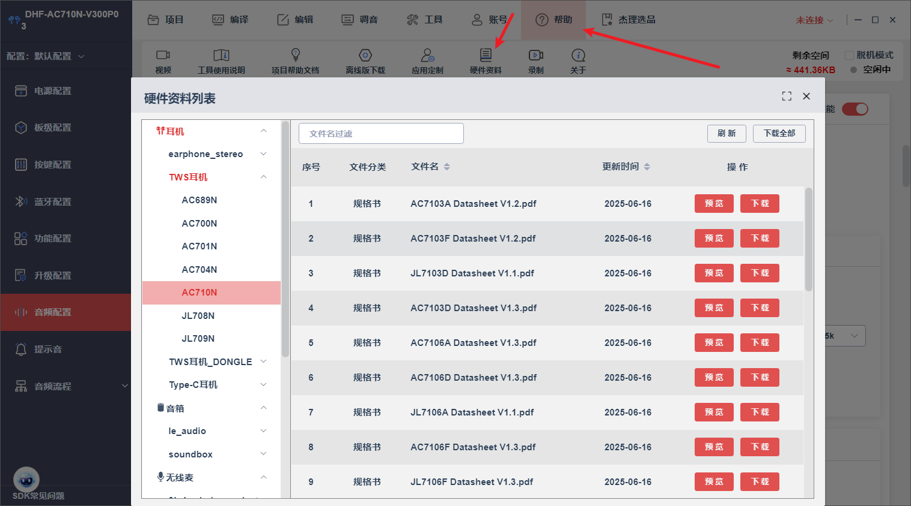
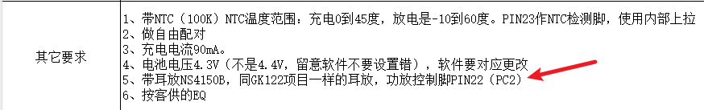

# 虚拟机（VM）区域在进行更新操作时的擦除行为

`apps\earphone\board\br56\board_ac710n_demo_global_build_cfg.h`

这个宏 `CONFIG_VM_OPT` 是用来控制虚拟机（VM）区域在进行更新操作时的擦除行为的。

根据注释说明：

- **功能**：配置在执行更新操作时是否擦除这个区域
- 取值含义：
  - `1` - 不执行任何操作（No Operation）
  - `0` - 擦除（Erase）

从上下文来看，这应该是在嵌入式系统或固件开发中使用的配置项，涉及到Flash存储器的管理。在固件更新过程中，有时需要决定是否擦除特定的虚拟机存储区域。

当前这个宏被设置为 `0`，意味着在更新时会擦除该VM区域。如果设置为 `1`，则在更新时会保留该区域的数据不被擦除。

# 低电提醒时间

`apps\earphone\include\app_power_manage.h`

```c
#define LOW_POWER_WARN_TIME   	(5 * 60 * 1000)  //低电提醒时间
```

# TWS相关

## 获取本地声道

```c
//获取本地声道，只能用于配对方式选择了固定左右耳宏的？
char channel = tws_api_get_local_channel();
```

# 按键

## 通话相关场景下按键流程

## 非通话相关场景下按键流程

## 所有场景下按键流程

`apps\earphone\mode\bt\bt_key_msg_table.c`的`bt_key_power_msg_remap`

## 按键相关的参数

### 长按相关的参数

`interface\driver\cpu\periph\lp_touch_key_common.h`

```c
#define LP_TOUCH_KEY_PLATFORM_DATA_END() \
    .ldo_wkp_algo_reset = 1,\
    .charge_enter_algo_reset = 0,\
    .charge_exit_algo_reset = 1,\
    .charge_online_algo_reset = 1,\
    .charge_online_softoff_wakeup = 0,\
    .softoff_wakeup_time = 1000, \   //-----------------------开机识别
    .short_click_check_time = 500, \  //----------------------短按识别
    .long_click_check_time = 2000, \  //----------------------长按识别
    .hold_click_check_time = 200, \   //----------------------长按保持识别
    .eartch_touch_filter_time = 500, \
    .eartch_touch_valid_time = 1300, \
    .eartch_check_touch_valid_time = 50, \
    .eartch_audio_det_valid_time = 2000, \
    .eartch_audio_det_filter_param = 6, \
}
```

- 多击延迟参数没有看到。

## 多击+长按按键事件检测


# 恢复出厂设置

## 主从同步调用函数处理

`apps\earphone\mode\bt\bt_tws.c`

```c
/*
 * 主从同步调用函数处理
 */
static void tws_sync_call_fun(int cmd, int err)
{
    log_d("TWS_EVENT_SYNC_FUN_CMD: %d\n", cmd);

    switch (cmd) {
    case SYNC_CMD_EARPHONE_CHAREG_START:
        if (bt_a2dp_get_status() != BT_MUSIC_STATUS_STARTING) {
            bt_cmd_prepare(USER_CTRL_AVCTP_OPID_PLAY, 0, NULL);
        }
        break;
    case SYNC_CMD_IRSENSOR_EVENT_NEAR:
        if (bt_a2dp_get_status() != BT_MUSIC_STATUS_STARTING) {
            bt_cmd_prepare(USER_CTRL_AVCTP_OPID_PLAY, 0, NULL);
        }
        break;
    case SYNC_CMD_IRSENSOR_EVENT_FAR:
        if (bt_a2dp_get_status() == BT_MUSIC_STATUS_STARTING) {
            bt_cmd_prepare(USER_CTRL_AVCTP_OPID_PAUSE, 0, NULL);
        }
        break;
    case SYNC_CMD_RESET:
		extern void factory_reset_deal_callback(void);
        factory_reset_deal_callback();
        break;
    }
}

TWS_SYNC_CALL_REGISTER(tws_tone_sync) = {
    .uuid = 'T',
    .task_name = "app_core",
    .func = tws_sync_call_fun,
};
```

- 没看到在哪里调用`SYNC_CMD_RESET`

- `tws_sync_call_fun`是注册到系统任务中的：

**跟上面两者不知道怎么联系起来。**

```c
    //IR_NUM中间不允许插入msg

    APP_MSG_FACTORY_RESET,//新增公共枚举值，不区分项目----wang

    APP_MSG_INPUT_FILE_NUM,
```

`bt_key_power_msg_remap`创建一个按键对应的消息处理case

```c
case KEY_ACTION_FOURTH_CLICK:
	app_msg = APP_MSG_FACTORY_RESET;
	break;
```

创建`APP_MSG_FACTORY_RESET`对应消息的处理函数：

- **手动写具体的处理分支**

```c
int bt_app_msg_handler(int *msg)
{
    u8 data[1];
    if (!app_in_mode(APP_MODE_BT)) {
        return 0;
    }
    switch (msg[0]) {
    case APP_MSG_VOL_UP:
        log_info("APP_MSG_VOL_UP\n");
#if (TCFG_LE_AUDIO_APP_CONFIG & LE_AUDIO_AURACAST_SINK_EN)
        app_audio_volume_up(1);
#else
        bt_volume_up(1);
#endif
        bt_tws_sync_volume();
#if ((TCFG_LE_AUDIO_APP_CONFIG & (LE_AUDIO_UNICAST_SINK_EN | LE_AUDIO_JL_UNICAST_SINK_EN)))
        data[0] = CIG_EVENT_OPID_VOLUME_UP;
        le_audio_media_control_cmd(data, 1);
#endif
        return 0;
    case APP_MSG_VOL_DOWN:
        log_info("APP_MSG_VOL_DOWN\n");
#if (TCFG_LE_AUDIO_APP_CONFIG & LE_AUDIO_AURACAST_SINK_EN)
        app_audio_volume_down(1);
#else
        bt_volume_down(1);
#endif
        bt_tws_sync_volume();
#if ((TCFG_LE_AUDIO_APP_CONFIG & (LE_AUDIO_UNICAST_SINK_EN | LE_AUDIO_JL_UNICAST_SINK_EN)))
        data[0] = CIG_EVENT_OPID_VOLUME_DOWN;
        le_audio_media_control_cmd(data, 1);
#endif
        return 0;
    case APP_MSG_FACTORY_RESET:
        puts("dhf----APP_MSG_FACTORY_RESET\n");
        dhf_factory_reset_deal();//-----------------------这里面有区分一起恢复出厂还是单耳的逻辑
        return 0;
    }

    /* 下面是蓝牙相关消息,从机不用处理  */
#if TCFG_USER_TWS_ENABLE
    if (tws_api_get_role_async() == TWS_ROLE_SLAVE) {
        return 0;
    }
#endif
    switch (msg[0]) {
    case APP_MSG_MUSIC_PP:
```

`factory_reset_deal_callback();`

```c
void factory_reset_deal_callback(void) {
    bt_cmd_prepare(USER_CTRL_DEL_ALL_REMOTE_INFO, 0, NULL);
    bt_tws_remove_pairs();
    led_ui_set_state(LED_STA_ALL_OFF, DISP_CLEAR_OTHERS);
    if (factory_reset_led == 0) {
        factory_reset_led = sys_timer_add(NULL, factory_reset_deal, 200);
    }
}
```

`factory_reset_deal`

```c
int factory_reset_led = 0;
volatile u8 factory_reset_cnt =0;
void factory_reset_deal(void *priv)
{
    factory_reset_cnt++;
    printf("factory_reset_cnt = %d\n",factory_reset_cnt);
    led_ui_set_state(LED_STA_ALL_ON, DISP_CLEAR_OTHERS);
    // if (factory_reset_cnt%2 == 0) {
    //     led_ui_set_state(LED_STA_RED_ON, DISP_CLEAR_OTHERS);
    // } else {
    //     led_ui_set_state(LED_STA_ALL_OFF, DISP_CLEAR_OTHERS);
    // }
    if (factory_reset_cnt == 7) {
        if(factory_reset_led) {
            sys_timer_del(factory_reset_led);
            factory_reset_led=0;
        }
        // cpu_reset();
        //sys_enter_soft_poweroff(NULL);//不想关机的话，可以使用POWEROFF_RESET进行复位，把蓝牙名都重置了？
        sys_enter_soft_poweroff(POWEROFF_NORMAL_TWS);
        // power_set_soft_poweroff();
    }
}

void factory_reset_deal_callback(void) {
    bt_cmd_prepare(USER_CTRL_DEL_ALL_REMOTE_INFO, 0, NULL);
    bt_tws_remove_pairs();
    led_ui_set_state(LED_STA_ALL_OFF, DISP_CLEAR_OTHERS);
    if (factory_reset_led == 0) {
        factory_reset_led = sys_timer_add(NULL, factory_reset_deal, 200);
    }
}

 static void dhf_factory_reset_deal(void)
 {
    if (get_tws_sibling_connect_state()) {
        tws_api_sync_call_by_uuid('T', SYNC_CMD_RESET, 300);
    } else {
        factory_reset_deal_callback();
    }
 }
```

看到了`SYNC_CMD_RESET`，先判断TWS是否连接成功。成功就一起调用`SYNC_CMD_RESET`，此分支再调用`factory_reset_deal_callback();`，单耳调用还是一起调用的区别而已。

`factory_reset_deal_callback`是具体的处理函数。

但是`SYNC_CMD_RESET`分支不是在`tws_sync_call_fun()`中吗？

```c
/*
 * 通过uuid，主从同步调用相同函数
 */
int tws_api_sync_call_by_uuid(int uuid, int priv, int delay_ms);
```

**uuid怎么拿到？**

直接调用`tws_sync_call_fun`传递分支也是可以的，没验证。

# 灯效

接口：`led_ui_set_state(LED_STA_RED_BLUE_FAST_FLASH_ALTERNATELY, DISP_CLEAR_OTHERS);`

调用需要先包含头文件：

```c
#include "pwm_led/led_ui_tws_sync.h"
#include "pwm_led/led_ui_api.h"
```

```c
//总入口 只有一个对外接口调用
void led_ui_set_state(enum led_state_name name, enum led_disp_mode disp_mode)
{
    struct led_state_obj *obj;
    const struct led_state_map *map;

    log_info("led_name = %d, disp_mode = 0x%x\n", name, disp_mode);

    for (int i = 0; ; i++) {
        map = &g_led_state_table[i];
        if (map->name == 0) {
            PWMLED_LOG_ERR("search END, may no this effect config");
            break;
        }
        if (name != map->name) {
            /* PWMLED_LOG_DEBUG("find next effect to match from g_led_state_table,map->name = %d", map->name); */
            continue;
        }
        PWMLED_LOG_SUCC("Find effect Succ");
        const u8 *arg1 = (const u8 *)map->arg1;

        obj = zalloc(sizeof(*obj));
        if (!obj) {
            PWMLED_LOG_ERR("obj zalloc fail");
            return;
        }
        obj->name           = name;
        obj->disp_mode      = disp_mode;
        if (map->time_flag == TIME_EFFECT_MODE) {
            obj->time       = (const led_pdata_t *)arg1;
        } else {
            obj->table      = (const struct led_state_item *)arg1;
            obj->table_size = map->time_flag;
        }
        led_ui_add_state(obj);
        break;
    }
}
```

这是LED灯效设置的唯一对外接口，通过LED状态名称和显示模式来激活对应的灯效。

**参数输入**

- `name`: LED状态名称枚举，标识要设置的具体灯效
- `disp_mode`: 显示模式枚举，控制灯效的显示方式

**状态表查找**

```c
for (int i = 0; ; i++) {
    map = &g_led_state_table[i];
    if (map->name == 0) break;  // 遇到表结束标记
    if (name != map->name) continue;  // 继续查找匹配项
```

遍历全局状态表 `g_led_state_table`，寻找与输入名称匹配的LED状态配置。

**状态对象创建**

找到匹配项后，动态分配内存创建LED状态对象：

```c
obj = zalloc(sizeof(*obj));  // 分配并清零内存
obj->name = name;
obj->disp_mode = disp_mode;
```

**配置数据解析**

根据时间标志位判断配置数据类型：

```c
if (map->time_flag == TIME_EFFECT_MODE) {
    obj->time = (const led_pdata_t *)arg1;  // 时间效果模式
} else {
    obj->table = (const struct led_state_item *)arg1;  // 状态表模式
    obj->table_size = map->time_flag;  // 表大小
}
```

**状态激活**

调用 `led_ui_add_state(obj)` 将配置好的状态对象添加到LED控制系统中。

## `g_led_state_table`

`apps\earphone\ui\led\led_config.c`

这个表是LED灯效系统的配置映射表。

**基本结构**

```c
struct led_state_map {
    enum led_state_name name;    // LED状态名称
    u32 time_flag;              // 时间标志/表大小
    void *arg1;                 // 配置数据指针
};
```

**配置方式分类**

- **时间效果模式 (TIME_EFFECT_MODE)** 大部分灯效都使用这种模式，直接引用预定义的配置数据：

```c
{ LED_STA_RED_ON, TIME_EFFECT_MODE, &led_red_on_config }
```

- **状态表模式 (LED_STATE_TABLE)** 用于复杂的软件组合灯效：

```c
{ LED_STA_BLUE_1S_FLASHS_3_TIMES, LED_STATE_TABLE(blue_led_1s_flashs_3_times) }
```

**功能分类**

1. **全局控制**

- `LED_STA_ALL_ON/OFF`: 所有LED的开关控制

2. **红色LED灯效** (条件编译 `TCFG_LED_RED_ENABLE`)

- **持续点亮**: 常亮、1秒亮、2秒亮、3秒亮
- **闪烁次数**: 闪1次、2次、3次
- **周期闪烁**: 慢闪、快闪、每秒1次、每5秒1次
- **呼吸效果**: 红色呼吸灯

3. **蓝色LED灯效** (条件编译 `TCFG_LED_BLUE_ENABLE`)

- 功能与红色LED完全对应
- 额外包含开机效果：`LED_STA_POWERON` 映射到蓝色1秒亮

4. **双色组合效果**

- **交替闪烁**: 红蓝慢闪交替、快闪交替
- **交替呼吸**: 红蓝呼吸交替

## 调用已有灯效

`led_ui_set_state(LED_STA_RED_BLUE_FAST_FLASH_ALTERNATELY, DISP_CLEAR_OTHERS);`


在`apps\earphone\include\led_config.h`选灯效参数。`apps\common\ui\pwm_led\led_ui_api.h`选择灯效属性。

```c
//灯效属性
enum led_disp_mode : u8 {
    DISP_NON_INTR          = 0x01, // 当前设置的灯效不允许被打断
    DISP_CLEAR_OTHERS      = 0x02, // 清除其它灯效, 设置了DISP_NON_INTR标记的不会被清除
    DISP_RECOVERABLE       = 0x04, // 周期灯效和非周期灯效共存标记, 被非周期的灯效打断后不会被删除
    DISP_TWS_SYNC          = 0x08, // 需要tws同步的灯效。默认只允许tws主机设置,
    // 硬件会间隔发起tws通信保持同步，软件只会同步第一次。
    DISP_TWS_SYNC_RX       = 0x10, // tws主机发起的同步灯效，从机收到后自动添加此标记
    DISP_TWS_SYNC_TX       = 0x20, // tws主机发起的同步灯效，主机发送后自动添加此标记
};
```

## 增加自定义灯效

**在枚举中添加新的LED状态名称**

```c
// 在 enum led_state_name 中添加
enum led_state_name {
    // ... 现有的枚举值
    LED_STA_MY_CUSTOM_EFFECT,     // 你的自定义灯效名称
    // ...
};
```

### **选择灯效实现方式**

**方式一：时间效果模式 (TIME_EFFECT_MODE)**

如果是简单的单色或双色效果，创建配置结构：

```c
const struct led_platform_data led_my_custom_config = {
    .ctl_option = CTL_LED0_ONLY,           // 只控制LED0(红灯)
    .ctl_mode = CYCLE_ONCE_BRIGHT,         // 周期单闪模式
    .ctl_cycle = 20,                       // 每个周期1秒 (20*50ms=1000ms)
    .ctl_cycle_num = 3,                    // 总共闪3次
    .once_bright.bright_time = 4,          // 每次亮0.2秒 (4*50ms=200ms)
};
```

**时间单位**

- 所有时间参数都是以50ms为单位
- 例如：`ctl_cycle = 20` 表示1000ms (20×50ms)

**控制选项 (ctl_option)**

```c
enum led_ctl_option {
    CTL_LED0_ONLY,                  //只控led0
    CTL_LED1_ONLY,                  //只控led1
    CTL_LED01_ASYNC,                //led0&led1异步(交替)
    CTL_LED01_SYNC,                 //led0&led1同步
};
```

**控制模式 (ctl_mode)**

```c
enum led_ctl_mode {
    CYCLE_ONCE_BRIGHT,              //周期单闪
    CYCLE_TWICE_BRIGHT,             //周期双闪
    CYCLE_BREATHE_BRIGHT,           //周期呼吸
    ALWAYS_BRIGHT,                  //常亮
    ALWAYS_EXTINGUISH,              //常灭
};
```

**关键理解点**

1. **ctl_cycle**: 每个周期的总时间
2. ctl_cycle_num:
   - `0` = 无限循环
   - `>0` = 指定次数后停止
3. **bright_time**: 在每个周期内的亮灯时间
4. **异步模式**: LED0和LED1轮流工作，实现交替效果
5. **同步模式**: LED0和LED1同时工作

**方式二：状态表模式 (LED_STATE_TABLE)**

```c
const struct led_state_item my_custom_led_effect[] = {
    //LED名称    时间   亮度              呼吸时间        动作
    
    // 第1步：初始化 - 关闭所有LED
    { LED_RED,   0,    LED_BRIGHT_OFF,   0,             LED_ACTION_CONTINUE },
    { LED_BLUE,  0,    LED_BRIGHT_OFF,   0,             LED_ACTION_CONTINUE },
    
    // 第2步：红灯快闪2次
    { LED_RED,   2,    LED_RED_BRIGHTNESS, 0,           LED_ACTION_WAIT },  // 红灯亮100ms
    { LED_RED,   2,    LED_BRIGHT_OFF,     0,           LED_ACTION_WAIT },  // 红灯灭100ms
    { LED_RED,   2,    LED_RED_BRIGHTNESS, 0,           LED_ACTION_WAIT },  // 红灯亮100ms
    { LED_RED,   2,    LED_BRIGHT_OFF,     0,           LED_ACTION_WAIT },  // 红灯灭100ms
    
    // 第3步：蓝灯慢闪1次
    { LED_BLUE,  10,   LED_BLUE_BRIGHTNESS, 0,          LED_ACTION_WAIT },  // 蓝灯亮500ms
    { LED_BLUE,  10,   LED_BRIGHT_OFF,      0,          LED_ACTION_WAIT },  // 蓝灯灭500ms
    
    // 第4步：间隔后循环
    { LED_BLUE,  20,   LED_BRIGHT_OFF,     0,           LED_ACTION_LOOP },  // 等待1秒，然后循环
};
```

表的元素结构：

```c
struct led_state_item {
    u8 led_name;        // LED名称 (LED_RED/LED_BLUE)
    u8 time_msec;       // 灯亮的时间，单位50ms
    u8 brightiness;     // 亮度值
    u8 breath_time;     // 呼吸灯效参数（0=非呼吸灯，有值=呼吸灯保持时间）
    u8 action;          // 动作类型
};
```

**time_msec（时间）**

- 单位：50ms
- 含义：这一步的**总持续时间**
- 示例：`time_msec = 10` 表示这一步持续 500ms

**breath_time（呼吸参数）**

- `breath_time = 0`：普通开关模式
- `breath_time > 0`：呼吸灯模式
- 呼吸灯模式下：
  - `breath_time` 表示亮度到最大时的**保持时间**
  - 必须满足：`breath_time < time_msec`

**呼吸灯效果示例**

```c
const struct led_state_item breathing_effect[] = {
    // 红灯呼吸效果：总时间1秒，最亮时保持200ms
    { LED_RED, 20, LED_RED_BRIGHTNESS, 4, LED_ACTION_WAIT },
    //         ↑   ↑                  ↑
    //      1000ms 最大亮度        200ms保持时间
    
    // 关闭
    { LED_RED, 10, LED_BRIGHT_OFF, 0, LED_ACTION_LOOP },
};
```

**呼吸效果时间分配**：

- 总时间1000ms
- 渐亮时间：(1000-200)/2 = 400ms
- 保持时间：200ms
- 渐灭时间：400ms

### 在状态表中添加映射

```c
const struct led_state_map g_led_state_table[] = {
    // ... 现有的映射
    
    // 添加你的自定义灯效
    { LED_STA_MY_CUSTOM_EFFECT, TIME_EFFECT_MODE, &led_my_custom_config },
    // 或者使用状态表模式：
    // { LED_STA_MY_CUSTOM_EFFECT, LED_STATE_TABLE(my_custom_led_effect) },
    
    { 0, 0, 0 } // END must end
};
```

#### 调用自定义灯效

```c
// 在需要的地方调用
led_ui_set_state(LED_STA_MY_CUSTOM_EFFECT, DISP_CLEAR_OTHERS);
```

## 各状态的灯效

`apps\earphone\ui\led\led_ui_msg_handler.c`

电源相关的灯效

- `ui_battery_msg_handler`

各状态的灯效

- ui_app_msg_handler

  - 开关机灯效

  - tws配对灯效

  - 开机回连手机灯效

  - 等待手机连接状态

蓝牙协议相关的灯效

- ui_bt_stack_msg_handler
  - 一拖二时耳机的灯效。

TWS相关的灯效

- ui_tws_msg_handler
  - TWS连接
  - TWS断开？？？

## 灯效流程

### 单耳

**开机**

1. `[LED_UI]APP_MSG_POWER_ON`
2. `[LED_UI]led_enter_mode--APP_MODE_POWERON`
3. `[LED_UI]ui_app_msg_handler--APP_MSG_TWS_UNPAIRED`
4. `[LED_UI]APP_MSG_BT_IN_PAIRING_MODE`
5. `[LED_UI]ui_bt_stack_msg_handler--BT_STATUS_FIRST_CONNECTED`
6. `[LED_UI]ui_bt_stack_msg_handler--BT_STATUS_FIRST_CONNECTED`
7. `[LED_UI]BT_STATUS_FIRST_DISCONNECT--BT_STATUS_SECOND_DISCONNECT`
   - 连接时断开出现
   - `[LED_UI]APP_MSG_BT_IN_PAIRING_MODE`
     - 断开后会出现

**关机**

1. `[LED_UI]APP_MSG_POWER_OFF`

## 函数调用链


# DUT

`bt_key_power_msg_remap`创建按键事件触发后的DUT函数

```c
case KEY_ACTION_CLICK:
	app_msg = APP_MSG_BT_CLOSE_DUT;
	break;
case KEY_ACTION_FIRTH_CLICK:
    app_msg = APP_MSG_BT_OPEN_DUT;
    break;
```

具体的处理函数定义：`bt_app_msg_handler`

```c
/* 下面是蓝牙相关消息,从机不用处理  */
//.......
case APP_MSG_BT_OPEN_DUT:
    puts("APP_MSG_BT_OPEN_DUT\n");
    bt_bredr_enter_dut_mode(1, 1);//进入DUT
    break;
case APP_MSG_BT_CLOSE_DUT:
    puts("APP_MSG_BT_CLOSE_DUT\n");
    if (get_bt_tws_connect_status()) {
        printf("APP_MSG_BT_CLOSE_DUT--get_bt_tws_connect_status()\r\n");
        // if (TWS_ROLE_MASTER == tws_api_get_role()) {
        if (('U' == tws_api_get_local_channel()) || ('L' == tws_api_get_local_channel())) {
            printf("APP_MSG_BT_CLOSE_DUT--channel:[L]\r\n");
            led_ui_set_state(LED_STA_RED_BLUE_FAST_FLASH_ALTERNATELY, DISP_CLEAR_OTHERS);
        } else {
            printf("APP_MSG_BT_CLOSE_DUT--channel:[R]\r\n");
            led_ui_set_state(LED_STA_BLUE_FLASH_1TIMES_PER_5S, DISP_CLEAR_OTHERS);
        }
    } else {
        printf("APP_MSG_BT_CLOSE_DUT--!!!!get_bt_tws_connect_status()\r\n");
        led_ui_set_state(LED_STA_RED_BLUE_FAST_FLASH_ALTERNATELY, DISP_CLEAR_OTHERS);
    }
    bt_bredr_exit_dut_mode();//退出
    break;
```


```c
#include "pwm_led/led_ui_tws_sync.h"
#include "pwm_led/led_ui_api.h"

/**********进入蓝牙dut模式
*  mode=0:使能可以进入dut，原本流程不变。
*  mode=1:删除一些其它切换状态，产线中通过工具调用此接口进入dut模式，提高测试效率
 *********************/
void bt_bredr_enter_dut_mode(u8 mode, u8 inquiry_scan_en)
{
    puts("<<<<<<<<<<<<<bt_bredr_enter_dut_mode>>>>>>>>>>>>>>\n");

#if (defined CONFIG_CPU_BR56)
    u32 curr_clk = clk_get_max_frequency();
    y_printf("DUT test,set clock:%d\n", curr_clk);
    clock_alloc("DUT", curr_clk);
#endif
    bredr_set_dut_enble(1, 1);
    if (mode) {
        led_ui_set_state(LED_STA_RED_ON, DISP_CLEAR_OTHERS);//设置DUT模式的灯效
        clr_device_in_page_list();
        dut_idle_run_slot(2);
        g_bt_hdl.auto_connection_counter = 0;
#if TCFG_USER_TWS_ENABLE
        bt_page_scan_for_test(inquiry_scan_en);
#endif

    }
}
```

# 提示音

在可视化工具中导出后，在顶级目录的output中tone_xx.cfg。可以直接导入即可。

# 时钟频率

**函数整体功能**：根据音频管道名称返回对应的UUID

**每个管道的用途**：

- tone: 系统提示音
- ring: 来电铃声
- esco: 蓝牙语音通话
- a2dp: 蓝牙高质量音频
- linein: 模拟音频输入
- pc_spk/pc_mic: USB音频设备
- music: 本地音乐播放
- ai_voice: AI语音处理
- le_audio: 低功耗蓝牙音频
- 等等

**时钟分配的原因**：

- 不同管道根据音频质量和实时性需求分配不同的时钟频率
- 24MHz用于基本音频处理
- 48MHz用于蓝牙音频
- 96MHz用于USB音频
- 120MHz用于线路输入（避免DAC缓存不足）

**条件编译**：解释了各种宏定义的作用和启用条件

```c
/**
 * @brief 根据音频管道名称获取对应的管道UUID
 * @param name 音频管道名称字符串
 * @return 返回对应的管道UUID，如果未找到匹配的管道则返回0
 */
static int get_pipeline_uuid(const char *name)
{
    /* 纯音调播放管道 - 用于播放系统提示音、按键音等 */
    if (!strcmp(name, "tone")) {
        return PIPELINE_UUID_TONE_NORMAL;
    }

    /* 铃声播放管道 - 用于来电铃声播放 */
    if (!strcmp(name, "ring")) {
        /* 为esco管道分配48MHz时钟，确保铃声播放的实时性 */
        clock_alloc("esco", 48 * 1000000UL);
        return PIPELINE_UUID_TONE_NORMAL;
    }

    /* eSCO蓝牙语音通话管道 - Enhanced Synchronous Connection Oriented */
    if (!strcmp(name, "esco")) {
        /* 分配48MHz时钟频率，满足语音通话的实时处理需求 */
        clock_alloc("esco", 48 * 1000000UL);
        /* 向用户层发送eSCO启动事件通知 */
        audio_event_to_user(AUDIO_EVENT_ESCO_START);
        return PIPELINE_UUID_ESCO;
    }

    /* A2DP蓝牙高质量音频传输管道 - Advanced Audio Distribution Profile */
    if (!strcmp(name, "a2dp")) {
        /* 分配48MHz时钟，保证高质量音频解码和播放 */
        clock_alloc("a2dp", 48 * 1000000UL);
        /* 向用户层发送A2DP启动事件通知 */
        audio_event_to_user(AUDIO_EVENT_A2DP_START);
        
        /* 如果启用了音频DUT(Device Under Test)测试功能 */
#if TCFG_AUDIO_DUT_ENABLE
        /* 检查是否启用了音频解码DUT测试模式 */
        if (audio_dec_dut_en_get(0)) {
            return PIPELINE_UUID_A2DP_DUT;  /* 返回A2DP测试管道UUID */
        }
#endif
        return PIPELINE_UUID_A2DP;  /* 返回正常A2DP管道UUID */
    }

    /* 模拟音频线路输入管道 - 用于AUX输入音频处理 */
#if TCFG_APP_LINEIN_EN
    if (!strcmp(name, "linein")) {
        /* 此处设置时钟不低于120MHz是由于切时钟会停止CPU，
         * 多次切换会导致DAC缓存少于1ms，造成音频断续 */
        clock_alloc("linein", 120 * 1000000UL);
        return PIPELINE_UUID_A2DP;  /* 复用A2DP管道处理线路输入 */
    }
#endif

    /* PC音频管道 - 用于USB音频设备功能 */
#if TCFG_APP_PC_EN
    /* PC扬声器输出管道 - 作为USB音频设备的输出端 */
    if (!strcmp(name, "pc_spk")) {
        /* 分配96MHz时钟，满足USB音频传输和处理需求 */
        clock_alloc("pc_spk", 96 * 1000000UL);
        return PIPELINE_UUID_PC_AUDIO;
    }
    
    /* PC麦克风输入管道 - 作为USB音频设备的输入端 */
    if (!strcmp(name, "pc_mic")) {
        /* 分配96MHz时钟，保证麦克风音频采集和上传的实时性 */
        clock_alloc("pc_mic", 96 * 1000000UL);
        return PIPELINE_UUID_PC_AUDIO;
    }
#endif

    /* 本地音乐播放管道 - 用于播放存储在设备上的音频文件 */
#if TCFG_APP_MUSIC_EN
    if (!strcmp(name, "music")) {
        /* 分配64MHz时钟，满足音频文件解码播放需求 */
        clock_alloc("music", 64 * 1000000UL);
        return PIPELINE_UUID_A2DP;  /* 复用A2DP管道处理本地音乐 */
    }
#endif

    /* AI语音处理管道 - 用于语音识别、语音助手等功能 */
    if (!strcmp(name, "ai_voice")) {
        /* 注释掉的时钟分配，可能AI语音处理对时钟要求不高 */
        /* clock_alloc("a2dp", 24 * 1000000UL); */
        return PIPELINE_UUID_AI_VOICE;
    }

    /* 设备数据流管道 - 用于设备间的数据传输 */
    if (!strcmp(name, "dev_flow")) {
        return PIPELINE_UUID_DEV_FLOW;
    }

    /* 麦克风效果处理管道 - 用于麦克风音效处理或助听器功能 */
#if (TCFG_MIC_EFFECT_ENABLE || TCFG_AUDIO_HEARING_AID_ENABLE)
    if (!strcmp(name, "mic_effect")) {
        /* 分配24MHz时钟，满足麦克风音效处理的基本需求 */
        clock_alloc("mic_effect", 24 * 1000000UL);
        return PIPELINE_UUID_MIC_EFFECT;
    }
#endif

    /* LE Audio低功耗音频管道 - 蓝牙LE Audio标准 */
#if LE_AUDIO_STREAM_ENABLE
    if (!strcmp(name, "le_audio")) {
        /* 如果启用了LE Audio单播接收功能 */
#if (TCFG_LE_AUDIO_APP_CONFIG & LE_AUDIO_JL_UNICAST_SINK_EN)
        /* 分配最大时钟频率，确保LE Audio的高质量传输 */
        clock_alloc("le_audio", clk_get_max_frequency());
#endif
        return PIPELINE_UUID_LE_AUDIO;
    }
    
    /* LE Audio通话管道 - 用于基于LE Audio的语音通话 */
    if (!strcmp(name, "le_audio_call") || \
        !strcmp(name, "mic_le_audio_call")) {
        /* 如果启用了LE Audio单播接收功能 */
#if (TCFG_LE_AUDIO_APP_CONFIG & LE_AUDIO_JL_UNICAST_SINK_EN)
        /* 分配最大时钟频率，保证通话质量 */
        clock_alloc("le_audio", clk_get_max_frequency());
#endif
        return PIPELINE_UUID_ESCO;  /* 复用eSCO管道处理LE Audio通话 */
    }
#endif

    /* ADDA环路测试管道 - 用于音频ADC/DAC环路测试 */
    if (!strcmp(name, "adda_loop")) {
        /* 分配24MHz时钟，满足基本的环路测试需求 */
        clock_alloc("adda_loop", 24 * 1000000UL);
        return PIPELINE_UUID_A2DP_DUT;  /* 使用A2DP测试管道UUID */
    }
    
    /* 如果没有匹配的管道名称，返回0表示未找到 */
    return 0;
}
```

# 硬件配置

## 资料



## MIC配置


**DAC与ADC记忆：**

- DAC是数字信号转为电压（声音）**喇叭**
  - D喇叭
- ADC是电压（声音）转为数字信号  **麦克风**

**后面的偏置脚是输入端，MICP MICN是用来确定是麦0还是麦1的同时也是确定输入端。**

**隔直电容以及省电容**

- 前者是硅麦
- 后者是原麦

## LED配置

- 数据手册要对的上芯片型号
- 单IO推双灯需要一高一低点亮。


# 可视化软件功能配置

## 蓝牙配置

- 无连接关机时间

## 电源配置

- 截至电压
- 电池电量检测
  - 关机电压
  - 低电电压

# 接口

## 用来获取蓝牙连接的设备个数，不包含page状态的计数

```c
if (bt_get_total_connect_dev() == 0) {    //已经没有设备连接
	//主耳白蓝灯交替闪，副耳蓝灯每5秒闪一次
    if (tws_api_get_role() == TWS_ROLE_MASTER) {
    	led_ui_set_state(LED_STA_RED_BLUE_FAST_FLASH_ALTERNATELY, DISP_CLEAR_OTHERS);
    } else {
    	led_ui_set_state(LED_STA_RED_FLASH_1TIMES_PER_5S, DISP_CLEAR_OTHERS);
    }
}
```

**TWS状态下似乎可以生效，但是单耳状态无法通过判断。**

# 其他

## 开在线调音


编译一下应用这个配置，再导出调音配置。


## 开打印


**接地线(B-标记)以及接RX引脚。**

## 合EQ

可以导入三种格式，一般是bin文件：


选择要合的模块，一般是音乐EQ:
   						


## 测试喇叭的输出功率

bypass掉EQ，音量最大才是准确的。

- 测试时把声音拉到最大。


可视化SDK被注释掉了。不然可以调输出功率的。

# 功放的问题

同一款软件，一个有声音一个没有声音。

- 一个有功放
- 一个没有功放

可视化中配置功放

**板级配置**




原理图


不带功放的耳机声音不受影响。

还是没声音可能是声道的选择不一样。


## 原理图

看电路图中的信号标注：

- **DACLP (2脚)** - 这里的"L"通常表示Left（左声道）
- **DACLN (1脚)** - 同样"L"表示Left（左声道）
- **DACRP (32脚)** - 这里的"R"通常表示Right（右声道）
- **DACRN (31脚)** - 同样"R"表示Right（右声道）

这是音频电路中的标准命名约定：

- **L** = Left Channel（左声道）
- **R** = Right Channel（右声道）
- **P** = Positive（正极）
- **N** = Negative（负极）

所以：

- DACLP = DAC Left Positive（DAC左声道正极输出）
- DACLN = DAC Left Negative（DAC左声道负极输出）
- DACRP = DAC Right Positive（DAC右声道正极输出）
- DACRN = DAC Right Negative（DAC右声道负极输出）

从连接来看，确实只有左声道的DACLP/DACLN连接到了功放芯片NS4150B，而右声道的DACRP/DACRN在这个设计中没有被使用，这证实了这是一个单声道的音频输出设计。

根据这个AC7106芯片的电路图，我可以看到音频功放相关的部分：

**功放芯片：NS4150B (U3)**

- 这是一个音频功放芯片
- 输入引脚：IN+ (3脚) 和 IN- (4脚)
- 输出引脚：OV+ (8脚) 和 OV- (5脚)

**声道配置：** 从电路连接来看，这是一个**单声道**或**桥接输出**的配置：

- AC7106的DACLP (左声道正极输出) 连接到NS4150B的IN+ (3脚)
- AC7106的DACLN (左声道负极输出) 连接到NS4150B的IN- (4脚)
- NS4150B的差分输出 (OV+/OV-) 连接到扬声器 (SPK++/SPK--)

**具体IO口：** 在AC7106主芯片上：

- **DACLP (2脚)** - 左声道正极输出
- **DACLN (1脚)** - 左声道负极输出

这个设计使用了左声道的差分输出来驱动单个扬声器，通过NS4150B功放芯片进行桥接放大，可以获得更大的输出功率。右声道输出(DACRP/DACRN)在这个设计中似乎没有使用。

## 需要手动开启功放

```c
#if  DAC_PA_EN
void user_pa_deal(u8 enable) {
    if (enable) {
        // 使能时，设置引脚为输出高电平
        gpio_set_mode(IO_PORT_SPILT(IO_PORTC_02), PORT_OUTPUT_HIGH);
    } else {
        // 关闭时，设置引脚为输出低电平
        gpio_set_mode(IO_PORT_SPILT(IO_PORTC_02), PORT_OUTPUT_LOW);
    }
}
#endif
```

# 多击+长按的按键事件类型需求

客户很多都有触摸按键或者IO按键操作中，单击+长按，三击+长按。

- 按照SDK原来的逻辑的话，在多击判定流程中，触发其他按键会打断多击序列从而以最后一次按键事件上报。
- 怎么实现多击+长按的需求，以最小入侵方式实现？

## 当前架构限制分析

```c
// 当前的多击识别逻辑（简化版）
static int multi_clicks_translate(struct key_event *key) {
    static u8 click_cnt = 0;
    static u8 notify_value = 0xff;
    
    if (key->event == KEY_ACTION_CLICK) {
        if (key->value != notify_value) {
            click_cnt = 1;              // 新按键序列
            notify_value = key->value;
        } else {
            click_cnt++;                // 多击计数
        }
        return 1;  // 拦截，等待多击完成
    }
    
    if (key->event > KEY_ACTION_CLICK) {
        //问题所在：任何非单击事件都会打断多击序列
        click_cnt = 0;              // 重置计数
        notify_value = NO_KEY;      // 清除状态
        return 0;  // 直接发送当前事件（长按、Hold等）
    }
    
    if (key->event == KEY_ACTION_NO_KEY) {
        // 多击延时结束，发送最终多击事件
        if (click_cnt > 0) {
            // 转换为对应的多击事件
            key->event = KEY_ACTION_CLICK + (click_cnt == 1 ? 0 : click_cnt - 1);
            click_cnt = 0;
            notify_value = NO_KEY;
        }
    }
    
    return 0;
}
```

现有架构的问题在于：

1. **打断机制**：长按事件会立即打断多击序列
2. **状态清除**：无法记录多击+长按的组合状态
3. **事件冲突**：多击延时期间的长按会被直接发送，丢失多击信息

## 最小入侵方式实现

```c
/* --------------------------------------------------------------------------*/
/**
 * @brief 多击按键判断
 *
 * @param key：基础按键动作（mono_click、long、hold、up）和键值
 *
 * @return 0：不拦截按键事件
 *         1：拦截按键事件
 */
/* ----------------------------------------------------------------------------*/
static int multi_clicks_translate(struct key_event *key)
{
    static u8 click_cnt;          //多击计数器，没有显式赋值，初值为 0
    static u8 notify_value = 0xff;//当前处理的按键值
    struct key_hold *hold = get_key_hold(key->value, 0);

    // 长按事件处理
    if (key->event == KEY_ACTION_LONG) {
        //优先判断多击+长按事件，长按按键事件之前是否有多击判断记录
        //到目前为止的多击判断记录，有可能出现其他按键事件时其实是在多击判断流程中，这个序列出现其他按键事件就会被打断并被清除（在后面）。
        //不过这里判断出按键事件后直接清楚了，不去执行后面了， 不然key->event可能被覆盖。
        switch (click_cnt)
        {
        case 1:
            // 单击+长按
            key->event = KEY_ACTION_CLICK_PLUS_LONG;
            //直接清除多击计数记录
            click_cnt = 0;
            notify_value = NO_KEY;
            //不用拦截按键事件了，下面也不用执行了。
            return 0;
        case 2:
            // 双击+长按
            key->event = KEY_ACTION_DOUBLE_CLICK_PLUS_LONG;
            //直接清除多击计数记录
            click_cnt = 0;
            notify_value = NO_KEY;
            //不用拦截按键事件了，下面也不用执行了。
            return 0;
        case 3:
            // 三击+长按
            key->event = KEY_ACTION_TRIPLE_CLICK_PLUS_LONG;
            //直接清除多击计数记录
            click_cnt = 0;
            notify_value = NO_KEY;
            //不用拦截按键事件了，下面也不用执行了。
            return 0;
        default:
            //单纯跳出switch，执行正常流程
            break;
        }
        hold = get_key_hold(key->value, 1);
        if (hold) {
            hold->start_time = jiffies;// 先触发long按键事件，为了给hold计时，开始记录长按开始时间，利用长按按键事件为基础判断其他复杂按键事件
        }
    } else if (key->event == KEY_ACTION_HOLD) {// 触发long按键事件后，再触发Hold事件处理 - 根据持续时间细分
        if (hold) {
            int time_msec = jiffies_offset_to_msec(hold->start_time, jiffies);
#if TCFG_SEND_HOLD_SEC_MSG_DURING_HOLD  //按住过程中发送按住几秒消息
            // 按住过程中分段发送消息
            if (time_msec >= 1000 && hold->action == 0) {
                //发生长按后，保持1s
                key->event = KEY_ACTION_HOLD_1SEC;
            } else if (time_msec >= 3000 && hold->action == KEY_ACTION_HOLD_1SEC) {
                //发生长按后，保持3s
                key->event = KEY_ACTION_HOLD_3SEC;
            } else if (time_msec >= 5000 && hold->action == KEY_ACTION_HOLD_3SEC) {
                key->event = KEY_ACTION_HOLD_5SEC;
            } else if (time_msec >= 8000 && hold->action == KEY_ACTION_HOLD_5SEC) {
                key->event = KEY_ACTION_HOLD_8SEC;
            } else if (time_msec >= 10000 && hold->action == KEY_ACTION_HOLD_8SEC) {
                key->event = KEY_ACTION_HOLD_10SEC;
            } else {
                return 0;// 不发送重复消息
            }
            //最长按住消息，一直按住指定触发那个长按保持事件
            if (time_msec >= (TCFG_MAX_HOLD_SEC & 0xff) * 1000) {
                hold->action = KEY_ACTION_HOLD_10SEC;
            } else {
                hold->action = key->event;
            }
#else
            // 仅在达到最大时间时发送一次消息
            if (time_msec >= (TCFG_MAX_HOLD_SEC & 0xff) * 1000 && hold->action == 0) {
                key->event = TCFG_MAX_HOLD_SEC >> 8;
            } else {
                return 0;
            }
            hold->action = key->event;
#endif
        }
    } else {
        // 抬起事件处理
        if (hold) {
#if TCFG_SEND_HOLD_SEC_MSG_DURING_HOLD == 0
            //按住过程中发送按住几秒消息宏不使能的话，问题是客户需要按住触发还是抬起触发，按键类型是一样的。
            // 抬起时根据按住总时间发送对应消息
            if (hold->action == 0) {
                int time_msec = jiffies_offset_to_msec(hold->start_time, jiffies);
                if (time_msec >= 8000) {
                    key->event = KEY_ACTION_HOLD_8SEC;
                } else if (time_msec >= 5000) {
                    key->event = KEY_ACTION_HOLD_5SEC;
                } else if (time_msec >= 3000) {
                    key->event = KEY_ACTION_HOLD_3SEC;
                } else if (time_msec >= 1000) {
                    key->event = KEY_ACTION_HOLD_1SEC;
                }
                if (time_msec >= (TCFG_MAX_HOLD_SEC & 0xff) * 1000) {
                    key->event = TCFG_MAX_HOLD_SEC >> 8;
                }
            }
#endif
            // 清除长按状态
            //得到对应按键事件后，把记录清除避免后面误判
            hold->value = NO_KEY;
            hold->action = 0;
            hold->start_time = 0;
        }
    }
    if (key->type == KEY_DRIVER_TYPE_CTMU_TOUCH) {
        return 0;
    }

    if (key->event == KEY_ACTION_CLICK) {
        if (key->value != notify_value) {
            click_cnt = 1;
            notify_value = key->value;
        } else {
            //开始多击计数
            click_cnt++;
        }
        return 1;
    }
    if (key->event == KEY_ACTION_NO_KEY) {
        if (click_cnt == 1) {
            //多击延迟判断结束
            key->event = KEY_ACTION_CLICK;
        } else if (click_cnt <= 7) {
            //最多7次连击
            key->event = KEY_ACTION_DOUBLE_CLICK + (click_cnt - 2);
        }
        key->value = notify_value;
        click_cnt = 0;
        notify_value = NO_KEY;
    } else if (key->event > KEY_ACTION_CLICK) {
        //多击判断过程中出现其他按键事件就打断多击序列
        //直接结束多击判断
        click_cnt = 0;
        notify_value = NO_KEY;
    }
    return 0;
}
```

## 添加按键事件类型

`apps\common\device\key\key_driver.h`

```c
    //多击+长按
    KEY_ACTION_CLICK_PLUS_LONG,         // 单击+长按
    KEY_ACTION_DOUBLE_CLICK_PLUS_LONG,  // 双击+长按
    KEY_ACTION_TRIPLE_CLICK_PLUS_LONG,  // 三击+长按
    KEY_ACTION_QUAD_CLICK_PLUS_LONG,    // 四击+长按

    /*=======新增按键动作请在此处之上增加，不建议中间插入，可能影响基于偏移量计算的功能，比如多击判断流程=======*/
    KEY_ACTION_NO_KEY,
    KEY_ACTION_MAX,
```

## 在按键事件映射函数中使用

`apps\earphone\mode\bt\bt_key_msg_table.c`

添加case，上报对应的处理消息即可。

## 缺陷

- 多击判断最多到7击，所以最多是7击+长按。
- 其他问题还没出现。

