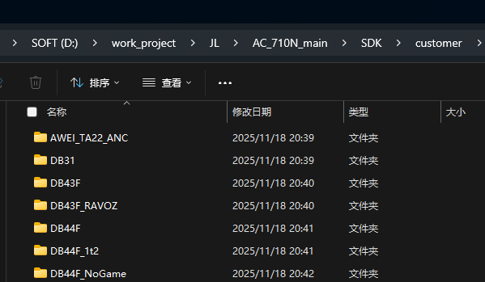
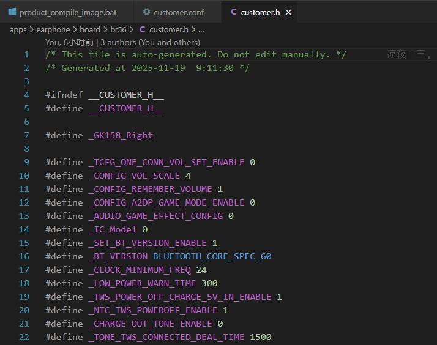
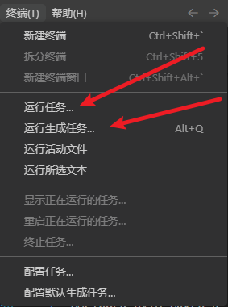
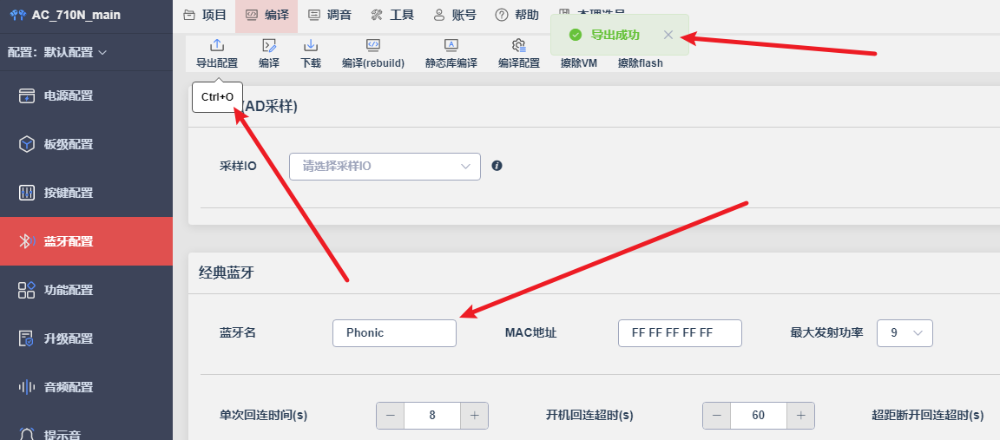
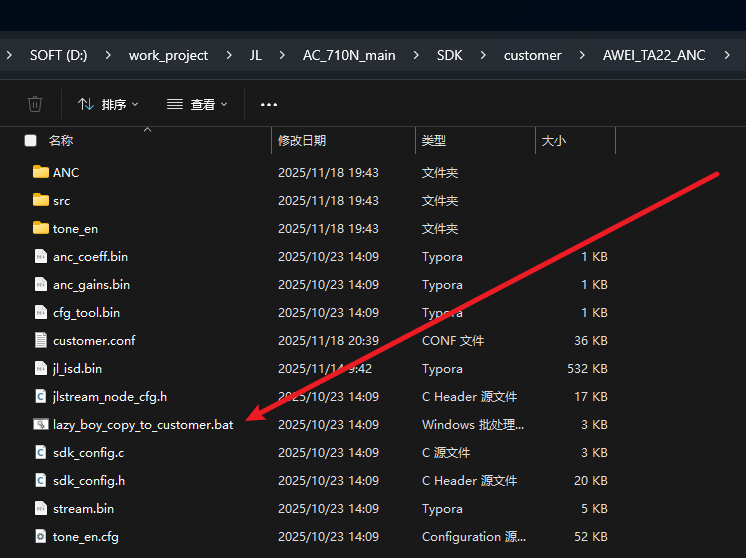
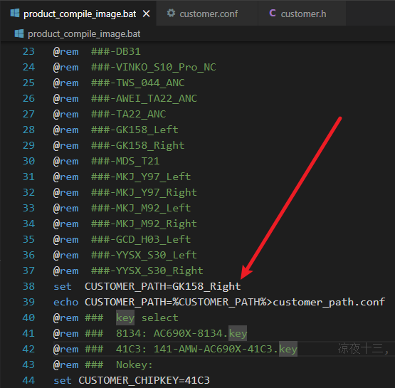

# 工程项目说明

## 客户文件夹

### 命名方式

- 一般以客户名称首字母缩写+蓝牙名称+左右
- 后续基于此项目的衍生项目命名没有要求，一般遵循上述要求
  - 如果不修改配对名还要另存的话，可自行拖出副本添加字符区别

### 客户文件夹中的配置文件conf

编译后conf配置会被转换为对应的宏名与宏体形式，体现在`customer.h`中。

### 提示音

- 客户的提示音在客户文件夹下的tone_en目录中
- 使用可视化工具逐个加载导入即可。

## 工程编译

### 编译起始脚本文件

- 前者为需要编译的客户（**必须与客户文件夹名称保持一致**）
- 后者是选择key类型

### 编译方式

- 可以选择前者的，具体可以选择make all 或者make clean
- 后者指定运行make all进行编译

#### 注意事项

**不建议使用可视化工具编译**，因为改过makefile的编译规则，使用可视化工具编译可能会出现配置出现错乱影响项目。可视化工具的编译只是编译目前工程中的配置而已，不是从客户文件夹中开始编译。

### 可视化工具的配置导出

- 通过配对名可以一定程度上知道导出的是那个客户的配置
- 任何可视化工具的修改都需要导出配置才能应用到客户配置文件中

### 导出后使用copy脚本把配置应用到具体客户中

- 每一个客户文件夹下都有copy脚本。

- 双击运行

- 本质上就是把工程中的文件copy到对应客户文件夹下
  - 所以任何可视化工具的修改都需要先导出再利用copy脚本应用到客户文件夹中

## 正常流程

- 先编译一次需要编译的客户项目，保证工程中应用的是对应客户的配置，在进行后续修改。
  - 新建项目修改前，也需要先编译一次。

# 2025-07-22

# 2025-08-12

# 2025-11-19