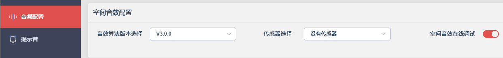

# 打印

## RCSP模块专属的打印格式

`apps\common\third_party_profile\jieli\rcsp\server\rcsp_cmd_user.c`

```c
#if RCSP_MODE

/* #define RCSP_DEBUG_EN */
#ifdef RCSP_DEBUG_EN
#define rcsp_putchar(x)                	putchar(x)
#define rcsp_printf                    	printf
#define rcsp_put_buf(x,len)				put_buf(x,len)
#else
#define rcsp_putchar(...)
#define rcsp_printf(...)
#define rcsp_put_buf(...)
#endif
```


# 开启空间音效

- [本地SDK文档](file:///C:/JLStudio/standard/TWS%E8%80%B3%E6%9C%BA/AC701N/3.0.0/docs/html/SDK/audio_effects/SpatialEffect.html)

## 开空间音效和打印出现错误

```c
SPI nor flash online.
Online flash id: 856015
Online flash size: 2M
Erase Flash Size is 4096
错误：ANCIF的地址分配过小，请修改。
```

- Flash容量改成16M

## 没有效果，切换函数直接中途返回了

```c
/*空间音频模式切换
 * 0 ：关闭
 * 1 ：固定模式
 * 2 ：跟踪模式*/
void audio_spatial_effects_mode_switch(enum SPATIAL_EFX_MODE mode)
{
    aud_effect_t *effect = (aud_effect_t *)aud_effect;
    /*没有跑节点，不允许切模式*/
    if (spatial_effect_node_is_running() == 0) {
        printf("spatial_effect_node_is_running : %d", spatial_effect_node_is_running());
        return ;
    }
```

- **要在播放歌曲状态下才行。**

## 由APP下发指令开启空间音效

## 在线调试空间音效

- 打开在线调音




这个参数的两个极端可以立马分辨出是否有效!

```c
static struct spatial_effect_global_param g_param = {
    .spatial_audio_mode = SPATIAL_EFX_OFF,//空间音效初始化状态
    .spatial_audio_fade_finish = SPATIAL_EFX_FIXED,//是否完成淡入淡出的标志
    .breaker_timer = 0,  //关闭音效后数据流插入断点定时器
    .switch_timer = 0,   //恢复断点后打开空间音效定时器
};
```

- `spatial_audio_mode`这里默认选OFF，先放歌曲节点跑起来。然后切换空间音效，再进行在线调试空间音效即可。
  - 公版默认直接开起来，所以直接在线调试空间音效。

# ANC

## ANC的多场景切换

