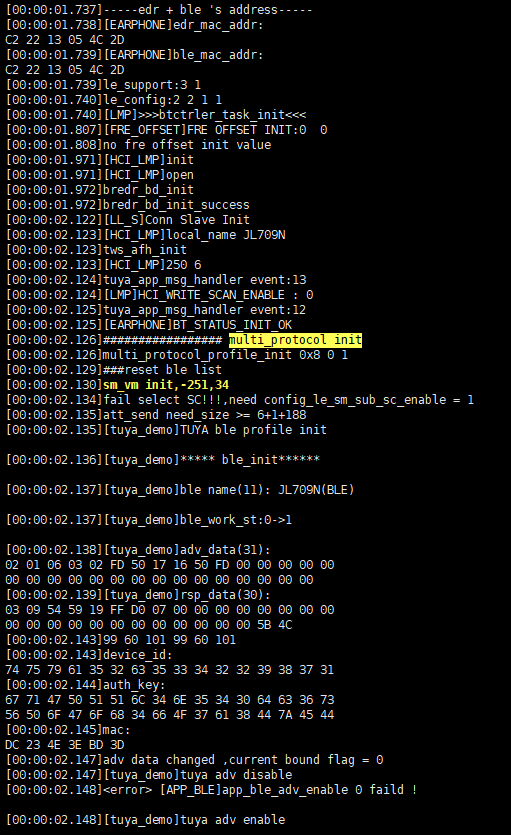

# 打开涂鸦

除了打开BLE以及第三方协议中的涂鸦协议，没有添加pid,vid也会弹窗提示。有一个基本的界面。需要登录涂鸦管理平台去新建一个pid,vid。APP的操作界面不知道是不是也可以直接在这里直接配置。跟插件模块类似的？

`apps\common\third_party_profile\tuya_protocol\app\demo\tuya_ble_app_demo.h`

```c
#define APP_PRODUCT_ID          "tmodylku"

#define APP_BUILD_FIRMNAME      "tuya_ble_sdk_app_demo_nrf52832"

//固件版本
#define TY_APP_VER_NUM       0x0100
#define TY_APP_VER_STR	     "1.0"

//硬件版本
#define TY_HARD_VER_NUM      0x0100
#define TY_HARD_VER_STR	     "1.0"
```

- 通过这一个ID呈现不同的界面与功能。是区分其他设置的核心标识。

# 主图以及产品图分辨率要求

1、产品图要求:800*800px；最多可以上传6张

2、主图要求：尺寸要求：1011px*840px, 格式要求：png,jpeg,jpg

# 编译器版本要求

调试涂鸦不能使用2.4.9以及以后版本编译器，否则涂鸦app出现无法搜到ble情况

# 确实是否有BLE

## 使用工具看能否搜索到BLE

- 根据地址


## 看日志是否有对应初始化


- 如果没有但是开了BLE和第三方协议的话，往上追溯看看那里调用卡住了。

正常流程：



# 涂鸦指令接收后执行流程（公版）

## 发送停止歌曲指令

### 日志

```c
[00:02:19.893][tuya_demo]write_callback, handle= 0x0006,size = 52 
[00:02:19.908]tuya_app_cb_handler, evt:0x43, task:app_core
[00:02:19.909]tuya_data_parse, p_data:0x105094, len:5
07 01 00 01 00 
[00:02:19.912]<--------------  tuya_data_parse  -------------->
[00:02:19.912]get_sn = 1, id = 7, type = 1, data_len = 1, data:
00 
[00:02:19.913]tuya play state:0
[00:02:19.929]avctp_passthrough_rsp:46
[00:02:19.948]avctp_passthrough_rsp:c6
p
[00:02:20.019][tuya_demo]write_callback, handle= 0x0006,size = 52 
[00:02:20.025]tuya_app_cb_handler, evt:0x51, task:app_core
[00:02:20.026]TUYA_BLE_CB_EVT_DP_DATA_SEND_RESPONSE, sn:10, type:0x0, mode:0x0, ack:0x0, status:0x0
[00:02:20.112][EARPHONE]BT_STATUS_AVRCP_INCOME_OPID:70
[00:02:20.113]dual_conn_btstack_event_handler:40
[00:02:20.115][EARPHONE] BT STATUS DEFAULT
[00:02:20.117]ui_bt_stack_msg_handler:40

[00:02:20.118]tuya_bt_status_event_handler event:0x28
ppppppppppppppppppppppppp
[00:02:23.159]Received AVDTP_SUSPEND
[00:02:23.160]sbc_codec_stop=142

[00:02:23.161][EARPHONE] BT STATUS DEFAULT
[00:02:23.163]dual_conn_btstack_event_handler:57
[00:02:23.163][EARPHONE] BT STATUS DEFAULT
[00:02:23.164]ui_bt_stack_msg_handler:57

[00:02:23.164]tuya_bt_status_event_handler event:0x39
[00:02:23.165][EARPHONE] BT STATUS DEFAULT
[00:02:23.166]BT_STATUS_A2DP_MEDIA_STOP

67 F8 58 B3 CC A4 
[00:02:23.167]tws_a2dp_player_close
```

## 发送打开歌曲指令

### 日志

```c
[00:03:48.792][tuya_demo]write_callback, handle= 0x0006,size = 52 
[00:03:48.799]tuya_app_cb_handler, evt:0x43, task:app_core
[00:03:48.799]tuya_data_parse, p_data:0x105094, len:5
07 01 00 01 01 
[00:03:48.801]<--------------  tuya_data_parse  -------------->
[00:03:48.802]get_sn = 2, id = 7, type = 1, data_len = 1, data:
01 
[00:03:48.803]tuya play state:1
[00:03:48.804][LMP]HCI_EXIT_SNIFF_MODE
[00:03:48.804][LMP]tx_unsniff_req: 0x41e010
[00:03:48.805][BDMGR]sort_1_edr
edr 96 10 16 (48 1)
qps 192 8 0
ide 1000
**p*S<>w
[00:03:48.852][tuya_demo]write_callback, handle= 0x0006,size = 52 
[00:03:48.855]tuya_app_cb_handler, evt:0x51, task:app_core
[00:03:48.856]TUYA_BLE_CB_EVT_DP_DATA_SEND_RESPONSE, sn:11, type:0x0, mode:0x0, ack:0x0, status:0x0S<>w**S<>wS<>wp*S<>wS<>wp*S<>wS<>wp*
[00:03:49.190]avctp_passthrough_rsp:44
[00:03:49.193]link_conn_exit_sniff
[00:03:49.193][BDMGR]sort_1_edr
edr 100 (48 0)
qps 34
[00:03:49.199][EARPHONE] BT STATUS DEFAULT
[00:03:49.201]avctp_passthrough_rsp:c4
[00:03:49.202][SNIFF] BT_STATUS_SNIFF_STATE_UPDATE 0
[00:03:49.203][SNIFF]check_sniff_enable
[00:03:49.204]dual_conn_btstack_event_handler:32
[00:03:49.205][EARPHONE] BT STATUS DEFAULT
[00:03:49.206]ui_bt_stack_msg_handler:32
[00:03:49.207][LED_UI]MSG_FROM_BT_STACK----ui_bt_stack_msg_handler----BT_STATUS_SNIFF_STATE_UPDATE
[00:03:49.208]tuya_bt_status_event_handler event:0x20

[00:03:49.209]tuya_app_msg_handler event:0x13
ppp
[00:03:49.427]info_hash err: c38b, c87
[00:03:49.459][EARPHONE]BT_STATUS_AVRCP_INCOME_OPID:68
[00:03:49.461]dual_conn_btstack_event_handler:40
[00:03:49.462][EARPHONE] BT STATUS DEFAULT
[00:03:49.462]ui_bt_stack_msg_handler:40

[00:03:49.463]tuya_bt_status_event_handler event:0x28
p
[00:03:49.549]Received AVDTP_START
[00:03:49.551][EARPHONE] BT STATUS DEFAULT
[00:03:49.551]dual_conn_btstack_event_handler:56
[00:03:49.552][EARPHONE] BT STATUS DEFAULT
[00:03:49.553]ui_bt_stack_msg_handler:56

[00:03:49.554]tuya_bt_status_event_handler event:0x38
p
[00:03:49.597]info_hash err: c38b, c87
[00:03:49.604]info_hash err: c38b, c87
[00:03:49.612]info_hash err: c38b, c87
[00:03:49.648]sbc_codec_init =0,142,2
[00:03:49.648][LMP]--------set_a2dp_type: 2
[00:03:49.649][BDMGR]sort_1_edr
edr 200 (48 2)
qps 200 24 0
[00:03:49.651][LMP]open_sbc_channel: 48, 322, 2, 2034
[00:03:49.652][EARPHONE] BT STATUS DEFAULT
[00:03:49.653]BT_STATUS_A2DP_MEDIA_START

67 F8 58 B3 CC A4 
[00:03:49.654]dac_try_power_on_thread_handler

[00:03:49.655][DAC]__audio_dac_try_power_on
[00:03:49.656]>>>>>>>>>>>>>>>>>> channel: 1
[00:03:49.660]a2dp aac capacity:
[00:03:49.660]bitrate:131072
[00:03:49.661]nchannels:1
[00:03:49.661]samplerate:44100
[00:03:49.673]>> audio_common_power_open cur_status:0
p
[00:03:49.798]app_msg_bt_a2dp_play

67 F8 58 B3 CC A4 
```

## 下一曲

### 日志

```c
[00:05:41.764][tuya_demo]write_callback, handle= 0x0006,size = 52 
[00:05:41.779]tuya_app_cb_handler, evt:0x43, task:app_core
[00:05:41.780]tuya_data_parse, p_data:0x105094, len:5
06 04 00 01 01 
[00:05:41.782]<--------------  tuya_data_parse  -------------->
[00:05:41.783]get_sn = 3, id = 6, type = 4, data_len = 1, data:
01 
[00:05:41.784]tuya change_control: 1
[00:05:41.807]avctp_passthrough_rsp:4b
[00:05:41.822]avctp_passthrough_rsp:cb
[00:05:41.828][tuya_demo]write_callback, handle= 0x0006,size = 52 
[00:05:41.832]tuya_app_cb_handler, evt:0x51, task:app_core
[00:05:41.833]TUYA_BLE_CB_EVT_DP_DATA_SEND_RESPONSE, sn:13, type:0x0, mode:0x0, ack:0x0, status:0x0pppppp
[00:05:42.563][EARPHONE]BT_STATUS_AVRCP_INCOME_OPID:70
[00:05:42.564]dual_conn_btstack_event_handler:40
[00:05:42.566][EARPHONE] BT STATUS DEFAULT
[00:05:42.568]ui_bt_stack_msg_handler:40

[00:05:42.569]tuya_bt_status_event_handler event:0x28
p
[00:05:42.662][EARPHONE]BT_STATUS_AVRCP_INCOME_OPID:68
[00:05:42.664]dual_conn_btstack_event_handler:40
[00:05:42.665][EARPHONE] BT STATUS DEFAULT
[00:05:42.666]ui_bt_stack_msg_handler:40
[00:05:42.667]tuya_bt_status_event_handler event:0x28
```

## 上一曲

### 日志

```c
[00:06:33.306][tuya_demo]write_callback, handle= 0x0006,size = 52 
[00:06:33.311]tuya_app_cb_handler, evt:0x43, task:app_core
[00:06:33.312]tuya_data_parse, p_data:0x105094, len:5
06 04 00 01 00 
[00:06:33.319]<--------------  tuya_data_parse  -------------->
[00:06:33.320]get_sn = 5, id = 6, type = 4, data_len = 1, data:
00 
[00:06:33.321]tuya change_control: 0
[00:06:33.346]avctp_passthrough_rsp:4c
p
[00:06:33.370][tuya_demo]write_callback, handle= 0x0006,size = 52 
[00:06:33.376]avctp_passthrough_rsp:cc
[00:06:33.379]tuya_app_cb_handler, evt:0x51, task:app_core
[00:06:33.380]TUYA_BLE_CB_EVT_DP_DATA_SEND_RESPONSE, sn:13, type:0x0, mode:0x0, ack:0x0, status:0x0ppppppp
```

## 加减音量

### 日志

```c
[00:07:13.838][tuya_demo]write_callback, handle= 0x0006,size = 52 
[00:07:13.848]tuya_app_cb_handler, evt:0x43, task:app_core
p
[00:07:13.849]tuya_data_parse, p_data:0x105094, len:8
05 02 00 04 00 00 00 29 
[00:07:13.850]<--------------  tuya_data_parse  -------------->
[00:07:13.851]get_sn = 7, id = 5, type = 2, data_len = 4, data:
00 00 00 29 
[00:07:13.852]tuya voice set to :41
[00:07:13.853]phone_vol:41,dac_vol:5
[00:07:13.863]set_vol[music]:music=6
[00:07:13.867][fade]state:music,max_volume:16,cur:6,6
[00:07:13.870]set_vol[music]:=6
[00:07:13.872][SW_DVOL]Gain:6,AVOL:3,DVOL:16384
[00:07:13.884]vol_dB :6, -30
[00:07:13.885]vol_2_gain: 6, 16, 518
[00:07:13.931][tuya_demo]write_callback, handle= 0x0006,size = 52 
[00:07:13.936]tuya_app_cb_handler, evt:0x51, task:app_core
[00:07:13.938]TUYA_BLE_CB_EVT_DP_DATA_SEND_RESPONSE, sn:13, type:0x0, mode:0x0, ack:0x0, status:0x0pp#pppppppppppppppppppppppppppppppppppppp
[00:07:18.863][APP_AUDIO]VOL_SAVE 6
```

## 按键设置

### 定义单击左右

日志

- 左边

```c
[00:09:26.381][tuya_demo]write_callback, handle= 0x0006,size = 52 
[00:09:26.391]tuya_app_cb_handler, evt:0x43, task:app_core
[00:09:26.392]tuya_data_parse, p_data:0x105094, len:5
13 04 00 01 04 
[00:09:26.393]<--------------  tuya_data_parse  -------------->
[00:09:26.393]get_sn = c, id = 19, type = 4, data_len = 1, data:
04 
[00:09:26.394]覆盖数组左边短按位置----tuya_key_event_swith(data[0]):4----dp_id:19
[00:09:26.396]tuya_key_event_swith----event:4----ret:98
[00:09:26.408]tuya syscfg_write error = 12, please check
[00:09:26.473][tuya_demo]write_callback, handle= 0x0006,size = 52 p
[00:09:26.479]tuya_app_cb_handler, evt:0x51, task:app_core
[00:09:26.481]TUYA_BLE_CB_EVT_DP_DATA_SEND_RESPONSE, sn:13, type:0x0, mode:0x0, ack:0x0, status:0x0ppp
```

- 右边

```c
[00:10:18.010][tuya_demo]write_callback, handle= 0x0006,size = 52 
[00:10:18.015]tuya_app_cb_handler, evt:0x43, task:app_core
[00:10:18.022]tuya_data_parse, p_data:0x105094, len:5
14 04 00 01 05 
[00:10:18.023]<--------------  tuya_data_parse  -------------->
[00:10:18.025]get_sn = d, id = 20, type = 4, data_len = 1, data:
05 
[00:10:18.028]覆盖数组右边短按位置----tuya_key_event_swith(data[0]):5----dp_id:20
[00:10:18.029]tuya_key_event_swith----event:5----ret:41
[00:10:18.042]tuya syscfg_write error = 12, please check
[00:10:18.101][tuya_demo]write_callback, handle= 0x0006,size = 52 p
[00:10:18.104]tuya_app_cb_handler, evt:0x51, task:app_core
[00:10:18.105]TUYA_BLE_CB_EVT_DP_DATA_SEND_RESPONSE, sn:13, type:0x0, mode:0x0, ack:0x0, status:0x0pppp#pppp
```

### 定义双击左右

- 左

```c
[00:11:30.131][tuya_demo]write_callback, handle= 0x0006,size = 52 
[00:11:30.137]tuya_app_cb_handler, evt:0x43, task:app_core
[00:11:30.144]tuya_data_parse, p_data:0x105094, len:5
15 04 00 01 02 
[00:11:30.145]<--------------  tuya_data_parse  -------------->
[00:11:30.146]get_sn = e, id = 21, type = 4, data_len = 1, data:
02 
[00:11:30.149]覆盖数组左边hold位置----tuya_key_event_swith(data[0]):2----dp_id:21
[00:11:30.150]tuya_key_event_swith----event:2----ret:100
[00:11:30.164]tuya syscfg_write error = 12, please check
[00:11:30.221][tuya_demo]write_callback, handle= 0x0006,size = 52 
[00:11:30.225]tuya_app_cb_handler, evt:0x51, task:app_core
[00:11:30.226]TUYA_BLE_CB_EVT_DP_DATA_SEND_RESPONSE, sn:13, type:0x0, mode:0x0, ack:0x0, status:0x0ppp
```

- 右边

```c
[00:12:26.442][tuya_demo]write_callback, handle= 0x0006,size = 52 
[00:12:26.448]tuya_app_cb_handler, evt:0x43, task:app_core
[00:12:26.449]tuya_data_parse, p_data:0x105094, len:5
16 04 00 01 06 
[00:12:26.450]<--------------  tuya_data_parse  -------------->
[00:12:26.458]get_sn = 1, id = 22, type = 4, data_len = 1, data:
06 
[00:12:26.459]覆盖数组右边hold位置----tuya_key_event_swith(data[0]):6----dp_id:22
[00:12:26.461]tuya_key_event_swith----event:6----ret:41
[00:12:26.469]tuya syscfg_write error = 12, please check
p
[00:12:26.535][tuya_demo]write_callback, handle= 0x0006,size = 52 
[00:12:26.539]tuya_app_cb_handler, evt:0x51, task:app_core
[00:12:26.540]TUYA_BLE_CB_EVT_DP_DATA_SEND_RESPONSE, sn:13, type:0x0, mode:0x0, ack:0x0, status:0x0pp
```

### 定义三击左右

- 左边

```c
[00:13:47.263][tuya_demo]write_callback, handle= 0x0006,size = 52 
[00:13:47.275]tuya_app_cb_handler, evt:0x43, task:app_core
[00:13:47.278]tuya_data_parse, p_data:0x105094, len:5
17 04 00 01 05 
[00:13:47.279]<--------------  tuya_data_parse  -------------->
[00:13:47.280]get_sn = 2, id = 23, type = 4, data_len = 1, data:
05 
[00:13:47.282]覆盖数组左边双击位置----tuya_key_event_swith(data[0]):5----dp_id:23
[00:13:47.283]tuya_key_event_swith----event:5----ret:41
[00:13:47.284]tuya syscfg_write error = 12, please check
[00:13:47.326][tuya_demo]write_callback, handle= 0x0006,size = 52 
[00:13:47.330]tuya_app_cb_handler, evt:0x51, task:app_core
[00:13:47.331]TUYA_BLE_CB_EVT_DP_DATA_SEND_RESPONSE, sn:13, type:0x0, mode:0x0, ack:0x0, status:0x0ppp
```

- 右边

```c
[00:14:11.235][tuya_demo]write_callback, handle= 0x0006,size = 52 
[00:14:11.245]tuya_app_cb_handler, evt:0x43, task:app_core
[00:14:11.256]tuya_data_parse, p_data:0x105094, len:5
18 04 00 01 04 
[00:14:11.257]<--------------  tuya_data_parse  -------------->
[00:14:11.257]get_sn = 3, id = 24, type = 4, data_len = 1, data:
04 
[00:14:11.259]覆盖数组右边双击位置----tuya_key_event_swith(data[0]):4----dp_id:24
[00:14:11.263]tuya_key_event_swith----event:4----ret:98
[00:14:11.266]tuya syscfg_write error = 12, please check
[00:14:11.327][tuya_demo]write_callback, handle= 0x0006,size = 52 
[00:14:11.333]tuya_app_cb_handler, evt:0x51, task:app_core
[00:14:11.334]TUYA_BLE_CB_EVT_DP_DATA_SEND_RESPONSE, sn:13, type:0x0, mode:0x0, ack:0x0, status:0x0ppp
```

### 定义长按左右

- 左

```c
[00:14:59.240][tuya_demo]write_callback, handle= 0x0006,size = 52 
[00:14:59.258]tuya_app_cb_handler, evt:0x43, task:app_core
[00:14:59.260]tuya_data_parse, p_data:0x105094, len:5
65 04 00 01 03 
[00:14:59.261]<--------------  tuya_data_parse  -------------->
[00:14:59.262]get_sn = 4, id = 101, type = 4, data_len = 1, data:
03 
[00:14:59.264]unknow control msg len = 1
, data:
[00:14:59.325][tuya_demo]write_callback, handle= 0x0006,size = 52 
[00:14:59.336]tuya_app_cb_handler, evt:0x51, task:app_core
[00:14:59.339]TUYA_BLE_CB_EVT_DP_DATA_SEND_RESPONSE, sn:13, type:0x0, mode:0x0, ack:0x0, status:0x0pppp
```

- 右

```c
[00:15:57.766][tuya_demo]write_callback, handle= 0x0006,size = 52 
[00:15:57.778]tuya_app_cb_handler, evt:0x43, task:app_core
[00:15:57.779]tuya_data_parse, p_data:0x105094, len:5
66 04 00 01 03 
[00:15:57.782]<--------------  tuya_data_parse  -------------->
[00:15:57.783]get_sn = 5, id = 102, type = 4, data_len = 1, data:
03 
[00:15:57.784]unknow control msg len = 1
, data:
[00:15:57.828][tuya_demo]write_callback, handle= 0x0006,size = 52 
[00:15:57.832]tuya_app_cb_handler, evt:0x51, task:app_core
[00:15:57.833]TUYA_BLE_CB_EVT_DP_DATA_SEND_RESPONSE, sn:13, type:0x0, mode:0x0, ack:0x0, status:0x0pp
```

### 定义四击左右

- 左

```c
[00:16:39.469][tuya_demo]write_callback, handle= 0x0006,size = 52 
[00:16:39.479]tuya_app_cb_handler, evt:0x43, task:app_core
[00:16:39.480]tuya_data_parse, p_data:0x105094, len:5
67 04 00 01 04 
[00:16:39.481]<--------------  tuya_data_parse  -------------->
[00:16:39.482]get_sn = 6, id = 103, type = 4, data_len = 1, data:
04 
[00:16:39.483]unknow control msg len = 1
, data:p
[00:16:39.527][tuya_demo]write_callback, handle= 0x0006,size = 52 
[00:16:39.530]tuya_app_cb_handler, evt:0x51, task:app_core
[00:16:39.531]TUYA_BLE_CB_EVT_DP_DATA_SEND_RESPONSE, sn:13, type:0x0, mode:0x0, ack:0x0, status:0x0pppppp
```

- 右边

```c
[00:17:17.897][tuya_demo]write_callback, handle= 0x0006,size = 52 
[00:17:17.908]tuya_app_cb_handler, evt:0x43, task:app_core
[00:17:17.912][LINK]pwr_set=0,4,4,255,9
[00:17:17.913]tuya_data_parse, p_data:0x105094, len:5
68 04 00 01 07 
[00:17:17.914]<--------------  tuya_data_parse  -------------->
[00:17:17.915]get_sn = 7, id = 104, type = 4, data_len = 1, data:
07 
[00:17:17.917]unknow control msg len = 1
, data:
[00:17:17.959][tuya_demo]write_callback, handle= 0x0006,size = 52 
[00:17:17.964]tuya_app_cb_handler, evt:0x51, task:app_core
[00:17:17.965]TUYA_BLE_CB_EVT_DP_DATA_SEND_RESPONSE, sn:13, type:0x0, mode:0x0, ack:0x0, status:0x0p
```

### 单击设置无功能

```c
[00:18:29.809][tuya_demo]write_callback, handle= 0x0006,size = 52 
[00:18:29.817]tuya_app_cb_handler, evt:0x43, task:app_core
[00:18:29.818]tuya_data_parse, p_data:0x105094, len:5
13 04 00 01 08 
[00:18:29.820]<--------------  tuya_data_parse  -------------->
[00:18:29.821]get_sn = a, id = 19, type = 4, data_len = 1, data:
08 
[00:18:29.828]覆盖数组左边短按位置----tuya_key_event_swith(data[0]):8----dp_id:19
[00:18:29.834]tuya syscfg_write error = 12, please check
p
[00:18:29.901][tuya_demo]write_callback, handle= 0x0006,size = 52 
[00:18:29.907]tuya_app_cb_handler, evt:0x51, task:app_core
[00:18:29.908]TUYA_BLE_CB_EVT_DP_DATA_SEND_RESPONSE, sn:16, type:0x0, mode:0x0, ack:0x0, status:0x0ppp
```

### 默认缓存数组中的含义

```c
/********************tuya demo api**********************/
u8 key_table_l[KEY_ACTION_MAX] = {
    APP_MSG_NULL,       //短按
    APP_MSG_ANC_SWITCH,    //长按
    APP_MSG_NULL,           //hold
    APP_MSG_NULL,           //长按抬起
    APP_MSG_OPEN_SIRI,     //双击
    APP_MSG_MUSIC_PREV,    //三击
};
u8 key_table_r[KEY_ACTION_MAX] = {
    APP_MSG_NULL,       //短按
    APP_MSG_ANC_SWITCH,    //长按
    APP_MSG_NULL,           //hold
    APP_MSG_NULL,           //长按抬起
    APP_MSG_MUSIC_PP,     //双击
    APP_MSG_MUSIC_NEXT,    //三击
};
```

- `apps\common\third_party_profile\tuya_protocol\app\demo\tuya_ble_app_demo.c`
  - tuya_data_parse函数可以选择修改缓存数组的位置，决定缓存数组不同位置的含义。
  - 不行！涂鸦APP传递指令是可以修改。但是按键触发时是按照宏值对应数组下标映射。擅自修改会打乱！

```c
case 19:
    //左边单击
    printf("覆盖数组左边短按位置----tuya_key_event_swith(data[0]):%d----dp_id:%d\n", data[0],dp_id);
    key_table_l[0] = tuya_key_event_swith(data[0]);//根据传递的指令将按键映射到缓存按键功能值数组中。
    tuya_update_vm_key_info(key_value_record);//记录更新后的左右两边的按键功能值
    value = syscfg_write(TUYA_SYNC_KEY_INFO, key_value_record, sizeof(key_value_record));//将记录的左右两边的按键功能值存入VM
    tuya_sync_info_send(&key_table_l[0], APP_TWS_TUYA_SYNC_KEY_L1);//对耳同步缓存按键数组信息
    break;
```

#### 同步的参数怎么传递？

## APP中的按键自定义值

```c
/* 涂鸦app对应功能索引映射到sdk按键枚举 */
u8 tuya_key_event_swith(u8 event)
{
    u8 ret = 0;
    switch (event) {
    case 0:
        ret = APP_MSG_VOL_DOWN;
        printf("tuya_key_event_swith----event:%d----ret:%d\n", event, ret);
        break;
    case 1:
        ret = APP_MSG_VOL_UP;
        printf("tuya_key_event_swith----event:%d----ret:%d\n", event, ret);
        break;
    case 2:
        ret = APP_MSG_MUSIC_NEXT;
        printf("tuya_key_event_swith----event:%d----ret:%d\n", event, ret);
        break;
    case 3:
        ret = APP_MSG_MUSIC_PREV;
        printf("tuya_key_event_swith----event:%d----ret:%d\n", event, ret);
        break;
    case 4:
        ret = APP_MSG_MUSIC_PP;
        printf("tuya_key_event_swith----event:%d----ret:%d\n", event, ret);
        break;
    case 5:
    case 6:
        ret = APP_MSG_OPEN_SIRI;
        printf("tuya_key_event_swith----event:%d----ret:%d\n", event, ret);
        break;
    }
    return ret;
}
```

- APP中是什么功能，这里写对应的映射处理消息即可。顺序从0开始。

重写

```c
/* 涂鸦app对应功能索引映射到sdk按键枚举 */
u8 tuya_key_event_swith(u8 event)
{
    u8 ret = 0;
    switch (event) {
    case 0:
        ret = APP_MSG_VOL_DOWN;
        printf("tuya_key_event_swith----event:%d----ret:%d\n", event, ret);
        break;
    case 1:
        ret = APP_MSG_VOL_UP;
        printf("tuya_key_event_swith----event:%d----ret:%d\n", event, ret);
        break;
    case 2:
        ret = APP_MSG_MUSIC_NEXT;
        printf("tuya_key_event_swith----event:%d----ret:%d\n", event, ret);
        break;
    case 3:
        ret = APP_MSG_MUSIC_PREV;
        printf("tuya_key_event_swith----event:%d----ret:%d\n", event, ret);
        break;
    case 4:
        ret = APP_MSG_MUSIC_PP;
        printf("tuya_key_event_swith----event:%d----ret:%d\n", event, ret);
        break;
    case 5:
        ret = APP_MSG_OPEN_SIRI;
        printf("tuya_key_event_swith----event:%d----ret:%d\n", event, ret);
        break;
    case 6:
        ret = APP_MSG_LOW_LANTECY;
        printf("tuya_key_event_swith----event:%d----ret:%d\n", event, ret);
        break;
    case 7:
        ret = APP_MSG_ANC_TRANS;
        printf("tuya_key_event_swith----event:%d----ret:%d\n", event, ret);
        break;
    default:
        ret = APP_MSG_NULL;
        printf("tuya_key_event_swith----event:%d----ret:%d\n", event, ret);
        break;
    }
    return ret;
}
```

# 耳机按键触发流程

```c
/*****************tuya demo api*******************/

APP_MSG_HANDLER(tuya_bthci_msg_entry) = {
    .owner      = 0xff,
    .from       = MSG_FROM_BT_HCI,
    .handler    = tuya_hci_event_handler,
};

APP_MSG_HANDLER(tuya_btstack_msg_entry) = {
    .owner      = 0xff,
    .from       = MSG_FROM_BT_STACK,
    .handler    = tuya_bt_status_event_handler,
};

APP_MSG_HANDLER(tuya_tws_msg_entry) = {
    .owner      = 0xff,
    .from       = MSG_FROM_TWS,
    .handler    = tuya_bt_tws_event_handler,
};

APP_MSG_HANDLER(tuya_ota_msg_entry) = {
    .owner      = 0xff,
    .from       = MSG_FROM_OTA,
    .handler    = tuya_ota_event_handler,
};

APP_MSG_PROB_HANDLER(tuya_app_msg_entry) = {
    .owner      = 0xff,
    .from       = MSG_FROM_APP,
    .handler    = tuya_app_msg_handler,
};

APP_MSG_PROB_HANDLER(tuya_key_msg_entry) = {
    .owner      = 0xff,
    .from       = MSG_FROM_KEY,
    .handler    = tuya_key_msg_handler,
};

//按键消息直接进入这里进行APP层处理映射
int tuya_key_msg_handler(int *msg)
{
    g_printf("tuya_key_msg_handler----msg[0]:0x%x\n", msg[0]);
    int key_msg = 0;
    tuya_earphone_key_remap(&key_msg, msg);//这里的msg已经是触摸按键事件类型了。
    printf("KEY消息映射成对应APP_MSG_XX:%d\n", key_msg);
#if 0//TCFG_USER_TWS_ENABLE
    bt_tws_key_msg_sync(key_msg);
#else
    app_send_message(key_msg, 0);
#endif
    return true;  //中断消息分发
}

//映射成具体的APP_MSG_XX
void tuya_earphone_key_remap(int *value, int *msg)
{
    struct key_event *key = (struct key_event *)msg;
    //int index = key->event;//这个一直是0，不能用作映射了,直接根据按键事件类型的宏值来映射
    int index = (int)msg[0];
    g_printf("key_remap----key->event:%d----按键事件:%d----消息是否来自对耳:%d,----对耳消息宏值:%d\n", index, msg[0], msg[1], APP_KEY_MSG_FROM_TWS);
#if TCFG_USER_TWS_ENABLE
    if (get_bt_tws_connect_status()) {
        if (tws_api_get_local_channel() == 'R') {
            if (msg[1] == APP_KEY_MSG_FROM_TWS) {
                *value = key_table_l[index];
            } else {
                *value = key_table_r[index];
            }
        } else {
            if (msg[1] == APP_KEY_MSG_FROM_TWS) {
                *value = key_table_r[index];
            } else {
                *value = key_table_l[index];
            }
        }
    } else
#endif
    {
        *value = key_table_l[index];
    }
}
```

## 单击

- 不开启TWS时，还是走默认的APP层消息处理。`tuya_app_msg_handler`还是会调用这个函数。

```c
int tuya_key_msg_handler(int *msg)
{
    g_printf("tuya_key_msg_handler----msg[0]:0x%x\n", msg[0]);
    int key_msg = 0;
    tuya_earphone_key_remap(&key_msg, msg);//这里的msg已经是触摸按键事件类型了。
    printf("KEY消息映射成对应APP_MSG_XX:%d\n", key_msg);
#if 0//TCFG_USER_TWS_ENABLE
    bt_tws_key_msg_sync(key_msg);
#else
    app_send_message(key_msg, 0);
#endif
    return true;  //中断消息分发
}
[00:01:32.127]tuya_key_msg_handler----msg[0]:0x0
[00:01:32.128]key_remap----按键事件:0x0----消息类型:0x0----消息是否来自对耳:0x0,----对耳消息宏值:0x1
[00:01:32.130]KEY消息映射成对应APP_MSG_XX:98
[00:01:32.130]KEY消息映射成对应APP_MSG_XX并发送到MSG_FROM_APP
[00:01:32.132]tuya_app_msg_handler event:0x62
[00:01:32.132]TUYA_MUSIC_PP
[00:01:32.133]APP_MSG_MUSIC_PP
```

- 开启TWS时

```c
int tuya_key_msg_handler(int *msg)
{
    g_printf("tuya_key_msg_handler----msg[0]:0x%x\n", msg[0]);
    int key_msg = 0;
    tuya_earphone_key_remap(&key_msg, msg);//这里的msg已经是触摸按键事件类型了。
    printf("KEY消息映射成对应APP_MSG_XX:%d\n", key_msg);
#if TCFG_USER_TWS_ENABLE
    bt_tws_key_msg_sync(key_msg);
#else
    app_send_message(key_msg, 0);
#endif
    return true;  //中断消息分发
}
```

