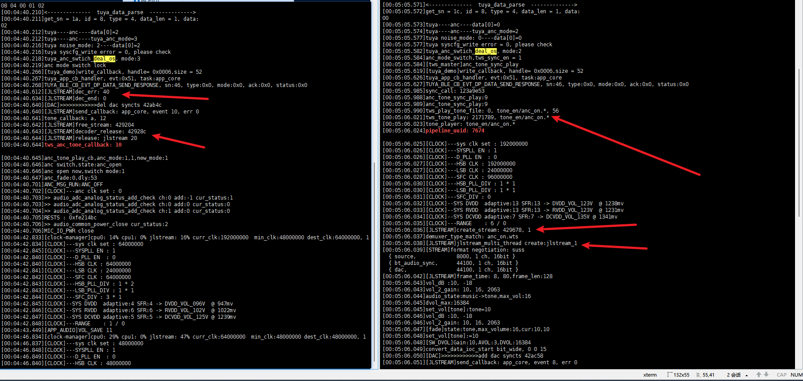
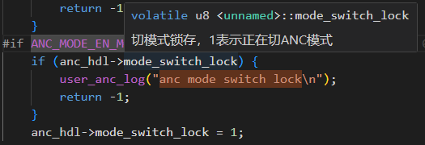

# 打开涂鸦

除了打开BLE以及第三方协议中的涂鸦协议，没有添加pid,vid也会弹窗提示。有一个基本的界面。需要登录涂鸦管理平台去新建一个pid,vid。APP的操作界面不知道是不是也可以直接在这里直接配置。跟插件模块类似的？

`apps\common\third_party_profile\tuya_protocol\app\demo\tuya_ble_app_demo.h`

```c
#define APP_PRODUCT_ID          "tmodylku"

#define APP_BUILD_FIRMNAME      "tuya_ble_sdk_app_demo_nrf52832"

//固件版本
#define TY_APP_VER_NUM       0x0100
#define TY_APP_VER_STR	     "1.0"

//硬件版本
#define TY_HARD_VER_NUM      0x0100
#define TY_HARD_VER_STR	     "1.0"
```

- 通过这一个ID呈现不同的界面与功能。是区分其他设备的核心标识。

# 主图以及产品图分辨率要求

1、产品图要求:800*800px；最多可以上传6张

2、主图要求：尺寸要求：1011px*840px, 格式要求：png,jpeg,jpg

# 编译器版本要求

调试涂鸦不能使用2.4.9以及以后版本编译器，否则涂鸦app出现无法搜到ble情况。

# 确实是否有BLE

## 使用工具看能否搜索到BLE

- 根据地址


## 看日志是否有对应初始化


- 如果没有但是开了BLE和第三方协议的话，往上追溯看看那里调用卡住了。

正常流程：


# 涂鸦恢复出厂设置相关

```c
tuya_ble_device_unbind();//解绑BLE
tuya_ble_device_factory_reset();
local_tuya_key_func_reset();
tuya_key_reset();//用来上报当前数值到app
char eq_info[11] = {0};
syscfg_write(CFG_RCSP_ADV_EQ_DATA_SETTING, eq_info, 11);
u8 name[LOCAL_NAME_LEN];
memset(name, 0x00, sizeof(name));
```

- DPID指令处理还是按键触发的？

- 目前的按键重置只是重置按键而已。

# 涂鸦指令接收后执行流程

## 发送停止歌曲指令

### 日志

```c
[00:02:19.893][tuya_demo]write_callback, handle= 0x0006,size = 52 
[00:02:19.908]tuya_app_cb_handler, evt:0x43, task:app_core
[00:02:19.909]tuya_data_parse, p_data:0x105094, len:5
07 01 00 01 00 
[00:02:19.912]<--------------  tuya_data_parse  -------------->
[00:02:19.912]get_sn = 1, id = 7, type = 1, data_len = 1, data:
00 
[00:02:19.913]tuya play state:0
[00:02:19.929]avctp_passthrough_rsp:46
[00:02:19.948]avctp_passthrough_rsp:c6
p
[00:02:20.019][tuya_demo]write_callback, handle= 0x0006,size = 52 
[00:02:20.025]tuya_app_cb_handler, evt:0x51, task:app_core
[00:02:20.026]TUYA_BLE_CB_EVT_DP_DATA_SEND_RESPONSE, sn:10, type:0x0, mode:0x0, ack:0x0, status:0x0
[00:02:20.112][EARPHONE]BT_STATUS_AVRCP_INCOME_OPID:70
[00:02:20.113]dual_conn_btstack_event_handler:40
[00:02:20.115][EARPHONE] BT STATUS DEFAULT
[00:02:20.117]ui_bt_stack_msg_handler:40

[00:02:20.118]tuya_bt_status_event_handler event:0x28
ppppppppppppppppppppppppp
[00:02:23.159]Received AVDTP_SUSPEND
[00:02:23.160]sbc_codec_stop=142

[00:02:23.161][EARPHONE] BT STATUS DEFAULT
[00:02:23.163]dual_conn_btstack_event_handler:57
[00:02:23.163][EARPHONE] BT STATUS DEFAULT
[00:02:23.164]ui_bt_stack_msg_handler:57

[00:02:23.164]tuya_bt_status_event_handler event:0x39
[00:02:23.165][EARPHONE] BT STATUS DEFAULT
[00:02:23.166]BT_STATUS_A2DP_MEDIA_STOP

67 F8 58 B3 CC A4 
[00:02:23.167]tws_a2dp_player_close
```

## 发送打开歌曲指令

### 日志

```c
[00:03:48.792][tuya_demo]write_callback, handle= 0x0006,size = 52 
[00:03:48.799]tuya_app_cb_handler, evt:0x43, task:app_core
[00:03:48.799]tuya_data_parse, p_data:0x105094, len:5
07 01 00 01 01 
[00:03:48.801]<--------------  tuya_data_parse  -------------->
[00:03:48.802]get_sn = 2, id = 7, type = 1, data_len = 1, data:
01 
[00:03:48.803]tuya play state:1
[00:03:48.804][LMP]HCI_EXIT_SNIFF_MODE
[00:03:48.804][LMP]tx_unsniff_req: 0x41e010
[00:03:48.805][BDMGR]sort_1_edr
edr 96 10 16 (48 1)
qps 192 8 0
ide 1000
**p*S<>w
[00:03:48.852][tuya_demo]write_callback, handle= 0x0006,size = 52 
[00:03:48.855]tuya_app_cb_handler, evt:0x51, task:app_core
[00:03:48.856]TUYA_BLE_CB_EVT_DP_DATA_SEND_RESPONSE, sn:11, type:0x0, mode:0x0, ack:0x0, status:0x0S<>w**S<>wS<>wp*S<>wS<>wp*S<>wS<>wp*
[00:03:49.190]avctp_passthrough_rsp:44
[00:03:49.193]link_conn_exit_sniff
[00:03:49.193][BDMGR]sort_1_edr
edr 100 (48 0)
qps 34
[00:03:49.199][EARPHONE] BT STATUS DEFAULT
[00:03:49.201]avctp_passthrough_rsp:c4
[00:03:49.202][SNIFF] BT_STATUS_SNIFF_STATE_UPDATE 0
[00:03:49.203][SNIFF]check_sniff_enable
[00:03:49.204]dual_conn_btstack_event_handler:32
[00:03:49.205][EARPHONE] BT STATUS DEFAULT
[00:03:49.206]ui_bt_stack_msg_handler:32
[00:03:49.207][LED_UI]MSG_FROM_BT_STACK----ui_bt_stack_msg_handler----BT_STATUS_SNIFF_STATE_UPDATE
[00:03:49.208]tuya_bt_status_event_handler event:0x20

[00:03:49.209]tuya_app_msg_handler event:0x13
ppp
[00:03:49.427]info_hash err: c38b, c87
[00:03:49.459][EARPHONE]BT_STATUS_AVRCP_INCOME_OPID:68
[00:03:49.461]dual_conn_btstack_event_handler:40
[00:03:49.462][EARPHONE] BT STATUS DEFAULT
[00:03:49.462]ui_bt_stack_msg_handler:40

[00:03:49.463]tuya_bt_status_event_handler event:0x28
p
[00:03:49.549]Received AVDTP_START
[00:03:49.551][EARPHONE] BT STATUS DEFAULT
[00:03:49.551]dual_conn_btstack_event_handler:56
[00:03:49.552][EARPHONE] BT STATUS DEFAULT
[00:03:49.553]ui_bt_stack_msg_handler:56

[00:03:49.554]tuya_bt_status_event_handler event:0x38
p
[00:03:49.597]info_hash err: c38b, c87
[00:03:49.604]info_hash err: c38b, c87
[00:03:49.612]info_hash err: c38b, c87
[00:03:49.648]sbc_codec_init =0,142,2
[00:03:49.648][LMP]--------set_a2dp_type: 2
[00:03:49.649][BDMGR]sort_1_edr
edr 200 (48 2)
qps 200 24 0
[00:03:49.651][LMP]open_sbc_channel: 48, 322, 2, 2034
[00:03:49.652][EARPHONE] BT STATUS DEFAULT
[00:03:49.653]BT_STATUS_A2DP_MEDIA_START

67 F8 58 B3 CC A4 
[00:03:49.654]dac_try_power_on_thread_handler

[00:03:49.655][DAC]__audio_dac_try_power_on
[00:03:49.656]>>>>>>>>>>>>>>>>>> channel: 1
[00:03:49.660]a2dp aac capacity:
[00:03:49.660]bitrate:131072
[00:03:49.661]nchannels:1
[00:03:49.661]samplerate:44100
[00:03:49.673]>> audio_common_power_open cur_status:0
p
[00:03:49.798]app_msg_bt_a2dp_play

67 F8 58 B3 CC A4 
```

## 下一曲

### 日志

```c
[00:05:41.764][tuya_demo]write_callback, handle= 0x0006,size = 52 
[00:05:41.779]tuya_app_cb_handler, evt:0x43, task:app_core
[00:05:41.780]tuya_data_parse, p_data:0x105094, len:5
06 04 00 01 01 
[00:05:41.782]<--------------  tuya_data_parse  -------------->
[00:05:41.783]get_sn = 3, id = 6, type = 4, data_len = 1, data:
01 
[00:05:41.784]tuya change_control: 1
[00:05:41.807]avctp_passthrough_rsp:4b
[00:05:41.822]avctp_passthrough_rsp:cb
[00:05:41.828][tuya_demo]write_callback, handle= 0x0006,size = 52 
[00:05:41.832]tuya_app_cb_handler, evt:0x51, task:app_core
[00:05:41.833]TUYA_BLE_CB_EVT_DP_DATA_SEND_RESPONSE, sn:13, type:0x0, mode:0x0, ack:0x0, status:0x0pppppp
[00:05:42.563][EARPHONE]BT_STATUS_AVRCP_INCOME_OPID:70
[00:05:42.564]dual_conn_btstack_event_handler:40
[00:05:42.566][EARPHONE] BT STATUS DEFAULT
[00:05:42.568]ui_bt_stack_msg_handler:40

[00:05:42.569]tuya_bt_status_event_handler event:0x28
p
[00:05:42.662][EARPHONE]BT_STATUS_AVRCP_INCOME_OPID:68
[00:05:42.664]dual_conn_btstack_event_handler:40
[00:05:42.665][EARPHONE] BT STATUS DEFAULT
[00:05:42.666]ui_bt_stack_msg_handler:40
[00:05:42.667]tuya_bt_status_event_handler event:0x28
```

## 上一曲

### 日志

```c
[00:06:33.306][tuya_demo]write_callback, handle= 0x0006,size = 52 
[00:06:33.311]tuya_app_cb_handler, evt:0x43, task:app_core
[00:06:33.312]tuya_data_parse, p_data:0x105094, len:5
06 04 00 01 00 
[00:06:33.319]<--------------  tuya_data_parse  -------------->
[00:06:33.320]get_sn = 5, id = 6, type = 4, data_len = 1, data:
00 
[00:06:33.321]tuya change_control: 0
[00:06:33.346]avctp_passthrough_rsp:4c
p
[00:06:33.370][tuya_demo]write_callback, handle= 0x0006,size = 52 
[00:06:33.376]avctp_passthrough_rsp:cc
[00:06:33.379]tuya_app_cb_handler, evt:0x51, task:app_core
[00:06:33.380]TUYA_BLE_CB_EVT_DP_DATA_SEND_RESPONSE, sn:13, type:0x0, mode:0x0, ack:0x0, status:0x0ppppppp
```

## 加减音量

### 日志

```c
[00:07:13.838][tuya_demo]write_callback, handle= 0x0006,size = 52 
[00:07:13.848]tuya_app_cb_handler, evt:0x43, task:app_core
p
[00:07:13.849]tuya_data_parse, p_data:0x105094, len:8
05 02 00 04 00 00 00 29 
[00:07:13.850]<--------------  tuya_data_parse  -------------->
[00:07:13.851]get_sn = 7, id = 5, type = 2, data_len = 4, data:
00 00 00 29 
[00:07:13.852]tuya voice set to :41
[00:07:13.853]phone_vol:41,dac_vol:5
[00:07:13.863]set_vol[music]:music=6
[00:07:13.867][fade]state:music,max_volume:16,cur:6,6
[00:07:13.870]set_vol[music]:=6
[00:07:13.872][SW_DVOL]Gain:6,AVOL:3,DVOL:16384
[00:07:13.884]vol_dB :6, -30
[00:07:13.885]vol_2_gain: 6, 16, 518
[00:07:13.931][tuya_demo]write_callback, handle= 0x0006,size = 52 
[00:07:13.936]tuya_app_cb_handler, evt:0x51, task:app_core
[00:07:13.938]TUYA_BLE_CB_EVT_DP_DATA_SEND_RESPONSE, sn:13, type:0x0, mode:0x0, ack:0x0, status:0x0pp#pppppppppppppppppppppppppppppppppppppp
[00:07:18.863][APP_AUDIO]VOL_SAVE 6
```

## 按键设置

### 定义单击左右

日志

- 左边

```c
[00:09:26.381][tuya_demo]write_callback, handle= 0x0006,size = 52 
[00:09:26.391]tuya_app_cb_handler, evt:0x43, task:app_core
[00:09:26.392]tuya_data_parse, p_data:0x105094, len:5
13 04 00 01 04 
[00:09:26.393]<--------------  tuya_data_parse  -------------->
[00:09:26.393]get_sn = c, id = 19, type = 4, data_len = 1, data:
04 
[00:09:26.394]覆盖数组左边短按位置----tuya_key_event_swith(data[0]):4----dp_id:19
[00:09:26.396]tuya_key_event_swith----event:4----ret:98
[00:09:26.408]tuya syscfg_write error = 12, please check
[00:09:26.473][tuya_demo]write_callback, handle= 0x0006,size = 52 p
[00:09:26.479]tuya_app_cb_handler, evt:0x51, task:app_core
[00:09:26.481]TUYA_BLE_CB_EVT_DP_DATA_SEND_RESPONSE, sn:13, type:0x0, mode:0x0, ack:0x0, status:0x0ppp
```

- 右边

```c
[00:10:18.010][tuya_demo]write_callback, handle= 0x0006,size = 52 
[00:10:18.015]tuya_app_cb_handler, evt:0x43, task:app_core
[00:10:18.022]tuya_data_parse, p_data:0x105094, len:5
14 04 00 01 05 
[00:10:18.023]<--------------  tuya_data_parse  -------------->
[00:10:18.025]get_sn = d, id = 20, type = 4, data_len = 1, data:
05 
[00:10:18.028]覆盖数组右边短按位置----tuya_key_event_swith(data[0]):5----dp_id:20
[00:10:18.029]tuya_key_event_swith----event:5----ret:41
[00:10:18.042]tuya syscfg_write error = 12, please check
[00:10:18.101][tuya_demo]write_callback, handle= 0x0006,size = 52 p
[00:10:18.104]tuya_app_cb_handler, evt:0x51, task:app_core
[00:10:18.105]TUYA_BLE_CB_EVT_DP_DATA_SEND_RESPONSE, sn:13, type:0x0, mode:0x0, ack:0x0, status:0x0pppp#pppp
```

#### 单击设置无功能

```c
[00:18:29.809][tuya_demo]write_callback, handle= 0x0006,size = 52 
[00:18:29.817]tuya_app_cb_handler, evt:0x43, task:app_core
[00:18:29.818]tuya_data_parse, p_data:0x105094, len:5
13 04 00 01 08 
[00:18:29.820]<--------------  tuya_data_parse  -------------->
[00:18:29.821]get_sn = a, id = 19, type = 4, data_len = 1, data:
08 
[00:18:29.828]覆盖数组左边短按位置----tuya_key_event_swith(data[0]):8----dp_id:19
[00:18:29.834]tuya syscfg_write error = 12, please check
p
[00:18:29.901][tuya_demo]write_callback, handle= 0x0006,size = 52 
[00:18:29.907]tuya_app_cb_handler, evt:0x51, task:app_core
[00:18:29.908]TUYA_BLE_CB_EVT_DP_DATA_SEND_RESPONSE, sn:16, type:0x0, mode:0x0, ack:0x0, status:0x0ppp
```

- APP发送过来的DPID是:19
- 附带的按键功能标识为:8
  - 刚好是APP按键设置中按键列表的下标顺序（从0开始）

### 定义双击左右

- 左

```c
[00:11:30.131][tuya_demo]write_callback, handle= 0x0006,size = 52 
[00:11:30.137]tuya_app_cb_handler, evt:0x43, task:app_core
[00:11:30.144]tuya_data_parse, p_data:0x105094, len:5
15 04 00 01 02 
[00:11:30.145]<--------------  tuya_data_parse  -------------->
[00:11:30.146]get_sn = e, id = 21, type = 4, data_len = 1, data:
02 
[00:11:30.149]覆盖数组左边hold位置----tuya_key_event_swith(data[0]):2----dp_id:21
[00:11:30.150]tuya_key_event_swith----event:2----ret:100
[00:11:30.164]tuya syscfg_write error = 12, please check
[00:11:30.221][tuya_demo]write_callback, handle= 0x0006,size = 52 
[00:11:30.225]tuya_app_cb_handler, evt:0x51, task:app_core
[00:11:30.226]TUYA_BLE_CB_EVT_DP_DATA_SEND_RESPONSE, sn:13, type:0x0, mode:0x0, ack:0x0, status:0x0ppp
```

- 右边

```c
[00:12:26.442][tuya_demo]write_callback, handle= 0x0006,size = 52 
[00:12:26.448]tuya_app_cb_handler, evt:0x43, task:app_core
[00:12:26.449]tuya_data_parse, p_data:0x105094, len:5
16 04 00 01 06 
[00:12:26.450]<--------------  tuya_data_parse  -------------->
[00:12:26.458]get_sn = 1, id = 22, type = 4, data_len = 1, data:
06 
[00:12:26.459]覆盖数组右边hold位置----tuya_key_event_swith(data[0]):6----dp_id:22
[00:12:26.461]tuya_key_event_swith----event:6----ret:41
[00:12:26.469]tuya syscfg_write error = 12, please check
p
[00:12:26.535][tuya_demo]write_callback, handle= 0x0006,size = 52 
[00:12:26.539]tuya_app_cb_handler, evt:0x51, task:app_core
[00:12:26.540]TUYA_BLE_CB_EVT_DP_DATA_SEND_RESPONSE, sn:13, type:0x0, mode:0x0, ack:0x0, status:0x0pp
```

### 定义三击左右

- 左边

```c
[00:13:47.263][tuya_demo]write_callback, handle= 0x0006,size = 52 
[00:13:47.275]tuya_app_cb_handler, evt:0x43, task:app_core
[00:13:47.278]tuya_data_parse, p_data:0x105094, len:5
17 04 00 01 05 
[00:13:47.279]<--------------  tuya_data_parse  -------------->
[00:13:47.280]get_sn = 2, id = 23, type = 4, data_len = 1, data:
05 
[00:13:47.282]覆盖数组左边双击位置----tuya_key_event_swith(data[0]):5----dp_id:23
[00:13:47.283]tuya_key_event_swith----event:5----ret:41
[00:13:47.284]tuya syscfg_write error = 12, please check
[00:13:47.326][tuya_demo]write_callback, handle= 0x0006,size = 52 
[00:13:47.330]tuya_app_cb_handler, evt:0x51, task:app_core
[00:13:47.331]TUYA_BLE_CB_EVT_DP_DATA_SEND_RESPONSE, sn:13, type:0x0, mode:0x0, ack:0x0, status:0x0ppp
```

- 右边

```c
[00:14:11.235][tuya_demo]write_callback, handle= 0x0006,size = 52 
[00:14:11.245]tuya_app_cb_handler, evt:0x43, task:app_core
[00:14:11.256]tuya_data_parse, p_data:0x105094, len:5
18 04 00 01 04 
[00:14:11.257]<--------------  tuya_data_parse  -------------->
[00:14:11.257]get_sn = 3, id = 24, type = 4, data_len = 1, data:
04 
[00:14:11.259]覆盖数组右边双击位置----tuya_key_event_swith(data[0]):4----dp_id:24
[00:14:11.263]tuya_key_event_swith----event:4----ret:98
[00:14:11.266]tuya syscfg_write error = 12, please check
[00:14:11.327][tuya_demo]write_callback, handle= 0x0006,size = 52 
[00:14:11.333]tuya_app_cb_handler, evt:0x51, task:app_core
[00:14:11.334]TUYA_BLE_CB_EVT_DP_DATA_SEND_RESPONSE, sn:13, type:0x0, mode:0x0, ack:0x0, status:0x0ppp
```

### 定义长按左右

- 左

```c
[00:14:59.240][tuya_demo]write_callback, handle= 0x0006,size = 52 
[00:14:59.258]tuya_app_cb_handler, evt:0x43, task:app_core
[00:14:59.260]tuya_data_parse, p_data:0x105094, len:5
65 04 00 01 03 
[00:14:59.261]<--------------  tuya_data_parse  -------------->
[00:14:59.262]get_sn = 4, id = 101, type = 4, data_len = 1, data:
03 
[00:14:59.264]unknow control msg len = 1
, data:
[00:14:59.325][tuya_demo]write_callback, handle= 0x0006,size = 52 
[00:14:59.336]tuya_app_cb_handler, evt:0x51, task:app_core
[00:14:59.339]TUYA_BLE_CB_EVT_DP_DATA_SEND_RESPONSE, sn:13, type:0x0, mode:0x0, ack:0x0, status:0x0pppp
```

- 右

```c
[00:15:57.766][tuya_demo]write_callback, handle= 0x0006,size = 52 
[00:15:57.778]tuya_app_cb_handler, evt:0x43, task:app_core
[00:15:57.779]tuya_data_parse, p_data:0x105094, len:5
66 04 00 01 03 
[00:15:57.782]<--------------  tuya_data_parse  -------------->
[00:15:57.783]get_sn = 5, id = 102, type = 4, data_len = 1, data:
03 
[00:15:57.784]unknow control msg len = 1
, data:
[00:15:57.828][tuya_demo]write_callback, handle= 0x0006,size = 52 
[00:15:57.832]tuya_app_cb_handler, evt:0x51, task:app_core
[00:15:57.833]TUYA_BLE_CB_EVT_DP_DATA_SEND_RESPONSE, sn:13, type:0x0, mode:0x0, ack:0x0, status:0x0pp
```

### 定义四击左右

- 左

```c
[00:16:39.469][tuya_demo]write_callback, handle= 0x0006,size = 52 
[00:16:39.479]tuya_app_cb_handler, evt:0x43, task:app_core
[00:16:39.480]tuya_data_parse, p_data:0x105094, len:5
67 04 00 01 04 
[00:16:39.481]<--------------  tuya_data_parse  -------------->
[00:16:39.482]get_sn = 6, id = 103, type = 4, data_len = 1, data:
04 
[00:16:39.483]unknow control msg len = 1
, data:p
[00:16:39.527][tuya_demo]write_callback, handle= 0x0006,size = 52 
[00:16:39.530]tuya_app_cb_handler, evt:0x51, task:app_core
[00:16:39.531]TUYA_BLE_CB_EVT_DP_DATA_SEND_RESPONSE, sn:13, type:0x0, mode:0x0, ack:0x0, status:0x0pppppp
```

- 右边

```c
[00:17:17.897][tuya_demo]write_callback, handle= 0x0006,size = 52 
[00:17:17.908]tuya_app_cb_handler, evt:0x43, task:app_core
[00:17:17.912][LINK]pwr_set=0,4,4,255,9
[00:17:17.913]tuya_data_parse, p_data:0x105094, len:5
68 04 00 01 07 
[00:17:17.914]<--------------  tuya_data_parse  -------------->
[00:17:17.915]get_sn = 7, id = 104, type = 4, data_len = 1, data:
07 
[00:17:17.917]unknow control msg len = 1
, data:
[00:17:17.959][tuya_demo]write_callback, handle= 0x0006,size = 52 
[00:17:17.964]tuya_app_cb_handler, evt:0x51, task:app_core
[00:17:17.965]TUYA_BLE_CB_EVT_DP_DATA_SEND_RESPONSE, sn:13, type:0x0, mode:0x0, ack:0x0, status:0x0p
```

### 默认缓存数组中的含义

```c
/********************tuya demo api**********************/
u8 key_table_l[KEY_ACTION_MAX] = {
    APP_MSG_NULL,       //短按
    APP_MSG_ANC_SWITCH,    //长按
    APP_MSG_NULL,           //hold
    APP_MSG_NULL,           //长按抬起
    APP_MSG_OPEN_SIRI,     //双击
    APP_MSG_MUSIC_PREV,    //三击
};
u8 key_table_r[KEY_ACTION_MAX] = {
    APP_MSG_NULL,       //短按
    APP_MSG_ANC_SWITCH,    //长按
    APP_MSG_NULL,           //hold
    APP_MSG_NULL,           //长按抬起
    APP_MSG_MUSIC_PP,     //双击
    APP_MSG_MUSIC_NEXT,    //三击
};
```

- `apps\common\third_party_profile\tuya_protocol\app\demo\tuya_ble_app_demo.c`
  - tuya_data_parse函数可以选择修改缓存数组的位置，决定缓存数组不同位置的按键含义？
  - 不行！涂鸦APP的DPID指令处理是可以修改。但是按键触发时是按照按键类型的宏值对应数组下标映射。擅自修改会打乱！
    - 原本的映射流程有问题。

```c
case 19:
    //左边单击
    printf("覆盖数组左边短按位置----tuya_key_event_swith(data[0]):%d----dp_id:%d\n", data[0],dp_id);
    key_table_l[0] = tuya_key_event_swith(data[0]);//根据传递的指令将按键映射到缓存按键功能值数组中。
    tuya_update_vm_key_info(key_value_record);//记录更新后的左右两边的按键功能值
    value = syscfg_write(TUYA_SYNC_KEY_INFO, key_value_record, sizeof(key_value_record));//将记录的左右两边的按键功能值存入VM
    tuya_sync_info_send(&key_table_l[0], APP_TWS_TUYA_SYNC_KEY_L1);//对耳同步缓存按键数组信息
    break;
```


## APP中的按键自定义值时的映射转换

```c

/* 涂鸦app对应功能索引映射到sdk按键枚举，APP中按键列表是什么功能，这里写对应的映射处理消息即可。下标顺序从0开始。 */
u8 tuya_key_event_swith(u8 event)
{
    u8 ret = APP_MSG_NULL;

    /* 可选：先做范围检查，避免非法值 */
    if (event >= TUYA_APP_EVENT_MAX) {
        printf("tuya_key_event_switch ---- invalid event: %d\n", event);
        return ret;
    }
    switch ((tuya_app_event_t)event) {
    case TUYA_EVENT_VOL_DOWN:
        ret = APP_MSG_VOL_DOWN;
        printf("tuya_key_event_swith----TUYA_EVENT_VOL_DOWN:%d----APP_MSG_VOL_DOWN:%d\n", event, ret);
        break;
    case TUYA_EVENT_VOL_UP:
        ret = APP_MSG_VOL_UP;
        printf("tuya_key_event_swith----TUYA_EVENT_VOL_UP:%d----APP_MSG_VOL_UP:%d\n", event, ret);
        break;
    case TUYA_EVENT_MUSIC_NEXT:
        ret = APP_MSG_MUSIC_NEXT;
        printf("tuya_key_event_swith----TUYA_EVENT_MUSIC_NEXT:%d----APP_MSG_MUSIC_NEXT:%d\n", event, ret);
        break;
    case TUYA_EVENT_MUSIC_PREV:
        ret = APP_MSG_MUSIC_PREV;
        printf("tuya_key_event_swith----TUYA_EVENT_MUSIC_PREV:%d----APP_MSG_MUSIC_PREV:%d\n", event, ret);
        break;
    case TUYA_EVENT_MUSIC_PP:
        ret = APP_MSG_MUSIC_PP;
        printf("tuya_key_event_swith----TUYA_EVENT_MUSIC_PP:%d----APP_MSG_MUSIC_PP:%d\n", event, ret);
        break;
    case TUYA_EVENT_OPEN_SIRI:
        ret = APP_MSG_OPEN_SIRI;
        printf("tuya_key_event_swith----TUYA_EVENT_OPEN_SIRI:%d----APP_MSG_OPEN_SIRI:%d\n", event, ret);
        break;
    case TUYA_EVENT_LOW_LATENCY:
        ret = APP_MSG_LOW_LANTECY;
        printf("tuya_key_event_swith----TUYA_EVENT_LOW_LATENCY:%d----APP_MSG_LOW_LANTECY:%d\n", event, ret);
        break;
    case TUYA_EVENT_ANC_TRANS:
        ret = APP_MSG_ANC_TRANS;
        printf("tuya_key_event_swith----TUYA_EVENT_ANC_TRANS:%d----APP_MSG_ANC_TRANS:%d\n", event, ret);
        break;
    default:
        ret = APP_MSG_NULL;
        printf("tuya_key_event_swith----default:%d----APP_MSG_NULL:%d\n", event, ret);
        break;
    }
    return ret;
}
```

- APP中按键列表是什么功能，这里写对应的映射处理消息即可。顺序从0开始。

## APP发送过来的指令的处理入口

- `apps\common\third_party_profile\tuya_protocol\app\demo\tuya_ble_app_demo.c`

```c
void tuya_data_parse(tuya_ble_cb_evt_param_t *event)
{
    uint32_t get_sn = event->dp_received_data.sn;
    printf("tuya_data_parse, p_data:0x%x, len:%d", (int)event->dp_received_data.p_data, event->dp_received_data.data_len);
    put_buf(event->dp_received_data.p_data, event->dp_received_data.data_len);
    uint16_t buf_len = event->dp_received_data.data_len;

    uint8_t dp_id = event->dp_received_data.p_data[0];
    uint8_t type = event->dp_received_data.p_data[1];
    uint16_t data_len = TWO_BYTE_TO_DATA((&event->dp_received_data.p_data[2]));
    uint8_t *data = &event->dp_received_data.p_data[4];
    printf("<--------------  tuya_data_parse  -------------->");
    printf("get_sn = %x, id = %d, type = %d, data_len = %d, data:", get_sn, dp_id, type, data_len);
    u8 key_value_record[2][7] = {0};//初始化一个数组，记录按键值。两行7列，先左后右
    put_buf(data, data_len);
    int value = 0;

    u8 tuya_anc_mode = 0;
    
    switch (dp_id) {
    case DPID_TONE_PLAY_TYPE:
        //iot播报模式
        printf("tuya iot broadcast set to: %d\n", data[0]);
        break;
    //...
    case DPID_ONE_CLICK_LEFT:
        //左边单击
        printf("覆盖数组左边短按位置----tuya_key_event_swith(data[0]):%d----dp_id:%d\n", data[0],dp_id);
        key_table_l[0] = tuya_key_event_swith(data[0]);//根据传递的指令将按键映射到缓存按键功能值数组中。
        tuya_update_vm_key_info(key_value_record);//记录更新后的左右两边的按键功能值
        value = syscfg_write(TUYA_SYNC_KEY_INFO, key_value_record, sizeof(key_value_record));//将记录的左右两边的按键功能值存入VM
        tuya_sync_info_send(&key_table_l[0], APP_TWS_TUYA_SYNC_KEY_L1);//对耳同步缓存按键数组信息
        break;
    case DPID_ONE_CLICK_RIGHT:
        //右边单击
        printf("覆盖数组右边短按位置----tuya_key_event_swith(data[0]):%d----dp_id:%d\n", data[0],dp_id);
        key_table_r[0] = tuya_key_event_swith(data[0]);
        tuya_update_vm_key_info(key_value_record);
        value = syscfg_write(TUYA_SYNC_KEY_INFO, key_value_record, sizeof(key_value_record));
        tuya_sync_info_send(&key_table_r[0], APP_TWS_TUYA_SYNC_KEY_R1);
        break;
//...
    case DPID_KEY_RESET:
        //按键重置
        printf("tuya key reset, sn:%x", sn);
        tuya_reset_key_info();//重置缓存数组
        for (int i = 0; i < 7; i++) {//赋值给临时数组并写入VM
            key_value_record[0][i] = key_table_l[i];
            key_value_record[1][i] = key_table_r[i];
        }
        syscfg_write(TUYA_SYNC_KEY_INFO, key_value_record, sizeof(key_value_record));
        tuya_sync_info_send(NULL, APP_TWS_TUYA_SYNC_KEY_RESET);//对耳同步按键重置信息,将同步相关标志位置1
#if (TUYA_BLE_PROTOCOL_VERSION_HIGN == 0x03)
        tuya_ble_dp_data_report(data, data_len); //1
#endif
#if (TUYA_BLE_PROTOCOL_VERSION_HIGN == 0x04)
        tuya_ble_dp_data_send(sn, DP_SEND_TYPE_ACTIVE, DP_SEND_FOR_CLOUD_PANEL, DP_SEND_WITH_RESPONSE, data, data_len);
#endif
        tuya_key_reset_indicate();//上报APP按键列表流程
        return;
//...
    case 45:
        //设置通透强度
        tuya_info.noise_info.trn_set = data[3];
        printf("tuya trn_set:%d\n", tuya_info.noise_info.trn_set);
        break;
    default:
        printf("unknow control msg len = %d\n, data:", data_len);
        break;
    }
    if (value <= 0) {
        printf("tuya syscfg_write error = %d, please check\n", value);
    }
#if (TUYA_BLE_PROTOCOL_VERSION_HIGN == 0x03)
    tuya_ble_dp_data_report(event->dp_received_data.p_data, data_len + 4); //1
#endif
#if (TUYA_BLE_PROTOCOL_VERSION_HIGN == 0x04)
    tuya_ble_dp_data_send(sn, DP_SEND_TYPE_ACTIVE, DP_SEND_FOR_CLOUD_PANEL, DP_SEND_WITH_RESPONSE, event->dp_received_data.p_data, data_len + 4);
#endif
}
```

- **涂鸦平台可以指定发送对应事件的DPID值。这里就是针对对应的DPID做处理。**

# 耳机按键触发流程

- 将回调函数都注册进入OS中当产生对应消息类型时，就会直接调用进行处理。

```c
/*****************tuya demo api*******************/

APP_MSG_HANDLER(tuya_bthci_msg_entry) = {
    .owner      = 0xff,
    .from       = MSG_FROM_BT_HCI,
    .handler    = tuya_hci_event_handler,
};

APP_MSG_HANDLER(tuya_btstack_msg_entry) = {
    .owner      = 0xff,
    .from       = MSG_FROM_BT_STACK,
    .handler    = tuya_bt_status_event_handler,
};

APP_MSG_HANDLER(tuya_tws_msg_entry) = {
    .owner      = 0xff,
    .from       = MSG_FROM_TWS,
    .handler    = tuya_bt_tws_event_handler,
};

APP_MSG_HANDLER(tuya_ota_msg_entry) = {
    .owner      = 0xff,
    .from       = MSG_FROM_OTA,
    .handler    = tuya_ota_event_handler,
};

APP_MSG_PROB_HANDLER(tuya_app_msg_entry) = {
    .owner      = 0xff,
    .from       = MSG_FROM_APP,
    .handler    = tuya_app_msg_handler,
};

APP_MSG_PROB_HANDLER(tuya_key_msg_entry) = {
    .owner      = 0xff,
    .from       = MSG_FROM_KEY,
    .handler    = tuya_key_msg_handler,
};

//按键消息直接进入这里进行APP层处理映射
int tuya_key_msg_handler(int *msg)
{
    g_printf("tuya_key_msg_handler----msg[0]:0x%x\n", msg[0]);
    int key_msg = 0;
    tuya_earphone_key_remap(&key_msg, msg);//这里的msg已经是触摸按键事件类型了,key_msg出来就变成APP层的处理消息了。
    printf("KEY消息映射成对应APP_MSG_XX:%d\n", key_msg);
#if 0//TCFG_USER_TWS_ENABLE 使用这里会卡住。改为直接发送消息到APP层处理。刚好跟普通按键转换流程一样，只让一只耳机执行。
    bt_tws_key_msg_sync(key_msg);
#else
    app_send_message(key_msg, 0);//意味着所有注册进OS-APP层消息处理的回调函数都会走一遍。例如tuya_app_msg_handler
    //也被app_enter_bt_mode函数的app_get_message拿到了进入对应的MSG_FROM_APP
#endif
    return true;  //中断消息分发
}

//映射成具体的APP_MSG_XX
void tuya_earphone_key_remap(int *value, int *msg)
{
    struct key_event *key = (struct key_event *)msg;
    //int index = key->event;//这个一直是0，不能用作映射了,直接根据按键事件类型的宏值作为下标来映射数组中对应的APP层消息,根据enum key_action顺序来
    int index = (int)msg[0];
    g_printf("key_remap----key->event:%d----按键事件:%d----消息是否来自对耳:%d,----对耳消息宏值:%d\n", index, msg[0], msg[1], APP_KEY_MSG_FROM_TWS);
#if TCFG_USER_TWS_ENABLE
    if (get_bt_tws_connect_status()) {
        if (tws_api_get_local_channel() == 'R') {
            if (msg[1] == APP_KEY_MSG_FROM_TWS) {
                *value = key_table_l[index];
                g_printf("*value%d<----key_table_l[%d]:%d\n", *value, index,key_table_l[index]);
            } else {
                *value = key_table_r[index];
                g_printf("*value%d<----key_table_r[%d]:%d\n", *value, index,key_table_r[index]);
            }
        } else {
            if (msg[1] == APP_KEY_MSG_FROM_TWS) {
                *value = key_table_r[index];
                g_printf("*value%d<----key_table_r[%d]:%d\n", *value, index,key_table_r[index]);
            } else {
                *value = key_table_l[index];
                g_printf("*value%d<----key_table_l[%d]:%d\n", *value, index,key_table_r[index]);
            }
        }
    } else
#endif
    {
        *value = key_table_l[index];
        g_printf("*value%d<----key_table_l[%d]:%d\n", *value, index,key_table_l[index]);
    }
}
```

## 单击

- 不开启TWS时，还是走默认的APP层消息处理。`tuya_app_msg_handler`还是会被调用。

```c
int tuya_key_msg_handler(int *msg)
{
    g_printf("tuya_key_msg_handler----msg[0]:0x%x\n", msg[0]);
    int key_msg = 0;
    tuya_earphone_key_remap(&key_msg, msg);//这里的msg已经是触摸按键事件类型了。
    printf("KEY消息映射成对应APP_MSG_XX:%d\n", key_msg);
#if 0//TCFG_USER_TWS_ENABLE 这里会卡住，直接发送消息到APP层处理。刚好跟普通按键转换流程一样，只让一直耳机执行。
    bt_tws_key_msg_sync(key_msg);
#else
    app_send_message(key_msg, 0);
#endif
    return true;  //中断消息分发
}
[00:00:42.788][LP_KEY]notify key:0 short event, cnt: 1
[00:00:42.789]app_send_message_from(MSG_FROM_KEY, 8, msg);----err-22
[00:00:42.790]tuya_key_msg_handler----msg[0]:0x0
[00:00:42.791]key_remap----key->event:0----按键事件:0----消息是否来自对耳:0,----对耳消息宏值:1
[00:00:42.792]KEY消息映射成对应APP_MSG_XX:98
[00:00:42.793]KEY消息映射成对应APP_MSG_XX并发送到MSG_FROM_APP
[00:00:42.794]tuya_app_msg_handler event:0x62
[00:00:42.796]TUYA_MUSIC_PP
[00:00:42.796]APP_MSG_MUSIC_PP
```

- 开启TWS时会卡住导致复位

## 涂鸦按键流程不走普通按键流程

### 普通流程

- `apps\earphone\mode\bt\earphone.c`
- 这里获取消息，并映射。映射成APP层消息后直接进行消息分发到不同case。不会发消息。

```c
struct app_mode *app_enter_bt_mode(int arg)
{
    int msg[16];
    struct bt_event *event;
    struct app_mode *next_mode;

    bt_mode_init();

    while (1) {
        if (!app_get_message(msg, ARRAY_SIZE(msg), bt_mode_key_table)) {
            continue;
        }
        next_mode = app_mode_switch_handler(msg);
        if (next_mode) {
            break;
        }

        event = (struct bt_event *)(msg + 1);

        switch (msg[0]) {
#if TCFG_USER_TWS_ENABLE
        case MSG_FROM_TWS:
            bt_tws_connction_status_event_handler(msg + 1);
            break;
#endif
        case MSG_FROM_BT_STACK:
            bt_connction_status_event_handler(event);
#if TCFG_BT_DUAL_CONN_ENABLE
            bt_dual_phone_call_msg_handler(msg + 1);
#endif
            break;
        case MSG_FROM_BT_HCI:
            bt_hci_event_handler(event);
            break;
        case MSG_FROM_APP:
            bt_app_msg_handler(msg + 1);
            break;
        }

        app_default_msg_handler(msg);
    }

    bt_mode_exit();

    return next_mode;
}
```

### 涂鸦流程

- 这里也是类似收到按键消息后，进入这里做映射。通过`app_send_message`分发到各APP层处理。
- 普通流程映射流程中做了主从分离。这里没有看到。
- 不经过普通流程了，不像RCSP那样。

```c
int tuya_key_msg_handler(int *msg)
{
    g_printf("tuya_key_msg_handler----msg[0]:0x%x\n", msg[0]);
    int key_msg = 0;
    tuya_earphone_key_remap(&key_msg, msg);//这里的msg已经是触摸按键事件类型了,key_msg出来就变成APP层的处理消息了。
    printf("KEY消息映射成对应APP_MSG_XX:%d\n", key_msg);
#if 0//TCFG_USER_TWS_ENABLE 这里会卡住，直接发送消息到APP层处理。刚好跟普通按键转换流程一样，只让一直耳机执行。
    bt_tws_key_msg_sync(key_msg);
#else
    app_send_message(key_msg, 0);
#endif
    return true;  //中断消息分发
}

//各APP层消息类型的回调处理函数在这里已经注册，但是使用app_send_message接口会被普通流程的app_get_message拿到再走一次。没有映射了。内部有判断直接跳过了。
APP_MSG_HANDLER(tuya_bthci_msg_entry) = {
    .owner      = 0xff,
    .from       = MSG_FROM_BT_HCI,
    .handler    = tuya_hci_event_handler,
};

APP_MSG_HANDLER(tuya_btstack_msg_entry) = {
    .owner      = 0xff,
    .from       = MSG_FROM_BT_STACK,
    .handler    = tuya_bt_status_event_handler,
};

APP_MSG_HANDLER(tuya_tws_msg_entry) = {
    .owner      = 0xff,
    .from       = MSG_FROM_TWS,
    .handler    = tuya_bt_tws_event_handler,
};

APP_MSG_HANDLER(tuya_ota_msg_entry) = {
    .owner      = 0xff,
    .from       = MSG_FROM_OTA,
    .handler    = tuya_ota_event_handler,
};

APP_MSG_PROB_HANDLER(tuya_app_msg_entry) = {
    .owner      = 0xff,
    .from       = MSG_FROM_APP,
    .handler    = tuya_app_msg_handler,
};

APP_MSG_PROB_HANDLER(tuya_key_msg_entry) = {
    .owner      = 0xff,
    .from       = MSG_FROM_KEY,
    .handler    = tuya_key_msg_handler,
};
```

# BUG:公版流程无论多少击总是映射到一个功能并复位

- 映射流程有问题

```c
void tuya_earphone_key_remap(int *value, int *msg)
{
    struct key_event *key = (struct key_event *)msg;
    //int index = key->event;//这个一直是0，不能用作映射了,直接根据按键事件类型的宏值来映射,根据enum key_action顺序来
    int index = (int)msg[0];
    g_printf("key_remap----key->event:%d----按键事件:%d----消息是否来自对耳:%d,----对耳消息宏值:%d\n", index, msg[0], msg[1], APP_KEY_MSG_FROM_TWS);
#if TCFG_USER_TWS_ENABLE
    if (get_bt_tws_connect_status()) {
        if (tws_api_get_local_channel() == 'R') {
            if (msg[1] == APP_KEY_MSG_FROM_TWS) {
                *value = key_table_l[index];
                g_printf("*value%d<----key_table_l[%d]:%d\n", *value, index,key_table_l[index]);
            } else {
                *value = key_table_r[index];
                g_printf("*value%d<----key_table_r[%d]:%d\n", *value, index,key_table_r[index]);
            }
        } else {
            if (msg[1] == APP_KEY_MSG_FROM_TWS) {
                *value = key_table_r[index];
                g_printf("*value%d<----key_table_r[%d]:%d\n", *value, index,key_table_r[index]);
            } else {
                *value = key_table_l[index];
                g_printf("*value%d<----key_table_l[%d]:%d\n", *value, index,key_table_r[index]);
            }
        }
    } else
#endif
    {
        *value = key_table_l[index];
        g_printf("*value%d<----key_table_l[%d]:%d\n", *value, index,key_table_l[index]);
    }
}
```

- 发送消息的流程有问题

```c
int tuya_key_msg_handler(int *msg)
{
    g_printf("tuya_key_msg_handler----msg[0]:0x%x\n", msg[0]);
    int key_msg = 0;
    tuya_earphone_key_remap(&key_msg, msg);//这里的msg已经是触摸按键事件类型了,key_msg出来就变成APP层的处理消息了。
    printf("KEY消息映射成对应APP_MSG_XX:%d\n", key_msg);
#if 0//TCFG_USER_TWS_ENABLE 这里会卡住，直接发送消息到APP层处理。刚好跟普通按键转换流程一样，只让一直耳机执行。
    bt_tws_key_msg_sync(key_msg);
#else
    app_send_message(key_msg, 0);
#endif
    return true;  //中断消息分发
}
```

# BUG:公版APP无法按照缓存数组去显示按键操作

初始化时：

`apps\common\third_party_profile\tuya_protocol\tuya_protocol.c`

```c
void tuya_bt_ble_init(void)
{
    log_info("***** ble_init******\n");
    const char *name_p;
//...
#if TUYA_DOUBLE_BT_SAME_NAME == 0
    //增加后缀，区分名字
    memcpy(&gap_device_name[gap_device_name_len], "(BLE)", ext_name_len);
    gap_device_name_len += ext_name_len;
#endif

    log_info("ble name(%d): %s \n", gap_device_name_len, gap_device_name);
//...
    extern void tuya_ble_app_init();
    tuya_ble_app_init();
}

void tuya_ble_app_init(void)
{
    device_param.device_id_len = 16;    //If use the license stored by the SDK,initialized to 0, Otherwise 16 or 20.

    int ret = 0;
    tuya_earphone_key_init();//开始读取VM中存储的涂鸦缓存数组
   //...
    printf("app version : "TY_APP_VER_STR);
}

void tuya_earphone_key_init()
{
    u8 key_value_record[2][7] = {0};
    u8 value = syscfg_read(TUYA_SYNC_KEY_INFO, key_value_record, sizeof(key_value_record));
    eq_mode_set(EQ_MODE_NORMAL);
    if (value == sizeof(key_value_record)) {
        for (int i = 0; i < 7; i++) {
            key_table_l[i] = key_value_record[0][i];
            key_table_r[i] = key_value_record[1][i];
        }
        printf("func:%s, line:%d----读取VM中存的按键值\n", __func__, __LINE__);
    }else {
        printf("func:%s, line:%d----使用默认的按键值\n", __func__, __LINE__);
    }
    // 左耳所有7个按键值 (0-6)
    printf("Left ear keys[0-6]: 单击:%d 长按:%d 长按保持:%d 长按抬起:%d 双击:%d 三击:%d 四击:%d\n", 
           key_table_l[0], key_table_l[1], key_table_l[2], key_table_l[3], 
           key_table_l[4], key_table_l[5], key_table_l[6]);
    // 右耳所有7个按键值 (0-6)  
    printf("Right ear keys[0-6]: 单击:%d 长按:%d 长按保持:%d 长按抬起:%d 双击:%d 三击:%d 四击:%d\n", 
           key_table_r[0], key_table_r[1], key_table_r[2], key_table_r[3], 
           key_table_r[4], key_table_r[5], key_table_r[6]);
}
```

- 不修改APP中的按键时，操作是对的，说明缓存数组的是对的。只是没有上报到APP

## 说明第一次上报缓存数组映射时出现了错误

APP重置按键会上报，找到对应的接口

- `apps\common\third_party_profile\tuya_protocol\app\demo\tuya_ble_app_demo.c`

```c
case DPID_KEY_RESET:
        //按键重置
        printf("tuya key reset, sn:%x", sn);
        tuya_reset_key_info();//重置缓存数组
        for (int i = 0; i < 7; i++) {//赋值给临时数组并写入VM
            key_value_record[0][i] = key_table_l[i];
            key_value_record[1][i] = key_table_r[i];
        }
        syscfg_write(TUYA_SYNC_KEY_INFO, key_value_record, sizeof(key_value_record));
        tuya_sync_info_send(NULL, APP_TWS_TUYA_SYNC_KEY_RESET);//对耳同步按键重置信息,将标志位置1
#if (TUYA_BLE_PROTOCOL_VERSION_HIGN == 0x03)
        tuya_ble_dp_data_report(data, data_len); //1
#endif
#if (TUYA_BLE_PROTOCOL_VERSION_HIGN == 0x04)
        tuya_ble_dp_data_send(sn, DP_SEND_TYPE_ACTIVE, DP_SEND_FOR_CLOUD_PANEL, DP_SEND_WITH_RESPONSE, data, data_len);
#endif
        tuya_key_reset_indicate();//上报APP按键列表流程
        return;

//这里估计可以设置重置成什么按键。RCSP的恢复默认原理没有搞懂。这里就是直接转换。
//公版这里没有覆盖整个缓存数组
//按照目前的映射方式来看需要把缓存数组全部覆盖，上报后由TUYA根据DPID决定是否展示
void tuya_reset_key_info()
{
    key_table_l[0] = tuya_key_event_swith(TUYA_EVENT_MSG_NULL);
    key_table_l[1] = tuya_key_event_swith(TUYA_EVENT_ANC_TRANS);
    key_table_l[2] = tuya_key_event_swith(TUYA_EVENT_MSG_NULL);
    key_table_l[3] = tuya_key_event_swith(TUYA_EVENT_MSG_NULL);
    key_table_l[4] = tuya_key_event_swith(TUYA_EVENT_MUSIC_PP);
    key_table_l[5] = tuya_key_event_swith(TUYA_EVENT_VOL_DOWN);
    key_table_l[6] = tuya_key_event_swith(TUYA_EVENT_MSG_NULL);

    key_table_r[0] = tuya_key_event_swith(TUYA_EVENT_MSG_NULL);
    key_table_r[1] = tuya_key_event_swith(TUYA_EVENT_ANC_TRANS);
    key_table_r[2] = tuya_key_event_swith(TUYA_EVENT_MSG_NULL);
    key_table_r[3] = tuya_key_event_swith(TUYA_EVENT_MSG_NULL);
    key_table_r[4] = tuya_key_event_swith(TUYA_EVENT_OPEN_SIRI);
    key_table_r[5] = tuya_key_event_swith(TUYA_EVENT_VOL_UP);
    key_table_r[6] = tuya_key_event_swith(TUYA_EVENT_MSG_NULL);
}

/*********************************************************/
/* 涂鸦功能同步到对耳 */
/* tuya_info:对应type的同步数据 */
/* 不同type的info都放到tuya_sync_info进行统一同步 */
/* data_type:对应不同功能 */
/* 索引号对应APP_TWS_TUYA_SYNC_XXX (tuya_ble_app_demo.h) */
/*********************************************************/
void tuya_sync_info_send(void *tuya_info, u8 data_type)
{
#if TCFG_USER_TWS_ENABLE
    tuya_sync_flag_update_before_send(&tuya_sync_info);//更新双耳的标志位以及同步的按键信息
    if (get_bt_tws_connect_status()) {
        printf("data_type:%d\n", data_type);
        switch (data_type) {
        case APP_TWS_TUYA_SYNC_EQ:
            printf("sync eq info!\n");
            memcpy(tuya_sync_info.eq_info, tuya_info, eq_get_table_nsection(EQ_MODE_CUSTOM) + 1);
            tuya_sync_info.tuya_eq_flag = 1;
            break;
//...
        case APP_TWS_TUYA_SYNC_KEY_RESET:
            printf("sync key_reset!\n");
            tuya_sync_info.key_reset = 1;
            break;
        default:
            break;
        }
        /* if (tws_api_get_role() == TWS_ROLE_MASTER) { */
        printf("this is tuya master!\n");
        u8 status = tws_api_send_data_to_sibling(&tuya_sync_info, sizeof(tuya_sync_info), TWS_FUNC_ID_TUYA_STATE);
        printf("status:%d\n", status);
        /* } */
    }
#endif
}
```

## 上报APP按键流程

- 上报是根据APP中的按键列表的功能ID来上报
- 重置缓存按键是根据ID去映射对应APP层处理处理消息宏值。
- 增加上报按键的话。注意涂鸦DPID的上报与下发一致性。
  - 还要对应修改很多东西。

```c
/**
 * @brief  循环赋值给APP各按键栏目设置功能ID。ID为APP中按键列表的顺序下标
 * @note   p_dp_data.id 根据具体的DPID去锚定。APP下发DPID也是一致的
 * @note   如果要增加栏目数量(例如从6个增加到10个)，需要修改以下4处：
 *         1. key_buf数组大小：栏目数 * 5（例如10个栏目需要50字节）
 *         2. for循环条件：key_idx < 栏目数
 *         3. switch-case：添加或取消注释对应的case分支
 *         4. tuya_ble_dp_data_send最后一个参数：栏目数 * 5
 * @note   注意：memcpy中的5和tuya_ble_dp_data_report中的5不需要修改，
 *         它们表示单个数据结构的固定大小
 */
void tuya_key_info_indicate()
{
    __key_indicate_data p_dp_data;

    uint8_t key_buf[50];  
    uint8_t key_func;
    for (int key_idx = 0; key_idx < 10; key_idx++) {  
        p_dp_data.id = key_idx + 19;
        p_dp_data.type = TUYA_SEND_DATA_TYPE_DT_ENUM;
        p_dp_data.len = U16_TO_LITTLEENDIAN(1);
        switch (key_idx) {  
        case 0:
            key_func = tuya_info.key_info.left0;//单击左 id19
            break;
        case 1:
            key_func = tuya_info.key_info.right0;//单击右 id20
            break;
        case 2:
            key_func = tuya_info.key_info.left4;//双击左 id21
            break;
        case 3:
            key_func = tuya_info.key_info.right4;//双击右 id22
            break;
        case 4:
            key_func = tuya_info.key_info.left5;//三击左 id23
            break;
        case 5:
            key_func = tuya_info.key_info.right5;//三击右 id24
            break;
        case 6:
            p_dp_data.id = 103;//暂时覆盖。涂鸦设置的按键DPID相差太大。不然可以利用key_idx + 19;
            key_func = tuya_info.key_info.left6;//四击左 id103
            break;
        case 7:
            p_dp_data.id = 104;
            key_func = tuya_info.key_info.right6;//四击右 id104
            break;
        case 8:
            p_dp_data.id = 101;
            key_func = tuya_info.key_info.left1;//长按左 id101
            break;
        case 9:
            p_dp_data.id = 102;
            key_func = tuya_info.key_info.right1;//长按右 id102
            break;
        }
        p_dp_data.data = key_func;

        memcpy(&key_buf[5 * key_idx], &p_dp_data, 5);  
    }
#if (TUYA_BLE_PROTOCOL_VERSION_HIGN == 0x03)
    tuya_ble_dp_data_report(&p_dp_data, 5);  
#endif
#if (TUYA_BLE_PROTOCOL_VERSION_HIGN == 0x04)
    tuya_ble_dp_data_send(sn, DP_SEND_TYPE_ACTIVE, DP_SEND_FOR_CLOUD_PANEL, DP_SEND_WITH_RESPONSE, key_buf, 50);
    tuya_sn_increase();
#endif
}
```

## 没有上报调用，只在按键重置时有上报。导致APP按键不能及时更新

统一上报接口：

- **连接上APP时会上报一次。**

- `apps\common\third_party_profile\tuya_protocol\app\demo\tuya_ble_app_demo.c`

```c
void tuya_info_indicate()
{
    tuya_info.eq_info.eq_onoff = 1;
    tuya_eq_onoff_indicate(1);
    if (bt_a2dp_get_status() == 1) {
        tuya_play_status_indicate(1);
    } else {
        tuya_play_status_indicate(0);
    }
    tuya_conn_state_indicate();
    tuya_bt_name_indicate();
    //上报按键信息
    tuya_key_info_to_app_indicate();
}

void tuya_app_cb_handler(tuya_ble_cb_evt_param_t *event)
{
    printf("tuya_app_cb_handler, evt:0x%x, task:%s\n", event->evt, os_current_task());
    int16_t result = 0;
    switch (event->evt) {
    case TUYA_BLE_CB_EVT_CONNECTE_STATUS:
        printf("received tuya ble conncet status update event,current connect status = %d", event->connect_status);
        break;
    case TUYA_BLE_CB_EVT_DP_DATA_RECEIVED:
        tuya_data_parse(event);//对涂鸦APP发送过来的DPID指令做处理。
        break;
   //...
    case TUYA_BLE_CB_EVT_DP_QUERY:
        printf("received TUYA_BLE_CB_EVT_DP_QUERY event");
        //printf("dp_query len:", event->dp_query_data.data_len);
        put_buf(event->dp_query_data.p_data, event->dp_query_data.data_len);
        tuya_info_indicate();//统一上报耳机基本信息入口
        break;
  //...
    default:
        printf("tuya_app_cb_handler msg: unknown event type 0x%04x", event->evt);
        break;
    }
    tuya_ble_inter_event_response(event);
}
```

# BUG:单耳按键的上报与下发以及触发没有问题。但是双耳时三击与四击的按键自定义修改会丢失，维持老的按键设置

## 连接上APP主耳上传一次按键信息

```c
[00:01:05.534]received TUYA_BLE_CB_EVT_DP_QUERY event
[00:01:05.535]tuya_eq_onoff_indicate:1,sn:3
[00:01:05.538]tuya_play_status_indicate:0, sn:4
[00:01:05.542]tuya_conn_state_indicate state:2
[00:01:05.545]tuya_bt_name_indicate state:VINKO S10 Pro-NCp@
[00:01:05.549]sdk_key_event_swith----TUYA_EVENT_VOL_DOWN:8----APP_MSG_VOL_DOWN:0
[00:01:05.551]sdk_key_event_swith----TUYA_EVENT_VOL_DOWN:7----APP_MSG_VOL_DOWN:71
[00:01:05.557]sdk_key_event_swith----TUYA_EVENT_VOL_DOWN:8----APP_MSG_VOL_DOWN:0
[00:01:05.559]sdk_key_event_swith----TUYA_EVENT_VOL_DOWN:8----APP_MSG_VOL_DOWN:0
[00:01:05.560]sdk_key_event_swith----TUYA_EVENT_VOL_DOWN:5----APP_MSG_VOL_DOWN:41
[00:01:05.561]sdk_key_event_swith----TUYA_EVENT_VOL_DOWN:1----APP_MSG_VOL_DOWN:60
[00:01:05.562]sdk_key_event_swith----TUYA_EVENT_VOL_DOWN:8----APP_MSG_VOL_DOWN:0
[00:01:05.563]sdk_key_event_swith----TUYA_EVENT_VOL_DOWN:8----APP_MSG_VOL_DOWN:0
[00:01:05.564]sdk_key_event_swith----TUYA_EVENT_VOL_DOWN:7----APP_MSG_VOL_DOWN:71
[00:01:05.566]sdk_key_event_swith----TUYA_EVENT_VOL_DOWN:8----APP_MSG_VOL_DOWN:0
[00:01:05.567]sdk_key_event_swith----TUYA_EVENT_VOL_DOWN:8----APP_MSG_VOL_DOWN:0
[00:01:05.568]sdk_key_event_swith----TUYA_EVENT_VOL_DOWN:4----APP_MSG_VOL_DOWN:98
[00:01:05.569]sdk_key_event_swith----TUYA_EVENT_VOL_DOWN:0----APP_MSG_VOL_DOWN:61
[00:01:05.570]sdk_key_event_swith----TUYA_EVENT_VOL_DOWN:8----APP_MSG_VOL_DOWN:0
```

## 修改左边单耳的三击按键并触发

```c
[00:18:04.023][LP_KEY]touch key0 RAISING !
[00:18:04.523][LP_KEY]notify key:0 short event, cnt: 3
[00:18:04.548]tuya_key_msg_handler----msg[0]:0x5
[00:18:04.549]key_remap----key->event:5----按键事件:5----消息是否来自对耳:0,----对耳消息宏值:1
[00:18:04.550]*value99<----key_table_l[5]:60
[00:18:04.551]KEY消息映射成对应APP_MSG_XX:99
[00:18:04.552]KEY消息映射成对应APP_MSG_XX并发送到MSG_FROM_APP
[00:18:04.552]tuya_app_msg_handler event:0x63
[00:18:04.553]TUYA_MUSIC_PREV
```

- 瞬间变成99？明明元素是60？

### 右边耳机

```c
[00:18:05.068]tuya_key_msg_handler----msg[0]:0x5
[00:18:05.069]key_remap----key->event:5----按键事件:5----消息是否来自对耳:1,----对耳消息宏值:1
[00:18:05.071]*value61<----key_table_l[5]:61
[00:18:05.071]KEY消息映射成对应APP_MSG_XX:61
[00:18:05.072]KEY消息映射成对应APP_MSG_XX并发送到MSG_FROM_APP
[00:18:05.073]tuya_app_msg_handler event:0x3d
[00:18:05.074]TUYA_MUSIC_VOL_DOWN
```

- **这里缓存数组元素是61转换出来还是61？说明左耳的按键修改时，没有同步过来导致各执行各的。**
  - 增加了按键但是对应地方没有更改导致的。


### 按键修改时的同步问题

#### 修改三击左耳

```c
[00:28:20.467]tuya_app_cb_handler, evt:0x43, task:app_core
[00:28:20.468]tuya_data_parse, p_data:0x10509c, len:5
17 04 00 01 04 
[00:28:20.469]<--------------  tuya_data_parse  -------------->
[00:28:20.469]get_sn = 9, id = 23, type = 4, data_len = 1, data:
04 
[00:28:20.470]覆盖数组左边三击位置----tuya_key_event_swith(data[0]):4----dp_id:23
[00:28:20.478]tuya_key_event_swith----TUYA_EVENT_MUSIC_PP:4----APP_MSG_MUSIC_PP:98
[00:28:20.487]data_type:8
[00:28:20.487]sync key_l3 info!
[00:28:20.488]this is tuya master!
[00:28:20.488]status:0
[00:28:20.489]tuya syscfg_write error = 14, please check
[00:28:20.549][tuya_demo]write_callback, handle= 0x0006,size = 52 
[00:28:20.555]tuya_app_cb_handler, evt:0x51, task:app_core
[00:28:20.557]TUYA_BLE_CB_EVT_DP_DATA_SEND_RESPONSE, sn:14, type:0x0, mode:0x0, ack:0x0, status:0x0
```

#### 右耳

```c
[00:28:21.021]this is tuya received!//收到对耳发过来的数据
[00:28:21.022]>> volume:0//同步音量
[00:28:21.023]98 98 98 100 41 60//打印部分按键
[00:28:21.024]coming in app_core sync tuya_info! mode:0
[00:28:21.025]write key_info to vm!
[00:28:21.030]value:12
```

### 同步函数针对新增按键没有做对应修改

`apps\common\third_party_profile\tuya_protocol\tuya_event.c`

- 状态信息同步入口函数

```c
REGISTER_TWS_FUNC_STUB(app_tuya_state_stub) = {
    .func_id = TWS_FUNC_ID_TUYA_STATE,
    .func    = bt_tws_tuya_sync_info_received,
};
//这里是根据同步标志位来给另一个耳机做处理的，所以同步标志位很重要。
static void bt_tws_tuya_sync_info_received(void *_data, u16 len, bool rx)
{
    if (len < sizeof(struct TUYA_SYNC_INFO)) {
        printf("tws receive len error!");
        return;
    }
    static u16 find_device_timer = 0;
    if (rx) {
        struct TUYA_SYNC_INFO *tuya_sync_info = (struct TUYA_SYNC_INFO *)_data;
        /* put_buf(tuya_sync_info, sizeof(tuya_sync_info)); */
        printf("this is tuya received!\n");
        if (tuya_sync_info->tuya_eq_flag == 1) {
            printf("set remote eq_info!\n");
            static char temp_eq_buf[10];
            memset(temp_eq_buf, 0, sizeof(temp_eq_buf));
            if (!memcmp(temp_eq_buf, tuya_sync_info->eq_info, 10)) {
                tuya_eq_mode_post(EQ_MODE_NORMAL);
            } else {
                memcpy(temp_eq_buf, tuya_sync_info->eq_info, sizeof(temp_eq_buf));
                tuya_eq_info_post(temp_eq_buf);
            }
            tuya_vm_info_post(tuya_sync_info->eq_info, TUYA_EQ_INFO_SYNC_VM, 11);
        }

        printf(">> volume:%d\n", tuya_sync_info->volume);
        if (tuya_sync_info->volume_flag == 1) {
            tuya_set_music_volume(tuya_sync_info->volume);
        }

        if (tuya_sync_info->key_change_flag == 1 || tuya_sync_info->key_reset == 1) {
            if (tuya_sync_info->key_change_flag == 1) {
                tuya_sync_key_info(tuya_sync_info);
            }
            if (tuya_sync_info->key_reset == 1) {
                tuya_reset_key_info();
            }
            // 左耳所有7个按键值 (0-6)
            printf("tuya_sync_info_Left ear keys[0-6]: 单击:%d 长按:%d 长按保持:%d 长按抬起:%d 双击:%d 三击:%d 四击:%d\n", 
                key_table_l[0], key_table_l[1], key_table_l[2], key_table_l[3], 
                key_table_l[4], key_table_l[5], key_table_l[6]);
            // 右耳所有7个按键值 (0-6)  
            printf("tuya_sync_info_Right ear keys[0-6]: 单击:%d 长按:%d 长按保持:%d 长按抬起:%d 双击:%d 三击:%d 四击:%d\n", 
                key_table_r[0], key_table_r[1], key_table_r[2], key_table_r[3], 
                key_table_r[4], key_table_r[5], key_table_r[6]);
            u8 key_value_record[2][7] = {0};
            tuya_update_vm_key_info(key_value_record);
            tuya_vm_info_post((char *)key_value_record, TUYA_KEY_SYNC_VM, sizeof(key_value_record));
        }
        if (tuya_sync_info->find_device == 1) {
            void tuya_find_device(u8 data);
            tuya_find_device(1);
        } else if (tuya_sync_info->find_device == 0) {
            void tuya_find_device(u8 data);
            tuya_find_device(0);
        }
        if (tuya_sync_info->device_conn_flag == 1) {
            tuya_tone_post(get_tone_files()->bt_connect);
        }
        if (tuya_sync_info->phone_conn_flag == 1) {
            tuya_tone_post(get_tone_files()->bt_connect);
        }
        if (tuya_sync_info->device_disconn_flag == 1) {
            tuya_tone_post(get_tone_files()->bt_disconnect);
        }
        if (tuya_sync_info->phone_disconn_flag == 1) {
            tuya_tone_post(get_tone_files()->bt_disconnect);
        }
        if (tuya_sync_info->tuya_bt_name_flag == 1) {
            printf("sync bt_name:%s\n", tuya_sync_info->bt_name);
            tuya_change_bt_name(tuya_sync_info->bt_name, LOCAL_NAME_LEN);
            tuya_vm_info_post(tuya_sync_info->bt_name, TUYA_BT_NAME_SYNC_VM, LOCAL_NAME_LEN);
        }
    }
}


void tuya_sync_key_info(struct TUYA_SYNC_INFO *tuya_sync_info)
{
    key_table_l[0] = tuya_sync_info->key_l1;
    key_table_l[1] = tuya_sync_info->key_l5;
    key_table_l[2] = tuya_sync_info->key_l6;
    key_table_l[3] = tuya_sync_info->key_l7;
    key_table_l[4] = tuya_sync_info->key_l2;
    key_table_l[5] = tuya_sync_info->key_l3;
    key_table_l[6] = tuya_sync_info->key_l4;

    key_table_r[0] = tuya_sync_info->key_r1;
    key_table_r[1] = tuya_sync_info->key_r5;
    key_table_r[2] = tuya_sync_info->key_r6;
    key_table_r[3] = tuya_sync_info->key_r7;
    key_table_r[4] = tuya_sync_info->key_r2;
    key_table_r[5] = tuya_sync_info->key_r3;
    key_table_r[6] = tuya_sync_info->key_r4;
}

//利用同步的信息更新自身缓存数组，主耳怎么设置的，这里就怎么还原
case DPID_ONE_CLICK_LEFT:
//左边单击
printf("覆盖数组左边短按位置----tuya_key_event_swith(data[0]):%d----dp_id:%d\n", data[0],dp_id);
tuya_sync_info_send(&key_table_l[0], APP_TWS_TUYA_SYNC_KEY_L1);//对耳同步缓存按键数组信息
break;

/*********************************************************/
/* 涂鸦功能同步到对耳 */
/* tuya_info:对应type的同步数据 */
/* 不同type的info都放到tuya_sync_info进行统一同步 */
/* data_type:对应不同功能 */
/* 索引号对应APP_TWS_TUYA_SYNC_XXX (tuya_ble_app_demo.h) */
/*********************************************************/
void tuya_sync_info_send(void *tuya_info, u8 data_type)
{
#if TCFG_USER_TWS_ENABLE
    tuya_sync_flag_update_before_send(&tuya_sync_info);//先刷一遍目前的按键信息以及清空标志位，下面做标志位与按键的局部更新
    if (get_bt_tws_connect_status()) {
        printf("data_type:%d\n", data_type);
        switch (data_type) {
//...     
        case APP_TWS_TUYA_SYNC_KEY_R1:
            tuya_sync_info.key_r1 = *((u8 *)tuya_info);
            tuya_sync_info.key_change_flag = 1;
            printf("sync key_r1 info!\n");
            break;
        case APP_TWS_TUYA_SYNC_KEY_R2:
            tuya_sync_info.key_r2 = *((u8 *)tuya_info);
            tuya_sync_info.key_change_flag = 1;
            printf("sync key_r2 info!\n");
            break;
        case APP_TWS_TUYA_SYNC_KEY_R3:
            tuya_sync_info.key_r3 = *((u8 *)tuya_info);
            tuya_sync_info.key_change_flag = 1;
            printf("sync key_r3 info!\n");
            break;
        case APP_TWS_TUYA_SYNC_KEY_R4:
            tuya_sync_info.key_r4 = *((u8 *)tuya_info);
            tuya_sync_info.key_change_flag = 1;
            printf("sync key_r4 info!\n");
            break;
        case APP_TWS_TUYA_SYNC_KEY_R5:
            tuya_sync_info.key_r5 = *((u8 *)tuya_info);
            tuya_sync_info.key_change_flag = 1;
            printf("sync key_r5 info!\n");
            break;
        case APP_TWS_TUYA_SYNC_KEY_R6:
            tuya_sync_info.key_r6 = *((u8 *)tuya_info);
            tuya_sync_info.key_change_flag = 1;
            printf("sync key_r6 info!\n");
            break;
        case APP_TWS_TUYA_SYNC_KEY_R7:
            tuya_sync_info.key_r7 = *((u8 *)tuya_info);
            tuya_sync_info.key_change_flag = 1;
            printf("sync key_r7 info!\n");
            break;
//...
/* if (tws_api_get_role() == TWS_ROLE_MASTER) { */
        printf("this is tuya master!\n");
        //将同步状态信息发送给另一只耳机
        u8 status = tws_api_send_data_to_sibling(&tuya_sync_info, sizeof(tuya_sync_info), TWS_FUNC_ID_TUYA_STATE);
        printf("status:%d\n", status);
/* } */               

//先刷一遍目前的按键信息以及清空标志位，下面做标志位与按键的局部更新               
void tuya_sync_flag_update_before_send(struct TUYA_SYNC_INFO *tuya_sync_info)
{
    tuya_sync_info->key_reset = 0;
    tuya_sync_info->tuya_eq_flag = 0;
    tuya_sync_info->volume_flag = 0;
    tuya_sync_info->tuya_bt_name_flag = 0;
    tuya_sync_info->key_change_flag = 0;
    tuya_sync_info->device_conn_flag = 0;
    tuya_sync_info->device_disconn_flag = 0;
    tuya_sync_info->phone_conn_flag = 0;
    tuya_sync_info->phone_disconn_flag = 0;
    tuya_sync_info->key_r1 = key_table_r[0];
    tuya_sync_info->key_r2 = key_table_r[4];
    tuya_sync_info->key_r3 = key_table_r[5];
    tuya_sync_info->key_r4 = key_table_r[6];
    tuya_sync_info->key_r5 = key_table_r[1];
    tuya_sync_info->key_r6 = key_table_r[2];//后面这两个暂时没有DPID，先随便填.没有对应DPID指令的处理，这两个值不会变的。
    tuya_sync_info->key_r7 = key_table_r[3];

    tuya_sync_info->key_l1 = key_table_l[0];
    tuya_sync_info->key_l2 = key_table_l[4];
    tuya_sync_info->key_l3 = key_table_l[5];
    tuya_sync_info->key_l4 = key_table_l[6];
    tuya_sync_info->key_l5 = key_table_l[1];
    tuya_sync_info->key_l6 = key_table_l[2];
    tuya_sync_info->key_l7 = key_table_l[3];
}                
```

## BT_APP层消息处理时也会有主从分离机制


单边触发两边都相应处理。但是蓝牙协议的APP层处理对于某一些操作会只让主机处理。

```c
 /* 下面是蓝牙相关消息,从机不用处理  */
#if TCFG_USER_TWS_ENABLE
    if (tws_api_get_role_async() == TWS_ROLE_SLAVE) {
        return 0;
    }
#endif
    switch (msg[0]) {
    case APP_MSG_MUSIC_PP:
    case APP_MSG_MUSIC_NEXT:
    case APP_MSG_MUSIC_PREV:
        bt_send_a2dp_cmd(msg[0]);
#if ((TCFG_LE_AUDIO_APP_CONFIG & (LE_AUDIO_UNICAST_SINK_EN | LE_AUDIO_JL_UNICAST_SINK_EN)))
        bt_send_jl_cis_cmd(msg[0]);
#endif
        break;
```

- 这里跟普通按键消息映射的限制一样。

```c
int bt_key_power_msg_remap(int *msg)
{
    char channel;
    int app_msg = APP_MSG_NULL;
    u8 key_action = APP_MSG_KEY_ACTION(msg[0]);

    if (tws_api_get_role() == TWS_ROLE_SLAVE) {
        //这里从机是直接返回的，那么所有的按键消息都是在主耳处理的。
        return APP_MSG_NULL;
    }
```

# BUG:缺少电量的上报

公版实现：`apps\common\third_party_profile\tuya_protocol\app\demo\tuya_ble_app_demo.c`

```c
//统一电量上报函数
void tuya_battery_indicate(u8 left, u8 right, u8 chargebox)
{
    //tuya_led_state_indicate();
    if(left == 0xff){//优化非TWS时单边上报
        left = 0;
    }else if(right == 0xff){
        right = 0;
    }
    tuya_info.battery_info.left_battery = left;
    tuya_info.battery_info.right_battery = right;
    tuya_info.battery_info.case_battery = chargebox;
    tuya_battry_indicate_right();
    tuya_battry_indicate_left();
    tuya_battry_indicate_case();
}
```

## 上报入口添加对应的功能实现

- 这里连接到APP时会上报一次

```c
extern u8  get_self_battery_level(void);
void tuya_info_indicate()
{
    tuya_info.eq_info.eq_onoff = 1;
    tuya_eq_onoff_indicate(1);
    if (bt_a2dp_get_status() == 1) {
        tuya_play_status_indicate(1);
    } else {
        tuya_play_status_indicate(0);
    }
    tuya_conn_state_indicate();
    tuya_bt_name_indicate();
    //上报按键信息
    tuya_key_info_to_app_indicate();
    //上报电量信息
    tuya_battery_info_to_app_indicate(get_self_battery_level() + 1);
}
```

## 其他上报时机

`apps\earphone\battery\battery_level.c`

```c
static int app_power_event_handler(int *msg)
{
     case POWER_EVENT_SYNC_TWS_VBAT_LEVEL:
#if (THIRD_PARTY_PROTOCOLS_SEL&TUYA_DEMO_EN)
        //从机也要更新电量，不然有可能主机入仓后，没有更新从机本身电量给手机
        tuya_battery_info_to_app_indicate(cur_battery_level + 1);
        bt_cmd_prepare(USER_CTRL_HFP_CMD_UPDATE_BATTARY, 0, NULL);
#else
        if (tws_api_get_role() == TWS_ROLE_MASTER) {
            bt_cmd_prepare(USER_CTRL_HFP_CMD_UPDATE_BATTARY, 0, NULL);
        }
#endif
        break;
    case POWER_EVENT_POWER_CHANGE:
        /* log_info("POWER_EVENT_POWER_CHANGE\n"); */

#if (THIRD_PARTY_PROTOCOLS_SEL&TUYA_DEMO_EN)
        //电量变化时，主机端上报电量一次，保证实时准确上报
        if (tws_api_get_role() == TWS_ROLE_MASTER) {
            tuya_battery_info_to_app_indicate(cur_battery_level + 1);
        }
#endif

#if TCFG_USER_TWS_ENABLE
        if (tws_api_get_tws_state() & TWS_STA_SIBLING_CONNECTED) {
            if (tws_api_get_tws_state()&TWS_STA_ESCO_OPEN) {
                break;
            }
            tws_sync_bat_level();
        }
#endif
        bt_cmd_prepare(USER_CTRL_HFP_CMD_UPDATE_BATTARY, 0, NULL);
#endif
        break;
```

`apps\earphone\power_manage\app_power_manage.c`

- **这里是否有必要更新？在电量变动与同步电量时上报不就行了？**

```c
#if (THIRD_PARTY_PROTOCOLS_SEL&TUYA_DEMO_EN)
static u8 tuya_vbat_cnt = 0;
#endif
void vbat_check(void *priv)
{
    static u8 unit_cnt = 0;
    static u8 low_voice_cnt = 0;
    static u8 low_power_cnt = 0;
    static u8 power_normal_cnt = 0;
    static u8 charge_online_flag = 0;
    static u8 low_voice_first_flag = 1;//进入低电后先提醒一次
    static u32 bat_voltage = 0;
    u16 tmp_percent;

    bat_voltage += get_vbat_voltage();
    unit_cnt++;
    if (unit_cnt < VBAT_DETECT_CNT) {
        return;
    }
    unit_cnt = 0;

    //更新电池电压,以及电池百分比,还有电池等级
    cur_battery_voltage = bat_voltage / VBAT_DETECT_CNT;
    bat_voltage = 0;
    tmp_percent = battery_calc_percent(cur_battery_voltage);
    if (get_charge_online_flag()) {
        if (tmp_percent > cur_battery_percent) {
            cur_battery_percent++;
        }
    } else {
        if (tmp_percent < cur_battery_percent) {
            cur_battery_percent--;
        }
    }
	//这里是拿经过消抖的个位电量百分比换算成手机的等级
    cur_battery_level = battery_value_to_phone_level();

#if (THIRD_PARTY_PROTOCOLS_SEL&TUYA_DEMO_EN)
    tuya_vbat_cnt++;
    // 修改涂鸦电量更新速度，太快会导致涂鸦无法回连
    if(tuya_vbat_cnt >= 100){
        //发送手机的等级？无法精准个位而且加1？岂不是100->91->81？是为了里面的参数计算
        tuya_battery_info_to_app_indicate(cur_battery_level + 1);
        tuya_vbat_cnt = 0;
    }
#endif

//两个快慢定时器交替检测电量。。。   
    if (vbat_slow_timer == 0) {
        vbat_slow_timer = sys_timer_add(NULL, vbat_check_slow, VBAT_UPDATE_FAST_TIME);
    } else {
        sys_timer_modify(vbat_slow_timer, VBAT_UPDATE_FAST_TIME);
    }

    if (vbat_fast_timer == 0) {
        vbat_fast_timer = usr_timer_add(NULL, vbat_check, VBAT_DETECT_TIME, 1);
    }    
```

## 单耳入仓出仓回连电量无法更新

- TWS连接以及断开时增加一次电量上报，依旧无法解决主从切换问题：主机断开APP就直接断开了。
- 在专属回调中上报

```c
extern u8  get_self_battery_level(void);
int tuya_bt_tws_event_handler(int *msg)
{
    struct tws_event *bt = (struct tws_event *)msg;
    int role = bt->args[0];
    int phone_link_connection = bt->args[1];
    int reason = bt->args[2];

    printf("\ntuya_bt_tws_event_handler event:0x%x\n", bt->event);
    switch (bt->event) {
    case TWS_EVENT_CONNECTED:
        if (tws_api_get_role() == TWS_ROLE_SLAVE) {
            //master enable
            printf("tuya_ble_app_disconnect----tuya_set_adv_disable----Tws Connect Slave!!!\n");
            /*从机ble关掉*/
            tuya_ble_app_disconnect();
            tuya_set_adv_disable();
        } /*else {
            printf("master send\n");
            master_send_triple_info_to_slave();
        }*/
        if(tws_api_get_local_channel() == 'L'){
            printf("left send send_triple_info\n");//认证码烧录的是左边。
            master_send_triple_info_to_slave();
        }
        tuya_tws_bind_info_sync();
        //上报电量信息
        tuya_battery_info_to_app_indicate(get_self_battery_level() + 1);

        break;
//...
    case TWS_EVENT_CONNECTION_DETACH:
        /*
         * TWS连接断开
         */
        if (app_var.goto_poweroff_flag) {
            break;
        }
        tuya_set_adv_enable();
        //上报电量信息
        tuya_battery_info_to_app_indicate(get_self_battery_level() + 1);
        break;
```

# BUG:发送降噪模式指令失效

- 通透

```c
[00:03:54.617][tuya_demo]write_callback, handle= 0x0006,size = 52 
[00:03:54.623]tuya_app_cb_handler, evt:0x43, task:app_core
[00:03:54.624]tuya_data_parse, p_data:0x10509c, len:5
08 04 00 01 01 
[00:03:54.625]<--------------  tuya_data_parse  -------------->
[00:03:54.626]get_sn = 1, id = 8, type = 4, data_len = 1, data:
01 
[00:03:54.633]anc mode switch err:same mode
[00:03:54.634]tuya noise_mode: 1
[00:03:54.634]tuya syscfg_write error = 0, please check
[00:03:54.679][tuya_demo]write_callback, handle= 0x0006,size = 52 
[00:03:54.684]tuya_app_cb_handler, evt:0x51, task:app_core
[00:03:54.685]TUYA_BLE_CB_EVT_DP_DATA_SEND_RESPONSE, sn:12, type:0x0, mode:0x0, ack:0x0, status:0x0
```

- 正常模式

```c
[00:06:07.909][tuya_demo]write_callback, handle= 0x0006,size = 52 
[00:06:07.924]tuya_app_cb_handler, evt:0x43, task:app_core
[00:06:07.925]tuya_data_parse, p_data:0x10509c, len:5
08 04 00 01 00 
[00:06:07.927]<--------------  tuya_data_parse  -------------->
[00:06:07.928]get_sn = 2, id = 8, type = 4, data_len = 1, data:
00 
[00:06:07.929]anc mode switch err:0
[00:06:07.930]tuya noise_mode: 0
[00:06:07.930]tuya syscfg_write error = 0, please check
[00:06:07.971][tuya_demo]write_callback, handle= 0x0006,size = 52 
[00:06:07.976]tuya_app_cb_handler, evt:0x51, task:app_core
[00:06:07.976]TUYA_BLE_CB_EVT_DP_DATA_SEND_RESPONSE, sn:12, type:0x0, mode:0x0, ack:0x0, status:0x0
```

指令与模式宏值映射不一致：

```c
    case DPID_ANC_SWITCH_MODE:
        //设置降噪模式
        printf("tuya----anc----data[0]=%d",data[0]);
        if(data[0] == 0) {
            tuya_anc_mode = ANC_ON; 
        } else if (data[0] == 1) {
            tuya_anc_mode = ANC_TRANSPARENCY; 
        } else if (data[0] == 2) {
            tuya_anc_mode = ANC_OFF;
        }
        printf("tuya----anc----tuya_anc_mode=%d",tuya_anc_mode);
#if TCFG_AUDIO_ANC_ENABLE
        anc_mode_switch(tuya_anc_mode, 1);
#endif
        tuya_info.noise_info.noise_mode = data[0];
        printf("tuya noise_mode: %d----data[0]=%d\n", tuya_info.noise_info.noise_mode, data[0]);
        break;
```

# BUG:寻找耳机声音太小

借鉴RCSP的写法

```c
    case DPID_TWS_LOCATION:
        //寻找设备
        printf("tuya find device set:%d\n", data[0]);
        tuya_sync_info_send(&data[0], APP_TWS_TUYA_SYNC_FIND_DEVICE);
        tuya_find_device(data[0]);
void tuya_find_device(u8 data)
{
    static u16 find_device_timer = 0;
    if (data) {
        find_device_timer = sys_timer_add((void *)(uintptr_t)data, find_device, 300);
    } else {
        sys_timer_del(find_device_timer);
        tuya_set_vol_for_find_device(data);
    }
}
void find_device(void *priv)
{
    u8 data = (u8)(uintptr_t)priv;  // 将void*转回u8
    tuya_set_vol_for_find_device(data);//放在这里，同步执行音量迅速同步，效果不错。之前感觉一边耳机声音小,似乎没有同步那么快。
    //有状态同步机制，不需要TWS接口
    play_tone_file(get_tone_files()->find_ear);
}
void tuya_set_vol_for_find_device(u8 vol_flag)
{
    static u8 vol = 0;
    static u8 state = 0;
    if (state == vol_flag) {
        return ;
    }
    if (vol_flag) {
        // 停止媒体
        if(bt_a2dp_get_status() == BT_MUSIC_STATUS_STARTING){
        	bt_cmd_prepare(USER_CTRL_AVCTP_OPID_STOP, 0, NULL);//先关闭音乐
    	}
        // 最大声
        vol = app_audio_get_volume(APP_AUDIO_STATE_WTONE);
        app_var.wtone_volume = 16;

    } else {
        // 恢复
        app_var.wtone_volume = vol;
    }
    state = vol_flag;
}
```

# BUG:倒计时关机失败

设置一分钟倒计时：

```c
[00:02:23.382][tuya_demo]write_callback, handle= 0x0006,size = 52 
[00:02:23.389]tuya_app_cb_handler, evt:0x43, task:app_core
[00:02:23.390]tuya_data_parse, p_data:0x1050b0, len:8
1F 02 00 04 00 00 00 01 
[00:02:23.391]<--------------  tuya_data_parse  -------------->
[00:02:23.392]get_sn = 2, id = 31, type = 2, data_len = 4, data:
00 00 00 01 
[00:02:23.393]tuya count down:1
[00:02:23.394]tuya syscfg_write error = 0, please check
S<>wS<>w
[00:02:23.442][tuya_demo]write_callback, handle= 0x0006,size = 52 
[00:02:23.445]tuya_app_cb_handler, evt:0x51, task:app_core
[00:02:23.446]TUYA_BLE_CB_EVT_DP_DATA_SEND_RESPONSE, sn:11, type:0x0, mode:0x0, ack:0x0, status:0x0
```

一小时

```c
[00:03:47.532][tuya_demo]write_callback, handle= 0x0006,size = 52 
[00:03:47.538]tuya_app_cb_handler, evt:0x43, task:app_core
[00:03:47.539]tuya_data_parse, p_data:0x1050b0, len:8
1F 02 00 04 00 00 00 3C 
[00:03:47.541]<--------------  tuya_data_parse  -------------->
[00:03:47.541]get_sn = 3, id = 31, type = 2, data_len = 4, data:
00 00 00 3C 
[00:03:47.543]tuya count down:60
[00:03:47.543]tuya syscfg_write error = 0, please check
S<>wS<>w
[00:03:47.592][tuya_demo]write_callback, handle= 0x0006,size = 52 
[00:03:47.595]tuya_app_cb_handler, evt:0x51, task:app_core
[00:03:47.596]TUYA_BLE_CB_EVT_DP_DATA_SEND_RESPONSE, sn:11, type:0x0, mode:0x0, ack:0x0, status:0x0
```

关闭倒计时

```c
[00:06:45.401][tuya_demo]write_callback, handle= 0x0006,size = 52 
[00:06:45.408]tuya_app_cb_handler, evt:0x43, task:app_core
[00:06:45.409]tuya_data_parse, p_data:0x1050b0, len:8
1F 02 00 04 00 00 00 00 
[00:06:45.410]<--------------  tuya_data_parse  -------------->
[00:06:45.411]get_sn = 5, id = 31, type = 2, data_len = 4, data:
00 00 00 00 
[00:06:45.412]tuya count down:0
[00:06:45.413]tuya syscfg_write error = 0, please check
S<>wS<>w
[00:06:45.461][tuya_demo]write_callback, handle= 0x0006,size = 52 
[00:06:45.464]tuya_app_cb_handler, evt:0x51, task:app_core
[00:06:45.465]TUYA_BLE_CB_EVT_DP_DATA_SEND_RESPONSE, sn:11, type:0x0, mode:0x0, ack:0x0, status:0x0
```

实际处理

```c
    case DPID_SET_CLOCK:
        //倒计时
        u32 count_time = FOUR_BYTE_TO_DATA(data);
        printf("tuya count down min:%d\n", count_time);//转换后是分钟
        tuya_shut_down(count_time);
        break;

u8 tuya_auto_shut_down_timer = 0;
void tuya_auto_shut_down_deal(void *priv)
{
    printf("__%s__  __%d__\n", __func__, __LINE__);
    tws_sync_poweroff();//这里有单双耳关机的处理。
}
static void tuya_auto_shut_down_enable(u32 data)
{
    printf("tuya_auto_shut_down_enable\n");
    if (tuya_auto_shut_down_timer == 0) {
        tuya_auto_shut_down_timer = sys_timeout_add(NULL, tuya_auto_shut_down_deal, (data * 1000 * 60));
    }

}

static void  tuya_auto_shut_down_disable(void)
{
    printf("tuya_auto_shut_down_disable\n");
    if (tuya_auto_shut_down_timer) {
        sys_timeout_del(tuya_auto_shut_down_timer);
        tuya_auto_shut_down_timer = 0;
    }

}
void tuya_shut_down(u32 data)
{
    if(data != 0){
        tuya_auto_shut_down_enable(data);
    }else{
        tuya_auto_shut_down_disable();
    }
}
```

## 关机会导致失败而复位

```c
tws_sync_poweroff();//调用顶层接口
sys_enter_soft_poweroff(POWEROFF_NORMAL);//最后会调用这个或者
sys_enter_soft_poweroff(POWEROFF_NORMAL_TWS);
//而这里面的关机流程：
app_send_message(APP_MSG_POWER_OFF, reason);//会发一条消息到APP用于更新各状态，例如灯效之类的
```

之前RCSP调用这个没有问题：

- `apps\common\third_party_profile\jieli\rcsp\rcsp_functions\rcsp_bt_manage.c`

```c
APP_MSG_HANDLER(rcsp_app_msg_entry) = {
    .owner      = 0xff,
    .from       = MSG_FROM_APP,
    .handler    = rcsp_app_msg_handler,//APP层消息的回调处理函数
};

case APP_MSG_POWER_OFF://1
        log_info("APP_MSG_POWER_OFF");
        rcsp_bt_state_enter_soft_poweroff();
        break;
```

对于涂鸦：

```c
APP_MSG_PROB_HANDLER(tuya_app_msg_entry) = {
    .owner      = 0xff,
    .from       = MSG_FROM_APP,
    .handler    = tuya_app_msg_handler,
};
//也注册了APP层消息的回调处理
    case APP_MSG_POWER_OFF:
        //tuya_earphone_state_enter_soft_poweroff();
        break;
```

- 估计消息到这里时，关机流程那边已经把BLE断开了，这里要更新状态向APP发送数据导致失败而重复发送最后复位。

```c
//内部调用了这个函数
void tuya_bt_ble_exit(void)
{
    log_info("***** ble_exit******\n");

    // BLE exit
    if (app_ble_get_hdl_con_handle(tuya_ble_hdl)) {
        app_ble_disconnect(tuya_ble_hdl);
    }
    app_ble_hdl_free(tuya_ble_hdl);
    tuya_ble_hdl = NULL;
}

//RCSP调用了
void bt_ble_exit(void)
{
    log_info("***** ble_exit******\n");
    ble_module_enable(0);
#if TEST_SEND_DATA_RATE
    server_timer_stop();
#endif

}
```

## 推测tuya_app_msg_handler的作用

```c
int tuya_app_msg_handler(int *msg)
{
    u8 comm_addr[6];

    int ret = false;  //默认不拦截消息
    printf("\ntuya_app_msg_handler event:0x%x\n", msg[0]);
    switch (msg[0]) {
    case APP_MSG_BT_OPEN_PAGE_SCAN:
        tuya_earphone_state_set_page_scan_enable();
        break;
    case APP_MSG_BT_CLOSE_PAGE_SCAN:
        tuya_earphone_state_cancel_page_scan();
        break;
    case APP_MSG_BT_ENTER_SNIFF:
        break;
    case APP_MSG_BT_EXIT_SNIFF:
        break;
    case APP_MSG_TWS_PAIRED:
        tuya_earphone_state_tws_init(1);
        break;
    case APP_MSG_TWS_UNPAIRED:
        tuya_earphone_state_tws_init(0);
        break;
    case APP_MSG_TWS_PAIR_SUSS:
        syscfg_read(CFG_TWS_COMMON_ADDR, comm_addr, 6);
        tuya_earphone_state_tws_connected(1, comm_addr);
        break;
    case APP_MSG_TWS_CONNECTED:
        tuya_earphone_state_tws_connected(0, comm_addr);
        break;
    case APP_MSG_POWER_OFF:
        //tuya_earphone_state_enter_soft_poweroff();//关机流程中会发消息，执行到这里时，链路已经断开了，不断重发会导致复位。注释不知道是否有风险
        break;
    case APP_MSG_MUSIC_PP:
        printf("TUYA_MUSIC_PP\n");
        break;
    case APP_MSG_MUSIC_NEXT:
        printf("TUYA_MUSIC_NEXT\n");
        break;
    case APP_MSG_MUSIC_PREV:
        printf("TUYA_MUSIC_PREV\n");
        break;
    case APP_MSG_VOL_UP:
        printf("TUYA_MUSIC_VOL_UP\n");
        tuya_volume_indicate(app_audio_get_volume(APP_AUDIO_CURRENT_STATE));
        break;
    case APP_MSG_VOL_DOWN:
        printf("TUYA_MUSIC_VOL_DOWN\n");
        tuya_volume_indicate(app_audio_get_volume(APP_AUDIO_CURRENT_STATE));
        break;
    case APP_MSG_ANC_SWITCH:
        printf("APP_MSG_ANC_SWITCH\n");
        tuya_volume_indicate(app_audio_get_volume(APP_AUDIO_CURRENT_STATE));
    }
    return ret;
}
```

- 按键触发后也会走这里，根据实现来看应该是给APP同步状态的。比如耳机触发音量修改，那么音量需要同步到APP中。

# BUG:更新蓝牙名后没有断开重新连接导致名称不更新

```c
void tuya_bt_name_deal(u8 *data, u16 data_len)
{
    char *name = malloc(data_len + 1);
    memcpy(name, &data[0], data_len);
    name[data_len] = '\0';
    tuya_change_bt_name(name, LOCAL_NAME_LEN);
    syscfg_write(CFG_BT_NAME, name, LOCAL_NAME_LEN);
    tuya_sync_info_send(name, APP_TWS_TUYA_SYNC_BT_NAME);
    printf("tuya bluetooth name: %s, len:%d\n", name, data_len);
    free(name);
    cpu_reset();//直接复位更新重新连接来更新名称
}
```

- 体验丝滑。

# BUG:补上关键的上报信息

```c
void tuya_info_indicate()
{
    tuya_info.eq_info.eq_onoff = 1;
    tuya_eq_onoff_indicate(1);
    if (bt_a2dp_get_status() == 1) {
        tuya_play_status_indicate(1);
    } else {
        tuya_play_status_indicate(0);
    }
    tuya_conn_state_indicate();
    tuya_bt_name_indicate();
    //上报按键信息
    tuya_key_info_to_app_indicate();
    //上报电量信息
    tuya_battery_info_to_app_indicate(get_self_battery_level() + 1);
    //上报ANC的状态信息，这里直接获取耳机本地的比较好
    tuya_anc_mode_indicate(anc_mode_get());
    //上报游戏模式的状态
    tuya_game_mode_indicate(bt_get_low_latency_mode());
    //上报耳机音量信息，现成接口
    tuya_volume_indicate(app_audio_get_volume(APP_AUDIO_CURRENT_STATE));
    //上报保存的eq信息
    tuya_eq_info_to_app_indicate();
}

extern u8 get_ota_status();
void tuya_anc_mode_indicate(u8 sdk_anc_mode)
{
    u8 anc_value = 0;
    
    if(get_ota_status()){
        return;
    }
    printf("tuya_anc_mode_indicate,sn:%d  tuya_anc_mode=%d", sn, sdk_anc_mode);
    __anc_status_indicate_data p_dp_data;

    p_dp_data.id = DPID_ANC_SWITCH_MODE;
    p_dp_data.type = TUYA_SEND_DATA_TYPE_DT_ENUM;
    p_dp_data.len = U16_TO_LITTLEENDIAN(1);
    if(sdk_anc_mode == ANC_ON) {
        anc_value = 0;
    } else if (sdk_anc_mode == ANC_OFF) {
        anc_value = 1;
    } else if (sdk_anc_mode == ANC_TRANSPARENCY) {
        anc_value = 2;
    }
    p_dp_data.data = anc_value;

#if (TUYA_BLE_PROTOCOL_VERSION_HIGN == 0x03)
    tuya_ble_dp_data_report(&p_dp_data, 5);
#endif
#if (TUYA_BLE_PROTOCOL_VERSION_HIGN == 0x04)
    tuya_ble_dp_data_send(sn, DP_SEND_TYPE_ACTIVE, DP_SEND_FOR_CLOUD_PANEL, DP_SEND_WITH_RESPONSE, (uint8_t *)&p_dp_data, 5);
    tuya_sn_increase();
#endif
}

extern u8 get_ota_status();
void tuya_game_mode_indicate(u8 status)
{
    if(get_ota_status()){
        return;
    }
    printf("tuya_game_mode_indicate:%d, sn:%d", status, sn);
    __game_status_indicate_data p_dp_data;

    p_dp_data.id = DPID_GAME_MODE;
    p_dp_data.type = TUYA_SEND_DATA_TYPE_DT_BOOL;
    p_dp_data.len = U16_TO_LITTLEENDIAN(1);    
    p_dp_data.data = status;

#if (TUYA_BLE_PROTOCOL_VERSION_HIGN == 0x03)
    tuya_ble_dp_data_report(&p_dp_data, 5);
#endif
#if (TUYA_BLE_PROTOCOL_VERSION_HIGN == 0x04)
    tuya_ble_dp_data_send(sn, DP_SEND_TYPE_ACTIVE, DP_SEND_FOR_CLOUD_PANEL, DP_SEND_WITH_RESPONSE, (uint8_t *)&p_dp_data, 5);
    tuya_sn_increase();
#endif
}

void tuya_eq_info_to_app_indicate(){
    char tem_eq_info[11] = {0};
    syscfg_read(CFG_RCSP_ADV_EQ_DATA_SETTING, tem_eq_info, 11);
    printf("tuya_eq_info_to_app_indicate\n");
    put_buf((const u8 *)tem_eq_info, 11);
    tuya_eq_info_indicate(tem_eq_info);
}
```

# BUG:按键切换ANC后APP状态没有同步

- 按键处理可以借鉴，按键触发时上报状态
- **上报的如果是实时状态的话，还是将同步操作放到实际执行后不然状态有差别。**

```c
int tuya_app_msg_handler(int *msg)
{
    u8 comm_addr[6];

    int ret = false;  //默认不拦截消息
    printf("\ntuya_app_msg_handler event:0x%x\n", msg[0]);
    switch (msg[0]) {
    case APP_MSG_BT_OPEN_PAGE_SCAN:
        tuya_earphone_state_set_page_scan_enable();
        break;
    case APP_MSG_BT_CLOSE_PAGE_SCAN:
        tuya_earphone_state_cancel_page_scan();
        break;
    case APP_MSG_BT_ENTER_SNIFF:
        break;
    case APP_MSG_BT_EXIT_SNIFF:
        break;
    case APP_MSG_TWS_PAIRED:
        tuya_earphone_state_tws_init(1);
        break;
    case APP_MSG_TWS_UNPAIRED:
        tuya_earphone_state_tws_init(0);
        break;
    case APP_MSG_TWS_PAIR_SUSS:
        syscfg_read(CFG_TWS_COMMON_ADDR, comm_addr, 6);
        tuya_earphone_state_tws_connected(1, comm_addr);
        break;
    case APP_MSG_TWS_CONNECTED:
        tuya_earphone_state_tws_connected(0, comm_addr);
        break;
    case APP_MSG_POWER_OFF:
        //tuya_earphone_state_enter_soft_poweroff();//关机流程中会发消息，执行到这里时，链路已经断开了，不断重发会导致复位。注释不知道是否有风险
        break;
    case APP_MSG_MUSIC_PP:
        printf("TUYA_MUSIC_PP\n");
        break;
    case APP_MSG_MUSIC_NEXT:
        printf("TUYA_MUSIC_NEXT\n");
        break;
    case APP_MSG_MUSIC_PREV:
        printf("TUYA_MUSIC_PREV\n");
        break;
    case APP_MSG_VOL_UP:
        printf("TUYA_MUSIC_VOL_UP\n");
        //避免顺序问题直接放到APP层去上报
        //tuya_volume_indicate(app_audio_get_volume(APP_AUDIO_CURRENT_STATE));
        break;
    case APP_MSG_VOL_DOWN:
        printf("TUYA_MUSIC_VOL_DOWN\n");
        //避免顺序问题直接放到APP层去上报
        //tuya_volume_indicate(app_audio_get_volume(APP_AUDIO_CURRENT_STATE));
        break;
    case APP_MSG_ANC_SWITCH:
        printf("TUYA_MSG_ANC_SWITCH\n");
        //避免顺序问题直接放到APP层去上报
        //apps\earphone\mode\common\app_default_msg_handler.c
        // void tuya_anc_mode_indicate(u8 tuya_anc_mode);
        // tuya_anc_mode_indicate(anc_mode_get());
        break;
    case APP_MSG_LOW_LANTECY:
        printf("TUYA_MSG_LOW_LANTECY\n");
        //避免顺序问题直接放到APP层去上报
        break;
    }
    return ret;
}
```

# BUG:涂鸦按键流程没有通话部分

- 参考默认流程写法

```c
void tuya_earphone_key_remap(int *value, int *msg)
{
    //struct key_event *key = (struct key_event *)msg;
    //int index = key->event;//这个一直是0，不能用作映射了,直接根据按键事件类型的宏值来映射,根据enum key_action顺序来
    int index = (int)msg[0];
    g_printf("key_remap----key->event:%d----按键事件:%d----消息是否来自对耳:%d,----对耳消息宏值:%d\n", index, msg[0], msg[1], APP_KEY_MSG_FROM_TWS);
    //针对通话做按键映射
    //针对APP显示栏外写死的按键功能映射，比如六击恢复出厂设置。不会显示在APP按键界面上的。
    *value = tuay_phone_key_remap(msg);
    if((*value) != APP_MSG_NULL){
        g_printf("tuay_phone_key_remap----return\n");//如果被通话映射了的话，就不需要继续了。已经拿到APP层消息了。
        return;
    }

#if TCFG_USER_TWS_ENABLE
    if (get_bt_tws_connect_status()) {
        if (tws_api_get_local_channel() == 'R') {
            if (msg[1] == APP_KEY_MSG_FROM_TWS) {
                *value = key_table_l[index];
                g_printf("*value%d<----key_table_l[%d]:%d\n", *value, index,key_table_l[index]);
            } else {
                *value = key_table_r[index];
                g_printf("*value%d<----key_table_r[%d]:%d\n", *value, index,key_table_r[index]);
            }
        } else {
            if (msg[1] == APP_KEY_MSG_FROM_TWS) {
                *value = key_table_r[index];
                g_printf("*value%d<----key_table_r[%d]:%d\n", *value, index,key_table_r[index]);
            } else {
                *value = key_table_l[index];
                g_printf("*value%d<----key_table_l[%d]:%d\n", *value, index,key_table_r[index]);
            }
        }
    } else
#endif
    {
        *value = key_table_l[index];
        g_printf("*value%d<----key_table_l[%d]:%d\n", *value, index,key_table_l[index]);
    }
}

int tuay_phone_key_remap(int *msg){
    char channel;
    int app_msg = APP_MSG_NULL;
    u8 key_action = (int)msg[0];;

    void *devices[2];
    void *active_device = NULL;
    void *incoming_device = NULL;
    void *outgoing_device = NULL;
    void *siri_device = NULL;
    //获取本地声道，只能用于配对方式选择了固定左右耳宏的?
    channel = tws_api_get_local_channel();

    int tws_state = tws_api_get_tws_state();
    int num = btstack_get_conn_devices(devices, 2);
    for (int i = 0; i < num; i++) {
        int state = bt_get_phone_state(devices[i]);
        if (state == BT_CALL_ACTIVE) {
            active_device = devices[i];
        } else if (state == BT_CALL_INCOMING) {
            incoming_device = devices[i];
        } else if (state == BT_CALL_OUTGOING || state == BT_CALL_ALERT) {
            outgoing_device = devices[i];
        } else if (state == BT_SIRI_STATE) {
            siri_device = devices[i];
        }
    }
    /* 通话相关场景下按键流程-------------------------------------------------------------------------------- */
    if (active_device) {
        //通话状态的通话场景
        switch (key_action) {
        case KEY_ACTION_CLICK:
#if _THREE_CALL_EN
        if(get_second_call_status() == BT_THREE_CALL_ACTIVE){
            //当前正在和第一个号码通话中，没有来电
            app_msg = _ACTIVE_DEVICE_KEY_ACTION_CLICKBT_BT_THREE_CALL_ACTIVE;
            log_info("active_device-----KEY_ACTION_CLICK-----BT_THREE_CALL_ACTIVE-------------------------------------------------------   \n");
            break;
        }else if(get_second_call_status() == BT_THREE_CALL_INCOMING){
            //当前正在和第一个号码通话中，第二个电话进来
            app_msg = _ACTIVE_DEVICE_KEY_ACTION_CLICKBT_BT_THREE_CALL_INCOMING;
            log_info("active_device-----KEY_ACTION_CLICK-----BT_THREE_CALL_INCOMING-------------------------------------------------------   \n");
            break;
        }else if(get_second_call_status() == BT_THREE_CALL_COMING){
            //当前已经保留了一个电话，正在和另外一个手机通话
            app_msg = _ACTIVE_DEVICE_KEY_ACTION_CLICKBT_BT_THREE_CALL_COMING;
            log_info("active_device-----KEY_ACTION_CLICK-----BT_THREE_CALL_COMING-------------------------------------------------------   \n");
            break;
        }
#endif
            //先判断是否有三方通话再处理普通单击
            app_msg = _ACTIVE_DEVICE_KEY_ACTION_CLICK;
            break;

        case KEY_ACTION_DOUBLE_CLICK:
#if _TONE_KEY_ACTION_DOUBLE_CLICK_ACTIVE_DEVICE_ENABLE
        tws_play_tone_file(get_tone_files()->_TONE_KEY_ACTION_DOUBLE_CLICK_ACTIVE_DEVICE_NAME,300);
#elif _TONE_KEY_ACTION_DOUBLE_CLICK_ACTIVE_DEVICE_ALONE_ENABLE
        tws_play_tone_file_alone(get_tone_files()->_TONE_KEY_ACTION_DOUBLE_CLICK_ACTIVE_DEVICE_NAME,300);
#endif
#if _THREE_CALL_EN
            if(get_second_call_status() == BT_THREE_CALL_ACTIVE){
                //当前正在和第一个号码通话中，没有来电
                app_msg = _ACTIVE_DEVICE_KEY_ACTION_DOUBLE_CLICK_BT_THREE_CALL_ACTIVE;
                log_info("active_device-----KEY_ACTION_DOUBLE_CLICK-----BT_THREE_CALL_ACTIVE-------------------------------------------------------   \n");
                break;
            }else if(get_second_call_status() == BT_THREE_CALL_INCOMING){
                //当前正在和第一个号码通话中，第二个电话进来
                app_msg = _ACTIVE_DEVICE_KEY_ACTION_DOUBLE_CLICK_BT_THREE_CALL_INCOMING;
                log_info("active_device-----KEY_ACTION_DOUBLE_CLICK-----BT_THREE_CALL_INCOMING-------------------------------------------------------   \n");
                break;
            }else if(get_second_call_status() == BT_THREE_CALL_COMING){
                //当前已经保留了一个电话，正在和另外一个手机通话
                app_msg = _ACTIVE_DEVICE_KEY_ACTION_DOUBLE_CLICK_BT_THREE_CALL_COMING;
                log_info("active_device-----KEY_ACTION_DOUBLE_CLICK-----BT_THREE_CALL_COMING-------------------------------------------------------   \n");
                break;
            }
#endif
            //先判断是否有三方通话再处理普通双击
            app_msg = _ACTIVE_DEVICE_KEY_ACTION_DOUBLE_CLICK;
            break;

        case KEY_ACTION_LONG:
#if _THREE_CALL_EN
            if(get_second_call_status() == BT_THREE_CALL_ACTIVE){
                //当前正在和第一个号码通话中，没有来电
                app_msg = _ACTIVE_DEVICE_KEY_ACTION_LONG_BT_THREE_CALL_ACTIVE;
                log_info("active_device-----KEY_ACTION_LONG-----BT_THREE_CALL_ACTIVE-------------------------------------------------------   \n");
                break;
            }else if(get_second_call_status() == BT_THREE_CALL_INCOMING){
                //当前正在和第一个号码通话中，第二个电话进来
                app_msg = _ACTIVE_DEVICE_KEY_ACTION_LONG_BT_THREE_CALL_INCOMING;
                log_info("active_device-----KEY_ACTION_LONG-----BT_THREE_CALL_INCOMING-------------------------------------------------------   \n");
                break;
            }else if(get_second_call_status() == BT_THREE_CALL_COMING){
                //当前已经保留了一个电话，正在和另外一个手机通话
                app_msg = _ACTIVE_DEVICE_KEY_ACTION_LONG_BT_THREE_CALL_COMING;
                log_info("active_device-----KEY_ACTION_LONG-----BT_THREE_CALL_COMING-------------------------------------------------------   \n");
                break;
            }
#endif
            //先判断是否有三方通话再处理普通长按
            app_msg = _ACTIVE_DEVICE_KEY_ACTION_LONG;
            break;

        default:
            break;
        }
    } else if (incoming_device) {
        //通话状态的来电场景
        switch (key_action) {
        case KEY_ACTION_CLICK:
#if _TONE_KEY_ACTION_CLICK_INCOMING_DEVICE_ENABLE
                tws_play_tone_file(get_tone_files()->_TONE_KEY_ACTION_CLICK_INCOMING_DEVICE_NAME,300);
#elif _TONE_KEY_ACTION_CLICK_INCOMING_DEVICE_ALONE_ENABLE
                tws_play_tone_file_alone(get_tone_files()->_TONE_KEY_ACTION_CLICK_INCOMING_DEVICE_NAME,300);
#endif
            app_msg = _INCOMING_DEVICE_KEY_ACTION_CLICK;    
            break;

        case KEY_ACTION_DOUBLE_CLICK: 
#if _TONE_KEY_ACTION_DOUBLE_CLICK_INCOMING_DEVICE_ENABLE
                tws_play_tone_file(get_tone_files()->_TONE_KEY_ACTION_DOUBLE_CLICK_INCOMING_DEVICE_NAME,300);
#elif _TONE_KEY_ACTION_DOUBLE_CLICK_INCOMING_DEVICE_ALONE_ENABLE
                tws_play_tone_file_alone(get_tone_files()->_TONE_KEY_ACTION_DOUBLE_CLICK_INCOMING_DEVICE_NAME,300);
#endif
            app_msg = _INCOMING_DEVICE_KEY_ACTION_DOUBLE_CLICK;    
            break;

        case KEY_ACTION_TRIPLE_CLICK: 
            app_msg = _INCOMING_DEVICE_KEY_ACTION_TRIPLE_CLICK;      
            break;

        case KEY_ACTION_LONG:  
            app_msg = _INCOMING_DEVICE_KEY_ACTION_LONG;     
            break;

        default:
            break;
        }
    } else if (outgoing_device) {
        switch (key_action) {
        case KEY_ACTION_CLICK:   
            app_msg = _OUTGOING_DEVICE_KEY_ACTION_CLICK;       
            break;

        default:
            break;
        }
    } else if (siri_device) {
        switch (key_action) {
        case KEY_ACTION_CLICK:
            app_msg = _SIRI_DEVICE_KEY_ACTION_CLICK;    
            break;
        case KEY_ACTION_DOUBLE_CLICK:
            //通话中的语音助手，比如小爱同学接听
            app_msg = _SIRI_DEVICE_KEY_ACTION_DOUBLE_CLICK;       
            break;
        default:
            break;
        }
    }

    //除了通话外需要映射额外的写死的按键
    switch (key_action)
    {
    case KEY_ACTION_SEXTUPLE_CLICK:
        app_msg = _TUYA_HIDE_KEY_ACTION_SEXTUPLE_CLICK;
        break;
    case KEY_ACTION_HOLD_3SEC:
        app_msg = _TUYA_HIDE_KEY_ACTION_HOLD_3SEC;
        break;
    default:
        break;
    }

    return app_msg;
}
```

# BUG:状态上报的函数位置

- 公版是在自己的`tuya_app_msg_handler`上报，会有执行先后导致状态不一致的问题。
- 第二种是在对应实际操作后上报，这种比较麻烦，那里操作那里就要写上报
- 第三种直接到对应底层去上报，无论触发源来自那里，都会调用对应底层
  - 特别是一拖二的情况优势明显。

## 音量上报

- ~~蓝牙相关的状态上报，发送对应消息时也会触发这里注册的回调函数~~
  - ~~公版这里上报了连接状态，以及音乐播放状态，音量改变。~~
    - ~~以及蓝牙协议的状态去更新更加准确，跟SDK的注册回调一起执行的。~~
    - ~~**这里经过验证是<u>手机操控音量同步到APP</u>的。**，耳机按键操控音量不会更新！！！~~

```c
APP_MSG_HANDLER(tuya_btstack_msg_entry) = {
    .owner      = 0xff,
    .from       = MSG_FROM_BT_STACK,
    .handler    = tuya_bt_status_event_handler,
};
static int tuya_bt_status_event_handler(int *msg)
{
    struct bt_event *bt = (struct bt_event *)msg;

    printf("\ntuya_bt_status_event_handler event:0x%x\n", bt->event);
    switch (bt->event) {
    case BT_STATUS_SECOND_CONNECTED:
    case BT_STATUS_FIRST_CONNECTED:
        tuya_conn_state_set_and_indicate(1);
        break;
    case BT_STATUS_FIRST_DISCONNECT:
    case BT_STATUS_SECOND_DISCONNECT:
        tuya_conn_state_set_and_indicate(0);
        break;
    case BT_STATUS_AVRCP_VOL_CHANGE:
        tuya_volume_indicate(bt->value * 16 / 127);//手机操作音量时，APP通过这里更新状态。等级可以一一对应。
        break;
    case BT_STATUS_A2DP_MEDIA_START:
        tuya_play_status_indicate(bt_a2dp_get_status() == BT_MUSIC_STATUS_STARTING ? 1 : 0);
        break;
    case BT_STATUS_A2DP_MEDIA_STOP:
        tuya_play_status_indicate(0);
        break;
    default:
        break;
    }
    return 0;
}
```

### 统一操作音量的上报位置

- `tuya_app_msg_handler`摒弃这里的写法，因为有状态问题。
- 摒弃在`apps\earphone\mode\bt\earphone.c`中对应case的写法，需要写两次。
- 直接写在音量改变的底层函数中：`audio\common\audio_volume_mixer.c`
  - 可以跟APP等级一一对应。
  - **上述涂鸦音量就不要了，避免上报两次导致音量条跳动！**

```c
void app_audio_set_volume(u8 state, s16 volume, u8 fade)
{
    audio_app_volume_set(state, volume, fade);
#if AUDIO_VBASS_LINK_VOLUME
    if (state == APP_AUDIO_STATE_MUSIC) {
        vbass_link_volume();
    }
#endif
#if AUDIO_EQ_LINK_VOLUME
    if (state == APP_AUDIO_STATE_MUSIC) {
        eq_link_volume();
    }
#endif

#if (THIRD_PARTY_PROTOCOLS_SEL & TUYA_DEMO_EN)
    if(state != APP_AUDIO_STATE_WTONE){
        extern void tuya_volume_indicate(s8 volume);
        tuya_volume_indicate(volume);
    }

#endif
}
```


## 游戏模式的上报

- 写在这里不够优雅。。。

```c
    case APP_MSG_LOW_LANTECY:
        if (bt_get_low_latency_mode() == 0) {
            bt_enter_low_latency_mode();
        } else {
            bt_exit_low_latency_mode();
        }
#if (THIRD_PARTY_PROTOCOLS_SEL&TUYA_DEMO_EN)
        void tuya_game_mode_indicate(u8 status);
        tuya_game_mode_indicate(bt_get_low_latency_mode());
#endif
        break;
```

- `apps\earphone\mode\bt\low_latency.c`

```c
void bt_set_low_latency_mode(int enable, u8 tone_play_enable, int delay_ms)
{
    /*
     * 未连接手机,操作无效
     */
    int state = tws_api_get_tws_state();
    // if (state & TWS_STA_PHONE_DISCONNECTED) {
    //     return;
    // }
    //这里改为conf配置，更加灵活，虽然未连接蓝牙，游戏模式没有意义，播放个提示音
    //使用APP自然可以直接切换游戏模式

    //不用默认的led游戏模式流程直接在这里更新灯效，APP与普通都可以
    if(enable){
        //游戏模式灯效
        extern void update_game_led(void);
        update_game_led();
    }else {
        //退出游戏模式灯效
        extern void update_normal_led(void);
        update_normal_led();
    }

    const char *fname = enable ? get_tone_files()->low_latency_in :
                        get_tone_files()->low_latency_out;
    g_printf("bt_set_low_latency_mode=%d\n", enable);
#if TCFG_USER_TWS_ENABLE
    if (state & TWS_STA_SIBLING_CONNECTED) {
        if (delay_ms < 100) {
            delay_ms = 100;
        }
        tws_play_tone_file_alone_callback(fname, delay_ms, 0x6F90E37B);
    } else
#endif
    {
        play_tone_file_alone(fname);
        tws_api_low_latency_enable(enable);
        a2dp_player_low_latency_enable(enable);
    }
    if (enable) {
        if (bt_get_total_connect_dev()) {
            lmp_hci_write_scan_enable(0);
        }

    } else {
#if TCFG_USER_TWS_ENABLE
        tws_dual_conn_state_handler();
#endif
    }

#if (THIRD_PARTY_PROTOCOLS_SEL&TUYA_DEMO_EN)
        void tuya_game_mode_indicate(u8 status);
        tuya_game_mode_indicate(enable);
#endif

}
```


## 音乐播放状态上报

- 公版都可以就是有一点慢，手机暂停，耳机暂停都可以。全局没有看到其他地方调用上报，只有连接时上报了一次。

```c
APP_MSG_HANDLER(tuya_btstack_msg_entry) = {
    .owner      = 0xff,
    .from       = MSG_FROM_BT_STACK,
    .handler    = tuya_bt_status_event_handler,
};
static int tuya_bt_status_event_handler(int *msg)
{
    struct bt_event *bt = (struct bt_event *)msg;

    printf("\ntuya_bt_status_event_handler event:0x%x\n", bt->event);
    switch (bt->event) {
    case BT_STATUS_SECOND_CONNECTED:
    case BT_STATUS_FIRST_CONNECTED:
        tuya_conn_state_set_and_indicate(1);
        break;
    case BT_STATUS_FIRST_DISCONNECT:
    case BT_STATUS_SECOND_DISCONNECT:
        tuya_conn_state_set_and_indicate(0);
        break;
    case BT_STATUS_AVRCP_VOL_CHANGE:
        tuya_volume_indicate(bt->value * 16 / 127);//手机操作音量时，APP通过这里更新状态。等级可以一一对应。
        break;
    case BT_STATUS_A2DP_MEDIA_START:
        tuya_play_status_indicate(bt_a2dp_get_status() == BT_MUSIC_STATUS_STARTING ? 1 : 0);
        break;
    case BT_STATUS_A2DP_MEDIA_STOP:
        tuya_play_status_indicate(0);
        break;
    default:
        break;
    }
    return 0;
}
```

- 其他地方也是通过`BT_STATUS_A2DP_MEDIA_START`zu做处理的。在优先级高的消息回调中上报是否可以增加速度，这个是上报状态的，可以多处调用
  - `apps\earphone\mode\bt\dual_a2dp_play.c`
  - `apps\earphone\mode\bt\a2dp_play.c`
  - 都是基于消息case处理，效果不明显。

# BUG:添加六击隐藏按键映射并设置恢复出厂

- [文档参考](https://www.kdocs.cn/l/cum5StN3CwWL?openfrom=docs)

```c
extern u8 get_ota_status();
extern void tuya_game_mode_indicate(u8 status);
extern void tuya_anc_mode_indicate(u8 sdk_anc_mode);
void tuya_app_setting_info_reset(){
    
    tuya_ble_device_unbind();//解绑BLE 现成API
    tuya_ble_device_factory_reset();//现成API

    //重置按键
    tuya_app_setting_info_key_reset();

    //重置eq
    extern __tuya_info tuya_info;
    tuya_eq_info_reset(tuya_info,&(u8){1});

    
    //重置游戏模式 DPID指令处理没有写入VM
    tuya_game_mode_indicate(0);
    //重置ANC模式 ANC没有开启记忆。
    tuya_anc_mode_indicate(1);


    //蓝牙名
    u8 name[LOCAL_NAME_LEN];
    memset(name, 0x00, sizeof(name));
    syscfg_read_string(CFG_BT_NAME, name, sizeof(name), 0);
    syscfg_write(CFG_BT_NAME, name, LOCAL_NAME_LEN);

    //断开BLE 使APP断开更加快速，不然会慢很多
    if(tws_api_get_role() == TWS_ROLE_MASTER){
        tuya_ble_gap_disconnect();
    }
}

/**
 * @brief 重置本地缓存按键以及上报重置按键
 * 
 */
void tuya_app_setting_info_key_reset(){
    printf("tuya_app_setting_info_key_reset\n");
    u8 key_value_record[2][7] = {0};//初始化一个数组，记录按键值。两行7列，先左后右
    tuya_reset_key_info();//重置缓存数组
    for (int i = 0; i < 7; i++) {//赋值给临时数组并写入VM
        key_value_record[0][i] = key_table_l[i];
        key_value_record[1][i] = key_table_r[i];
    }
    syscfg_write(TUYA_SYNC_KEY_INFO, key_value_record, sizeof(key_value_record));
    tuya_sync_info_send(NULL, APP_TWS_TUYA_SYNC_KEY_RESET);//对耳同步按键重置信息,将标志位置1
    extern void tuya_key_reset_indicate();
    tuya_key_reset_indicate();//上报APP按键列表流程
}
```

# BUG:苹果接听电话后默认没有指向蓝牙音频

```c
static u8 user_phone_call = 0;
void user_phone_deal_call_keep(){
    printf("----user_phone_deal_call_keep");

    u8 active_addr[6] = {0};
    u8 esco_status = 0;
    u8 a2dp_status = 0;
    u8 hfp_status = BT_CALL_HANGUP;
    u8 *bt_addr = NULL;

    if (esco_player_get_btaddr(active_addr)) { //获取活跃地址，非可视化不需要调用
        esco_status = esco_player_is_playing(btstack_get_device_mac_addr(active_addr));      //获取ESCO状态
        a2dp_status = a2dp_player_is_playing(btstack_get_device_mac_addr(active_addr));      //获取a2dp状态
        hfp_status = btstack_bt_get_call_status(active_addr);                                   //获取hfp状态
        bt_addr = btstack_get_device_mac_addr(active_addr);                                  //获取活跃设备的蓝牙地址
        printf("active:%p, esco:%d, a2dp:%d, hfp:%d", active_addr, esco_status, a2dp_status, hfp_status);
        put_buf(bt_addr,6);
    }

     if(user_phone_call){
        bt_cmd_prepare_for_addr(bt_addr,USER_CTRL_SCO_LINK,0,NULL);
        user_phone_call = 0;
     }
}

    case BT_STATUS_PHONE_INCOME:
        log_info("BT_STATUS_PHONE_INCOME\n");

        user_phone_call = 1;
    case BT_STATUS_PHONE_HANGUP:
        log_info("BT_STATUS_PHONE_HANGUP\n");

        user_phone_call = 0;

} else {
    u8 bt_esco_play[6];
    int ret = esco_player_get_btaddr(bt_esco_play);
    if (ret && memcmp(bt_esco_play, bt->args, 6) != 0) {
        //如果有地址在是用esco音频，但跟传出来的值地址不一致，就不更新了。
        puts("<<<<<<<<<<<bt_esco_stop err,check addr\n");
        break;
    }

    user_phone_deal_call_keep();
```

# BUG:音乐eq失效

临时方案：

- 修改normal数组

- `audio\effect\eq_config.c`

```c
#if (THIRD_PARTY_PROTOCOLS_SEL&TUYA_DEMO_EN)
const struct eq_seg_info eq_tab_normal[] = {
    {0, _EQ_IIR_TYPE_0, _FREQ_0, _GAIN_0, _Q_0},
    {1, _EQ_IIR_TYPE_1, _FREQ_1, _GAIN_1, _Q_1},
    {2, _EQ_IIR_TYPE_2, _FREQ_2, _GAIN_2, _Q_2},
    {3, _EQ_IIR_TYPE_3, _FREQ_3, _GAIN_3, _Q_3},
    {4, _EQ_IIR_TYPE_4, _FREQ_4, _GAIN_4, _Q_4},
    {5, _EQ_IIR_TYPE_5, _FREQ_5, _GAIN_5, _Q_5},
    {6, _EQ_IIR_TYPE_6, _FREQ_6, _GAIN_6, _Q_6},
    {7, _EQ_IIR_TYPE_7, _FREQ_7, _GAIN_7, _Q_7},
    {8, _EQ_IIR_TYPE_8, _FREQ_8, _GAIN_8, _Q_8},
    {9, _EQ_IIR_TYPE_9, _FREQ_9, _GAIN_9, _Q_9},
};
```

## 补丁

- `apps\common\third_party_profile\tuya_protocol\app\demo\tuya_ble_app_demo.c`
- `apps\common\third_party_profile\tuya_protocol\tuya_protocol.c`

```c
void tuya_bt_ble_init(void)
{
    log_info("***** ble_init******\n");
    //...
    extern void tuya_ble_app_init();
    tuya_ble_app_init();
//...
void tuya_ble_app_init(void)
{
    device_param.device_id_len = 16;    //If use the license stored by the SDK,initialized to 0, Otherwise 16 or 20.

    int ret = 0;
    tuya_earphone_key_init();//更新了耳机的缓存数组

    //涂鸦流程中添加外部eq初始化
    char eq_setting[11] = {0};
    syscfg_read(CFG_RCSP_ADV_EQ_DATA_SETTING, eq_setting, 11);
    printf(">>> tuya init eq_info:\n");
    put_buf((u8 *)eq_setting, 11);
    char temp_eq_buf[10] = {0};
    if (!memcmp(temp_eq_buf, eq_setting, 10)) {
        eq_mode_set(EQ_MODE_NORMAL);
    } else {
        tuya_eq_data_deal(eq_setting);
    }
 //...   
//指定设置某个eq效果表
int eq_mode_set(EQ_MODE mode)
{
    if (mode >= ARRAY_SIZE(eq_type_tab)) {
        log_e("mode err %d\n", mode);
        return -1;//
    }

    if(mode == EQ_MODE_NORMAL){
        eq_file_cfg_switch("MusicEqBt", 0);
        log_e("eq_mode_set----EQ_MODE_NORMAL-----MusicEqBt\n");
        return 0;
    }
```

- 一开始整个涂鸦流程都没有eq的设置，不知道默认的eq是什么。。。反正不是MusicEqBt节点。

## 涂鸦的eq流程（待整理）

eq的生效流程

# 测试模式与生产模式

## 后续连不上涂鸦APP

- 不知道是不是后台设定了还是啥。需要烧录带认证码的固件才能连接上。

`apps\common\third_party_profile\tuya_protocol\app\demo\tuya_ble_app_demo.c`

```c
#define TUYA_INFO_TEST 1

#if TUYA_INFO_TEST
static const char device_id_test[DEVICE_ID_LEN] = "tuya52c534229871";
static const char auth_key_test[AUTH_KEY_LEN] = "gqGPQQl4n540dc6sVPoGoh4fO7a8DzED";
static const uint8_t mac_test[6] = {0xDC, 0x23, 0x4E, 0x3E, 0xBD, 0x3D}; //The actual MAC address is : 66:55:44:33:22:11
#endif /* TUYA_INFO_TEST */
```

- 打开就是调试模式，关闭就是生产模式需要认证码

`apps\earphone\include\user_cfg_id.h (a6f7d7a)`

```c
#define     CFG_FMY_INFO                     182

#define     VM_TUYA_TRIPLE                   183//定义一个ID   公版缺失
```

`cpu\br56\tools\isd_config_rule.c`

```c
[SYS_CFG_PARAM]
SPI = CAT4(CONFIG_SPI_DATA_WIDTH, CONFIG_SPI_CLK_DIV, CONFIG_SPI_MODE, CONFIG_SPI_PORT);	//width_clk_mode_port;

//是否支持认证码 0:不支持 1:支持 一拖八出现认证码选项
AUTH_CODE=1
```


## 一拖八导入认证码

1. 先固件授权
2. 部署到一拖八（认证码选项需要代码开启）
   - 首次不需要勾选强制更新认证码相当于”空片“，换认证码时才勾选。
   - 这个认证码是存在VM中的，需要测试更新固件时，选择擦除VM是否影响到认证码。
   - 认证码的CSV需要工具去转换，手动修改的不行。原始csv需要英文逗号隔开。
     - 认证码跟PID是对应的。不能混乱。
     - 估计是基于PID创建的认证码，统一烧录左边板子。
     - 这个相当于KEY了，空片写进入不会被擦除。但是KEY不一样烧录不进去。但是这里一拖八有强制更新认证码的选项，可以更改认证码。


## 验证

- 可以通过MAC地址识别出有没有烧录成功。


日志中显示的十六进制数据与认证码中的三个部分完全对应：

- device_id的十六进制 → uuid0e7a4534c509
- auth_key的十六进制 → iBAoTAiKzNj8rhoVQktvqhjT0AJzhw5G
- mac的十六进制 → DC2353044551

最终用逗号连接成认证码字符串。这是标准的**十六进制到ASCII/字符串**的一一映射关系。

# BUG:APP删除设备无法再次连接

- APP内主界面删除是无效的，不会发送解除绑定的指令。需要去设备中找到解除设备的按钮。
  - 解除绑定需要双方保持连接，APP发送解除设备指令才能收到，否则指令失效
  - 耳机单方面解除也可以（需要实现）。

# BUG:三元组数组无法同步

引发的问题：

1. **只有左边出仓可以立马搜索到，另一边不行。**
2. **即使先左边出仓连接到APP了，在通过TWS状态同步实现正常显示。但是双耳入仓在出仓，当右边回归到主机角色时，三元组信息无法同步，还是导致搜索不到即回连APP失败。**

同步三元组时不要分主从，而是分左右

- 如果主机是右边的话，同步无法完成就会搜索不到设备

```c
int tuya_bt_tws_event_handler(int *msg)
{
    struct tws_event *bt = (struct tws_event *)msg;
    int role = bt->args[0];
    int phone_link_connection = bt->args[1];
    int reason = bt->args[2];

    printf("\ntuya_bt_tws_event_handler event:0x%x\n", bt->event);
    switch (bt->event) {
    case TWS_EVENT_CONNECTED:
        if (tws_api_get_role() == TWS_ROLE_SLAVE) {
            //master enable
            printf("tuya_ble_app_disconnect----tuya_set_adv_disable----Tws Connect Slave!!!\n");
            /*从机ble关掉*/
            tuya_ble_app_disconnect();
            tuya_set_adv_disable();
        } /*else {
            printf("master send\n");
            master_send_triple_info_to_slave();
        }*/
        if(tws_api_get_local_channel() == 'L'){
            printf("left send send_triple_info\n");//认证码烧录的是左边。
            master_send_triple_info_to_slave();
        }
        tuya_tws_bind_info_sync();

        break;
```


## BUG:首次配对连接搜索不到设备，需要左边单独出仓（烧录认证码）

三元组信息另一边同步后没有存入VM导致另一边出仓时广播时的认证码异常导致搜索不到。

### 另一边接收后认证码后直接写入VM

- 可以实现回连。

```c
void set_triple_info(u8 *data)
{
    u8 vm_write_result = 0;
    printf("--------------------------------------------");
    printf("Tuya triple function is no available now!!!");
    printf("--------------------------------------------");
    memset((u8 *)&tuya_data, 0, 0x3e);
    memcpy((u8 *)&tuya_data, data, TUYA_TRIPLE_LENGTH - 2);
    //tws_conn_send_event(TWS_EVENT_CHANGE_TRIPLE, "111", 0, 1, 0);
    vm_write_result = syscfg_write(VM_TUYA_TRIPLE, (u8 *)&tuya_data, TUYA_TRIPLE_LENGTH);
    memcpy((u8 *)&triple_info.data, (u8 *)&tuya_data, TUYA_TRIPLE_LENGTH);
    if (vm_write_result == TUYA_TRIPLE_LENGTH) {
        printf("Tuya triple data write success!!!");
    } else  {
        printf("Tuya triple data write failed!!!");
    }
}
```

# BUG:加快APP断开速度

调用

- `tuya_app_setting_info_reset`
- `tuya_earphone_state_enter_soft_poweroff`

```c
//断开BLE 使APP断开更加快速，不然会慢很多
    if(tws_api_get_role() == TWS_ROLE_MASTER){
        tuya_ble_gap_disconnect();
    }
```

# BUG:APP播放暂停不同步

- 添加定时器进行校准
- 手机A2DP状态改变后，先上报后防抖动确保状态一致。避免手机暂停音乐后快速点击APP中的播放导致状态不同步。

```c
u16 tuya_play_status_indicate_repeat_timer_id = 0;
u8 tuya_play_status_indicate_repeat_timer_cnt = 0;
u8 play_status_old = 0;
u8 play_status_cnt = 0;
void tuya_play_status_indicate_repeat_timer(void *priv){

    tuya_play_status_indicate_repeat_timer_cnt++;

    if(play_status_old != (bt_a2dp_get_status() == BT_MUSIC_STATUS_STARTING ? 1 : 0)){
        //如果前后状态不一致
        play_status_cnt++;
        if(play_status_cnt > 4){
            //累积上报新状态
            printf("first_tuya_play_status_indicate_repeat_timer\n");
            tuya_play_status_indicate(bt_a2dp_get_status() == BT_MUSIC_STATUS_STARTING ? 1 : 0);
        }
    }else if(play_status_old == (bt_a2dp_get_status() == BT_MUSIC_STATUS_STARTING ? 1 : 0)) {
        //状态一致的话，则累积清空
        play_status_cnt = 0;
    }

    if(tuya_play_status_indicate_repeat_timer_cnt > 6){
        sys_timer_del(tuya_play_status_indicate_repeat_timer_id);
        tuya_play_status_indicate_repeat_timer_id = 0;
        tuya_play_status_indicate_repeat_timer_cnt = 0;
    }
}
void tuya_play_status_indicate_calibration(){
    play_status_old = (bt_a2dp_get_status() == BT_MUSIC_STATUS_STARTING ? 1 : 0);

    //先上报一次再防抖处理
    printf("first_tuya_play_status_indicate_repeat_timer\n");
    tuya_play_status_indicate(play_status_old);

    if(tuya_play_status_indicate_repeat_timer_id != 0){
        sys_timer_del(tuya_play_status_indicate_repeat_timer_id);
        tuya_play_status_indicate_repeat_timer_id = 0;
        tuya_play_status_indicate_repeat_timer_cnt = 0;
    }
    tuya_play_status_indicate_repeat_timer_id = sys_timer_add(NULL, tuya_play_status_indicate_repeat_timer, 500);
}
static int tuya_bt_status_event_handler(int *msg)
{
    struct bt_event *bt = (struct bt_event *)msg;

    printf("tuya_bt_status_event_handler event:0x%x\n", bt->event);
    switch (bt->event) {
    case BT_STATUS_SECOND_CONNECTED:
    case BT_STATUS_FIRST_CONNECTED:
        tuya_conn_state_set_and_indicate(1);
        break;
    case BT_STATUS_FIRST_DISCONNECT:
    case BT_STATUS_SECOND_DISCONNECT:
        tuya_conn_state_set_and_indicate(0);
        break;
    case BT_STATUS_AVRCP_VOL_CHANGE:
        //tuya_volume_indicate(bt->value * 16 / 127);底层函数中有了，避免多次上报导致音量条跳动。
        break;
    case BT_STATUS_A2DP_MEDIA_START: 
        //问题是到达这个case的时间太久了
        tuya_play_status_indicate_calibration();
        break;
    case BT_STATUS_A2DP_MEDIA_STOP:
        tuya_play_status_indicate_calibration();
        break;
    default:
        break;
    }
    return 0;
}
```

- 当手机点击暂停时，手机音乐已经暂停，耳机程序还没到case时APP显示播放状态，这时APP点击暂停。这个时候耳机是暂停的所以响应指令是音乐播放！导致图标是暂停，音乐实际是播放。究其原因还是因为APP实际指令不是播放还是暂停而是`bt_cmd_prepare(USER_CTRL_AVCTP_OPID_PLAY, 0, NULL);`没有校验机制，耳机也无法获取APP的图标状态。不一致后，再点击一次，图标变为播放，音乐实际是暂停，**这时校准可以生效，把图标校准过来**。

## 根本原因

多次上报图标还是有波动现象

`apps\common\third_party_profile\tuya_protocol\app\demo\tuya_ble_app_demo.c`

```c
void tuya_data_parse(tuya_ble_cb_evt_param_t *event)
    case DPID_MUSIC_PP:
        //播放/暂停
        printf("tuya play state:%d\n", data[0]);
        //tuya_post_key_event(TUYA_MUSIC_PP); 
        //bt_cmd_prepare(USER_CTRL_AVCTP_OPID_PLAY, 0, NULL);//这个有概率执行失效
        //不要根据耳机的状态去播放暂停而是根据APP下发的指令数据
        tuya_dpid_music_pp_deal(data[0]);
        break;
```

- `tuya_post_key_event`库里没有实现
- `bt_cmd_prepare(USER_CTRL_AVCTP_OPID_PLAY, 0, NULL);`这个是根据耳机的状态去播放和暂停，而不是根据指令去控制，如果APP操作快一些，耳机有操作原子性保护，就会导致图标不一致。就会操作相反，直到再次连接APP同步播放状态。

```c
void tuya_dpid_music_pp_deal(u8 data){
    if(data == 0){
        //APP发送暂停命令
        if((bt_a2dp_get_status() == BT_MUSIC_STATUS_STARTING ? 1 : 0)){
            //如果在播放中，则发送暂停命令
            bt_cmd_prepare(USER_CTRL_AVCTP_OPID_PAUSE, 0, NULL);
        }
    } else if(data == 1){
        //APP发送播放命令
        if(!(bt_a2dp_get_status() == BT_MUSIC_STATUS_STARTING ? 1 : 0)){
            //如果在暂停中，则发送播放命令
            bt_cmd_prepare(USER_CTRL_AVCTP_OPID_PLAY, 0, NULL);
        }
    }
}
```

# BUG:APP应用连续ANC模式切换失效

- 打印进入了，但是提示音丢失，模式没有切换过来



提示音结束边缘再一次切换会导致。

```c
[00:16:39.485]<--------------  tuya_data_parse  -------------->
[00:16:39.487]get_sn = 14, id = 8, type = 4, data_len = 1, data:
00 
[00:16:39.488]tuya----anc----data[0]=0
[00:16:39.488]tuya----anc----tuya_anc_mode=2
[00:16:39.489]tuya noise_mode: 0----data[0]=0
[00:16:39.489]tuya syscfg_write error = 0, please check
[00:16:39.491]tuya_anc_swtich_deal_os, mode:2
[00:16:39.491]anc mode switch lock //触发锁存机制
[00:16:39.541][tuya_demo]write_callback, handle= 0x0006,size = 52 
[00:16:39.543]tuya_app_cb_handler, evt:0x51, task:app_core
[00:16:39.544]TUYA_BLE_CB_EVT_DP_DATA_SEND_RESPONSE, sn:30, type:0x0, mode:0x0, ack:0x0, status:0x0#
[00:16:40.950][JLSTREAM]dec_err: 40
[00:16:40.972][JLSTREAM]dec_end: 0
[00:16:40.980][DAC]>>>>>>>>>>>>del dac syncts 42578c
[00:16:40.981][JLSTREAM]send_callback: app_core, event 10, err 0
[00:16:40.982]tone_callback: a, 8
[00:16:40.983][JLSTREAM]free_stream: 421cac
[00:16:40.983][JLSTREAM]decoder_release: 4252a4
[00:16:40.984][JLSTREAM]release: jlstream 20
[00:16:40.985]tws_anc_tone_callback: 10
[00:16:40.985]anc_tone_play_cb,anc_mode:3,3,new_mode:3
[00:16:40.986]anc switch,state:anc_open
[00:16:40.987]anc open now,switch mode:3
[00:16:40.987]anc_fade:0,dly:53
[00:16:41.042]ANC_MSG_RUN:Transparency//维持上一个状态
[00:16:41.042]>> audio_adc_analog_status_add_check ch:0 add:-1 cur_status:1
[00:16:41.043]>> audio_adc_analog_status_add_check ch:0 add:0 cur_status:0
[00:16:41.044]>> audio_adc_analog_status_add_check ch:1 add:0 cur_status:0
[00:16:41.045]RESTS : 0xfe214bc
[00:16:41.045]>> audio_common_power_close cur_status:2
[00:16:41.046]mic0_en 1,mic1_en 0
[00:16:41.046]>> audio_common_power_open cur_status:1
[00:16:41.047]>> audio_adc_analog_status_add_check ch:0 add:1 cur_status:0
[00:16:41.048][CLOCK]---anc clk set : 0
[00:16:41.050][CLOCK]---anc clk set : 48000000
```



- 上一个流程没有搞完，下一个流程就开始触发锁存。提示音丢失
- 点击第一个后，迅速点击其他两个模式，触发锁存还是以第一个为准。手机图标变了。此时切回第一个模式，ANC切换相同模式，提示音再丢失一次

```c
[00:01:20.051]<--------------  tuya_data_parse  -------------->
[00:01:20.054]get_sn = 7, id = 8, type = 4, data_len = 1, data:
01 
[00:01:20.055]tuya----anc----data[0]=1
[00:01:20.055]tuya----anc----tuya_anc_mode=1
[00:01:20.056]tuya noise_mode: 1----data[0]=1
[00:01:20.056]tuya syscfg_write error = 0, please check
[00:01:20.063]tuya_anc_swtich_deal_os, mode:1
[00:01:20.065]anc mode switch err:same mode//相同模式
```

# BUG:偶尔DPID指令处理失效

APP无法控制ANC切换

## 操作推送到OS中处理

- `apps\common\third_party_profile\tuya_protocol\app\demo\tuya_ble_app_demo.c`

```c
void tuya_anc_swtich_deal(u8 mode){
    printf("tuya_anc_swtich_deal_os, mode:%d", mode);
    anc_mode_switch(mode, 1);
}

void tuya_anc_switch_deal_os(u8 mode){
    int argv[3];
    argv[0] = (int)tuya_anc_swtich_deal;
    argv[1] = 1;
    argv[2] = mode;
    os_taskq_post_type("app_core", Q_CALLBACK, 3, argv);
}
    case DPID_ANC_SWITCH_MODE:
        //设置降噪模式
        printf("tuya----anc----data[0]=%d",data[0]);
        if(data[0] == 0) {
            tuya_anc_mode = ANC_ON;
        } else if (data[0] == 1) {
            tuya_anc_mode = ANC_OFF;
        } else if (data[0] == 2) {
            tuya_anc_mode = ANC_TRANSPARENCY;
        }
        printf("tuya----anc----tuya_anc_mode=%d",tuya_anc_mode);
#if TCFG_AUDIO_ANC_ENABLE
        //anc_mode_switch(tuya_anc_mode, 1);有时候无法执行成功，快速操作时，推到OS中
        tuya_anc_switch_deal_os(tuya_anc_mode);
#endif
        tuya_info.noise_info.noise_mode = data[0];
        printf("tuya noise_mode: %d----data[0]=%d\n", tuya_info.noise_info.noise_mode, data[0]);
        break;
```

## 部分机型依旧失效

```c
[00:20:19.553]<--------------  tuya_data_parse  -------------->
[00:20:19.554]get_sn = 26, id = 8, type = 4, data_len = 1, data:
02 
[00:20:19.555]tuya----anc----data[0]=2
[00:20:19.555]tuya----anc----tuya_anc_mode=3
[00:20:19.556]tuya noise_mode: 2----data[0]=2
[00:20:19.556]tuya syscfg_write error = 0, please check
[00:20:19.557]tuya_anc_swtich_deal_os, mode:3
[00:20:19.558]anc mode switch err:same mode
[00:20:19.630][tuya_demo]write_callback, handle= 0x0006,size = 52 
[00:20:19.634]tuya_app_cb_handler, evt:0x51, task:app_core
[00:20:19.635]TUYA_BLE_CB_EVT_DP_DATA_SEND_RESPONSE, sn:38, type:0x0, mode:0x0, ack:0x0, status:0x0
[00:20:21.132][tuya_demo]write_callback, handle= 0x0006,size = 52 
[00:20:21.136]tuya_app_cb_handler, evt:0x43, task:app_core
[00:20:21.137]tuya_data_parse, p_data:0x113318, len:5
08 04 00 01 01 
[00:20:21.139]<--------------  tuya_data_parse  -------------->
[00:20:21.140]get_sn = 27, id = 8, type = 4, data_len = 1, data:
01 
[00:20:21.141]tuya----anc----data[0]=1
[00:20:21.141]tuya----anc----tuya_anc_mode=1
[00:20:21.142]tuya noise_mode: 1----data[0]=1
[00:20:21.143]tuya syscfg_write error = 0, please check
[00:20:21.150]tuya_anc_swtich_deal_os, mode:1
[00:20:21.151]anc mode switch lock : 1
[00:20:21.221][tuya_demo]write_callback, handle= 0x0006,size = 52 
[00:20:21.225]tuya_app_cb_handler, evt:0x51, task:app_core
[00:20:21.226]TUYA_BLE_CB_EVT_DP_DATA_SEND_RESPONSE, sn:38, type:0x0, mode:0x0, ack:0x0, status:0x0#
[00:20:22.152]tuya_anc_mode_indicate,sn:38  sdk_anc_mode=1
[00:20:22.213][tuya_demo]write_callback, handle= 0x0006,size = 52 
[00:20:22.218]tuya_app_cb_handler, evt:0x51, task:app_core
[00:20:22.219]TUYA_BLE_CB_EVT_DP_DATA_SEND_RESPONSE, sn:38, type:0x0, mode:0x0, ack:0x0, status:0x0
[00:20:22.240][tuya_demo]write_callback, handle= 0x0006,size = 52 
[00:20:22.242]tuya_app_cb_handler, evt:0x43, task:app_core
[00:20:22.244]tuya_data_parse, p_data:0x113318, len:5
08 04 00 01 00 
[00:20:22.248]<--------------  tuya_data_parse  -------------->
[00:20:22.249]get_sn = 28, id = 8, type = 4, data_len = 1, data:
00 
[00:20:22.251]tuya----anc----data[0]=0
[00:20:22.252]tuya----anc----tuya_anc_mode=2
[00:20:22.253]tuya noise_mode: 0----data[0]=0
[00:20:22.253]tuya syscfg_write error = 0, please check
[00:20:22.255]tuya_anc_swtich_deal_os, mode:2
[00:20:22.256]anc mode switch lock : 2
[00:20:22.302][tuya_demo]write_callback, handle= 0x0006,size = 52 
[00:20:22.305]tuya_app_cb_handler, evt:0x51, task:app_core
[00:20:22.305]TUYA_BLE_CB_EVT_DP_DATA_SEND_RESPONSE, sn:39, type:0x0, mode:0x0, ack:0x0, status:0x0
[00:20:23.257]tuya_anc_mode_indicate,sn:39  sdk_anc_mode=1
[00:20:23.350][tuya_demo]write_callback, handle= 0x0006,size = 52 
[00:20:23.353]tuya_app_cb_handler, evt:0x51, task:app_core
[00:20:23.354]TUYA_BLE_CB_EVT_DP_DATA_SEND_RESPONSE, sn:39, type:0x0, mode:0x0, ack:0x0, status:0x0
[00:20:25.510][tuya_demo]write_callback, handle= 0x0006,size = 52 
[00:20:25.513]tuya_app_cb_handler, evt:0x43, task:app_core
[00:20:25.514]tuya_data_parse, p_data:0x113318, len:5
07 01 00 01 00 
[00:20:25.515]<--------------  tuya_data_parse  -------------->
[00:20:25.516]get_sn = 29, id = 7, type = 1, data_len = 1, data:
00 
[00:20:25.517]tuya play state:0
[00:20:25.518]tuya syscfg_write error = 0, please check
[00:20:25.571][tuya_demo]write_callback, handle= 0x0006,size = 52 
[00:20:25.573]tuya_app_cb_handler, evt:0x51, task:app_core
[00:20:25.574]TUYA_BLE_CB_EVT_DP_DATA_SEND_RESPONSE, sn:40, type:0x0, mode:0x0, ack:0x0, status:0x0#####
[00:21:21.162][tuya_demo]write_callback, handle= 0x0006,size = 52 
[00:21:21.165]tuya_app_cb_handler, evt:0x43, task:app_core
[00:21:21.166]tuya_data_parse, p_data:0x113318, len:5
07 01 00 01 01 
[00:21:21.167]<--------------  tuya_data_parse  -------------->
[00:21:21.168]get_sn = 2a, id = 7, type = 1, data_len = 1, data:
01 
[00:21:21.169]tuya play state:1
[00:21:21.170]tuya syscfg_write error = 0, please check
[00:21:21.251][tuya_demo]write_callback, handle= 0x0006,size = 52 
[00:21:21.255]tuya_app_cb_handler, evt:0x51, task:app_core
[00:21:21.255]TUYA_BLE_CB_EVT_DP_DATA_SEND_RESPONSE, sn:40, type:0x0, mode:0x0, ack:0x0, status:0x0
[00:21:25.301][tuya_demo]write_callback, handle= 0x0006,size = 52 
[00:21:25.310]tuya_app_cb_handler, evt:0x43, task:app_core
[00:21:25.311]tuya_data_parse, p_data:0x113318, len:5
06 04 00 01 01 
[00:21:25.312]<--------------  tuya_data_parse  -------------->
[00:21:25.313]get_sn = 2b, id = 6, type = 4, data_len = 1, data:
01 
[00:21:25.314]tuya change_control: 1
[00:21:25.314]tuya syscfg_write error = 0, please check
[00:21:25.362][tuya_demo]write_callback, handle= 0x0006,size = 52 
[00:21:25.366]tuya_app_cb_handler, evt:0x51, task:app_core
[00:21:25.367]TUYA_BLE_CB_EVT_DP_DATA_SEND_RESPONSE, sn:40, type:0x0, mode:0x0, ack:0x0, status:0x0
[00:21:28.091][tuya_demo]write_callback, handle= 0x0006,size = 52 
[00:21:28.093]tuya_app_cb_handler, evt:0x43, task:app_core
[00:21:28.095]tuya_data_parse, p_data:0x113318, len:5
06 04 00 01 00 
[00:21:28.096]<--------------  tuya_data_parse  -------------->
[00:21:28.097]get_sn = 2c, id = 6, type = 4, data_len = 1, data:
00 
[00:21:28.098]tuya change_control: 0
[00:21:28.101]tuya syscfg_write error = 0, please check
[00:21:28.181][tuya_demo]write_callback, handle= 0x0006,size = 52 
[00:21:28.184]tuya_app_cb_handler, evt:0x51, task:app_core
[00:21:28.185]TUYA_BLE_CB_EVT_DP_DATA_SEND_RESPONSE, sn:40, type:0x0, mode:0x0, ack:0x0, status:0x0
```

- 日常打印都没有了，卡在在，另一边也没有关键打印。

## 暂停播放对比

### 正常

```c
[00:02:19.912]<--------------  tuya_data_parse  -------------->
[00:02:19.912]get_sn = 1, id = 7, type = 1, data_len = 1, data:
00 
[00:02:19.913]tuya play state:0
[00:02:19.929]avctp_passthrough_rsp:46
[00:02:19.948]avctp_passthrough_rsp:c6
p
[00:02:20.019][tuya_demo]write_callback, handle= 0x0006,size = 52 
[00:02:20.025]tuya_app_cb_handler, evt:0x51, task:app_core
[00:02:20.026]TUYA_BLE_CB_EVT_DP_DATA_SEND_RESPONSE, sn:10, type:0x0, mode:0x0, ack:0x0, status:0x0
[00:02:20.112][EARPHONE]BT_STATUS_AVRCP_INCOME_OPID:70
[00:02:20.113]dual_conn_btstack_event_handler:40
[00:02:20.115][EARPHONE] BT STATUS DEFAULT
[00:02:20.117]ui_bt_stack_msg_handler:40

[00:02:20.118]tuya_bt_status_event_handler event:0x28
ppppppppppppppppppppppppp
[00:02:23.159]Received AVDTP_SUSPEND
[00:02:23.160]sbc_codec_stop=142

[00:02:23.161][EARPHONE] BT STATUS DEFAULT
[00:02:23.163]dual_conn_btstack_event_handler:57
[00:02:23.163][EARPHONE] BT STATUS DEFAULT
[00:02:23.164]ui_bt_stack_msg_handler:57

[00:02:23.164]tuya_bt_status_event_handler event:0x39
[00:02:23.165][EARPHONE] BT STATUS DEFAULT
[00:02:23.166]BT_STATUS_A2DP_MEDIA_STOP

67 F8 58 B3 CC A4 
[00:02:23.167]tws_a2dp_player_close
```

### 异常

```c
[00:26:17.808]<--------------  tuya_data_parse  -------------->
[00:26:17.809]get_sn = 2d, id = 7, type = 1, data_len = 1, data:
00 
[00:26:17.810]tuya play state:0
[00:26:17.811]tuya syscfg_write error = 0, please check
[00:26:17.863][tuya_demo]write_callback, handle= 0x0006,size = 52 
[00:26:17.865]tuya_app_cb_handler, evt:0x51, task:app_core
[00:26:17.866]TUYA_BLE_CB_EVT_DP_DATA_SEND_RESPONSE, sn:40, type:0x0, mode:0x0, ack:0x0, status:0x0
```


# BUG:切换ANC操作太快导致触发锁存机制，导致图标不同步

触发锁存机制时，提示音和模式都不会报，但是此时APP已经切换图标了，这里做一个延迟上报保证图标同步。

```c
    if (anc_hdl->mode_switch_lock) {
        user_anc_log("anc mode switch lock\n");
#if (THIRD_PARTY_PROTOCOLS_SEL&TUYA_DEMO_EN)
//触发锁存后，最新的切换操作失败，需要重新上报一下当前的ANC信息
        extern void tuya_anc_mode_indicate_callback(void *priv);
        extern u16 tuya_anc_status_indicate_timer_id;
        if(tuya_anc_status_indicate_timer_id != 0){
            sys_timeout_del(tuya_anc_status_indicate_timer_id);
            tuya_anc_status_indicate_timer_id = 0;
        }
        tuya_anc_status_indicate_timer_id = sys_timeout_add(NULL, tuya_anc_mode_indicate_callback, 1000);
#endif
        return -1;
    }
```

# BUG

- 双耳连接，单耳入仓，APP会立马断开，后面会回连。
  - 似乎主耳入仓才会。
  - 主从切换断连是SDK问题。
  - **公版不能主从切换**
- 定时器关机触发后，再连接状态还是1分钟界面。不应该恢复原来的设置界面吗？

