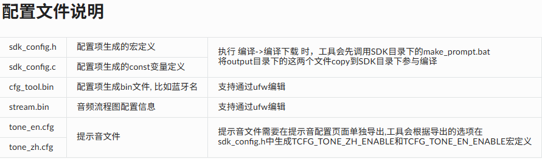

# cfg_tool.bin的更改时机

**使用可视化工具修改后，cfg_tool.bin并不会同步更改。只有点击编译时才会更新？只有可视化工具还是调用makefile构建脚本都可以？**

`customer_copy.bat`注释`cfg_tool.bin`的`copy`看，是不是makefile会改变`cfg_tool.bin`？

- 修改了蓝牙名，src\蓝牙配置.json中的配置会被修改。
  - 注释copy脚本的src目录后

**cfg_tool.bin才是决定蓝牙名的**

- 原来`make_prompt.bat`是用来被可视化工具调用的。
  - 新架构中没有调用此脚本
- 提示音是单独导出的，导出在output中
  - 估计也会被`make_prompt.bat`copy到SDK目录下参与编译。

