# 按键

`apps\earphone\board\br36\board_ac700n_demo.c`

```c
/************************** KEY MSG****************************/
/*各个按键的消息设置，如果USER_CFG中设置了USE_CONFIG_KEY_SETTING为1，则会从配置文件读取对应的配置来填充改结构体*/
u8 key_table[KEY_NUM_MAX][KEY_EVENT_MAX] = {
    // SHORT           LONG              HOLD              UP              DOUBLE           TRIPLE              四击
#if TCFG_APP_LINEIN_EN
    {KEY_ANC_SWITCH,   KEY_POWEROFF,  KEY_POWEROFF_HOLD,  KEY_NULL,     KEY_MODE_SWITCH,     KEY_LOW_LANTECY},   //KEY_0
#else
    {KEY_MUSIC_PP,   KEY_POWEROFF,  KEY_POWEROFF_HOLD,  KEY_NULL,     KEY_ANC_SWITCH,     KEY_LOW_LANTECY,      KEY_OPEN_SIRI},   //KEY_0
#endif
    {KEY_MUSIC_NEXT, KEY_VOL_UP,    KEY_VOL_UP,         KEY_NULL,     KEY_OPEN_SIRI,        KEY_NULL},   //KEY_1
    {KEY_MUSIC_PREV, KEY_VOL_DOWN,  KEY_VOL_DOWN,       KEY_NULL,     KEY_HID_CONTROL,      KEY_NULL},   //KEY_2

    // 上滑               下滑          左滑               右滑
    {KEY_MUSIC_NEXT, KEY_MUSIC_PREV, KEY_NULL,           KEY_NULL,        KEY_NULL,             KEY_NULL},          //触摸按键滑动时的消息
};
```

- 不读取配置工具的文件，当发生按键事件时，直接走对应的处理分支：单击，长按，长按后的hold，长按后的UP，双击，三击，四击。

- 分支名称可以自定义，也可以直接修改原分支的源码逻辑

## 长按识别以及hold发生时间间隔

`include_lib\driver\cpu\br36\asm\lp_touch_key_hw.h`

```c
/**********************************************************算法流程配置**********************************************************************************/
#define CTMU_SAMPLE_RATE_PRD 			20 //kick start采样周期, 单位: ms

#define CTMU_SHORT_CLICK_DELAY_TIME 	400 	//单击事件后等待下一次单击时间(ms)
#define CTMU_HOLD_CLICK_DELAY_TIME 		200 	//long事件产生后, 发hold事件间隔(ms)
#define CTMU_LONG_KEY_DELAY_TIME 		2000 	//从按下到产生long事件的时间(ms
```

## 关闭长按开机

`apps\earphone\board\br36\board_ac700n_demo_cfg.h`

```c
//*********************************************************************************//
//                                  系统配置                                         //
//*********************************************************************************//
#define TCFG_AUTO_SHUT_DOWN_TIME		          180   //没有蓝牙连接自动关机时间
#define TCFG_SYS_LVD_EN						      1   //电量检测使能
#define TCFG_POWER_ON_NEED_KEY                    0//!DHF_DUBUG_PRINTF  //是否需要按按键开机配置
```

如果还不行：

把`cpu\br36\lp_touch_key.c`中所有的**带触摸关机**修改为**普通关机**

- 带触摸关机的意思是关机后触摸按键可以使用，也就可以通过触摸按键实现开机操作。

```c
	//__this->softoff_mode = LP_TOUCH_SOFTOFF_MODE_ADVANCE;
    __this->softoff_mode = LP_TOUCH_SOFTOFF_MODE_LEGACY;
```

`apps\earphone\board\br36\board_ac700n_demo_cfg.h`

- 有一些版本似乎没有这个配置

```c
//*********************************************************************************//
//                                 自定义配置                                       //
//*********************************************************************************//
#define YUEER_APP_ENABLE                 0   //接入原上APP

#define TCFG_LP_SOFTOFF_KEEP                 1  //关机关闭内置触摸(不需要手动关机)    
```

**原理后面分析**,后面两个应该是可以搞一个就行了，但是需要分析。

### 开启上电开机

```c
#define TCFG_POWER_ON_NEED_KEY                    0//!DHF_DUBUG_PRINTF  //是否需要按按键开机配置
```

**关闭就行了？**但是还是可以按键开机啊。

## 长按开机时间

`include_lib\driver\cpu\br36\asm\lp_touch_key_api.h`

```c
/**************************************************USER配置************************************************************************/
//长按开机时间:
#define CFG_M2P_CTMU_SOFTOFF_LONG_TIME 			    1000	//单位: ms

//触摸按键长按复位时间配置
#define CTMU_RESET_TIME_CONFIG			            0//8000	//长按复位时间(ms), 配置为0关闭
```

## 开启手动关机

`apps\earphone\board\br36\board_ac700n_demo_cfg.h`

```c
#define NEED_CFG_POWER_OFF                   1//0//是否需要手动关机

#define TCFG_LP_SOFTOFF_KEEP                 0//1  //关机关闭内置触摸(不需要手动关机) 
```

## 七击以上实现

### AD实体按键

**十击按键事件实现恢复出产设置**

`apps\common\device\key\key_driver.c`添加对应的连击检测，必须按照顺序判断，中间的必须补上不然识别不到，不知道原因。

```c
if (scan_para->click_delay_cnt > scan_para->click_delay_time) { //按键被抬起后延时到
                    //TODO: 在此可以添加任意多击事件
                    if(scan_para->click_cnt >= 10){
                        //新增加十击检测
                        key_event = KEY_EVENT_TENTH_CLICK;
                    } else if(scan_para->click_cnt >= 9) {
                        key_event = KEY_EVENT_NINTH_CLICK;
                    } else if(scan_para->click_cnt >= 8) {
                        key_event = KEY_EVENT_EIGHTH_CLICK;
                    } else if(scan_para->click_cnt >= 7) {
                        key_event = KEY_EVENT_SEVEN_CLICK;
                    } else if(scan_para->click_cnt >= 6){
                        key_event = KEY_EVENT_SIXTH_CLICK;
                    } else if (scan_para->click_cnt >= 5) {
                        key_event = KEY_EVENT_FIRTH_CLICK;  //五击
                    } else if (scan_para->click_cnt >= 4) {
                        key_event = KEY_EVENT_FOURTH_CLICK;  //4击
                    } else if (scan_para->click_cnt >= 3) {
                        key_event = KEY_EVENT_TRIPLE_CLICK;  //三击
                    } else if (scan_para->click_cnt >= 2) {
                        key_event = KEY_EVENT_DOUBLE_CLICK;  //双击
                    } else {
                        key_event = KEY_EVENT_CLICK;  //单击
                    }
                    key_value = scan_para->notify_value;
                    goto _notify;
                }
```

**`include_lib\system\event.h`按键事件的枚举值自己定义，值不能超过`KEY_EVENT_MAX`。只是为了标识一下？感觉没啥作用，暂时没有看出来**

`cpu\br28\lp_touch_key.c`的`__ctmu_short_click_time_out_handle`

```c
case 7:
        e.u.key.event = KEY_EVENT_SEVENTH_CLICK;
        break;
case 8:
        e.u.key.event = KEY_EVENT_EIGHTH_CLICK;//八击(多击)不加这里，进不来
	    break;
```

`apps\earphone\include\key_event_deal.h`定义对应的处理分支名，也是一个枚举值。`KEY_TENTH_CLICK,//十击处理分支`

`apps\earphone\board\br36\board_ac700n_demo.c`中的按键处理表中添加定义好的处理分支名

```c
/************************** KEY MSG****************************/
/*各个按键的消息设置，如果USER_CFG中设置了USE_CONFIG_KEY_SETTING为1，则会从配置文件读取对应的配置来填充改结构体*/
u8 key_table[KEY_NUM_MAX][KEY_EVENT_MAX] = {
    // SHORT                  LONG             HOLD                   UP                   DOUBLE          TRIPLE             四击              五击        六击            七击         八击         九击         十击     
    {KEY_MUSIC_PP,          KEY_POWEROFF,  KEY_POWEROFF_HOLD,        KEY_NULL,     KEY_CALL_LAST_NO,     KEY_OPEN_SIRI,    KEY_LOW_LANTECY,   KEY_NULL,    KEY_NULL,    KEY_DUT_MODE,  KEY_NULL,    KEY_NULL,   KEY_TENTH_CLICK},   //KEY_0
    {KEY_VOL_UP,            KEY_MUSIC_NEXT,    KEY_NULL,         KEY_NULL,          KEY_NULL,        KEY_NULL},   //KEY_1
    {KEY_VOL_DOWN,          KEY_MUSIC_PREV,  KEY_NULL,       KEY_NULL,          KEY_NULL,      KEY_NULL},   //KEY_2

    // 上滑               下滑          左滑               右滑
    {KEY_MUSIC_NEXT, KEY_MUSIC_PREV, KEY_NULL,           KEY_NULL,        KEY_NULL,             KEY_NULL},          //触摸按键滑动时的消息
};
```

这两个宏代表什么？

- `KEY_NUM_MAX`
  - 按键的的通道
- `KEY_EVENT_MAX`
  - 可以检测到的按键事件数量？

`apps\earphone\key_event_deal.c`中的`app_earphone_key_event_handler`添加处理分支的具体操作逻辑

```c
case KEY_TENTH_CLICK:
        //十击恢复出产设置
        //tone_play_index(IDEX_TONE_NORMAL, 1);//出包注释掉
        log_info("KEY_TENTH_CLICK");
        if(get_bt_connect_status() < BT_STATUS_CONNECTING){//不连接手机才能操作，状态枚举值44-42都不行
            user_send_cmd_prepare(USER_CTRL_DISCONNECTION_HCI,0,NULL); //双耳断开蓝牙连接
            user_send_cmd_prepare(USER_CTRL_DEL_ALL_REMOTE_INFO,0,NULL); //删除蓝牙所有配对信息
            //bt_tws_remove_pairs();  //解除配对，删除双耳TWS配对信息,挂脖不行。
            //ui_update_status(STATUS_FACTORY_RESET);//添加恢复出厂设置灯效以及利用灯效更新函数实现操作等，参数伊动XA91-7006F8
            sys_enter_soft_poweroff(NULL);//这个带提示音
            //power_set_soft_poweroff();//这个不带提示音
        }
        break;

case KEY_TENTH_CLICK:
        if(get_bt_connect_status() < BT_STATUS_CONNECTING){//不连接手机才能操作
            user_send_cmd_prepare(USER_CTRL_DISCONNECTION_HCI,0,NULL); //disconneted ihpone
            user_send_cmd_prepare(USER_CTRL_DEL_ALL_REMOTE_INFO,0,NULL); //disconneted ihpone
            bt_tws_remove_pairs();  
            ui_update_status(STATUS_FACTORY_RESET);
        }
        break;
```

## 组合按键

### 一个触摸按键的组合操作

`include_lib\driver\cpu\br30\asm\lp_touch_key.h`

```c
#define CTMU_SHORT_CLICK_DELAY_TIME 	400 	//单击事件后等待下一次单击时间(ms)
#define CTMU_LONG_CLICK_DELAY_TIME 		3000 	//产生长按事件的触摸时间(ms)
#define CTMU_HOLD_CLICK_DELAY_TIME 		200 	//long事件产生后, 发hold事件间隔(ms)

#define CTMU_SHORT_LONG_DELAY_TIME      2000// (CTMU_SHORT_CLICK_DELAY_TIME*3)   //多击长按时长按的时间，不管用，只要比普通长按大的话，就会先触发长按事件，而把单击和长按分开响应

//触摸按键长按复位时间配置
#define CTMU_RESET_TIME_CONFIG			0//8000	//长按复位时间(ms), 配置为0关闭
```

**终于知道为啥长按很久会出现复位的原因了。**

`cpu\br30\lp_touch_key.c`

```c
//需要开debug的情况
//1.内置触摸调试工具
//2.入耳检测
#define CTMU_CH0_MODULE_DEBUG 	1
#define CTMU_CH1_MODULE_DEBUG 	0

#define CTMU_SHORT_LONG_DETECT_EN 1//定义一个宏

enum {
    LAST_TCH_STATE_FALLING,//触摸状态
    LAST_TCH_STATE_RAISING,
};

struct ctmu_key {
    u8 init;
    u8 ch_init;
    u8 click_cnt;
    u8 last_key;
    u8 last_ear_in_state;
    u8 last_tch_state;//新增一个结构体成员
    u8 ch0_msg_lock;
    u8 softoff_mode;
    u16 ch0_msg_lock_timer;
    u16 short_timer;
    u16 long_timer;
    u16 ear_in_timer;
    u16 short_long_timer;//新增一个结构体成员
    u32 lrc_hz;
    u8 ch1_inear_ok;
    u16 ch1_trim_value;
    u16 ch1_trim_flag;
    const struct lp_touch_key_platform_data *config;
};

enum ctmu_key_event {
    CTMU_KEY_NULL,
    CTMU_KEY_SHORT_CLICK,
    CTMU_KEY_LONG_CLICK,
    CTMU_KEY_HOLD_CLICK,
    CTMU_KEY_SHORT_LONG,//以下为新增按键类型
    CTMU_KEY_DOUBLE_LONG,
    CTMU_KEY_THIRD_LONG,
    CTMU_KEY_FOURTH_LONG,
};

static struct ctmu_key _ctmu_key = {
    .click_cnt = 0,
    .last_ear_in_state = CH1_EAR_OUT,
    .short_timer = 0xFFFF,
    .long_timer = 0xFFFF,
    .ear_in_timer = 0xFFFF,
    .short_long_timer = 0xFFFF,//初始化一个值
    .last_key = CTMU_KEY_NULL,
};

#if CTMU_SHORT_LONG_DETECT_EN
        M2P_CTMU_MSG |= CTMU_INIT_CH0_FALL_ENABLE;//开启按下检测，本来就有，不知道宏包起来有啥用？？？
#endif

static void __ctmu_short_click_time_out_handle(void *priv)
{
    struct sys_event e;
    switch (__this->click_cnt) {
    case 0:
        return;
        break;
    case 1:
        e.u.key.event = KEY_EVENT_CLICK;
        break;
    case 2:
        e.u.key.event = KEY_EVENT_DOUBLE_CLICK;
        break;
    case 3:
        e.u.key.event = KEY_EVENT_TRIPLE_CLICK;
        break;
     case 4:
        e.u.key.event = KEY_EVENT_FOURTH_CLICK;//新增
        break;
    case 5:
        e.u.key.event = KEY_EVENT_FIRTH_CLICK;//新增
        break;
    case 6:
        e.u.key.event = KEY_EVENT_SIXTH_CLICK;//新增
        break;
    default:
//        e.u.key.event = KEY_EVENT_TRIPLE_CLICK;//默认的注释了
        break;
    }

    e.u.key.event = remap_ctmu_short_click_event(__this->click_cnt, e.u.key.event);

    e.u.key.value = __this->config->ch0.key_value;
    __this->short_timer = 0xFFFF;
    __this->last_key = CTMU_KEY_NULL;
    log_debug("notify key short event, cnt: %d", __this->click_cnt);
    __ctmu_notify_key_event(&e);
}

//写在它后面，顺序位置是正确的
u8   short_long_flag = 0;

#if   1//CTMU_SHORT_LONG_DETECT_EN
//在这里添加多击长按事件（目前默认只有单击长按和双击长按）
 void __ctmu_short_long_press_time_out_handle(void *p)
{
      printf("__ctmu_short_long_press_time_out_handle\n");
    struct sys_event e;

    __this->short_long_timer = 0xFFFF;


    if(__this->last_key == CTMU_KEY_SHORT_CLICK){
        switch(__this->click_cnt){
            case 1: //单击长按
                short_long_flag = 1;
                __this->last_key = CTMU_KEY_SHORT_LONG;
                e.u.key.event = KEY_EVENT_SHORT_LONG_CLICK;
                printf("*******************CTMU_KEY_SHORT_LONG***************\n");
                break;
            case 2: //双击长按
                //__this->last_key = CTMU_KEY_DOUBLE_LONG;
				//  short_long_flag = 1;
                //printf("*******************CTMU_KEY_DOUBLE_LONG***************\n");
                //e.u.key.event = KEY_EVENT_DOUBLE_LONG_CLICK;
                break;
            case 3: //三击长按
                //__this->last_key = CTMU_KEY_THIRD_LONG;
				//  short_long_flag = 1;
                //printf("*******************CTMU_KEY_THIRD_LONG***************\n");
                //e.u.key.event = KEY_EVENT_TRIPLE_LONG_CLICK;
                break;
            case 4: //四击长按
                // __this->last_key = CTMU_KEY_FOURTH_LONG;
				 //short_long_flag = 1;
                //printf("*******************CTMU_KEY_FOURTH_LONG***************\n");
                //e.u.key.event = KEY_EVENT_FOURTH_LONG_CLICK;
                break;

            default: //依旧按多击处理
                return;
        }
        if(__this->short_timer != 0xFFFF){
            usr_timeout_del(__this->short_timer); //取消多击处理
            __this->short_timer = 0xFFFF;
        }

    }


//    struct sys_event e;
//    e.u.key.event = KEY_EVENT_SHORT_LONG_CLICK;
    e.u.key.value = __this->config->ch0.key_value;

    __ctmu_notify_key_event(&e);
    __this->last_key = CTMU_KEY_SHORT_LONG;

}
#endif


static void __ctmu_hold_click_time_out_handle(void *priv)
{
    log_debug("notify key hold event");
    if(__this->short_long_timer != 0xFFFF){//新增
        usr_timeout_del(__this->short_long_timer); //判断到长按，取消多击长按处理
        __this->short_long_timer = 0xFFFF;
    }
    struct sys_event e;
    e.u.key.event = KEY_EVENT_HOLD;
    e.u.key.value = __this->config->ch0.key_value;

      if(!short_long_flag){//加了一个判断
          __ctmu_notify_key_event(&e);
      }
    __this->last_key = CTMU_KEY_HOLD_CLICK;
}

static void ctmu_long_click_handle(void)
{
    log_debug("notify key long event");
    __this->last_key = CTMU_KEY_LONG_CLICK;

    struct sys_event e;
    e.u.key.event = KEY_EVENT_LONG;
    e.u.key.value = __this->config->ch0.key_value;

    if(!short_long_flag){//加了一个判断
        __ctmu_notify_key_event(&e);
    }

    if (__this->long_timer == 0xFFFF) {
        __this->long_timer = usr_timer_add(NULL, __ctmu_hold_click_time_out_handle, CTMU_HOLD_CLICK_DELAY_TIME, 1);
    }
}

//新增处理函数，顺序位置是正确的
//按下处理
 void ctmu_fall_click_handle(void)
{

    // g_printf("get short-------------------------------------------\n");
#if   CTMU_SHORT_LONG_DETECT_EN
    if(__this->last_tch_state == LAST_TCH_STATE_RAISING && __this->last_key == CTMU_KEY_SHORT_CLICK){
        g_printf("++++++get short++++++++++++++++++++++++++\n");
        //检测到单击或多击，开始判断长按
        if(__this->short_timer != 0xFFFF){
             printf("--------------get short-------------------------\n");
            usr_timer_modify(__this->short_timer, CTMU_SHORT_LONG_DELAY_TIME + CTMU_SHORT_CLICK_DELAY_TIME);
        }
        if(__this->short_long_timer == 0xFFFF){
            __this->short_long_timer = usr_timeout_add(NULL, __ctmu_short_long_press_time_out_handle, CTMU_SHORT_LONG_DELAY_TIME, 1);
             printf(" __this->short_long_timer=====%d\n", __this->short_long_timer);
        }
        else{
            usr_timer_modify(__this->short_long_timer, CTMU_SHORT_CLICK_DELAY_TIME/2);
        }
    }

    __this->last_tch_state = LAST_TCH_STATE_FALLING;
#endif
}


static void ctmu_raise_click_handle(void)
{
    struct sys_event e = {0};
    if (__this->last_key >= CTMU_KEY_LONG_CLICK) {
        if (__this->long_timer != 0xFFFF) {
            //sys_s_hi_timer_del(__this->long_timer);
            usr_timer_del(__this->long_timer);
            __this->long_timer = 0xFFFF;
        }

        e.u.key.event = KEY_EVENT_UP;
        e.u.key.value = __this->config->ch0.key_value;
        __ctmu_notify_key_event(&e);

        __this->last_key = CTMU_KEY_NULL;
        short_long_flag = 0;//新增
        log_debug("notify key HOLD UP event");
    } else {
        ctmu_short_click_handle();
    }
}


void p33_ctmu_key_event_irq_handler()
{
   ......
    case CTMU_P2M_CH0_FALLING_EVENT:
    ctmu_fall_click_handle();//新增
    log_debug("CH0: FALLING");
#if TCFG_KEY_TONE_EN//新增
    audio_key_tone_play();//新增
#endif//新增
    break;
    case CTMU_P2M_CH0_RAISING_EVENT:
        if (!(__this->ch_init & BIT(0))) {
            __this->ch_init |= BIT(0);
            load_p11_bank_code2ram(1, 1);
            return;
        }
#if CTMU_SHORT_LONG_DETECT_EN//全部新增
        if(__this->short_long_timer != 0xFFFF){
            usr_timeout_del(__this->short_long_timer);//时间没到就抬起，取消多击长按处理
            __this->short_long_timer = 0xFFFF;
        }
        __this->last_tch_state = LAST_TCH_STATE_RAISING;
        if(__this->last_key < CTMU_KEY_SHORT_LONG){ //多击长按后的抬起，不处理短按
            ctmu_raise_click_handle();
        }
        else{
            __this->last_key = CTMU_KEY_NULL;
        }
#else
    		ctmu_raise_click_handle();//原来就有
#endif
    log_debug("CH0: RAISING");
    break;
```

`apps\earphone\key_event_deal.c`的`app_earphone_key_event_handler`

```c
#define POWER_OFF_CNT      15
#define LP_HOLD_VOL_CNT     3//新增


log_info("key_event:%d %d %d\n", key_event, key->value, key->event);

u8 key_msg = key->event;

if (key_msg == KEY_EVENT_SHORT_LONG_CLICK) {
    if (get_tws_sibling_connect_state()) {
        if ((u32)event->arg != KEY_EVENT_FROM_TWS) {
            tws_api_sync_call_by_uuid('T', SYNC_CMD_POWER_OFF_TOGETHER, TWS_SYNC_TIME_DO);
        } else {
            goto_poweroff_cnt--;//这个没看懂什么作用
        }
    } else {
        sys_enter_soft_poweroff(NULL);
    }
}


//这样可以减少音量加减的速度
case  KEY_POWEROFF_HOLD:
    printf("进入长按hold:%s,%d\n", __func__, __LINE__);
    //长按不松手持续控制音量
    if (!goto_poweroff_flag) {
        goto_poweroff_cnt++;
        if (goto_poweroff_cnt == LP_HOLD_VOL_CNT) {
            goto_poweroff_cnt = 0;
            key_tws_lr_diff_deal(event,ONE_KEY_CTL_VOL_UP_DOWN);
        }
    } 
```

#### 出现的问题

1. 刚刚烧录时，触摸按键有不触发的现象
2. 组合按键的长按时间必须小于普通长按的时间
   - 不然普通长按会先触发，把单击和长按分开响应。

### 一个按键多个组合操作结构更加清晰的写法?????

`E:\GROUP\DHF-ac700-v138\cpu\br36\tools\download\earphone\软件\20250701\S42-V138-5A7B-EA5107BA-20250701-right-T.zip`

`CTMU_CLICK_LONG_PRESS_DET_EN`宏

https://www.kdocs.cn/l/csL8fYHva0i6?openfrom=docs


# 是否读取配置工具的配置

`apps\earphone\user_cfg.c`使用宏控制`USE_CONFIG_KEY_SETTING`：

```c
#define USE_CONFIG_BIN_FILE                  0

#define USE_CONFIG_STATUS_SETTING            1                          //状态设置，提示音（不包含音量）以及蓝牙名
#define USE_CONFIG_AUDIO_SETTING             USE_CONFIG_BIN_FILE        //音频设置
#define USE_CONFIG_CHARGE_SETTING            USE_CONFIG_BIN_FILE        //充电设置
#define USE_CONFIG_KEY_SETTING               USE_CONFIG_BIN_FILE        //按键消息设置
#define USE_CONFIG_MIC_TYPE_SETTING          USE_CONFIG_BIN_FILE        //MIC类型设置
#define USE_CONFIG_LOWPOWER_V_SETTING        USE_CONFIG_BIN_FILE        //低电提示设置
#define USE_CONFIG_AUTO_OFF_SETTING          USE_CONFIG_BIN_FILE        //自动关机时间设置
#define USE_CONFIG_COMBINE_VOL_SETTING       1					        //联合音量读配置
```

**少部分读取配置工具的配置**

# 固定左右耳烧录

`apps\earphone\include\app_config.h`

```c
/* 声道确定方式选择 */
#define CONFIG_TWS_MASTER_AS_LEFT             0 //主机作为左耳
#define CONFIG_TWS_AS_LEFT_CHANNEL            1 //固定左耳
#define CONFIG_TWS_AS_RIGHT_CHANNEL           2 //固定右耳
#define CONFIG_TWS_LEFT_START_PAIR            3 //双击发起配对的耳机做左耳
#define CONFIG_TWS_RIGHT_START_PAIR           4 //双击发起配对的耳机做右耳
#define CONFIG_TWS_EXTERN_UP_AS_LEFT          5 //外部有上拉电阻作为左耳
#define CONFIG_TWS_EXTERN_DOWN_AS_LEFT        6 //外部有下拉电阻作为左耳
#define CONFIG_TWS_SECECT_BY_CHARGESTORE      7 //充电仓决定左右耳
#define CONFIG_TWS_CHANNEL_SELECT             CONFIG_TWS_AS_LEFT_CHANNEL //配对方式选择
```

# 识别芯片型号

`apps\earphone\board\br36\board_ac700n_demo_cfg.h`**公司通过左右声道区分。**

```c
/*DAC硬件上的连接方式,可选的配置：
    DAC_OUTPUT_MONO_L               单左声道差分
    DAC_OUTPUT_MONO_R               单右声道差分
    DAC_OUTPUT_LR                   双声道差分
*/
#define TCFG_AUDIO_DAC_CONNECT_MODE         DAC_OUTPUT_MONO_L //左声道为7006芯片
// #define TCFG_AUDIO_DAC_CONNECT_MODE         DAC_OUTPUT_MONO_R
// #define TCFG_AUDIO_DAC_CONNECT_MODE         DAC_OUTPUT_LR
```

# 充电参数配置，软件确认

`apps\earphone\board\br36\board_ac700n_demo_cfg.h`

**这是内置充电的参数位置，外置充电不知道。**

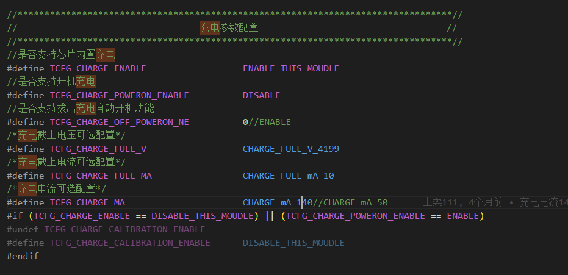

## 外置充电

`apps\earphone\board\br36\board_ac700n_demo_cfg.h`

外置充电是充电芯片控制的，程序没办法控制。

外置充电标志

```c
//*********************************************************************************//
//                                  自定义配置                                      //
//*********************************************************************************//
#define QUICK_UP_DOWN                            1     //加减音量快速响应使能


#define   FAST_CHARGE_4054                            1
#define   FAST_CHARGE_DET_IO                         NO_CONFIG_PORT//IO_PORT_DM//IO_PORTB_08
#define   FAST_CHARGE_FULL_DET_IO                    IO_PORT_DP//     IO_PORTB_09
```

4054芯片宏

# 实体ad按键机器使用io按键板子开打印

`apps\earphone\board\br36\board_ac700n_demo_cfg.h`

```c
//                                 UART配置                                        //
//*********************************************************************************//
#define TCFG_UART0_ENABLE					1//0//ENABLE_THIS_MOUDLE                     //串口打印模块使能
#define TCFG_UART0_RX_PORT					NO_CONFIG_PORT                         //串口接收脚配置（用于打印可以选择NO_CONFIG_PORT）
#define TCFG_UART0_TX_PORT  				IO_PORT_DP                             //串口发送脚配置
#define TCFG_UART0_BAUDRATE  				1000000                                //串口波特率配置
//*********************************************************************************//

//*********************************************************************************//
//                                 iokey 配置                                      //
//*********************************************************************************//
#define TCFG_IOKEY_ENABLE					1//0//ENABLE_THIS_MOUDLE //是否使能IO按键

#define TCFG_IOKEY_POWER_CONNECT_WAY		ONE_PORT_TO_LOW    //按键一端接低电平一端接IO
#define TCFG_IOKEY_POWER_ONE_PORT			IO_PORTB_01        //IO按键端口


//*********************************************************************************//
//                                 adkey 配置                                      //
//*********************************************************************************//
#define TCFG_ADKEY_ENABLE                   0//1//DISABLE_THIS_MOUDLE//是否使能AD按键
#define TCFG_ADKEY_PORT                     IO_PORTB_01//IO_PORTC_05//IO_PORT_DM         //AD按键端口(需要注意选择的IO口是否支持AD功能)

#define TCFG_ADKEY_AD_CHANNEL               AD_CH_PC5//AD_CH_DM
#define TCFG_ADKEY_EXTERN_UP_ENABLE         0//ENABLE_THIS_MOUDLE //是否使用外部上拉
```

`apps\earphone\include\app_config.h`

```c
/*
 * 系统打印总开关
 */

#define LIB_DEBUG    1//0
#define CONFIG_DEBUG_LIB(x)         (x & LIB_DEBUG)

#define CONFIG_DEBUG_ENABLE

#ifndef CONFIG_DEBUG_ENABLE
//#define CONFIG_DEBUG_LITE_ENABLE  //轻量级打印开关, 默认关闭
#endif
```

`apps\earphone\board\br36\board_ac700n_demo_global_build_cfg.h`

```c
#define CONFIG_LP_TOUCH_KEY_EN					0		//配置是否使用内置触摸
```

- 使用IO按键看打印的话

# DAC硬件功放与DAC解码以及提示音播放的先后关系

## 典型的信号处理流程

**1. 系统初始化阶段**

- 硬件功放电路上电
- DAC芯片初始化和配置
- 音频子系统驱动加载

**2. 音频播放准备阶段**

- DAC解码器准备就绪
- 功放电路进入工作状态
- 音量控制和增益设置

**3. 实际播放阶段**

- 数字音频数据输入DAC
- DAC执行数模转换
- 模拟信号送入功放放大
- 扬声器输出声音

## 具体的时序关系

**DAC解码 → 功放放大 → 声音输出**

这是信号流的基本路径。数字信号必须先经过DAC转换为模拟信号，然后才能被功放电路放大驱动扬声器。

**提示音播放的时机**

- 通常在系统启动完成后播放
- **需要DAC和功放都已就绪**
- 有些系统会在功放稳定后延迟几百毫秒再播放提示音，避免"爆音"

## 设计考虑

现代音频系统通常采用软启动机制，确保各组件按正确顺序启动，避免在DAC或功放未就绪时播放音频造成的噪声或损坏。

## 关机无提示音分析

`apps\earphone\earphone.c`

```c
#if  DAC_PA_EN
void user_pa_deal(u8 enable){
    // u8 pa_enable = DAC_PA_UMUTE;
    gpio_set_pull_up(DAC_PA_PORT, enable);
    gpio_set_pull_down(DAC_PA_PORT, !enable);
    //   gpio_set_die(DAC_PA_PORT, 1);
    gpio_set_direction(DAC_PA_PORT, 0);
    gpio_set_output_value(DAC_PA_PORT, enable);

}

void audio_dac_power_state(u8 state)
{
    switch(state){
       // case DAC_ANALOG_OPEN_FINISH://开dac前
       case DAC_ANALOG_OPEN_PREPARE://开dac前
            user_pa_deal(1);
            break;
        case DAC_ANALOG_CLOSE_PREPARE://关dac后
       //case DAC_ANALOG_CLOSE_PREPARE://关dac前
            user_pa_deal(0);
            break;
    }
}
#endif


void sys_enter_soft_poweroff(void *priv)
{
    int detach_phone = 1;
    struct sys_event clear_key_event = {.type =  SYS_KEY_EVENT, .arg = "key"};

    log_info("%s, %d\n", __func__, (int)priv);

// #if  DAC_PA_EN
//     user_pa_deal(1);
// #endif


    if (app_var.goto_poweroff_flag) {
        return;
    }

    // gpio_set_pull_up(DAC_PA_PORT, 0);
    // gpio_set_pull_down(DAC_PA_PORT, 1);
    // gpio_set_direction(DAC_PA_PORT, 0);
    // gpio_set_output_value(DAC_PA_PORT, 0);
```

**核心问题：PA功放过早关闭**

在你注释掉的代码中：

```c
// #if  DAC_PA_EN
//     user_pa_deal(1);  // 这里实际是关闭PA功放
// #endif
```

虽然参数是1，但从`user_pa_deal()`函数实现来看，这里实际是**开启PA功放**，而不是关闭。但在关机流程的开始就调用这个函数是有问题的。

### 时序问题分析

**正常的关机音频播放流程应该是：**

1. 开始关机流程
2. 播放关机提示音（需要DAC + PA功放都工作）
3. 提示音播放完成后，关闭PA功放
4. 关闭DAC
5. 完全断电

**你原来的代码问题：**

- 在关机流程最开始就操作了PA功放
- 同时注释掉的GPIO操作也在过早地拉低PA控制信号
- 这导致提示音还没播放，功放就已经被关闭或干扰

### 解决方案建议

1. 移除关机开始时的PA操作
   - 让PA功放保持开启状态，直到提示音播放完成
2. 在适当的时机关闭PA
   - 应该在`wait_exit_btstack_flag`回调或者音频播放完成回调中关闭PA
   - 而不是在关机流程开始时就关闭
3. 检查DAC关闭时序
   - 确保`audio_dac_power_state()`中的`DAC_ANALOG_CLOSE_PREPARE`在提示音播放完成后才被调用

你注释掉这些代码后关机提示音能正常播放，说明问题确实是PA功放被过早关闭导致的。建议将PA关闭操作移到关机流程的最后阶段。

# V300以前的所有可视化版本可能问题

**如果检测到提示音 就不跑自动关机流程  自动关机要放到前边**

# ANC降噪命名方式

**命名方式把降噪参数的校验码加进去，合降噪的必须这样命名   把这个加进去 ，避免出现降噪参数对不上 或者改的次数多了找不到的问题。**

- ANC压缩包上自带的后缀

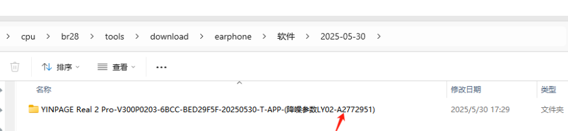

# 是否支持智能仓

`sdk\apps\earphone\board\br36\board_ac700n_demo_cfg.h`

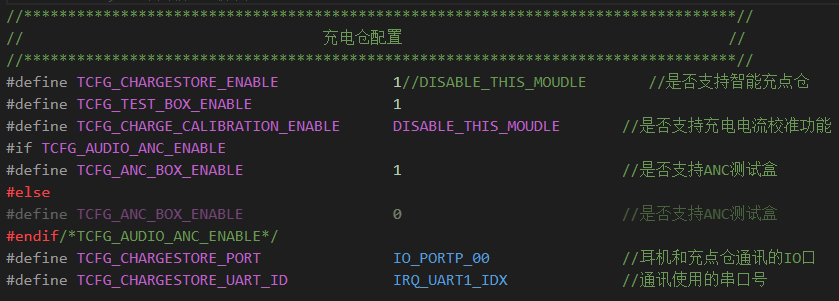

`sdk\apps\earphone\board\br36\board_ac700n_demo.c`

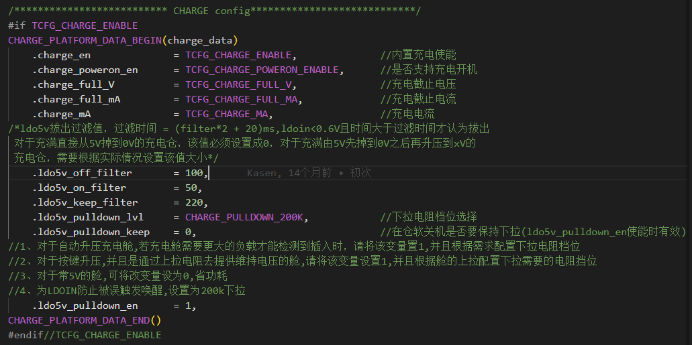

**暂时不清楚为什么**

## 关闭智能充电仓

`sdk\apps\earphone\board\br36\board_ac700n_demo_cfg.h`

```c
//*********************************************************************************//
//                                  充电仓配置                                     //
//*********************************************************************************//
#define TCFG_CHARGESTORE_ENABLE				DISABLE_THIS_MOUDLE       //是否支持智能充点仓
#define TCFG_TEST_BOX_ENABLE			    1
#define TCFG_CHARGE_CALIBRATION_ENABLE      DISABLE_THIS_MOUDLE       //是否支持充电电流校准功能
#if TCFG_AUDIO_ANC_ENABLE
#define TCFG_ANC_BOX_ENABLE			        1                         //是否支持ANC测试盒
#else
#define TCFG_ANC_BOX_ENABLE			        0                         //是否支持ANC测试盒
#endif/*TCFG_AUDIO_ANC_ENABLE*/
#define TCFG_CHARGESTORE_PORT				IO_PORTP_00               //耳机和充点仓通讯的IO口
#define TCFG_CHARGESTORE_UART_ID			IRQ_UART1_IDX             //通讯使用的串口号
```

`sdk\apps\earphone\board\br36\board_ac700n_demo.c`

```c
/************************** CHARGE config****************************/
#if TCFG_CHARGE_ENABLE
CHARGE_PLATFORM_DATA_BEGIN(charge_data)
    .charge_en              = TCFG_CHARGE_ENABLE,              //内置充电使能
    .charge_poweron_en      = TCFG_CHARGE_POWERON_ENABLE,      //是否支持充电开机
    .charge_full_V          = TCFG_CHARGE_FULL_V,              //充电截止电压
    .charge_full_mA			= TCFG_CHARGE_FULL_MA,             //充电截止电流
    .charge_mA				= TCFG_CHARGE_MA,                  //充电电流
/*ldo5v拔出过滤值，过滤时间 = (filter*2 + 20)ms,ldoin<0.6V且时间大于过滤时间才认为拔出
 对于充满直接从5V掉到0V的充电仓，该值必须设置成0，对于充满由5V先掉到0V之后再升压到xV的
 充电仓，需要根据实际情况设置该值大小*/
	.ldo5v_off_filter		= 100,
    .ldo5v_on_filter        = 50,
    .ldo5v_keep_filter      = 220,
    .ldo5v_pulldown_lvl     = CHARGE_PULLDOWN_100K,//CHARGE_PULLDOWN_200K,            //下拉电阻档位选择
    .ldo5v_pulldown_keep    = 0,                               //在仓软关机是否要保持下拉(ldo5v_pulldown_en使能时有效)
//1、对于自动升压充电舱,若充电舱需要更大的负载才能检测到插入时，请将该变量置1,并且根据需求配置下拉电阻档位
//2、对于按键升压,并且是通过上拉电阻去提供维持电压的舱,请将该变量设置1,并且根据舱的上拉配置下拉需要的电阻挡位
//3、对于常5V的舱,可将改变量设为0,省功耗
//4、为LDOIN防止被误触发唤醒,设置为200k下拉
	.ldo5v_pulldown_en		= 1,
CHARGE_PLATFORM_DATA_END()
#endif//TCFG_CHARGE_ENABLE
```

# 修改充电电流

`apps\earphone\board\br36\board_ac700n_demo_cfg.h`

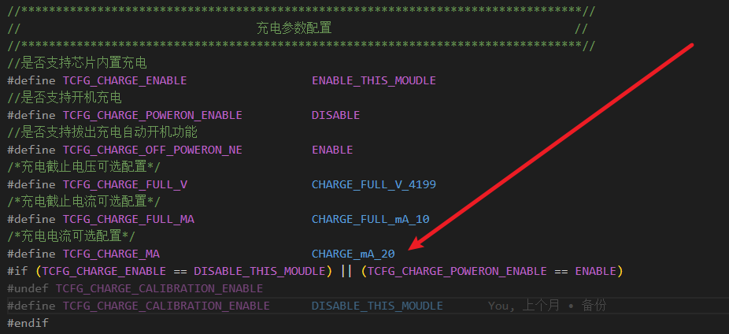


# 非TWS连接下区分左右耳

```c
case ONE_KEY_CTL_NEXT_PREV:
        if (channel == 'L') {
            user_send_cmd_prepare(USER_CTRL_AVCTP_OPID_PREV, 0, NULL);
        } else if (channel == 'R') {
            user_send_cmd_prepare(USER_CTRL_AVCTP_OPID_NEXT, 0, NULL);
        } else {
//************      单耳使用情况    具体视客户UI而定    ************************/
#if (CONFIG_TWS_CHANNEL_SELECT == CONFIG_TWS_AS_LEFT_CHANNEL)
         user_send_cmd_prepare(USER_CTRL_AVCTP_OPID_PREV, 0, NULL); /*  软件固定左耳*/
#elif(CONFIG_TWS_CHANNEL_SELECT == CONFIG_TWS_AS_RIGHT_CHANNEL)
         user_send_cmd_prepare(USER_CTRL_AVCTP_OPID_NEXT, 0, NULL); /*  软件固定右耳*/
#else   
            user_send_cmd_prepare(USER_CTRL_AVCTP_OPID_NEXT, 0, NULL); /*  左右耳共软件*/
#endif   
//*****************************************************************************/  单耳使用情况选择，可固定
        }
        break;
```

# 调整喇叭输出

## 问题描述

- **声音过小，跟之前你们提供的平EQ的软件音量差太多**
- 这个可以修改提示音的音量吗？
- 注意区分工具中的通话喇叭参数

`apps\earphone\board\br36\board_ac700n_demo_cfg.h`

```c
//*********************************************************************************//
//                                 Audio配置                                       //
//*********************************************************************************//
/*内存使用自定义*/
#define TCFG_AUDIO_AAC_RAM_MALLOC_ENABLE	DISABLE_THIS_MOUDLE		//AAC编解码内存动态申请配置

#define TCFG_AUDIO_ADC_ENABLE				ENABLE_THIS_MOUDLE
#define TCFG_AUDIO_ADC_LINE_CHA				LADC_LINE0_MASK

#define TCFG_AUDIO_DAC_ENABLE				ENABLE_THIS_MOUDLE
#define TCFG_AUDIO_DAC_LDO_VOLT				DACVDD_LDO_2_60V//DACVDD_LDO_2_60V //普通模式 DACVDD
#define TCFG_AUDIO_DAC_LDO_VOLT_HIGH        DACVDD_LDO_2_60V//DACVDD_LDO_2_60V //音量增强模式 DACVDD
#define TCFG_AUDIO_DAC_DEFAULT_VOL_MODE     (1) //首次开机默认模式 1：音量增强模式  0：普通模式
#define TCFG_AUDIO_DAC_VCM_CAP_EN           (1) //VCM引脚是否有电容  0:没有  1:有


//*********************************************************************************//
//                                  低功耗配置                                     //
//*********************************************************************************//
#define TCFG_LOWPOWER_POWER_SEL				PWR_DCDC15//PWR_LDO15                    //电源模式设置，可选DCDC和LDO
#define TCFG_LOWPOWER_BTOSC_DISABLE			0                            //低功耗模式下BTOSC是否保持
#define TCFG_LOWPOWER_LOWPOWER_SEL			0   //芯片是否进入powerdown
/*强VDDIO等级配置,可选：
    VDDIOM_VOL_20V    VDDIOM_VOL_22V    VDDIOM_VOL_24V    VDDIOM_VOL_26V
    VDDIOM_VOL_30V    VDDIOM_VOL_30V    VDDIOM_VOL_32V    VDDIOM_VOL_36V*/
#define TCFG_LOWPOWER_VDDIOM_LEVEL			VDDIOM_VOL_32V//VDDIOM_VOL_28V
/*弱VDDIO等级配置，可选：
    VDDIOW_VOL_21V    VDDIOW_VOL_24V    VDDIOW_VOL_28V    VDDIOW_VOL_32V*/
#define TCFG_LOWPOWER_VDDIOW_LEVEL			VDDIOW_VOL_30V               //弱VDDIO等级配置
#define TCFG_LOWPOWER_OSC_TYPE              OSC_TYPE_LRC
#define TCFG_LOWPOWER_LIGHT_SLEEP_ATTRIBUTE 	LOWPOWER_LIGHT_SLEEP_ATTRIBUTE_KEEP_CLOCK 		//低功耗LIGHT模式属性, 可以选择是否保持住一些电源和时钟
```

`cpu\br36\audio\audio_config.h`

```c
#define MAX_ANA_VOL             (15)	// 系统最大模拟音量,范围: 0 ~ 15
#define MAX_COM_VOL             (16)    // 数值应该大于等于16，具体数值应小于联合音量等级的数组大小 (combined_vol_list)
#define MAX_DIG_VOL             (16)    // 数值应该大于等于16，因为手机是16级，如果小于16会导致某些情况手机改了音量等级但是小机音量没有变化
```

`apps\common\audio\audio_dvol.c`

```c
/*
 *数字音量级数 DIGITAL_VOL_MAX
 *数组长度 DIGITAL_VOL_MAX + 1
 */
#define DIGITAL_VOL_MAX		16
const u16 dig_vol_table[DIGITAL_VOL_MAX + 1] = {
	    0, //0: None
	    26, // 1:-56.00 db
        55, // 2:-49.47 db
	   83, // 3:-45.93 db
	  124, // 4:-42.40 db
	  187, // 5:-38.87 db
	  280, // 6:-35.33 db
	  518, // 7:-30.00 db
	  760, // 8:-26.67 db
	 1116, // 9:-23.33 db
	 1638, // 10:-20.00 db
	 2405, // 11:-16.67 db
	 3530, // 12:-13.33 db
	 5181, // 13:-10.00 db
	 7605, // 14:-6.67 db
	11162, // 15:-3.33 db
	16384, // 16:0.00 db
};
```

如果支持ANC的话，对应的数据要同步。

- MAX_ANA_VOL和DAC增益
- `apps\earphone\board\br36\board_ac700n_demo_global_build_cfg.h`中没有看到的话，就不用

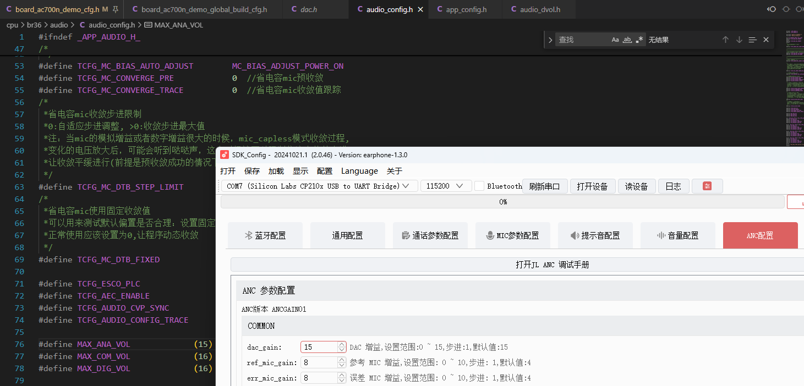

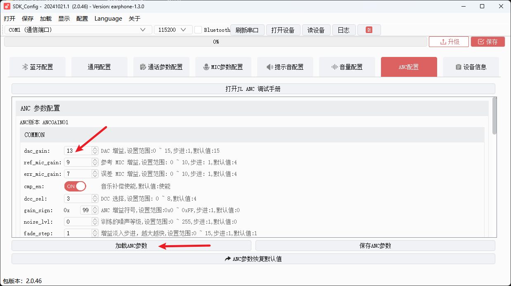

加载这个`anc_gains.bin`文件。

## 提示音的音量


# 鸿蒙系统的音量问题

## 问题描述

1. **鸿蒙系统手机播放音乐时候，长按音量无反应**
2. **兼容性这块音量和华为手机不同步**
   1. 蓝牙设置中**蓝牙设备音量与手机同步**开关没有打开


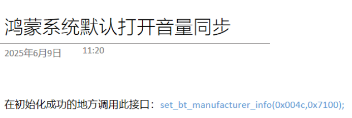

在蓝牙初始化完成时调用

```c
case BT_STATUS_INIT_OK:
        /*
         * 蓝牙初始化完成
         */
        EARPHONE_CUSTOM_EARPHONE_KEY_INIT();
        log_info("BT_STATUS_INIT_OK\n");
        //鸿蒙系统打开音量同步
        set_bt_manufacturer_info(0x004c,0x7100);
```

# 彩屏仓的中英文提示音切换

`apps\earphone\board\br36\board_ac700n_demo_cfg.h`

```c
//语言跟随是否打开
#define LANGUAGE_ENABLE                         1//0 
//默认提示音语言   0:中文 1:英文    
#define DEFAULT_LANGUAGE                        0//1 
//语言跟随(默认打开)提示音文件使用"中英文跟随   仓"
#define LANGUAGE_FOLLOW                         1 
```

## 耳机双击切换中英文

直接把vm中存放中英文提示音的标志位修改即可

```c
bool tone_language = DEFAULT_LANGUAGE; // 默认提示音语言  0:中文  1：英文


extern bool tone_language; // 默认提示音语言  0:中文  1：英文
void bt_tws_language_to_slave(bool language);

u8 language_save_vm(bool set_language)
{
    bool read_language = 0;
    int len = syscfg_read(CFG_USER_LANGUAGE, &read_language, 1);
    if(len != 1 || read_language != set_language){
        read_language = set_language;
        len = syscfg_write(CFG_USER_LANGUAGE, &read_language, 1);
        return len == 1 ? 1 : 0;
    }
    return read_language == set_language;
}


u8 get_vm_language(void)
{
#if LANGUAGE_ENABLE
    u8 read_language = 0;
    int len = syscfg_read(CFG_USER_LANGUAGE, &read_language, 1);
    if(len == 1){
        tone_language = read_language;
        if(tone_language < LANGUAGE_MAX){
            bt_tws_language_to_slave(tone_language);
        }else{
            bt_tws_language_to_slave(DEFAULT_LANGUAGE);
            return DEFAULT_LANGUAGE;
        }
        return read_language;
    }
    return LANGUAGE_CHINESE;
#else
    bt_tws_language_to_slave(DEFAULT_LANGUAGE);
    return DEFAULT_LANGUAGE;
    
#endif
}

/*
 *index:提示音索引
 *preemption:抢断标志
 */
__BANK_TONE_ENTRY
int tone_play_index(u8 index, u8 preemption)
{
    printf("tone_play_index:%d,preemption:%d", index, preemption);
    if (index >= IDEX_TONE_NONE) {
        return 0;
    }
#if LANGUAGE_FOLLOW
    return tone_play(tone_language == 0 ? tone_index_Chinese[index] : tone_index_English[index], preemption);
#else
    return tone_play(tone_index_Chinese[index], preemption);
#endif
}
```

- 有两个列表分别播报中英文根据`tone_language`的值

```c
//未连接情况下双击切换中英文,而且是TWS连接状态下
if ((get_bt_connect_status() < BT_STATUS_CONNECTING) && get_bt_tws_connect_status()) {
    //默认是中文
    static read_language = 0;
    //1是英文，0是中文
    if(read_language == 0){
        //要被切换为英文
        tone_play(E_TONE_English_MODE, 1);
    }else if(read_language == 1){
        //要被切换为英文
        tone_play(E_TONE_Chinese_MODE, 1);
    }
    //取反
    language_save_vm(!read_language);
    //先存值后读取值更新语言值
    read_language = get_vm_language();
    //bt_tws_language_to_slave(!read_language); //同步语言给副耳，不需要这个函数同步主从，暂时不知道原理
    break;
}
```

- `language_save_vm`**是否两边一起存具体看打印验证**
- 保证仓与耳机的默认语言是一致的，不然会出现错乱，因为这里是先存覆盖再读取更新的。
- 读取VM中的语言值必须打开宏`LANGUAGE_ENABLE`不然读取不了正确的值。

## 不是彩屏仓从0->1

- 首先考虑芯片控件够不够

# 修改触摸灵敏度

配置工具不生效，没有使能。

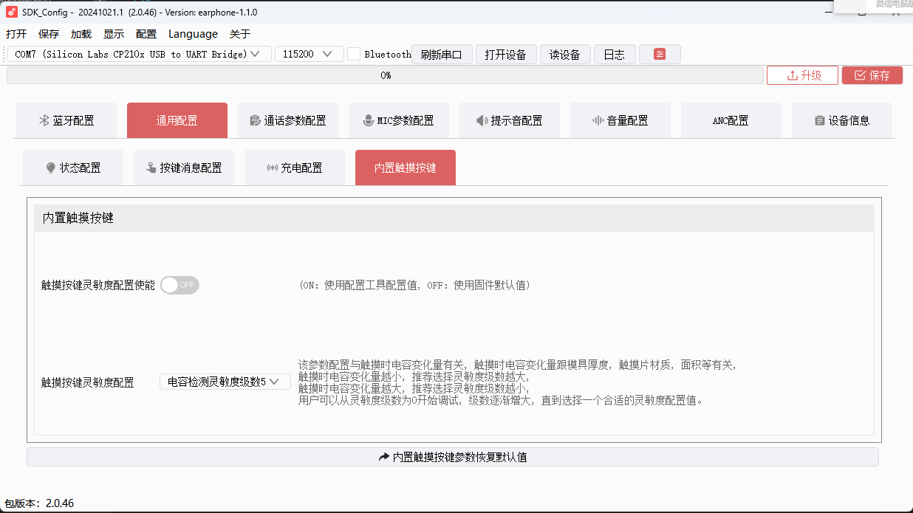

`apps\earphone\board\br30\board_ad697n_demo_cfg.h`

```c
//*********************************************************************************//
//                             lp tocuh key 配置                                   //
//*********************************************************************************//
#define TCFG_LP_TOUCH_KEY_ENABLE 			1//DISABLE_THIS_MOUDLE 		//是否使能触摸按键

#define TCFG_LP_TOUCH_KEY0_EN               1                           //是否使能触摸按键0 —— PB0
#define TCFG_LP_TOUCH_KEY1_EN               0                           //是否使能触摸按键1 —— PB2

#define TCFG_LP_SLIDE_KEY_ENABLE          0                         //是否使能触摸按键的滑动功能

#define TCFG_LP_EARTCH_KEY_ENABLE 			DISABLE_THIS_MOUDLE 	 	//是否使能 触摸按键1 用作入耳检测
#define TCFG_LP_EARTCH_SOFT_INEAR_VAL       100                         //入耳检测算法需要的入耳阈值，参考文档设置
#define TCFG_LP_EARTCH_SOFT_OUTEAR_VAL      80                          //入耳检测算法需要的出耳阈值，参考文档设置


//电容检测灵敏度级数配置(范围: 0 ~ 9)
//该参数配置与触摸时电容变化量有关, 触摸时电容变化量跟模具厚度, 触摸片材质, 面积等有关,
//触摸时电容变化量越小, 推荐选择灵敏度级数越大,
//触摸时电容变化量越大, 推荐选择灵敏度级数越小,
//用户可以从灵敏度级数为0开始调试, 级数逐渐增大, 直到选择一个合适的灵敏度配置值.
#define TCFG_LP_TOUCH_KEY0_SENSITIVITY 		5//7 	//触摸按键电容检测灵敏度配置(级数0 ~ 9)
#define TCFG_LP_TOUCH_KEY1_SENSITIVITY 		5//7 	//触摸按键电容检测灵敏度配置(级数0 ~ 9)

//内置触摸灵敏度调试工具使能, 使能后可以通过连接PC端上位机通过SPP调试,
//打开该宏需要确保同时打开宏:
//1.USER_SUPPORT_PROFILE_SPP
//2.APP_ONLINE_DEBUG
//可以针对每款样机校准灵敏度参数表(在lp_touch_key.c ch_sensitivity_table), 详细使用方法请参考《低功耗内置触摸介绍》文档.
#define TCFG_LP_TOUCH_KEY_BT_TOOL_ENABLE 	DISABLE
```

保险起见两个都修改。

**SDK可视化的这个部分都注释掉了，可视化配置。**

# 恢复出厂设置

demo中有对应的实现：

```c
case KEY_FACTORY_RESET:
    log_info("KEY_FACTORY_RESET");
    if(get_bt_connect_status() <= BT_STATUS_AUTO_CONNECTINT){
    //  删除所有手机配对信息
    user_send_cmd_prepare(USER_CTRL_DEL_ALL_REMOTE_INFO,0,NULL); //disconneted ihpone            
    //bt_tws_remove_pairs();//TWS连接状态保持
    //ui_update_status(STATUS_FACTORY_RESET);//无更新灯效要求
    }
break;
```

# 修改蓝牙版本

SDK具体有不同，但是都在蓝牙初始化部分

# 硅mic与圆mic的区别？

## 结构和工作原理

**硅麦克风（MEMS麦克风）：**

- 采用微电子机械系统（MEMS）技术制造
- 使用硅基材料，通过半导体工艺加工
- 内部结构非常小巧，通常只有几毫米大小
- 工作原理基于电容变化检测声音振动

**圆形麦克风（传统电容/动圈麦克风）：**

- 通常指传统的圆形外壳麦克风
- 可能是电容式或动圈式结构
- 使用金属振膜和磁性材料
- 体积相对较大

## 性能特点

**硅麦克风优势：**

- 体积极小，适合集成到各种电子设备中
- 抗振动和冲击能力强
- 温度稳定性好
- 批量生产成本低
- 功耗较低

**圆形麦克风优势：**

- **通常具有更好的音质表现**
- 灵敏度可能更高
- **在专业录音场合表现更佳**
- **信噪比通常更好**

## 应用场景

**硅麦克风：** 主要用于手机、平板、笔记本电脑、智能音箱、耳机等消费电子产品

**圆形麦克风：** 更多用于专业录音设备、广播设备、会议系统等对音质要求较高的场合

# 灯效

## 板级文件中的设置

`apps\earphone\board\br36\board_ac700n_demo.c`在板级文件中的设置

```c
/*各个状态下默认的闪灯方式和提示音设置，如果USER_CFG中设置了USE_CONFIG_STATUS_SETTING为1，则会从配置文件读取对应的配置来填充改结构体*/
STATUS_CONFIG status_config = {
    //灯状态设置
    .led = {
        .charge_start  = PWM_LED1_ON,//红亮
        .charge_full   = PWM_LED0_ON,//蓝亮
        .power_on      = PWM_LED0_ON,//蓝亮
        .power_off     = PWM_LED1_FLASH_THREE,//ui_manage_scan的外面优先处理，闪烁相关参数sys_ui_var.ui_flash_cnt = 7;
        .lowpower      = PWM_LED1_SLOW_FLASH,//红慢闪
        .max_vol       = PWM_LED_NULL,//通话灯效
        .phone_in      = PWM_LED_NULL,
        .phone_out     = PWM_LED_NULL,
        .phone_activ   = PWM_LED_NULL,
        .bt_init_ok    = PWM_LED0_LED1_SLOW_FLASH,//红蓝交替闪（慢闪）
        .bt_connect_ok = PWM_LED0_ONE_FLASH_5S,//蓝灯5秒连闪1下
        .bt_disconnect = PWM_LED0_LED1_FAST_FLASH,//红蓝交替闪（快闪）
        .tws_connect_ok = PWM_LED0_LED1_FAST_FLASH,//红蓝交替闪（快闪）
        .tws_disconnect = PWM_LED0_LED1_SLOW_FLASH,//红蓝交替闪（慢闪）
    },
    //提示音设置
    .tone = {
        .charge_start  = IDEX_TONE_NONE,
        .charge_full   = IDEX_TONE_NONE,
        .power_on      = IDEX_TONE_POWER_ON,
        .power_off     = IDEX_TONE_POWER_OFF,
        .lowpower      = IDEX_TONE_LOW_POWER,
        .max_vol       = IDEX_TONE_MAX_VOL,
        .phone_in      = IDEX_TONE_NONE,
        .phone_out     = IDEX_TONE_NONE,
        .phone_activ   = IDEX_TONE_NONE,
        .bt_init_ok    = IDEX_TONE_BT_MODE,
        .bt_connect_ok = IDEX_TONE_BT_CONN,
        .bt_disconnect = IDEX_TONE_BT_DISCONN,
        .tws_connect_ok   = IDEX_TONE_TWS_CONN,
        .tws_disconnect   = IDEX_TONE_TWS_DISCONN,
    }
};

#define __this (&status_config)
```

## UI更新函数的设置

`apps\earphone\ui_manage.c`

- `ui_manage_scan`中各状态的灯效处理
- 后者的状态比板级配置中的状态更多
  - `STATUS_BT_MASTER_CONN_ONE`
  - `STATUS_BT_SLAVE_CONN_MASTER`等


```c
case STATUS_BT_INIT_OK:
        log_info("[STATUS_BT_INIT_OK]\n");
        // pwm_led_mode_set(p_led->bt_init_ok);
#if (LED_IO_CHOOSE == 1)
        pwm_led_mode_set(PWM_LED0_LED1_FAST_FLASH);
#elif (LED_IO_CHOOSE == 2)
        led_status_set(LED1_LED2_FLASH);
#endif
        break;

    case STATUS_BT_SLAVE_CONN_MASTER:
#if (LED_IO_CHOOSE == 1)
        // pwm_led_mode_set(PWM_LED1_SLOW_FLASH);
#elif (LED_IO_CHOOSE == 2)
        led_status_set(LED2_FLASH_SLOW);
#endif
        break;

    case STATUS_BT_CONN:
        log_info("[STATUS_BT_CONN]\n");
#if (LED_IO_CHOOSE == 1)
        pwm_led_mode_set(PWM_LED_ALL_OFF);
#elif (LED_IO_CHOOSE == 2)
        led_status_set(ALL_OFF);
#endif

        if(get_phone_timer){
            sys_timeout_del(get_phone_timer);
            get_phone_timer = 0;
        }
        if(!get_phone_timer){
            get_phone_timer = sys_timeout_add(NULL,get_phone_timer_func,1000);
        }

        break;

    case STATUS_BT_MASTER_CONN_ONE:
        log_info("[STATUS_BT_MASTER_CONN_ONE]\n");
#if (LED_IO_CHOOSE == 1)
        pwm_led_mode_set(PWM_LED0_LED1_SLOW_FLASH);
#elif (LED_IO_CHOOSE == 2)
        led_status_set(LED1_LED2_FLASH);
#endif
        break;

    case STATUS_BT_DISCONN:
        log_info("[STATUS_BT_DISCONN]\n");
          #if TCFG_USER_TWS_ENABLE
        if(tws_api_get_tws_state() & TWS_STA_SIBLING_CONNECTED){
            if(tws_api_get_local_channel()=='L'){
#if (LED_IO_CHOOSE == 1)
                pwm_led_mode_set(PWM_LED0_LED1_FAST_FLASH);
#elif (LED_IO_CHOOSE == 2)
                led_status_set(LED1_LED2_FLASH);
#endif
            }else{
#if (LED_IO_CHOOSE == 1)
                pwm_led_mode_set(PWM_LED_ALL_OFF);
#elif (LED_IO_CHOOSE == 2)
                led_status_set(LED1_FLASH_5S1);
#endif
            }
        }else
        #endif
        {
#if (LED_IO_CHOOSE == 1)
                pwm_led_mode_set(PWM_LED0_LED1_FAST_FLASH);
#elif (LED_IO_CHOOSE == 2)
                led_status_set(LED1_LED2_FLASH);
#endif
                
        }
        break;
```

## 谁在生效？

前者是红蓝交替慢闪，后者是红蓝交替快闪：

```c
case STATUS_BT_INIT_OK:
        log_info("[STATUS_BT_INIT_OK]\n");
        // pwm_led_mode_set(p_led->bt_init_ok);
#if (LED_IO_CHOOSE == 1)
        pwm_led_mode_set(PWM_LED0_LED1_FAST_FLASH);
#elif (LED_IO_CHOOSE == 2)
        led_status_set(LED1_LED2_FLASH);
#endif
        break;
```

从注释代码可以看出，原本是要从板级配置中读取灯效配置的。

```c
STATUS *get_led_config(void)
{
    return &(__this->led);
}

/*
    LED1_ON   白
    LED2_ON   绿  
*/
void ui_manage_scan(void *priv)
{

    STATUS *p_led = get_led_config();
```

原本大部分灯效配置参数来自`p_led->bt_init_ok`，但是并没有读取，而是直接使用`pwm_led_mode_set(PWM_LED0_LED1_FAST_FLASH);`设置

## TWS配对灯效

`ui_manage_scan`

```c
case STATUS_BT_TWS_CONN:
        //TWS连接后的灯效，以声道分左右
        log_info("[STATUS_BT_TWS_CONN]\n");
        // G_log(" bt_tws_get_local_channel() = %d  ",bt_tws_get_local_channel()  );
#if TCFG_USER_TWS_ENABLE
        if (bt_tws_get_local_channel()=='L'){
            
            // G_log("11111111111111111111");

#if (LED_IO_CHOOSE == 1)
            //单IO推灯
            //快闪
            pwm_led_mode_set(PWM_LED0_LED1_FAST_FLASH);
            // pwm_led_mode_set(PWM_LED0_FAST_FLASH);
#elif (LED_IO_CHOOSE == 2)
            //双IO推灯
            led_status_set(LED1_LED2_FLASH);
#endif
     	}else{

            // G_log("22222222222222222222");

#if (LED_IO_CHOOSE == 1)
            //单IO推灯
            //快闪
            //pwm_led_mode_set(PWM_LED1_ON);
            pwm_led_mode_set(PWM_LED_ALL_OFF);//wang
//             if(tws_conn_led == 0){
// tws_conn_led = sys_timer_add(NULL, tws_conn_led_deal, 500);
//             }
            
#elif (LED_IO_CHOOSE == 2)
            led_status_set(LED1_FLASH_5S1);
#endif
		}
#endif
        break;
```

好像很少看到使用声道宏来区分左右的了，看到一次。

## 自定义关机灯效

```c
#if (TCFG_GPIO_LED == ENABLE_THIS_MOUDLE)
void ui_manage_scan(void *priv)
{

    STATUS *p_led = get_led_config();

    sys_ui_var.sys_ui_timer = 0;

    log_info("ui_flash_cnt:%d cur_ui_status:%d", sys_ui_var.ui_flash_cnt, sys_ui_var.current_status);

    if (sys_ui_var.ui_flash_cnt == 0 || sys_ui_var.ui_flash_cnt == 7) {        //有特殊的闪烁状态等当前状态执行完再进入下一个状态
        if (get_ui_status(&sys_ui_var.current_status)) {
            if (sys_ui_var.current_status >= STATUS_CHARGE_START && sys_ui_var.current_status <= STATUS_NORMAL_POWER) {
                sys_ui_var.power_status = sys_ui_var.current_status;
            } else {
                sys_ui_var.other_status = sys_ui_var.current_status;
            }
        }
    }

    if (sys_ui_var.ui_flash_cnt) {
        sys_ui_var.ui_flash_cnt --;
        sys_ui_var.sys_ui_timer = usr_timeout_add(NULL, ui_manage_scan, 300, 1);
    } else if (get_ui_status_len()) {
        sys_ui_var.sys_ui_timer = usr_timeout_add(NULL, ui_manage_scan, 100, 1);
    }

//......
case STATUS_POWEROFF:
        log_info("[STATUS_POWEROFF]\n");
        //判断配置是不是自定义灯效
        if (p_led->power_off != GPIO_LED1_FLASH_THREE) {
            //读取demo.c中的配置
            gpio_led_mode_set(p_led->power_off);
        } else {
            if (sys_ui_var.ui_flash_cnt) {
                //红灯闪烁三次，至少出现三个奇数或者偶数
                //这个全局变量谁在控制？
                if (sys_ui_var.ui_flash_cnt % 2) {
                    gpio_led_mode_set(GPIO_LED1_OFF);
                } else {
                    gpio_led_mode_set(GPIO_LED1_ON);
                }
            }
        }
        break;
```

### 灯效没有显示完就关机了

```c
case  KEY_POWEROFF_HOLD:
#if (TCFG_USER_TWS_ENABLE && CONFIG_TWS_POWEROFF_SAME_TIME == 0)
        if ((u32)event->arg == KEY_EVENT_FROM_TWS) {
            break;
        }
#endif
        log_info("poweroff flag:%d cnt:%d\n", goto_poweroff_flag, goto_poweroff_cnt);

        if (goto_poweroff_flag) {
            //200累加一次
            goto_poweroff_cnt++;
#if CONFIG_TWS_POWEROFF_SAME_TIME
            if (goto_poweroff_cnt == POWER_OFF_CNT) {
                if (get_tws_sibling_connect_state()) {
                    if ((u32)event->arg != KEY_EVENT_FROM_TWS) {
                        tws_api_sync_call_by_uuid('T', SYNC_CMD_POWER_OFF_TOGETHER, TWS_SYNC_TIME_DO);
                    } else {
                        goto_poweroff_cnt--;
                    }
                } else {
                    sys_enter_soft_poweroff(NULL);
                }
            }
#else
            if (goto_poweroff_cnt >= POWER_OFF_CNT) {
                goto_poweroff_cnt = 0;
                sys_enter_soft_poweroff(NULL);
            }
#endif //CONFIG_TWS_POWEROFF_SAME_TIME

        }
        break;
```

```c
/*
* 主从同步调用函数处理
*/
if (reason == SYNC_CMD_POWER_OFF_TOGETHER) {
    extern void sys_enter_soft_poweroff(void *priv);
    sys_enter_soft_poweroff((void *)3);
```

**`sys_enter_soft_poweroff`调用了`ui_update_status(STATUS_POWEROFF);`但是为什么没有闪烁三次？**


# 修改蓝牙版本6.0

- 只添加一个宏定义以及调用函数即可。

```c
#define BLUETOOTH_CORE_SPEC_54  0x0d
#define BLUETOOTH_CORE_SPEC_60  0x0e
case BT_STATUS_INIT_OK:
        /*
         * 蓝牙初始化完成
         */
        log_info("BT_STATUS_INIT_OK\n");
        set_bt_version(BLUETOOTH_CORE_SPEC_60);//设置蓝牙 core 版本号
```

# 出货时关在线调试

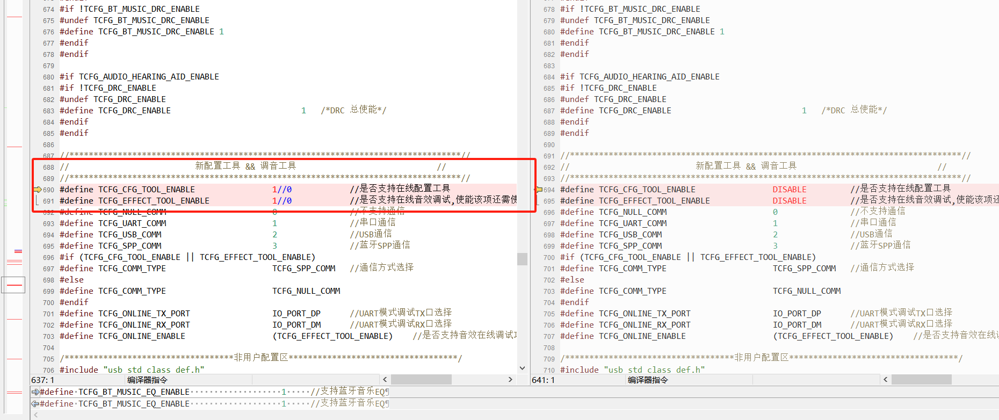

# 无连接自动关机时间

`apps\earphone\board\br36\board_ac700n_demo_cfg.h`

```c
#define TCFG_AUTO_SHUT_DOWN_TIME		          180   //没有蓝牙连接自动关机时间，3min 180
```

# 主从左右问题

TWS中的主从不固定。如果选择主机作为左耳，那么自动配对的话，主机有可能在左右两个声道耳机中。

- 自动配对，主机作为左耳的弊端，除非使用测试盒分左右。

# 获取Siri的全局状态

```c
if(app_var.siri_stu){
	user_send_cmd_prepare(USER_CTRL_HFP_GET_SIRI_CLOSE, 0, NULL);
}else{
	user_send_cmd_prepare(USER_CTRL_HFP_GET_SIRI_OPEN, 0, NULL);
}
```

# 关机的两种方式

```c
sys_enter_soft_poweroff(NULL);//带关机提示音
power_set_soft_poweroff();//不带关机提示音
```

# 关机电压参数

`apps\earphone\include\app_power_manage.h`

```c
#define LOW_POWER_SHUTDOWN      300  //低电直接关机电压-拔出不开机-开盖不开机
#define LOW_POWER_OFF_VAL   	310  //低电关机电压
#define LOW_POWER_WARN_VAL   	340  //低电提醒电压
#define LOW_POWER_WARN_TIME   	(5 * 60 * 1000)  //低电提醒时间
```

# 移植通话参数

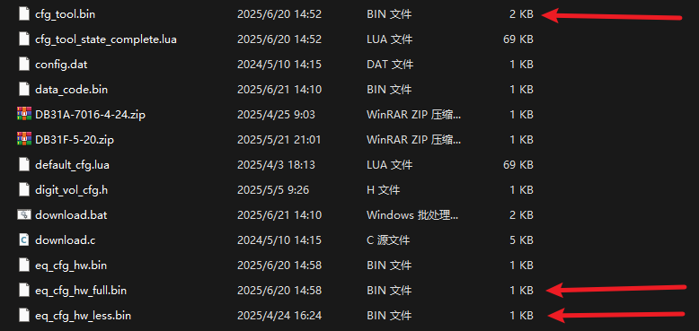

- 第一个是整个配置文件。

- 后者是EQ，两个都拿过去保险。

# 获取音乐的播放状态

`if(a2dp_get_status() == BT_MUSIC_STATUS_STARTING)`

```c
typedef enum {
    BT_MUSIC_STATUS_IDLE = 0,
    BT_MUSIC_STATUS_STARTING,
    BT_MUSIC_STATUS_SUSPENDING,
} BT_MUSIC_STATE;  //音乐状态
```

**BT_MUSIC_STATUS_IDLE** (值为0) - **空闲状态**

- 蓝牙音乐处于空闲状态，没有播放音乐，也没有正在进行的音乐操作

**BT_MUSIC_STATUS_STARTING** - **启动中状态**

- 蓝牙音乐正在启动或开始播放的过程中，可能是正在建立连接或初始化播放

**BT_MUSIC_STATUS_SUSPENDING** - **暂停中状态**

- 蓝牙音乐正在暂停或挂起的过程中，可能是正在停止播放或断开连接

# 通话断开连接

- 右边关机左边断开,右边没事
- 左边关机断开，右边断开重启，右边不会重连

`apps\earphone\movable\section.c`

```c
.lmp.text.cache.L2.a2dp
.tws.text.cache.L2.media_sync
.profile.text.cache.L2.a2dp
// .audio_decoder.text.cache.L2.run//注释
// .audio_decoder.text.cache.L2.file_read//注释
// .audio_decoder.text.cache.L2.frame_read//注释
// .aac_decoder.text.cache.L2.run//注释
```

`cpu\br30\audio_dec.c`

```c
#define DIGITAL_OdB_VOLUME              16384
//----------------------------新增-----------------------
#if TCFG_KEY_TONE_EN
extern int audio_key_tone_is_play(void);
#endif
```

**原理不清楚。**

# DAC三者的区别？？？？？

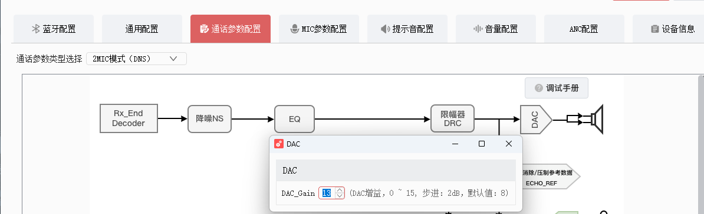

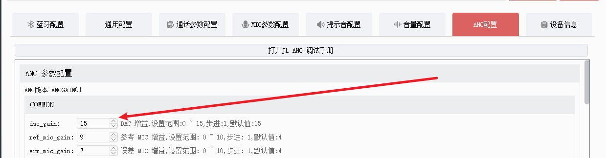

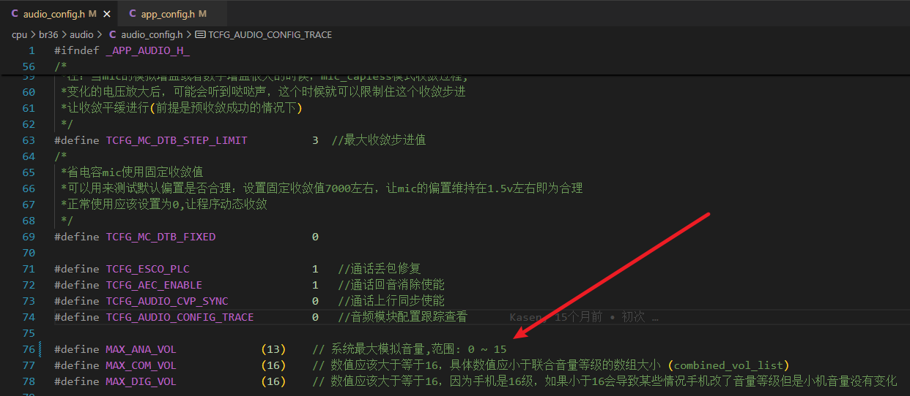

**TWS蓝牙耳机中，通话状态下的DAC增益，以及ANC状态的DAC增益以及系统最大模拟音量有什么不用？**

## 通话状态下的DAC增益

通话时DAC增益通常会被优化为：

- **较低的增益设置**：因为通话音频（语音）的动态范围相对较小，不需要很高的增益
- **功耗优先**：为了延长通话时间，系统会降低DAC的工作电平
- **语音频段优化**：重点在300Hz-3.4kHz的语音频段，对其他频段的要求不高

## ANC状态下的DAC增益

主动降噪开启时：

- **增益相对较高**：需要为ANC处理预留足够的动态范围
- **延迟要求严格**：ANC需要实时处理，DAC需要保持较快的响应速度
- **功耗增加**：ANC本身就是高功耗功能，DAC也需要更多电力支持

## 系统最大模拟音量差异

不同状态下的最大音量限制：

**音乐播放模式**：

- 最大模拟音量通常最高，可以达到系统设计的峰值
- 支持更大的动态范围和音量输出

**通话模式**：

- 最大音量会被限制，防止突然的大音量损伤听力
- 通常比音乐模式低6-10dB

**ANC模式**：

- 需要为降噪处理预留headroom，最大音量可能略有降低
- 但相比通话模式，音量上限仍然较高

这些设计差异的核心目的是在不同使用场景下平衡音质、功耗和用户安全。

## 疑问

**他们的值都是0-15，数值上有不有必然的关系？**

### 数值关系特点

**通话DAC增益 vs 音乐DAC增益**：

- 通话模式通常会比音乐模式低2-4个档位
- 例如：音乐模式DAC增益=12时，通话模式可能=8-10
- 这是因为通话对动态范围要求较低

**ANC状态下的调整**：

- ANC开启时，DAC增益可能需要预留1-2个档位的headroom
- 例如：非ANC时DAC增益=12，ANC时可能调整为10-11
- 这是为了避免ANC处理时的削波失真

**系统最大模拟音量的关联**：

- 通话模式：最大音量通常限制在10-12档位
- 音乐模式：可能允许达到13-15档位
- ANC模式：介于两者之间，通常12-14档位

# 修改麦克风的供电脚

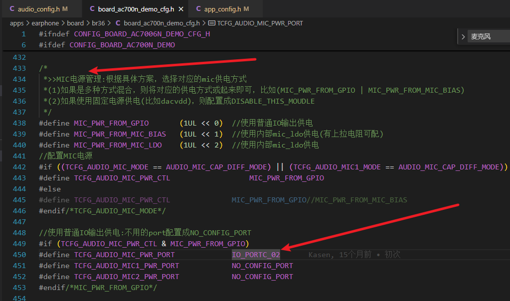

# ANC状态下触摸有电流声

如果没合ANC参数之前没有，合了之后才有，就是ANC参数的问题。

# 三方通话


# 入耳检测

检测到就放歌，出耳就暂停。

`apps\earphone\board\br36\board_ac700n_demo_cfg.h`

```c
#define TCFG_LP_EARTCH_KEY_ENABLE 			_TCFG_LP_EARTCH_KEY_ENABLE//0 //是否使能触摸按键用作入耳检测
#define TCFG_LP_EARTCH_KEY_CH               2                       //带入耳检测流程的按键号：0/1/2/3/4
#define TCFG_LP_EARTCH_KEY_REF_CH           1                       //入耳检测算法需要的另一个按键通道作为参考：0/1/2/3/4, 即入耳检测至少要使能两个触摸通道
#define TCFG_LP_EARTCH_SOFT_INEAR_VAL       3000                    //入耳检测算法需要的入耳阈值，参考文档设置
#define TCFG_LP_EARTCH_SOFT_OUTEAR_VAL      2000                    //入耳检测算法需要的出耳阈值，参考文档设置
```

## 处理事件

```c
#if TCFG_LP_EARTCH_KEY_ENABLE
#ifdef TCFG_EARTCH_EVENT_HANDLE_ENABLE
#undef TCFG_EARTCH_EVENT_HANDLE_ENABLE
#endif
#define TCFG_EARTCH_EVENT_HANDLE_ENABLE 	ENABLE_THIS_MOUDLE 		//入耳检测事件APP流程处理使能

#if TCFG_LP_SLIDE_KEY_ENABLE
#error "入耳检测和滑动功能不能同时打开"
#endif

#endif /* #if TCFG_LP_EARTCH_KEY_ENABLE */
```

```c
	case KEY_LOW_LANTECY:
        bt_set_low_latency_mode(!bt_get_low_latency_mode());
        //DhfAppCommand_DataNotify(EM_COMM_GAME_MODE_CHANGE_DEVICE_SEND);
        break;
     
    case KEY_DUT_MODE:
        if(get_bt_connect_status() <= BT_STATUS_AUTO_CONNECTINT){
            //无连接状态下进入DUT模式
            bt_bredr_enter_dut_mode(1, 1);
        }
        break;
#if TCFG_EARTCH_EVENT_HANDLE_ENABLE
        extern void eartch_event_deal_enable_cfg_save(u8 en);
    case KEY_EARTCH_ENABLE:
        eartch_event_deal_enable_cfg_save(1);
        break;
    case KEY_EARTCH_DISABLE:
        eartch_event_deal_enable_cfg_save(0);
        break;
#endif /* #if TCFG_EARTCH_EVENT_HANDLE_ENABLE */
```

`apps\earphone\eartch_event_deal.c`

```c
void eartch_event_deal_enable_cfg_save(u8 en)
{
#if TCFG_EARTCH_SWITCH_CFG_ENABLE
    if (en) {
        eartch_event_deal_enable();
        eartch_event_deal_en_cfg_save(1);
    } else {
        eartch_event_deal_disable();
        eartch_event_deal_en_cfg_save(0);
    }
#endif /* #if TCFG_EARTCH_SWITCH_CFG_ENABLE */
}
```

`apps\earphone\eartch_event_deal.c`

```c
static void eartch_event_deal_en_cfg_save(u8 cfg_data)
{
    u8 rdata = 0;
    int ret = 0;

    ret = syscfg_read(CFG_EARTCH_ENABLE_ID, &rdata, EARTCH_SWITCH_CFG_LEN);
    if (ret == EARTCH_SWITCH_CFG_LEN) {
        if (rdata == cfg_data) {
            log_debug("cfg same: %d", rdata);
            return;
        }
    }

    rdata = cfg_data;
    log_debug("cfg write: %d", rdata);
    ret = syscfg_write(CFG_EARTCH_ENABLE_ID, &rdata, EARTCH_SWITCH_CFG_LEN);
    if (ret != EARTCH_SWITCH_CFG_LEN) {
        log_error("cfg write err!!!");
    }
}
```

# 是否带APP

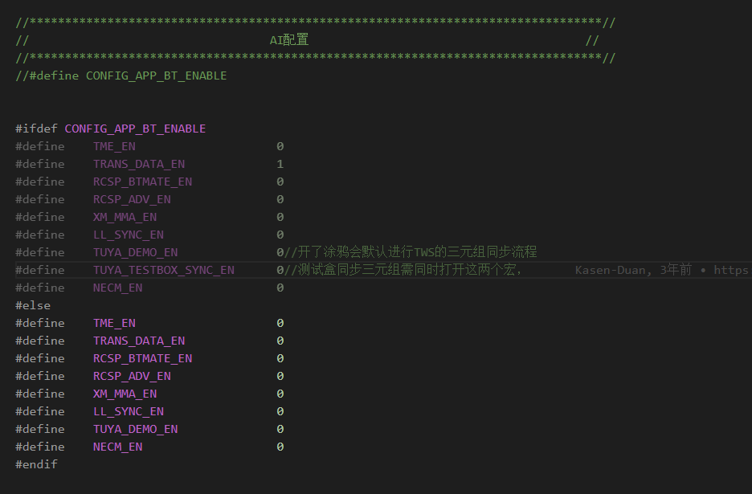

# 资源优化

复位情况：

https://www.kdocs.cn/l/curhyyhoWtZn?openfrom=docs

## 还是不行

**拉高通话主频**到128

```c
#if TCFG_ESCO_DL_NS_ENABLE
#define CONFIG_BT_CALL_HZ		        (60 * 1000000L)
#define CONFIG_BT_CALL_ADVANCE_HZ       (80 * 1000000L)
#define CONFIG_BT_CALL_16k_HZ	        (80 * 1000000L)
#define CONFIG_BT_CALL_16k_ADVANCE_HZ   (96 * 1000000L)
#define CONFIG_BT_CALL_DNS_HZ           (128 * 1000000L)
#define CONFIG_BT_CALL_DNS_ADVANCE_HZ   (128 * 1000000L)
#else
#define CONFIG_BT_CALL_HZ		        (128 * 1000000L)//  (64 * 1000000L)
#define CONFIG_BT_CALL_ADVANCE_HZ         (128 * 1000000L)//(64 * 1000000L)
#define CONFIG_BT_CALL_16k_HZ	        (768 * 100000L)
#define CONFIG_BT_CALL_16k_ADVANCE_HZ     (128 * 1000000L)//(80 * 1000000L)
#define CONFIG_BT_CALL_DNS_HZ             (128 * 1000000L)//(96 * 1000000L)
#define CONFIG_BT_CALL_DNS_ADVANCE_HZ   (128 * 1000000L)
#endif
```

**按键提示音也会出现复位现象**
