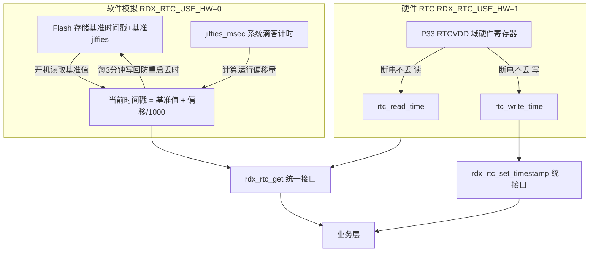

# rdx_rtc 改动说明

> 对比文件：`原版老项目的系统时基模拟RTC/` → `SDK/apps/earphone/rdx_rtc.c` + `SDK/apps/common/include/rdx_rtc.h`

---

## 一、Bug 修复

### 1. `rdx_rtc_get_string()` — 返回栈指针（未定义行为）

| | 老版本 | 新版本 |
|---|---|---|
| buffer 声明 | `char buffer[64]`（局部栈变量） | `static char buffer[64]` |
| 返回值 | 返回已销毁的栈地址，调用方读到的是随机数据 | 返回静态缓冲区地址，生命周期持续到下次调用 |

```c
// 老版本 — UB
char* rdx_rtc_get_string(void) {
    char buffer[64];          // 栈上
    ...
    return buffer;            // 函数返回后栈帧已销毁！
}

// 新版本 — 正确
char *rdx_rtc_get_string(void) {
    static char buffer[64];   // 静态存储
    ...
    return buffer;
}
```

---

### 2. SW 分支 `rdx_rtc_get()` — Flash 读取尺寸错误 + 计算顺序错误

**问题 A：只读了 `sizeof(time_t)` 字节，`begin_msec` 永远读不回来**

```c
// 老版本 — 写入完整结构体，却只读回一半
syscfg_write(VM_RDX_RTC_INIT_VALUE, &rtc_params, sizeof(time_t));    // 写：只存了 rtc_value
syscfg_read (VM_RDX_RTC_INIT_VALUE, &rtc_params, sizeof(time_t));    // 读：begin_msec 永远是 RAM 里的旧值

// 新版本 — 读写均使用完整结构体
syscfg_write(VM_RDX_RTC_INIT_VALUE, &rtc_params, sizeof(RTCParams)); // 写：rtc_value + begin_msec
syscfg_read (VM_RDX_RTC_INIT_VALUE, &rtc_params, sizeof(RTCParams)); // 读：两个字段均刷新
```

**问题 B：`ms_offset` 在 `syscfg_read` 之前计算，用的是内存里的旧 `begin_msec`**

```c
// 老版本 — 先算偏移，再读 Flash（顺序颠倒）
int ms_offset = jiffies_msec2offset(rtc_params.begin_msec, sys_timestamp); // ← 用旧值
syscfg_read(...);   // 之后才刷新 rtc_params

// 新版本 — 先读 Flash，再算偏移
syscfg_read(VM_RDX_RTC_INIT_VALUE, &rtc_params, sizeof(RTCParams));        // 先刷新
ms_offset = jiffies_msec2offset(rtc_params.begin_msec, sys_timestamp);     // ← 用新值
```

---

### 3. SW 分支 `rdx_rtc_set_timestamp()` — 无用变量

```c
// 老版本 — 声明了 rtc_timestamp 但从未使用（编译器 warning）
unsigned long sys_timestamp = jiffies_msec();
time_t rtc_timestamp;   // ← 未使用

// 新版本 — 删除
```

---

### 4. SW 分支 `rdx_rtc_init()` — 用 `rdx_rtc_get()` 检测首次初始化存在隐患

```c
// 老版本 — 调用 rdx_rtc_get()，此时 begin_msec=0，jiffies 偏移不可预测
rtc_timestamp = rdx_rtc_get();
if (rtc_timestamp == 0) { ... }

// 新版本 — 直接读 Flash 里的 rtc_value，检测更可靠
syscfg_read(VM_RDX_RTC_INIT_VALUE, &rtc_params, sizeof(RTCParams));
rtc_timestamp = rtc_params.rtc_value;
if (rtc_timestamp == 0) { ... }
```

---

### 5. HW 分支 `rdx_rtc_get()` — 时区偏移单位错误

```c
// 老版本 — 第二个参数单位应为秒，传入 8 实际只偏移了 8 秒
rdx_rtc_timestamp_to_timezone_string(time_stamp, 8, buffer);   // Bug: 8s ≠ UTC+8

// 新版本 — 移除 get() 内部的时区转换，get() 只返回纯 UTC 时间戳
// 需要时区时，业务层自行调用 rdx_rtc_timestamp_to_timezone_string(ts, 8*3600, buf)
```

---

## 二、硬件 RTC 分支 — 新 SDK API 迁移

| 功能 | 老版本（旧 SDK） | 新版本（新 SDK） |
|---|---|---|
| 写入时间 | `write_sys_time(&t)` | `rtc_write_time(&t)` |
| 读取时间 | `read_sys_time(&t)` | `rtc_read_time(&t)` |
| RTC 初始化 | 代码内手动调用 `rtc_init(&rtc_dev_data)` + `RTC_DEV_PLATFORM_DATA_BEGIN/END` | 由 `device_config.c` 设备表统一完成，`rdx_rtc_init()` 只做年份有效性检查 |
| 无效时间判断 | `timestamp == 0` | `t.year < 2025`（直接比较硬件寄存器年份，更直观） |
| include | `asm/rtc.h`（新SDK不存在） | `rtc/rtc_dev.h` |

---

## 三、架构优化

### 1. 具名宏替代裸 `#if 0` / `#if 1`

```c
// 老版本 — 语义不明，看不出切换的是什么
#if 1
    // 软件模拟代码
#else
    // 硬件 RTC 代码
#endif

// 新版本 — 一目了然，唯一切换点在头文件
// rdx_rtc.h
#define RDX_RTC_USE_HW  1   // 1=硬件RTC  0=软件模拟

// rdx_rtc.c
#if !RDX_RTC_USE_HW   /* 软件模拟 */
    ...
#else                  /* 硬件 RTC */
    ...
#endif
```

---

### 2. 私有变量按分支条件编译，消除 HW 分支的 unused warning

```c
// 老版本 — rtc_restore_timer / rtc_params 无条件编译，HW 分支产生 unused 警告
static u16 rtc_restore_timer = 0;
static RTCParams rtc_params;

// 新版本 — 仅软件模拟分支编译这两个变量
#if !RDX_RTC_USE_HW
static u16 rtc_restore_timer = 0;
static RTCParams rtc_params;
#endif
```

---

### 3. 公共函数从 `#if 1` 块里移出，两个分支均可用

老版本中 `get_string`、`get_string_date`、`get_string_time`、`rdx_rtc_test`、`rdx_rtc_store_timestamp`、`rdx_rtc_restore_timer_start/stop` 全部放在 `#if 1`（软件模拟）块内。若切换到硬件 RTC 分支，这些函数**不会编译**，链接时直接报错。

新版本按职责分层：

```
rdx_rtc.c 结构
├── 公共工具函数（无条件编译）
│   is_leap_year / days_in_month / calculate_weekday
│   timestamp_to_datetime / datetime_to_timestamp
│   timestamp_to_utc_string / timestamp_to_timezone_string
│   parse_utc_string / utc_string_to_timestamp
│
├── #if !RDX_RTC_USE_HW  ← 软件模拟私有实现
│   set_timestamp / get / store_timestamp
│   restore_timer_stop / restore_timer_start / init
│
├── #else  ← 硬件 RTC 私有实现
│   set_timestamp / get / store_timestamp(空)
│   restore_timer_stop(空) / restore_timer_start(空) / init
│
└── #endif
    公共业务函数（两分支共用，无需重复定义）
    get_string / get_string_date / get_string_time / test
    print_boot / print_poweroff
```

---

### 4. HW 分支补全 API stub，保证链接兼容

老版本 HW 分支缺少 `rdx_rtc_store_timestamp`、`rdx_rtc_restore_timer_stop`、`rdx_rtc_restore_timer_start` 的定义，业务层调用时**链接报错**。

新版本为这三个函数提供空操作实现，保持 API 一致，业务层无需关心底层使用的是哪种 RTC：

```c
void rdx_rtc_store_timestamp(void)    { /* HW: RTCVDD 掉电不丢，无需写 Flash */ }
void rdx_rtc_restore_timer_stop(void) { /* HW: 无定时器 */ }
void rdx_rtc_restore_timer_start(void){ /* HW: 无定时器 */ }
```

---

## 四、新增功能

### `rdx_rtc_print_boot()` / `rdx_rtc_print_poweroff()` — 开关机持久性探针

专门用于验证软关机后时间是否连续，在开机和关机时各调用一次，对比日志即可：

```c
// 开机日志
[RDX_RTC][BOOT][HW] 2026-03-17 10:05:03  ts=1742205903
[RDX_RTC] compare with last [POWEROFF] line to verify continuity

// 上次关机日志
[RDX_RTC][PWROFF][HW] 2026-03-17 10:04:58  ts=1742205898
```

- **SW 分支**：`rdx_rtc_print_poweroff()` 内部先调 `rdx_rtc_store_timestamp()` 强制写 Flash，再打印
- **HW 分支**：`rdx_rtc_store_timestamp()` 为空操作，RTCVDD 域掉电不丢时间，直接打印

---

## 五、头文件补全

| 声明 | 老版本 | 新版本 |
|---|:---:|:---:|
| `RDX_RTC_USE_HW` 宏（切换开关） | ✗ | ✓ |
| `rdx_rtc_get()` | ✗ | ✓ |
| `rdx_rtc_get_string()` | ✗ | ✓ |
| `rdx_rtc_get_string_date()` | ✗ | ✓ |
| `rdx_rtc_get_string_time()` | ✗ | ✓ |
| `rdx_rtc_store_timestamp()` | ✗ | ✓ |
| `rdx_rtc_restore_timer_start/stop()` | ✗ | ✓ |
| `rdx_rtc_timestamp_to_timezone_string()` | ✗ | ✓ |
| `rdx_rtc_print_boot()` | ✗ | ✓ |
| `rdx_rtc_print_poweroff()` | ✗ | ✓ |

---

## 六、改动总览

| 分类 | 改动数 |
|---|---|
| Bug 修复 | 5 |
| 新 SDK API 迁移 | 4 |
| 架构优化 | 4 |
| 新增功能 | 2 |
| 头文件补全 | 10 项声明 |

---

## 七、rdx_rtc.c 功能定位总结

**一句话概括：`rdx_rtc.c` 是一个双模时间源抽象层 + 时间工具函数库。**

上层业务只调用统一 API，底层时间来源由 `RDX_RTC_USE_HW` 宏一键切换，两个分支对上层完全透明。

### 两种时间来源



### 时间工具函数分层

| 层次 | 函数 | 作用 |
|------|------|------|
| **底层转换** | `rdx_rtc_is_leap_year` | 判断闰年 |
| | `rdx_rtc_days_in_month` | 获取某月天数（含闰年修正）|
| | `rdx_rtc_calculate_weekday` | Zeller公式计算星期几 |
| **核心转换** | `rdx_rtc_timestamp_to_datetime` | Unix时间戳 → DateTime结构体（含星期） |
| | `rdx_rtc_datetime_to_timestamp` | DateTime结构体 → Unix时间戳 |
| **字符串互转** | `rdx_rtc_timestamp_to_utc_string` | 时间戳 → `"YYYY-MM-DD HH:MM:SS"` |
| | `rdx_rtc_utc_string_to_timestamp` | `"YYYY-MM-DD HH:MM:SS"` → 时间戳 |
| | `rdx_rtc_parse_utc_string` | 字符串拆解为年月日时分秒各字段 |
| | `rdx_rtc_timestamp_to_timezone_string` | 时间戳+时区偏移(秒) → 本地时间字符串 |
| **业务接口** | `rdx_rtc_get` | 获取当前 UTC 时间戳（核心入口）|
| | `rdx_rtc_set_timestamp` | 设置时间（APP校时、默认值写入）|
| | `rdx_rtc_get_string` | 当前时间 → `"YYYY-MM-DD HH:MM:SS"` |
| | `rdx_rtc_get_string_date` | 当前日期 → `"YYYY-MM-DD"` |
| | `rdx_rtc_get_string_time` | 当前时间 → `"HH:MM:SS"` |
| **调试/验证** | `rdx_rtc_print_boot` | 开机打印时间，验证掉电持久性 |
| | `rdx_rtc_print_poweroff` | 关机打印时间（SW先写Flash） |
| | `rdx_rtc_test` | 打印完整时间字段，开发调试用 |

### 典型业务调用方式

```c
// 1. 初始化（main/app_main 调用一次）
rdx_rtc_init();

// 2. APP 校时（收到手机下发的 UTC 时间戳）
rdx_rtc_set_timestamp(utc_from_app);

// 3. 录音文件命名（用当前日期时间作文件名）
char *date = rdx_rtc_get_string_date();  // "2026-03-17"
char *time = rdx_rtc_get_string_time();  // "10:05:03"

// 4. 需要本地时间（UTC+8 中国标准时间）
char local_buf[32];
rdx_rtc_timestamp_to_timezone_string(rdx_rtc_get(), 8 * 3600, local_buf);

// 5. 关机时持久化（SW写Flash；HW空操作，两分支均安全）
rdx_rtc_print_poweroff();
```

### 两种模式对比

| 对比项 | 软件模拟（`RDX_RTC_USE_HW=0`） | 硬件 RTC（`RDX_RTC_USE_HW=1`） |
|--------|-------------------------------|-------------------------------|
| 掉电保持 | 靠 Flash 存储，重启有秒级误差 | P33 RTCVDD 域供电，断电不丢 |
| 精度漂移 | 累积误差随运行时间增大 | 硬件晶振，长期精度更高 |
| 持久化 | 每3分钟写一次 Flash | 无需写 Flash |
| 初始化 | 从 Flash 读基准值，为0则写默认时间 | 直接读寄存器，年份<2025则写默认时间 |
| 验证状态 | **未验证** | **已验证** |
