[官方文档链接1](https://www.kdocs.cn/l/csk1MNwvvo3R?openfrom=docs)
[官方文档链接2](https://alidocs.dingtalk.com/i/p/O2RXDJ2xY2dBnGZj/docs/dQPGYqjpJYggPGY9hEXeP0peWakx1Z5N)

# AI翻译与录音功能详细文档

---

## 一、芯片选型建议

> **做opus相关的AI翻译功能，701 RAM 640K，708 RAM 384K，709 RAM 320K，功能较多的项目，建议选择701系列芯片开发AI翻译类应用。**

音频翻译涉及大量音频数据的接收、编解码与中转，对算力和RAM有较高要求。

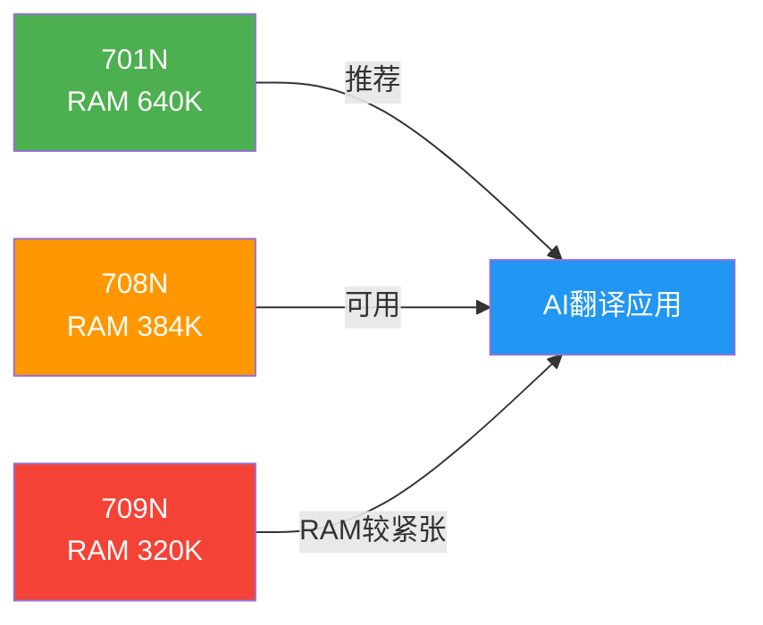

---

## 二、功能概览与芯片支持矩阵

| 功能 | 通信方式 | 支持芯片 | 备注 |
|------|----------|----------|------|
| 普通录音 | BLE、SPP | 697N、700N、701N、708N、709N、689N、710N | — |
| 普通录音 | ESCO | 所有支持蓝牙通话的芯片 | 走HFP，原理同手机语音助手，需APP获得手机权限 |
| 通话录音 | BLE、SPP | 701N、708N、709N、689N、710N | 710N仅支持录单路且仅支持单mic通话 |
| 音频翻译 | BLE、SPP | 701N、708N、709N、689N、710N | — |
| 音频翻译 | ESCO | 所有支持蓝牙通话的芯片 | 仅支持mic翻译，走HFP，需APP获得手机权限 |
| 通话翻译 | BLE、SPP | 701N、708N、709N、689N | — |

---

## 三、核心原理

### 3.1 整体协同架构

AI翻译不在耳机本地运算，本质是**耳机 + 手机APP 的协同流水线**：

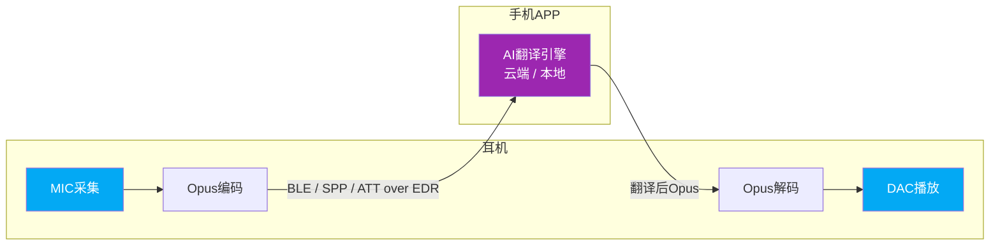

### 3.2 为什么用Opus而不是AAC/mSBC？

| 特性 | Opus | AAC | mSBC |
|------|------|-----|------|
| 设计目标 | 低延迟实时传输 | 高音质存储/流媒体 | 通话语音 |
| 延迟 | 极低（最低2.5ms帧长） | 较高 | 中等 |
| 码率灵活性 | 6kbps～510kbps任意调 | 固定档位 | 固定约64kbps |
| 网络抗丢包 | 内置FEC前向纠错 | 无 | 无 |
| 语音+音乐 | 两者都擅长 | 仅音乐 | 仅语音 |
| 授权费 | 完全免费开源 | 需授权费 | 免费 |
| 传输通道 | SPP/BLE/ATT over EDR | A2DP专用 | **eSCO专用，无法走SPP/BLE** |

> mSBC只能跑在eSCO链路，根本无法传给APP；AAC码率不够灵活；Opus低延迟+抗丢包+免费，天然适合实时AI流水线。

### 3.3 音质影响分析

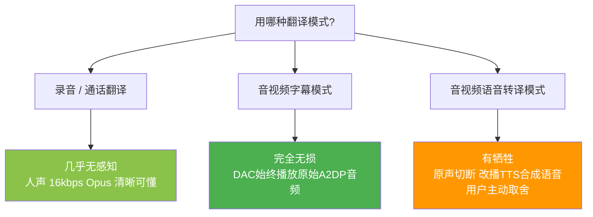

---

## 四、普通录音

非通话状态下三个通道（BLE/SPP/ESCO）均未占用，可任意选择。

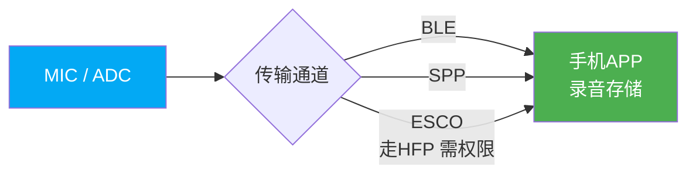

> ESCO方式实现原理同手机语音助手，需要APP获得手机录音权限。

---

## 五、通话录音

通话中ESCO已被通话数据占用，**只能通过BLE或SPP**将上下行音频同时中转到APP。

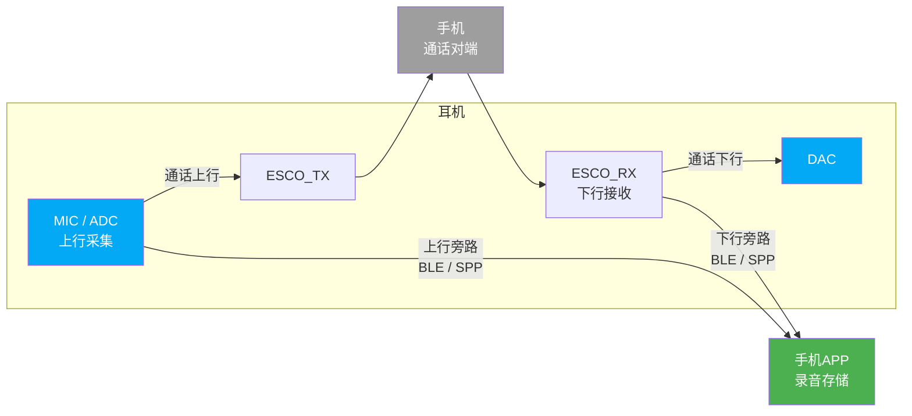

> 710N目前仅支持**录单路**（上行或下行其中一路），且仅支持单mic通话；其他芯片上下行均可录制。

---

## 六、音频翻译（录音翻译 / 面对面翻译）

三个通道均未被占用，可选BLE、SPP（推荐）或ESCO（仅mic翻译）。

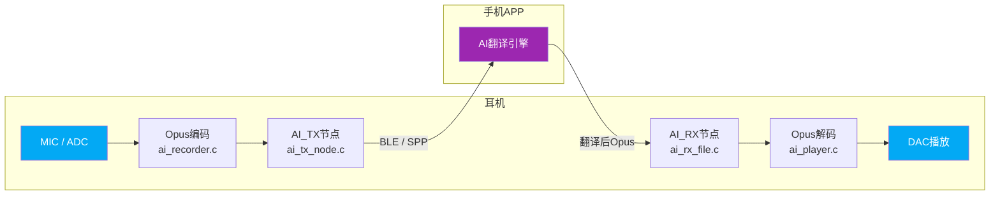

**SDK配置要点：**
- "智能语音"页面选择 **AI翻译**，使能右上角按钮
- 录音模式：仅用 `ADC → AI_TX` 单向流
- 录音翻译模式：`ADC → AI_TX` 和 `AI_RX → DAC` 双向流同时使能

---

## 七、音视频翻译

### 7.1 字幕模式（TWS耳机_AI翻译）

DAC始终播放原声，翻译结果以**字幕**形式在APP显示，**对音质零影响**。

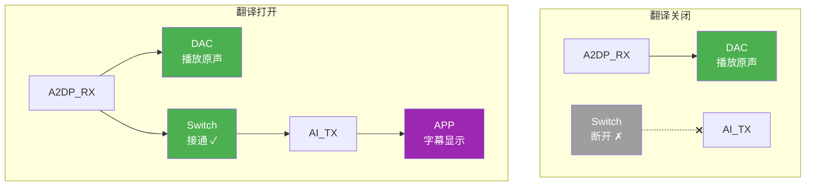

### 7.2 语音转译模式（TWS耳机_AI翻译（语音转译））

DAC切换播放原声或翻译后语音，用户主动取舍音质。

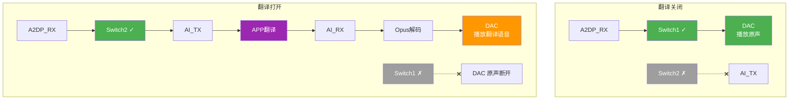

> 需要在 `ai_audio_config.h` 使能 `AI_AUDIO_A2DP_TRANSLATION_RECV_ENABLE`

---

## 八、通话翻译

通话翻译是最复杂的场景，**上下行各自独立**走翻译链路。

### 8.1 完整数据流

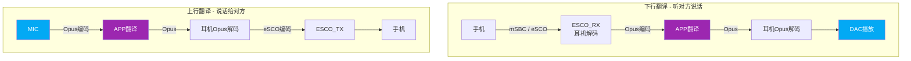

### 8.2 Switch路由逻辑

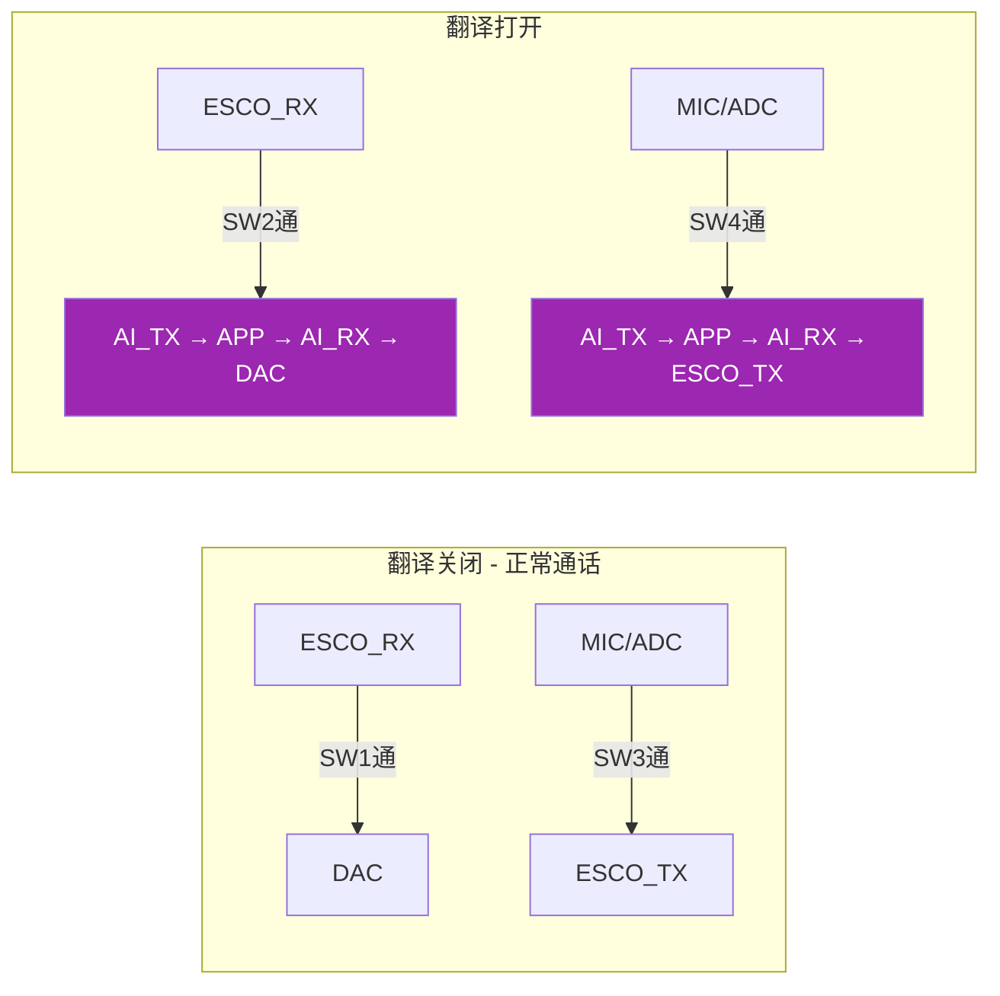

| 状态 | Switch(1) | Switch(2) | Switch(3) | Switch(4) |
|------|-----------|-----------|-----------|-----------|
| 翻译关闭 | 通（ESCO_RX→DAC） | 断 | 通（ADC→ESCO_TX） | 断 |
| 翻译打开 | 断 | 通（ESCO_RX→AI_TX） | 断 | 通（ADC→AI_TX） |

### 8.3 编码模型选择

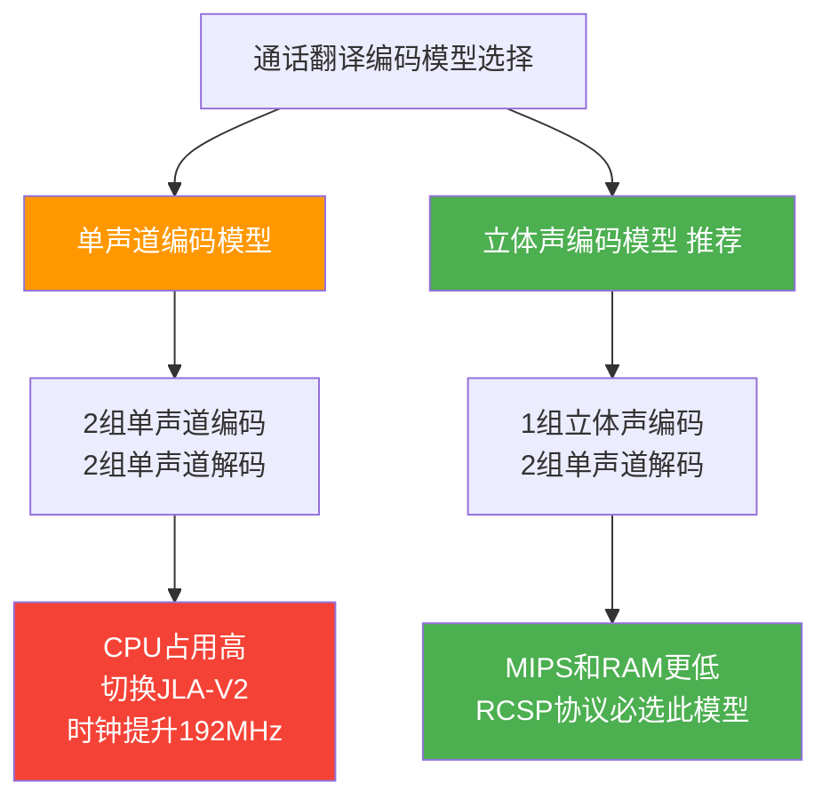

**立体声编码开启方式：**

```c
// 开启opus立体声编码（celt mode）
#define TCFG_ENCODER_CHANNEL_NUM (BIT(0) | BIT(1))
```

### 8.4 带宽调优

出现通话翻译卡顿（如打印 `spp OVERFLOW, please check======`）时，适当调大ACL链路带宽比例。

---

## 九、iOS平台特殊说明

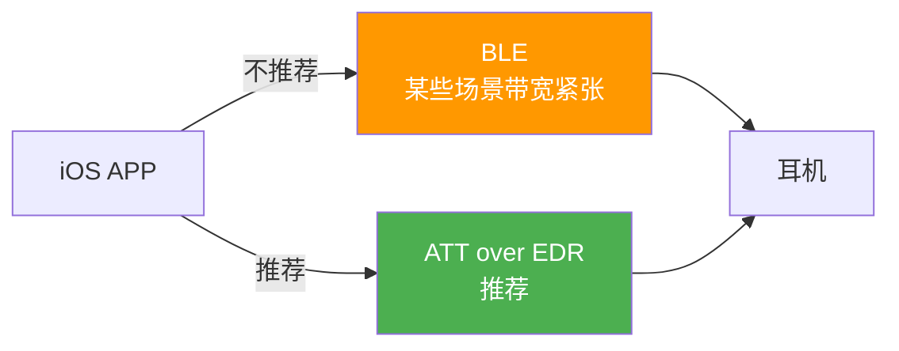

耳机端需使能 `ATT_OVER_EDR` profile。

---

## 十、源文件架构

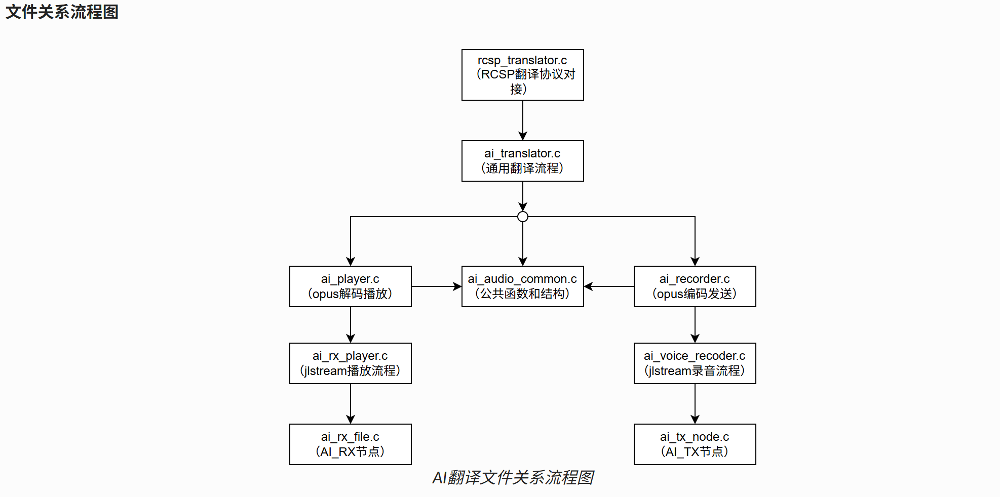

- SDK默认将ai_translator.c挂靠到rcsp_translator.c中，如果有其他协议需求，可以将ai_translator.c中的接口集成到其他协议中。
  - **opus数据可以挂靠到不同的BLE协议。目前是依靠RCSP的杰理官方BLE协议发送到杰理之家APP。**
- ai_player.c自身可以脱离ai_translator.c单独使用，用于播放opus数据流。
- ai_recorder.c自身可以脱离ai_translator.c单独使用，用于采集编码opus数据流。

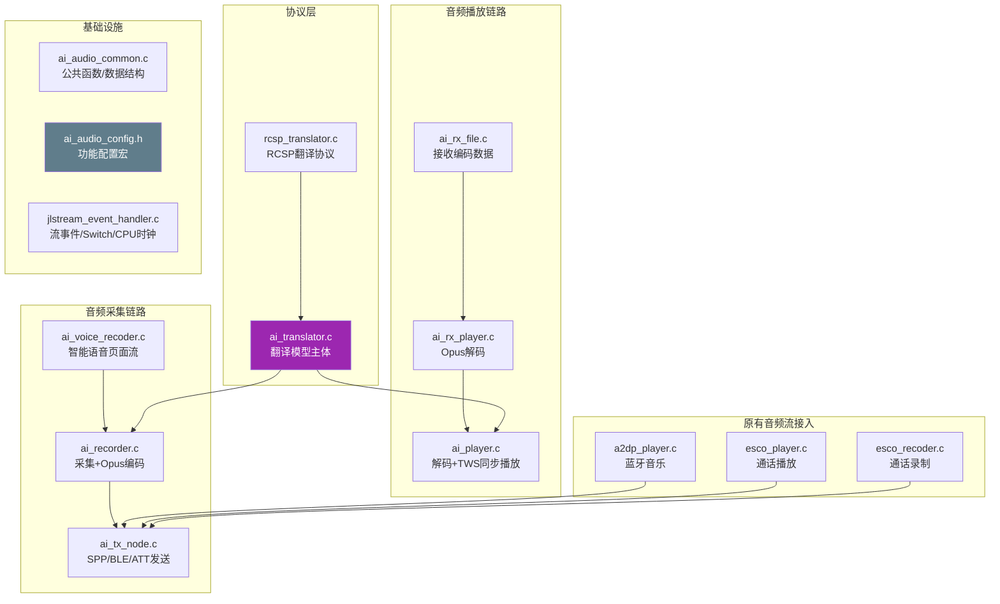

| 文件 | 职责 |
|------|------|
| `ai_translator.c` | AI翻译功能主体，内置常用翻译模型，可对接不同客户协议 |
| `ai_player.c` | 接收Opus数据，解码播放，分发给TWS从机同步 |
| `ai_recorder.c` | 采集音频，编码成Opus，发送给APP |
| `ai_audio_common.c` | 公共函数与数据结构 |
| `ai_audio_config.h` | 功能配置宏定义 |
| `rcsp_translator.c` | 对接杰里之家APP的RCSP翻译协议 |
| `ai_tx_node.c` | 通过SPP/BLE/ATT over EDR发送编码音频 |
| `ai_rx_file.c` | 接收编码音频，传给后级节点 |
| `ai_voice_recoder.c` | 智能语音页面录音数据流（ADC→AI_TX） |
| `ai_rx_player.c` | AI_RX相关解码数据流（AI_RX→DAC） |
| `a2dp_player.c` | 蓝牙音乐页面A2DP播放流控制 |
| `esco_player.c` | 蓝牙通话页面eSCO播放流控制 |
| `esco_recoder.c` | 蓝牙通话页面eSCO录制流控制 |
| `jlstream_event_handler.c` | 音频流事件响应，CPU时钟分配，Switch节点行为 |

> `ai_player.c` 和 `ai_recorder.c` 均可脱离 `ai_translator.c` 单独使用。

---

## 十一、功能使能配置

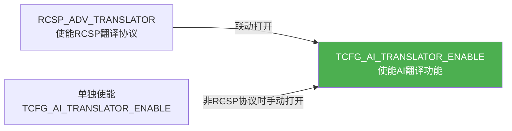

---

## 十二、调试技巧

### 缓存空间调试
```c
// 打印写入/读取缓存长度及当前缓存空间
#define AI_AUDIO_RECV_SPEED_DEBUG  0  // 改为1开启
```

### RCSP收发数据打印
在 `rcsp_interface.c` 中开启调试打印。

### 屏蔽干扰打印
调试APP→耳机下行时，若 `APP_SPP_ONLINE_DEBUG` 已开启，`spp_online_db.c` 的收数打印会造成翻译卡顿，建议注释掉该打印。

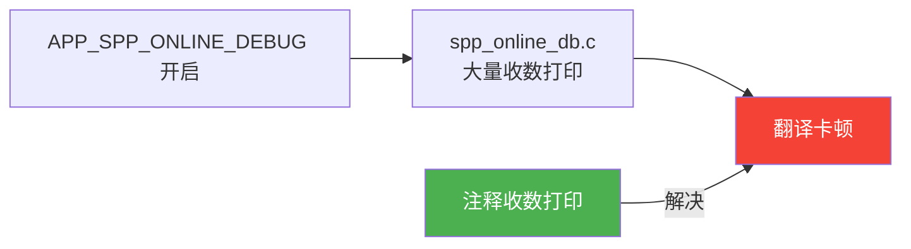

---

## 十三、API接口

参考以下头文件（官方文档待补充）：
- `ai_audio_common.h`
- `ai_audio_config.h`
- `ai_translator.h`
- `ai_player.h`
- `ai_recorder.h`
