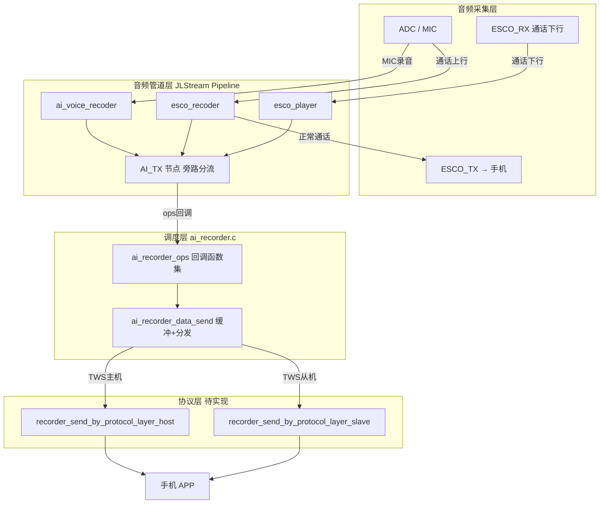
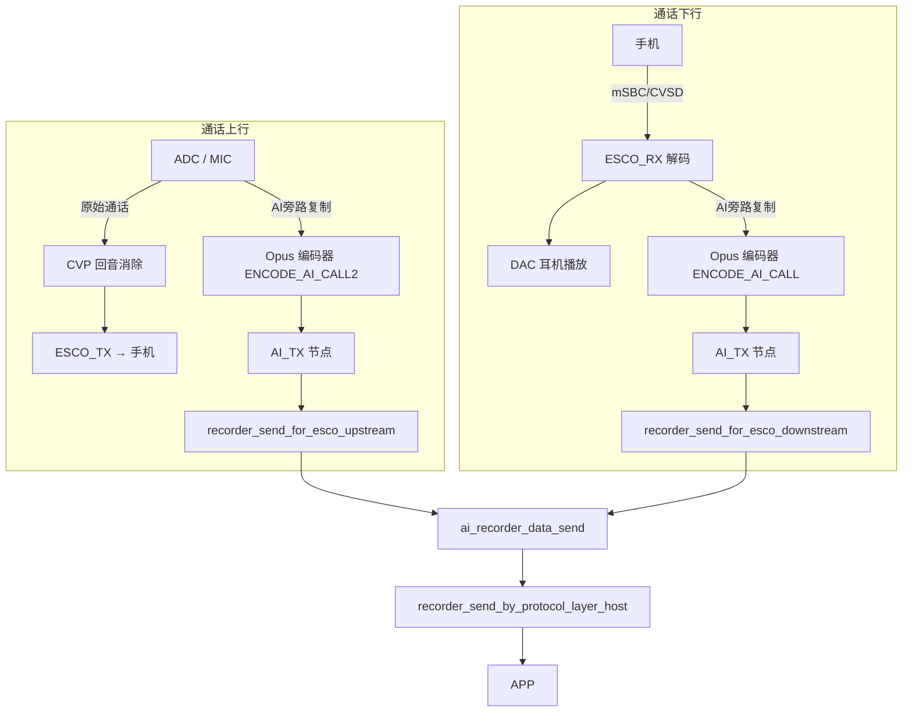
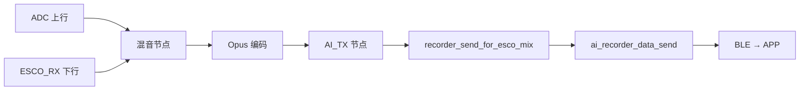
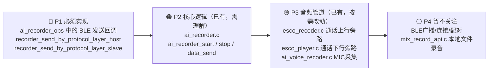

# 录音卡核心代码分析

> 产品定位：直接开MIC录制外界声音 + 通话录音，均通过BLE传输到APP。
> BLE对接APP部分尚未实现，本文重点聚焦音频侧。

---

## 一、整体架构



---

## 二、功能一：MIC 直接录音

外界环境音采集，与蓝牙通话完全无关。

### 数据流


### 启动调用链

```
ai_recorder_start(ch, fmt, AI_AUDIO_MEDIA_TYPE_VOICE, tws_rec)
    └── ai_recorder_try_to_set_func()
            └── ai_voice_recoder_open(coding_type, 0)
                    └── ai_voice_recoder_set_ai_tx_node_func(
                              ops.recorder_send_for_dev_mic)
```

### 关键文件

| 文件 | 作用 |
|------|------|
| `apps/common/ai_audio/ai_recorder.c` | **核心调度**，start/stop/data_send |
| `apps/common/ai_audio/ai_recorder.h` | ops 结构体定义，**对接 BLE 的接口在这里** |
| `apps/common/ai_audio/ai_voice_recoder.c` | MIC 采集 → AI_TX 节点 |

### 需要你填的回调

```c
// ai_recorder.h 中的 ops 结构体
struct ai_recorder_ops {
    int (*recorder_send_for_dev_mic)(u8 *buf, u32 len);  // ← MIC数据，你写BLE发送
    int (*recorder_send_by_protocol_layer_host)(...);     // ← BLE实际发送函数
    int (*recorder_send_by_protocol_layer_slave)(...);    // ← TWS从机BLE发送
    // ...
};
```

---

## 三、功能二：通话录音

通话期间同时录制**上行（我说的话）**和**下行（对方说的话）**，均旁路传给 APP。
通话路径本身不受任何影响。

### 数据流（上下行分开）



### 数据流（混音模式，上下行合并为一路）



### 启动调用链（以上下行分开为例）

```
ai_recorder_start(ch0, fmt, AI_AUDIO_MEDIA_TYPE_ESCO_UPSTREAM, ...)
ai_recorder_start(ch1, fmt, AI_AUDIO_MEDIA_TYPE_ESCO_DOWNSTREAM, ...)
    └── ai_recorder_set_esco_stream_param()
            ├── esco_player_close() / esco_recoder_close()  // 先关再重开
            ├── esco_player_open_extended(addr, ESCO_PLAYER_EXT_TYPE_AI, fmt)
            │       └── 配置 ENCODE_AI_CALL Opus 编码器（下行）
            ├── esco_player_set_ai_tx_node_func(ops.recorder_send_for_esco_downstream)
            ├── esco_recoder_open_extended(addr, ESCO_RECODER_EXT_TYPE_AI, fmt)
            │       └── 配置 ENCODE_AI_CALL2 Opus 编码器（上行）
            └── esco_recoder_set_ai_tx_node_func(ops.recorder_send_for_esco_upstream)
```

> **注意**：开启 AI 录音时，eSCO player/recoder 会先 close 再以 AI 模式重新 open，
> 这会短暂打断通话，需要在通话建立稳定后再触发。

### 关键文件

| 文件 | 作用 |
|------|------|
| `apps/common/ai_audio/ai_recorder.c` | **核心调度**，通话录音入口 |
| `audio/interface/recoder/esco_recoder.c` | 上行ADC旁路，挂载AI_TX节点 |
| `audio/interface/player/esco_player.c` | 下行ESCO_RX旁路，挂载AI_TX节点 |

### 三种 media_type 对比

| media_type | 上行 | 下行 | ops 回调 | 适用场景 |
|------------|------|------|----------|----------|
| `ESCO_UPSTREAM` | ✅ | ❌ | `recorder_send_for_esco_upstream` | 只录我说的话 |
| `ESCO_DOWNSTREAM` | ❌ | ✅ | `recorder_send_for_esco_downstream` | 只录对方说的话 |
| `ESCO_MIX` | ✅ | ✅ | `recorder_send_for_esco_mix` | 合并双方为一路 |

---

## 四、你需要着重关注的代码优先级



---

## 五、对接 BLE 时的最小实现步骤

1. **注册 ops**：实现 6 个回调函数（至少先实现 `host` 发送 + 两个你要录的音源）
2. **调用 init**：`ai_recorder_init(&your_ops)`
3. **触发录音**：
   - MIC 录音：`ai_recorder_start(0, &fmt, AI_AUDIO_MEDIA_TYPE_VOICE, 0)`
   - 通话录音：`ai_recorder_start(0, &fmt, AI_AUDIO_MEDIA_TYPE_ESCO_MIX, 0)`（推荐混音模式，一路数据传 APP 更简单）
4. **BLE 发送**：在 `recorder_send_by_protocol_layer_host` 中调用你的 BLE/SPP 发包接口
5. **停止**：`ai_recorder_stop(ch)`

---

## 六、编码格式参考

```c
struct ai_audio_format fmt = {
    .coding_type = AUDIO_CODING_OPUS,
    .sample_rate = 16000,   // 16kHz，语音场景足够
    .frame_dms   = 200,     // 20ms 帧，低延迟
    .bit_rate    = 16000,   // 16kbps，语音清晰可懂
    .channel     = 1,       // 单声道
};
```

> Opus 16kbps / 16kHz / 20ms帧 是通话录音的推荐参数，
> 既能保证语音可懂性，又对 BLE 带宽友好。
