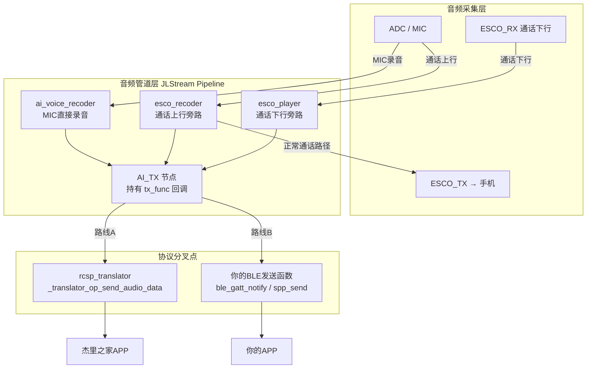
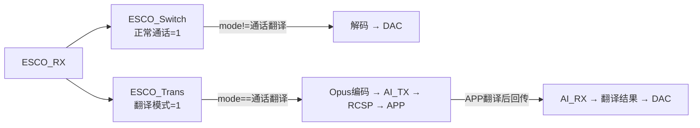
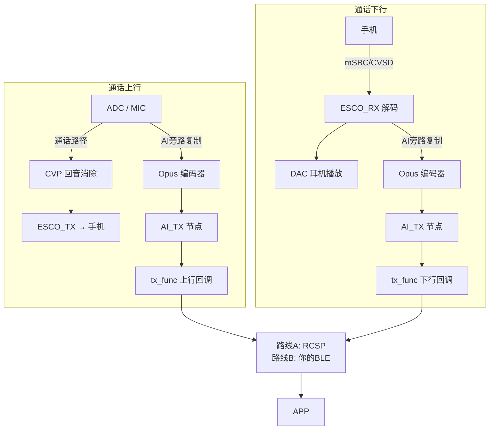

# 录音卡核心代码分析

> 产品定位：直接开MIC录制外界声音 + 通话录音，均通过BLE传输到APP。
>
> **Demo SDK说明**：当前仓库（JL701N_翻译耳机_V3.0.0）已包含音频管道的全部节点代码（ai_tx_node.c、ai_rx_file.c、ai_voice_recoder.c、esco_recoder.c、esco_player.c、a2dp_player.c、ai_rx_player.c、rcsp_translator.c）。
> `ai_recorder.c` / `ai_player.c` 的集中调度层不在此Demo中，在量产SDK的 `apps/common/ai_audio/` 目录，需结合量产SDK验证完整调用链。

---

## 一、两条路线总览

**耳机侧的音频管道完全相同**，区别只在最后"数据发给谁、按什么协议发"。

```mermaid
flowchart TB
    subgraph 耳机固件（两条路线共用）
        MIC[MIC / ADC] --> ENC[Opus 编码]
        ESCO_UP[ESCO 上行] --> ENC
        ESCO_DN[ESCO 下行] --> ENC2[Opus 编码]
        ENC --> AI_TX[AI_TX 节点\ntx_func 回调]
        ENC2 --> AI_TX
    end

    AI_TX -->|路线A\nRCSP私有协议| RCSP[rcsp_translator.c\n封装RCSP包]
    AI_TX -->|路线B\n自研协议| CUSTOM[你自己的\nBLE发送函数]

    RCSP -->|BLE/SPP| JL_APP[杰里之家 APP\n官方翻译/录音]
    CUSTOM -->|BLE/SPP| YOUR_APP[你自己的 APP\n自定义处理]

    style RCSP fill:#1565C0,color:#fff
    style CUSTOM fill:#2E7D32,color:#fff
    style JL_APP fill:#1565C0,color:#fff
    style YOUR_APP fill:#2E7D32,color:#fff
```

| 对比项 | 路线A：RCSP（默认公版方案） | 路线B：自研协议 |
|--------|---------------------------|----------------|
| 协议层 | `rcsp_translator.c`（已有，完整实现） | 你自己写 |
| 对接APP | 杰里之家官方APP | 你自己的APP |
| 启用方式 | 开 `RCSP_ADV_TRANSLATOR=1` | 开 `TCFG_AI_TX_NODE_ENABLE=1`，注册自己的回调 |
| 翻译功能 | 开箱即用（APP云端翻译） | 自行在APP实现 |
| 录音功能 | 支持（MODE_RECORD） | 自行实现 |
| 开发工作量 | 耳机侧几乎零改动 | 需要实现BLE协议+APP |
| 灵活性 | 受RCSP协议约束 | 完全自由 |

> **结论**：两条路线的**耳机音频侧代码完全一样**，差异完全在协议层（`tx_func` 注册的是谁的函数）。

---

## 二、整体音频架构（两条路线共用）



---

## 三、路线A：RCSP私有协议（对接杰里之家APP）

### 3.1 默认状态

当前 Demo SDK 中所有翻译相关宏**默认全部关闭**：

```c
// rcsp_cfg.h:215
#define RCSP_ADV_TRANSLATOR          0   // 翻译功能，默认关

// jlstream_node_cfg.h:34-35
#define TCFG_AI_RX_NODE_ENABLE       0   // AI_RX 节点，默认关
#define TCFG_AI_TX_NODE_ENABLE       0   // AI_TX 节点，默认关

// app_config.h:80
#define TCFG_THIRD_PARTY_PROTOCOLS_SEL  0   // RCSP 协议本身，默认关
```

> 这意味着当前固件编译出来是一个**普通蓝牙耳机**，翻译/录音代码框架存在但全部被条件编译隔离。

### 3.2 开启方式

在配置工具（或直接修改头文件）中打开以下宏：

```c
// 第一步：开启 RCSP 协议
#define TCFG_THIRD_PARTY_PROTOCOLS_SEL  RCSP_MODE_EN

// 第二步：开启翻译功能（会联动打开 AI_TX/AI_RX 节点和 Opus 编码器）
// 在 rcsp_cfg.h 或配置工具"智能语音→AI翻译"中开启
#define RCSP_ADV_TRANSLATOR  1
// → app_config.h:294 会自动推导出：
//   TCFG_AI_TX_NODE_ENABLE = 1
//   TCFG_AI_RX_NODE_ENABLE = 1
//   TCFG_ENC_OPUS_ENABLE   = 1
```

### 3.3 RCSP 路线完整数据流

```mermaid
flowchart TB
    subgraph 耳机发送侧
        MIC[MIC/ESCO] --> OPUS[Opus编码\n16kHz/16kbps/20ms]
        OPUS --> AI_TX[AI_TX节点]
        AI_TX -->|tx_func| SEND[_translator_op_send_audio_data\nrcsp_translator.c]
        SEND --> PACK[封装RCSP包\nOpCode=0x34 op=0x03\nsource+encode+count+crc+len+data]
        PACK -->|BLE GATT Notify\n或 SPP| APP[杰里之家 APP]
    end

    subgraph 耳机接收侧（翻译结果回传）
        APP -->|翻译后Opus| RECV[rcsp_translator\nrecv_ch 接收缓冲]
        RECV --> AI_RX_FILE[ai_rx_file.c\nJL_rcsp_translator_recv_ch_get_frame]
        AI_RX_FILE --> AI_RX_PLAYER[ai_rx_player.c\nOpus解码]
        AI_RX_PLAYER --> DAC[DAC播放]
    end
```

### 3.4 RCSP 音频包格式

```c
// rcsp_translator.h:47
// OpCode 0x34, op 0x03 — 音频数据包格式
struct translator_op_03_audio_format {
    u8  source;   // 音频来源，见下表
    u8  encode;   // 编码类型（0x02 = OPUS）
    u8  count;    // 分包计数，倒序到0为结束包
    u16 crc;      // 音频数据CRC校验
    u16 len;      // 音频数据长度（字节）
    // u8 buf[len];  // 紧随其后的Opus数据
};

// source 字段定义（rcsp_translator.h:31）
#define RCSP_TRANSLATOR_AUDIO_SOURCE_DEV_MIC         0x01  // MIC直接录音
#define RCSP_TRANSLATOR_AUDIO_SOURCE_PHONE_MIC       0x02  // 手机MIC（ESCO上行）
#define RCSP_TRANSLATOR_AUDIO_SOURCE_ESCO_UPSTREAM   0x03  // 通话上行录音/翻译
#define RCSP_TRANSLATOR_AUDIO_SOURCE_ESCO_DOWNSTREAM 0x04  // 通话下行录音/翻译
#define RCSP_TRANSLATOR_AUDIO_SOURCE_MSBC            0x05  // A2DP音乐翻译
```

### 3.5 RCSP 工作模式（mode）

APP 通过 `OpCode=0x34 op=0x01` 下发 mode 指令控制耳机工作在哪种模式，**耳机侧音频数据流不变，只是 APP 侧行为不同**：

```c
// rcsp_translator.h:16
#define RCSP_TRANSLATOR_MODE_IDLE                    0x00  // 空闲
#define RCSP_TRANSLATOR_MODE_RECORD                  0x01  // 纯录音（APP存文件）
#define RCSP_TRANSLATOR_MODE_RECORD_TRANSLATION      0x02  // 录音+翻译（APP云端翻译后回传）
#define RCSP_TRANSLATOR_MODE_CALL_TRANSLATION        0x03  // 通话翻译
#define RCSP_TRANSLATOR_MODE_A2DP_TRANSLATION        0x04  // 音乐翻译
#define RCSP_TRANSLATOR_MODE_FACE_TO_FACE_TRANSLATION 0x05 // 面对面翻译
```

**耳机侧都是同一套发送流程**，`source` 字段告诉 APP 这帧数据来自哪路音频，APP 根据 `mode` 决定是存文件还是送云端翻译再回传。

### 3.6 tx_func 在 RCSP 路线中的注册位置

RCSP 路线中，`rcsp_translator.c` 内部在合适时机调用各路的 `set_ai_tx_node_func` 来注册自己的发送函数：

```
rcsp_translator 初始化/模式切换时：
    ai_voice_recoder_set_ai_tx_node_func(rcsp内部的mic_send_func)
    esco_recoder_set_ai_tx_node_func(rcsp内部的esco_up_send_func)
    esco_player_set_ai_tx_node_func(rcsp内部的esco_dn_send_func)
    a2dp_player_set_ai_tx_node_func(rcsp内部的a2dp_send_func)
        ↓
    每个send_func 内部调用 _translator_op_send_audio_data(buf, len, source, count)
        ↓
    封装成 RCSP 包通过 BLE/SPP 发出
```

### 3.7 RX 侧：接收 APP 下发的翻译结果

```
APP 下发 Opus 数据
    ↓
rcsp_cmd_recieve.c 收到 OpCode=0x34 op=0x03 包
    ↓
translator_recv_ch_put_frame(source, buf, len, timestamp)
    → 存入 rx_ch[ch].head 帧链表
    ↓
ai_rx_file.c 的 ai_rx_get_frame() 轮询取帧
    → JL_rcsp_translator_recv_ch_get_frame(source)
    ↓
ai_rx_player.c → Opus解码 → DAC 播放
```

> `ai_rx_file.c` 与 `rcsp_translator.c` 之间是**硬耦合**：
> `ai_rx_file.c:30` 直接调用 `JL_rcsp_translator_recv_ch_get_frame()`。
> 若走自研协议，接收侧也需要提供等效的帧队列接口，或绕开 `ai_rx_file.c` 自行驱动 `ai_rx_player`。

### 3.7 翻译/录音的触发方式

**耳机固件本身不主动发起任何翻译或录音，完全由 APP 侧通过 RCSP 命令控制。**

#### 正常流程：APP 下发命令

```
用户在杰里之家APP点击"开始翻译/录音"
    ↓
APP 发送 RCSP 命令（BLE/SPP）
    OpCode = 0x34（翻译功能 JL_OPCODE_TRANSLATOR）
    op     = 0x01（set_mode）
    data   = [mode, encode, ch, sr_high, sr_mid_h, sr_mid_l, sr_low]
    ↓
耳机 rcsp_cmd_recieve.c:685
    JL_rcsp_translator_functions() 接收并分发
    ↓
rcsp_translator.c:1157  _translator_op_set_mode()
    解析 mode → 启动对应音频管道 → 注册 tx_func → 开始发 Opus 回 APP
```

APP 可以下发的 mode 值（rcsp_translator.h:16）：

| mode 值 | 含义 | 耳机动作 |
|---------|------|----------|
| `0x00` IDLE | 停止 | 关闭所有录音/翻译管道 |
| `0x01` RECORD | 纯录音 | 开 MIC→Opus→发APP，APP存文件 |
| `0x02` RECORD_TRANSLATION | 录音翻译 | 开 MIC→Opus→发APP，APP翻译后回传播放 |
| `0x03` CALL_TRANSLATION | 通话翻译 | ESCO上下行旁路→Opus→发APP，Switch切换路由 |
| `0x04` A2DP_TRANSLATION | 音乐翻译 | A2DP旁路→Opus→发APP，Switch切换路由 |
| `0x05` FACE_TO_FACE | 面对面翻译 | 开 MIC→Opus→发APP（双向翻译） |

#### 耳机侧按键触发（API存在，未挂接）

SDK 提供了耳机主动触发录音的 API（rcsp_translator.c:995），但在此 Demo 中**没有任何按键事件调用它**：

```c
// 已有API，未挂接到按键
JL_rcsp_translator_manual_record_start();  // 主动开始 MIC 录音
JL_rcsp_translator_manual_record_stop();   // 主动停止 MIC 录音
```

内部实现是直接调用 `ai_voice_recoder_open()` 开启 MIC 管道，不依赖 APP 的 set_mode 命令，适合"按住说话"类交互。

**如需挂接到按键**，在按键事件处理代码里加入调用即可：

```c
// 示例：在按键长按事件里
case KEY_LONG_PRESS:
    if (!tlr_hdl.record_state) {
        JL_rcsp_translator_manual_record_start();
    } else {
        JL_rcsp_translator_manual_record_stop();
    }
    break;
```

> 注意：`manual_record_start` 只支持 MIC 直接录音（`AUDIO_SOURCE_DEV_MIC`），
> 通话录音和翻译模式仍需 APP 下发 set_mode 命令触发。

---

### 3.8 Switch 节点路由（翻译模式下的音频切换）

翻译耳机的 ESCO/A2DP pipeline 里有 Switch 节点，根据当前 mode 动态路由音频：

```c
// jlstream_event_handler.c:332
// 翻译模式下 ESCO_Trans=1（音频转走翻译链路），ESCO_Switch=0（正常播放关闭）
static int esco_trans_switch_get_status() {
    struct translator_mode_info minfo;
    JL_rcsp_translator_get_mode_info(&minfo);
    return (minfo.mode == RCSP_TRANSLATOR_MODE_CALL_TRANSLATION) ? 1 : 0;
}
```



---

## 四、路线B：自研协议（对接自己的APP）

### 4.1 核心思路

不使用 RCSP，完全绕开 `rcsp_translator.c`。
只需要：
1. 开启 AI_TX 节点
2. 把**你自己的 BLE 发送函数**注册为 `tx_func`
3. 耳机管道自动编码并回调你的函数，你直接发给自己的 APP


### 4.2 最小宏配置

```c
// 只需要这三个，不需要 RCSP 任何东西
#define TCFG_AI_TX_NODE_ENABLE   1   // jlstream_node_cfg.h
#define TCFG_ENC_OPUS_ENABLE     1   // 开 Opus 编码器
// AI_RX 节点只有需要从APP接收音频回放时才开：
#define TCFG_AI_RX_NODE_ENABLE   1   // 可选，只录音时不需要
```

不需要开：
- `RCSP_ADV_TRANSLATOR`
- `TCFG_THIRD_PARTY_PROTOCOLS_SEL`
- `TCFG_AI_TRANSLATOR_ENABLE`

### 4.3 实现方式一：直接调用（最简单，无需量产SDK）

直接在你的代码里调用各路的 `set_ai_tx_node_func`，传入你自己的发送函数：

```c
// 你自己实现的 BLE 发送函数
static int my_ble_send(u8 *buf, u32 len)
{
    // buf 是 Opus 裸帧数据（40字节/帧，20ms）
    // 直接通过你的 BLE GATT Notify 或 SPP 发出去
    return ble_gatt_notify(MY_CHAR_HANDLE, buf, len);
}

// MIC 录音时注册：
void start_mic_recording(void)
{
    ai_voice_recoder_open(AUDIO_CODING_OPUS, 0);
    ai_voice_recoder_set_ai_tx_node_func(my_ble_send);
}

// 通话录音时注册：
void start_call_recording(void *bt_addr)
{
    struct stream_enc_fmt enc = {
        .coding_type = AUDIO_CODING_OPUS,
        .sample_rate = 16000,
        .bit_rate    = 16000,
        .frame_dms   = 200,
    };
    // 上行（我说的话）
    esco_recoder_open_extended(bt_addr, ESCO_RECODER_EXT_TYPE_AI, &enc);
    esco_recoder_set_ai_tx_node_func(my_ble_send);
    // 下行（对方说的话）
    esco_player_open_extended(bt_addr, ESCO_PLAYER_EXT_TYPE_AI, &enc);
    esco_player_set_ai_tx_node_func(my_ble_send);
}
```

**优点**：简单直接，不依赖量产SDK的 `ai_recorder.c`，3个函数调用就能跑起来。
**缺点**：需要自己管理录音状态、TWS主从分发逻辑。

### 4.4 实现方式二：通过 ai_recorder.c ops（量产SDK，结构更完整）

量产SDK 的 `ai_recorder.c` 提供了一套带状态管理的调度层：

```c
// ai_recorder.h（量产SDK）
struct ai_recorder_ops {
    // 各路音频数据就绪后的第一个回调（可在此做过滤/统计）
    int (*recorder_send_for_dev_mic)(u8 *buf, u32 len);
    int (*recorder_send_for_esco_upstream)(u8 *buf, u32 len);
    int (*recorder_send_for_esco_downstream)(u8 *buf, u32 len);
    int (*recorder_send_for_esco_mix)(u8 *buf, u32 len);

    // 实际 BLE 发送函数（经过缓冲/分包后触发）
    int (*recorder_send_by_protocol_layer_host)(...);   // TWS 主机
    int (*recorder_send_by_protocol_layer_slave)(...);  // TWS 从机
};

// 初始化：注册你的 ops
ai_recorder_init(&your_ops);

// 触发录音
ai_recorder_start(0, &fmt, AI_AUDIO_MEDIA_TYPE_VOICE, 0);         // MIC录音
ai_recorder_start(0, &fmt, AI_AUDIO_MEDIA_TYPE_ESCO_MIX, 0);      // 通话混音录音

// 停止
ai_recorder_stop(ch);
```

你只需要实现 `recorder_send_by_protocol_layer_host` 里的 BLE 发包，其余调度逻辑已封装好。

### 4.5 自研协议 vs RCSP 发送流程对比

```mermaid
flowchart TB
    AI_TX[AI_TX节点 tx_func回调]

    subgraph 路线A：RCSP
        A1[_translator_op_send_audio_data]
        A2[封装RCSP包头\nsource+encode+count+crc+len]
        A3[BLE/SPP发出]
        A1 --> A2 --> A3
    end

    subgraph 路线B：自研
        B1[your_ble_send\n你自己写]
        B2[自定义包头\n或裸Opus流]
        B3[BLE/SPP发出]
        B1 --> B2 --> B3
    end

    AI_TX -->|路线A 注册RCSP函数| A1
    AI_TX -->|路线B 注册你的函数| B1

    A3 --> JL_APP[杰里之家APP]
    B3 --> YOUR_APP[你的APP]
```

### 4.6 自研协议数据格式建议

耳机只发裸 Opus 帧，APP 侧自行解码。最简单的自定义包格式：

```
[ 1字节 source ] [ 1字节 seq ] [ 2字节 len ] [ Opus数据 ]
  └─ 区分MIC/通话上行/通话下行    └─ 防乱序      └─ 40字节/帧(16kbps/20ms)
```

也可以直接发裸 Opus 流（无包头），APP 按固定帧大小切分即可（16kbps时每帧固定40字节）。

---

## 五、功能一：MIC 直接录音

外界环境音采集，与蓝牙通话完全无关。

### 数据流


### 启动调用链

```
ai_recorder_start(ch, fmt, AI_AUDIO_MEDIA_TYPE_VOICE, tws_rec)   // 量产SDK路线
    └── ai_recorder_try_to_set_func()
            └── ai_voice_recoder_open(coding_type, 0)          // ai_voice_recoder.c:39
                    ├── jlstream_pipeline_parse(uuid, NODE_UUID_ADC)
                    ├── jlstream_node_ioctl(stream, NODE_UUID_ENCODER, NODE_IOC_SET_PRIV_FMT, &enc_fmt)
                    └── jlstream_start(stream)
                └── ai_voice_recoder_set_ai_tx_node_func(send_func)
                        └── jlstream_node_ioctl(stream, NODE_UUID_AI_TX,
                                NODE_IOC_SET_PRIV_FMT, (int)func)  // ai_tx_node.c:103
```

### 关键文件

| 文件 | 路径 | 作用 |
|------|------|------|
| `ai_recorder.c` | `apps/common/ai_audio/` (量产SDK) | 核心调度，start/stop/data_send |
| `ai_recorder.h` | `apps/common/ai_audio/` (量产SDK) | ops 结构体，**BLE对接入口** |
| `ai_voice_recoder.c` | `audio/interface/recoder/ai_voice_recoder.c` | MIC 采集 → AI_TX 节点 |
| `ai_tx_node.c` | `audio/framework/nodes/ai_tx_node.c` | AI_TX 节点，持有 tx_func 回调 |

---

## 六、功能二：通话录音

通话期间同时录制**上行（我说的话）**和**下行（对方说的话）**，旁路传给 APP，通话路径本身不受影响。

### 数据流（上下行分开）



### 启动调用链

```
esco_player_open_extended(addr, ESCO_PLAYER_EXT_TYPE_AI, &enc_fmt)
    // esco_player.c:49 → 配置 Opus 编码器（下行）
esco_player_set_ai_tx_node_func(dn_send_func)
    // esco_player.c:204 → NODE_UUID_AI_TX, NODE_IOC_SET_PRIV_FMT

esco_recoder_open_extended(addr, ESCO_RECODER_EXT_TYPE_AI, &enc_fmt)
    // esco_recoder.c:84 → 配置 Opus 编码器（上行）
esco_recoder_set_ai_tx_node_func(up_send_func)
    // esco_recoder.c:208 → NODE_UUID_AI_TX, NODE_IOC_SET_PRIV_FMT
```

> **注意**：开启 AI 录音时，eSCO player/recoder 会先 close 再以 AI 模式重新 open，会短暂打断通话，需在通话建立稳定后再触发。

### 三种 media_type 对比

| media_type | 上行 | 下行 | 适用场景 |
|------------|------|------|----------|
| `ESCO_UPSTREAM` | ✅ | ❌ | 只录我说的话 |
| `ESCO_DOWNSTREAM` | ❌ | ✅ | 只录对方说的话 |
| `ESCO_MIX` | ✅ | ✅ | 合并双方为一路（推荐，APP处理简单） |

---

## 七、AI_TX 节点内部机制（ai_tx_node.c）

> 文件：`SDK/audio/framework/nodes/ai_tx_node.c`

AI_TX 是 JLStream 管道中的**叶节点（Sink Node）**，不向下游传数据，只触发回调。

```c
// ai_tx_node.c:15 — 核心数据结构
struct ai_tx_hdl {
    u8 start;
    struct stream_fmt fmt;
    int (*tx_func)(u8 *buf, u32 len);   // 注册的发送回调
};

// ai_tx_node.c:22 — 数据到达时
static void ai_tx_handle_frame(struct stream_iport *iport, struct stream_note *note)
{
    struct ai_tx_hdl *hdl = iport->node->private_data;
    struct stream_frame *frame;
    while (1) {
        frame = jlstream_pull_frame(iport, note);
        if (!frame) break;
        if (hdl->tx_func) {
            hdl->tx_func(frame->data, frame->len);  // 回调注册的函数
        }
        jlstream_free_frame(frame);
    }
}

// ai_tx_node.c:103 — 注册回调
case NODE_IOC_SET_PRIV_FMT:
    hdl->tx_func = (int (*)(u8 *, u32))arg;
    break;
```

---

## 八、各 Player/Recoder 注册 tx_func 的统一接口

| 函数 | 文件 | 对应音源 |
|------|------|----------|
| `ai_voice_recoder_set_ai_tx_node_func(func)` | `audio/interface/recoder/ai_voice_recoder.c:31` | MIC 直接录音 |
| `esco_recoder_set_ai_tx_node_func(func)` | `audio/interface/recoder/esco_recoder.c:208` | 通话上行旁路 |
| `esco_player_set_ai_tx_node_func(func)` | `audio/interface/player/esco_player.c:204` | 通话下行旁路 |
| `a2dp_player_set_ai_tx_node_func(func)` | `audio/interface/player/a2dp_player.c:432` | A2DP 音乐流旁路 |

底层实现完全一致，都是：

```c
jlstream_node_ioctl(stream, NODE_UUID_AI_TX, NODE_IOC_SET_PRIV_FMT, (int)func);
```

**路线A（RCSP）**：由 `rcsp_translator.c` 在模式切换时统一调用这些接口，注册 RCSP 内部的发送函数。

**路线B（自研）**：由你自己在合适时机调用这些接口，注册你的 BLE 发送函数。

---

## 九、通话录音 Extended 模式

```c
// esco_recoder.h — ext_type 枚举
enum {
    ESCO_RECODER_EXT_TYPE_NONE,
    ESCO_RECODER_EXT_TYPE_JL_DONGLE_ACL,
    ESCO_RECODER_EXT_TYPE_AI    // 通话录音/翻译，切换成 Opus 编码
};

// 调用示例
struct stream_enc_fmt enc = {
    .coding_type = AUDIO_CODING_OPUS,
    .sample_rate = 16000,
    .bit_rate    = 16000,
    .frame_dms   = 200,
};
esco_recoder_open_extended(bt_addr, ESCO_RECODER_EXT_TYPE_AI, &enc);
esco_player_open_extended(bt_addr, ESCO_PLAYER_EXT_TYPE_AI, &enc);
```

---

## 十、AI_RX 接收侧（播放来自APP的音频）

仅翻译场景需要，纯录音场景不需要。

> 文件：`SDK/audio/interface/player/ai_rx_player.c`

```c
// ai_rx_player.h — 服务类型
enum AI_SERVICE {
    AI_SERVICE_MEDIA,              // A2DP音乐翻译
    AI_SERVICE_CALL_DOWNSTREAM,    // 通话下行翻译
    AI_SERVICE_CALL_UPSTREAM,      // 通话上行翻译
    AI_SERVICE_VOICE               // MIC录音翻译
};

// 打开
struct ai_rx_player_param param = {
    .type         = AI_SERVICE_VOICE,
    .coding_type  = AUDIO_CODING_OPUS,
    .sample_rate  = 16000,
    .channel_mode = AUDIO_CH_MIX,
    .frame_dms    = 200,
    .bit_rate     = 16000,
};
ai_rx_player_open(bt_addr, source_id, &param);
```

**注意**：当前 `ai_rx_file.c` 的数据来源硬编码为 `JL_rcsp_translator_recv_ch_get_frame()`，与 RCSP 协议层强耦合。走自研协议时，如需接收 APP 下发的音频，需要：
- 提供等效的帧队列接口替换这个调用，或
- 绕开 `ai_rx_player`，自行把收到的 Opus 数据喂给解码器

---

## 十一、jlstream_event_handler.c — 胶水层

> 文件：`SDK/apps/earphone/audio/jlstream_event_handler.c`

### Pipeline UUID 分配

```c
// jlstream_event_handler.c:118
"esco"        → clock_alloc("esco", 48MHz); return 0xBA11
"a2dp"        → clock_alloc("a2dp", 48MHz); return 0xD96F
"ai_voice"    → return 0x5475
"ai_rx_call"  → clock_alloc("ai_rx", 48MHz); return 0xBA11  // 复用ESCO pipeline
"ai_rx_media" → clock_alloc("ai_rx", 48MHz); return 0xD96F  // 复用A2DP pipeline
```

### Switch 节点路由（仅路线A需要）

```c
// jlstream_event_handler.c:378（仅 RCSP_MODE && RCSP_ADV_TRANSLATOR 编译）
"ESCO_Switch"  → esco_switch_get_status       // 翻译关闭时=1（正常通话）
"ESCO_Trans"   → esco_trans_switch_get_status  // 翻译打开时=1（音频走翻译链路）
"Media_Switch" → media_switch_get_status
"Media_Trans"  → media_trans_switch_get_status
```

> 路线B（自研）不涉及 Switch 节点，这部分代码被条件编译排除。

---

## 十二、编码格式参考

```c
struct ai_audio_format fmt = {
    .coding_type = AUDIO_CODING_OPUS,
    .sample_rate = 16000,   // 16kHz，语音场景足够
    .frame_dms   = 200,     // 20ms 帧，低延迟
    .bit_rate    = 16000,   // 16kbps，语音清晰可懂
    .channel     = 1,       // 单声道
};
// 每帧 Opus 数据大小 = 16000bps / 8 / 50帧 = 40 字节
// BLE 带宽需求：40字节 × 50帧/s = 2000字节/s = 16kbps（非常宽松）
```

---

## 十三、两条路线的开发工作量对比

### 路线A（RCSP）需要做的

1. 在配置工具开启 `RCSP_ADV_TRANSLATOR`，打开 RCSP 协议
2. **耳机侧几乎不需要写代码**，录音/翻译逻辑 `rcsp_translator.c` 已全部实现
3. 调试：对照本文档理解数据流，遇到问题看 `RCSP_DEBUG_EN` 打印

### 路线B（自研）需要做的

**耳机侧：**
1. 开宏：`TCFG_AI_TX_NODE_ENABLE=1`、`TCFG_ENC_OPUS_ENABLE=1`
2. 实现 BLE 发送函数 `my_ble_send(u8 *buf, u32 len)`
3. 在合适时机调用 `xxx_set_ai_tx_node_func(my_ble_send)` 注册回调
4. 管理录音状态（开始/停止）

**APP 侧：**
1. 接收 BLE 数据，按帧（40字节/帧）切分
2. 调用 Opus 解码库解码播放，或直接存 .opus 文件
3. 如需翻译：对接云端 STT/TTS API

---

## 十四、可视化配置差异截图说明

### 蓝牙通话

常规耳机：


翻译耳机（Demo）：


### 音乐媒体

常规：


翻译耳机：


### 翻译耳机专属配置项


### 音频编解码配置

翻译耳机开启了Opus（数据通过SPP/BLE/ESCO传输）：


常规：


### 对接杰理之家APP（路线A）


AI翻译功能使能宏 **TCFG_AI_TRANSLATOR_ENABLE** 被RCSP翻译协议使能宏 **RCSP_ADV_TRANSLATOR** 联动打开，如果不使用RCSP翻译协议，可以单独打开 **TCFG_AI_TRANSLATOR_ENABLE** 宏来使能AI翻译功能。


---

## 十五、关键宏配置速查

| 宏 | 文件 | 路线A | 路线B |
|----|------|-------|-------|
| `TCFG_THIRD_PARTY_PROTOCOLS_SEL` | `app_config.h` | `RCSP_MODE_EN` | 不需要 |
| `RCSP_ADV_TRANSLATOR` | `rcsp_cfg.h` | `1` | 不需要 |
| `TCFG_AI_TX_NODE_ENABLE` | `jlstream_node_cfg.h` | 联动打开 | **手动=1** |
| `TCFG_AI_RX_NODE_ENABLE` | `jlstream_node_cfg.h` | 联动打开 | 可选=1 |
| `TCFG_ENC_OPUS_ENABLE` | `app_config.h` | 联动打开 | **手动=1** |
| `TCFG_SWITCH_NODE_ENABLE` | `app_config.h` | 需要（翻译路由） | 不需要 |
| `TCFG_AI_TRANSLATOR_ENABLE` | `app_config.h` | 联动打开 | 可选 |
| `AI_AUDIO_RECV_SPEED_DEBUG` | `rcsp_translator.c:48` | 调试时=1 | 无关 |
| `TCFG_ENCODER_CHANNEL_NUM` | `app_config.h` | 通话翻译推荐立体声模式 | 同左 |

---

## 十六、已知注意事项

1. **开启 AI 录音会短暂打断通话**：`esco_recoder_open_extended` 需要先 close 再重开，应在通话建立稳定后触发。
2. **Switch 节点回调必须无阻塞**（路线A）：`esco_switch_get_status` 在流线程中被调用，不能加锁或做耗时操作。
3. **SPP OVERFLOW 卡顿**（路线A）：出现 `spp OVERFLOW, please check======` 时适当调大 ACL 链路带宽；同时确认未开启 `APP_SPP_ONLINE_DEBUG`。
4. **TWS 从机处理**（两条路线都需要）：从机侧同样会触发 AI_TX 回调，需要将数据通过 TWS 内部通道转给主机统一发 APP，或从机直接独立发 APP。
5. **ai_rx_file.c 与 RCSP 硬耦合**（路线B注意）：如走自研协议但也需要接收 APP 音频下发，需要替换 `ai_rx_file.c` 中的数据来源，或自行驱动解码器。
6. **ai_voice_recoder_open 的 ai_type 参数**：bit7:6 控制 Opus 封装格式（0=无头裸流，2=ogg），自研协议一般用 0。
