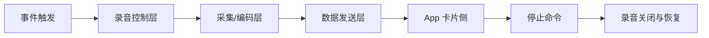
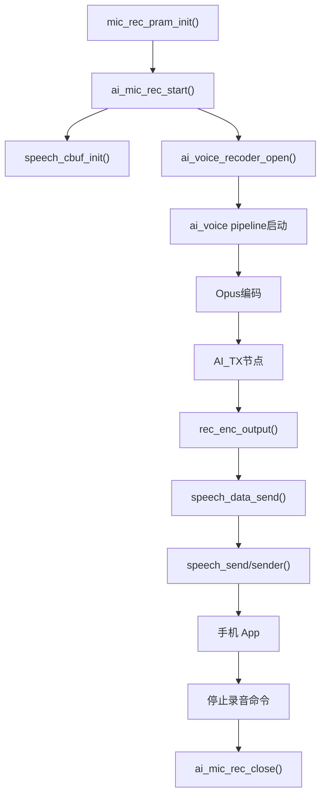
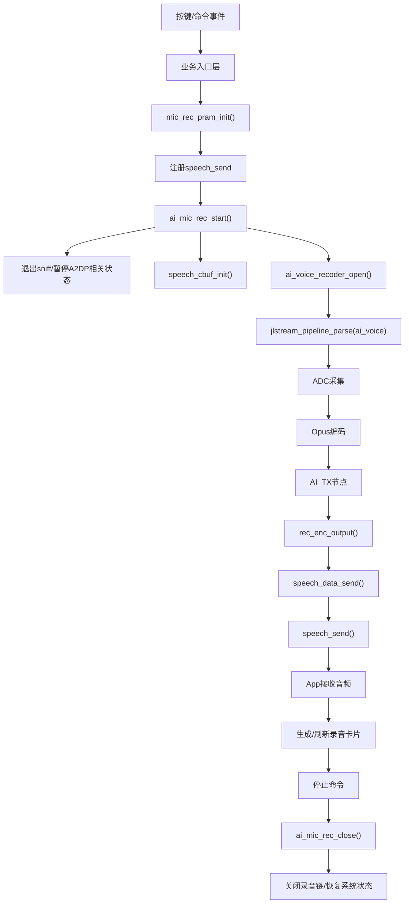

# 录音卡片产品全流程代码阅读指南

本文面向“想把录音卡片产品流程真正看懂”的场景，不只回答某个函数做了什么，而是把下面几个问题串起来：

1. 录音卡片从哪里触发
2. 固件里谁负责开始和停止录音
3. MIC 音频是怎么被采集、编码、送出
4. 通话录音和 MIC 录音有什么不同
5. 当前工程已经实现了什么，还缺什么
6. 如果要继续开发，应该先看哪一段代码

本文以当前仓库代码为准，不完全照搬分析文档中的“理想结构”。

---

## 1. 一句话先讲清楚

当前工程里，`MIC 录音底层链路基本已经存在`，并且已经具备：

- 录音启动
- Opus 编码
- 编码帧输出
- 停止录音
- TWS/A2DP 相关恢复

但它还不是一个完全产品化的“录音卡片系统”，因为还缺少：

- 正式的录音卡片业务入口
- 正式的开始/停止命令协议
- 正式的卡片状态机
- App 卡片展示和状态联动的完整定义

所以阅读代码时，最重要的思路不是找“录音卡片模块”这个名字，而是沿着下面这条主链去读：



---

## 2. 代码阅读建议顺序

如果你想最高效地把全流程看懂，建议按这个顺序读：

1. `SDK/apps/earphone/mode/common/app_default_msg_handler.c`
2. `SDK/apps/common/third_party_profile/common/mic_rec.c`
3. `SDK/audio/interface/recoder/ai_voice_recoder.c`
4. `SDK/audio/framework/nodes/ai_tx_node.c`
5. `SDK/apps/earphone/audio/jlstream_event_handler.c`
6. `SDK/audio/interface/recoder/esco_recoder.c`
7. `SDK/audio/interface/player/esco_player.c`
8. `SDK/audio/interface/recoder/translation_ear_recoder.c`

这个顺序的好处是：

- 先看入口，知道谁在触发
- 再看控制层，知道谁在管理启停
- 再看采集与编码，知道数据怎么来的
- 再看发送层，知道数据怎么出去
- 最后再看通话录音和扩展录音

### 2.1 一个很容易看错的点

`audio/interface/recoder` 里并不包含“所有录音业务功能”。

它更准确的定位是：

- 录音接口层
- 录音执行层
- 音频 stream 拉起层

也就是说，这一层更偏“怎么开一条录音流”，而不是“完整录音卡片业务怎么运转”。

当前工程的录音相关代码大致分 4 层：

#### 业务入口层

重点文件：

- `SDK/apps/earphone/mode/common/app_default_msg_handler.c`

主要负责：

- 按键或消息触发
- 业务入口
- 测试入口挂接

#### 业务控制层

重点文件：

- `SDK/apps/common/third_party_profile/common/mic_rec.c`

主要负责：

- MIC 录音初始化
- 开始/停止录音
- 编码数据输出后的聚包和发送
- 录音结束后的系统恢复

#### 录音执行层

重点目录：

- `SDK/audio/interface/recoder/`

代表文件：

- `ai_voice_recoder.c`
- `esco_recoder.c`
- `translation_ear_recoder.c`

主要负责：

- 打开 MIC 采集流
- 打开通话上行录音流
- 打开扩展录音 pipeline
- 配置编码器和 stream

#### 音频流框架层

重点文件：

- `SDK/audio/framework/nodes/ai_tx_node.c`
- `SDK/apps/earphone/audio/jlstream_event_handler.c`

主要负责：

- pipeline 节点流转
- 编码帧输出
- scene 和 pipeline UUID 映射

所以如果你的问题是：

- “录音是怎么开始的”
- “数据是怎么送到 App 的”
- “为什么停止录音后还要恢复 A2DP/TWS”

那么答案并不都在 `audio/interface/recoder` 里，反而更应该优先看：

- `mic_rec.c`
- `app_default_msg_handler.c`
- `ai_tx_node.c`

---

## 3. 第一层：先看事件入口

### 3.1 建议重点看哪个文件

重点文件：

- [app_default_msg_handler.c](/C:/Users/31933/Desktop/JL701N_AI_V300_0.2.4/SDK/apps/earphone/mode/common/app_default_msg_handler.c)

### 3.2 这一层主要回答什么问题

这一层主要回答：

- 录音流程是谁触发的
- 是按键触发、消息触发，还是协议命令触发
- 当前工程里有没有现成的调试入口

### 3.3 当前代码里的真实情况

当前工程里，这个文件挂了一个测试消息处理入口，里面已经有录音相关调试逻辑：

- 单击：打开 `MIC_TO_MONO_OPUS`
- 双击：打开 `DAC_TO_MONO_OPUS`
- 三击：打开 `MIC_DAC_TO_STERO_OPUS`

也就是说，虽然还没有一个叫 `record_card_start()` 的正式产品接口，但工程已经通过测试入口把底层录音链路接起来了。

### 3.4 这一层你要抓的重点

你不需要在这里把每个按键都看懂，你只需要确认两件事：

1. 当前有没有“能触发录音链”的入口
2. 这个入口最终调到了哪个底层模块

在当前工程里，答案是：

- 有入口
- 入口最终会调到底层录音/编码模块

---

## 4. 第二层：MIC 录音控制层

### 4.1 最重要的文件

重点文件：

- [mic_rec.c](/C:/Users/31933/Desktop/JL701N_AI_V300_0.2.4/SDK/apps/common/third_party_profile/common/mic_rec.c)

如果只允许你先读一个文件，那就是它。

### 4.2 为什么它最重要

因为当前工程的 MIC 录音流程并不是“应用层直接调用编码器再自己发包”，而是通过 `mic_rec.c` 来做统一管理。

这个文件里已经有：

- 参数初始化
- 启动录音
- 停止录音
- 编码输出回调
- 缓冲聚合发送
- TWS/A2DP 恢复逻辑

它几乎就是当前工程里“MIC 录音卡片核心控制层”的现实形态。

### 4.3 这几个函数最值得重点看

#### `mic_rec_pram_init()`

作用：

- 初始化录音参数
- 注册最终发送函数 `speech_send`
- 设置编码类型、帧聚合数量和缓冲区大小

这是“录音数据最终怎么发给 App”的起点。

你看这个函数时，要重点留意几个参数：

- `enc_type`
- `opus_type`
- `speech_send`
- `frame_num`
- `cbuf_size`

这几个参数几乎决定了整个 MIC 录音卡的数据出口策略。

#### `ai_mic_rec_start()`

作用：

- 判断当前录音系统是否已初始化
- 判断是否忙碌
- 退出 sniff
- 必要时暂停 A2DP/TWS 解码
- 初始化发送缓冲
- 调用 `ai_voice_recoder_open()`

这个函数是“开始录音”的核心入口。

#### `rec_enc_output()`

作用：

- 接收编码后的音频帧
- 更新当前帧长
- 把编码数据交给 `speech_data_send()`

你可以把它理解成：

- 编码层到协议发送层的桥

#### `speech_data_send()`

作用：

- 把单帧或多帧写入环形缓冲区
- 按 `frame_num` 聚合后再送给最终发送函数

这个函数决定了：

- 是“一帧一发”还是“多帧合并发送”
- 发送失败时如何处理

#### `ai_mic_rec_close()`

作用：

- 关闭录音链路
- 清掉缓冲
- 恢复系统时钟
- 恢复 A2DP/TWS 相关状态

它是停止录音的核心入口。

### 4.4 MIC 录音完整调用链

建议你重点按下面这条链去追：



如果这条链你读顺了，MIC 录音卡片的固件侧主流程就基本看懂了。

---

## 5. 第三层：MIC 采集与编码层

### 5.1 重点文件

- [ai_voice_recoder.c](/C:/Users/31933/Desktop/JL701N_AI_V300_0.2.4/SDK/audio/interface/recoder/ai_voice_recoder.c)
- [jlstream_event_handler.c](/C:/Users/31933/Desktop/JL701N_AI_V300_0.2.4/SDK/apps/earphone/audio/jlstream_event_handler.c)

### 5.2 `ai_voice_recoder.c` 的职责

这个文件负责真正把录音链拉起来。

你看 `ai_voice_recoder_open()` 时，重点理解这几步：

1. 通过 `jlstream_event_notify(..., "ai_voice")` 拿到 pipeline UUID
2. 调 `jlstream_pipeline_parse(uuid, NODE_UUID_ADC)` 解析出音频流
3. 配置 Opus 编码器参数
4. 配置 `AI_TX` 节点格式
5. 启动整个 stream

这意味着：

- `mic_rec.c` 是控制层
- `ai_voice_recoder.c` 是执行层

### 5.3 `jlstream_event_handler.c` 的职责

这个文件不是“录音卡片业务代码”，但它非常重要，因为它决定：

- `"ai_voice"` 对应哪条 pipeline
- 某个流场景的 UUID 是多少
- 某些场景下系统时钟怎么分配

当前代码里，`"ai_voice"` 对应 `PIPELINE_UUID_AI_VOICE`。

也就是说，`ai_voice_recoder_open()` 真正启动的是这里定义好的音频流程图。

### 5.4 这一层你重点看什么

这一层不用过分纠结每个节点参数，先抓住这件事：

- `ai_mic_rec_start()` 并不直接采音
- 它最终是通过 `ai_voice_recoder_open()` 拉起 `ADC -> Encoder -> AI_TX` 这条流

---

## 6. 第四层：编码帧输出层

### 6.1 重点文件

- [ai_tx_node.c](/C:/Users/31933/Desktop/JL701N_AI_V300_0.2.4/SDK/audio/framework/nodes/ai_tx_node.c)

### 6.2 为什么这一层要特别强调

因为你前面的分析文档里写的是“`AI_TX` 支持注册 `tx_func` 回调”，但当前仓库代码不是那样实现的。

当前代码真实逻辑是：

- `AI_TX` 节点收到编码帧
- 直接在 `ai_tx_handle_frame()` 里调用 `rec_enc_output()`

所以当前仓库不是：

```text
AI_TX -> tx_func -> 协议层
```

而是：

```text
AI_TX -> rec_enc_output() -> speech_data_send() -> sender
```

这个差异非常关键。

### 6.3 这一层你要看明白什么

主要看两件事：

1. `AI_TX` 在当前工程里不是业务控制层，它只是编码帧流出的末端节点
2. 真正负责“把数据往外发”的逻辑不在 `AI_TX` 里，而在 `mic_rec.c`

所以你如果是为了理解录音卡片产品流程，`ai_tx_node.c` 看懂“数据从这里流出”就够了，不需要把它当成产品主入口。

---

## 7. 第五层：协议发送层

### 7.1 当前工程里真正的协议出口

还是在：

- [mic_rec.c](/C:/Users/31933/Desktop/JL701N_AI_V300_0.2.4/SDK/apps/common/third_party_profile/common/mic_rec.c)

原因很简单：

- `speech_data_send()` 负责聚包
- `speech_send` / `sender` 负责最终发包

### 7.2 这一层回答的问题

这一层回答：

- App 最终收到什么
- 固件什么时候发一包
- 一包里包含几帧 Opus
- 发送失败时会怎样

### 7.3 阅读建议

你看这层代码时，建议按这个顺序：

1. 看 `mic_rec_pram_init()` 里谁注册了 `speech_send`
2. 看 `speech_data_send()` 如何做缓冲与聚合
3. 看 `rec_enc_output()` 是怎么把编码帧送进来的

如果把这三点连起来，你就能理解：

- 固件侧录音卡片数据是如何出耳机、到手机的

---

## 8. 第六层：停止录音与系统恢复

### 8.1 停止不是简单关个开关

很多人看录音流程时只关心“怎么开始”，但产品流程里“怎么停”和“停完怎么恢复”同样关键。

在当前工程里，这部分主要还是看：

- [mic_rec.c](/C:/Users/31933/Desktop/JL701N_AI_V300_0.2.4/SDK/apps/common/third_party_profile/common/mic_rec.c)

### 8.2 `ai_mic_rec_close()` 做了什么

这个函数里你要重点看：

- 关闭 `ai_voice_recoder`
- 释放缓冲
- 恢复时钟
- 恢复 A2DP/TWS 相关状态

这意味着录音卡片产品流程不是：

- 开始录音
- 停止录音

而是：

- 开始录音
- 改变系统音频状态
- 停止录音
- 把系统拉回录音前状态

这也是为什么这段代码必须重点看。

---

## 9. 第七层：通话录音流程

### 9.1 重点文件

- [esco_recoder.c](/C:/Users/31933/Desktop/JL701N_AI_V300_0.2.4/SDK/audio/interface/recoder/esco_recoder.c)
- [esco_player.c](/C:/Users/31933/Desktop/JL701N_AI_V300_0.2.4/SDK/audio/interface/player/esco_player.c)

### 9.2 这一层和 MIC 录音有什么不同

MIC 录音相对简单：

- 只有一条外界声音采集链

通话录音更复杂，因为它至少涉及：

- 上行：我说的话
- 下行：对方说的话
- 正常通话播放路径
- 录音旁路路径

### 9.3 你应该怎么读

读通话录音时，不要一上来就想把所有通话逻辑看完，先抓住这两个问题：

1. 通话音频从哪里进来
2. 录音路径是从哪里旁路出去的

通常可以这么理解：

- `esco_player.c` 更偏向下行播放链
- `esco_recoder.c` 更偏向上行采集链

如果你是为了理解“录音卡片产品全流程”，这一层先看到“通话录音比 MIC 录音多一层旁路和恢复复杂度”就够了。

---

## 10. 第八层：扩展录音链与调试模式

### 10.1 重点文件

- [translation_ear_recoder.c](/C:/Users/31933/Desktop/JL701N_AI_V300_0.2.4/SDK/audio/interface/recoder/translation_ear_recoder.c)

### 10.2 这个文件为什么值得看

这个文件更像“翻译耳机/双路采集”的扩展实现，不是最纯粹的录音卡片主链，但它很有参考价值。

它可以帮助你理解：

- MIC 和 DAC 是如何分别采集的
- 单声道/双声道模式是怎么切的
- 扩展录音链路是怎么拉起的

### 10.3 阅读建议

如果你当前目标只是搞懂 MIC 录音卡片，不必先深挖这个文件。

只有在下面这些场景才建议重点看：

- 你要录 `DAC`
- 你要录 `MIC + DAC`
- 你要做更复杂的双路录音卡片

---

## 11. 当前工程的真实全流程图

结合当前仓库代码，MIC 录音卡片的固件侧全流程更接近下面这样：



---

## 12. 如果你只想快速抓主干，重点盯这 5 个函数

如果你时间不多，只盯下面 5 个函数就够了：

1. `mic_rec_pram_init()`
2. `ai_mic_rec_start()`
3. `ai_voice_recoder_open()`
4. `rec_enc_output()`
5. `ai_mic_rec_close()`

这 5 个函数几乎就是当前工程里 MIC 录音卡片固件侧主流程的主干。

---

## 13. 如果你想从“产品流程”角度去理解，每层应该问什么问题

### 13.1 入口层

问：

- 谁触发开始录音
- 谁触发停止录音
- 触发事件来自按键、App，还是协议命令

### 13.2 控制层

问：

- 录音开始前做了哪些检查
- 忙碌状态怎么防重入
- 停止后做了哪些恢复

### 13.3 采集编码层

问：

- MIC 从哪里采
- 什么时候进入 Opus 编码
- 哪条 pipeline 被拉起

### 13.4 发送层

问：

- 数据是逐帧发还是聚合发
- 真正的发送函数是谁
- App 收到的数据是什么格式

### 13.5 产品闭环层

问：

- 开始和停止命令从哪来
- 失败时如何回传
- 卡片状态怎么同步

---

## 14. 当前工程已经有了什么，还缺什么

### 14.1 已经有的

- MIC 录音底层链
- Opus 编码
- 数据输出入口
- 停止与恢复
- 通话录音底层模块
- 测试触发入口

### 14.2 还缺的

- 正式 `record_card_start/stop`
- 正式卡片状态机
- 正式录音卡片协议定义
- App 卡片联动接口定义
- 通话录音的统一业务封装

---

## 15. 最后给一个最实用的阅读路径

如果你接下来准备真正去读代码，我建议这样安排：

### 第一步

先读：

- [mic_rec.c](/C:/Users/31933/Desktop/JL701N_AI_V300_0.2.4/SDK/apps/common/third_party_profile/common/mic_rec.c)

目标：

- 看懂 `init -> start -> output -> stop`

### 第二步

再读：

- [ai_voice_recoder.c](/C:/Users/31933/Desktop/JL701N_AI_V300_0.2.4/SDK/audio/interface/recoder/ai_voice_recoder.c)
- [ai_tx_node.c](/C:/Users/31933/Desktop/JL701N_AI_V300_0.2.4/SDK/audio/framework/nodes/ai_tx_node.c)

目标：

- 看懂编码帧怎么从 pipeline 里流出来

### 第三步

再读：

- [jlstream_event_handler.c](/C:/Users/31933/Desktop/JL701N_AI_V300_0.2.4/SDK/apps/earphone/audio/jlstream_event_handler.c)

目标：

- 看懂 `ai_voice` 这条 stream 是怎么被识别和启动的

### 第四步

最后读：

- [esco_recoder.c](/C:/Users/31933/Desktop/JL701N_AI_V300_0.2.4/SDK/audio/interface/recoder/esco_recoder.c)
- [esco_player.c](/C:/Users/31933/Desktop/JL701N_AI_V300_0.2.4/SDK/audio/interface/player/esco_player.c)
- [translation_ear_recoder.c](/C:/Users/31933/Desktop/JL701N_AI_V300_0.2.4/SDK/audio/interface/recoder/translation_ear_recoder.c)

目标：

- 扩展理解通话录音和双路录音

---

## 16. 总结

如果你想理解“录音卡片产品全流程”，最应该先看的是：

- 入口：`app_default_msg_handler.c`
- 主控：`mic_rec.c`
- 执行：`ai_voice_recoder.c`
- 输出：`ai_tx_node.c`
- 流程图入口：`jlstream_event_handler.c`

而不是一开始就钻到所有音频节点细节里。

因为对当前工程来说，真正的主流程不是“某个单独的录音卡片模块”，而是：

```text
事件入口
-> mic_rec 控制层
-> ai_voice_recoder 拉起录音 pipeline
-> ai_tx_node 输出编码帧
-> rec_enc_output / speech_data_send 发送
-> App 侧形成录音卡片闭环
```

如果后续要继续产品化开发，最合理的下一步是新增统一的 `record_card.c/h`，把这条已有链路正式收口成录音卡片业务接口。
