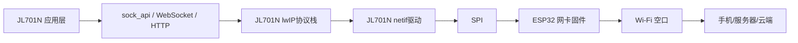
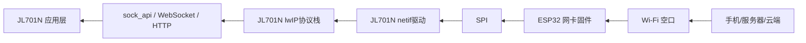

# 网卡模式架构说明

> 目标：说明 `ESP32 AT 指令模式` 和 `ESP32 网卡模式` 两种方案的数据流向、核心区别以及各自优劣势。  
> 背景：`JL701N` 为主控音频蓝牙芯片，`ESP32` 为 Wi‑Fi 侧芯片，两者通过 `SPI` 通信。

---

## 1. 先说结论

两种模式的本质区别，不是“有没有 SPI”，而是：

- `AT 指令模式`：`ESP32` 跑网络协议栈，`JL701N` 通过 `SPI` 发 AT 命令调用它的网络能力
- `网卡模式`：`JL701N` 自己跑 `lwIP` 协议栈，`ESP32` 更像一张 `Wi‑Fi 网卡`，负责无线收发和数据转发

也就是说：

- 以前：`SPI` 上传的是 `AT 指令`
- 现在：`SPI` 上传的是 `网卡数据/以太网帧`

---

## 2. 模式一：ESP32 AT 指令模式

## 2.1 架构角色

在这种模式下：

- `ESP32` 是“智能网络模块”
- `JL701N` 是“网络调用方”

`ESP32` 内部负责：

- 连 Wi‑Fi
- DHCP
- DNS
- TCP/UDP
- HTTP / WebSocket / MQTT 等上层通信

`JL701N` 负责：

- 业务逻辑
- 构造 AT 命令
- 处理 ESP32 返回结果

## 2.2 数据流向

### 发送方向


### 接收方向


## 2.3 过程说明

典型流程是：

1. `JL701N` 通过 `SPI` 给 `ESP32` 发 AT 指令
2. `ESP32` 解析 AT 指令
3. `ESP32` 内部执行 Wi‑Fi 连接、socket 建连、数据发送等操作
4. `ESP32` 把执行结果通过 `SPI` 返回给 `JL701N`
5. `JL701N` 再根据返回结果继续业务流程

例如发送一段业务数据时，实际链路是：

```text
JL701N业务数据
-> 封装为AT命令
-> SPI发给ESP32
-> ESP32解析AT命令
-> ESP32调用内部TCP/IP协议栈
-> Wi‑Fi发出
```

## 2.4 优势

- `JL701N` 侧实现简单
- 主控内存和 CPU 压力小
- 网络能力大多由 `ESP32` 固件承担
- 适合快速打通联网能力

## 2.5 劣势

- AT 指令解析有额外开销
- 数据流转链路更长，延迟更高
- 协议能力受 `ESP32 AT` 固件限制
- 若要支持新协议，往往需要改 ESP32 固件
- `JL701N` 对网络栈掌控较弱，调试和定制灵活度有限

---

## 3. 模式二：ESP32 网卡模式

## 3.1 架构角色

在这种模式下：

- `ESP32` 不再承担完整网络代理角色
- `ESP32` 更像“无线网卡”或“Wi‑Fi 收发器”
- `JL701N` 自己运行 `lwIP` 和 socket 接口

`JL701N` 内部负责：

- `lwIP`
- DHCP
- DNS
- TCP/UDP
- socket API
- WebSocket / HTTP / mbedTLS 等更上层协议

`ESP32` 主要负责：

- Wi‑Fi 无线收发
- 把无线侧数据通过 `SPI` 转发给 `JL701N`
- 把 `JL701N` 发来的网卡数据通过无线发出去

## 3.2 数据流向

### 发送方向



### 接收方向



## 3.3 过程说明

典型流程是：

1. `JL701N` 应用层调用 `sock_api` 或更上层协议接口
2. `JL701N` 内部 `lwIP` 负责组包、路由、TCP/UDP 处理
3. `lwIP` 通过 `netif` 把数据交给底层 `SPI` 网卡驱动
4. `ESP32` 收到 `SPI` 数据后，通过 Wi‑Fi 发到手机或服务器
5. 反向数据同样经 `ESP32 -> SPI -> JL701N lwIP -> 应用层`

此时 `JL701N` 不再是“调用网络模块”，而是“自己就是网络主机”。

## 3.4 优势

- `JL701N` 完全掌控网络协议栈
- 协议灵活，`lwIP` 支持的能力都可利用
- 不再依赖 AT 固件指令集
- 数据链路更直接，延迟通常更低
- 更适合实时音频流、大数据传输和自定义协议
- 业务调试更清晰，网络层和业务层都在 JL 侧可控

## 3.5 劣势

- `JL701N` 侧开发复杂度更高
- 需要在 `JL701N` 侧实现 `netif/SPI` 网卡驱动
- `lwIP` 会占用更多 RAM 和 CPU
- 系统稳定性、缓存、重传、异常恢复都要 JL 侧更多承担
- 集成与调试周期通常长于 AT 模式

---

## 4. 两种模式的核心区别

## 4.1 一句话区别

- `AT 指令模式`：`ESP32` 处理网络，`JL701N` 处理业务
- `网卡模式`：`JL701N` 既处理业务，也处理网络；`ESP32` 主要负责无线收发

## 4.2 SPI 上传内容不同

这是最关键的区别。

### AT 指令模式

`SPI` 上传的是：

- AT 命令
- AT 返回字符串
- 以及 AT 固件定义的数据通道格式

### 网卡模式

`SPI` 上传的是：

- 网卡数据
- 原始以太网帧或等效网络帧
- 供 `JL701N lwIP netif` 直接收发的数据

所以：

- 不是去掉了 `SPI`
- 而是改变了 `SPI` 承载的数据语义

## 4.3 协议栈位置不同

### AT 指令模式

协议栈位置：

- 在 `ESP32`

### 网卡模式

协议栈位置：

- 在 `JL701N`

这也是为什么你领导会说：

> 之前用 AT 指令（SPI），现在要改为网卡模式，需要跑 lwIP

因为改成网卡模式以后，`JL701N` 必须自己承担 TCP/IP 栈。

---

## 5. 对比表

| 对比项 | AT 指令模式 | 网卡模式 |
|---|---|---|
| `ESP32` 角色 | 智能网络模块 | Wi‑Fi 网卡/无线收发器 |
| `JL701N` 角色 | AT 调用方 | 完整网络主机 |
| TCP/IP 协议栈位置 | `ESP32` | `JL701N` |
| `SPI` 上传内容 | AT 指令/AT 返回数据 | 网卡数据/网络帧 |
| 网络协议控制权 | `ESP32` 为主 | `JL701N` 为主 |
| 上层协议灵活度 | 较低 | 较高 |
| 时延 | 较高 | 较低 |
| 开发复杂度 | 较低 | 较高 |
| JL 端资源占用 | 较低 | 较高 |
| 适合场景 | 快速联网、通用控制 | 大数据、实时流、自定义协议 |

---

## 6. 对录音卡片/大数据传输的意义

如果业务是：

- 录音卡片
- 长时间音频流
- 大文件传输
- 手机直连局域网

那么网卡模式通常更有优势，因为：

- 数据链路更直接
- 协议更灵活
- 容易做 `HTTP/WebSocket/TCP` 长连接和流式传输
- 更适合 `JL701N + ESP32 + 手机` 这种大数据局域网架构

但代价也很明确：

- 需要在 `JL701N` 侧把 `lwIP` 和网卡驱动真正跑起来
- 对系统资源和稳定性要求更高

---

## 7. 选型建议

### 适合继续用 AT 指令模式的情况

- 当前需求只是简单联网
- 协议种类固定
- 优先快速落地
- `JL701N` 资源比较紧张

### 适合切到网卡模式的情况

- 需要大数据传输
- 需要低延迟
- 需要更灵活的网络协议
- 需要把更多网络控制权放在 `JL701N`
- 后续会持续扩展录音、音频流、云连接能力

---

## 8. 最终总结

这次架构调整，本质上不是“ESP32 还要不要用”，而是“网络协议栈到底放在哪边”。

### 旧模式

```text
JL701N 负责业务
ESP32 负责网络
SPI 上传的是 AT 指令
```

### 新模式

```text
JL701N 负责业务 + 网络协议栈(lwIP)
ESP32 负责无线网卡收发
SPI 上传的是网卡数据
```

因此：

- `AT 指令模式` 更轻量、更快落地
- `网卡模式` 更强大、更灵活，更适合录音卡片这类大数据和实时音频业务
