# 2. 产品层初始化详解

通用层初始化完成后（见文档 1），`tdx_app_all_init()` 进入 `#if defined(TDX_PRODUCT_RC)` 包裹的产品特定代码块。以下分析以 **RC（录音卡片）产品**为例，其他产品（EP / CC / WT / RP）可通过各自的 `TDX_HAS_*` 开关裁剪相同模板。

---

## 2.1 GPIO 电源预配置

```c
#if TDX_HAS_WIFI
    gpio_set_mode(IO_PORT_SPILT(WIFI_POWER_PORT_IO), PORT_HIGHZ);
#endif
    gpio_set_mode(IO_PORT_SPILT(VDD_POWER_PORT_IO), PORT_OUTPUT_HIGH);
```

| GPIO | 状态 | 目的 |
|------|------|------|
| `WIFI_POWER_PORT_IO` | 高阻 (`PORT_HIGHZ`) | WiFi 模块默认不上电，避免漏电流 |
| `VDD_POWER_PORT_IO` | 输出高 (`PORT_OUTPUT_HIGH`) | 为 OLED / EMMC 等外设提供 VDD LDO |

**设计意图**：在初始化任何依赖这些电源轨的子系统之前，先把电源状态置为已知态。高阻态让 WiFi 保持关闭直到显式开启；VDD 高电平确保后续 OLED 初始化时不会面临电源未就绪的竞态。

---

## 2.2 RTC 初始化

```c
tdx_rtc_init();
```

> **【可确定】** 这行代码是 `tdx_app_all_init()` 中唯一与 RTC 相关的调用，由 SDK 核心 (`libtdx_sdk.a`) 提供，声明在 `sdk/include/tdx_api_util.h`。

**总览 — 从 `tdx_rtc_init()` 到软件 RTC 的完整推理链**：

`tdx_rtc_init()` 本身没有回调注册参数（不同于 `tdx_auth_init(&ops)` 需要应用层赋值结构体），说明它的全部逻辑封装在闭源库内部。结合源码可见部分，可以反推出内部流程：

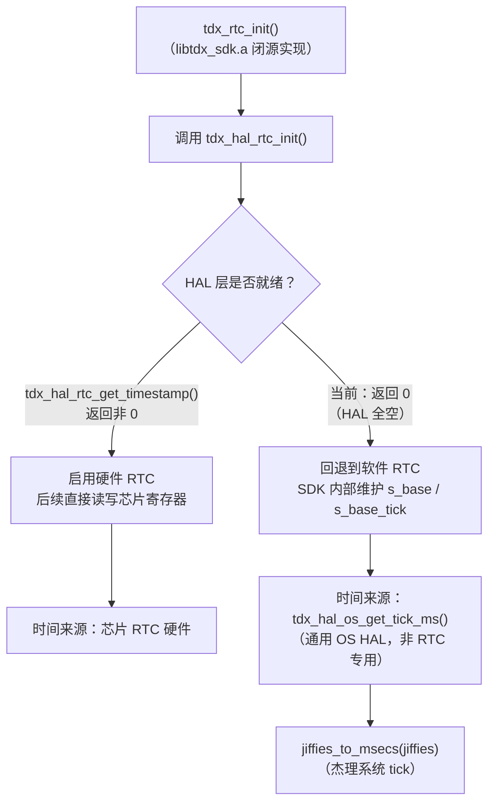

关键点：软件 RTC 的时基走的是**通用 OS HAL**（`tdx_hal_os_get_tick_ms()`），而非 RTC 专用 HAL（`tdx_hal_rtc_*()`）。前者是所有平台必须实现的适配层，后者是可选的硬件外设。这意味着即使 RTC HAL 永远为空，只要 OS HAL 提供 tick，SDK 核心就能自主维护软件时间。

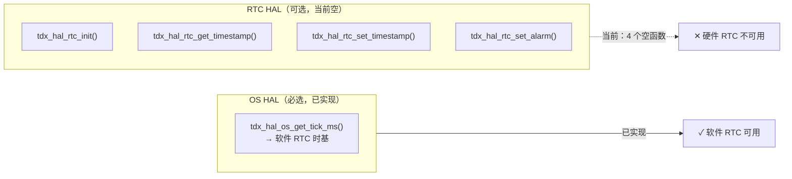

---

### 2.2.1 已知 vs 未知 — 阅读本章前先看这张清单

`libtdx_sdk.a` 是闭源静态库，以下事实基于**源码可见部分**（`port/` 目录 + SDK 头文件），与**闭源库内部推断**必须分开：

| 事实 | 状态 | 依据 |
|------|------|------|
| HAL 层 `tdx_hal_rtc_*` 是空实现 | **可确定** | `tdx_hal_sys_jl7018.c` 源码可见 |
| `TDX_HAL_HAVE_RTC = 1` 已定义 | **可确定** | `tdx_hal_config.h:53`，见 2.2.2 讨论 |
| RTC 没有回调表注册模式 | **可确定** | 无 `tdx_rtc_ops_t` 结构体定义 |
| `on_rtc_synced` 是空 stub | **可确定** | `tdx_app_callbacks_impl.c` 源码可见 |
| BLE 时间同步路径存在 | **可确定** | `tdx_app.c` `TDX_PROTOCOL_EVENT_RTC_SET` |
| 时间持久化机制存在 | **可确定** | `tdx_app.c` / `tdx_charge.c` 调用点明确 |
| OS HAL 提供 `get_tick_ms()` | **可确定** | `tdx_hal_os_jl7018.c` 源码可见 |
| SDK 核心内部有软件 RTC | **高度可能** | 间接证据充分，但内部实现不可见 |
| 软件 RTC 使用 tick 作为基准 | **合理推断** | 无其他时间来源，但内部逻辑不可见 |
| 硬件/软件自动切换 | **合理推断** | HAL 接口设计暗示，但切换逻辑不可见 |

---

### 2.2.2 HAL 层现状 — 空实现（可确定）

`port/platform/jl7018/tdx_hal_sys_jl7018.c` 中定义了 4 个 RTC HAL 函数：

```c
void tdx_hal_rtc_init(void)
{
    /* rtc_init declared in asm/rtc.h (included via tdx_app_config.h chain) */
}

void tdx_hal_rtc_set_timestamp(uint32_t timestamp)
{
    (void)timestamp;
}

uint32_t tdx_hal_rtc_get_timestamp(void)
{
    return 0;
}

void tdx_hal_rtc_set_alarm(uint32_t timestamp)
{
    (void)timestamp;
}
```

**结论：硬件 RTC HAL 为空实现。** 4 个函数均为空 stub，没有接入芯片 RTC 驱动。

> **⚠️ `TDX_HAL_HAVE_RTC` 配置矛盾**：`port/platform/jl7018/tdx_hal_config.h:53` 已定义 `#define TDX_HAL_HAVE_RTC 1`，声明平台**具备**硬件 RTC 能力。但 HAL 实现层 4 个函数体为空。这形成了一组矛盾：
>
> | 层次 | 声称 | 实际 |
> |------|------|------|
> | 平台配置（`tdx_hal_config.h`） | `TDX_HAL_HAVE_RTC = 1`（有 RTC） | — |
> | HAL 实现（`tdx_hal_sys_jl7018.c`） | — | 4 个空函数 |
>
> **如果 SDK 核心使用 `TDX_HAL_HAVE_RTC` 宏来选择代码路径**，它可能已经在调用这些空函数（返回 0），而不是完全回退到软件 RTC。这一矛盾意味着当前状态本质上是 **"配置声称有硬件 RTC，但驱动未接入"**，而非单纯的"硬件 RTC 未启用"。

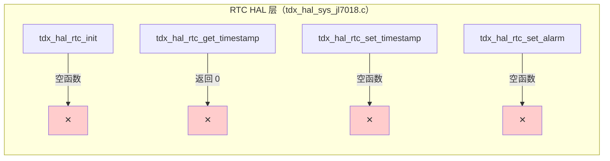

> **注意**：芯片 SDK 其实提供了 RTC 头文件（`#include "asm/rtc.h"`）和完整的驱动 API（`rtc_init()`、`read_sys_time()`、`write_sys_time()` 等），只是 port 层没有调用。

---

### 2.2.3 为什么 RTC 没有回调表？（可确定 + 推断）

文档 1 中鉴权/录音使用**运行时回调表注册**：

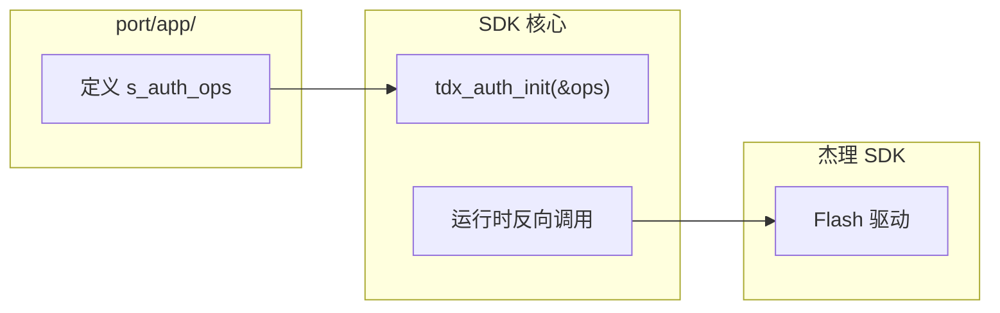

RTC 使用**链接时 HAL 符号绑定**：

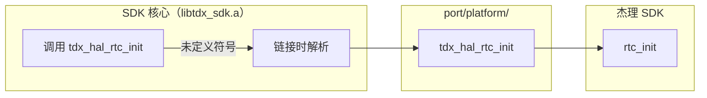

**可确定的部分**：
- `tdx_rtc_init()` 没有参数，不需要应用层注册结构体
- `tdx_hal_rtc_*` 是全局函数，通过链接符号解析

**推断的部分**：
- SDK 核心选择这种模式是因为 RTC 接口简单且标准（init/get/set/alarm），不需要异构适配

---

### 2.2.4 SDK 核心内部是否有软件 RTC？（高度可能的推断）

**间接证据链**：

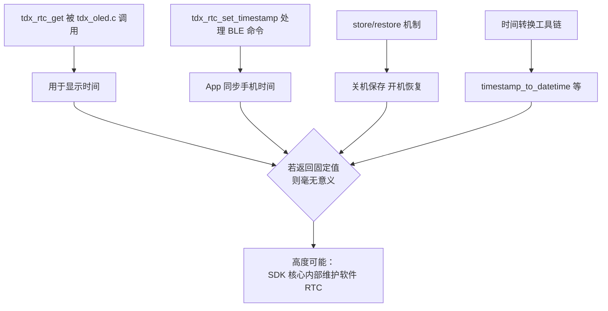

**推断的底层逻辑**：

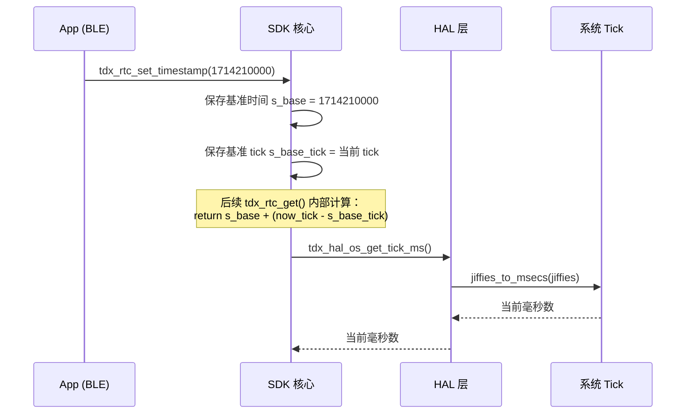

> **⚠️ 注意**：上述时序图是**根据接口设计的合理推断**，`libtdx_sdk.a` 内部真实实现不可见。

---

### 2.2.5 时间设置路径与持久化机制（可确定调用点，推断内部逻辑）

**时间设置入口**（源码可见）：

时间通过 BLE 命令从手机同步到设备：

```c
// tdx_app.c:2389-2394 — 源码可见
case TDX_PROTOCOL_EVENT_RTC_SET: {
    u32 ts = *(u32 *)data;
    int result = (ts > 0) ? tdx_rtc_set_timestamp(ts) : 1;
    tdx_indicate_rtc_ack_t ra = { .result = result, .timestamp = ts };
    tdx_protocol_indicate(TDX_INDICATE_RTC_ACK, &ra, sizeof(ra));
    break;
}
```

这是 RTC 时间的**唯一设置入口**：手机通过 BLE 下发 Unix 时间戳 → `tdx_rtc_set_timestamp()` → SDK 核心更新内部基准。

**持久化调用点**（源码可见）：

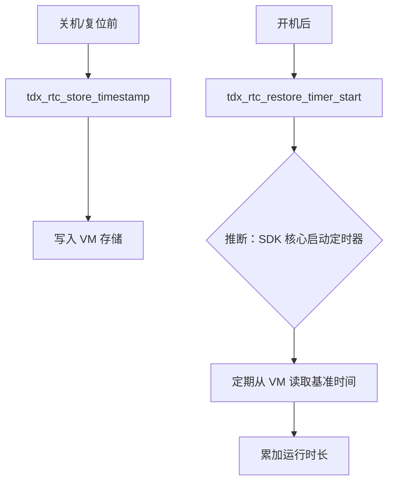

**具体调用位置**：

| 场景 | `tdx_rtc_store_timestamp()` | `tdx_rtc_restore_timer_stop()` | `tdx_rtc_restore_timer_start()` |
|------|----------------------------|------|--------------------------------|
| `tdx_app_all_init()`（正常启动） | 否 | 否 | 否 |
| `tdx_app_idle_handle()`（进入 idle） | **是** | **是** | **是** |
| `tdx_app_factory_reset_handle()` | 否 | 否 | 否 |

其中 `tdx_rtc_restore_timer_stop()` 与 `tdx_rtc_restore_timer_start()` 成对出现：先停止旧定时器，再启动新定时器。这确保在 idle/sleep 周期切换时不会出现多个 restore timer 并发运行。

> `tdx_rtc_restore_timer_start()` 和 `tdx_rtc_restore_timer_stop()` 的内部实现（定时器周期、追赶算法）在闭源库中，不可见。

---

### 2.2.6 回调表中的 `on_rtc_synced`（可确定）

```c
// tdx_app_callbacks_impl.c — 源码可见
static void _cb_on_rtc_synced(uint32_t timestamp) { }

static const tdx_app_callbacks_t s_app_cbs = {
    .on_rtc_synced = _cb_on_rtc_synced,  // ← 空实现
};
```

| 回调类型 | 数据流向 | 示例 | 当前状态 |
|----------|----------|------|----------|
| **请求型** | SDK → 应用层 → 返回值 | `get_auth_key` | 已实现 |
| **通知型** | SDK → 应用层（单向） | `on_rtc_synced` | **空 stub** |

**影响**：BLE 同步时间后，没有即时推送通知去刷新 OLED。不过 `tdx_oled.c:1069` 在每个显示周期都会调用 `tdx_rtc_get()` 获取当前时间，所以时间会在下一次画面刷新时自动更新——只是不是实时的。如果产品需要"时间同步后立即刷新显示"的体验，应在此回调中发送 `TDX_UI_EVT_MAINPAGE` 事件触发 OLED 立即重绘。

---

### 2.2.7 软件 RTC 的 tick 来源（可确定）

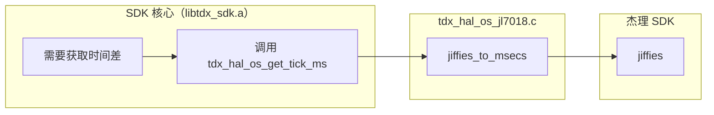

```c
// tdx_hal_os_jl7018.c — 源码可见
uint32_t tdx_hal_os_get_tick_ms(void)
{
    return jiffies_to_msecs(jiffies);
}
```

这是 SDK 核心获取系统 tick 的**唯一合法入口**。`libtdx_sdk.a` 通过符号依赖 `tdx_hal_os_get_tick_ms`，而不是直接引用 `jiffies`，保持了平台无关性。

---

### 2.2.8 硬件 RTC 启用路径（推断 + 实现指南）

如果未来要启用硬件 RTC，需要填充 `tdx_hal_sys_jl7018.c` 中的 4 个空函数。

**关键障碍：HAL 接口与芯片 API 的类型不匹配**

TideX HAL 接口使用 `uint32_t` Unix 时间戳，但杰理芯片 RTC API（`asm/rtc.h`）使用 `struct sys_time`：

```c
// 杰理芯片 RTC API（asm/rtc.h）
struct sys_time {
    u16 year;
    u8 month;
    u8 day;
    u8 hour;
    u8 min;
    u8 sec;
};

int  rtc_init(const struct rtc_dev_platform_data *arg);  // 需要平台数据参数
void read_sys_time(struct sys_time *curr_time);           // 输出 struct sys_time*
void write_sys_time(const struct sys_time *curr_time);    // 输入 struct sys_time*
void write_alarm(const struct sys_time *alarm_time);      // 输入 struct sys_time*
```

因此 HAL 层不能简单地转发调用，必须做 **`struct sys_time` ↔ Unix 时间戳** 的转换：

```c
// 正确填充方式（需要引入 tdx_api_util.h 的转换函数）
#include "tdx_api_util.h"  // 提供 tdx_rtc_datetime_to_timestamp / tdx_rtc_timestamp_to_datetime

void tdx_hal_rtc_init(void)
{
    // 配置平台数据：时钟源、32k 晶振、回调
    const struct rtc_dev_platform_data data = {
        .clk_sel = CLK_SEL_32K,   // 或 CLK_SEL_LRC，取决于硬件设计
        .x32xs   = 1,             // 使能 32k 晶振（需确认硬件贴装）
        .cbfun   = NULL,
    };
    rtc_init(&data);
}

uint32_t tdx_hal_rtc_get_timestamp(void)
{
    struct sys_time st;
    read_sys_time(&st);
    DateTime dt = {
        .year = st.year, .month = st.month, .day = st.day,
        .hour = st.hour, .minute = st.min, .second = st.sec,
    };
    return (uint32_t)tdx_rtc_datetime_to_timestamp(dt);
}

void tdx_hal_rtc_set_timestamp(uint32_t timestamp)
{
    DateTime dt = tdx_rtc_timestamp_to_datetime((time_t)timestamp);
    struct sys_time st = {
        .year = (u16)dt.year, .month = (u8)dt.month, .day = (u8)dt.day,
        .hour = (u8)dt.hour, .min = (u8)dt.minute, .sec = (u8)dt.second,
    };
    write_sys_time(&st);
}

void tdx_hal_rtc_set_alarm(uint32_t timestamp)
{
    DateTime dt = tdx_rtc_timestamp_to_datetime((time_t)timestamp);
    struct sys_time st = {
        .year = (u16)dt.year, .month = (u8)dt.month, .day = (u8)dt.day,
        .hour = (u8)dt.hour, .min = (u8)dt.minute, .sec = (u8)dt.second,
    };
    write_alarm(&st);
}
```

**硬件前提条件**：

| 条件 | 说明 |
|------|------|
| 32kHz 晶振贴装 | `rtc_dev_platform_data.x32xs = 1` 的前提。如未贴装，需使用内部 LRC（`CLK_SEL_LRC`），精度较差 |
| P33 备份域供电 | 关机时 RTC 寄存器需保持供电才能维持计时 |
| `TDX_HAL_HAVE_RTC = 1` | 已满足（`tdx_hal_config.h:53`） |

**切换机制的推断依据**：

| 证据 | 说明 |
|------|------|
| `tdx_hal_rtc.h` 注释 | "Implementation required when TDX_HAL_HAVE_RTC is enabled" → HAL 是**可选层** |
| `tdx_hal_rtc_get_timestamp()` 返回 `uint32_t` | 非 `int`，无错误码通道 → 返回 0 被解释为"无效"（推断） |
| 时间持久化机制存在 | 如果 SDK 核心**只**支持硬件 RTC，就不需要软件补偿机制 |

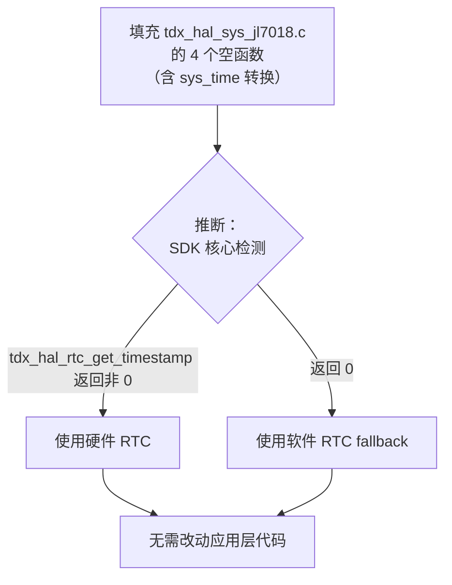

**⚠️ 设计陷阱（推断）**：Unix 时间戳 0 是合法的（1970-01-01 00:00:00 UTC）。如果硬件 RTC 恰好被设置为这个时间，SDK 核心可能误判为"HAL 不可用"而回退到软件 RTC。建议：如果 SDK 核心确实使用 `!= 0` 作为检测条件，可在 `tdx_hal_rtc_init()` 中设置一个远大于 0 的初始值来规避此问题。

---

### 2.2.9 本章事实汇总

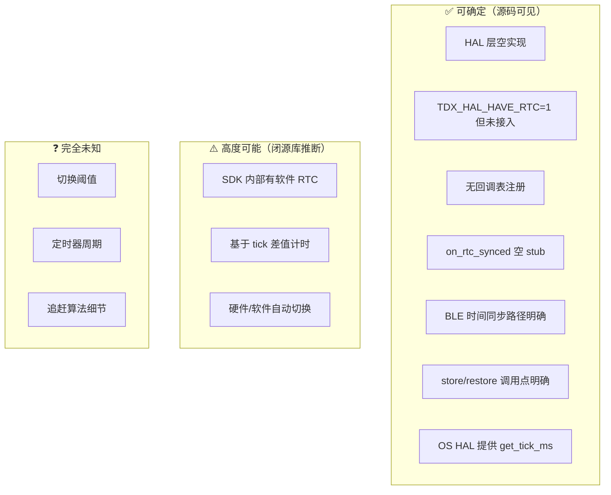

| 问题 | 答案 | 可信度 |
|------|------|--------|
| 当前有硬件 RTC 吗？ | **配置声称有，实际未接入**，HAL 全空 | 100% |
| SDK 有软件 RTC 吗？ | **有**，间接证据充分 | ~90% |
| 软件 RTC 用 tick 计时吗？ | **是**，无其他来源 | ~80% |
| BLE 时间从哪里来？ | 手机通过 `TDX_PROTOCOL_EVENT_RTC_SET` 下发 | 100% |
| 填充 HAL 后自动切硬件吗？ | **推断会**，但切换逻辑不可见 | ~70% |
| HAL 填充只需简单转发？ | **否**，需要 `struct sys_time` ↔ Unix 时间戳转换 | 100% |
| 时间戳 0 会误触发 fallback 吗？ | **可能**，取决于 SDK 内部阈值 | 未知 |

---

## 2.3 SPI 平台注册与中断初始化

```c
#if TDX_HAS_SPI
    tdx_spi_platform_register();
    tdx_spi_init_irq();
#endif
```

这两个调用职责分明：`tdx_spi_platform_register()` 把硬件操作表交给 SDK 核心，"我有这些能力，你用的时候调"；`tdx_spi_init_irq()` 让 SDK 核心用这些能力做第一件事——配置 WiFi 模块的握手中断信号线。

---

### 2.3.1 `tdx_spi_platform_register()` — 硬件操作表注册

源码位置：`port/platform/jl7018/tdx_hal_spi_jl7018.c`。

该文件定义了 `tdx_spi_hw_ops_t` 类型的静态常量 `s_jl7018_hw_ops`，包含 18 个函数指针：

| 成员 | 实际函数 | 作用 |
|------|----------|------|
| `spi_open` | `jl_spi_open` | 配置 SPI2 为主机、MSB、CPOL=0、CPHA=0、16MHz |
| `spi_close` | `jl_spi_close` | 反初始化 SPI2 |
| `dma_send` / `dma_recv` | `jl_dma_send` / `jl_dma_recv` | DMA 方式收发 |
| `dma_xfer_isr` | `jl_dma_xfer_isr` | 中断上下文 DMA 传输 |
| `wait_tx_done` / `wait_rx_done` | `jl_wait_tx_done` / `jl_wait_rx_done` | 查询 ISR 状态标志 |
| `cs_init` / `cs_deinit` / `cs_high` / `cs_low` | `jl_cs_*` | 片选 GPIO 控制（默认 `IO_PORT_DM`） |
| `handshake_read` | `jl_handshake_read` | 读取握手 GPIO 电平 |
| `handshake_irq_init` / `handshake_irq_enable` | `jl_handshake_irq_*` | 配置 P33 唤醒中断（上升沿触发） |
| `wdt_clear` | `jl_wdt_clear` | 喂狗 |
| `delay_us` | `jl_delay_us` | 微秒延时 |
| `clock_lock` / `clock_unlock` | `jl_clock_lock` / `jl_clock_unlock` | 锁定系统时钟 160MHz |

`tdx_spi_platform_register()` 内部将两组结构体注册给 SDK 核心：

```c
tdx_spi_set_hw_ops(&s_jl7018_hw_ops, NULL);       // 硬件操作表
tdx_spi_set_callbacks(&s_jl7018_default_cb);       // 应用回调表
```

**hw_ops**（平台层提供）封装所有 SPI 寄存器操作；**callbacks**（应用层提供，4 个回调：`on_rx_data`、`is_transport_active`、`on_tx_queue_drained`、`on_tx_error`）封装协议/WiFi 层对传输事件的响应。SDK 核心同时持有两组指针，通过函数指针间接操作 JL7018 的 SPI 外设。

**与 RTC 的注册模式对比**：RTC 通过链接时符号绑定（`tdx_hal_rtc_init` 是全局函数，链接器自动解析），SPI 则通过运行时结构体注册。原因在于 SPI 的 HAL 接口远比 RTC 复杂（18 个函数 vs 4 个），且不同平台的 SPI 控制器差异巨大，用 ops 结构体比 18 个全局符号更干净。

> **附带操作：低功耗注册**。同文件中还有 `REGISTER_LP_TARGET(tdx_spi_lp_target)`，向系统低功耗框架注册 SPI 模块。当 `_spi_lp_idle_query()` 返回 1（`tdx_spi_is_idle()`）时，系统方可进入深睡。这是 `tdx_spi_platform_register()` 的"后缀"，不是独立初始化步骤。

---

### 2.3.2 `tdx_spi_init_irq()` — 握手 GPIO 中断预配置

`tdx_spi_init_irq()` 声明在 `sdk/include/tdx_spi.h:103`，实现在 `libtdx_sdk.a` 闭源库中。

**它的职责不是 SPI 总线初始化。** 证据：`tdx_spi.h` 同时声明了两个函数——

```c
void tdx_spi_init_irq(void);   // ← tdx_app_all_init() 中调用
int  tdx_spi_init(void);       // ← tdx_hal_wifi_bus_init() 中调用（WiFi 启动时）
```

如果 `tdx_spi_init_irq` 已经做了总线初始化，`tdx_spi_init` 就是多余的。两者同时存在，且调用时机不同，说明职责分离。

**内部调用推断**（闭源，但可通过 HAL 源码验证）：

| hw_ops 成员 | 被调用？ | 推理依据 |
|-------------|---------|----------|
| `handshake_irq_init` | **确定会** | 函数名直接对应 |
| `handshake_irq_enable(0)` | **确定会** | `jl_handshake_irq_init` 末尾调 `p33_io_wakeup_enable(gpio, 0)` 先禁用，SDK 需传入 callback 后再 enable |
| `cs_init` | 可能 | CS GPIO 可提前配置 |
| `spi_open` | **不会** | 属于 `tdx_spi_init()` 职责 |
| `dma_send` / `dma_recv` | **不会** | SPI 未打开，DMA 无意义 |
| `clock_lock` | **不会** | 锁频仅在实际传输时需要 |

**HAL 层源码证据**（可确定）：

```c
// tdx_hal_spi_jl7018.c:156-168 — 源码可见
static void jl_handshake_irq_init(void (*callback)(void *arg), void *arg)
{
    s_handshake_callback = callback;           // SDK 传入的 ISR 回调

    memset(&s_jl_gpio_irq_config, 0, sizeof(s_jl_gpio_irq_config));
    s_jl_gpio_irq_config.pullup_down_mode = PORT_INPUT_PULLDOWN_1M;
    s_jl_gpio_irq_config.filter           = PORT_FLT_DISABLE;
    s_jl_gpio_irq_config.edge             = RISING_EDGE;
    s_jl_gpio_irq_config.gpio             = TDX_SPI_HANDSHAKE_IO;
    s_jl_gpio_irq_config.callback         = jl_handshake_isr_wrapper;

    p33_io_wakeup_port_init(&s_jl_gpio_irq_config);
    p33_io_wakeup_enable(s_jl_gpio_irq_config.gpio, 0);  // IRQ 禁用！
}
```

关键点：
- P33 域 GPIO 配置为**下拉 + 上升沿触发**（WiFi 模块拉高 IO 时产生中断）
- `p33_io_wakeup_enable(gpio, 0)` 最后一个参数 `0` = **disable**——配置完成但开关关闭
- SDK 传入的 `callback` 保存到 `s_handshake_callback`，后续由 `jl_handshake_isr_wrapper` 调用

**结论**：`tdx_spi_init_irq()` 做的是**中断信号线的硬件预配置**，不是 SPI 外设初始化。命名为 "init_irq" 而非 "init"，本身就是设计意图的表达。

**真正的总线初始化**发生在 WiFi 启动时——`tdx_hal_wifi_bus_jl7018.c:51-56` 调用 `tdx_spi_init()`，SDK 核心通过 `s_hw_ops->spi_open()` 配置 SPI2 主机模式、使能 DMA、打开握手 IRQ。如果产品只走 BLE 通道，WiFi 永不起动，SPI 总线就永远不打开。

**三阶段全景**：

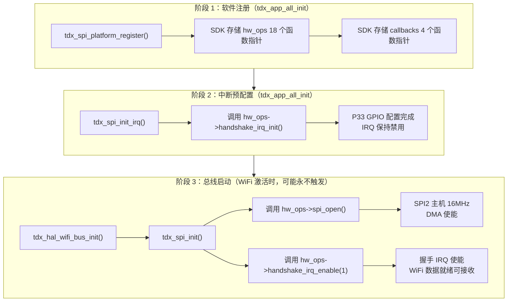

**已知 vs 未知**：

| 事实 | 状态 | 依据 |
|------|------|------|
| `tdx_spi_init_irq()` 实现在闭源库 | **可确定** | 声明在 `tdx_spi.h`，源码不可见 |
| 它调用 `handshake_irq_init` + `handshake_irq_enable(0)` | **高度可能** | HAL 源码可见，函数名直接对应 |
| 它不调用 `spi_open` | **高度可能** | `tdx_spi_init()` 独立存在，职责分离 |
| `tdx_spi_init()` 才真正打开 SPI 总线 | **高度可能** | `tdx_hal_wifi_bus_jl7018.c` 调用链明确 |
| 握手 IRQ 初始为禁用状态 | **可确定** | `jl_handshake_irq_init` HAL 源码明确 `enable(0)` |
| P33 IO 配置为下拉 + 上升沿 | **可确定** | HAL 源码可见 |
| SPI 总线可能永远不打开 | **可确定** | 如果产品只走 BLE 通道，WiFi 永不起动 |
| SDK 内部 SPI 主控逻辑细节 | **不可见** | 闭源 |
| `tdx_spi_init_irq` 是否还调了 `cs_init` | **未知** | 闭源 |

---

## 2.4 OLED 回调注册与显示任务创建

```c
#if TDX_HAS_DISPLAY
    tdx_oled_register_callbacks();
#endif
```

**与 SPI 的关键区别**：SPI 的 18 个 hw_ops 是"能力供给"——SDK 拿到函数指针后直接操控硬件寄存器。OLED 的 3 个回调是"事件翻译"——tidex SDK 说"该显示主页了"，port 层把这个意图翻译成 JL 平台的消息，由 JL 的消息循环/任务去执行。tidex SDK 不知道 OLED 什么型号、怎么驱动、消息怎么投递——它只管发通知。

---

### 2.4.1 `tdx_oled_register_callbacks()` — 3 个回调，2 条路由

源码位置：`port/app/tdx_app.c`。

```c
static void tdx_oled_register_callbacks(void)
{
    tdx_oled_register_notify_cb(tdx_oled_event_handler);
    tdx_oled_register_mode_check(tdx_oled_pc_mode_check);
    tdx_battery_set_display_handler(tdx_bat_display_handler);
}
```

3 个回调按消息路由方式分两类：

**路由 A：通知型 → `app_core` 任务**

`tdx_oled_event_handler` 接收 SDK 核心的 `tdx_ui_notify_t` 事件枚举，通过查表翻译成 `APP_MSG_*`，再 `app_send_message()` 投递到 `app_core`：

```c
static void tdx_oled_event_handler(tdx_ui_notify_t event)
{
    static const int evt_to_msg[] = {
        [TDX_UI_NOTIFY_SHUTOFF]             = APP_MSG_OLED_SHUTOFF,
        [TDX_UI_NOTIFY_BAT_SHOW]            = APP_MSG_OLED_BAT_SHOW,
        [TDX_UI_NOTIFY_BLE_CONN_STATE_SHOW] = APP_MSG_OLED_BLE_CONN_STATE_SHOW,
        [TDX_UI_NOTIFY_BLE_STATE_CHANGED]   = APP_MSG_OLED_BLE_STATE_CHANGED,
        [TDX_UI_NOTIFY_BOUND_SHOW]          = APP_MSG_OLED_BOUND_SHOW,
        [TDX_UI_NOTIFY_RECORD_MODE_SHOW]    = APP_MSG_OLED_RECORD_MODE_SHOW,
        [TDX_UI_NOTIFY_MAIN_PAGE_DISPLAYING]= APP_MSG_MAIN_PAGE_DISPLAYING,
        [TDX_UI_NOTIFY_RECORD_SAVED]        = APP_MSG_RECORD_SAVED,
        [TDX_UI_NOTIFY_BAT_LOW_VIBRATE]     = APP_MSG_BAT_LOW_MOTOR_VIBRATE,
    };
    if (event < ARRAY_SIZE(evt_to_msg))
        app_send_message(evt_to_msg[event], 0);
}
```

**路由 B：电池显示 → OLED 任务直通**

`tdx_bat_display_handler` 绕过 `app_core`，查表后直接 `os_taskq_post_msg` 投递给 专门的OLED 渲染任务：

```c
static void tdx_bat_display_handler(tdx_bat_display_t type)
{
    static const tdx_ui_event_t map[] = {
        [TDX_BAT_DISP_LEVEL_0]       = TDX_UI_EVT_BAT_LEVEL_20,
        [TDX_BAT_DISP_LEVEL_20]      = TDX_UI_EVT_BAT_LEVEL_20,
        // ... 共 15 个电量档位
        [TDX_BAT_DISP_CHARGE_FULL]   = TDX_UI_EVT_BAT_CHARGE_FULL,
    };
    if (type < ARRAY_SIZE(map))
        os_taskq_post_msg(TDX_OLED_TASK_NAME, 1, map[type]);
}
```

**`tdx_oled_pc_mode_check`** 是同步查询：SDK 核心调用它判断当前是否 PC 模式，返回值直接使用，无消息路由。

| 回调 | 路由方式 | 终点 | 事件数 |
|------|---------|------|--------|
| `tdx_oled_event_handler` | `app_send_message` → 消息循环 | `app_core` 任务 | 9 种通知 |
| `tdx_bat_display_handler` | `os_taskq_post_msg` → 任务队列 | `_tdx_oled_task` | 15 个电量档位 |
| `tdx_oled_pc_mode_check` | 同步返回 `int` | 调用者 | 1 个查询 |

---

### 2.4.2 `tdx_oled_task_create()` — 渲染任务启动

源码位置：`port/bsp/display/ssd1306/tdx_oled.c`。

```c
int tdx_oled_task_create(void)
{
    if (s_oled.task_created) {
        return -1;
    }
    int res = tdx_hal_os_task_create(TDX_OLED_TASK_NAME, _tdx_oled_task,
                                      NULL, 512, 256, 2);
    s_oled.task_created = true;
    return 0;
}
```

任务名 `TDX_OLED_TASK_NAME`，入口 `_tdx_oled_task()`，堆栈 512 字节，优先级 2。

**消息循环**：

```c
static void _tdx_oled_task(void *arg)
{
    os_mutex_create(&s_oled.display_mutex);
    tdx_oled_init();                        // OLED 硬件初始化（I2C、分辨率、刷新率）
    clock_alloc(TDX_OLED_TASK_NAME, TDX_OLED_TASK_CLK);

    while (1) {
        ret = os_taskq_pend(NULL, msg, ARRAY_SIZE(msg));
        if (ret == OS_TASKQ && msg[0] == Q_MSG) {
            u8 type = msg[1];

            if (type == TDX_UI_EVT_RECORDING_ANIM_TICK) {
                _tdx_oled_recording_anim_flush();   // 快速通道：局部刷新动画帧
                continue;
            }

            tdx_app_emmc_poweron(1);                // 每次渲染前确保 EMMC/OLED 供电
            _tdx_oled_dispatch_screen(type, msg[2], msg[3]);
        }
    }
}
```

消息循环内部有两条分支，区别在于**是否需要上下文决策**：

| 路径 | 触发条件 | 是否需要上下文 | 行为 |
|------|---------|---------------|------|
| 快速路径 | `TDX_UI_EVT_RECORDING_ANIM_TICK` | **不需要**——录制动画帧只画在屏幕固定区域，无论当前是主页/录音/充电画面，动画位置不变 | 直接调 `_tdx_oled_recording_anim_flush()`，不触发 EMMC 上电 |
| 调度路径 | 其他所有 `TDX_UI_EVT_*` | **需要**——要判断当前画面（cur_type）、主页/绑定页是否可见、事件是否 transient、是否重复 | 先 `tdx_app_emmc_poweron(1)` 确保供电，再进 `_tdx_oled_dispatch_screen()` |

**屏幕调度状态机 — `_tdx_oled_dispatch_screen()`**：

```c
static const tdx_oled_screen_entry_t s_screen_list[] = {
    _TDX_OLED_SCREEN_ENTRY(TDX_UI_EVT_SHUTOFF,         _tdx_oled_show_shutoff),
    _TDX_OLED_SCREEN_ENTRY(TDX_UI_EVT_MAINPAGE,        _tdx_oled_show_mainpage),
    _TDX_OLED_SCREEN_ENTRY(TDX_UI_EVT_BAT_LEVEL_20,    _tdx_oled_show_bat_level_20),
    _TDX_OLED_SCREEN_ENTRY(TDX_UI_EVT_RECORDING,       _tdx_oled_show_recording),
    _TDX_OLED_SCREEN_ENTRY(TDX_UI_EVT_BLE_CONNECTED,   _tdx_oled_show_ble_connected),
    _TDX_OLED_SCREEN_ENTRY(TDX_UI_EVT_QR_CODE,         _tdx_oled_generate_and_show_qr),
    // ... ~50 个画面入口，每个 TDX_UI_EVT_* 对应一个 handler
};
```

dispatch 函数遍历 `s_screen_list[]` 找到匹配 `type` 的条目后，执行三级决策：

```
找到 type 匹配的条目
  │
  ├─ init_busy？→ 跳过（OLED 硬件还在初始化）
  │
  ├─ 【页面守卫】当前在主页或绑定页，且事件是 transient 类型？
  │     transient = 电量档位 / RTC / WiFi / 格式化 / 固件版本 / 存储错误 / 录音模式切换
  │     → return FALSE，不抢占画面
  │     原因：这些是"状态栏刷新"，不能顶掉主页或绑定页
  │
  ├─ cur_type == type 且不是录音模式切换？
  │     → 去重：不重绘，只重置对比度定时器，return TRUE
  │
  └─ 执行切换：
        s_oled.cur_type = type
        停止低电闪烁动画
        重置 OLED 对比度
        item->handler(arg1, arg2)   ← 调用对应 _tdx_oled_show_*() 画屏
```

**状态变量**：

| 变量 | 作用 |
|------|------|
| `s_oled.cur_type` | 当前画面类型，用于去重——相同类型不重绘 |
| `s_oled.mainpage_displaying` | 主页可见标志，true 时阻止 transient 事件抢占画面 |
| `s_oled.bound_displaying` | 绑定页可见标志，同上 |
| `s_oled.init_busy` | OLED 硬件初始化中，阻塞所有渲染 |
| `s_oled.task_created` | 防重复创建任务 |

**为什么电池直通 `app_core`，其他通知必须经过 `app_core`？**

两种回调最终都汇聚到 `_tdx_oled_task`，但到达方式不同。本质原因很朴素——看 `app_core` 中的 handler 实际做了什么：

```c
case APP_MSG_OLED_BAT_SHOW:
    t = tdx_oled_get_cur_type();          // 读：当前画面是什么
    if (app_in_mode(APP_MODE_PC)) {       // 读：当前模式
        post TDX_UI_EVT_PC_MODE;
    } else if (tdx_dut_mode) {            // 读：DUT 标志
        show_dut();
    } else {
        s = tdx_app_get_charge_state();   // 读：充电状态
        if (s == TDX_CHARGE_IN)
            show_incharge_battery();      // → TDX_UI_EVT_INCHARGE_*
        else
            show_normal_battery();        // → TDX_UI_EVT_BAT_LEVEL_*
    }
```

所谓"上下文决策"就是：**读几个全局状态变量 → if-else → 选一个 `TDX_UI_EVT_*` 投屏**。这些全局变量（`cur_type`、`app_mode`、`dut_mode`、`charge_state`）都存在 `app_core` 的上下文中，OLED 任务不持有也不该访问——渲染任务只管画，不管决策。

| | 电池显示（Route B） | 通知型事件（Route A） |
|---|---|---|
| 映射 | `TDX_BAT_DISP_*` → `TDX_UI_EVT_*`，15 档 1:1 | `TDX_UI_NOTIFY_*` → `APP_MSG_*` → 读全局变量 → 选 `TDX_UI_EVT_*` |
| 需要读全局状态？ | 不需要 | 需要（模式、充电、DUT、当前画面） |
| 原因 | 给定电量百分比，画面确定 | 同一通知在不同上下文中渲染结果不同——有**画面优先级**（录音 > 主页 > 绑定 > 状态栏） |

**两种创建时机**（详见 2.5）：
1. **异常恢复路径**：立即创建并显示录音界面
2. **正常启动路径**：创建后发送 `TDX_UI_EVT_MAINPAGE` 显示主页

---

## 2.5 产品初始化路径 — 分支判断与两条启动线

产品层初始化在 OLED 回调注册（2.4）之后进入一个关键分支：

```c
u8 err_boot = tdx_record_err_reboot_flag_read();
if (err_boot == 1) {
    // ===== 异常恢复路径 =====
} else {
    // ===== 正常启动路径 =====
}
```

这个分支决定了设备以何种姿态呈现给用户——尽可能恢复录音状态，还是干净显示主页。

### 2.5.1 分支依据：`err_boot` 标志位

`err_boot` 是一个存储在 **VM（非易失存储）** 中的单字节标志，由 SDK 静态库的以下接口读写：

| 函数 | 作用 |
|------|------|
| `tdx_record_err_reboot_flag_read()` | 读取标志：1 = 录音中异常重启 |
| `tdx_record_err_reboot_flag_write(0)` | 清除标志 |

**生命周期**：

```
录音开始 → write(1)  ← "我正在录音，如果突然挂了就恢复"
    │
    ├── 正常结束 → write(0)  ← 一切正常，无需恢复
    │
    └── 异常复位（断电 / 看门狗 / HardFault）
            ↓
        下次上电 → read() = 1  ← 检测到异常，走恢复路径
            ↓
        恢复完成 → write(0)  ← 清除标志，下次正常启动
```

标志的关键设计：**恢复指令发送成功后才清零**（`tdx_record_err_reboot_flag_write(0)` 放在 `app_send_message()` 之后），而不是恢复路径开头就清零。这确保了一个极端情况——恢复过程中再次异常复位——下次上电仍然能检测到并重试，不会丢失录音状态。

### 2.5.2 两条路径的结构对比

两条路径不是两个完全不同的初始化流程，而是**同一套骨架 + 条件性增减**：

```
共用骨架:  OLED 创建 → 按键初始化 → 应用任务启动

正常路径 = 骨架 + 主页 + 振动 + EMMC 检查
  ① tdx_oled_task_create() → os_taskq_post_msg(MAINPAGE)
  ② vibrate_init()                                          ← 仅正常路径
  ③ tdx_key_dip_switch_init() + tdx_dip_switch_gpio_first_check()
  ④ tdx_app_emmc_poweroff_check()                           ← 仅正常路径
  ⑤ tdx_app_tasks_init()

异常路径 = 骨架 + 录音界面 + 录音恢复 + 错误清除
  ① tdx_oled_task_create() → show_recording(rp)
  ② tdx_key_dip_switch_init() + tdx_dip_switch_gpio_first_check()
  ③ tdx_app_tasks_init()
  ④ if (rp->scene == CHAT)                                    ← 仅异常路径
         app_send_message(APP_MSG_RECORD_CHAT_MODE, 0)
     else
         app_send_message(APP_MSG_RECORD_CALL_MODE, 0)
  ⑤ tdx_record_err_reboot_flag_write(0)                       ← 仅异常路径
```

*按键初始化的内部细节见 [2.6](#26-按键检测初始化)，应用任务初始化的内部细节见 [2.7](#27-应用任务初始化)。*

### 2.5.3 逐项差异分析

以下 5 项差异按执行顺序逐项说明。

**① OLED 画面：主页 vs 录音界面**

| | 正常启动 | 异常恢复 |
|---|---|---|
| 操作 | `os_taskq_post_msg(MAINPAGE)` | `show_recording(rp)` |
| 用户看到 | 主页（状态栏 / 电量 / 时间） | 录音界面（时长 / 场景 / 暂停按钮） |

原因很直接：用户正在录音时设备突然挂了，恢复后看到的应该是"录音继续"而不是"从头开始"。但这里的"恢复"是**状态恢复**而非**数据无缝**——实际的音频数据 gap 无法避免（见下 ⑥）。

**② 振动马达：`vibrate_init()` vs 跳过**

| | 正常启动 | 异常恢复 |
|---|---|---|
| 操作 | `vibrate_init()` → `vibrate_run_by_time(500)` | 不调用 |
| 用户感知 | "滴——" 一声，设备已上电 | 无额外提示 |

振动 500ms 是**上电确认信号**。异常复位时，设备原本就在运行中（用户可能正戴着耳机），突然一震反而困惑——"怎么又震了一下？" 所以跳过。

`vibrate_init()` 位于 `port/bsp/vibrate/tdx_vibrate.c`，实现细节：

```c
void vibrate_init(void)
{
    vibrate_run_flag = false;
    vibrate_run_timer = 0;

    struct gpio_config gpio_config_vibrate = {
        .pin  = PORT_PIN_1,
        .mode = PORT_OUTPUT_HIGH,
        .hd   = PORT_DRIVE_STRENGT_64p0mA,
    };
    gpio_init(PORTC, &gpio_config_vibrate);

    vibrate_run_by_time(500);  // 上电振动 500ms 提示成功
}
```

- 驱动电流配置为 64mA，匹配振动马达负载
- 定时器自动关闭：`usr_timeout_add()` 创建的软定时器到期后自动调用 `vibrate_off()`

但这也带来了一个隐含问题：正常启动路径中 `vibrate_on()` 间接触发了 `tdx_app_emmc_poweron(1)`（振动马达和 EMMC 共用 VDD LDO），而异常恢复路径跳过了这一步。如果 EMMC 在复位后处于断电状态，录音恢复可能因存储未就绪而失败。详见 [2.9 问题 2](#问题-2异常恢复路径缺少-emmc-上电)。

**③ EMMC 空闲检查：`tdx_app_emmc_poweroff_check()` vs 跳过**

| | 正常启动 | 异常恢复 |
|---|---|---|
| 操作 | 启动空闲超时断电定时器 | 不启动 |
| 效果 | 如果长时间无存储操作，自动断 EMMC 电以省功耗 | EMMC 保持供电 |

录音中 EMMC 必须持续供电——音频数据持续写入，断电就是丢数据。所以恢复路径不能启动空闲断电机制（详见文档 1.1）。

**④ 录音恢复消息：无 vs `app_send_message(RECORD_*_MODE)`**

这是异常恢复路径的**核心动作**。恢复的不是 OLED 画面（那只是 UI），而是通过向 `app_core` 发送消息来**重新拉起录音状态机**：

```c
if (rp->scene == RECORD_SCENE_CHAT) {
    app_send_message(APP_MSG_RECORD_CHAT_MODE, 0);   // 恢复对讲模式录音
} else {
    app_send_message(APP_MSG_RECORD_CALL_MODE, 0);   // 恢复通话模式录音
}
```

`rp->scene` 的值来自前一步刚执行的 `tdx_dip_switch_gpio_first_check()`——即拨码开关的**当前物理位置**。也就是说，**恢复哪种录音模式由物理开关决定，不是由上次录音的状态决定**。

**⑤ 错误标志清除：无 vs `tdx_record_err_reboot_flag_write(0)`**

清除放在恢复消息发送**之后**，而不是恢复路径开头。如果清除放在开头，发送消息前再次异常复位 → 下次上电 `err_boot` 已经是 0 → 状态永远丢失。

**⑥ "恢复"的真实含义：状态恢复 vs 数据无缝**

文档中用"恢复"这个词很容易产生误解——以为是录音无缝继续。实际上，从异常发生到录音重新启动，中间有一段**不可避免的音频 gap**：

```
异常发生（断电/看门狗/HardFault）
  │
  ├── MCU 硬件复位（~ms 级）
  │     LDO 重新上电、晶振起振、POR 释放
  │
  ├── Boot ROM → bootloader（~几百 ms）
  │
  ├── OS + 驱动初始化（~几百 ms）
  │
  ├── bt_ble_init()（~1-2s）
  │     蓝牙控制器固件加载、HCI 初始化
  │
  ├── tdx_app_all_init()（~几百 ms）
  │     GPIO/RTC/SPI/OLED/按键/任务创建
  │
  └── app_send_message(RECORD_*_MODE)
        │
        └── MIC 上电、编码器初始化、文件打开
              │
              └── 第一条音频数据写入 ← 距离异常发生 ~3-5 秒
```

**恢复了什么 vs 丢了什么**：

| | 恢复了 | 丢了 |
|------|--------|------|
| 录音文件 | 追加写入同一个文件（假设文件系统未损坏） | 最后几个 sector 可能损坏（异常时未 flush） |
| 录音模式 | CHAT 还是 CALL（从拨码开关重读物理位置） | — |
| OLED 界面 | 显示录音画面 | 录音时长计数归零（RAM 变量，不可恢复） |
| 音频数据 | — | **3-5 秒的 gap**，无任何缓冲能跨复位保留 |
| 编码器状态 | — | 全部重置，音频流不连续 |
| 蓝牙连接 | — | 断开，需重新配对连接 |

所以"断电续录"的准确含义是：**断电后自动恢复到录音状态，在同一个文件里追加写入**。文件、模式、界面都能接上——但物理上那 3-5 秒的音频是永久丢失的。这是嵌入式系统的物理限制，不是软件 bug。

### 2.5.4 共用步骤分析

以下 2 步在两条路径中都执行，但原因不同。

**按键初始化（`tdx_key_dip_switch_init` + `tdx_dip_switch_gpio_first_check`）**

> 内部实现详见 [2.6](#26-按键检测初始化)。

两层原因，一层硬件一层软件：

1. **硬件层**：任何 MCU 复位后，GPIO 寄存器回到硅片默认值。`tdx_key_dip_switch_init()` 必须重新配置输入模式、上拉、中断——与启动路径无关。

2. **分阶段初始化 — `first_check` 极简版 vs `active_check` 完整版**

   正常启动路径中，同一个 GPIO 被**两个函数分两次独立读取**。它们的能力不对称：

   | | `first_check()` | `active_check(1)` |
   |---|---|---|
   | 写 `rp->scene` | ✅ | ✅ |
   | 写 `record_mode` | ✅ | ✅ |
   | 写 `rp->orig_scene` | ❌ | ✅ |
   | 推送 OLED 录音模式事件 | ❌ | ✅ |
   | BLE 通知对端设备 | ❌ | ✅ |
   | 调用时机 | 初始化早期（`tdx_app_tasks_init` 之前） | MAINPAGE 渲染完成后（`tdx_app_tasks_init` 之后 ~几百 ms） |

   `first_check()` 是**极简初始化**——只设录音引擎必需的两个变量。`active_check()` 是**完整初始化**——补齐 `orig_scene`（中断 handler 需要它判断"切换前是什么场景"，见 [`dip_switch_deferred_handle`](#263-tdx_dip_switch_gpio_first_check)）、推送 OLED 事件、通知 BLE 对端。

   **为什么需要 `first_check()`？`active_check()` 不是会覆盖它吗？**

   因为 `active_check()` 来得很晚。在它到达之前，已经有代码在消费 `rp->scene`：

   ```
   first_check()                          ← rp->scene 有值
     │
     ├── tdx_app_emmc_poweroff_check()
     │
     ├── tdx_app_tasks_init()             ← 内部无代码读取 rp->scene
     │
     ├── tdx_app_init_flag = true         ← 消息 handler 开始工作
     │       │
     │       ├── APP_MSG_LONG_PRESS_HOLDUP → 读 rp->scene（tdx_app.c:1713）
     │       └── APP_MSG_RECORD_SWITCH     → 读 rp->scene（tdx_app.c:1769）
     │
     └── [几百 ms 后] → active_check(1)  ← 覆盖 rp->scene，但值通常相同（拨码没动）
   ```

   如果没有 `first_check()`，消息 handler 在 `active_check()` 到达之前读到的都是未初始化的内存。不是冗余，是**时序差**。

   **三层覆盖模型**：

   `first_check`、`active_check`、中断 handler 都能读写 `rp->scene`，但能力不对称：

   | | `first_check` | `active_check(1)` | 中断 handler |
   |---|---|---|---|
   | 设 `rp->scene` / `record_mode` | ✅ | ✅ | ✅ |
   | 设 `rp->orig_scene` | ❌ | ✅（首次初始化） | ✅（每次更新） |
   | 更新 OLED 显示 | ❌ | ✅ 直接 post `RECORD_MODE_CALL/CHAT` | ✅ 直接 post `RECORD_MODE_SWITCH` |
   | 上报 BLE | ❌ | ✅ 直接 `tdx_protocol_indicate` | ✅ 通过 `tdx_app_record_switch` → `tdx_protocol_indicate` |
   | 录音状态机切换 | ❌ | ❌ | ✅ `tdx_app_record_switch` 处理 |
   | 触发时机 | 上电初始化（两条路径） | MAINPAGE 渲染后 | GPIO 边沿中断 |
   | 角色 | **保底默认值** | **开机独立广播** | **运行时变化响应** |

   `active_check` 和中断 handler 都能完整处理 OLED + BLE + 状态更新，但走不同的代码路径：
   - `active_check`：直接调 `tdx_protocol_indicate` + `os_taskq_post_msg`（开机时，没有录音在进行，不需要状态机切换）
   - 中断：通过 `tdx_app_record_switch` 间接调 `tdx_protocol_indicate` + 自己 post OLED 事件（运行时，可能需要停止当前录音再重启新模式的录音）

   `first_check` 只做一件事：**设 `rp->scene` 和 `record_mode` 的初始值**。不推 OLED、不报 BLE、不写 `orig_scene`。它的全部工作就是两行赋值——保证从复位那一刻起，任何读这两个变量的代码拿到的都是正确的值。

3. **为什么不提取到 if-else 外面？** 表面上看，两行代码在两个分支里重复出现。但恢复路径中 `first_check()` 写入 `rp->scene` 后 3 行就被 `if (rp->scene == RECORD_SCENE_CHAT)` 消费——紧凑的**生产者-消费者对**，提取出去会割裂数据流。正常路径中 `first_check()` 写入和它的消费者（消息 handler）之间只隔了 `tdx_app_emmc_poweroff_check()` 和 `tdx_app_tasks_init()` 两行，本质上也是紧密相邻。保持与恢复路径的**结构对称性**让因果链一目了然——读者在每个路径里都能看到"读拨码 → 用拨码"的完整故事。

**应用任务初始化（`tdx_app_tasks_init()`）**

> 内部实现详见 [2.7](#27-应用任务初始化)。

不管哪种启动方式，TideX 都需要 BLE GATT Server、协议事件循环、文件系统和 DUT 模式检测。这些是 TideX 核心业务的基础设施，与启动原因无关。

严格来说这一步可以提到 if-else 外面——`app_send_message` 是异步的，提取后恢复消息的投递顺序不受影响。但当前写法让每个分支自成一体，读者不用跳出去看"后面还做了什么"。

### 2.5.5 两路径对比总表

| 步骤 | 正常启动 | 异常恢复 | 差异原因 |
|------|----------|----------|----------|
| OLED 画面 | 主页 (`MAINPAGE`) | 录音界面 (`show_recording`) | 恢复录音状态，让用户感知"未中断"（但存在 ~3-5s 音频 gap） |
| 振动马达 | `vibrate_init()` + 500ms | 跳过 | 异常复位时设备已在运行，上电振动反而干扰用户 |
| 按键初始化 | 有 | 有 | GPIO 硬件必须重配；拨码开关的物理状态必须重新读入软件 |
| EMMC 检查 | `emmc_poweroff_check()` | 跳过 | 录音中 EMMC 必须持续供电，不能进入空闲断电 |
| 应用任务启动 | 有 | 有 | BLE / 协议 / 文件系统是所有业务的基础 |
| 录音恢复消息 | 无 | `app_send_message(RECORD_*_MODE)` | 通知 `app_core` 重新拉起录音状态机 |
| 错误标志清除 | 无 | `tdx_record_err_reboot_flag_write(0)` | 恢复完成后清零，防止二次异常丢失状态 |

---

## 2.6 按键检测初始化

按键检测支持两种模式，通过 `DIP_KEY_DETECT_BY_INTERRUPT` 编译期选择：

```c
#if (DIP_KEY_DETECT_BY_INTERRUPT == 0)
    // tdx_key_detect_task_create();  // 轮询模式（当前未使用）
#else
    tdx_key_dip_switch_init(tdx_dip_switch_gpio_check_handle);
    tdx_dip_switch_gpio_first_check();
#endif
```

当前所有产品使用中断模式。

### 2.6.1 中断模式（当前使用）

`tdx_key_dip_switch_init()` 位于 `port/app/tdx_key.c`：

```c
void tdx_key_dip_switch_init(void (*cb)(tdx_hal_gpio_irq_edge_t edge))
{
    if (s_dip_switch.init_done) {   // 防止重复初始化
        return;
    }
    s_dip_switch.init_done = TRUE;
    s_dip_switch.callback  = cb;

    tdx_hal_gpio_set_input_pullup(TDX_GPIO_DIP_SWITCH);

    // 根据当前电平推断初始边沿
    tdx_hal_gpio_irq_edge_t initial_edge =
        tdx_hal_gpio_read(TDX_GPIO_DIP_SWITCH)
            ? TDX_GPIO_IRQ_FALLING
            : TDX_GPIO_IRQ_RISING;

    tdx_hal_gpio_irq_register(TDX_GPIO_DIP_SWITCH, dip_switch_hal_irq_cb,
                               initial_edge);
    tdx_hal_gpio_irq_enable(TDX_GPIO_DIP_SWITCH, true);
}
```

**设计要点**：
- 使用 HAL GPIO 抽象（`tdx_hal_gpio_*`），不直接操作芯片寄存器
- 内部上拉，按键按下为低电平释放为高电平（或相反，取决于硬件）
- 根据当前 GPIO 电平推断初始边沿，避免首次中断方向错误
- 回调 `tdx_dip_switch_gpio_check_handle()` 在中断上下文中执行，实际按键消抖和状态机在 `app_core` 任务中处理
- `init_done` 标志防止重复初始化——两条启动路径都会调用此函数，但 GPIO 只需配置一次

### 2.6.2 轮询模式（未使用但保留）

```c
static void tdx_key_detect_task(void *arg)
{
    tdx_key_dip_switch_init(tdx_dip_switch_gpio_check_handle);
    tdx_dip_switch_gpio_first_check();
    while (1) {
        tdx_dip_switch_gpio_check_handle();
        tdx_hal_os_delay_ms(300);
    }
}
```

- 独立任务，每 300ms 轮询一次
- 堆栈 256 字节，优先级 2
- 当前被注释掉，说明硬件设计倾向于中断方式以节省功耗

### 2.6.3 `tdx_dip_switch_gpio_first_check()`

定义于 `port/app/tdx_app_record.c`，上电后立即执行一次拨码开关 GPIO 读取：

```c
void tdx_dip_switch_gpio_first_check(void)
{
    RecordStatus *rp = tdx_record_get_status();
    if (1 == tdx_key_dip_switch_gpio_read()) {
        TDX_LOGI("first_check --> switch UP (CALL)");
        rp->scene   = RECORD_SCENE_CALL;
        record_mode = TDX_RECORD_CHANNAL_DUAL;
    } else {
        TDX_LOGI("first_check --> switch DOWN (CHAT)");
        rp->scene   = RECORD_SCENE_CHAT;
        record_mode = TDX_RECORD_CHANNAL_DUAL;
    }
}
```

拨码开关是机械开关，物理位置跨复位保持不变。复位后 RAM 中的 `rp->scene` 丢失，此函数将其重新注入。两条启动路径都调用它（[2.5.4](#254-共用步骤分析)），但它只做**极简初始化**——设 `rp->scene` + `record_mode`，不设 `orig_scene`、不推 OLED 事件、不发 BLE 通知。完整初始化由 `tdx_record_mode_active_check()` 在基础设施就绪后补齐（详见 [2.5.4 三层覆盖模型](#254-共用步骤分析)）。

正常路径中 `first_check()` 写入的 `rp->scene` 在 `active_check()` 到达前已被以下代码消费：

| 消费者 | 位置 | 时机 |
|--------|------|------|
| `APP_MSG_LONG_PRESS_HOLDUP` handler — 长按录音键 | `tdx_app.c:1713` | `init_flag = true` 后随时可能触发 |
| `APP_MSG_RECORD_SWITCH` handler — 录音状态切换 | `tdx_app.c:1769` | 录音状态机流转时触发 |

如果没有 `first_check()`，这些代码在 `active_check()` 到达前读到的是未初始化内存。`first_check()` 不是冗余——它是 `active_check()` 到达之前的**保底默认值**。

---

## 2.7 应用任务初始化

```c
tdx_app_tasks_init();
```

这是产品层初始化的最后一步，负责创建 TideX 运行所需的全部 RTOS 任务和子系统。函数内部使用 `static u8 inited` 防止重复调用——两条启动路径都会调用（[2.5.4](#254-共用步骤分析)）。

### 2.7.1 文件系统任务

```c
#if TDX_HAS_FILE_STORAGE
    tdx_file_init();
#endif
```

初始化文件传输模块：SD 卡管理、文件列表维护、BLE/WiFi 文件同步状态机。如果产品无文件存储（如部分 EP 产品），通过 `TDX_HAS_FILE_STORAGE = 0` 完全裁剪。**TIDEX静态库实现。**

### 2.7.2 BLE GATT Server 初始化

```c
void tdx_app_ble_server_init(void)
{
    tdx_ble_server_init();
#if !TDX_HAS_FILE_STORAGE
    tdx_ble_server_adv_enable(1);
#endif
}
```

- `tdx_ble_server_init()`：初始化 GATT Service、Characteristic、安全属性，由 TideX 静态库实现
- 无条件初始化，但广播使能有条件：有文件存储的产品可能由文件系统模块控制广播时机（如格式化完成后才广播），无文件存储的产品立即开启广播

这与所有第三方协议的模式一致：`tdx_app_tasks_init()` 被 `multi_protocol_bt_init()` 调用时，SDK 的 `app_ble_sm_init()` / `app_ble_init()` / `ble_op_multi_att_send_init()` 已经在 Phase 1 执行完毕，BLE 基础设施就绪。各协议随后在 Phase 2 注册各自的 GATT 服务并启动广播。区别仅在于实现方式——RCSP/Custom Demo 等直接调 JieLi 的 `app_ble_hdl_alloc()` / `app_ble_profile_set()`，闭源协议（GFPS/MMA/Swift Pair）在 `.a` 内部处理，TideX 通过自家 `libtdx_sdk.a` 的 `tdx_ble_server_init()` 统一封装。

### 2.7.3 BLE APP协议事件任务

```c
tdx_protocol_task_create(tdx_app_protocol_event_handler);
```

创建独立的协议处理任务，所有 BLE 命令解析后的业务事件（录音控制、电池查询、版本查询、OTA、文件传输等）都通过 `tdx_app_protocol_event_handler()` **统一分发**。

**事件处理示例**：
```c
static void tdx_app_protocol_event_handler(tdx_protocol_event_t event,
                                            void *data, u32 len)
{
    switch (event) {
    case TDX_PROTOCOL_EVENT_RECORD:
        tdx_record_handle_cmd((Record_info *)data);
        break;
    case TDX_PROTOCOL_EVENT_BATTERY_QUERY:
        // 查询电池并主动上报
        break;
    case TDX_PROTOCOL_EVENT_VERSION_QUERY:
        // 上报硬件/固件版本
        break;
    // ... 其他事件
    }
}
```

### 2.7.4 DUT 模式初始化

```c
tdx_dut_init();
```

读取 VM 中保存的 `KEY_DUT_DISABLED_FLAG`：**TIDEX静态库实现**。
- 若标志存在 → 禁用按键进入 DUT 模式（finalpack 后状态）
- 若标志不存在 → 允许 8 次连击进入 DUT 模式

DUT 模块支持 6 项工厂测试（OLED、振动、录音、WiFi、格式化、关机），通过 BLE 命令或按键触发。详见 `port/app/tdx_dut.c`。

### 2.7.5 初始化完成标志

```c
tdx_app_init_flag = true;
```

标记 TideX 框架完全就绪。此后：
- 消息拦截器开始生效（`tdx_app_key_msg_handler`、`tdx_app_msg_handler`）
- BLE 连接请求可被正常处理
- 按键事件可触发录音等业务动作

---

## 2.8 产品层初始化全景时序

```
tdx_app_all_init()
  │
  ├── 【通用层】回调注册 / 传输层 / 录音引擎 / WiFi 清零  (文档 1)
  │
  ├── 【产品层 — 硬件就绪】
  │     ├── GPIO: WiFi 高阻, VDD 高电平
  │     ├── RTC 初始化
  │     ├── SPI 平台注册 + 中断初始化
  │     ├── OLED 回调注册
  │     │
  │     ├── 【分支】 err_boot 判断
  │     │     │
  │     │     ├── YES (异常恢复)
  │     │     │     ├── OLED: 恢复录音界面                ← 独有
  │     │     │     ├── 按键检测                          ← 共用
  │     │     │     ├── tdx_app_tasks_init()              ← 共用
  │     │     │     ├── app_send_message(RECORD_*_MODE)  ← 独有
  │     │     │     └── err_reboot_flag_write(0)         ← 独有
  │     │     │
  │     │     └── NO  (正常启动)
  │     │           ├── OLED: 主页                        ← 独有
  │     │           ├── 振动 500ms                        ← 独有
  │     │           ├── 按键检测                          ← 共用
  │     │           ├── EMMC 空闲检查                     ← 独有
  │     │           └── tdx_app_tasks_init()              ← 共用
  │     │
  │     └── tdx_app_init_flag = true（在 tdx_app_tasks_init 内部末尾设置）
  │
  └── tdx_app_tasks_init() 内部展开（详见 2.7 节）：
        ├── 文件系统任务 (条件编译)
        ├── BLE GATT Server 初始化
        ├── 协议事件任务 (tdx_protocol_task_create)
        └── DUT 模式初始化
```

---

## 2.9 存在的问题与改进方向

### 问题 1：轮询模式代码死存

`tdx_key_detect_task_create()` 及相关轮询代码已被注释掉，但源文件 `tdx_key.c` 中仍保留了完整实现：

```c
#if (DIP_KEY_DETECT_BY_INTERRUPT == 0)
    // tdx_key_detect_task_create();  // 被注释
```

以及独立的轮询任务定义。既然当前所有产品都使用中断模式，建议：
- 删除轮询模式代码，或将 `#if (DIP_KEY_DETECT_BY_INTERRUPT == 0)` 块整体移除
- 如果必须保留（为某款硬件预留），应添加明确注释说明保留原因

### 问题 2：异常恢复路径缺少 EMMC 上电

异常恢复路径中直接恢复录音，但未显式调用 `tdx_app_emmc_poweron(1)`。虽然正常启动路径中 `vibrate_init()` 会间接触发 EMMC 上电（振动马达与 EMMC 共用 VDD LDO），但异常恢复路径跳过了振动初始化。如果 EMMC 在异常复位后处于断电状态，录音恢复将失败。

**改进**：在异常恢复路径中显式调用 `tdx_app_emmc_poweron(1)`，或确保 `tdx_record_start()` 内部自动处理存储上电。

### 问题 3：`tdx_app_tasks_init()` 的防重入设计局限

```c
static u8 inited = 0;
if (inited) { return; }
inited = 1;
```

这种防重入仅在**当前运行周期**有效。如果 `tdx_app_all_exit()` 后再次调用 `tdx_app_all_init()`，`inited` 仍为 1，导致任务不再创建。

**改进**：在 `tdx_app_all_exit()` 中重置 `inited = 0`，或改用更明确的模块生命周期管理。

### 问题 4：充电上电逻辑被注释

```c
#if (TCFG_CHARGE_POWERON_ENABLE == 1)
    // if (get_charge_online_flag()) {
    //     tdx_app_charge_start();
    //     tdx_app_ble_server_auto_shutdown_disable();
    // }
#endif
```

充电插入自动开机时的 BLE 广播和自动关机策略被完全注释。如果产品设计要求"充电即开机并广播"，这段代码需要恢复并验证。

### 问题 5：SD 卡内存检查被注释

```c
// tdx_file_device_sd_mem_check();
```

首次启动时未检查 SD 卡容量和文件系统健康度。如果用户插入损坏的 SD 卡，后续录音可能静默失败。

---

**本章总结**：产品层初始化是"硬件资源就绪 → 用户交互准备 → 后台任务启动"的三阶段过程。RC 产品的核心差异在于：有屏（OLED）、有振动、有 SPI/WiFi、有文件存储，因此初始化链路比 EP（耳机）产品更长。

两条启动路径的核心关系是"骨架 + 条件性增减"——OLED 创建、按键初始化、应用任务启动三者组成共用骨架；正常路径加上振动和 EMMC 检查；异常路径加上录音界面恢复、录音消息发送和错误标志清除。异常恢复路径的设计体现了嵌入式产品对**断电续录**的硬性需求，这是消费级 TWS 耳机通常不具备的能力。
