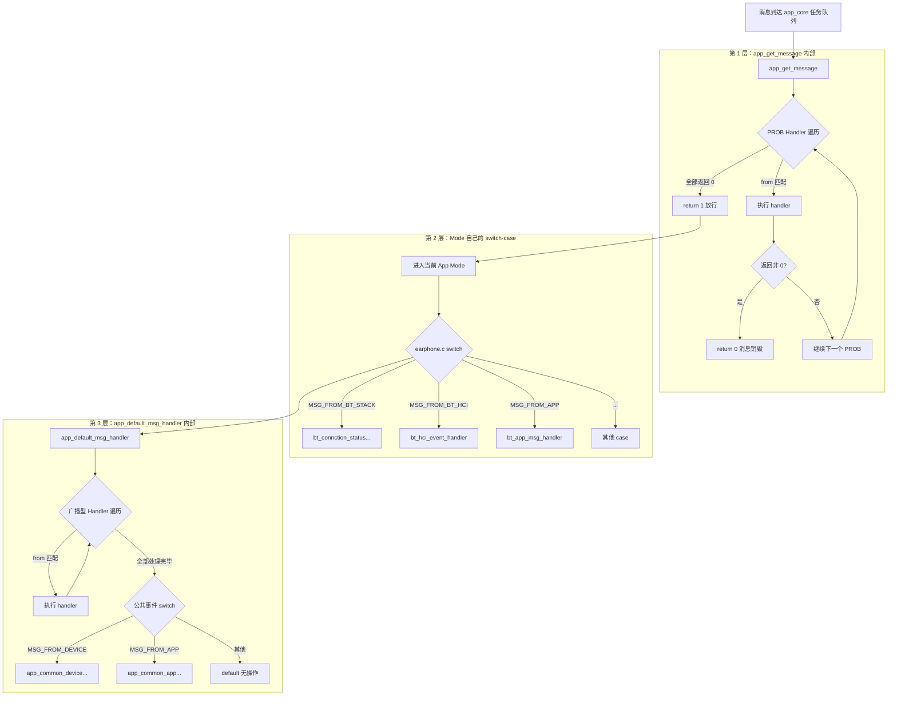
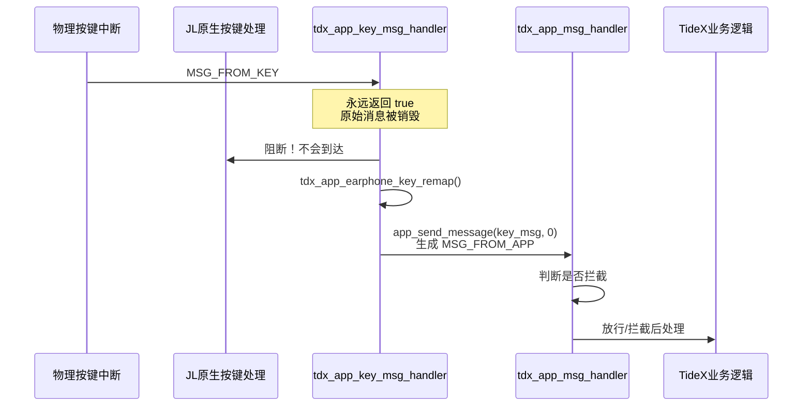
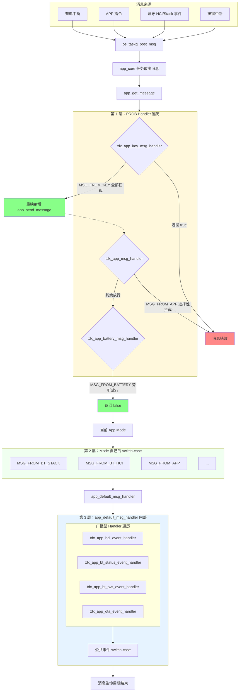

# TideX 的消息代理机制

## 一、JL 平台的消息注册拦截机制

JL 平台在应用框架层实现了一套基于 **GCC Section Attribute + Linker Script** 的零侵入插件化消息总线。该机制允许第三方模块在不修改平台源码的前提下，将自己注册到系统消息流中，实现消息拦截或监听。

### 1.1 核心原理

```c
// SDK/interface/system/generic/typedef.h
#define sec(x) __attribute__((section(#x), used))

// SDK/apps/earphone/include/app_msg.h
#define APP_MSG_PROB_HANDLER(msg_handler) \
    const struct app_msg_handler msg_handler sec(.app_msg_prob_handler)

#define APP_MSG_HANDLER(msg_handler) \
    const struct app_msg_handler msg_handler sec(.app_msg_handler)
```

当某个 `.c` 文件中使用 `APP_MSG_PROB_HANDLER(foo) = {...}` 定义静态变量时，编译器将该结构体标记为属于 `.app_msg_prob_handler` ELF Section。链接器脚本 `sdk_ld.c` 中用 `KEEP(*(.app_msg_prob_handler))` 确保这些散布在各个目标文件中的符号不被优化丢弃，并按链接顺序紧凑排列在 `app_msg_prob_handler_begin` 到 `app_msg_prob_handler_end` 之间。

### 1.2 消息调度流程

`app_get_message()` 是 **所有 App Mode 的统一消息入口**。每个模式（蓝牙、`music`、`idle`、`pc` 等）的消息循环都长这样：

```c
while (1) {
    if (!app_get_message(msg, ARRAY_SIZE(msg), key_table)) {
        continue;   // 被 PROB 拦截，直接丢弃
    }
    // 模式自己的消息处理 ...
    app_default_msg_handler(msg);   // 广播型 Handler
}
```

它是**阻塞式**获取的，不是轮询。内部调用链：

```c
app_get_message()
  └─ app_core_get_message()      // 阻塞在 os_taskq_pend()
       └─ os_taskq_pend()         // uCOS 任务队列挂起，等待消息
```

`os_taskq_pend()` 会在消息队列为空时让 `app_core` 任务进入阻塞态，CPU 转去执行其他任务。有消息到来时才被唤醒，因此不存在空转轮询。

完整的四层处理链路如下：



**第 1 层（PROB 探测）**：在 `app_get_message()` 内部，消息取出后立即遍历所有 `.app_msg_prob_handler`。若某个 Handler 的 `.from` 匹配消息来源，且 Handler 函数返回非 0，则 `app_get_message()` 直接返回 `0`。调用者（如 `earphone.c`）收到 `0` 后执行 `continue`，**消息根本不会进入任何 Mode 的消息处理分支**。

**第 2 层（Mode 分发）**：若未被拦截，`app_get_message()` 返回 `1`，消息进入当前 App Mode 的处理函数（如 `earphone.c` 的 `switch(msg[0])`）。每个 Mode 只处理自己关心的消息来源。

**第 3 层（广播 + 公共事件）**：Mode 处理完毕后，在循环末尾调用 `app_default_msg_handler()`。它内部包含两个子层：

1. **广播型 Handler 遍历**：遍历所有 `.app_msg_handler`。若 `.owner == 0xff` 表示全局监听，无条件执行；若 `.from` 匹配当前消息来源，且 `.owner` 不等于当前 Mode 名（避免重复），则执行 handler。

2. **公共事件 switch-case**：处理跨模式的通用事件，如 `MSG_FROM_DEVICE`（设备状态变化）、`MSG_FROM_APP`（通用 APP 指令）。

#### PROB Handler 的两个隐性约束

1. **`owner` 字段未被使用**

   `struct app_msg_handler` 虽然包含 `owner` 字段，但 `app_get_message()` 在 PROB 遍历中**只判断 `from`**，完全不检查 `owner`：

   ```c
   for_each_app_msg_prob_handler(handler) {
       if (handler->from == msg[0]) {       // ← 仅用 from 匹配
           int abandon = handler->handler(msg + 1);
           if (abandon) {
               return 0;                     // ← 直接 return
           }
       }
   }
   ```

   这意味着 PROB Handler 的 `owner` 字段是个摆设，所有 PROB Handler 都在同一起跑线上竞争消息拦截权。

2. **隐式的链接顺序优先级**

   `for_each_app_msg_prob_handler` 是按内存地址从低到高顺序遍历的。一旦某个 Handler 匹配并返回非 0，循环立即 `return 0` 终止，**后续所有 PROB Handler 都不会再执行**。

   而 Section 内符号的排列顺序由**链接器**决定：
   - **同一 `.o` 文件内**：按源代码中定义出现的先后顺序
   - **不同 `.o` 文件间**：按 Makefile 中 `.o` 文件的链接顺序

   这意味着如果多个模块都注册了 `MSG_FROM_KEY` 的 PROB Handler，谁排在 Section 前面谁先执行。如果先执行的 Handler 返回了 true（如 TideX 的 `tdx_app_key_msg_handler` 永远返回 true），后面的 Handler **永远没有机会执行**。

### 1.3 与 Linux initcall 的关系

该机制的技术原理与 **Linux Kernel `initcall`**、**U-Boot `U_BOOT_CMD`**、**Zephyr `SYS_INIT`** 等同源，都是利用 GCC Section 属性在链接阶段收集分散符号。但 JL 的创新在于将其从"启动时一次性初始化注册表"改造为"运行时重复遍历的短消息总线"，并赋予返回值"是否截断"的语义，形成了一套轻量级的事件拦截框架。

---

## 二、TideX 注册的所有消息代理

TideX 在 `tdx_app.c`、`tdx_charge.c` 等文件中注册了 **7 个** Handler，其中 **3 个为拦截型（PROB）**，**4 个为广播型（普通）**。

### 2.1 拦截型代理（PROB Handler）

拦截型代理拥有最高优先级的否决权，可以在消息到达 JL 原生业务逻辑之前将其截断。

#### 2.1.1 APP 消息拦截 —— `tdx_app_msg_handler`

**注册位置**：`tdx_app.c:2111-2115`

```c
APP_MSG_PROB_HANDLER(tdx_app_app_msg_entry) = {
    .owner   = 0xff,
    .from    = MSG_FROM_APP,
    .handler = tdx_app_msg_handler,
};
```

该 Handler 对 `MSG_FROM_APP` 消息进行**选择性拦截**，仅对以下 5 个消息返回 `TRUE`（截断），其余全部放行：

| 消息常量 | 拦截行为 |
|---------|---------|
| `APP_MSG_RECORD_OFF` | 停止录音，触发 EMMC 下电检查 |
| `APP_MSG_RECORD_CHAT_MODE` | 设置录音场景为 Chat 模式 |
| `APP_MSG_RECORD_CALL_MODE` | 设置录音场景为 Call 模式 |
| `APP_MSG_POWER_OFF_READY` | 处理电源就绪关机流程 |
| `APP_MSG_RECORD_SWITCH` | 切换录音开关状态 |

**典型场景**：当用户通过 APP 或按键触发"停止录音"时，JL 原生的 `earphone` 模式也可能订阅了该消息，但 TideX 在第一轮 PROB 遍历中就将其吞掉，原生逻辑完全无感知。

#### 2.1.2 按键消息拦截 —— `tdx_app_key_msg_handler`

**注册位置**：`tdx_app.c:2117-2121`

```c
APP_MSG_PROB_HANDLER(tdx_app_key_msg_entry) = {
    .owner   = 0xff,
    .from    = MSG_FROM_KEY,
    .handler = tdx_app_key_msg_handler,
};
```

该 Handler 对 `MSG_FROM_KEY` 实行**全部拦截 + 改写重发**策略：

1. 若当前处于文件升级恢复状态，直接返回 `true`，**所有物理按键消息被销毁**。
2. 否则调用 `tdx_app_earphone_key_remap()` 进行按键重映射（例如短按变为录音触发）。
3. 重映射后，通过 `app_send_message(key_msg, 0)` 将新消息作为 `MSG_FROM_APP` 重新注入系统。
4. **永远返回 `true`**，原始按键消息不会到达 JL 原生按键处理逻辑。

**闭环流程**：



#### 2.1.3 电池消息拦截 —— `tdx_app_battery_msg_handler`

**注册位置**：`tdx_charge.c:374-379`

```c
APP_MSG_PROB_HANDLER(tdx_app_battery_msg_entry) = {
    .owner   = 0xff,
    .from    = MSG_FROM_BATTERY,
    .handler = tdx_app_battery_msg_handler,
};
```

该 Handler 对 `MSG_FROM_BATTERY` 消息进行**旁听处理，不拦截**（始终返回 `false`）：

| 消息常量 | 行为（TCFG_CHARGE_POWERON_ENABLE=0） | 行为（TCFG_CHARGE_POWERON_ENABLE=1） |
|---------|--------------------------------------|--------------------------------------|
| `CHARGE_EVENT_LDO5V_IN` | 关闭 EMMC、启动充电 | 启动充电、禁用 BLE 自动关机 |
| `CHARGE_EVENT_LDO5V_KEEP` | 同上 | 同上 |
| `CHARGE_EVENT_LDO5V_OFF` | 存储 RTC 时间戳后重启 | 停止充电、启用 BLE 自动关机 |

虽然返回 `false` 不阻断消息流，但 TideX 借此在充电状态变化时插入了自己的电源管理逻辑（EMMC 控制、BLE 自动开关机）。

---

### 2.2 广播型代理（APP_MSG_HANDLER）

广播型代理不拦截消息，仅作为旁听者接收特定来源的消息，用于状态同步和协议上报。

在 `app_default_msg_handler()` 中，广播型 Handler 的匹配规则如下：

- `.owner == 0xff`：表示**全局监听**，不绑定任何特定 Mode，无条件执行
- `.from == 0xff`：表示监听**所有消息来源**
- `.owner != 0xff`：表示绑定特定 Mode，只有当消息来源匹配且当前 Mode 不等于该 owner 时才执行（避免当前 Mode 重复收到自己已经处理过的消息）

TideX 注册的所有广播型 Handler 都设置 `.owner = 0xff`，因此无论当前处于蓝牙模式、`music` 模式还是 `idle` 模式，它们都能收到消息且不会被跳过。

#### 2.2.1 蓝牙 HCI 事件监听 —— `tdx_app_hci_event_handler`

**注册位置**：`tdx_app.c:2077-2081`

```c
APP_MSG_HANDLER(tdx_app_bthci_msg_entry) = {
    .owner   = 0xff,
    .from    = MSG_FROM_BT_HCI,
    .handler = tdx_app_hci_event_handler,
};
```

监听底层蓝牙 HCI 控制器事件：

| HCI 事件 | 当前处理 |
|---------|---------|
| `HCI_EVENT_CONNECTION_COMPLETE` | 仅打印日志（含 PIN/KEY 缺失错误码判断） |
| `HCI_EVENT_DISCONNECTION_COMPLETE` | 仅打印日志 |

#### 2.2.2 蓝牙协议栈状态监听 —— `tdx_app_bt_status_event_handler`

**注册位置**：`tdx_app.c:2083-2087`

```c
APP_MSG_HANDLER(tdx_app_btstack_msg_entry) = {
    .owner   = 0xff,
    .from    = MSG_FROM_BT_STACK,
    .handler = tdx_app_bt_status_event_handler,
};
```

监听蓝牙 Host 栈状态变化，并将关键事件通过 `tdx_protocol_indicate()` 上报给 TideX 协议层：

| BT 事件 | 处理行为 |
|---------|---------|
| `BT_STATUS_INIT_OK` | 延迟 1 秒执行蓝牙关机和清理 |
| `BT_STATUS_FIRST_CONNECTED` / `BT_STATUS_SECOND_CONNECTED` | 上报连接状态 = 1 到协议层 |
| `BT_STATUS_FIRST_DISCONNECT` / `BT_STATUS_SECOND_DISCONNECT` | 上报连接状态 = 0 到协议层 |
| `BT_STATUS_AVRCP_VOL_CHANGE` | 转换音量值并上报 |
| `BT_STATUS_A2DP_MEDIA_START` | 查询播放状态并上报 |
| `BT_STATUS_A2DP_MEDIA_STOP` | 上报播放状态 = 0 |
| `BT_STATUS_SCO_STATUS_CHANGE` / `BT_STATUS_SCO_DISCON` / `BT_STATUS_SCO_CONNECTION_REQ` | 仅打印日志 |
| `BT_STATUS_PHONE_INCOME` / `BT_STATUS_PHONE_OUT` / `BT_STATUS_PHONE_ACTIVE` / `BT_STATUS_PHONE_HANGUP` | 仅打印日志 |

#### 2.2.3 TWS 事件监听 —— `tdx_app_bt_tws_event_handler`

**注册位置**：`tdx_app.c:2089-2095`（条件编译）

```c
#if (TCFG_USER_TWS_ENABLE && TCFG_APP_BT_EN)
APP_MSG_HANDLER(tdx_app_tws_msg_entry) = {
    .owner   = 0xff,
    .from    = MSG_FROM_TWS,
    .handler = tdx_app_bt_tws_event_handler,
};
#endif
```

仅在 TWS 功能启用时生效，监听左右耳同步事件。TideX 在此 handler 中处理 TWS 配对、连接、断开等状态变化，并与蓝牙连接状态机联动。

#### 2.2.4 OTA 事件监听 —— `tdx_app_ota_event_handler`

**注册位置**：`tdx_app.c:2105-2109`

```c
APP_MSG_HANDLER(tdx_app_ota_msg_entry) = {
    .owner   = 0xff,
    .from    = MSG_FROM_OTA,
    .handler = tdx_app_ota_event_handler,
};
```

当 `OTA_TWS_SAME_TIME_ENABLE` 启用时，将 OTA 事件转发给 `bt_ota_event_handler()`。

---

## 三、代理机制总结

### 3.1 消息流向全景



### 3.2 "只新增不修改"的本质

TideX 对 JL 平台的接入完全通过以下方式实现：

- **不修改** `app_main.c` 的消息调度逻辑
- **不修改** `app_default_msg_handler.c` 的广播分发逻辑
- **不修改** 任何原生 Mode 的按键处理函数
- **不修改** 链接器脚本（JL 已预留这两个 Section）

TideX 所做的只是在 **自己的 `.c` 文件** 中写了 7 个静态变量定义和对应的 C 函数。编译链接后，这些 Handler 自动被收集到预定的 Section 中，JL 平台的消息中枢在遍历时"自然发现"了它们。

| 传统集成方式 | TideX 零侵入方式 |
|-------------|-----------------|
| 修改 `app_main.c` 加入 TideX 判断逻辑 | **不碰** `app_main.c`，通过 Section 自动注册 |
| 修改 `app_default_msg_handler.c` 加入分支 | **不碰** 广播分发逻辑 |
| 修改原生 Mode 的按键处理函数 | **不碰** 任何原生按键处理 |
| 修改链接器脚本加入 TideX 符号 | **不碰** 链接器脚本（JL 已预留 Section） |
| 在消息中枢显式调用 TideX API | **无显式调用**，遍历 Section 时"自然发现" |
