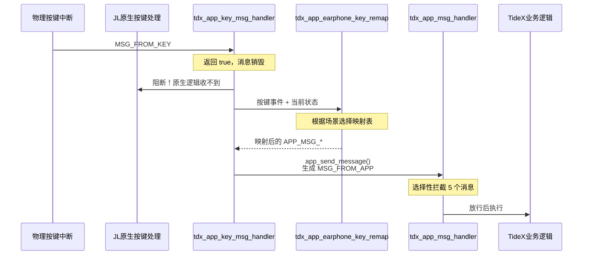

## TideX 全面接管按键消息流程

TideX 通过 `tdx_app_key_msg_handler` + `tdx_app_earphone_key_remap` 的组合，实现了对物理按键消息的**完全接管**。JL 原生的按键处理逻辑被彻底屏蔽，所有按键行为都由 TideX 重新定义。

### 1.1 接管链路



### 1.2 映射机制原理

`tdx_app_earphone_key_remap()` 的核心逻辑可以概括为 **"查表映射"**：

```c
void tdx_app_earphone_key_remap(int *value, int *msg)
{
    struct key_event *key = (struct key_event *)msg;
    int index = key->event;      // 按键动作类型作为数组索引
    u8 *pk_r = NULL;

    // 1. 根据当前状态选择映射表
    if (app_in_mode(APP_MODE_IDLE)) {
        pk_r = key_table_incharge_r;     // 充电中
    } else if (app_is_idle == TRUE) {
        pk_r = key_table_idle_r;          // 空闲待机
    } else if (wifi.onoff == TRANSFER_BY_WIFI_ON) {
        pk_r = key_table_wifi_r;          // WiFi 模式
    } else if (tdx_dut_mode) {
        pk_r = key_table_dut_r;           // DUT 模式
    } else if (record.run == RECORD_STATE_START) {
        pk_r = key_table_recording_r;     // 录音中
    } else if (get_ota_status()) {
        pk_r = key_table_ota_r;           // OTA 中
    } else if (factory_reset_active) {
        pk_r = key_table_factory_reset_r; // 恢复出厂
    } else {
        pk_r = key_table_normal_r;        // 正常模式
    }

    // 2. 从映射表中取出对应的 APP_MSG_*
    *value = pk_r[index];
}
```

**映射表的数据结构**：

```c
u8 key_table_normal_r[KEY_ACTION_MAX] = {
    APP_MSG_SINGLE_CLICK,       /* [0] click      */
    APP_MSG_RECORD_SWITCH,      /* [1] long       */
    APP_MSG_NULL,               /* [2] hold       */
    APP_MSG_LONG_PRESS_HOLDUP,  /* [3] long-up    */
    APP_MSG_DOUBLE_CLICK,       /* [4] double     */
    APP_MSG_TRIPLE_CLICK,       /* [5] triple     */
    APP_MSG_QUADRUPLE_CLICK,    /* [6] quad       */
    APP_MSG_BT_PAIR_SET_DEFAULT,/* [7] 5-click    */
    APP_MSG_SEXTUPLE_CLICK,     /* [8] 6-click    */
    APP_MSG_NULL,               /* [9] 7-click    */
    APP_MSG_DUT,                /* [10] 8-click   */
    APP_MSG_NULL,               /* [11] 9-click   */
    APP_MSG_TENUPLE_CLICK,      /* [12] 10-click  */
    APP_MSG_NULL,               /* [13] hold-1s   */
    APP_MSG_POWER_OFF_READY,    /* [14] hold-3s   */
    APP_MSG_NULL,               /* [15] hold-5s   */
    // ... 后续保留位
};
```

硬件按键事件（`key->event`）作为数组索引，直接查表得到对应的 `APP_MSG_*`。如果映射结果为 `APP_MSG_NULL`，则该按键在该场景下**无效**。

### 1.3 场景选择与映射表

`tdx_app_earphone_key_remap()` 按照**优先级从高到低**的顺序判断当前场景：

| 优先级 | 判断条件                                  | 选用的映射表                | 说明                       |
| ------ | ----------------------------------------- | --------------------------- | -------------------------- |
| 1      | `app_in_mode(APP_MODE_IDLE)`              | `key_table_incharge_r`      | 插入充电器且处于 idle 模式 |
| 2      | `app_is_idle == TRUE`                     | `key_table_idle_r`          | 系统空闲待机               |
| 3      | `wifi.onoff == TRANSFER_BY_WIFI_ON`       | `key_table_wifi_r`          | WiFi 传输模式开启          |
| 4      | `tdx_dut_mode == true`                    | `key_table_dut_r`           | DUT 测试模式               |
| 5      | `record.run == RECORD_STATE_START/RESUME` | `key_table_recording_r`     | 正在录音                   |
| 6      | `get_ota_status() == true`                | `key_table_ota_r`           | OTA 升级中                 |
| 7      | `tdx_app_factory_reset_is_active()`       | `key_table_factory_reset_r` | 恢复出厂设置流程中         |
| 8      | 以上皆不满足                              | `key_table_normal_r`        | 正常模式（默认）           |

**注意**：`key_table_calling_r` 和 `key_table_call_active_r` 虽然定义了，但在 `tdx_app_earphone_key_remap()` 中未被直接使用，属于备用表。

### 1.4 各场景按键映射详表

#### 1.4.1 正常模式 —— `key_table_normal_r`

| 索引 | 按键动作 | 映射结果                      | 功能说明               |
| ---- | -------- | ----------------------------- | ---------------------- |
| 0    | 单击     | `APP_MSG_SINGLE_CLICK`        | 单击功能               |
| 1    | 长按     | `APP_MSG_RECORD_SWITCH`       | 录音开关               |
| 2    | 按住不放 | `APP_MSG_NULL`                | 无操作                 |
| 3    | 长按抬起 | `APP_MSG_LONG_PRESS_HOLDUP`   | 长按释放提示           |
| 4    | 双击     | `APP_MSG_DOUBLE_CLICK`        | 双击功能               |
| 5    | 三击     | `APP_MSG_TRIPLE_CLICK`        | 三击功能               |
| 6    | 四击     | `APP_MSG_QUADRUPLE_CLICK`     | 四击功能               |
| 7    | 五击     | `APP_MSG_BT_PAIR_SET_DEFAULT` | 恢复蓝牙配对           |
| 8    | 六击     | `APP_MSG_SEXTUPLE_CLICK`      | 六击功能               |
| 9    | 七击     | `APP_MSG_NULL`                | 无操作                 |
| 10   | 八击     | `APP_MSG_DUT`                 | 进入 DUT 模式          |
| 11   | 九击     | `APP_MSG_NULL`                | 无操作                 |
| 12   | 十击     | `APP_MSG_TENUPLE_CLICK`       | 十击功能               |
| 13   | 按住 1s  | `APP_MSG_NULL`                | 无操作                 |
| 14   | 按住 3s  | `APP_MSG_POWER_OFF_READY`     | 关机（Raycon 产品）    |
| 15   | 按住 5s  | `APP_MSG_POWER_OFF_READY`     | 关机（非 Raycon 产品） |

#### 1.4.2 录音模式 —— `key_table_recording_r`

与正常模式高度相似，但**屏蔽了复杂多击**，防止误触中断录音：

| 索引  | 按键动作   | 映射结果                    | 与正常模式差异                               |
| ----- | ---------- | --------------------------- | -------------------------------------------- |
| 0     | 单击       | `APP_MSG_SINGLE_CLICK`      | 相同                                         |
| 1     | 长按       | `APP_MSG_RECORD_SWITCH`     | 相同（用于停止录音）                         |
| 3     | 长按抬起   | `APP_MSG_LONG_PRESS_HOLDUP` | 相同                                         |
| 4     | 双击       | `APP_MSG_DOUBLE_CLICK`      | 相同                                         |
| 5     | 三击       | `APP_MSG_TRIPLE_CLICK`      | 相同                                         |
| 6     | 四击       | `APP_MSG_NULL`              | **屏蔽**（正常模式为 `QUADRUPLE_CLICK`）     |
| 7     | 五击       | `APP_MSG_NULL`              | **屏蔽**（正常模式为 `BT_PAIR_SET_DEFAULT`） |
| 8     | 六击       | `APP_MSG_NULL`              | **屏蔽**                                     |
| 10    | 八击       | `APP_MSG_NULL`              | **屏蔽**（正常模式为 `DUT`）                 |
| 12    | 十击       | `APP_MSG_NULL`              | **屏蔽**（正常模式为 `TENUPLE_CLICK`）       |
| 14/15 | 长按 3s/5s | `APP_MSG_POWER_OFF_READY`   | 相同                                         |

#### 1.4.3 DUT 模式 —— `key_table_dut_r`

| 索引 | 按键动作 | 映射结果                      | 功能说明      |
| ---- | -------- | ----------------------------- | ------------- |
| 0    | 单击     | `APP_MSG_SINGLE_CLICK`        | 确认/下一步   |
| 4    | 双击     | `APP_MSG_DOUBLE_CLICK`        | DUT 菜单切换  |
| 5    | 三击     | `APP_MSG_TRIPLE_CLICK`        | DUT 菜单切换  |
| 6    | 四击     | `APP_MSG_QUADRUPLE_CLICK`     | DUT 菜单切换  |
| 7    | 五击     | `APP_MSG_BT_PAIR_SET_DEFAULT` | 恢复蓝牙配对  |
| 10   | 八击     | `APP_MSG_DUT`                 | 退出 DUT 模式 |
| 14   | 按住 3s  | `APP_MSG_DUT_HOLD_3SEC`       | DUT 专用长按  |

#### 1.4.4 恢复出厂模式 —— `key_table_factory_reset_r`

| 索引 | 按键动作 | 映射结果                    | 功能说明         |
| ---- | -------- | --------------------------- | ---------------- |
| 0    | 单击     | `APP_MSG_SINGLE_CLICK`      | 退出恢复出厂流程 |
| 1    | 长按     | `APP_MSG_RECORD_SWITCH`     | 震动提示         |
| 3    | 长按抬起 | `APP_MSG_LONG_PRESS_HOLDUP` | 确认恢复出厂     |

#### 1.4.5 其他模式

| 模式                                | 有效按键             | 说明                   |
| ----------------------------------- | -------------------- | ---------------------- |
| **空闲模式** `key_table_idle_r`     | 单击/长按/按住       | 唤醒设备               |
| **充电模式** `key_table_incharge_r` | 单击                 | 显示电量               |
| **WiFi 模式** `key_table_wifi_r`    | 单击/四击/长按 3s/5s | WiFi 相关操作          |
| **OTA 模式** `key_table_ota_r`      | 单击/长按 3s/5s      | 尽量简化，防止打断升级 |

### 1.5 特殊场景的按键屏蔽

在以下场景中，`tdx_app_earphone_key_remap()` 会直接 `return`，不进行任何映射（等效于按键被吞噬）：

| 条件                                | 行为                                     |
| ----------------------------------- | ---------------------------------------- |
| `key->value != 0`                   | 忽略非零值按键事件（通常为按键释放抖动） |
| `tdx_oled_is_mainpage_displaying()` | OLED 主页面加载中，屏蔽按键              |
| `tdx_file_sd_format_status_check()` | SD 卡格式化进行中，屏蔽按键              |
| `app_in_mode(APP_MODE_PC)`          | USB PC 模式下，屏蔽按键                  |

### 1.6 重映射后的二次过滤

`tdx_app_earphone_key_remap()` 输出的 `APP_MSG_*` 通过 `app_send_message()` 重新注入系统，成为新的 `MSG_FROM_APP` 消息。这条消息会再次经过 `tdx_app_msg_handler` 的**选择性拦截**：

| 映射输出                      | 是否被拦截 | 说明                                            |
| ----------------------------- | ---------- | ----------------------------------------------- |
| `APP_MSG_RECORD_SWITCH`       | **是**     | 被拦截，进入 TideX 录音逻辑                     |
| `APP_MSG_POWER_OFF_READY`     | **是**     | 被拦截，进入 TideX 关机逻辑                     |
| `APP_MSG_SINGLE_CLICK`        | 否         | 放行，传给 `earphone.c` 的 `bt_app_msg_handler` |
| `APP_MSG_DOUBLE_CLICK`        | 否         | 放行                                            |
| `APP_MSG_BT_PAIR_SET_DEFAULT` | 否         | 放行                                            |
| `APP_MSG_DUT`                 | 否         | 放行                                            |
| 其他                          | 否         | 放行                                            |

### 1.7 接管的彻底性

由于 `tdx_app_key_msg_handler` **永远返回 true**，JL 原生的按键处理代码（`bt_mode_key_table` 中的映射、`earphone.c` 的按键分支）**永远不会被执行**。TideX 不仅重新定义了每个按键的行为，还控制了哪些按键在哪些场景下有效——这是一种从**硬件中断到业务逻辑**的全链路接管。

## 1.8 当前局限与改进点

### 左右耳按键映射缺失

当前 `tdx_app_earphone_key_remap()` 的源码中，虽然声明了 `u8 *pk_l = NULL`，但**所有场景分支都只给 `pk_r` 赋值**，最终 `*value = pk_r[index]`。这意味着：

- `tdx_key.c` 中定义的 8 套 `_l`（左）表（如 `key_table_normal_l`、`key_table_recording_l` 等）**被完全忽略**
- `_r`（右）表是当前唯一生效的映射

**影响范围**：RC（Record Card）产品为单按键，无左右区分需求，此局限不影响当前功能。但如果未来 EP（TWS 耳机）产品需要左右耳差异化按键定义（如左耳单击=上一首、右耳单击=下一首），当前实现无法胜任。

**根因**：RC 产品无此需求，`_l` 表是预留接口但 `tdx_app_earphone_key_remap()` 未实现左右路由逻辑。

**潜在修复方向**：

1. **最小改动**：在 `tdx_app_earphone_key_remap()` 中根据按键事件的左右耳标识（需确认杰理 SDK 的传递方式）选择 `pk_l` 或 `pk_r`，同时调整 `bt_tws_key_msg_sync()` 的同步策略。
2. **重构为单表+参数化**：废除 `_l` / `_r` 双表，改为单套表 + 运行时参数覆盖，适合左右差异较小的场景。
3. **保持现状+注释**：如果可预见的产品线（RC/WT/CC）均无此需求，可在 `tdx_key.c` 和 `tdx_app.c` 中加注释说明 `_l` 表预留未用，避免后续开发者误解。

> **待决策**：是否修复取决于产品需求。若 RC 永不涉及 TWS 左右差异化按键，可暂不改动；若 EP 或其他产品有此需求，则需在 remap 层和 TWS 同步层同时设计。

### 按键映射未纳入品牌配置体系

TideX 的品牌系统通过 `TDX_CONFIG`（如 `DEEPMINER`、`NEVIEW`、`RAYCON`、`TINGNAO` 等）区分不同客户，并在 `port/brands/tdx_config_*.h` 中配置品牌参数（BLE 名称、厂商码、SKU 等）。然而，**按键映射表完全没有被纳入这一配置体系**。

**当前差异化的真实情况**：

| 客户 | 按键差异 | 实现方式 |
|------|----------|----------|
| `TINGNAO` | idle 模式唤醒行为不同 | `#if (TDX_AI_SEL_APP & APP_TINGNAO_EN)` |
| `RAYCON` | 关机长按时间（3s vs 5s）不同 | `#if (TDX_AI_SEL_APP & APP_RAYCON_EN)` |
| 其他所有客户 | **无差异** | 共享同一套默认映射 |

这意味着：

- **绝大多数客户**（DEEPMINER、NEVIEW、NOTTA、TURING 等）的按键行为**完全一致**
- 如果一个新客户（例如客户 X）需要"单击=播放/暂停"而另一个客户需要"单击=唤醒语音助手"，**无法在品牌配置层面调整**，必须直接修改 `tdx_key.c` 源码，增加 `#if (TDX_AI_SEL_APP & APP_X_EN)` 分支并重新编译

**与可配置参数的对比**：

| 参数 | 配置位置 | 新增客户是否需要改源码 |
|------|----------|----------------------|
| BLE 名称 | `port/brands/tdx_config_*.h` | 否 |
| 厂商码 | `port/brands/tdx_config_*.h` | 否 |
| 自动关机时间 | `port/brands/tdx_config_*.h` | 否 |
| **按键映射** | **`tdx_key.c` 硬编码** | **是** |

**根因**：`tdx_key.c` 中的映射表是编译期常量数组，品牌配置系统（`tdx_config_*.h`）只能覆盖宏定义，无法影响数组内容。按键映射从设计之初就没有被抽象为可配置数据结构。

**潜在改进方向**：

1. **宏覆盖方案（最小改动）**：将映射表中需要差异化的条目从数组常量改为宏，在品牌配置文件中 `#undef` + `#define` 覆盖。例如：
   ```c
   // tdx_key.c
   #ifndef KEY_NORMAL_CLICK_ACTION
   #define KEY_NORMAL_CLICK_ACTION  APP_MSG_SINGLE_CLICK
   #endif
   u8 key_table_normal_r[KEY_ACTION_MAX] = {
       KEY_NORMAL_CLICK_ACTION,    /* click */
       // ...
   };
   
   // port/brands/tdx_config_custom.h
   #undef  KEY_NORMAL_CLICK_ACTION
   #define KEY_NORMAL_CLICK_ACTION  APP_MSG_VOICE_ASSISTANT
   ```
   **优点**：改动量小，沿用现有品牌配置流程。  
   **缺点**：只能覆盖单个动作，无法应对需要整表重定义的客户；宏数量会膨胀。

2. **指针替换方案（中等改动）**：引入品牌相关的按键表指针，在初始化时根据 `TDX_AI_SEL_APP` 选择对应的表：
   ```c
   typedef struct {
       u8 *idle;
       u8 *normal;
       u8 *recording;
       // ...
   } tdx_key_table_set_t;
   
   static const tdx_key_table_set_t default_tables = {
       .idle     = key_table_idle_r,
       .normal   = key_table_normal_r,
       // ...
   };
   
   #if (TDX_AI_SEL_APP & APP_X_EN)
   static const tdx_key_table_set_t custom_tables = { ... };
   #define ACTIVE_TABLES  custom_tables
   #else
   #define ACTIVE_TABLES  default_tables
   #endif
   ```
   **优点**：可以整表替换，适合差异大的客户。  
   **缺点**：需要修改 `tdx_app_earphone_key_remap()` 的查表逻辑；每个新客户仍需在源码中注册自己的表。

3. **VM/运行时配置方案（最大改动）**：将按键映射表存入 VM 或 Flash，提供 BLE/SPP 协议命令让 App 端远程配置按键行为。
   **优点**：客户完全无需改源码，OTA 即可更新按键定义。  
   **缺点**：实现复杂度高；需要协议层支持；与当前编译期查表机制冲突较大。

> **待决策**：当前 20+ 品牌客户中，如果绝大多数按键需求一致，只有零星客户需要微调，方案 1（宏覆盖）最经济；如果未来品牌客户的按键差异化需求增多，则需要评估方案 2 或 3。

### 现有客户差异化的真实实现

前文提到"绝大多数客户按键映射一致"，需要补充说明：现有客户中确实有一部分实现了差异化，但**全部是源码级硬编码**，不是通过品牌配置文件动态调整。

#### TINGNAO 的差异化

**实现位置**：`port/app/tdx_key.c:55-101`

```c
#if (TDX_AI_SEL_APP & APP_TINGNAO_EN)
u8 key_table_idle_r[KEY_ACTION_MAX] = {
    APP_MSG_NULL,           /* click — TINGNAO 单击无效 */
    APP_MSG_RDX_APP_WAKEUP, /* long  — TINGNAO 长按唤醒 */
    // ...
};
#else
u8 key_table_idle_r[KEY_ACTION_MAX] = {
    APP_MSG_RDX_APP_WAKEUP, /* click — 其他客户单击唤醒 */
    APP_MSG_NULL,           /* long  — 其他客户长按无效 */
    // ...
};
#endif
```

**差异**：idle（空闲待机）模式下，TINGNAO 是**长按唤醒**，其他客户是**单击唤醒**。

#### RAYCON 的差异化

RAYCON 有两层差异化，比 TINGNAO 更复杂：

**第 1 层 —— 按键表（`tdx_key.c`）**：

```c
#if (TDX_AI_SEL_APP & APP_RAYCON_EN)
    APP_MSG_POWER_OFF_READY,    /* hold-3s — RAYCON 3秒关机 */
    APP_MSG_NULL,               /* hold-5s */
#else
    APP_MSG_NULL,               /* hold-3s — 其他客户 5秒关机 */
    APP_MSG_POWER_OFF_READY,    /* hold-5s */
#endif
```

**差异**：RAYCON 的关机长按时间是 **3 秒**，其他所有客户是 **5 秒**。这一差异存在于 `normal`、`recording`、`dut`、`ota`、`wifi`、`factory_reset` 共 6 个表中。

**第 2 层 —— 自定义操作回调表（`tdx_app_custom_ops.c`）**：

TideX 引入了一套 `tdx_app_custom_ops_t` 回调表，把客户差异从散落的 `#if` 块集中到单一文件中。RAYCON 在此表中的覆盖：

| 回调字段 | RAYCON | 通用默认（NEVIEW/NOTTA/SHENGLANG/TURING） | 差异说明 |
|----------|--------|------------------------------------------|----------|
| `on_triple_click` | `_click_noop` | `_click_show_fwhw_version` | RAYCON 三击无效 |
| `on_quadruple_click` | `_click_noop` | `_click_show_device_qr` | RAYCON 四击无效 |
| `on_quintuple_click` | `_click_show_device_qr` | `_click_sys_reset` | RAYCON 五击=二维码（其他=恢复出厂） |
| `on_sextuple_click` | `_click_show_fwhw_version` | `_click_noop` | RAYCON 六击=版本（其他=无效） |
| `on_septuple_click` | `_click_factory_reset` | `_click_noop` | RAYCON 七击=恢复出厂（其他=无效） |
| `on_long_press_factory_check` | `_long_press_factory_raycon` | `_factory_check_noop` | RAYCON 长按工厂重置拦截 |
| `suppress_record_off_indicate` | `true` | `false` | RAYCON 不播停止录音提示 |

**关键理解**：`tdx_app_custom_ops_t` 处理的**不是映射表中的动作**，而是映射表**放行后**的动作（见 1.6 节）。例如 `on_quintuple_click` 是五击映射为 `APP_MSG_BT_PAIR_SET_DEFAULT` 后，在 `earphone.c` 中实际执行的行为。RAYCON 通过覆盖这个回调，让五击从"恢复蓝牙配对"变成了"显示设备二维码"。

#### 其他客户的差异化

| 客户 | 差异化位置 | 差异内容 |
|------|-----------|----------|
| **AITIR** | `tdx_app_custom_ops.c` | 录制显示无 scene、单击录音时显示录制图标、三击=版本、四击=二维码、五击=恢复出厂 |
| **NINGQU / JMEASY / TTEASY** | `tdx_app_custom_ops.c` | 录音中单机=显示电量、开机显示电量、低电量振动 |
| **CDJY / BRANDWORKS / LYNSE / YYS / FINDAI / DEEPMINER / AISPEECH** | `tdx_app_custom_ops.c` | 只有一个标志位差异：`suppress_record_off_indicate = true` |

#### 其余客户能否参考实现？

**可以，但有前提**：

1. **TINGNAO/RAYCON 的 `#if` 条件编译模式**：任何新客户如果需要修改按键映射表中的某个动作（如"单击 = 播放/暂停"），可以直接在 `tdx_key.c` 中加入 `#if (TDX_AI_SEL_APP & APP_X_EN)` 分支。这是最直接的参考方式。

2. **`tdx_app_custom_ops.c` 的回调表模式**：如果差异不在映射表本身，而在放行后的动作（如三击后显示什么内容），可以参考 RAYCON/AITIR 的方式，在 `g_custom_ops` 表中新增 `#elif` 分支。

3. **但所有方式都逃不开"改源码+重新编译"**：无论用 `#if` 还是回调表，新增客户都需要：
   - 在 `tdx_brand_select.h` 中定义 `TDX_CID_XXX` 和 `APP_XXX_EN`（已有 20 个客户）
   - 在 `tdx_key.c` 或 `tdx_app_custom_ops.c` 中添加条件编译分支
   - 重新编译整个固件

这与 BLE 名称、厂商码等品牌参数形成鲜明对比——后者只需在 `port/brands/tdx_config_*.h` 中 `#undef` + `#define`，无需碰任何 `.c` 文件。按键映射的差异化在架构上没有被提升到"品牌可配置"的层级。

### 条件编译方式的软件工程缺陷

现有的客户差异化实现（`#if (TDX_AI_SEL_APP & APP_XXX_EN)`）存在两个结构性问题：

#### 1. 代码臃肿与可维护性下降

`tdx_key.c` 当前已经有 8 套 × 2（`_l` / `_r`）= 16 个按键映射表，每个表 22 个元素。RAYCON 的差异需要在 6 个表中重复同样的 `#if / #else` 块：

```c
// normal 表里有
#if (TDX_AI_SEL_APP & APP_RAYCON_EN)
    APP_MSG_POWER_OFF_READY,    /* hold-3s */
    APP_MSG_NULL,               /* hold-5s */
#else
    APP_MSG_NULL,               /* hold-3s */
    APP_MSG_POWER_OFF_READY,    /* hold-5s */
#endif

// recording 表里再重复一遍同样的 #if
// dut 表里再重复一遍
// ota 表里再重复一遍
// ...
```

如果未来 20 个客户中有 5 个需要各自的按键微调，`tdx_key.c` 将变成一个由条件编译碎片拼接而成的文件，阅读、审查、调试的成本急剧上升。这是典型的"用预处理器做运行时决策"的反模式。

#### 2. 产品与客户的正交性缺失

当前架构的隐含假设是：**所有产品（RC / EP / CC / WT）的所有客户共享同一套按键映射基线**，差异化仅通过条件编译补丁实现。这在逻辑上混淆了两个本应正交的维度：

| 维度 | 当前实现 | 理想状态 |
|------|----------|----------|
| **产品形态**（RC/EP/CC/WT） | 通过 `TDX_PRODUCT_*` 控制初始化流程，但按键表不分产品 | RC 单按键、EP TWS、CC 无按键，理应各有自己的默认映射 |
| **客户品牌**（DEEPMINER/NEVIEW/等） | 通过 `#if APP_XXX_EN` 打补丁 | 应在产品基线上做品牌级微调 |

现实情况是：
- RC（录音笔）产品有单按键，但代码里同时存在 `_l` 和 `_r` 表，`_l` 被浪费
- EP（TWS 耳机）产品理论上需要左右耳区分，但当前完全没有利用 `_l` 表
- CC（充电盒）产品可能根本不需要按键映射，但 `tdx_key.c` 仍然被编译进固件
- 所有客户的"normal 模式"基线完全一致，只有 RAYCON 和 TINGNAO 在源码中打了补丁

**更合理的架构应该是**：

```
产品层默认映射（RC 用 rc_default，EP 用 ep_default）
        ↓
客户层品牌覆盖（可选，通过品牌配置文件或回调表）
        ↓
运行时生效的映射表
```

而不是现在的"一个巨型文件 + 条件编译补丁"。

#### 潜在重构方向

1. **产品级映射分离**：为不同产品形态（RC/EP/CC/WT）分别定义默认按键表，放在 `port/products/*/key_tables.c` 中，由 `TDX_PRODUCT_*` 路由选择编译。
2. **客户覆盖层**：在产品默认表之上，通过 `tdx_app_custom_ops_t` 或品牌配置宏做增量覆盖，而不是整表重复定义。
3. **`_l` / `_r` 表的激活**：如果 EP 产品确实需要左右耳差异化，在 `tdx_app_earphone_key_remap()` 中实现左右路由，而非让 `_l` 表永远闲置。

> **待决策**：当前 20+ 客户、5+ 产品的组合下，条件编译方式的技术债务尚未造成实际阻塞（编译和运行都正常）。是否重构取决于业务增长预期——如果客户数量继续增加、产品形态继续分化，越早引入产品/客户分层越能避免后期的"条件编译爆炸"。

