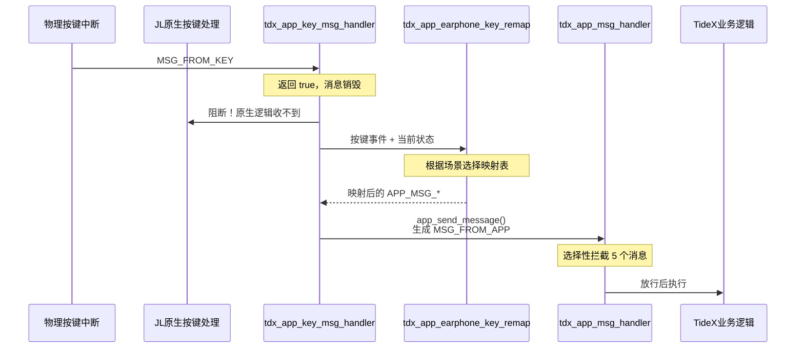

## TideX 全面接管按键消息流程

TideX 通过 `tdx_app_key_msg_handler` + `tdx_app_earphone_key_remap` 的组合，实现了对物理按键消息的**完全接管**。JL 原生的按键处理逻辑被彻底屏蔽，所有按键行为都由 TideX 重新定义。

### 1.1 接管链路



### 1.2 映射机制原理

`tdx_app_earphone_key_remap()` 的核心逻辑可以概括为 **"查表映射"**：

```c
void tdx_app_earphone_key_remap(int *value, int *msg)
{
    struct key_event *key = (struct key_event *)msg;
    int index = key->event;      // 按键动作类型作为数组索引
    u8 *pk_r = NULL;

    // 1. 根据当前状态选择映射表
    if (app_in_mode(APP_MODE_IDLE)) {
        pk_r = key_table_incharge_r;     // 充电中
    } else if (app_is_idle == TRUE) {
        pk_r = key_table_idle_r;          // 空闲待机
    } else if (wifi.onoff == TRANSFER_BY_WIFI_ON) {
        pk_r = key_table_wifi_r;          // WiFi 模式
    } else if (tdx_dut_mode) {
        pk_r = key_table_dut_r;           // DUT 模式
    } else if (record.run == RECORD_STATE_START) {
        pk_r = key_table_recording_r;     // 录音中
    } else if (get_ota_status()) {
        pk_r = key_table_ota_r;           // OTA 中
    } else if (factory_reset_active) {
        pk_r = key_table_factory_reset_r; // 恢复出厂
    } else {
        pk_r = key_table_normal_r;        // 正常模式
    }

    // 2. 从映射表中取出对应的 APP_MSG_*
    *value = pk_r[index];
}
```

**映射表的数据结构**：

```c
u8 key_table_normal_r[KEY_ACTION_MAX] = {
    APP_MSG_SINGLE_CLICK,       /* [0] click      */
    APP_MSG_RECORD_SWITCH,      /* [1] long       */
    APP_MSG_NULL,               /* [2] hold       */
    APP_MSG_LONG_PRESS_HOLDUP,  /* [3] long-up    */
    APP_MSG_DOUBLE_CLICK,       /* [4] double     */
    APP_MSG_TRIPLE_CLICK,       /* [5] triple     */
    APP_MSG_QUADRUPLE_CLICK,    /* [6] quad       */
    APP_MSG_BT_PAIR_SET_DEFAULT,/* [7] 5-click    */
    APP_MSG_SEXTUPLE_CLICK,     /* [8] 6-click    */
    APP_MSG_NULL,               /* [9] 7-click    */
    APP_MSG_DUT,                /* [10] 8-click   */
    APP_MSG_NULL,               /* [11] 9-click   */
    APP_MSG_TENUPLE_CLICK,      /* [12] 10-click  */
    APP_MSG_NULL,               /* [13] hold-1s   */
    APP_MSG_POWER_OFF_READY,    /* [14] hold-3s   */
    APP_MSG_NULL,               /* [15] hold-5s   */
    // ... 后续保留位
};
```

硬件按键事件（`key->event`）作为数组索引，直接查表得到对应的 `APP_MSG_*`。如果映射结果为 `APP_MSG_NULL`，则该按键在该场景下**无效**。

### 1.3 场景选择与映射表

`tdx_app_earphone_key_remap()` 按照**优先级从高到低**的顺序判断当前场景：

| 优先级 | 判断条件                                  | 选用的映射表                | 说明                       |
| ------ | ----------------------------------------- | --------------------------- | -------------------------- |
| 1      | `app_in_mode(APP_MODE_IDLE)`              | `key_table_incharge_r`      | 插入充电器且处于 idle 模式 |
| 2      | `app_is_idle == TRUE`                     | `key_table_idle_r`          | 系统空闲待机               |
| 3      | `wifi.onoff == TRANSFER_BY_WIFI_ON`       | `key_table_wifi_r`          | WiFi 传输模式开启          |
| 4      | `tdx_dut_mode == true`                    | `key_table_dut_r`           | DUT 测试模式               |
| 5      | `record.run == RECORD_STATE_START/RESUME` | `key_table_recording_r`     | 正在录音                   |
| 6      | `get_ota_status() == true`                | `key_table_ota_r`           | OTA 升级中                 |
| 7      | `tdx_app_factory_reset_is_active()`       | `key_table_factory_reset_r` | 恢复出厂设置流程中         |
| 8      | 以上皆不满足                              | `key_table_normal_r`        | 正常模式（默认）           |

**注意**：`key_table_calling_r` 和 `key_table_call_active_r` 虽然定义了，但在 `tdx_app_earphone_key_remap()` 中未被直接使用，属于备用表。

### 1.4 各场景按键映射详表

#### 1.4.1 正常模式 —— `key_table_normal_r`

| 索引 | 按键动作 | 映射结果                      | 功能说明               |
| ---- | -------- | ----------------------------- | ---------------------- |
| 0    | 单击     | `APP_MSG_SINGLE_CLICK`        | 单击功能               |
| 1    | 长按     | `APP_MSG_RECORD_SWITCH`       | 录音开关               |
| 2    | 按住不放 | `APP_MSG_NULL`                | 无操作                 |
| 3    | 长按抬起 | `APP_MSG_LONG_PRESS_HOLDUP`   | 长按释放提示           |
| 4    | 双击     | `APP_MSG_DOUBLE_CLICK`        | 双击功能               |
| 5    | 三击     | `APP_MSG_TRIPLE_CLICK`        | 三击功能               |
| 6    | 四击     | `APP_MSG_QUADRUPLE_CLICK`     | 四击功能               |
| 7    | 五击     | `APP_MSG_BT_PAIR_SET_DEFAULT` | 恢复蓝牙配对           |
| 8    | 六击     | `APP_MSG_SEXTUPLE_CLICK`      | 六击功能               |
| 9    | 七击     | `APP_MSG_NULL`                | 无操作                 |
| 10   | 八击     | `APP_MSG_DUT`                 | 进入 DUT 模式          |
| 11   | 九击     | `APP_MSG_NULL`                | 无操作                 |
| 12   | 十击     | `APP_MSG_TENUPLE_CLICK`       | 十击功能               |
| 13   | 按住 1s  | `APP_MSG_NULL`                | 无操作                 |
| 14   | 按住 3s  | `APP_MSG_POWER_OFF_READY`     | 关机（Raycon 产品）    |
| 15   | 按住 5s  | `APP_MSG_POWER_OFF_READY`     | 关机（非 Raycon 产品） |

#### 1.4.2 录音模式 —— `key_table_recording_r`

与正常模式高度相似，但**屏蔽了复杂多击**，防止误触中断录音：

| 索引  | 按键动作   | 映射结果                    | 与正常模式差异                               |
| ----- | ---------- | --------------------------- | -------------------------------------------- |
| 0     | 单击       | `APP_MSG_SINGLE_CLICK`      | 相同                                         |
| 1     | 长按       | `APP_MSG_RECORD_SWITCH`     | 相同（用于停止录音）                         |
| 3     | 长按抬起   | `APP_MSG_LONG_PRESS_HOLDUP` | 相同                                         |
| 4     | 双击       | `APP_MSG_DOUBLE_CLICK`      | 相同                                         |
| 5     | 三击       | `APP_MSG_TRIPLE_CLICK`      | 相同                                         |
| 6     | 四击       | `APP_MSG_NULL`              | **屏蔽**（正常模式为 `QUADRUPLE_CLICK`）     |
| 7     | 五击       | `APP_MSG_NULL`              | **屏蔽**（正常模式为 `BT_PAIR_SET_DEFAULT`） |
| 8     | 六击       | `APP_MSG_NULL`              | **屏蔽**                                     |
| 10    | 八击       | `APP_MSG_NULL`              | **屏蔽**（正常模式为 `DUT`）                 |
| 12    | 十击       | `APP_MSG_NULL`              | **屏蔽**（正常模式为 `TENUPLE_CLICK`）       |
| 14/15 | 长按 3s/5s | `APP_MSG_POWER_OFF_READY`   | 相同                                         |

#### 1.4.3 DUT 模式 —— `key_table_dut_r`

| 索引 | 按键动作 | 映射结果                      | 功能说明      |
| ---- | -------- | ----------------------------- | ------------- |
| 0    | 单击     | `APP_MSG_SINGLE_CLICK`        | 确认/下一步   |
| 4    | 双击     | `APP_MSG_DOUBLE_CLICK`        | DUT 菜单切换  |
| 5    | 三击     | `APP_MSG_TRIPLE_CLICK`        | DUT 菜单切换  |
| 6    | 四击     | `APP_MSG_QUADRUPLE_CLICK`     | DUT 菜单切换  |
| 7    | 五击     | `APP_MSG_BT_PAIR_SET_DEFAULT` | 恢复蓝牙配对  |
| 10   | 八击     | `APP_MSG_DUT`                 | 退出 DUT 模式 |
| 14   | 按住 3s  | `APP_MSG_DUT_HOLD_3SEC`       | DUT 专用长按  |

#### 1.4.4 恢复出厂模式 —— `key_table_factory_reset_r`

| 索引 | 按键动作 | 映射结果                    | 功能说明         |
| ---- | -------- | --------------------------- | ---------------- |
| 0    | 单击     | `APP_MSG_SINGLE_CLICK`      | 退出恢复出厂流程 |
| 1    | 长按     | `APP_MSG_RECORD_SWITCH`     | 震动提示         |
| 3    | 长按抬起 | `APP_MSG_LONG_PRESS_HOLDUP` | 确认恢复出厂     |

#### 1.4.5 其他模式

| 模式                                | 有效按键             | 说明                   |
| ----------------------------------- | -------------------- | ---------------------- |
| **空闲模式** `key_table_idle_r`     | 单击/长按/按住       | 唤醒设备               |
| **充电模式** `key_table_incharge_r` | 单击                 | 显示电量               |
| **WiFi 模式** `key_table_wifi_r`    | 单击/四击/长按 3s/5s | WiFi 相关操作          |
| **OTA 模式** `key_table_ota_r`      | 单击/长按 3s/5s      | 尽量简化，防止打断升级 |

### 1.5 特殊场景的按键屏蔽

在以下场景中，`tdx_app_earphone_key_remap()` 会直接 `return`，不进行任何映射（等效于按键被吞噬）：

| 条件                                | 行为                                     |
| ----------------------------------- | ---------------------------------------- |
| `key->value != 0`                   | 忽略非零值按键事件（通常为按键释放抖动） |
| `tdx_oled_is_mainpage_displaying()` | OLED 主页面加载中，屏蔽按键              |
| `tdx_file_sd_format_status_check()` | SD 卡格式化进行中，屏蔽按键              |
| `app_in_mode(APP_MODE_PC)`          | USB PC 模式下，屏蔽按键                  |

### 1.6 重映射后的二次过滤

`tdx_app_earphone_key_remap()` 输出的 `APP_MSG_*` 通过 `app_send_message()` 重新注入系统，成为新的 `MSG_FROM_APP` 消息。这条消息会再次经过 `tdx_app_msg_handler` 的**选择性拦截**：

| 映射输出                      | 是否被拦截 | 说明                                            |
| ----------------------------- | ---------- | ----------------------------------------------- |
| `APP_MSG_RECORD_SWITCH`       | **是**     | 被拦截，进入 TideX 录音逻辑                     |
| `APP_MSG_POWER_OFF_READY`     | **是**     | 被拦截，进入 TideX 关机逻辑                     |
| `APP_MSG_SINGLE_CLICK`        | 否         | 放行，传给 `earphone.c` 的 `bt_app_msg_handler` |
| `APP_MSG_DOUBLE_CLICK`        | 否         | 放行                                            |
| `APP_MSG_BT_PAIR_SET_DEFAULT` | 否         | 放行                                            |
| `APP_MSG_DUT`                 | 否         | 放行                                            |
| 其他                          | 否         | 放行                                            |

### 1.7 接管的彻底性

由于 `tdx_app_key_msg_handler` **永远返回 true**，JL 原生的按键处理代码（`bt_mode_key_table` 中的映射、`earphone.c` 的按键分支）**永远不会被执行**。TideX 不仅重新定义了每个按键的行为，还控制了哪些按键在哪些场景下有效——这是一种从**硬件中断到业务逻辑**的全链路接管。

