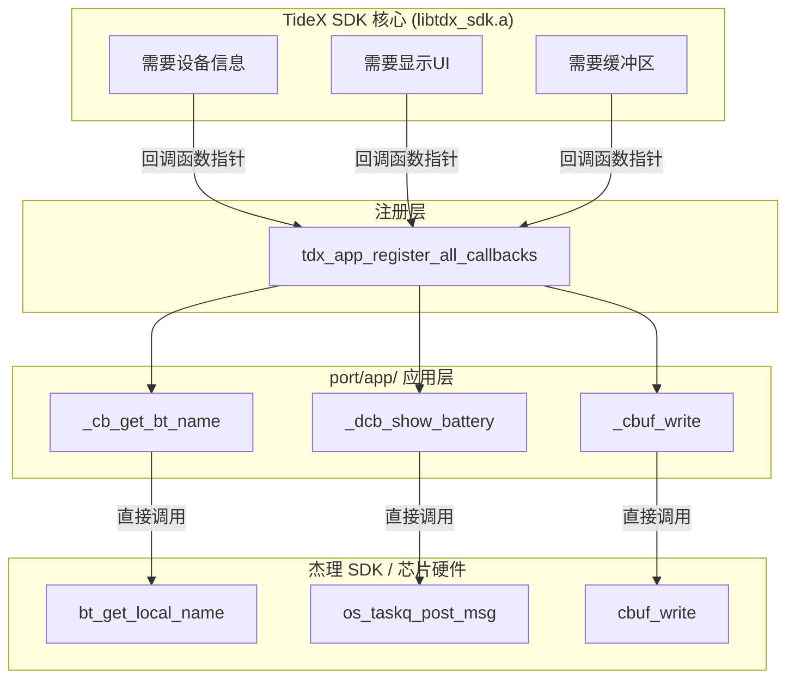
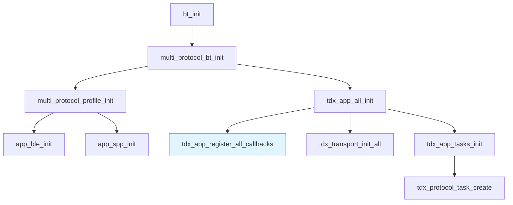
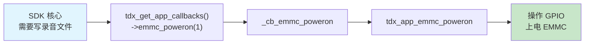

# 1.通用层初始化详解

## 1.1 EMMC 空闲超时自动断电机制

`tdx_app_emmc_poweroff_check_timer_stop()` 是 EMMC 电源管理模块的入口函数，但它不应该被孤立理解——它是整套**空闲超时自动断电机制**的一部分。EMMC 和 OLED 共用一路 VDD LDO 供电，为了延长待机时间，TideX 设计了一套策略：当检测到 EMMC 及相关外设连续空闲超过 10 秒，自动切断 VDD LDO。

### 1.1.1 初始化时的防御性清理

`tdx_app_all_init()` 中首先调用 `tdx_app_emmc_poweroff_check_timer_stop()`：

```c
static tdx_hal_timer_t s_emmc_poweroff_timer = NULL;

void tdx_app_emmc_poweroff_check_timer_stop(void)
{
    if (s_emmc_poweroff_timer) {
        tdx_hal_timer_delete(s_emmc_poweroff_timer);
        s_emmc_poweroff_timer = NULL;
    }
}
```

此时 `s_emmc_poweroff_timer` 是上电时被 BSS 段清零为 `NULL` 的静态变量，`if` 条件不满足，函数直接返回。**这个调用在初始化路径上不做任何事情，是一个防御性写法**——确保无论之前是什么状态，定时器都从干净状态开始。

### 1.1.2 机制全貌与状态流转

完整的电源管理涉及 5 个函数协同：

```c
[断电状态]
    │
    ▼ tdx_app_emmc_poweron()
[运行中] ◄────────────────────────────┐
    │                                   │
    │ 空闲 10s                          │ 上电/恢复操作
    ▼                                   │
tdx_app_emmc_poweroff_check_timer_start()
    │
    ▼ 定时器到期
tdx_app_emmc_poweroff_check_timer_cb()
    │
    ├── 任一忙碌条件满足 ──→ tdx_app_emmc_poweroff_check_timer_stop()
    │                        + tdx_app_emmc_poweroff_check_timer_start()
    │                        (重试，回到运行中)
    │
    └── 全部空闲 ──────────→ tdx_app_emmc_poweroff()
                             + tdx_app_emmc_poweroff_check_timer_stop()
                             (断电，回到断电状态)
```

### 1.1.3 空闲判定条件

定时器回调 `tdx_app_emmc_poweroff_check_timer_cb()` 中依次检查以下条件，**任一满足则判定为"不空闲"**，停止旧定时器并重新启动新定时器：

| 检查条件   | 代码逻辑                                                     | 原因                              |
| ---------- | ------------------------------------------------------------ | --------------------------------- |
| WiFi 活跃  | `pw->onoff == TRANSFER_BY_WIFI_ON`                           | WiFi 可能在传输文件，不能断电     |
| 离线录音中 | `rp->orig_mode == RECORD_MODE_OFFLINE && (rp->run == RECORD_STATE_START \|\| RECORD_STATE_RESUME)` | 正在写录音数据到 EMMC             |
| 文件同步中 | `tdx_file_is_sync_in_progress()`                             | BLE/WiFi 正在同步文件             |
| 显示忙碌   | `s_is_display_idle_fn && !s_is_display_idle_fn()`            | OLED 还在刷新，断电会导致显示异常 |
| 振动活跃   | `s_is_vibrate_active_fn && s_is_vibrate_active_fn()`         | 马达运转时保持供电稳定            |

如果上述条件全部不满足，回调执行 `tdx_app_emmc_poweroff()`，切断 VDD LDO。

另外，USB 模式下 `tdx_app_emmc_poweroff_check_timer_start()` 会直接返回，不启动定时器——因为 USB 模式下 EMMC 需要持续可用。

### 1.1.4 关键函数的生命周期调用点

`tdx_app_emmc_poweroff_check_timer_stop()` 在源代码中被 4 处调用：

| 调用位置                                 | 调用者         | 场景                         | 必要性              |
| ---------------------------------------- | -------------- | ---------------------------- | ------------------- |
| `tdx_app_all_init()` 初始化流程          | 开机           | 防御性清理                   | 冗余（句柄为 NULL） |
| `tdx_app_emmc_poweron()`                 | 上电           | 先停旧定时器，再启新定时器   | **必要**            |
| `tdx_app_emmc_poweroff()`                | 断电           | 定时器没意义了，必须停       | **必要**            |
| `tdx_app_emmc_poweroff_check_timer_cb()` | 条件满足需重试 | 先停旧再启新，避免重复定时器 | **必要**            |

### 1.1.5 设计要点

- **超时时间**：默认 10 秒（`TDX_EMMC_IDLE_POWEROFF_MS = 10 * 1000`），通过 `tdx_hal_timer_create(..., false)` 创建为**单次定时器**，非周期。
- **解耦设计**：显示空闲、振动状态、USB 模式的检查通过注册回调函数完成（`tdx_app_power_set_display_idle_check()` 等），避免 `tdx_app_power.c` 直接依赖具体硬件。
- **临界区安全**：`s_emmc_poweroff_timer` 是模块内静态变量，所有操作都在 `tdx_app_power.c` 内部完成，不存在竞态问题。

### 1.1.6 回调注册函数

`tdx_app_power.c` 内部定义了三个静态函数指针变量：

```c
static bool (*s_is_display_idle_fn)(void)   = NULL;
static bool (*s_is_vibrate_active_fn)(void) = NULL;
static bool (*s_is_usb_mode_fn)(void)       = NULL;
```

对外提供的三个注册函数只是把外部传入的函数指针存入这些静态变量：

```c
void tdx_app_power_set_display_idle_check(bool (*fn)(void))
{
    s_is_display_idle_fn = fn;
}
```

后续在 `tdx_app_emmc_poweroff_check_timer_cb()` 中直接调用这些静态变量来判断状态：

- `tdx_app_power.c` 不直接调用其他模块的函数，而是通过函数指针间接调用。

```c
if (s_is_display_idle_fn && !s_is_display_idle_fn()) {
    // 显示忙碌，推迟断电
}
```

| 注册函数                                   | 存入的静态变量           | 被调用位置                        |
| ------------------------------------------ | ------------------------ | --------------------------------- |
| `tdx_app_power_set_display_idle_check()`   | `s_is_display_idle_fn`   | 定时器回调，判断显示是否空闲      |
| `tdx_app_power_set_vibrate_active_check()` | `s_is_vibrate_active_fn` | 定时器回调，判断振动是否活跃      |
| `tdx_app_power_set_usb_mode_check()`       | `s_is_usb_mode_fn`       | 定时器启动前，判断是否为 USB 模式 |

## 1.2 Tidex的静态库适配层回调注册机制

`tdx_app_register_all_callbacks()` 是 TideX SDK 核心 (`libtdx_sdk.a`) 与Tidex中间件应用层 (`port/app/`) 之间的**唯一桥接点**。SDK 核心完全不依赖任何 `port/` 目录的头文件，它只通过 4 张回调表向外界请求服务；本函数在启动时一次性把这些回调表的实现注册给 SDK，完成双向绑定。

### 1.2.1 四张回调表的分工

| 回调表                  | 类型定义          | 注册函数                       | 作用域                                                       | 可选性                 |
| ----------------------- | ----------------- | ------------------------------ | ------------------------------------------------------------ | ---------------------- |
| `tdx_app_callbacks_t`   | `tdx_callbacks.h` | `tdx_register_app_callbacks()` | 设备信息、鉴权、绑定状态、BT/BLE 名称、电源管理、MIC 增益、WiFi 状态、EMMC 控制、时钟锁 | **必须**               |
| `tdx_ui_callbacks_t`    | `tdx_callbacks.h` | `tdx_register_ui_callbacks()`  | OLED 显示：画面切换、电池、二维码、OTA 进度、文本显示        | 依赖 `TDX_HAS_DISPLAY` |
| `tdx_cbuf_ops_t`        | `tdx_callbacks.h` | `tdx_register_cbuf_ops()`      | 环形缓冲区抽象（创建/读写/销毁），用于大文件传输             | **必须**               |
| `tdx_event_callbacks_t` | `tdx_api_event.h` | `tdx_register_callbacks()`     | 异步事件：BLE 连接/断开、WiFi 数据、录音状态、OTA、文件传输完成 | **当前未注册**         |

### 1.2.2 三层桥接模型

```
┌─────────────────────────────────────────┐
│         TideX SDK 核心 (libtdx_sdk.a)    │
│  需要设备信息 ──► get_dev_base_info()    │
│  需要显示 UI ───► show_battery()         │
│  需要缓冲区 ────► cbuf_write()           │
└──────────────────┬──────────────────────┘
                   │ 通过函数指针调用
                   │ SDK 不依赖 port/ 头文件
                   ▼
┌─────────────────────────────────────────┐
│  tdx_app_register_all_callbacks()        │
│  tdx_register_app_callbacks(&s_app_cbs)  │
│  tdx_register_ui_callbacks(&s_ui_cbs)    │
│  tdx_register_cbuf_ops(&s_cbuf_ops)      │
└──────────────────┬──────────────────────┘
                   │
                   ▼
┌─────────────────────────────────────────┐
│           port/app/ 应用层实现            │
│  s_app_cbs.get_bt_name ──► _cb_get_bt_name()
│  s_ui_cbs.show_battery ──► _dcb_show_battery()
│  s_cbuf_ops.write      ──► _cbuf_write()
└────────┬────────────────────────────────┘
         │
         │ 直接包含头文件调用
         ▼
┌─────────────────────────────────────────┐
│           杰理 SDK / 芯片硬件             │
│  bt_get_local_name()   (蓝牙栈)          │
│  os_taskq_post_msg()   (RTOS)            │
│  cbuf_write()          (环形缓冲区)       │
└─────────────────────────────────────────┘
```

**Mermaid 版本**（支持渲染的环境自动显示为流程图）：



**关键观察**：SDK 核心（`libtdx_sdk.a`）是**闭源预编译库**，编译时无法包含杰理 SDK 的头文件，因此不能直接调用 `bt_get_local_name()` 等平台函数。它只能通过回调表**反向调用**应用层代码，由应用层的 wrapper 再去调用芯片 SDK——这是**闭源库调用开源/平台代码**的标准手法。

### 1.2.3 为什么需要 Wrapper 函数

Tidex SDK 核心定义的接口签名与JL项目实际可用的函数签名往往不一致，因此每个回调都包装了一层 thin wrapper：

```c
// SDK 核心期望的接口：
int (*get_bt_name)(char *name, uint32_t max_len);

// 杰理 SDK 提供的原生接口：
const char *bt_get_local_name(void);

// Wrapper 做参数适配 + 空指针防御：
static int _cb_get_bt_name(char *name, uint32_t max_len)
{
    const char *n = bt_get_local_name();
    if (n && name) {
        strncpy(name, n, max_len - 1);
        name[max_len - 1] = '\0';
    }
    return 0;
}
```

**Wrapper 的三项职责：**

1. **参数适配** — 把 SDK 的调用约定转换为项目实际函数的签名
2. **空指针防御** — 大部分 wrapper 都有 `if (!ptr) return -1;` 的前置校验
3. **类型转换** — 如 `u8` ↔ `uint8_t`、`u16` ↔ `int`，隔离芯片 SDK 与 TideX SDK 的类型差异

**为什么不能直接调用？**

SDK 核心（`libtdx_sdk.a`）是**闭源静态库**，编译时无法包含杰理 SDK 的头文件。如果 SDK 核心直接调用 `bt_get_local_name()` 或 `cbuf_write()`，编译链接阶段会因找不到符号而失败。回调表机制让 SDK 核心"不知道"具体调的是谁，只约定接口签名，由应用层在运行时填入实际函数地址——这是**闭源库调用开源/平台代码**的标准手法。

- TideX SDK 核心（libtdx_sdk.a）作为跨平台中间件，其回调接口签名必须是固定且严格的——例如统一约定 `in`t (*get_bt_name)`
  *name, uint32_t max_len)`，才能保证同一套闭源库在不同芯片平台上行为一致。然而，各芯片厂商的原生 SDK
  接口签名各不相同且不兼容：杰理提供的是 `const char *bt_get_local_name(void)`，乐鑫可能是 `esp_bt_get_name()，Nordic`又可能是 `sd_ble_gap_device_name_get()`。
- 如果 TideX闭源库直接调用这些平台函数，不仅签名不匹配无法编译，更会把库永久绑定到单一平台，丧失跨平台复用能力。Wrapper函数的存在正是为了解决这一矛盾：它位于平台 SDK 与 TideX SDK 核心之间，将多样化的平台接口收敛为 TideX约定的统一签名，同时完成参数校验、空指针防御和类型转换。因此，Wrapper不是可有可无的装饰层，而是让闭源库脱离平台依赖、实现"一次编译、多处运行"的架构必需品。
  - 若直接把 bt_get_local_name 的地址填入 s_app_cbs.get_bt_name，不仅函数签名不匹配（const char *(void) 无法赋值给 int()(char *, uint32_t)），如果要匹配的话意味着 SDK 核心被硬编码为杰理平台专属实现，换到其他芯片时将完全失效——Wrapper 是跨平台复用的必要隔离层。

### 1.2.4 条件编译与产品裁剪

```c
#if TDX_HAS_DISPLAY
static const tdx_ui_callbacks_t s_ui_cbs = {
    .show_recording = _dcb_show_recording,
    .show_connected = _dcb_show_connected,
    // ...
};
#endif

void tdx_app_register_all_callbacks(void)
{
    tdx_register_app_callbacks(&s_app_cbs);
#if TDX_HAS_DISPLAY
    tdx_register_ui_callbacks(&s_ui_cbs);   // 有屏产品注册
#endif
    tdx_register_cbuf_ops(&s_cbuf_ops);

    // 以下三行是框架内部函数指针存储，详见 1.1.6
    tdx_app_power_set_display_idle_check(_power_is_display_idle);
    tdx_app_power_set_vibrate_active_check(_power_is_vibrate_active);
    tdx_app_power_set_usb_mode_check(_power_is_usb_mode);
}
```

- **EP（耳机）**：通常 `TDX_HAS_DISPLAY = 0`，编译器完全剔除 `s_ui_cbs`，不占用 Flash
- **RC（录音卡片）**：`TDX_HAS_DISPLAY = 1`，UI 回调被链接进固件

> `TDX_HAS_DISPLAY` 定义于 `port/products/<product>/product_def.h`，由 `board.h` 根据产品形态自动选择。

### 1.2.5 调用时机与生命周期

```
bt_init()
  └── multi_protocol_bt_init()
        └── tdx_app_all_init()                ← 【TideX 总入口】
              ├── tdx_app_register_all_callbacks()   ← 【本函数】
              ├── tdx_transport_init_all()
              └── tdx_app_tasks_init()
                    └── tdx_protocol_task_create()   ← 协议事件循环启动
```

**Mermaid 版本**：



**为什么必须此时注册？**

- BLE GATT Server、SPP、ATT 发送缓冲区已全部就绪（`bt_ble_init()` 已完成）
- SDK 的消息分发循环已构建完成（链接段收集完成）
- 用户交互尚未开始（消息队列几乎为空，SDK 核心尚未调用任何回调）
- 协议事件任务尚未启动，注册无竞态风险

**注册完成后，回调表在运行时是只读的**。SDK 核心保存的是结构体指针（非拷贝），调用时直接解引用函数指针，无额外开销。因此 `s_app_cbs`、`s_ui_cbs`、`s_cbuf_ops` 等结构体必须具有静态生命周期（全局或静态存储），不可使用栈上局部变量。

### 1.2.6 运行时交互示例（EMMC 上电）

```
SDK 核心需要写录音文件
        │
        ▼
调用 tdx_get_app_callbacks()->emmc_poweron(1)
        │
        ▼
指向 _cb_emmc_poweron(uint8_t check_en)
        │
        ▼
调用 tdx_app_emmc_poweron(check_en)   ← port/app/tdx_app_power.c
        │
        ▼
操作 GPIO 上电 EMMC
```

**Mermaid 版本**：



SDK 核心**从不直接调用** `tdx_app_emmc_poweron()`，而是通过函数指针间接调用。这意味着同一个 `libtdx_sdk.a` 可以在 EP/CC/WT/RC 等不同产品上复用，不同产品只需替换 `port/` 目录的实现即可。

### 1.2.7 当前未注册的事件回调(后面补充)

`tdx_event_callbacks_t`（定义于 `tdx_api_event.h`）用于 BLE 连接/断开、WiFi 数据接收、录音开始/停止、OTA 进度、文件传输完成等**异步事件通知**。其注册函数为 `tdx_register_callbacks()`，但当前 `tdx_app_register_all_callbacks()` 中**未调用**该函数。

如果 SDK 核心通过事件回调表派发异步通知，而应用层未注册，则这些通知会被静默丢弃。

> **注意**：`tdx_app_callbacks_t` 中也包含 `on_bound_result`、`on_record_state_changed` 等通知回调，这是为向后兼容保留的。新代码应优先使用 `tdx_event_callbacks_t` 中的对应回调。

**改进方向**：确认需求后补充 `tdx_register_callbacks()` 的调用，或显式注释说明不注册的原因。

### 1.2.8 设计要点总结

| 设计选择            | 设计意图                                                     |
| ------------------- | ------------------------------------------------------------ |
| 函数指针表          | Tidex SDK 核心与项目代码完全解耦，Tidex SDK 不依赖任何项目头文件 |
| 静态 `const` 结构体 | 编译期确定，运行时只读，零额外内存开销，存于 Flash 常量区    |
| 一次性注册          | 初始化完成后回调表不变，天然线程安全（无竞态、无锁）         |
| Wrapper 层          | 隔离 SDK 接口与项目/芯片原生接口的差异，做前置校验           |
| 条件编译            | 同一套代码适配不同产品形态（有屏/无屏、有振动/无振动）       |
| 回调表 + 闭源库     | `libtdx_sdk.a` 不依赖任何芯片头文件，同一套库可跨平台（JL7018/AC701N/其他）复用 |

### 1.2.9 存在的问题与改进方向

#### 问题 1：空 stub 浪费 Flash，破坏可选语义

当前实现中，大量未实现的回调被填充为空函数体：

```c
static void _cb_on_bound_result(int result) { }
static void _cb_on_unbound(void) { }
static void _cb_on_record_state_changed(uint8_t state, uint8_t scene, uint8_t mode) { }
// ... 共 12 处
```

SDK 头文件明确声明 "All fields are optional — set unused callbacks to NULL"，但代码中全部填入了非 NULL 指针。这导致：

- Flash 中额外占用空函数体代码 + 函数指针槽位
- SDK 核心无法通过 `if (cbs->on_xxx)` 判断功能是否可用，丧失了"可选性"语义

**改进：** 未实现的回调直接赋值为 `NULL`。

#### 问题 2：`strncpy` 未显式保证 `\0` 终止

源代码中多个字符串拷贝回调未显式补 `\0`：

```c
// tdx_app_callbacks_impl.c 中的实际实现
static int _cb_get_bt_name(char *name, uint32_t max_len)
{
    const char *n = bt_get_local_name();
    if (n && name) strncpy(name, n, max_len - 1);   // 未补 '\0'
    return 0;
}
```

`_cb_get_ble_name`、`_cb_get_auth_key`、`_cb_get_factory_sn` 存在同样问题。

**改进：** 显式补 `\0`：

```c
if (n && name && max_len > 0) {
    strncpy(name, n, max_len - 1);
    name[max_len - 1] = '\0';
}
```

#### 问题 3：文件职责过重

`tdx_app_callbacks_impl.c` 523 行同时包含：

- App 回调（~40 个 wrapper）
- UI/显示回调 + DUT 显示桥接
- 环形缓冲区操作
- 电源模块空闲检测回调

这与 TideX 其他模块"按功能拆分到独立文件"的风格不一致。

**改进：** 按职责拆分为多个文件：

```
port/app/
├── tdx_app_callbacks.c           # s_app_cbs + 注册函数
├── tdx_app_callbacks_display.c   # s_ui_cbs + DUT handler
├── tdx_app_callbacks_cbuf.c      # s_cbuf_ops
└── tdx_app_power.c               # _power_is_* 移回此处
```

#### 问题 4：电源空闲检测关注点泄漏

`_power_is_display_idle`、`_power_is_vibrate_active`、`_power_is_usb_mode` 定义在 callbacks 文件中，却通过 `tdx_app_power_set_*_check()` 注册到电源模块。这些不是 SDK 回调表的成员，放在此处属于**关注点泄漏**。

**改进：** 将这三个函数移至 `tdx_app_power.c`，在电源模块初始化时自行注册。

---

**本章总结**：回调表机制是嵌入式中间件跨平台的标准做法。当前实现已满足功能需求，主要优化空间在于资源节省（空 stub 改 NULL）、代码安全（`strncpy` 补 `\0`）和代码组织（文件拆分）。

## 1.3 tdx_app_auth_info_init鉴权机制

鉴权（auth_key、fac_sn、BLE MAC）完全由 TideX SDK 核心（`libtdx_sdk.a`）管理。应用层只负责两件事：① 提供平台操作能力，让 SDK 核心能读取 Flash；② 通过回调表把鉴权数据暴露给 SDK 核心的协议/BLE 模块。

### 1.3.1 初始化流程

```
tdx_app_all_init()
  └── tdx_app_auth_info_init()
        ├── tdx_auth_init(&s_auth_ops)   ← 传入平台操作集，SDK 核心读取 Flash 鉴权区
        ├── tdx_auth_get_info()           ← 获取已填充的鉴权信息（只读）
        └── tdx_app_earphone_pack_readchardata()
```

```c
static void tdx_app_auth_info_init(void)
{
    b_printf("---------- tdx_app_auth_info_init \r");
    tdx_auth_init(&s_auth_ops);          // SDK 核心自己读 Flash、填充结构体

    tdx_auth_info_t *info = tdx_auth_get_info();
    g_printf("----- auth_sn: %s, fac_sn: %s \n", info->auth_key, info->fac_sn);

    tdx_app_earphone_pack_readchardata();
}
```

**`tdx_app_earphone_pack_readchardata()` 的作用**：把 `auth_key` 拷贝到 `ble_readchar_info` 静态缓冲区中。该缓冲区用于 BLE GATT 读取特征（Read Characteristic）——BLE 客户端通过读取特征获取设备的鉴权密钥，完成配对认证。

**调用时机**：`tdx_app_all_init()` 中注册完回调表后调用。PC 模式下被注释掉（不需要鉴权）。

### 1.3.2 平台操作集 — 应用层给 SDK 核心提供能力

SDK 核心要读取 Flash 中的鉴权信息，但无法直接调用杰理 SDK 的函数。应用层把四个平台函数打包成 `tdx_auth_ops_t` 传入：

| 字段                 | 注册的实际函数                                             | SDK 核心用它做什么                  |
| -------------------- | ---------------------------------------------------------- | ----------------------------------- |
| `get_flash_capacity` | `sdfile_get_disk_capacity`                                 | 确认 Flash 容量是否合法             |
| `flash_addr_to_cpu`  | `sdfile_flash_addr2cpu_addr`（强制转换）                   | Flash 物理地址映射到 CPU 可访问地址 |
| `set_ble_mac`        | `auth_ops_set_ble_mac`（内部调用 `le_controller_set_mac`） | 把读取到的 BLE MAC 写入控制器       |
| `crc16`              | `CRC16`（强制转换）                                        | 校验鉴权数据的完整性                |

```c
static const tdx_auth_ops_t s_auth_ops = {
    .get_flash_capacity = sdfile_get_disk_capacity,
    .flash_addr_to_cpu  = (uint8_t *(*)(uint32_t))sdfile_flash_addr2cpu_addr,
    .set_ble_mac        = auth_ops_set_ble_mac,
    .crc16              = (uint16_t (*)(const void *, uint32_t))CRC16,
};
```

**注意**：与 1.2.3 节的 SDK 回调表不同，这里**没有使用 Wrapper 函数**，而是直接强制类型转换。原因是平台函数的签名与 SDK 期望的接口差异极小（如参数类型 `u32` vs `uint32_t`），强制转换即可安全使用。只有 `set_ble_mac` 因为参数修饰符差异（`u8 *` vs `const uint8_t[6]`），包了一层 `auth_ops_set_ble_mac` 做适配。

> 这又是一个**函数指针结构体注册**——应用层把能力注册给 SDK 核心，SDK 核心反向调用这些函数来完成自己的工作。

### 1.3.3 鉴权信息结构

`tdx_auth_info_t`（`tdx_api_auth.h`）由 SDK 核心在 `tdx_auth_init()` 中填充：

```c
typedef struct {
    uint8_t  auth_key[TDX_AUTH_KEY_SIZE + 1];      // 24-byte 鉴权密钥
    uint8_t  ble_mac_hex[6];                       // BLE MAC 原始地址
    char     ble_mac_str[TDX_MAC_STRING_SIZE + 1]; // BLE MAC 字符串
    uint8_t  fac_sn[TDX_LABEL_SN_SIZE + 1];        // 工厂序列号
} tdx_auth_info_t;
```

- 数据存储在 SDK 核心内部（静态结构体）
- 应用层通过 `tdx_auth_get_info()` 获取**只读指针**，不可释放、不可修改

### 1.3.4 回调表中的数据出口

`tdx_app_callbacks_t` 中有两个鉴权相关回调：

| 回调             | 数据来源                        | 用途                                  |
| ---------------- | ------------------------------- | ------------------------------------- |
| `get_auth_key`   | `tdx_auth_get_info()->auth_key` | SDK 核心协议层/BLE 模块获取鉴权密钥   |
| `get_factory_sn` | `tdx_auth_get_info()->fac_sn`   | SDK 核心协议层/BLE 模块获取工厂序列号 |

```c
static int _cb_get_auth_key(char *auth_key, uint32_t max_len)
{
    if (!auth_key || max_len < TDX_AUTH_KEY_LEN) return -1;
    tdx_auth_info_t *ai = tdx_auth_get_info();      // 从 SDK 核心取数据
    if (!ai) return -1;
    strncpy(auth_key, (const char *)ai->auth_key, max_len);
    return 0;
}
```

这两个回调是 SDK 核心**内部模块之间的数据出口**——SDK 核心自己管理了鉴权信息，但协议层通过回调表统一获取，保持模块间解耦。

### 1.3.5 VM 层委托

`tdx_vm.c` 中的鉴权函数全是简单的委托转发：

```c
tdx_auth_info_t *tdx_vm_get_auth_info(void)
{
    return tdx_auth_get_info();         // 直接转发给 SDK 核心
}

int tdx_vm_auth_info_init(void)
{
    int ret = tdx_auth_init(&s_auth_ops);
    tdx_app_earphone_pack_readchardata();
    return ret;
}
```

> 当前实际调用的是 `tdx_app.c` 中的 `tdx_app_auth_info_init()`，`tdx_vm_auth_info_init()` 未被使用。

## 1.4 录音模块初始化

录音模块的设计模式与鉴权模块完全一致：TideX SDK 核心管理录音业务逻辑（编码、文件系统、状态机），应用层提供平台操作能力（音频通路、MIC 增益、存储挂载、状态通知）。

### 1.4.1 初始化入口

```c
int tdx_app_record_engine_init(void)
{
    return tdx_record_init(&s_record_ops, RECORD_ROUTE_DUAL_PARALLEL);
}
```

**调用位置**：`tdx_app_all_init()` 中鉴权初始化之后调用。

**第二个参数**：`RECORD_ROUTE_DUAL_PARALLEL`（双路并行），表示左右耳麦克风同时采集数据。另一种策略是 `RECORD_ROUTE_SINGLE_SWITCH`（单路切换）。

> `tdx_oled_task_free()` 在同一位置被调用（注释 "record task init" 下方），但此时 OLED 任务尚未创建，函数直接返回 -1，不做任何事——是一段**防御性代码**。无屏产品（`TDX_HAS_DISPLAY == 0`）编译后该调用被宏替换为 `((void)0)`，不产生任何代码。

### 1.4.2 录音平台操作集

`tdx_record_ops_t` 包含 7 个平台相关函数：

| 字段                    | 注册的函数                         | 内部调用的平台函数                   | 作用                                             |
| ----------------------- | ---------------------------------- | ------------------------------------ | ------------------------------------------------ |
| `audio_open`            | `record_ops_audio_open`            | `translation_ear_recoder_open_all`   | 根据场景选择单声道/立体声，打开录音音频通路      |
| `audio_close`           | `record_ops_audio_close`           | `translation_ear_recoder_close_all`  | 关闭录音音频通路                                 |
| `get_mic_gain`          | `record_ops_get_mic_gain`          | `tdx_audio_adc_file_get_gain`        | 读取 MIC 增益                                    |
| `set_mic_gain`          | `record_ops_set_mic_gain`          | `tdx_audio_adc_file_set_gain`        | 设置 MIC 增益                                    |
| `storage_mount`         | `record_ops_storage_mount`         | `dev_manager_add("sd0")`             | 停止断电定时器、给 eMMC 上电、挂载 SD 卡         |
| `storage_unmount_check` | `record_ops_storage_unmount_check` | `tdx_app_emmc_poweroff_check`        | 触发 eMMC 空闲断电检查                           |
| `on_state_changed`      | `record_ops_on_state_changed`      | —                                    | 录音状态变化回调（控制 TWS、UI、振动、DAC 关电） |
| `auto_shutdown_ctrl`    | `record_ops_auto_shutdown_ctrl`    | `tdx_app_ble_server_auto_shutdown_*` | 控制 BLE 自动关机使能/禁用                       |

```c
static const tdx_record_ops_t s_record_ops = {
    .audio_open            = record_ops_audio_open,
    .audio_close           = record_ops_audio_close,
    .get_mic_gain          = record_ops_get_mic_gain,
    .set_mic_gain          = record_ops_set_mic_gain,
    .storage_mount         = record_ops_storage_mount,
    .storage_unmount_check = record_ops_storage_unmount_check,
    .on_state_changed      = record_ops_on_state_changed,
    .auto_shutdown_ctrl    = record_ops_auto_shutdown_ctrl,
};
```

> 与鉴权模块不同，这里**使用了 Wrapper 函数**。原因是：
>
> - `audio_open` 需要做场景到声道模式的转换（`CHAT/CALL` → `mono/stereo`）
> - `storage_mount` 需要组合多个操作（停定时器 + 上电 + 挂载）
> - `on_state_changed` 本身就是纯副作用回调，没有对应的单一平台函数

### 1.4.3 `on_state_changed` 回调的副作用

这是录音平台操作集中最复杂的回调。SDK 核心在录音状态变化时调用它，应用层在这里完成大量副作用操作：

| 新状态             | 副作用                                                       |
| ------------------ | ------------------------------------------------------------ |
| `START` / `RESUME` | 取消 DAC 延时关电、禁用 TWS 主从切换、播放录音提示音、显示录音 UI、振动 300ms |
| `STOP`             | TWS 状态同步、显示"已保存"UI、振动 200ms、延时 500ms 后关闭 DAC |
| `PAUSE`            | 禁用 TWS 主从切换、延时关闭 DAC                              |

这说明录音状态变化不只是 SDK 核心内部的事——它需要联动 TWS 音频同步、UI 显示、振动反馈、硬件电源管理。应用层通过这个回调把这些副作用注入到 SDK 核心的状态流转中。

### 1.4.4 录音触发方式

`tdx_app_device_record_handle()` 根据 BLE 连接状态走两条路径：

| 状态       | 触发方式                                             | 数据去向               |
| ---------- | ---------------------------------------------------- | ---------------------- |
| BLE 已连接 | 协议层触发（`tdx_protocol_record_trigger_indicate`） | App 端控制，可实时传输 |
| BLE 未连接 | 直接调用 Tidex SDK API（`tdx_record_start/stop`）    | 离线写入 SD 卡         |

### 1.4.5 为什么录音也要通过函数指针结构体注册

因为 SDK 核心（`libtdx_sdk.a`）是闭源库，编译时无法包含杰理 SDK 的头文件。如果 SDK 核心直接调用 `translation_ear_recoder_open_all()`、`tdx_audio_adc_file_get_gain()` 等平台函数，链接阶段会因找不到符号而失败。

通过 `tdx_record_ops_t`，SDK 核心"不知道"具体调的是谁，只约定接口签名，由应用层在运行时填入实际函数地址——**闭源库调用开源/平台代码**的标准手法。

### 1.4.6 架构总结：谁决定什么

| 层级               | 负责什么                                                     | 不负责什么                                       |
| ------------------ | ------------------------------------------------------------ | ------------------------------------------------ |
| **杰理平台**       | 开麦、opus 编码、MIC 增益、SD 卡挂载、eMMC 电源              | 什么时候录音、录多久、文件怎么命名、怎么通知 App |
| **TideX SDK 核心** | 录音状态机、文件系统抽象、编码参数控制、BLE/WiFi 协议通信    | 直接操作硬件（闭源库无法包含芯片 SDK 头文件）    |
| **应用层**         | 把平台能力封装成 Wrapper 注册给 SDK、处理状态变化的副作用（UI/TWS/振动） | 录音业务逻辑决策                                 |

简单说：**杰理平台提供"能力菜单"，TideX SDK 核心决定"点什么菜、什么时候点"，应用层负责"端菜上桌"（UI 反馈、硬件联动）**。

### 1.5清零WiFi结构体

```c
//wifi init.
memset(&wifiInfo, 0, sizeof(wifiInfo));
```
